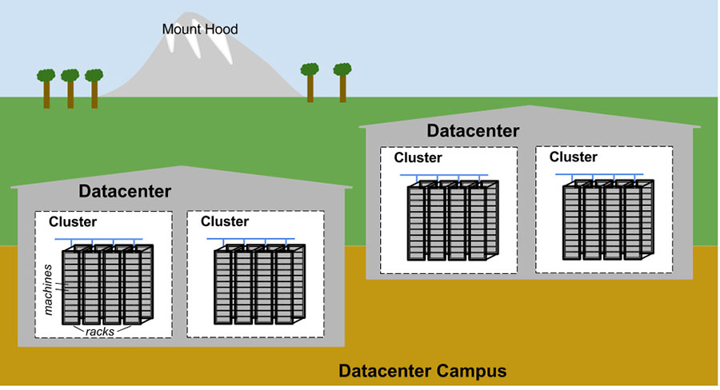
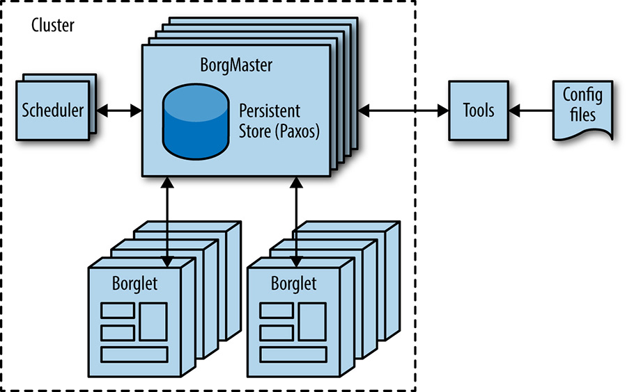
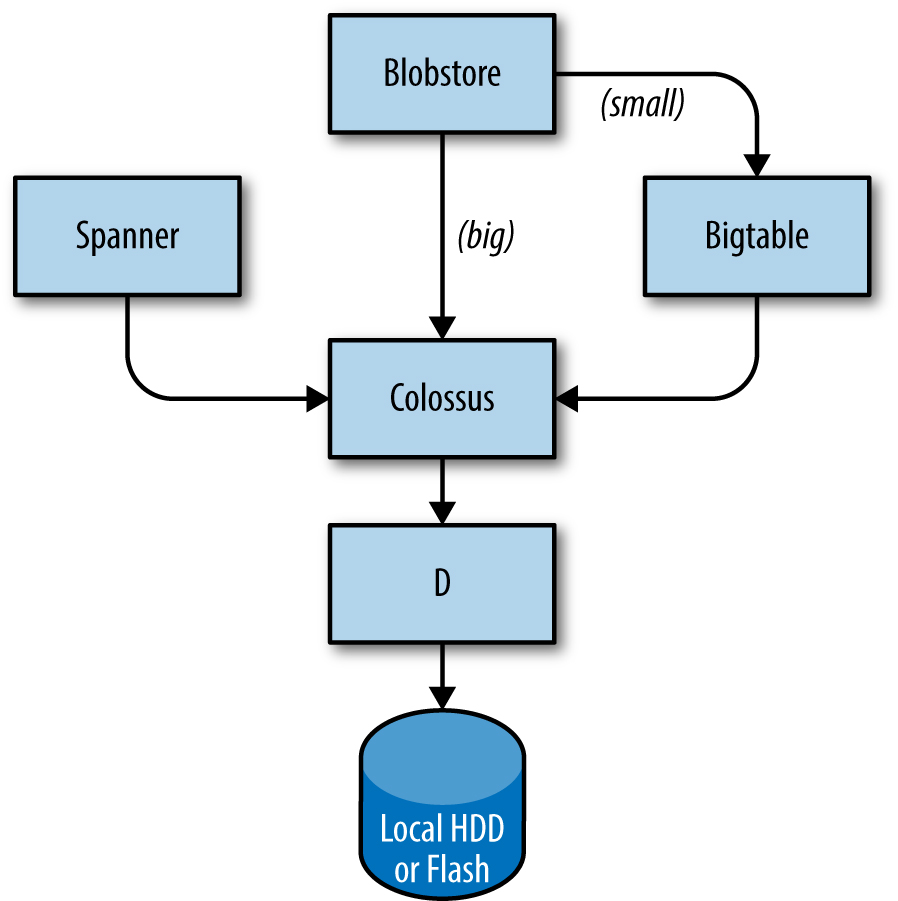
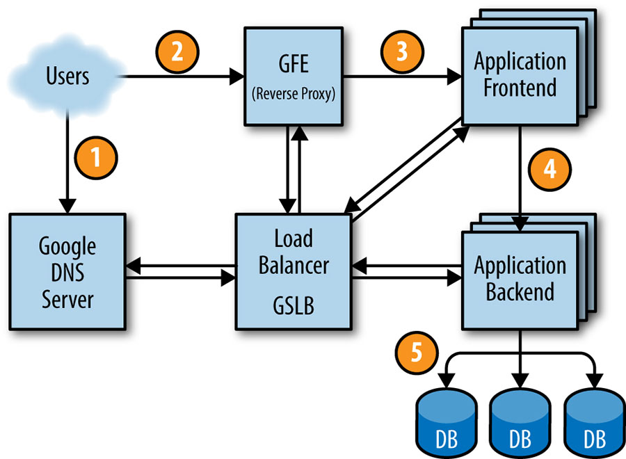

# Chương 2. Môi trường Production tại Google, từ góc nhìn của một SRE (The Production Environment at Google, from the Viewpoint of an SRE)

> **Nguyên bản:** [Chapter 2 - The Production Environment at Google, from the Viewpoint of an SRE](https://sre.google/sre-book/production-environment/)
> **Nguồn:** Google SRE Book (O'Reilly)
> **Bản dịch tiếng Việt** (Thực hiện bởi Đội ngũ R&D Softdreams)

---

*Tác giả:* JC van Winkel
*Biên tập:* Betsy Beyer

Các datacenter (trung tâm dữ liệu) của Google rất khác so với phần lớn datacenter thông thường và các trang farm server quy mô nhỏ. Những khác biệt này mang đến cả vấn đề lẫn cơ hội. Chương này thảo luận những thách thức và cơ hội đặc trưng cho các datacenter của Google và giới thiệu các thuật ngữ được sử dụng xuyên suốt quyển sách.

## Phần cứng (Hardware)

Phần lớn tài nguyên tính toán (compute resources) của Google nằm trong các datacenter mà Google tự thiết kế, với hệ thống phân phối điện, làm mát, mạng và phần cứng tính toán độc quyền (xem [[Bar13]](https://sre.google/sre-book/bibliography#Bar13)). Khác với datacenter colocation (thuê chỗ đặt thiết bị) "chuẩn", phần cứng tính toán trong datacenter do Google thiết kế là đồng nhất từ trên xuống dưới.[1](#fn1) Để loại bỏ sự nhầm lẫn giữa phần cứng server và phần mềm server, chúng tôi sử dụng các thuật ngữ sau xuyên suốt quyển sách:

#### Máy (Machine)

Một phần cứng (hoặc có thể là một VM — máy ảo)

**Server**

Một phần mềm triển khai một dịch vụ

Các machine có thể chạy bất kỳ server nào, nên chúng tôi không gán riêng các machine cụ thể cho các chương trình server cụ thể. Ví dụ, không có machine cụ thể nào chạy mail server của chúng tôi. Thay vào đó, việc phân bổ tài nguyên được xử lý bởi hệ điều hành cluster (cụm máy) của chúng tôi, *Borg*.

Chúng tôi nhận thức được rằng cách dùng từ *server* này là bất thường. Cách dùng thông thường gộp "binary (file thực thi) nhận kết nối mạng" với *machine*, nhưng phân biệt hai thứ là quan trọng khi nói về tính toán tại Google. Khi quen với cách dùng *server* của chúng tôi, bạn sẽ thấy rõ tại sao thuật ngữ chuyên biệt này có ý nghĩa — không chỉ trong Google mà còn xuyên suốt quyển sách.

[Hình 2-1](#fig-2-1) minh họa topology (sơ đồ mạng) của một datacenter Google:

-   Hàng chục machine được đặt trong một *rack* (giá rack).
-   Các rack đứng trong một *row* (hàng).
-   Một hoặc nhiều row tạo thành một *cluster* (cụm máy).
-   Thông thường một tòa nhà *datacenter* chứa nhiều cluster.
-   Nhiều tòa nhà datacenter nằm gần nhau tạo thành một *campus* (khu).

[Hình 2-1.](#fig-2-1) Topology ví dụ của một campus datacenter Google.

Các machine trong datacenter cần giao tiếp với nhau, nên chúng tôi tạo ra một virtual switch (bộ chuyển mạch ảo) rất nhanh với hàng chục nghìn cổng — kết nối hàng trăm switch do Google tự xây trong mạng dạng Clos [[Clos53]](https://sre.google/sre-book/bibliography#Clos53), đặt tên *Jupiter* [[Sin15]](https://sre.google/sre-book/bibliography#Sin15). Trong cấu hình lớn nhất, Jupiter hỗ trợ bisection bandwidth (băng thông khi chia đôi mạng) 1.3 Pbps giữa các server.

Các datacenter được kết nối với nhau bằng mạng backbone toàn cầu *B4* [[Jai13]](https://sre.google/sre-book/bibliography#Jai13) của chúng tôi — một kiến trúc SDN (mạng định nghĩa bằng phần mềm), chạy trên giao thức chuẩn mở OpenFlow. Nó cung cấp băng thông khổng lồ cho một số lượng site vừa phải, và sử dụng phân bổ băng thông co giãn (elastic bandwidth allocation) để tối đa hóa băng thông trung bình [[Kum15]](https://sre.google/sre-book/bibliography#Kum15).

## Phần mềm hệ thống "tổ chức" phần cứng

Phần cứng của chúng tôi phải được kiểm soát và quản trị bằng phần mềm xử lý được quy mô khổng lồ. Hỏng hóc phần cứng là vấn đề nổi bật mà chúng tôi quản lý bằng phần mềm. Với số lượng lớn các thành phần phần cứng trong một cluster, sự hỏng hóc phần cứng xảy ra khá thường xuyên. Chỉ trong một cluster, một năm điển hình đã có hàng nghìn machine hỏng và hàng nghìn ổ cứng (hard disk) hỏng; nhân lên với số cluster trên toàn cầu, con số này trở nên rất lớn. Do đó, chúng tôi muốn che giấu những vấn đề này khỏi người dùng, và các đội vận hành dịch vụ cũng không muốn bị làm phiền bởi sự hỏng hóc phần cứng. Mỗi campus datacenter có các đội chuyên [bảo trì phần cứng và cơ sở hạ tầng datacenter](https://sre.google/sre-book/managing-critical-state/).

## Quản lý các machine (Managing Machines)

*Borg* (xem [Hình 2-2](#fig-2-2)) là hệ điều hành cluster phân tán [[Ver15]](https://sre.google/sre-book/bibliography#Ver15), tương tự Apache Mesos.[2](#fn2) Borg quản lý job (công việc) ở cấp độ cluster.

[Hình 2-2.](#fig-2-2) Kiến trúc cấp cao của cluster Borg.

Borg chịu trách nhiệm chạy các *job* của người dùng — server chạy vĩnh viễn hoặc quá trình batch (lô) như MapReduce [[Dea04]](https://sre.google/sre-book/bibliography#Dea04). Một job có thể gồm nhiều (đôi khi hàng nghìn) *task* (nhiệm vụ) giống hệt nhau — vừa vì độ tin cậy, vừa vì một process (quá trình) đơn lẻ thường không xử lý nổi toàn bộ traffic của cluster. Khi Borg khởi động một job, nó tìm các machine cho các task và ra lệnh cho các machine khởi động chương trình server. Sau đó Borg liên tục giám sát các task này. Nếu một task gặp sự cố, nó bị kill (giết) và khởi động lại, có thể trên một machine khác.

Vì task được phân bổ linh hoạt trên các machine, chúng tôi không thể chỉ dựa vào địa chỉ IP và số cổng để tham chiếu. Giải pháp là thêm một tầng gián tiếp (indirection): khi khởi động một job, Borg cấp phát một tên và số index cho mỗi task bằng *Borg Naming Service* (BNS). Thay vì dùng địa chỉ IP và số cổng, các process khác kết nối đến task của Borg qua tên BNS — BNS sẽ dịch tên đó thành địa chỉ IP và số cổng. Ví dụ, đường dẫn BNS có thể là một chuỗi như `/bns/<*cluster*>/<*user*>/<*job name*>/<*task number*>`, sẽ được phân giải thành `<*IP address*>:<*port*>`.

Borg cũng chịu trách nhiệm phân bổ tài nguyên cho job. Mọi job phải chỉ định tài nguyên yêu cầu (ví dụ: 3 core CPU, 2 GiB RAM). Từ danh sách yêu cầu của tất cả job, Borg bin-packing task trên các machine theo cách tối ưu, đồng thời tính đến failure domain (miền lỗi). Ví dụ, Borg không chạy tất cả task của một job trên cùng một rack — làm vậy sẽ biến switch đầu rack thành điểm thất bại duy nhất (single point of failure) cho job đó.

Nếu một task cố dùng nhiều tài nguyên hơn đã yêu cầu, Borg sẽ kill task đó và khởi động lại (một task rơi vào crashloop — vòng lặp sập — còn tốt hơn một task không bao giờ được khởi động lại).

## Lưu trữ (Storage)

Task có thể dùng disk cục bộ trên machine như scratch pad (vùng đệm tạm), nhưng chúng tôi có nhiều tùy chọn lưu trữ cluster cho lưu trữ vĩnh viễn (và cả không gian tạm cũng sẽ chuyển sang mô hình lưu trữ cluster). Những tùy chọn này tương đương Lustre và Hadoop Distributed File System (HDFS) — đều là filesystem (hệ thống tệp) cluster mã nguồn mở.

Tầng lưu trữ chịu trách nhiệm cho phép người dùng truy cập dễ dàng và đáng tin cậy vào dung lượng lưu trữ có sẵn của cluster. Như được hiển thị trong [Hình 2-3](#fig-2-3), lưu trữ có nhiều tầng:

1.  Tầng thấp nhất, gọi là *D* (disk — ổ đĩa, dù D dùng cả ổ quay lẫn flash storage), là fileserver (server tệp) chạy trên hầu hết machine trong cluster. Tuy nhiên, người dùng không muốn phải nhớ machine nào đang giữ dữ liệu của mình — đây là lúc tầng tiếp theo vào cuộc.
2.  Tầng nằm trên D, gọi là *Colossus*, tạo ra một filesystem toàn cluster với ngữ nghĩa (semantics) chuẩn của filesystem, kèm sao chép (replication) và mã hóa (encryption). Colossus là người kế nhiệm của GFS, Google File System [[Ghe03]](https://sre.google/sre-book/bibliography#Ghe03).
3.  Có một số dịch vụ giống database (cơ sở dữ liệu) được xây dựng trên Colossus:
    1.  Bigtable [[Cha06]](https://sre.google/sre-book/bibliography#Cha06) là hệ thống database NoSQL xử lý được database hàng petabyte. Một Bigtable là map (cấu trúc ánh xạ) đa chiều, phân tán, bền vững, thưa (sparse), index theo row key (chìa hàng), column key (chìa cột) và timestamp (dấu thời gian); mỗi giá trị là mảng byte không diễn giải. Bigtable hỗ trợ replication xuyên datacenter theo kiểu eventually consistent (nhất quán cuối cùng).
    2.  Spanner [[Cor12]](https://sre.google/sre-book/bibliography#Cor12) cung cấp giao diện giống SQL cho người dùng cần consistency (nhất quán) thực sự trên toàn cầu.
    3.  Vài hệ thống database khác như *Blobstore* cũng có sẵn. Mỗi tùy chọn có trade-off (đánh đổi) riêng (xem [Data Integrity: What You Read Is What You Wrote](https://sre.google/sre-book/data-integrity/)).

[Hình 2-3.](#fig-2-3) Các phần của stack (tòa) lưu trữ Google.

## Mạng (Networking)

Phần cứng mạng của Google được kiểm soát theo nhiều cách. Như đã nói ở trên, chúng tôi dùng mạng định nghĩa bằng phần mềm (SDN) dựa trên OpenFlow. Thay vì phần cứng định tuyến "thông minh", chúng tôi dùng các thành phần chuyển mạch "đơn giản" (dumb) rẻ hơn, kết hợp với một bộ điều khiển tập trung (có sao chép) tính toán trước đường đi tốt nhất xuyên mạng. Nhờ vậy, các quyết định định tuyến tốn tài nguyên tính toán được đưa ra khỏi router, thay bằng phần cứng chuyển mạch đơn giản.

Băng thông mạng cần được phân bổ khôn ngoan. Cũng như Borg giới hạn tài nguyên tính toán cho task, Bandwidth Enforcer (BwE) quản lý băng thông có sẵn để tối đa hóa băng thông trung bình. Tối ưu băng thông không chỉ là chuyện chi phí: centralized traffic engineering (kỹ thuật traffic tập trung) đã được chứng minh giải quyết được nhiều vấn đề mà định tuyến phân tán truyền thống cực kỳ khó xử lý [[Kum15]](https://sre.google/sre-book/bibliography#Kum15).

Một số dịch vụ có job chạy trên nhiều cluster, phân bố toàn cầu. Để giảm độ trễ cho dịch vụ phân tán toàn cầu, chúng tôi hướng người dùng đến datacenter gần nhất có đủ năng lực. *Global Software Load Balancer* (GSLB) của chúng tôi thực hiện load balancing (cân bằng tải) ở ba cấp:

-   Load balancing địa lý cho các yêu cầu DNS (ví dụ, đến *www.google.com*), được mô tả trong [Load Balancing at the Frontend](https://sre.google/sre-book/load-balancing-frontend/)
-   Load balancing ở cấp độ dịch vụ người dùng (ví dụ, YouTube hay Google Maps)
-   Load balancing ở cấp độ Remote Procedure Call (RPC — lời gọi thủ tục từ xa), được mô tả trong [Load Balancing in the Datacenter](https://sre.google/sre-book/load-balancing-datacenter/)

Chủ sở hữu dịch vụ chỉ định một symbolic name (tên biểu tượng) cho dịch vụ, một danh sách địa chỉ BNS của các server, và năng lực có sẵn tại mỗi địa điểm (đo bằng queries per second — QPS). GSLB sau đó hướng traffic đến các địa chỉ BNS.

## Các phần mềm hệ thống khác

Một số thành phần khác trong datacenter cũng quan trọng.

## Dịch vụ khóa (Lock Service)

Dịch vụ khóa *Chubby* [[Bur06]](https://sre.google/sre-book/bibliography#Bur06) cung cấp API giống filesystem để duy trì lock (khóa). Chubby xử lý lock xuyên suốt các datacenter. Nó dùng giao thức Paxos cho Consensus (nhất trí) bất đồng bộ (xem [Managing Critical State: Distributed Consensus for Reliability](https://sre.google/sre-book/managing-critical-state/)).

Chubby cũng đóng vai trò quan trọng trong master election (bầu chọn master). Khi một dịch vụ chạy năm replica của một job vì độ tin cậy nhưng chỉ một replica được phép thực hiện công việc, Chubby chọn *replica nào* được tiếp tục.

Dữ liệu cần tính nhất quán thì phù hợp để lưu trong Chubby. Vì vậy, BNS dùng Chubby lưu mapping (ánh xạ) giữa đường dẫn BNS và các cặp `địa chỉ IP:cổng`.

## Giám sát và cảnh báo (Monitoring and Alerting)

Chúng tôi muốn đảm bảo tất cả dịch vụ đều chạy đúng yêu cầu. Do đó, chúng tôi chạy nhiều instance của *Borgmon* — chương trình giám sát nội bộ (xem [Practical Alerting from Time-Series Data](https://sre.google/sre-book/practical-alerting/)). Borgmon định kỳ "scrape" (vét) metrics (chỉ số) từ các server. Metrics dùng ngay cho cảnh báo, đồng thời được lưu trữ cho tổng quan lịch sử (ví dụ: biểu đồ). Chúng tôi có thể sử dụng giám sát theo một số cách:

-   Thiết lập cảnh báo cho các vấn đề cấp bách.
-   So sánh hành vi: một bản cập nhật phần mềm có khiến server nhanh hơn không?
-   Xem xét cách hành vi tiêu thụ tài nguyên diễn tiến theo thời gian, điều này là thiết yếu cho lập kế hoạch năng lực.

## Cơ sở hạ tầng phần mềm của chúng tôi

Kiến trúc phần mềm được thiết kế để khai thác hiệu quả nhất cơ sở hạ tầng phần cứng. Code đa luồng (multithreaded) mạnh, một task có thể dùng nhiều core dễ dàng. Để hỗ trợ dashboard, giám sát và debug, mỗi server có một HTTP server cung cấp thông tin chẩn đoán và thống kê cho task.

Tất cả dịch vụ của Google liên lạc qua hạ tầng Remote Procedure Call (RPC) có tên *Stubby*; phiên bản mã nguồn mở gRPC cũng có sẵn.[3](#fn3) Thường thì một lời gọi RPC được phát ra ngay cả khi thực chất chỉ là gọi subroutine (tiểu trình) trong chương trình cục bộ. Nhờ vậy, refactor lời gọi sang server khác trở nên dễ dàng khi cần mô-đun hóa hơn, hoặc khi codebase của server lớn lên. GSLB có thể load balance RPC theo cách tương tự như load balance các dịch vụ bên ngoài.

Một server nhận các yêu cầu RPC từ *frontend* (phía trước) của nó và gửi các RPC đến *backend* (phía sau) của nó. Theo thuật ngữ truyền thống, frontend được gọi là client (phía gọi) và backend được gọi là server (phía phục vụ).

Dữ liệu truyền đến và từ RPC bằng *protocol buffers* (bộ đệm giao thức),[4](#fn4) viết tắt "protobufs", tương tự Apache Thrift. Protocol buffers vượt trội hơn XML trong serialization (phân chuỗi) dữ liệu có cấu trúc: đơn giản hơn, nhỏ hơn 3–10 lần, nhanh hơn 20–100 lần, và ít mơ hồ hơn.

## Môi trường phát triển của chúng tôi (Development Environment)

Tốc độ phát triển (development velocity) rất quan trọng với Google, nên chúng tôi xây dựng môi trường phát triển hoàn chỉnh để tận dụng hạ tầng [[Mor12b]](https://sre.google/sre-book/bibliography#Mor12b).

Ngoại trừ vài nhóm có repository mã nguồn mở riêng (ví dụ: Android, Chrome), Google Software Engineer làm việc từ một repository (kho lưu trữ) chia sẻ duy nhất [[Pot16]](https://sre.google/sre-book/bibliography#Pot16). Điều này có vài hệ quả thực tiễn quan trọng:

-   Kỹ sư gặp vấn đề trong thành phần ngoài dự án của mình có thể sửa luôn, gửi thay đổi ("changelist," hay *CL*) cho chủ sở hữu review, rồi nộp CL vào mainline (nhánh chính).
-   Các thay đổi đối với mã nguồn trong dự án riêng của một kỹ sư yêu cầu một cuộc xem xét. Tất cả phần mềm đều được xem xét trước khi được nộp.

Khi build (dựng) phần mềm, yêu cầu build được gửi đến build server trong datacenter. Ngay cả build lớn cũng chạy nhanh vì nhiều build server compile (biên dịch) song song. Hạ tầng này cũng dùng cho continuous testing (kiểm thử liên tục). Mỗi khi nộp CL, kiểm thử chạy trên tất cả phần mềm có thể phụ thuộc vào CL đó — trực tiếp hoặc gián tiếp. Nếu framework xác định thay đổi có thể làm hỏng phần khác trong hệ thống, nó thông báo cho chủ sở hữu. Một số dự án dùng push-on-green (đẩy khi xanh): phiên bản mới tự động đẩy lên production sau khi vượt qua kiểm thử.

## Shakespeare: Một dịch vụ mẫu (A Sample Service)

Để hình dung cách một dịch vụ được triển khai trong môi trường production của Google, xem một dịch vụ ví dụ tương tác với nhiều công nghệ Google. Giả sử chúng tôi muốn cung cấp dịch vụ cho phép tìm xem một từ nhất định xuất hiện ở đâu trong tất cả tác phẩm của Shakespeare.

Chúng ta có thể chia hệ thống này thành hai phần:

-   Thành phần batch đọc toàn bộ văn bản Shakespeare, tạo index (chỉ mục), viết vào Bigtable. Job này chỉ cần chạy một lần, hoặc rất hiếm khi (bảo chưa thể có văn bản mới xuất hiện!).
-   Frontend ứng dụng xử lý yêu cầu của người dùng cuối. Job này luôn chạy vì người dùng ở mọi múi giờ đều có thể muốn tìm trong tác phẩm Shakespeare.

Thành phần batch là một MapReduce gồm ba giai đoạn.

Giai đoạn mapping đọc văn bản Shakespeare, tách thành các từ riêng lẻ — nhanh hơn khi nhiều worker (công nhân) chạy song song.

Giai đoạn shuffle sắp xếp các tuple (bộ) theo từ.

Trong giai đoạn reduce, một tuple (*word — từ*, *list of locations — danh sách các vị trí*) được tạo ra.

Mỗi tuple được viết vào một hàng trong Bigtable, sử dụng từ làm key (chìa khóa).

## Vòng đời của một yêu cầu (Life of a Request)

[Hình 2-4](#fig-2-4) cho thấy yêu cầu của người dùng được xử lý thế nào: đầu tiên, người dùng trỏ trình duyệt đến *shakespeare.google.com*. Thiết bị phân giải địa chỉ với [DNS server](https://sre.google/sre-book/load-balancing-frontend/) (1). Yêu cầu đến DNS server của Google, nơi nói chuyện với GSLB. GSLB theo dõi tải traffic giữa các frontend server xuyên các khu vực, nên chọn địa chỉ IP server phù hợp để gửi cho người dùng.

[Hình 2-4.](#fig-2-4) Vòng đời của một yêu cầu.

Trình duyệt kết nối đến HTTP server trên IP này. Server đó (Google Frontend — GFE) là reverse proxy (proxy ngược) terminate (kết thúc) kết nối TCP (2). GFE tra cứu dịch vụ được yêu cầu (tìm kiếm web, maps, hay — ở đây — Shakespeare). Lại dùng GSLB, server tìm một frontend server Shakespeare khả dụng, gửi RPC chứa yêu cầu HTTP (3).

Server Shakespeare phân tích yêu cầu HTTP, xây dựng protobuf chứa từ cần tra cứu. Frontend server Shakespeare cần liên lạc với backend server: frontend hỏi GSLB lấy địa chỉ BNS của backend server phù hợp, không quá tải (4). Backend server đó liên lạc với Bigtable server để lấy dữ liệu (5).

Câu trả lời được viết vào protobuf reply, trả về backend server Shakespeare. Backend giao protobuf chứa kết quả cho frontend server Shakespeare — nơi assemble (lắp ráp) HTML và trả về cho người dùng.

Toàn bộ chuỗi sự kiện này diễn ra trong nháy mắt — chỉ vài trăm mili giây! Nhiều bộ phận liên quan nên có nhiều điểm lỗi tiềm năng; đặc biệt, GSLB hỏng sẽ gây hỗn loạn. Tuy nhiên, chính sách kiểm thử nghiêm ngặt và rollout cẩn thận của Google, cùng các phương pháp phục hồi lỗi chủ động như graceful degradation (suy giảm nhẹ nhàng), cho phép chúng tôi cung cấp [dịch vụ đáng tin cậy](https://sre.google/sre-book/part-III-practices/) mà người dùng đã quen. Sau cùng, người ta thường dùng *www.google.com* để kiểm tra kết nối Internet.

## Tổ chức job và dữ liệu (Job and Data Organization)

Load test cho thấy backend server xử lý được khoảng 100 query/giây (QPS). Thử nghiệm với nhóm người dùng giới hạn cho kỳ vọng peak load (tải đỉnh) khoảng 3.470 QPS, nên cần ít nhất 35 task. Tuy nhiên, các cân nhắc sau đòi hỏi ít nhất 37 task (N+2):

-   Trong quá trình cập nhật, một task một lúc sẽ không khả dụng, còn lại 36 task.
-   Một sự hỏng hóc machine có thể xảy ra trong khi cập nhật một task, còn lại chỉ 35 task, vừa đủ để phục vụ tải đỉnh.[5](#fn5)

Khảo sát kỹ hơn traffic người dùng cho thấy peak usage phân bố toàn cầu: 1.430 QPS từ Bắc Mỹ, 290 từ Nam Mỹ, 1.400 từ châu Âu và châu Phi, 350 từ châu Á và Australia. Thay vì đặt tất cả backend tại một site, chúng tôi phân bổ chúng khắp nước Mỹ, Nam Mỹ, châu Âu và châu Á. Dự phòng N+2 cho mỗi khu vực cho kết quả: 17 task ở nước Mỹ, 16 ở châu Âu, 6 ở châu Á. Tuy nhiên, ở Nam Mỹ chúng tôi chỉ dùng 4 task (thay vì 5) để giảm từ N+2 xuống N+1 — chấp nhận rủi ro nhỏ về độ trễ cao hơn để đổi lấy chi phí phần cứng thấp hơn: nếu GSLB chuyển traffic sang lục địa khác khi datacenter Nam Mỹ quá tải, tiết kiệm 20% chi phí phần cứng. Ở khu vực lớn hơn, task được trải trên 2–3 cluster để tăng resilience (khả năng phục hồi).

Backend cần liên lạc với Bigtable chứa dữ liệu, nên yếu tố lưu trữ cũng phải thiết kế chiến lược. Backend ở châu Á gọi Bigtable ở nước Mỹ sẽ thêm độ trễ đáng kể, nên chúng tôi replicate (sao chép) Bigtable ở mỗi khu vực. Replication giúp theo hai cách: phục hồi khi Bigtable server hỏng, và giảm độ trễ truy cập dữ liệu. Bigtable chỉ cung cấp eventual consistency, nhưng không thành vấn đề vì chúng tôi không cập nhật nội dung thường xuyên.

Chương này giới thiệu rất nhiều thuật ngữ; dù không cần nhớ tất cả, chúng sẽ là nền tảng cho nhiều hệ thống được tham khảo ở các chương sau.

[1](#fn1) Chà, *xấp xỉ* giống nhau. Phần lớn là. Ngoại trừ những thứ khác nhau. Một số datacenter kết thúc với nhiều thế hệ phần cứng tính toán, và đôi khi chúng tôi bổ sung các datacenter sau khi chúng được xây dựng. Nhưng phần lớn, phần cứng datacenter của chúng tôi là đồng nhất.

[2](#fn2) Một số người đọc có thể quen thuộc hơn với hậu duệ của Borg, Kubernetes — một khung điều phối Container Cluster mã nguồn mở do Google khởi động vào năm 2014; xem [*https://kubernetes.io*](https://kubernetes.io) và [[Bur16]](https://sre.google/sre-book/bibliography#Bur16). Để biết thêm chi tiết về sự tương đồng giữa Borg và Apache Mesos, xem [[Ver15]](https://sre.google/sre-book/bibliography#Ver15).

[3](#fn3) Xem [*https://grpc.io*](https://grpc.io).

[4](#fn4) Protocol buffers là một cơ chế mở rộng trung lập ngôn ngữ, trung lập nền tảng, để phân chuỗi dữ liệu có cấu trúc. Để biết thêm chi tiết, xem [*https://developers.google.com/protocol-buffers/*](https://developers.google.com/protocol-buffers/).

[5](#fn5) Chúng tôi giả định rằng xác suất hai task hỏng đồng thời trong môi trường của chúng tôi đủ thấp để có thể bỏ qua. Các điểm thất bại duy nhất, như switch đầu rack hoặc phân phối điện, có thể làm cho giả định này không hợp lệ trong các môi trường khác.

---

Copyright © 2017 Google, Inc. Published by O'Reilly Media, Inc. Licensed under [CC BY-NC-ND 4.0](https://creativecommons.org/licenses/by-nc-nd/4.0/)
