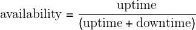

# Chương 3. Đón nhận Rủi ro (Embracing Risk)

> **Nguyên bản:** [Chapter 3 - Embracing Risk](https://sre.google/sre-book/embracing-risk/)
> **Nguồn:** Google SRE Book (O'Reilly)
> **Bản dịch tiếng Việt** (do AI hỗ trợ)

---

*Tác giả:* Marc Alvidrez
*Biên tập:* Kavita Guliani

Bạn có thể nghĩ rằng Google cố xây dựng các dịch vụ đáng tin cậy 100% — những dịch vụ không bao giờ hỏng. Nhưng thực tế, vượt quá một điểm nhất định, việc tăng độ tin cậy lại có hại thay vì có lợi cho dịch vụ (và người dùng của nó)! Độ tin cậy cực đoan đi kèm với cái giá: tối đa hóa sự ổn định sẽ làm chậm tốc độ phát triển tính năng mới và tốc độ đưa sản phẩm đến tay người dùng, đồng thời đẩy chi phí của chúng lên rất cao, qua đó làm giảm số tính năng mà một đội có thể chi trả. Hơn nữa, người dùng thường không nhận ra sự khác biệt giữa độ tin cậy cao và độ tin cậy cực đoan, vì trải nghiệm của họ bị chi phối bởi các thành phần kém tin cậy hơn như mạng di động hay thiết bị họ đang dùng. Nói ngắn gọn, một người dùng trên chiếc smartphone chỉ đạt 99% độ tin cậy sẽ không phân biệt được độ tin cậy dịch vụ 99.99% và 99.999%! Vì vậy, thay vì chỉ tối đa hóa uptime (thời gian hoạt động), Site Reliability Engineering (kỹ thuật độ tin cậy trang web) tìm cách cân bằng rủi ro không khả dụng với các mục tiêu đổi mới nhanh và vận hành dịch vụ hiệu quả, để sự hài lòng tổng thể của người dùng — về tính năng, dịch vụ và hiệu năng — được tối ưu.

## Quản lý Rủi ro

Các hệ thống không tin cậy có thể nhanh chóng xói mòn niềm tin của người dùng, nên chúng tôi muốn giảm cơ hội hệ thống thất bại. Tuy nhiên, kinh nghiệm cho thấy khi chúng tôi xây dựng các hệ thống, chi phí không tăng tuyến tính khi độ tin cậy tăng thêm — một cải tiến tăng thêm về độ tin cậy có thể tốn kém gấp 100 lần so với bước tăng trước đó. Sự tốn kém có hai chiều:

#### Chi phí của tài nguyên máy/tính toán dự phòng (redundant)

Chi phí của thiết bị dự phòng, ví dụ cho phép chúng tôi đưa hệ thống offline để bảo trì định kỳ hoặc ngoài dự kiến, hoặc để dành chỗ lưu các khối parity code (mã kiểm tra chẵn lẻ) nhằm đảm bảo độ bền dữ liệu tối thiểu.

#### Chi phí cơ hội (opportunity cost)

Chi phí mà một tổ chức gánh chịu khi nó phân bổ tài nguyên kỹ thuật để xây dựng các hệ thống hoặc tính năng làm giảm rủi ro, thay vì các tính năng mà người dùng cuối có thể nhìn thấy hoặc sử dụng trực tiếp. Những kỹ sư này không còn làm việc trên các tính năng và sản phẩm mới cho người dùng cuối nữa.

Trong SRE, chúng tôi quản lý độ tin cậy dịch vụ phần lớn bằng cách quản lý rủi ro, và xem rủi ro như một phổ (continuum). Vì thế, nâng cao độ tin cậy của các hệ thống Google và xác định mức chấp nhận rủi ro phù hợp cho các dịch vụ mà chúng tôi vận hành đều quan trọng ngang nhau. Nhờ đó, chúng tôi có thể thực hiện phân tích chi phí/lợi ích để xác định, ví dụ, nên đặt Search, Ads, Gmail hay Photos ở đâu trên phổ rủi ro (không tuyến tính). Mục tiêu là gắn mức rủi ro mà một dịch vụ cụ thể chấp nhận với mức rủi ro mà business sẵn sàng gánh chịu. Chúng tôi nỗ lực làm dịch vụ đủ tin cậy, nhưng không tin cậy *dư* so với mức cần. Nghĩa là, khi đặt mục tiêu khả dụng 99.99%, chúng tôi muốn vượt qua nó nhưng không quá xa: vượt quá nhiều sẽ lãng phí cơ hội thêm tính năng, dọn nợ kỹ thuật (technical debt) hoặc giảm chi phí vận hành. Theo một nghĩa nào đó, chúng tôi coi mục tiêu khả dụng vừa là mức sàn vừa là mức trần. Ưu điểm chính của cách tiếp cận này là nó cho phép chấp nhận rủi ro rõ ràng, có suy xét.

## Đo lường Rủi ro Dịch vụ

Theo thông lệ tại Google, cách hữu hiệu nhất thường là xác định một metrics khách quan đại diện cho thuộc tính của hệ thống mà chúng tôi muốn tối ưu. Bằng cách đặt một mục tiêu, chúng tôi có thể đánh giá hiệu suất hiện tại và theo dõi các cải thiện hoặc suy giảm theo thời gian. Với rủi ro dịch vụ, việc rút gọn tất cả các yếu tố tiềm năng thành một metrics duy nhất không phải chuyện dễ thấy ngay. Các sự cố thất bại của dịch vụ có thể gây ra nhiều hiệu ứng tiềm năng, bao gồm sự không hài lòng, tổn hại, hoặc mất niềm tin của người dùng; mất doanh thu trực tiếp hoặc gián tiếp; tác động thương hiệu hoặc danh tiếng; và sự đưa tin báo chí không mong muốn. Rõ ràng, một số yếu tố trong số này rất khó đo lường. Để làm cho vấn đề này khả thi và nhất quán trên nhiều loại hệ thống mà chúng tôi vận hành, chúng tôi tập trung vào *downtime không lên kế hoạch* (unplanned downtime).

Đối với phần lớn các dịch vụ, cách trực tiếp nhất để thể hiện mức độ chấp nhận rủi ro là theo mức độ downtime không lên kế hoạch được chấp nhận. Mức *khả dụng dịch vụ* (service availability) mong muốn cho phép nắm bắt mức downtime không lên kế hoạch, thường được biểu đạt theo số lượng "nines" (số chín) mà chúng tôi muốn cung cấp: 99.9%, 99.99%, hoặc 99.999% khả dụng. Mỗi nine thêm vào tương ứng với một bậc cải thiện tiến đến khả dụng 100%. Với các hệ thống phục vụ (serving system), metrics này thường được tính theo tỷ lệ uptime của hệ thống (xem [Khả dụng theo thời gian](#kha-dung-theo-thoi-gian)).

### Khả dụng theo thời gian (Time-based availability)

Sử dụng công thức này trên một khoảng thời gian một năm, chúng tôi có thể tính toán số phút downtime cho phép để đạt được một số nine khả dụng nhất định. Ví dụ, một hệ thống với mục tiêu khả dụng 99.99% có thể down tối đa 52.56 phút trong một năm và vẫn nằm trong mục tiêu khả dụng; xem [Availability Table](https://sre.google/sre-book/availability-table#appendix_table-of-nines) để có một bảng.

Tuy nhiên, tại Google, metrics khả dụng theo thời gian thường không có ý nghĩa vì chúng tôi xem xét trên các dịch vụ phân tán toàn cầu. Cách tiếp cận cách ly lỗi (fault isolation) của chúng tôi khiến gần như chắc chắn rằng vào bất kỳ lúc nào, chúng tôi cũng đang phục vụ ít nhất một phần traffic của một dịch vụ ở đâu đó trên thế giới (tức là luôn "up" (hoạt động) ít nhất một phần). Vì vậy, thay vì dùng các metrics quanh uptime, chúng tôi định nghĩa khả dụng theo *request success rate* (tỷ lệ yêu cầu thành công). [Khả dụng tổng hợp](#kha-dung-tong-hop) cho thấy cách metrics dựa trên yield này được tính trên một cửa sổ trượt (tức là tỷ lệ các yêu cầu thành công trong một ngày).

### Khả dụng tổng hợp (Aggregate availability)

Ví dụ, một hệ thống phục vụ 2.5 triệu yêu cầu trong một ngày với mục tiêu khả dụng hàng ngày 99.99% có thể phục vụ tối đa 250 lỗi và vẫn đạt mục tiêu cho ngày cụ thể đó.

Trong một ứng dụng điển hình, không phải mọi yêu cầu đều ngang nhau: thất bại một yêu cầu đăng ký người dùng mới là khác với thất bại một yêu cầu poll (truy vấn định kỳ) email mới chạy nền. Trong nhiều trường hợp, tính khả dụng theo request success rate trên toàn bộ các yêu cầu vẫn là một xấp xỉ hợp lý của downtime không lên kế hoạch, nhìn từ phía người dùng cuối.

Việc lượng hóa downtime không lên kế hoạch dưới dạng request success rate cũng làm cho metrics khả dụng này dễ dùng hơn với các hệ thống không trực tiếp phục vụ người dùng cuối. Phần lớn các hệ thống không phục vụ (ví dụ batch, pipeline, storage, transactional) có một khái niệm rõ ràng về đơn vị công việc thành công và thất bại. Đúng là các hệ thống được bàn trong chương này chủ yếu là hệ thống phục vụ người tiêu dùng và cơ sở hạ tầng, nhưng nhiều nguyên lý tương tự cũng áp dụng được cho các hệ thống không phục vụ với rất ít điều chỉnh.

Ví dụ, một quá trình batch trích xuất, chuyển đổi và chèn nội dung từ một trong các database của khách hàng vào data warehouse (kho dữ liệu) để phân tích thêm, có thể được đặt chạy định kỳ. Dùng request success rate được định nghĩa theo các bản ghi xử lý thành công và thất bại, chúng tôi vẫn có thể tính được một metrics khả dụng hữu ích dù hệ thống batch không chạy liên tục.

Phổ biến nhất là chúng tôi đặt mục tiêu khả dụng hàng quý cho mỗi dịch vụ và theo dõi hiệu suất so với mục tiêu đó theo tuần, thậm chí theo ngày. Chiến lược này cho phép chúng tôi quản lý dịch vụ theo một mục tiêu khả dụng tổng quát bằng cách tìm, truy tìm và sửa các sai lệch có ý nghĩa khi chúng không thể tránh khỏi phát sinh. Xem [Service Level Objectives](04-service-level-objectives.md) để biết thêm.

## Mức độ Chấp nhận Rủi ro của các Dịch vụ

Xác định mức độ chấp nhận rủi ro của một dịch vụ có nghĩa là gì? Trong một môi trường chính thức hoặc trong trường hợp các hệ thống an toàn quan trọng, mức độ chấp nhận rủi ro của các dịch vụ thường được xây dựng trực tiếp vào định nghĩa sản phẩm hoặc dịch vụ cơ bản. Tại Google, mức độ chấp nhận rủi ro của các dịch vụ có xu hướng được định nghĩa kém rõ ràng hơn.

Để xác định mức độ chấp nhận rủi ro của một dịch vụ, các SRE phải phối hợp với các product owner (chủ sở hữu sản phẩm) để chuyển một tập mục tiêu business thành các mục tiêu rõ ràng mà chúng tôi có thể hiện thực hóa về mặt kỹ thuật. Ở đây, các mục tiêu business mà chúng ta quan tâm đều tác động trực tiếp đến hiệu năng và độ tin cậy của dịch vụ. Trên thực tế, việc chuyển đổi này dễ nói hơn là làm. Trong khi các dịch vụ người tiêu dùng thường có product owner rõ ràng, các dịch vụ cơ sở hạ tầng (ví dụ hệ thống lưu trữ hay một tầng cache HTTP đa mục đích) hiếm khi có cấu trúc sở hữu sản phẩm tương tự. Chúng tôi sẽ xét lần lượt hai trường hợp người tiêu dùng và cơ sở hạ tầng.

## Xác định Mức độ Chấp nhận Rủi ro của các Dịch vụ Người tiêu dùng

Các dịch vụ người tiêu dùng của chúng tôi thường có một đội sản phẩm đóng vai trò chủ sở hữu business cho một ứng dụng. Ví dụ, Search, Google Maps và Google Docs mỗi thứ đều có đội product manager (quản lý sản phẩm) riêng. Các product manager này có nhiệm vụ hiểu người dùng và business, và định hình sản phẩm để thành công trên thị trường. Khi có đội sản phẩm, đội đó thường là nguồn tốt nhất để bàn về các yêu cầu độ tin cậy của một dịch vụ. Khi không có đội sản phẩm chuyên trách, các kỹ sư xây dựng hệ thống thường vô tình đảm nhận vai trò này.

Có nhiều yếu tố cần xem xét khi đánh giá mức độ chấp nhận rủi ro của các dịch vụ, chẳng hạn như:

-   Mức khả dụng nào là cần thiết?
-   Các loại thất bại khác nhau có các hiệu ứng khác nhau đối với dịch vụ không?
-   Chúng ta có thể dùng chi phí dịch vụ để giúp định vị dịch vụ trên phổ rủi ro như thế nào?
-   Các metrics dịch vụ quan trọng khác nào nên được tính đến?

### Mức khả dụng mục tiêu

Mức khả dụng mục tiêu cho một dịch vụ Google cụ thể thường phụ thuộc vào chức năng mà nó cung cấp và cách dịch vụ được định vị trên thị trường. Danh sách sau bao gồm các vấn đề cần xem xét:

-   Người dùng sẽ kỳ vọng mức dịch vụ nào?
-   Dịch vụ này có gắn trực tiếp với doanh thu (hoặc doanh thu của chúng tôi, hoặc doanh thu của khách hàng chúng tôi) không?
-   Đây là một dịch vụ trả phí, hay miễn phí?
-   Nếu có đối thủ cạnh tranh trên thị trường, các đối thủ đó cung cấp mức dịch vụ nào?
-   Dịch vụ này nhắm đến người tiêu dùng, hay doanh nghiệp?

Hãy xét các yêu cầu của Google Apps for Work. Phần lớn người dùng của nó là người dùng doanh nghiệp, có nơi lớn, có nơi nhỏ. Các doanh nghiệp này dựa vào các dịch vụ Google Apps for Work (ví dụ Gmail, Calendar, Drive, Docs) để cung cấp công cụ giúp nhân viên của họ làm việc hàng ngày. Nói cách khác, một outage của dịch vụ Google Apps for Work là outage không chỉ của Google mà còn của tất cả các doanh nghiệp phụ thuộc quan trọng vào chúng tôi. Với một dịch vụ Google Apps for Work điển hình, chúng tôi có thể đặt mục tiêu khả dụng hàng quý bên ngoài là 99.9%, và củng cố mục tiêu này bằng một mục tiêu khả dụng nội bộ cao hơn cùng một hợp đồng quy định hình phạt nếu chúng tôi không đạt được mục tiêu bên ngoài.

YouTube là một trường hợp cân nhắc tương phản. Khi Google mua YouTube, chúng tôi phải quyết định mục tiêu khả dụng phù hợp cho website. Năm 2006, YouTube tập trung vào người tiêu dùng và đang ở giai đoạn vòng đời business rất khác so với Google lúc bấy giờ. Dù YouTube đã có một sản phẩm tuyệt vời, nó vẫn đang thay đổi và phát triển nhanh. Chúng tôi đặt mục tiêu khả dụng thấp hơn cho YouTube so với các sản phẩm doanh nghiệp vì lúc đó tốc độ phát triển tính năng quan trọng tương ứng hơn.

### Các loại thất bại

Hình dạng dự kiến của các thất bại với một dịch vụ cụ thể cũng là một cân nhắc quan trọng. Business của chúng tôi chống chịu thế nào trước downtime dịch vụ? Với dịch vụ, cái nào tệ hơn: một tỷ lệ thất bại thấp nhưng kéo dài, hay một outage toàn site thỉnh thoảng? Cả hai loại có thể dẫn đến cùng một số lỗi tuyệt đối, nhưng tác động đến business lại rất khác nhau.

Một ví dụ cho thấy khác biệt giữa outage toàn bộ và cục bộ thường xuất hiện trong các hệ thống phục vụ thông tin cá nhân. Hãy xét một ứng dụng quản lý liên hệ, và so sánh giữa các thất bại gián đoạn khiến ảnh hồ sơ không hiển thị được với một trường hợp thất bại khiến danh bạ cá nhân của một người dùng bị hiển thị cho người dùng khác. Trường hợp đầu tiên rõ ràng là trải nghiệm người dùng tệ, và các SRE sẽ nỗ lực khắc phục nhanh. Trường hợp thứ hai, rủi ro phơi bày dữ liệu cá nhân có thể làm suy yếu nghiêm trọng niềm tin cơ bản của người dùng. Vì vậy, đối với trường hợp thứ hai, việc đưa dịch vụ offline hoàn toàn trong giai đoạn debug và dọn dẹp là hợp lý.

Ở đầu kia của các dịch vụ Google cung cấp, đôi khi có thể chấp nhận outage định kỳ trong các maintenance window (cửa sổ bảo trì). Cách đây một vài năm, Ads Frontend từng là một dịch vụ như vậy. Các nhà quảng cáo và nhà xuất bản website dùng nó để thiết lập, cấu hình, chạy và giám sát các chiến dịch quảng cáo. Vì phần lớn công việc này diễn ra trong giờ hành chính, chúng tôi xác định rằng các outage định kỳ, đều đặn, được lên kế hoạch dưới dạng maintenance window là có thể chấp nhận được, và chúng tôi xếp những outage này vào planned downtime (downtime có kế hoạch) chứ không phải unplanned downtime.

### Chi phí

Chi phí thường là yếu tố then chốt khi xác định mục tiêu khả dụng phù hợp cho một dịch vụ. Ads ở vị trí đặc biệt thuận lợi để thực hiện đánh đổi này vì yêu cầu thành công hay thất bại có thể quy đổi trực tiếp thành doanh thu thu được hoặc mất đi. Khi xác định mục tiêu khả dụng cho mỗi dịch vụ, chúng tôi đặt các câu hỏi như:

-   Nếu chúng tôi xây dựng và vận hành các hệ thống này ở một nine khả dụng cao hơn, sự tăng thêm về doanh thu của chúng tôi sẽ là bao nhiêu?
-   Doanh thu thêm này có bù đắp được chi phí để đạt được mức độ tin cậy đó không?

Để làm cho phương trình đánh đổi này cụ thể hơn, hãy xem xét chi phí/lợi ích sau đây cho một dịch vụ ví dụ mà mỗi yêu cầu có giá trị bằng nhau:

-   Cải thiện mục tiêu khả dụng đề xuất: 99.9% → 99.99%
-   Tăng khả dụng đề xuất: 0.09%
-   Doanh thu dịch vụ: $1M
-   Giá trị của khả dụng cải thiện: $1M \* 0.0009 = $900

Trong trường hợp này, nếu chi phí cải thiện khả dụng một nine ít hơn $900, nó đáng để đầu tư. Nếu chi phí lớn hơn $900, chi phí sẽ vượt quá mức tăng doanh thu dự kiến.

Việc đặt các mục tiêu này có thể khó hơn khi chúng tôi không có một hàm quy đổi đơn giản giữa độ tin cậy và doanh thu. Một chiến lược hữu ích là xem xét tỷ lệ lỗi nền của các ISP (nhà cung cấp dịch vụ Internet) trên Internet. Nếu thất bại được đo từ góc nhìn người dùng cuối và ta có thể đẩy tỷ lệ lỗi của dịch vụ xuống dưới tỷ lệ lỗi nền, thì những lỗi đó sẽ rơi vào phần nhiễu của kết nối Internet cho một người dùng cụ thể. Dù có khác biệt đáng kể giữa các ISP và giao thức (ví dụ TCP so với UDP, IPv4 so với IPv6), chúng tôi đo được tỷ lệ lỗi nền điển hình của các ISP nằm trong khoảng từ 0,01% đến 1%.

### Các metrics dịch vụ khác

Xét mức độ chấp nhận rủi ro của các dịch vụ qua các metrics ngoài khả dụng thường cho nhiều lợi ích. Hiểu metrics nào quan trọng và metrics nào không cho chúng tôi nhiều tự do hơn khi chấp nhận rủi ro có suy xét.

Độ trễ dịch vụ (service latency) của các hệ thống Ads là một ví dụ minh họa. Khi Google ra mắt Web Search, một trong những tính năng phân biệt chính của dịch vụ là tốc độ. Khi giới thiệu AdWords — hiển thị quảng cáo bên cạnh kết quả tìm kiếm — một yêu cầu chính của hệ thống là quảng cáo không được làm chậm trải nghiệm tìm kiếm. Yêu cầu này đã định hình các mục tiêu kỹ thuật qua từng thế hệ hệ thống AdWords và được xem là một bất biến (invariant).

AdSense, hệ thống quảng cáo của Google phục vụ các quảng cáo ngữ cảnh (contextual ads) để đáp lại các yêu cầu từ code JavaScript mà nhà xuất bản chèn vào website, lại có mục tiêu độ trễ rất khác. Mục tiêu của AdSense là tránh làm chậm việc render (hiển thị) của trang bên thứ ba khi chèn quảng cáo ngữ cảnh. Mục tiêu độ trễ cụ thể, do đó, phụ thuộc vào tốc độ render trang của từng nhà xuất bản. Điều này nghĩa là quảng cáo AdSense nhìn chung có thể được phục vụ chậm hơn quảng cáo AdWords hàng trăm mili giây.

Yêu cầu độ trễ nới lỏng hơn này cho phép chúng tôi thực hiện nhiều đánh đổi thông minh trong việc provision (cấp phát tài nguyên) — tức xác định số lượng và vị trí các tài nguyên phục vụ — tiết kiệm đáng kể chi phí so với provision theo cách mặc định. Nói cách khác, vì AdSense không quá nhạy cảm với các thay đổi độ trễ ở mức vừa phải, chúng tôi có thể gộp việc phục vụ vào ít vị trí địa lý hơn, giảm chi phí vận hành.

## Xác định Mức độ Chấp nhận Rủi ro của các Dịch vụ Cơ sở Hạ tầng

Yêu cầu để xây dựng và vận hành các thành phần cơ sở hạ tầng khác với yêu cầu cho sản phẩm người tiêu dùng theo một số cách. Một khác biệt cơ bản là các thành phần cơ sở hạ tầng, theo định nghĩa, luôn có nhiều client (khách hàng) với các nhu cầu thường khác nhau.

### Mức khả dụng mục tiêu

Hãy xem xét Bigtable [[Cha06]](https://sre.google/sre-book/bibliography#Cha06), một hệ thống lưu trữ phân tán quy mô khổng lồ cho dữ liệu có cấu trúc. Một số dịch vụ người tiêu dùng phục vụ dữ liệu trực tiếp từ Bigtable trong đường đi của một yêu cầu. Những dịch vụ này cần độ trễ thấp và độ tin cậy cao. Các đội khác dùng Bigtable như một repository (kho dữ liệu) cho dữ liệu phục vụ phân tích offline (ví dụ MapReduce) định kỳ. Những đội này thường quan tâm nhiều hơn đến throughput (lưu lượng) hơn là độ tin cậy. Mức độ chấp nhận rủi ro của hai use case (tình huống sử dụng) này khá khác nhau.

Một cách để đáp ứng nhu cầu của cả hai use case là đầu tư kỹ thuật để đưa mọi dịch vụ cơ sở hạ tầng lên cực kỳ đáng tin cậy. Nhưng vì các dịch vụ cơ sở hạ tầng này thường gom lại một lượng lớn tài nguyên, cách làm đó trong thực tế thường đắt đỏ hơn rất nhiều. Để hiểu nhu cầu khác nhau của các loại người dùng, bạn có thể xem xét trạng thái mong muốn của hàng đợi yêu cầu (request queue) cho mỗi loại người dùng Bigtable.

### Các loại thất bại

Người dùng độ trễ thấp muốn hàng đợi yêu cầu của Bigtable (gần như luôn) trống để hệ thống xử lý mỗi yêu cầu ngay khi đến. (Thực tế, xếp hàng kém hiệu quả thường là nguyên nhân gây độ trễ tail cao.) Người dùng quan tâm đến phân tích offline thì quan tâm hơn đến throughput của hệ thống, nên họ muốn hàng đợi yêu cầu không bao giờ trống. Để tối ưu throughput, hệ thống Bigtable không nên để idle (nghỉ) chờ yêu cầu tiếp theo.

Như bạn thấy, với các nhóm người dùng này, thành công và thất bại là hai mặt đối lập. Điều thành công với người dùng độ trễ thấp lại là thất bại với người dùng quan tâm đến phân tích offline.

### Chi phí

Một cách thỏa mãn các ràng buộc cạnh tranh này một cách tiết kiệm là phân chia (partition) cơ sở hạ tầng và cung cấp ở nhiều mức dịch vụ độc lập. Trong ví dụ Bigtable, chúng tôi có thể xây dựng hai loại cluster (cụm máy): cluster độ trễ thấp và cluster throughput. Cluster độ trễ thấp được thiết kế cho các dịch vụ cần độ trễ thấp và độ tin cậy cao. Để đảm bảo hàng đợi ngắn và đáp ứng các yêu cầu cách ly client khắt khe hơn, hệ thống Bigtable có thể được provision với một lượng lớn slack capacity (năng lực nhàn rỗi), giảm cạnh tranh và tăng dự phòng. Ngược lại, cluster throughput có thể được provision để chạy rất nóng với ít dự phòng hơn, đặt throughput lên trên độ trễ. Trên thực tế, chúng tôi có thể đáp ứng các nhu cầu nới lỏng này với chi phí thấp hơn nhiều, có khi chỉ 10–50% chi phí của một cluster độ trễ thấp. Với quy mô khổng lồ của Bigtable, khoản tiết kiệm này trở nên đáng kể rất nhanh.

Chiến lược then chốt với cơ sở hạ tầng là cung cấp các dịch vụ với các mức dịch vụ được phân định rõ ràng, để các client có thể đưa ra đánh đổi rủi ro và chi phí đúng khi xây dựng hệ thống của mình. Khi các mức dịch vụ được phân định rõ, nhà cung cấp cơ sở hạ tầng có thể chuyển (externalize) sự khác biệt chi phí cung cấp dịch vụ ở từng mức sang phía client. Phơi bày chi phí theo cách này tạo động lực để client chọn mức dịch vụ rẻ nhất mà vẫn đáp ứng nhu cầu. Ví dụ, Google+ có thể đặt dữ liệu quan trọng để thực thi quyền riêng tư người dùng trong một datastore (kho dữ liệu) khả dụng cao, nhất quán toàn cầu (ví dụ một hệ thống giống SQL được sao chép toàn cầu như Spanner [[Cor12]](https://sre.google/sre-book/bibliography#Cor12)), trong khi đặt dữ liệu tùy chọn (không quan trọng nhưng cải thiện trải nghiệm người dùng) trong một datastore rẻ hơn, kém tin cậy hơn, kém tươi hơn và eventually consistent (ví dụ một kho NoSQL dùng sao chép best-effort (nỗ lực tốt nhất) như Bigtable).

Lưu ý rằng chúng tôi có thể vận hành nhiều lớp dịch vụ trên phần cứng và phần mềm giống hệt nhau. Chúng tôi có thể đưa ra các đảm bảo dịch vụ rất khác nhau bằng cách điều chỉnh một loạt đặc tính dịch vụ: số lượng tài nguyên, mức độ dự phòng, ràng buộc provision địa lý và, quan trọng nhất, cấu hình phần mềm cơ sở hạ tầng.

### Ví dụ: Cơ sở hạ tầng frontend

Để thấy các nguyên lý đánh giá mức độ chấp nhận rủi ro này không chỉ áp dụng cho cơ sở hạ tầng lưu trữ, hãy xem một lớp dịch vụ lớn khác: cơ sở hạ tầng frontend của Google. Cơ sở hạ tầng frontend gồm các hệ thống reverse proxy (proxy ngược) và load balancing (cân bằng tải) chạy gần mé (edge) của mạng. Đây là các hệ thống đảm nhận nhiều vai trò, trong đó có làm một đầu cuối của các kết nối từ người dùng cuối (ví dụ terminate (kết thúc) TCP từ trình duyệt của người dùng). Vì vai trò quan trọng của chúng, chúng tôi đầu tư công sức kỹ thuật để đưa các hệ thống này lên độ tin cậy cực kỳ cao. Trong khi các dịch vụ người tiêu dùng thường có thể che bớt sự không tin cậy ở backend, các hệ thống cơ sở hạ tầng này không may mắn như vậy. Nếu một yêu cầu không bao giờ đến được frontend server của dịch vụ ứng dụng, nó bị mất.

Chúng tôi đã tìm cách xác định mức độ chấp nhận rủi ro của cả dịch vụ người tiêu dùng lẫn cơ sở hạ tầng. Tiếp theo, chúng tôi sẽ bàn về việc dùng mức chấp nhận đó để quản lý sự không tin cậy qua error budget (ngân sách lỗi).

## Động lực cho Error Budget (Motivation for Error Budgets)[1](#fn1)

*Tác giả:* Mark Roth
*Biên tập:* Carmela Quinito

Các chương khác trong sách bàn về cách căng thẳng có thể nảy sinh giữa đội phát triển sản phẩm và đội SRE, vì nhìn chung họ được đánh giá theo các metrics khác nhau. Hiệu suất phát triển sản phẩm phần lớn được đánh giá theo product velocity (tốc độ sản phẩm), tạo động lực đẩy code mới càng nhanh càng tốt. Trong khi đó, hiệu suất SRE (không có gì ngạc nhiên) được đánh giá dựa trên độ tin cậy của dịch vụ, tạo động lực chững lại trước tỷ lệ thay đổi cao. Sự bất đối xứng thông tin (information asymmetry) giữa hai đội càng khuếch đại căng thẳng vốn có này. Developer sản phẩm nhìn thấy nhiều hơn về thời gian và công sức để viết và release code, trong khi SRE nhìn thấy nhiều hơn về độ tin cậy của dịch vụ (và trạng thái production nói chung).

Những căng thẳng này thường lộ ra qua các quan điểm khác nhau về mức độ nỗ lực nên bỏ vào các thực hành kỹ thuật. Dưới đây là một số căng thẳng điển hình:

#### Độ chấp nhận lỗi phần mềm (software fault tolerance)

Chúng ta làm cho phần mềm chống chịu (hardened) trước các sự kiện bất ngờ đến mức nào? Quá ít, ta có một sản phẩm giòn, không thể dùng. Quá nhiều, ta có một sản phẩm không ai muốn dùng (nhưng chạy rất ổn định).

#### Kiểm thử (testing)

Lại một lần nữa, kiểm thử không đủ thì bạn có những outage đáng xấu hổ, rò rỉ dữ liệu riêng tư, hay một số sự kiện đáng đưa tin khác. Kiểm thử quá nhiều, bạn có thể mất thị phần.

#### Tần suất push (push frequency)

Mỗi lần push (đẩy code) đều có rủi ro. Chúng ta nên dành bao nhiêu công sức để giảm rủi ro đó, so với việc làm các việc khác?

#### Thời lượng và kích thước canary (canary duration and size)

Một best practice là kiểm thử một release mới trên một tập con nhỏ của workload (tải công việc) điển hình — thực hành thường gọi là *canarying* (chạy thử nghiệm trên một phần nhỏ). Chúng ta chờ bao lâu, và canary lớn cỡ nào?

Thông thường, các đội hiện có đã tự tìm ra một dạng cân bằng không chính thức về ranh giới rủi ro/nỗ lực nằm ở đâu. Thật không may, hiếm khi có thể chứng minh cân bằng này là tối ưu; đó đơn giản là một hàm của kỹ năng đàm phán của các kỹ sư liên quan. Và các quyết định như vậy cũng không nên để chính trị, sợ hãi hay hy vọng dẫn dắt. (Quả vậy, khẩu hiệu không chính thức của Google SRE là "Hope is not a strategy" — Hy vọng không phải là một chiến lược.) Thay vào đó, mục tiêu của chúng tôi là định nghĩa một metrics khách quan, được cả hai bên đồng ý, có thể dùng để dẫn dắt các cuộc đàm phán theo cách có thể tái lập. Quyết định càng dựa trên dữ liệu, càng tốt.

## Hình thành Error Budget của Bạn

Để dựa các quyết định này trên dữ liệu khách quan, hai đội cùng định nghĩa một error budget hàng quý dựa trên service level objective (SLO) của dịch vụ (xem [Service Level Objectives](04-service-level-objectives.md)). Error budget là một metrics rõ ràng, khách quan, xác định dịch vụ được phép không tin cậy đến mức nào trong một quý. Metrics này loại bỏ yếu tố chính trị khỏi các cuộc đàm phán giữa SRE và developer sản phẩm khi quyết định cho phép bao nhiêu rủi ro.

Thực hành của chúng tôi sau đó như sau:

-   Product Management (quản lý sản phẩm) định nghĩa một SLO, đặt kỳ vọng về lượng uptime dịch vụ nên đạt mỗi quý.
-   Một bên thứ ba trung lập đo uptime thực tế: hệ thống giám sát của chúng tôi.
-   Chênh lệch giữa hai con số này là "ngân sách" cho biết còn bao nhiêu "sự không tin cậy" trong quý đó.
-   Miễn là uptime đo được cao hơn SLO — nghĩa là vẫn còn error budget — các release mới có thể được đẩy lên.

Ví dụ, hãy tưởng tượng SLO của một dịch vụ là phục vụ thành công 99.999% tất cả các query (yêu cầu truy vấn) mỗi quý. Nghĩa là error budget của dịch vụ là tỷ lệ thất bại 0.001% trong một quý cụ thể. Nếu một vấn đề khiến chúng tôi thất bại 0.0002% số query dự kiến trong quý, vấn đề đó đã tiêu 20% error budget hàng quý của dịch vụ.

## Lợi ích

Lợi ích chính của một error budget là nó cung cấp một động lực chung cho phép cả phát triển sản phẩm và SRE tập trung vào việc tìm đúng cân bằng giữa đổi mới và độ tin cậy.

Nhiều sản phẩm dùng vòng điều khiển (control loop) này để quản lý tốc độ release: miễn là các SLO của hệ thống được đáp ứng, các release có thể tiếp tục. Nếu vi phạm SLO xảy ra đủ thường xuyên để tiêu hết error budget, các release sẽ tạm dừng trong khi đầu tư thêm tài nguyên vào kiểm thử và phát triển hệ thống để làm hệ thống chống chịu hơn, hiệu năng tốt hơn, v.v. Có những cách tiếp cận tinh tế và hiệu quả hơn so với kỹ thuật bật/tắt đơn giản này:[2](#fn2) ví dụ, làm chậm hoặc rollback (hoàn tác) các release khi [error budget vi phạm SLO](https://sre.google/workbook/error-budget-policy/) sắp dùng hết.

Ví dụ, nếu phát triển sản phẩm muốn cắt giảm kiểm thử hoặc tăng tốc độ push trong khi SRE phản kháng, error budget sẽ dẫn dắt quyết định. Khi ngân sách còn nhiều, developer sản phẩm có thể chấp nhận nhiều rủi ro hơn. Khi ngân sách gần cạn, chính developer sản phẩm sẽ chủ động thúc đẩy kiểm thử nhiều hơn hoặc giảm tốc độ push, vì họ không muốn mạo hiểm dùng hết ngân sách và khiến việc ra mắt bị chậm. Về mặt hiệu lực, đội phát triển sản phẩm trở thành tự giám sát (self-policing): họ biết ngân sách và có thể tự quản lý rủi ro của mình. (Tất nhiên, kết quả này dựa vào việc đội SRE thực sự có quyền dừng các launch (ra mắt) nếu SLO bị phá vỡ.)

Điều gì xảy ra nếu một outage mạng hoặc sự cố datacenter (trung tâm dữ liệu) làm giảm SLO đo được? Những sự kiện như vậy cũng làm xói mòn error budget. Kết quả là, số push mới có thể bị giảm trong phần còn lại của quý. Toàn bộ đội đều ủng hộ việc giảm này vì ai cũng chung trách nhiệm về uptime.

Ngân sách cũng giúp phơi bày một số chi phí của các mục tiêu độ tin cậy quá cao, cả về sự thiếu linh hoạt lẫn đổi mới chậm. Nếu đội đang khó khăn trong việc ra mắt tính năng mới, họ có thể chọn nới lỏng SLO (do đó tăng error budget) để tăng tốc đổi mới.

### Những insight chính (Key Insights)

-   Quản lý độ tin cậy dịch vụ phần lớn là quản lý rủi ro, và quản lý rủi ro có thể tốn kém.
-   100% có thể không bao giờ là mục tiêu độ tin cậy đúng: không chỉ vì không thể đạt được, mà vì thường nó là nhiều độ tin cậy hơn mức người dùng của dịch vụ muốn hay nhận ra. Hãy khớp hồ sơ của dịch vụ với mức rủi ro mà business sẵn sàng chấp nhận.
-   Error budget đối trọng các động lực và nhấn mạnh sự sở hữu chung giữa SRE và phát triển sản phẩm. Error budget giúp việc quyết định tốc độ release dễ dàng hơn, gỡ rối các cuộc thảo luận về outage với các bên liên quan hiệu quả hơn, và cho phép nhiều đội cùng đi đến một kết luận về rủi ro production mà không nảy sinh bất hòa.

[1](#fn1) Một phiên bản sớm của phần này xuất hiện như một bài viết trong *;login:* (tháng 8 năm 2015, tập 40, số 4).

[2](#fn2) Được gọi là điều khiển "bang/bang" — xem [*https://en.wikipedia.org/wiki/Bang–bang_control*](https://en.wikipedia.org/wiki/Bang–bang_control).

---

Copyright © 2017 Google, Inc. Published by O'Reilly Media, Inc. Licensed under [CC BY-NC-ND 4.0](https://creativecommons.org/licenses/by-nc-nd/4.0/)
