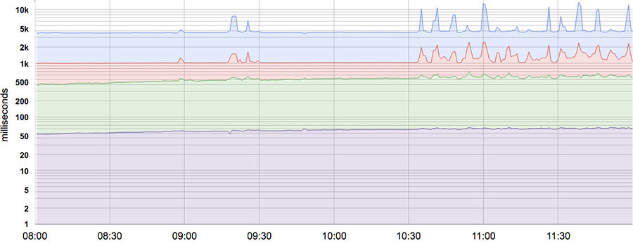

# Chương 4. Service Level Objectives (Mục tiêu Mức Dịch vụ)

> **Nguyên bản:** [Chapter 4 - Service Level Objectives](https://sre.google/sre-book/service-level-objectives/)
> **Nguồn:** Google SRE Book (O'Reilly)
> **Bản dịch tiếng Việt** (Thực hiện bởi Đội ngũ R&D Softdreams)

---

*Tác giả:* Chris Jones, John Wilkes, và Niall Murphy cùng Cody Smith
*Biên tập:* Betsy Beyer

Không thể quản lý một dịch vụ đúng, chứ chưa nói là quản lý tốt, nếu không hiểu những hành vi nào thực sự quan trọng với dịch vụ đó và làm sao đo lường, đánh giá chúng. Với mục đích này, chúng tôi muốn định nghĩa và cung cấp một *level of service* (mức dịch vụ) nhất định cho người dùng, dù họ dùng một API (Application Programming Interface — giao diện lập trình ứng dụng) nội bộ hay một sản phẩm công khai.

Chúng tôi dùng trực giác, kinh nghiệm và sự hiểu biết về những gì người dùng muốn để định nghĩa *service level indicator* (SLI — chỉ báo mức dịch vụ), *objective* (SLO — mục tiêu mức dịch vụ) và *agreement* (SLA — thỏa thuận mức dịch vụ). Những phép đo này mô tả các thuộc tính cơ bản của các metrics (chỉ số) quan trọng, các giá trị mà chúng ta muốn các metrics đó đạt, và cách chúng ta sẽ phản ứng nếu không thể cung cấp được dịch vụ mong đợi. Cuối cùng, việc chọn metrics phù hợp giúp thúc đẩy hành động đúng khi có sự cố, và cho đội SRE (Site Reliability Engineer — kỹ sư độ tin cậy trang web) niềm tin rằng một dịch vụ đang khỏe mạnh.

Chương này mô tả khung (framework) mà chúng tôi dùng để xử lý các vấn đề mô hình hóa, chọn và phân tích metrics. Thiếu ví dụ, phần lớn lời giải thích sẽ khá trừu tượng, nên chúng tôi sẽ dùng dịch vụ Shakespeare được phác thảo trong [Shakespeare: A Sample Service](https://sre.google/sre-book/production-environment#xref_production-environment_shakespeare) để minh họa các điểm chính.

## Thuật ngữ về Mức Dịch vụ (Service Level Terminology)

Nhiều người đọc có lẽ đã quen với khái niệm SLA (Service Level Agreement — thỏa thuận mức dịch vụ), nhưng các thuật ngữ *SLI* và *SLO* (Service Level Objective — mục tiêu mức dịch vụ) cũng đáng được định nghĩa cẩn thận, bởi trong cách dùng thông thường, thuật ngữ *SLA* bị gán quá nhiều nghĩa và thay đổi tùy ngữ cảnh. Chúng tôi thích tách riêng các nghĩa đó để rõ ràng hơn.

## Chỉ báo (Indicators)

Một SLI là một service level *indicator* — phép đo định lượng được định nghĩa cẩn thận về một khía cạnh nào đó của mức dịch vụ được cung cấp.

Phần lớn các dịch vụ coi *request latency* (độ trễ yêu cầu) — thời gian cần để trả về phản hồi cho một yêu cầu — là một SLI chính. Các SLI phổ biến khác gồm *error rate* (tỷ lệ lỗi), thường biểu thị dưới dạng phân số của toàn bộ các yêu cầu nhận được, và *system throughput* (lưu lượng hệ thống), thường đo bằng số yêu cầu mỗi giây (requests per second). Các phép đo thường được gộp (aggregate): dữ liệu thô được thu thập trong một cửa sổ đo rồi chuyển thành một tỷ lệ, giá trị trung bình hoặc phân vị (percentile).

Lý tưởng nhất, SLI đo trực tiếp mức dịch vụ cần quan tâm, nhưng đôi khi chỉ có một chỉ số đại diện (proxy) có sẵn vì phép đo mong muốn có thể khó thu được hoặc khó diễn giải. Ví dụ, độ trễ phía client thường là metrics gắn với trải nghiệm người dùng hơn, nhưng có khi chỉ đo được độ trễ ở phía server.

Một loại SLI khác quan trọng với SRE là *availability* (khả dụng), tức phần thời gian mà một dịch vụ có thể sử dụng được. Nó thường được định nghĩa theo phần trăm các yêu cầu hợp lệ (well-formed) thành công, đôi khi gọi là *yield* (tỷ lệ thành công). (*Durability* (độ bền) — khả năng dữ liệu được lưu giữ trong một khoảng thời gian dài — cũng quan trọng như vậy cho [các hệ thống lưu trữ dữ liệu](https://sre.google/sre-book/data-integrity/)). Dù khả dụng 100% là bất khả thi, khả dụng gần 100% thường dễ đạt được, và ngành thường biểu đạt các mức khả dụng cao theo số "nines" (số chín) trong phần trăm khả dụng. Ví dụ, các mức khả dụng 99% và 99.999% có thể gọi là "2 nines" và "5 nines" tương ứng, và mục tiêu khả dụng công bố hiện tại của Google Compute Engine là "hai phẩy năm nines" — khả dụng 99.95%.

## Mục tiêu (Objectives)

Một SLO là một *service level objective*: một giá trị mục tiêu hoặc một khoảng giá trị cho mức dịch vụ được đo bằng một SLI. Do đó, cấu trúc tự nhiên cho SLO là *SLI ≤ target*, hoặc *lower bound ≤ SLI ≤ upper bound*. Ví dụ, chúng ta có thể quyết định trả về kết quả tìm kiếm Shakespeare "nhanh" bằng cách áp dụng SLO rằng độ trễ trung bình của yêu cầu tìm kiếm phải nhỏ hơn 100 mili giây.

Việc chọn một SLO phù hợp là phức tạp. Trước hết, giá trị của nó không phải lúc nào cũng do bạn chọn! Đối với các yêu cầu HTTP (HyperText Transfer Protocol — giao thức truyền siêu văn bản) từ bên ngoài vào dịch vụ của bạn, metrics queries per second (QPS — số truy vấn mỗi giây) về cơ bản do chính người dùng quyết định, nên bạn không thực sự có thể đặt một SLO cho nó.

Mặt khác, bạn *có thể* nói rằng bạn muốn độ trễ trung bình mỗi yêu cầu dưới 100 mili giây, và việc đặt một mục tiêu như vậy có thể thúc đẩy bạn viết frontend (phần phía trước) với các hành vi độ trễ thấp theo nhiều cách, hoặc mua một số loại thiết bị độ trễ thấp nhất định. (100 mili giây rõ ràng là một giá trị tùy ý, nhưng nhìn chung con số độ trễ thấp hơn là tốt hơn. Có đủ lý do để tin rằng nhanh tốt hơn chậm, và rằng độ trễ người dùng trải nghiệm vượt quá một ngưỡng nhất định sẽ thực sự đuổi khách hàng đi — xem "Speed Matters" [[Bru09]](https://sre.google/sre-book/bibliography#Bru09).)

Lại một lần nữa, điều này tinh tế hơn vẻ bề ngoài, ở chỗ hai SLI đó — QPS và độ trễ — có thể liên kết với nhau ở hậu trường: QPS cao hơn thường kéo theo độ trễ lớn hơn, và phổ biến khi các dịch vụ có một vách hiệu năng (performance cliff) vượt quá một ngưỡng tải nhất định.

Việc chọn và [công bố SLOs](https://sre.google/resources/practices-and-processes/art-of-slos/) cho người dùng đặt kỳ vọng về cách một dịch vụ sẽ hoạt động. Chiến lược này có thể giảm bớt các phàn nàn vô căn cứ gửi đến chủ sở hữu dịch vụ về, ví dụ, chuyện dịch vụ chậm. Khi không có SLO rõ ràng, người dùng thường tự hình thành niềm tin riêng về hiệu năng mong muốn, có thể không khớp với niềm tin của những người thiết kế và vận hành dịch vụ. Động lực này có thể dẫn đến cả phụ thuộc quá mức — khi người dùng tin sai rằng một dịch vụ khả dụng hơn thực tế (như đã xảy ra với Chubby: xem [Sự cố có kế hoạch toàn cầu của Chubby](#the-global-chubby-planned-outage)) — lẫn phụ thuộc thiếu, khi người dùng tiềm năng tin rằng một hệ thống yếu và kém tin cậy hơn thực tế.

### Sự cố Có Kế hoạch Toàn cầu của Chubby (The Global Chubby Planned Outage)

*Tác giả:* Marc Alvidrez

Chubby [[Bur06]](https://sre.google/sre-book/bibliography#Bur06) là dịch vụ lock (khóa) của Google cho các hệ thống phân tán có liên kết lỏng lẻo. Trong trường hợp toàn cầu, chúng tôi phân phối các instance (thực thể) của Chubby sao cho mỗi replica (bản sao) nằm ở một khu vực địa lý khác nhau. Theo thời gian, chúng tôi nhận thấy rằng sự thất bại của instance toàn cầu Chubby liên tục gây ra các sự cố dịch vụ (service outages), nhiều trong số đó người dùng cuối có thể nhìn thấy. Hóa ra, các sự cố toàn cầu của Chubby hiếm đến mức các chủ sở hữu dịch vụ bắt đầu thêm các sự phụ thuộc (dependencies) vào Chubby, mặc định nó sẽ không bao giờ down (mất). Độ tin cậy cao của nó tạo ra cảm giác an toàn sai, vì các dịch vụ không thể hoạt động đúng khi Chubby không khả dụng, dù hiếm như thế nào.

Giải pháp cho kịch bản Chubby này khá thú vị: SRE đảm bảo Chubby toàn cầu đáp ứng, nhưng không vượt quá đáng kể, mục tiêu mức dịch vụ của nó. Trong bất kỳ quý nào, nếu một sự cố thực sự chưa làm khả dụng tụt xuống dưới mục tiêu, chúng tôi sẽ chủ động gây ra một sự cố có kiểm soát bằng cách cố tình đưa hệ thống down. Bằng cách này, chúng tôi có thể phát hiện và loại bỏ các sự phụ thuộc không hợp lý vào Chubby ngay sau khi chúng được thêm. Làm vậy buộc các chủ sở hữu dịch vụ phải đối diện với thực tế của các hệ thống phân tán sớm hơn là muộn.

## Thỏa thuận (Agreements)

Cuối cùng, SLA là các service level *agreement*: một hợp đồng rõ ràng hoặc ngầm với người dùng của bạn, bao gồm các hậu quả của việc đáp ứng (hoặc không đáp ứng) các SLO mà chúng chứa. Hậu quả dễ nhận ra nhất khi chúng mang tính tài chính — một khoản hoàn tiền hoặc hình phạt — nhưng chúng có thể mang nhiều hình thức khác. Một cách đơn giản để phân biệt SLO và SLA là hỏi "điều gì xảy ra nếu SLO không được đáp ứng?": nếu không có hậu quả rõ ràng, thì gần như chắc chắn bạn đang nhìn vào một SLO.[1](#fn1)

SRE không thường tham gia xây dựng SLA, vì SLA gắn chặt với các quyết định business và sản phẩm. Tuy nhiên, SRE có tham gia giúp tránh kích hoạt các hậu quả của SLO bị bỏ lỡ. Họ cũng có thể giúp định nghĩa các SLI: rõ ràng cần một cách khách quan để đo các SLO trong thỏa thuận, nếu không các bất đồng sẽ nảy sinh.

Google Search là ví dụ về một dịch vụ quan trọng không có SLA công khai: chúng tôi muốn mọi người dùng Search một cách trôi chảy và hiệu quả nhất có thể, nhưng chúng tôi chưa ký hợp đồng với cả thế giới. Dẫu vậy, vẫn có hậu quả nếu Search không khả dụng — sự không khả dụng làm ảnh hưởng đến danh tiếng của chúng tôi, cũng như làm sụt giảm doanh thu quảng cáo. Nhiều dịch vụ Google khác, như Google for Work, có SLA rõ ràng với người dùng. Dù một dịch vụ cụ thể có SLA hay không, việc định nghĩa SLI và SLO rồi dùng chúng để quản lý dịch vụ đều có giá trị.

Đó là lý thuyết — bây giờ là trải nghiệm thực tế.

## Các Chỉ báo Trong Thực tế (Indicators in Practice)

Khi đã lập luận được *tại sao* việc chọn các [metrics phù hợp để đo lường dịch vụ](https://sre.google/sre-book/practical-alerting/) của bạn là quan trọng, thì bạn sẽ xác định những metrics nào có ý nghĩa với dịch vụ hay hệ thống của mình như thế nào?

## Bạn và Người dùng Quan tâm đến Điều gì?

Bạn không nên dùng mọi metrics có thể theo dõi trong hệ thống giám sát làm SLI; việc hiểu người dùng của bạn muốn gì từ hệ thống sẽ dẫn dắt bạn cẩn trọng chọn một vài chỉ báo. Chọn quá nhiều chỉ báo khiến khó chú ý đúng mức đến các chỉ báo quan trọng, trong khi chọn quá ít có thể bỏ sót các hành vi quan trọng của hệ thống. Chúng tôi thường thấy rằng một vài chỉ báo đại diện là đủ để đánh giá và suy luận về sức khỏe của một hệ thống.

Các dịch vụ có xu hướng rơi vào một vài phạm trù rộng về các SLI mà chúng coi là liên quan:

-   *Các hệ thống phục vụ hướng người dùng* (user-facing serving systems), như các frontend tìm kiếm Shakespeare, nhìn chung quan tâm đến *availability* (khả dụng), *latency* (độ trễ), và *throughput* (lưu lượng). Nói cách khác: Chúng tôi có thể phản hồi yêu cầu không? Mất bao lâu để phản hồi? Bao nhiêu yêu cầu có thể được xử lý?
-   *Các hệ thống lưu trữ* (storage systems) thường nhấn mạnh *latency*, *availability*, và *durability* (độ bền). Nói cách khác: Mất bao lâu để đọc hoặc ghi dữ liệu? Chúng tôi có thể truy cập dữ liệu theo yêu cầu không? Dữ liệu vẫn còn đó khi chúng tôi cần nó không? Xem [Data Integrity: What You Read Is What You Wrote](https://sre.google/sre-book/data-integrity/) để có một thảo luận mở rộng về các vấn đề này.
-   *Các hệ thống big data* (dữ liệu lớn), như các đường ống xử lý dữ liệu (data processing pipelines), có xu hướng quan tâm đến *throughput* và *end-to-end latency* (độ trễ đầu-cuối). Nói cách khác: Bao nhiêu dữ liệu đang được xử lý? Mất bao lâu để dữ liệu tiến từ việc nạp (ingestion) đến hoàn thành? (Một số đường ống có thể cũng có các mục tiêu cho độ trễ của các giai đoạn xử lý riêng lẻ.)
-   Tất cả các hệ thống nên quan tâm đến *correctness* (sự đúng đắn): có trả về câu trả lời đúng, truy xuất dữ liệu đúng, thực hiện phân tích đúng không? Sự đúng đắn quan trọng để theo dõi như một chỉ báo sức khỏe hệ thống, mặc dù nó thường là một thuộc tính của dữ liệu trong hệ thống hơn là của chính hạ tầng *per se* (vốn dĩ), và do đó thường không phải là trách nhiệm của SRE để đáp ứng.

## Thu thập Các Chỉ báo (Collecting Indicators)

Nhiều metrics chỉ báo được thu thập tự nhiên nhất ở phía server, dùng một hệ thống giám sát như Borgmon (xem [Practical Alerting from Time-Series Data](https://sre.google/sre-book/practical-alerting/)) hoặc Prometheus, hoặc bằng phân tích log (nhật ký) định kỳ — ví dụ, tỷ lệ các phản hồi HTTP 500 trong tổng số yêu cầu. Tuy nhiên, một số hệ thống nên được instrument (lắp thiết bị đo) với việc thu thập phía *client*, vì không đo hành vi ở phía client có thể bỏ sót nhiều vấn đề ảnh hưởng đến người dùng nhưng không hiện lên trong metrics phía server. Ví dụ, chỉ tập trung vào độ trễ phản hồi của backend tìm kiếm Shakespeare có thể bỏ lỡ độ trễ người dùng kém do lỗi JavaScript của trang: trong trường hợp này, đo thời gian để một trang trở nên khả dụng trong trình duyệt là một đại diện tốt hơn cho điều người dùng thực sự trải nghiệm.

## Gộp (Aggregation)

Vì sự đơn giản và khả dụng, chúng tôi thường gộp các phép đo thô. Điều này cần được thực hiện cẩn thận.

Một số metrics có vẻ trực tiếp, như số yêu cầu *mỗi giây* được phục vụ, nhưng ngay cả phép đo có vẻ trực tiếp này cũng ngầm gộp dữ liệu trên cửa sổ đo. Phép đo được lấy một lần mỗi giây, hay bằng cách lấy trung bình các yêu cầu trong một phút? Cách sau có thể che giấu các tỷ lệ yêu cầu tức thời cao hơn nhiều trong những đợt bùng phát (burst) chỉ kéo dài vài giây. Hãy xét một hệ thống phục vụ 200 yêu cầu/giây ở các giây chẵn và 0 ở các giây lẻ. Nó có tải trung bình giống một hệ thống phục vụ hằng số 100 yêu cầu/giây, nhưng tải *tức thời* (instantaneous) lại gấp đôi tải *trung bình*. Tương tự, việc lấy trung bình các độ trễ yêu cầu có vẻ hấp dẫn, nhưng che mờ một chi tiết quan trọng: hoàn toàn có thể phần lớn các yêu cầu nhanh, trong khi một dải đuôi dài (long tail) các yêu cầu chậm hơn rất, rất nhiều.

Phần lớn các metrics được suy nghĩ tốt hơn như các *phân bố* (distribution) chứ không phải giá trị trung bình. Ví dụ, với một SLI độ trễ, một số yêu cầu được phục vụ nhanh, trong khi những yêu cầu khác luôn mất nhiều thời gian hơn — đôi khi nhiều hơn rất nhiều. Một giá trị trung bình đơn giản có thể che mờ các độ trễ tail này, cũng như các biến đổi của chúng. [Hình 4-1](#hinh-4-1) cho một ví dụ: dù một yêu cầu điển hình được phục vụ trong khoảng 50 ms (mili giây), 5% các yêu cầu chậm hơn 20 lần! Giám sát và cảnh báo (alerting) chỉ dựa trên độ trễ trung bình sẽ không cho thấy sự thay đổi hành vi trong ngày, trong khi thực tế có những biến đổi đáng kể ở độ trễ tail (đường cao nhất).

[Hình 4-1.](#hinh-4-1) Các độ trễ phân vị thứ 50, 85, 95, và 99 của một hệ thống. Lưu ý rằng trục Y có một thang log (logarithmic).

Dùng các phân vị (percentile) cho chỉ báo cho phép bạn xem xét hình dạng của phân bố và các thuộc tính khác nhau của nó: một phân vị bậc cao, như phân vị thứ 99 hoặc 99.9, cho bạn một giá trị tệ nhất hợp lý, trong khi phân vị thứ 50 (còn gọi là trung vị) nhấn mạnh trường hợp điển hình. Phương sai (variance) của thời gian phản hồi càng lớn, trải nghiệm người dùng điển hình càng bị ảnh hưởng bởi hành vi tail dài — một hiệu ứng bị khuếch đại ở tải cao do hiệu ứng xếp hàng. Các nghiên cứu về người dùng (user studies) cho thấy họ thường thích một hệ thống chậm hơn một chút hơn là một hệ thống có phương sai cao về thời gian phản hồi, nên một số đội SRE chỉ tập trung vào các giá trị phân vị cao, với lập luận rằng nếu hành vi ở phân vị 99.9 tốt thì trải nghiệm điển hình chắc chắn sẽ tốt.

### Một Ghi chú về Các Sai lầm Thống kê (A Note on Statistical Fallacies)

Nhìn chung chúng tôi thích làm việc với các phân vị hơn là giá trị trung bình (mean) của một tập giá trị. Làm vậy cho phép xem xét phần đuôi dài của các điểm dữ liệu, vốn thường có đặc tính khác biệt đáng kể (và thú vị hơn) so với giá trị trung bình. Do bản chất nhân tạo của các hệ thống tính toán, các điểm dữ liệu thường bị lệch (skewed) — ví dụ, không yêu cầu nào có thể phản hồi trong ít hơn 0 ms, và một timeout (hết thời gian chờ) ở 1.000 ms nghĩa là không thể có phản hồi thành công với giá trị lớn hơn timeout. Kết quả là, chúng tôi không thể giả định giá trị trung bình và trung vị giống nhau — hoặc thậm chí gần nhau!

Chúng tôi cố không giả định dữ liệu của mình phân bố chuẩn (normally distributed) mà không kiểm tra trước, phòng khi một số trực giác và xấp xỉ chuẩn không còn đúng. Ví dụ, nếu phân bố không như mong đợi, một quy trình thực hiện hành động khi gặp các giá trị ngoại lai (outlier) (ví dụ khởi động lại một server có độ trễ yêu cầu cao) có thể làm điều đó quá thường xuyên, hoặc không đủ thường xuyên.

## Chuẩn hóa Các Chỉ báo (Standardize Indicators)

Chúng tôi khuyến nghị bạn chuẩn hóa theo các định nghĩa chung cho SLI để không phải suy luận lại từ nguyên lý đầu tiên mỗi lần. Bất kỳ tính năng nào tuân thủ các mẫu định nghĩa chuẩn có thể bỏ khỏi quy cách (specification) của một SLI riêng lẻ, ví dụ:

-   Khoảng gộp (aggregation interval): "Lấy trung bình trên 1 phút"
-   Vùng gộp (aggregation region): "Tất cả các task trong một cluster (cụm máy)"
-   Tần suất thực hiện phép đo: "Mỗi 10 giây"
-   Các yêu cầu nào được bao gồm: "Các HTTP GET từ các job giám sát black-box (hộp đen)"
-   Dữ liệu được thu thập như thế nào: "Thông qua giám sát của chúng tôi, đo ở phía server"
-   Độ trễ truy cập dữ liệu (data-access latency): "Thời gian đến byte cuối cùng"

Để tiết kiệm công sức, xây dựng một tập các mẫu SLI có thể tái sử dụng cho mỗi metrics phổ biến; những mẫu này cũng làm cho mọi người dễ hiểu hơn ý nghĩa của một SLI cụ thể.

## Các Mục tiêu Trong Thực tế (Objectives in Practice)

Hãy bắt đầu bằng cách suy nghĩ (hoặc tìm ra!) những gì người dùng của bạn quan tâm, chứ không phải những gì bạn có thể đo. Thường thì thứ người dùng quan tâm khó hoặc không thể đo được, nên bạn sẽ phải xấp xỉ nhu cầu của họ theo một cách nào đó. Tuy nhiên, nếu bạn cứ bắt đầu bằng những gì dễ đo, bạn sẽ ra các SLO kém hữu dụng hơn. Vì vậy, đôi khi chúng tôi thấy làm việc ngược từ mục tiêu mong muốn đến các chỉ báo cụ thể cho kết quả tốt hơn so với chọn các chỉ báo rồi mới đặt mục tiêu.

## Định nghĩa Các Mục tiêu (Defining Objectives)

Để rõ ràng tối đa, SLO nên quy định cách chúng được đo và các điều kiện để chúng hợp lệ. Ví dụ, chúng ta có thể nói như sau (dòng thứ hai giống dòng đầu, nhưng dựa vào các mặc định SLI ở phần trước để bỏ đi phần trùng lặp):

-   99% (lấy trung bình trên 1 phút) các lời gọi RPC (Remote Procedure Call — gọi thủ tục từ xa) `Get` sẽ hoàn thành trong ít hơn 100 ms (đo trên tất cả các backend server).
-   99% các lời gọi RPC `Get` sẽ hoàn thành trong ít hơn 100 ms.

Nếu hình dạng của các đường cong hiệu năng là quan trọng, bạn có thể quy định nhiều mục tiêu SLO:

-   90% các lời gọi RPC `Get` sẽ hoàn thành trong ít hơn 1 ms.
-   99% các lời gọi RPC `Get` sẽ hoàn thành trong ít hơn 10 ms.
-   99.9% các lời gọi RPC `Get` sẽ hoàn thành trong ít hơn 100 ms.

Nếu bạn có các người dùng với các workload (tải công việc) không đồng nhất, như một đường ống xử lý hàng loạt quan tâm đến throughput và một client tương tác quan tâm đến độ trễ, có thể phù hợp để định nghĩa các mục tiêu riêng cho mỗi lớp workload:

-   95% các lời gọi RPC `Set` của các client throughput sẽ hoàn thành trong < 1 giây.
-   99% các lời gọi RPC `Set` của các client độ trễ với payload (tải dữ liệu) < 1 kB sẽ hoàn thành trong < 10 ms.

Việc khăng khăng rằng SLO sẽ được đáp ứng 100% thời gian vừa không thực tế vừa không mong muốn: làm vậy có thể làm chậm tốc độ đổi mới và triển khai, đòi hỏi các giải pháp đắt đỏ, quá bảo thủ, hoặc cả hai. Thay vào đó, tốt hơn là cho phép một error budget (ngân sách lỗi) — một tỷ lệ cho phép SLO bị bỏ lỡ — và theo dõi nó hàng ngày hoặc hàng tuần. Ban quản lý cấp cao có thể cũng muốn một đánh giá hàng tháng hoặc hàng quý. (Một error budget đơn giản chỉ là một SLO để đáp ứng các SLO khác!)

Tỷ lệ vi phạm SLO có thể được so sánh với error budget (xem [Motivation for Error Budgets](03-embracing-risk.md)), với phần chênh lệch được dùng như một đầu vào cho quá trình quyết định khi nào triển khai các release mới.

## Chọn Các Mục tiêu (Choosing Targets)

Việc chọn các mục tiêu (SLO) không phải là hoạt động thuần túy kỹ thuật, vì các hàm ý sản phẩm và business cũng phải được phản ánh trong cả SLI lẫn SLO (và có lẽ cả SLA) được chọn. Tương tự, có thể cần đánh đổi một số thuộc tính sản phẩm này với thuộc tính khác trong các ràng buộc về nhân sự, thời gian ra thị trường, khả dụng phần cứng và tài trợ. SRE nên tham gia cuộc thảo luận này, tư vấn về rủi ro và tính khả thi của các phương án khác nhau, và chúng tôi rút ra được một số bài học giúp cuộc thảo luận hiệu quả hơn:

**Đừng chọn một mục tiêu dựa trên hiệu năng hiện tại**

Dù hiểu điểm mạnh và giới hạn của một hệ thống là thiết yếu, việc áp dụng các giá trị mà không suy ngẫm có thể khiến bạn bị kẹt trong việc hỗ trợ một hệ thống đòi hỏi nỗ lực phi thường để đáp ứng mục tiêu, và không thể cải thiện mà không thiết kế lại đáng kể.

**Giữ nó đơn giản**

Các phép gộp phức tạp trong SLIs có thể che mờ các thay đổi đối với hiệu năng hệ thống, và cũng khó lập luận hơn.

**Tránh các tuyệt đối**

Mặc dù hấp dẫn khi đòi hỏi một hệ thống scale tải "vô hạn" mà không tăng độ trễ và "luôn luôn" khả dụng, yêu cầu này không thực tế. Ngay cả một hệ thống tiến gần đến lý tưởng như vậy có thể mất nhiều thời gian để thiết kế và xây dựng, đắt để vận hành — và có khi lại tốt hơn mức cần thiết so với những gì người dùng sẽ hài lòng (hoặc thậm chí thích thú).

**Có càng ít SLO càng tốt**

Chọn đủ SLO để bao phủ tốt các thuộc tính của hệ thống. Bảo vệ các SLO bạn chọn: nếu bạn không bao giờ thắng được một cuộc thảo luận về ưu tiên bằng cách trích dẫn một SLO cụ thể, có thể SLO đó không đáng có.[2](#fn2) Tuy nhiên, không phải mọi thuộc tính sản phẩm đều phù hợp với SLO: khó dùng SLO để quy định "sự thích thú của người dùng".

**Sự hoàn hảo có thể đợi**

Bạn luôn có thể tinh chỉnh định nghĩa SLO và các mục tiêu theo thời gian khi nắm được hành vi của hệ thống. Tốt hơn là bắt đầu với một mục tiêu nới lỏng rồi thắt chặt dần, thay vì chọn một mục tiêu quá khắt khe đến mức phải nới lỏng khi phát hiện ra nó không thể đạt.

SLO có thể — và nên — là động lực lớn trong việc ưu tiên công việc cho SRE và developer sản phẩm, vì chúng phản ánh những gì người dùng quan tâm. Một SLO tốt là một forcing function (yếu tố ép buộc) hữu ích, hợp lệ cho một đội phát triển. Nhưng một SLO được nghĩ cẩu thả có thể dẫn đến công việc lãng phí nếu một đội dùng nỗ lực phi thường để đáp ứng một SLO quá tham vọng, hoặc ra một sản phẩm tồi nếu SLO quá nới lỏng. SLO là một đòn bẩy mạnh: hãy dùng chúng khôn ngoan.

## Các Biện pháp Điều khiển (Control Measures)

SLI và SLO là các thành phần thiết yếu trong các vòng điều khiển (control loop) dùng để quản lý hệ thống:

1.  Giám sát và đo các SLI của hệ thống.
2.  So sánh các SLI với các SLO, và quyết định xem có cần hành động hay không.
3.  Nếu cần hành động, tìm ra *cái gì* cần phải xảy ra để đáp ứng mục tiêu.
4.  Thực hiện hành động đó.

Ví dụ, nếu bước 2 cho thấy độ trễ yêu cầu đang tăng và sẽ bỏ lỡ SLO trong vài giờ nếu không làm gì, bước 3 có thể bao gồm kiểm tra giả thuyết rằng các server bị giới hạn bởi CPU (CPU-bound), rồi quyết định thêm server để phân tán tải. Không có SLO, bạn sẽ không biết liệu (hay khi nào) nên hành động.

## SLOs Đặt Kỳ vọng (SLOs Set Expectations)

Việc công bố SLO đặt kỳ vọng cho hành vi hệ thống. Người dùng (và người dùng tiềm năng) thường muốn biết họ có thể kỳ vọng gì từ một dịch vụ để xem nó có phù hợp với use case (tình huống sử dụng) của mình không. Ví dụ, một đội muốn xây website chia sẻ ảnh có thể tránh dùng một dịch vụ hứa hẹn độ bền rất mạnh và chi phí thấp đổi lại khả dụng thấp hơn một chút, dù cùng dịch vụ đó có thể là lựa chọn hoàn hảo cho một hệ thống quản lý hồ sơ lưu trữ.

Để đặt các kỳ vọng thực tế cho người dùng của bạn, bạn có thể cân nhắc sử dụng một hoặc cả hai chiến thuật sau:

#### Giữ một khoảng an toàn (safety margin)

Dùng một SLO nội bộ chặt chẽ hơn SLO quảng cáo cho người dùng cho bạn không gian để xử lý các vấn đề mạn tính trước khi chúng lộ ra bên ngoài. Một buffer SLO cũng cho phép điều chỉnh các bản triển khai lại (reimplementation) đánh đổi hiệu năng lấy thuộc tính khác, như chi phí hay dễ bảo trì, mà không làm người dùng thất vọng.

#### Đừng đạt quá nhiều (Don't overachieve)

Người dùng xây dựng dựa trên thực tế những gì bạn cung cấp, chứ không phải những gì bạn tuyên bố sẽ cung cấp, đặc biệt với các dịch vụ cơ sở hạ tầng. Nếu hiệu năng thực tế của dịch vụ bạn tốt hơn nhiều so với SLO đã nêu, người dùng sẽ bắt đầu phụ thuộc vào hiệu năng hiện tại đó. Bạn có thể tránh phụ thuộc quá mức bằng cách chủ động đưa hệ thống offline thỉnh thoảng (dịch vụ Chubby của Google đã giới thiệu các sự cố có kế hoạch để đối phó với tình trạng quá khả dụng),[3](#fn3) hạn chế một số yêu cầu, hoặc thiết kế hệ thống sao cho nó không chạy nhanh hơn dưới tải nhẹ.

Việc hiểu một hệ thống đang đáp ứng kỳ vọng của nó tốt đến đâu giúp quyết định có nên đầu tư để làm hệ thống nhanh hơn, khả dụng hơn và chống chịu hơn hay không. Ngược lại, nếu dịch vụ đang chạy tốt, có lẽ thời gian nhân sự nên dành cho các ưu tiên khác, như trả nợ kỹ thuật (technical debt), thêm tính năng mới, hoặc giới thiệu sản phẩm khác.

## Các Thỏa thuận Trong Thực tế (Agreements in Practice)

Việc xây dựng một SLA yêu cầu các đội business và pháp lý chọn các hậu quả và hình phạt phù hợp cho một vi phạm. Vai trò của SRE là giúp họ hiểu khả năng và độ khó của việc đáp ứng các SLO chứa trong SLA. Phần lớn lời khuyên về xây dựng SLO cũng áp dụng được cho SLA. Nên thận trọng trong những gì quảng cáo cho người dùng, vì cộng đồng càng rộng, việc thay đổi hoặc xóa các SLA bị chứng tỏ là không hợp lý hoặc khó làm việc cùng sẽ càng khó.

[1](#fn1) Phần lớn mọi người thực sự có ý nói SLO khi họ nói "SLA". Một đặc điểm nhận dạng: nếu ai đó nói về một "vi phạm SLA", họ gần như luôn luôn đang nói về một SLO bị bỏ lỡ. Một vi phạm SLA thực sự có thể kích hoạt một vụ kiện vi phạm hợp đồng.

[2](#fn2) Nếu bạn không bao giờ có thể thắng một cuộc thảo luận về SLOs, có thể nó không đáng để có một đội SRE cho sản phẩm.

[3](#fn3) Failure injection (tiêm lỗi) [[Ben12]](https://sre.google/sre-book/bibliography#Ben12) phục vụ một mục đích khác, nhưng cũng có thể giúp đặt kỳ vọng.

---

Copyright © 2017 Google, Inc. Published by O'Reilly Media, Inc. Licensed under [CC BY-NC-ND 4.0](https://creativecommons.org/licenses/by-nc-nd/4.0/)
