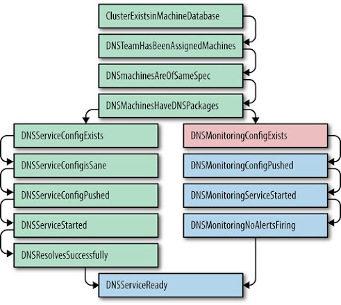
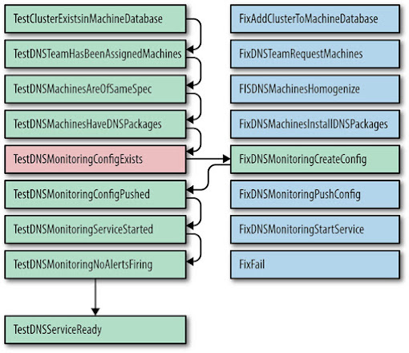

# Chương 7. Sự Tiến hóa của Tự động hóa tại Google (The Evolution of Automation at Google)

> **Nguyên bản:** [Chapter 7 - The Evolution of Automation at Google](https://sre.google/sre-book/automation-at-google/)
> **Nguồn:** Google SRE Book (O'Reilly)
> **Bản dịch tiếng Việt** (do AI hỗ trợ)

---

*Tác giả:* Niall Murphy cùng John Looney và Michael Kacirek
*Biên tập:* Betsy Beyer

> Ngoài thuật đen ra, chỉ có tự động hóa và cơ khí hóa mà thôi.
>
> Federico García Lorca (1898–1936), nhà thơ và nhà viết kịch Tây Ban Nha

Đối với SRE (Site Reliability Engineering — kỹ thuật độ tin cậy trang web), tự động hóa là một bộ khuếch đại lực lượng (force multiplier), chứ không phải một liều panacea (thuốc chữa vạn năng). Dĩ nhiên, chỉ *khuếch đại* lực lượng không tự nó làm thay đổi độ chính xác của việc lực lượng đó được áp dụng vào đâu: tự động hóa một cách không suy nghĩ có thể tạo ra nhiều vấn đề ngang với số nó giải quyết. Vì vậy, dù chúng tôi tin rằng tự động hóa bằng phần mềm vượt trội hơn vận hành thủ công trong phần lớn hoàn cảnh, thì tốt hơn cả hai lựa chọn là một thiết kế hệ thống cấp cao hơn không cần bất kỳ thứ nào trong số đó — một hệ thống *tự trị* (autonomous). Hay nói cách khác, giá trị của tự động hóa đến từ cả những gì nó làm lẫn cách nó được áp dụng một cách sáng suốt. Chúng tôi sẽ bàn về cả giá trị của tự động hóa lẫn cách suy nghĩ của chúng tôi đã tiến hóa theo thời gian.

## Giá trị của Tự động hóa (The Value of Automation)

Giá trị chính xác của tự động hóa là gì?[1](#fn1)

### Sự Nhất quán (Consistency)

Dù scale (quy mô) là một động lực rõ ràng cho tự động hóa, vẫn còn nhiều lý do khác để dùng nó. Hãy lấy ví dụ các hệ thống tính toán đại học, nơi nhiều người làm kỹ thuật hệ thống bắt đầu sự nghiệp. Các system administrator (quản trị viên hệ thống) có nền tảng đó thường được giao vận hành một tập hợp machine (máy) hoặc một số phần mềm, và quen với việc thực hiện thủ công các hành động khác nhau để hoàn thành nhiệm vụ. Một ví dụ phổ biến là tạo tài khoản người dùng; các ví dụ khác gồm các công việc vận hành thuần túy như đảm bảo backup (sao lưu) diễn ra, quản lý failover (chuyển giao) của server, và các thao tác dữ liệu nhỏ như thay đổi *resolv.conf* của các DNS server (server tên miền) upstream (phía trên), dữ liệu zone của DNS server, và tương tự. Rốt cuộc, sự phổ biến của các tác vụ thủ công này không thỏa đáng cho cả tổ chức lẫn chính những người duy trì hệ thống theo cách này. Trước hết, bất kỳ hành động nào được một hay nhiều người thực hiện hàng trăm lần sẽ không bao giờ giống hệt nhau mỗi lần: dù thiện chí đến đâu, rất ít người trong chúng tôi có thể nhất quán như một máy móc. Sự thiếu nhất quán không thể tránh này dẫn đến sai lầm, sơ suất, vấn đề chất lượng dữ liệu và, vâng, vấn đề độ tin cậy (reliability). Trong lĩnh vực này — thực thi các quy trình đã biết, có phạm vi rõ ràng — giá trị của sự nhất quán, theo nhiều cách, chính là giá trị cốt lõi của tự động hóa.

### Một Nền tảng (A Platform)

Tự động hóa không chỉ mang lại sự nhất quán. Được thiết kế và thực hiện đúng, các hệ thống tự động còn cung cấp một *nền tảng* (platform) có thể mở rộng, áp dụng cho nhiều hệ thống hơn, hoặc có khi được tách ra để sinh lời.[2](#fn2) (Lựa chọn thay thế, không có tự động hóa, vừa không hiệu quả về chi phí vừa không thể mở rộng: nó trở thành một loại thuế đánh lên việc vận hành hệ thống.)

Một nền tảng còn *tập trung hóa các sai lầm*. Nói cách khác, một bug (lỗi) được sửa trong code sẽ được sửa một lần và mãi mãi, khác với một nhóm đủ lớn con người thực hiện cùng một quy trình, như đã bàn trước đó. Một nền tảng có thể mở rộng thêm các tác vụ dễ dàng hơn so với việc ra lệnh cho con người thực hiện (hoặc đôi khi họ thậm chí không nhận ra phải làm). Tùy bản chất tác vụ, nó có thể chạy liên tục hoặc thường xuyên hơn nhiều so với mức con người có thể hoàn thành một cách thích hợp, hoặc vào những thời điểm bất tiện cho con người. Hơn nữa, một nền tảng có thể xuất khẩu các metrics (chỉ số) về hiệu năng của nó, hoặc cho phép bạn phát hiện những chi tiết về quy trình mà trước đó không biết, vì các chi tiết này dễ đo lường hơn trong ngữ cảnh của một nền tảng.

### Sửa chữa Nhanh hơn (Faster Repairs)

Có một lợi ích bổ sung cho các hệ thống dùng tự động hóa để giải quyết các lỗi thường gặp (một tình huống phổ biến với tự động hóa do SRE tạo ra). Nếu tự động hóa chạy thường xuyên và đủ thành công, kết quả là mean time to repair (MTTR — thời gian trung bình để sửa chữa) của những lỗi thường gặp đó giảm xuống. Khi đó bạn có thể dành thời gian cho các tác vụ khác, từ đó đạt được developer velocity (tốc độ phát triển) cao hơn vì không phải mất thời gian ngăn ngừa một vấn đề hay (phổ biến hơn) dọn dẹp sau nó. Như ngành đã hiểu rõ, càng muộn trong vòng đời sản phẩm mà một vấn đề bị phát hiện, việc sửa chữa càng đắt; xem [Testing for Reliability](https://sre.google/sre-book/testing-reliability/). Nhìn chung, các vấn đề xảy ra trong production thật sự đắt nhất để sửa, cả về thời gian lẫn tiền bạc, nghĩa là một hệ thống tự động tìm kiếm các vấn đề ngay khi chúng nảy sinh có nhiều khả năng làm giảm tổng chi phí của hệ thống, với điều kiện hệ thống đủ lớn.

### Hành động Nhanh hơn (Faster Action)

Trong các tình huống hạ tầng mà tự động hóa SRE thường được triển khai, con người thường không phản ứng nhanh như máy móc. Trong phần lớn các trường hợp phổ biến, nơi mà, ví dụ, failover hay chuyển đổi traffic (lưu lượng) có thể được định nghĩa rõ ràng cho một ứng dụng cụ thể, việc đòi hỏi một người thỉnh thoảng nhấn nút "Cho phép hệ thống tiếp tục chạy" là không hợp lý. (Đúng là đôi khi quy trình tự động có thể khiến tình hình tồi tệ hơn, nhưng đó chính là lý do các quy trình như vậy nên bị giới hạn trong các miền được định nghĩa rõ ràng.) Google có rất nhiều tự động hóa; trong nhiều trường hợp, các dịch vụ chúng tôi hỗ trợ không thể tồn tại lâu mà không có tự động hóa này, vì chúng đã từ lâu vượt qua ngưỡng mà vận hành thủ công có thể quản lý.

### Tiết kiệm Thời gian (Time Saving)

Cuối cùng, tiết kiệm thời gian là một lý do thường được nêu cho tự động hóa. Dù mọi người nêu lý do này nhiều hơn các lý do khác, theo nhiều cách lợi ích của nó lại khó tính toán trực tiếp hơn. Các kỹ sư thường do dự liệu một phần tự động hóa hay code cụ thể có đáng để viết không, xét theo công sức tiết kiệm được từ việc không phải làm thủ công so với công sức để viết nó.[3](#fn3) Ta dễ bỏ qua thực tế rằng một khi đã đóng gói một số tác vụ vào tự động hóa, bất kỳ ai cũng có thể thực hiện tác vụ đó. Vì vậy, khoản tiết kiệm thời gian áp dụng cho bất kỳ ai có thể sử dụng hợp lý tự động hóa. Việc tách người vận hành khỏi công việc vận hành là vô cùng mạnh mẽ.

Joseph Bironas, một SRE từng lãnh đạo các nỗ lực khởi động (turnup) datacenter (trung tâm dữ liệu) của Google trong một thời gian, đã lập luận mạnh mẽ như sau:

"Nếu chúng tôi đang kỹ thuật hóa các quy trình và giải pháp không thể tự động hóa được, chúng tôi tiếp tục phải bố trí con người để duy trì hệ thống. Nếu chúng tôi phải bố trí con người để thực hiện công việc, chúng tôi đang cho các máy móc ăn bằng máu, mồ hôi và nước mắt của con người. Hãy nghĩ đến *The Matrix* (Ma trận) với ít hiệu ứng đặc biệt hơn và nhiều Hệ thống Quản trị viên (System Administrators) bực bội hơn."

## Giá trị cho Google SRE (The Value for Google SRE)

Tất cả những lợi ích và đánh đổi này áp dụng cho chúng tôi cũng như cho bất kỳ ai khác, và Google quả thực có một thiên hướng mạnh mẽ về tự động hóa. Một phần sở thích đó bắt nguồn từ các thách thức business cụ thể của chúng tôi: các sản phẩm và dịch vụ mà chúng tôi chăm sóc có quy mô trải khắp hành tinh, và chúng tôi thường không có thời gian để làm cùng loại việc "giữ tay" máy móc hoặc dịch vụ phổ biến trong các tổ chức khác.[4](#fn4) Với các dịch vụ thực sự lớn, các yếu tố nhất quán, tốc độ và đáng tin cậy chi phối phần lớn các cuộc thảo luận về đánh đổi khi triển khai tự động hóa.

Một lập luận khác ủng hộ tự động hóa, đặc biệt với Google, là môi trường production của chúng tôi phức tạp nhưng đồng nhất đến ngạc nhiên, được mô tả trong [The Production Environment at Google, from the Viewpoint of an SRE](https://sre.google/sre-book/production-environment/). Trong khi các tổ chức khác có thể có một thiết bị quan trọng không có API (giao diện lập trình ứng dụng) dễ truy cập, phần mềm không có mã nguồn khả dụng, hoặc một trở ngại khác ngăn cản kiểm soát hoàn toàn các hoạt động production, thì Google nhìn chung tránh các kịch bản như vậy. Chúng tôi đã xây dựng API cho các hệ thống khi nhà cung cấp không có sẵn API. Dù mua phần mềm cho một tác vụ cụ thể có thể rẻ hơn nhiều trong ngắn hạn, chúng tôi vẫn chọn viết giải pháp riêng, vì làm vậy tạo ra các API có tiềm năng mang lại lợi ích dài hạn lớn hơn nhiều. Chúng tôi đã dành nhiều thời gian vượt qua các trở ngại với quản lý hệ thống tự động, rồi quyết tâm phát triển chính việc quản lý hệ thống tự động đó. Với cách Google quản lý mã nguồn của nó [[Pot16]](https://sre.google/sre-book/bibliography#Pot16), việc code đó khả dụng cho gần như bất kỳ hệ thống nào mà SRE chạm đến cũng có nghĩa sứ mệnh "sở hữu sản phẩm trong production" của chúng tôi dễ dàng hơn nhiều, vì chúng tôi kiểm soát toàn bộ stack (tòa).

Dĩ nhiên, dù Google mang xu hướng ý thức hệ là dùng máy để quản lý máy khi có thể, thực tế đòi hỏi điều chỉnh cách tiếp cận của chúng tôi. Tự động hóa mọi thành phần của mọi hệ thống không phải lúc nào cũng phù hợp, và không phải ai cũng có khả năng hay khuynh hướng phát triển tự động hóa vào một thời điểm cụ thể. Một số hệ thống thiết yếu ban đầu chỉ là các prototype (nguyên mẫu) nhanh, không được thiết kế để tồn tại lâu hay để giao tiếp với tự động hóa. Các đoạn trước thể hiện một quan điểm tối đa (maximalist) về lập trường của chúng tôi, nhưng là quan điểm mà chúng tôi đã thành công khá rộng rãi trong việc đưa vào thực tế ở bối cảnh Google. Nhìn chung, chúng tôi chọn tạo các nền tảng khi có thể, hoặc *xếp đặt* để có thể tạo ra các nền tảng theo thời gian. Chúng tôi coi cách tiếp cận dựa trên nền tảng này là cần thiết cho khả năng quản lý và khả năng scale.

## Các Use case cho Tự động hóa (The Use Cases for Automation)

Trong ngành, *tự động hóa* là thuật ngữ thường dùng cho việc viết code để giải quyết một loạt vấn đề, dù động lực để viết code này, và chính các giải pháp, thường khá khác nhau. Rộng hơn, theo cách nhìn này, tự động hóa là "meta-phần mềm" (meta-software) — phần mềm để tác động lên phần mềm.

Như chúng tôi đã ngụ ý trước đó, có một số use case cho tự động hóa. Dưới đây là một danh sách không đầy đủ các ví dụ:

-   Tạo tài khoản người dùng
-   Khởi động (turnup) và tắt (turndown) cluster (cụm máy) cho các dịch vụ
-   Chuẩn bị cài đặt và decommission (ngừng vận hành) phần mềm hoặc phần cứng
-   Rollout (triển khai) các phiên bản phần mềm mới
-   Thay đổi cấu hình thời gian chạy (runtime configuration)
-   Một trường hợp đặc biệt của thay đổi cấu hình thời gian chạy: các thay đổi đối với các sự phụ thuộc (dependencies) của bạn

Danh sách này có thể tiếp tục về cơ bản *đến vô cùng* (ad infinitum).

## Các Use case cho Tự động hóa của Google SRE

Trong Google, chúng tôi có tất cả các use case vừa liệt kê, và nhiều hơn nữa.

Tuy nhiên, trong nội bộ Google SRE, sự gắn bó chính của chúng tôi thường là vận hành hạ tầng, chứ không phải quản lý chất lượng dữ liệu đi qua hạ tầng đó. Ranh giới này không hoàn toàn rõ ràng — ví dụ, chúng tôi rất quan tâm nếu một nửa tập dữ liệu biến mất sau một push (đẩy code), và do đó cảnh báo (alert) cho các khác biệt thô như vậy, nhưng hiếm khi chúng tôi viết tương đương của việc thay đổi thuộc tính của một tập con tùy ý các tài khoản trên một hệ thống. Vì vậy, ngữ cảnh cho tự động hóa của chúng tôi thường là tự động hóa để quản lý vòng đời của các hệ thống, chứ không phải dữ liệu của chúng: ví dụ, triển khai một dịch vụ trong một cluster mới.

Đến mức đó, các nỗ lực tự động hóa của SRE không khác xa những gì nhiều người và tổ chức khác làm, ngoài việc chúng tôi dùng các công cụ khác nhau để quản lý và có một trọng tâm khác (như sẽ bàn sau).

Các công cụ phổ biến như Puppet, Chef, cfengine, và thậm chí Perl, tất cả đều cung cấp cách tự động hóa các tác vụ cụ thể, khác nhau chủ yếu ở mức độ trừu tượng (abstraction) của các thành phần hỗ trợ việc tự động hóa. Một ngôn ngữ đầy đủ như Perl cung cấp các affordance (khả năng) cấp POSIX, về lý thuyết cho một phạm vi tự động hóa gần như không giới hạn xuyên suốt các API khả dụng của hệ thống,[5](#fn5) trong khi Chef và Puppet cung cấp các trừu tượng out-of-the-box (sẵn sàng dùng ngay) để thao tác các dịch vụ hoặc các thực thể cấp cao hơn. Đánh đổi ở đây là kinh điển: trừu tượng cấp cao hơn dễ quản lý và lập luận hơn, nhưng khi bạn gặp một "trừu tượng rò rỉ" (leaky abstraction), bạn sẽ thất bại theo hệ thống, lặp đi lặp lại và có thể không nhất quán. Ví dụ, chúng tôi thường giả định rằng việc đẩy một binary (file thực thi) mới đến một cluster là nguyên tử (atomic); cluster sẽ hoặc kết thúc ở phiên bản cũ, hoặc phiên bản mới. Tuy nhiên, hành vi thực tế phức tạp hơn: mạng của cluster đó có thể hỏng giữa chừng; các machine có thể hỏng; truyền thông đến tầng quản lý cluster có thể hỏng, để lại hệ thống trong một trạng thái không nhất quán; tùy tình huống, binary mới có thể đã staged (chuẩn bị) nhưng chưa đẩy, hoặc đã đẩy nhưng chưa khởi động lại, hoặc đã khởi động lại nhưng không thể xác minh. Rất ít trừu tượng mô hình hóa thành công các kết quả như vậy, và phần lớn thường tự dừng lại và gọi can thiệp. Các hệ thống tự động hóa thực sự tồi tệ thậm chí còn không làm được cả điều đó.

SRE có một số triết lý và sản phẩm trong lĩnh vực tự động hóa, một số trông giống các công cụ rollout (triển khai) tổng quát không mô hình hóa chi tiết các thực thể cấp cao, và một số trông giống các ngôn ngữ để mô tả triển khai dịch vụ (và tương tự) ở mức trừu tượng rất cao. Công việc ở nhóm sau có xu hướng tái sử dụng tốt hơn và là một nền tảng chung hơn so với nhóm trước, nhưng độ phức tạp của môi trường production của chúng tôi đôi khi khiến cách tiếp cận trước lại là lựa chọn khả thi nhất ngay lúc đó.

## Một Hệ phân cấp của Các Lớp Tự động hóa (A Hierarchy of Automation Classes)

Dù tất cả các bước tự động hóa này đều có giá trị, và quả thực một nền tảng tự động hóa có giá trị ngay bản thân nó, trong một thế giới lý tưởng, chúng tôi sẽ không cần tự động hóa bên ngoài hóa. Thực tế, thay vì một hệ thống *bắt buộc* phải có logic keo (glue logic) bên ngoài, thậm chí tốt hơn là một hệ thống *không cần bất kỳ logic keo nào*, không chỉ vì nội tại hóa hiệu quả hơn (mặc dù hiệu quả đó hữu ích), mà vì nó được thiết kế để không cần logic keo ngay từ đầu. Để đạt được điều đó, cần lấy các use case cho logic keo — nhìn chung là các thao tác "bậc nhất" của một hệ thống, như thêm tài khoản hoặc khởi động hệ thống — và tìm cách xử lý chúng trực tiếp trong ứng dụng.

Như một ví dụ chi tiết hơn, phần lớn tự động hóa khởi động tại Google có vấn đề vì nó rốt cuộc được duy trì riêng biệt khỏi hệ thống cốt lõi và do đó bị "bit rot" (mục nát bit), nghĩa là không thay đổi khi các hệ thống nền tảng thay đổi. Dù thiện chí đến đâu, việc cố gắn chặt hơn hai thứ (tự động hóa khởi động và hệ thống cốt lõi) thường thất bại do ưu tiên không khớp, vì các developer sản phẩm sẽ, không phải không hợp lý, phản kháng một yêu cầu triển khai kiểm thử cho mỗi thay đổi. Thứ hai, tự động hóa thiết yếu nhưng chỉ chạy ở những khoảng cách không thường xuyên và do đó khó kiểm thử thường đặc biệt dễ vỡ vì vòng phản hồi bị kéo dài. Failover cluster (chuyển giao cluster) là một ví dụ kinh điển của tự động hóa chạy không thường xuyên: các failover có thể chỉ xảy ra mỗi vài tháng, hoặc không đủ thường xuyên đến mức các bất nhất quán giữa các instance (thực thể) bị giới thiệu. Sự tiến hóa của tự động hóa theo một con đường:

1) Không có tự động hóa

Master (máy chủ chính) database được failover thủ công giữa các vị trí.

2) Tự động hóa cụ thể hệ thống, duy trì bên ngoài

Một SRE có một script failover trong thư mục home của mình.

3) Tự động hóa tổng quát, duy trì bên ngoài

SRE thêm hỗ trợ database vào một script "failover tổng quát" mà mọi người dùng.

4) Tự động hóa cụ thể hệ thống, duy trì nội bộ

Database đi kèm script failover của riêng nó.

5) Các hệ thống không cần bất kỳ tự động hóa nào

Database tự nhận ra các vấn đề và tự động failover mà không cần can thiệp của con người.

SRE ghét các hoạt động thủ công, nên chúng tôi cố gắng tạo ra các hệ thống không cần chúng. Tuy nhiên, đôi khi các hoạt động thủ công là không thể tránh được.

Ngoài ra còn có một biến thể của tự động hóa áp dụng các thay đổi không chỉ trên miền cấu hình của một hệ thống cụ thể, mà trên toàn miền production. Trong một môi trường production độc quyền, tập trung hóa cao như của Google, có rất nhiều thay đổi có phạm vi không gắn với một dịch vụ cụ thể — ví dụ thay đổi các Chubby server upstream, một thay đổi flag (cờ) cho thư viện client (khách hàng) Bigtable để truy cập đáng tin cậy hơn, v.v. — mà vẫn cần được quản lý an toàn và rollback (hoàn tác) khi cần. Khi vượt quá một lượng nhất định các thay đổi, việc thực hiện thủ công các thay đổi toàn production trở nên bất khả thi; và trước điểm đó, việc giám sát thủ công một quy trình mà phần lớn các thay đổi là tầm thường hoặc được hoàn thành thành công bằng chiến lược khởi động lại và kiểm tra cơ bản là một sự lãng phí.

Hãy dùng các nghiên cứu tình huống nội bộ để minh họa chi tiết một số điểm trước đó. Nghiên cứu tình huống đầu tiên nói về cách, nhờ một số công việc tận tâm, nhìn xa, chúng tôi đã đạt được cõi cực lạc (nirvana) tự nhận của SRE: tự động hóa chính mình ra khỏi một công việc.

## Tự động hóa Chính mình Ra khỏi một Công việc: Tự động hóa TẤT CẢ Mọi thứ! (Automate Yourself Out of a Job: Automate ALL the Things!)

Trong một thời gian dài, các sản phẩm Ads (Quảng cáo) tại Google lưu trữ dữ liệu trong một database MySQL. Vì dữ liệu Ads rõ ràng có yêu cầu độ tin cậy cao, một đội SRE được giao chăm sóc hạ tầng đó. Từ 2005 đến 2008, Ads Database phần lớn chạy ở trạng thái mà chúng tôi coi là trưởng thành và được quản lý. Ví dụ, chúng tôi đã tự động hóa những phần tồi tệ nhất — nhưng không phải tất cả — của công việc thường xuyên cho việc thay thế replica (bản sao) chuẩn. Chúng tôi tin Ads Database được quản lý tốt và rằng chúng tôi đã thu hoạch phần lớn quả thấp (low-hanging fruit — thứ dễ làm nhất) về tối ưu hóa và scale. Tuy nhiên, khi các hoạt động hàng ngày trở nên trôi chảy, các thành viên đội bắt đầu hướng đến cấp phát triển hệ thống tiếp theo: di cư (migrate) MySQL lên hệ thống lập lịch cluster của Google, Borg.

Chúng tôi hy vọng cuộc di cư này sẽ cung cấp hai lợi ích chính:

-   *Hoàn toàn* loại bỏ bảo trì machine/replica: Borg sẽ tự động xử lý việc thiết lập/khởi động lại các task (nhiệm vụ) mới và hỏng.
-   Cho phép bin-packing (gói chặt) nhiều instance MySQL trên cùng một machine vật lý: Borg sẽ cho phép sử dụng hiệu quả hơn các tài nguyên machine thông qua Container (hộp).

Cuối năm 2008, chúng tôi triển khai thành công một instance MySQL proof of concept (bằng chứng khái niệm) trên Borg. Thật không may, điều này đi kèm một khó khăn mới đáng kể. Một đặc tính vận hành cốt lõi của Borg là các task của nó tự động di chuyển quanh. Các task thường di chuyển trong Borg với tần suất một đến hai lần mỗi tuần. Tần suất này có thể chấp nhận được cho các replica database của chúng tôi, nhưng không thể chấp nhận được cho các master.

Vào thời điểm đó, quy trình master failover mất 30–90 phút mỗi instance. Đơn giản là vì chúng tôi chạy trên các machine chia sẻ và phải chịu các reboot (khởi động lại) để nâng cấp kernel (lõi), nên ngoài tỷ lệ hỏng máy thông thường, chúng tôi còn phải dự tính một số failover không liên quan khác mỗi tuần. Yếu tố này, kết hợp với số shard (phiên bản chia nhỏ) mà hệ thống của chúng tôi được lưu trữ, dẫn đến:

-   Các failover thủ công sẽ tiêu tốn một lượng lớn giờ công con người và chỉ cho khả dụng tốt nhất là 99% uptime (thời gian hoạt động), không đáp ứng yêu cầu business thực sự của sản phẩm.
-   Để đáp ứng error budget (ngân sách lỗi), mỗi failover phải mất ít hơn 30 giây downtime (thời gian ngừng). Không có cách nào tối ưu một quy trình phụ thuộc con người để làm downtime ngắn hơn 30 giây.

Do đó, lựa chọn duy nhất của chúng tôi là tự động hóa failover. Thực tế, chúng tôi cần tự động hóa nhiều hơn cả failover.

Năm 2009, Ads SRE hoàn thành daemon (quá trình nền) failover tự động, đặt tên là "Decider". Decider có thể hoàn thành MySQL failover cho cả failover có kế hoạch lẫn không kế hoạch trong ít hơn 30 giây 95% thời gian. Với sự ra đời của Decider, MySQL on Borg (MoB) cuối cùng trở thành hiện thực. Chúng tôi bước qua khỏi việc tối ưu hóa hạ tầng cho tình trạng không failover sang việc đón nhận ý tưởng rằng sự thất bại là không thể tránh, và do đó tối ưu hóa để phục hồi nhanh thông qua tự động hóa.

Dù tự động hóa cho phép chúng tôi đạt được MySQL khả dụng cao trong một thế giới ép buộc đến hai lần khởi động lại mỗi tuần, nó cũng đi kèm một tập chi phí riêng. Tất cả ứng dụng của chúng tôi phải được đổi để chứa nhiều logic xử lý lỗi hơn đáng kể so với trước. Vì chuẩn mực trong thế giới phát triển MySQL là giả định instance MySQL là thành phần ổn định nhất trong stack, sự chuyển đổi này có nghĩa phải tùy chỉnh phần mềm như JDBC (Java Database Connectivity — Kết nối Cơ sở Dữ liệu Java) để chịu dung hơn với môi trường dễ hỏng của chúng tôi. Tuy nhiên, lợi ích của việc di cư lên MoB với Decider đáng giá hơn những chi phí này. Một khi trên MoB, thời gian đội dành cho các tác vụ vận hành tầm thường giảm 95%. Các failover của chúng tôi được tự động hóa, nên một outage (mất dịch vụ) của một task database đơn lẻ không còn page (gọi trực) một người nữa.

Hệ quả chính của tự động hóa mới này là chúng tôi có nhiều thời gian rảnh hơn để cải thiện các phần khác của hạ tầng. Những cải thiện đó có hiệu ứng lan truyền: càng tiết kiệm được nhiều thời gian, chúng tôi càng có thể dành cho việc tối ưu hóa và tự động hóa các công việc tẻ nhạt khác. Cuối cùng, chúng tôi tự động hóa được cả các thay đổi schema (mô hình dữ liệu), khiến chi phí bảo trì vận hành tổng thể của Ads Database giảm gần 95%. Có người sẽ nói rằng chúng tôi đã thành công tự động hóa chính mình ra khỏi công việc này. Phía phần cứng của miền chúng tôi cũng cải thiện. Di cư lên MoB giải phóng đáng kể tài nguyên vì chúng tôi có thể lên lịch nhiều instance MySQL trên các machine giống nhau, cải thiện mức sử dụng phần cứng. Nhìn chung, chúng tôi giải phóng được khoảng 60% phần cứng. Đội của chúng tôi giờ dồi dào phần cứng và tài nguyên kỹ thuật.

Ví dụ này minh họa sự khôn ngoan của việc đi thêm một dặm để cung cấp một nền tảng thay vì thay thế các quy trình thủ công hiện có. Ví dụ tiếp theo đến từ nhóm hạ tầng cluster, minh họa một số đánh đổi khó hơn mà bạn có thể gặp trên con đường đến tự động hóa *tất cả* mọi thứ.

## Làm dịu Nỗi đau: Áp dụng Tự động hóa vào Việc Khởi động Cluster (Soothing the Pain: Applying Automation to Cluster Turnups)

Mười năm trước, đội SRE hạ tầng Cluster dường như nhận một nhân viên mới mỗi vài tháng. Hóa ra đó cũng đúng khoảng tần suất chúng tôi khởi động một cluster mới. Vì việc khởi động một dịch vụ trong một cluster mới giúp nhân viên mới tiếp xúc với phần bên trong của dịch vụ, tác vụ này có vẻ là một công cụ đào tạo tự nhiên và hữu ích.

Các bước được thực hiện để chuẩn bị một cluster sẵn sàng sử dụng giống như sau:

1.  Trang bị một tòa nhà datacenter cho điện và làm mát.
2.  Cài đặt và cấu hình các switch (bo mạch chuyển mạch) cốt lõi và kết nối đến backbone (tủy sống).
3.  Cài đặt một vài rack (giá máy) server ban đầu.
4.  Cấu hình các dịch vụ cơ bản như DNS và các trình cài đặt, sau đó cấu hình một dịch vụ khóa (lock service), lưu trữ, và tính toán.
5.  Triển khai các rack machine còn lại.
6.  Phân bổ tài nguyên cho các dịch vụ hướng người dùng, để các đội của họ có thể thiết lập các dịch vụ.

Bước 4 và 6 cực kỳ phức tạp. Trong khi các dịch vụ cơ bản như DNS tương đối đơn giản, các hệ thống con lưu trữ và tính toán vào thời điểm đó vẫn đang phát triển mạnh, nên các flag, thành phần và tối ưu hóa mới được thêm hàng tuần.

Một số dịch vụ có hơn một trăm hệ thống con thành phần khác nhau, mỗi cái với một mạng lưới phụ thuộc phức tạp. Bỏ sót cấu hình một hệ thống con, hoặc cấu hình một hệ thống hay thành phần khác so với các triển khai khác, là một outage ảnh hưởng khách hàng chỉ chực xảy ra.

Trong một trường hợp, một cluster Bigtable nhiều petabyte được cấu hình để không dùng disk (ổ đĩa) đầu tiên (logging) trên các hệ thống 12-disk, vì lý do độ trễ. Một năm sau, một số tự động hóa giả định rằng nếu disk đầu tiên của một machine không được dùng thì machine đó không có lưu trữ nào được cấu hình; do đó, an toàn để wipe (xóa) machine và thiết lập lại từ đầu. Toàn bộ dữ liệu Bigtable bị xóa, ngay lập tức. May mắn thay chúng tôi có nhiều replica thời gian thực của tập dữ liệu, nhưng những sự bất ngờ như vậy là không được mong đợi. Tự động hóa cần cẩn thận khi dựa vào các tín hiệu "an toàn" ngầm.

Tự động hóa ban đầu tập trung vào tăng tốc việc giao hàng cluster. Cách tiếp cận này thường dựa vào việc dùng SSH (Secure Shell — vỏ an toàn) một cách sáng tạo cho các việc phân phối gói tẻ nhạt và khởi tạo dịch vụ. Chiến lược đó là một thắng lợi ban đầu, nhưng những script dạng tự do này dần trở thành một thứ cholesterol của nợ kỹ thuật (technical debt).

## Phát hiện Các Bất nhất quán với Prodtest (Detecting Inconsistencies with Prodtest)

Khi số lượng cluster tăng, một số cluster đòi hỏi các flag và cài đặt được tinh chỉnh thủ công. Kết quả là các đội ngày càng tốn nhiều thời gian truy tìm những cấu hình sai khó thấy. Chẳng hạn, nếu một flag khiến GFS (Google File System — Hệ thống Tệp Google) phản hồi tốt hơn khi xử lý log bị rò rỉ vào các mẫu (templates) mặc định, những cell (ô) chứa nhiều tệp có thể hết bộ nhớ (out of memory) dưới tải. Các cấu hình sai gây bực bội và tốn thời gian, len lỏi vào gần như mọi thay đổi cấu hình lớn.

Các script shell (vỏ) sáng tạo — dù dễ vỡ — mà chúng tôi dùng để cấu hình cluster không scale được, cả về số người muốn thực hiện thay đổi lẫn về số tổ hợp (permutations) cluster thuần túy cần xây dựng. Các script này cũng không giải quyết được những mối quan tâm quan trọng hơn trước khi tuyên bố một dịch vụ đã ổn để nhận traffic hướng khách hàng, như:

-   Tất cả các sự phụ thuộc của dịch vụ có khả dụng và được cấu hình đúng không?
-   Tất cả các cấu hình và gói có nhất quán với các triển khai khác không?
-   Đội có thể xác nhận rằng mọi ngoại lệ cấu hình đều được mong muốn không?

Prodtest (Production Test — Kiểm thử Production) là một giải pháp tinh tế cho những bất ngờ không mong muốn này. Chúng tôi mở rộng khung kiểm thử unit (đơn vị) Python để cho phép kiểm thử unit các dịch vụ thực tế. Các kiểm thử unit này có sự phụ thuộc, tạo thành một chuỗi các kiểm thử, và một kiểm thử thất bại sẽ nhanh chóng hủy bỏ phần còn lại. Hãy lấy kiểm thử trong [Hình 7-1](#hinh-7-1) làm ví dụ.

[Hình 7-1.](#hinh-7-1) ProdTest cho Dịch vụ DNS, cho thấy làm thế nào một kiểm thử thất bại hủy bỏ chuỗi các kiểm thử tiếp theo.

Prodtest của một đội cụ thể được cho tên cluster, và có thể xác thực các dịch vụ của đội đó trong cluster đó. Các bổ sung sau đó cho phép chúng tôi tạo một đồ thị (graph) của các kiểm thử unit và trạng thái của chúng. Tính năng này cho phép một kỹ sư nhanh chóng xem dịch vụ của mình có được cấu hình đúng trong tất cả các cluster không, và nếu không thì tại sao. Đồ thị làm nổi bật bước thất bại, và kiểm thử unit Python thất bại xuất ra một thông báo lỗi chi tiết hơn.

Bất cứ khi nào một đội gặp sự trì hoãn do cấu hình sai bất ngờ của một đội khác, một bug có thể được nộp để mở rộng Prodtest của họ. Điều này đảm bảo một vấn đề tương tự sẽ được phát hiện sớm hơn trong tương lai. Các SRE tự hào có thể đảm bảo với khách hàng rằng tất cả các dịch vụ — cả dịch vụ mới vừa khởi động lẫn dịch vụ hiện có với cấu hình mới — đều phục vụ traffic production một cách đáng tin cậy.

Lần đầu tiên, các quản lý dự án của chúng tôi có thể dự đoán khi nào một cluster có thể "đi vào hoạt động" (go live), và hiểu rõ *tại sao* mỗi cluster mất sáu tuần hoặc hơn để đi từ "sẵn sàng về mặt mạng" (network-ready) đến "đang phục vụ traffic trực tiếp". Rồi bất ngờ, SRE nhận được một sứ mệnh từ ban quản lý cấp cao: *Trong ba tháng, năm cluster mới sẽ đạt *sẵn sàng về mặt mạng* vào cùng một ngày. Hãy khởi động chúng trong một tuần.*

## Giải quyết Các Bất nhất quán một cách Idempotent (Không phụ thuộc số lần chạy) (Resolving Inconsistencies Idempotently)

Một "One Week Turnup" (Khởi động trong một tuần) là một sứ mệnh đáng sợ. Chúng tôi có hàng chục nghìn dòng script shell do hàng chục đội sở hữu. Chúng tôi có thể nhanh chóng biết một cluster cụ thể đã chuẩn bị kém thế nào, nhưng sửa chữa nó đồng nghĩa hàng chục đội phải nộp hàng trăm bug, và sau đó chúng tôi chỉ có thể hy vọng những bug này sẽ được sửa kịp thời.

Chúng tôi nhận ra việc tiến hóa từ "Python unit test tìm cấu hình sai" sang "Python code sửa cấu hình sai" có thể giúp chúng tôi sửa các vấn đề này nhanh hơn.

Kiểm thử unit đã biết cluster nào chúng tôi đang xem xét và kiểm thử cụ thể nào đang thất bại, nên chúng tôi ghép mỗi kiểm thử với một sửa chữa. Nếu mỗi sửa chữa được viết là idempotent và có thể giả định rằng tất cả các sự phụ thuộc đều được đáp ứng, việc giải quyết vấn đề sẽ dễ dàng — và an toàn. Việc yêu cầu sửa chữa idempotent có nghĩa là các đội có thể chạy "script sửa" của họ mỗi 15 phút mà không sợ gây hại cho cấu hình của cluster. Nếu kiểm thử của đội DNS bị chặn bởi cấu hình của đội Machine Database cho một cluster mới, thì ngay khi cluster xuất hiện trong database, các kiểm thử và sửa chữa của đội DNS sẽ bắt đầu hoạt động.

Hãy lấy kiểm thử trong [Hình 7-2](#hinh-7-2) làm ví dụ. Nếu `TestDnsMonitoringConfigExists` thất bại, như được hiển thị, chúng tôi có thể gọi `FixDnsMonitoringCreateConfig`, nó scrape (vét) cấu hình từ một database, sau đó kiểm tra (check) một tệp cấu hình khung (skeleton) vào hệ thống kiểm soát phiên bản (revision control system) của chúng tôi. Sau đó `TestDnsMonitoringConfigExists` vượt qua khi retry, và kiểm thử `TestDnsMonitoringConfigPushed` có thể được thử. Nếu kiểm thử thất bại, bước `FixDnsMonitoringPushConfig` chạy. Nếu một sửa chữa thất bại nhiều lần, tự động hóa giả định rằng sửa chữa đã thất bại và dừng lại, thông báo cho người dùng.

Vũ trang với các script này, một nhóm nhỏ các kỹ sư có thể đảm bảo chúng tôi đi từ "Mạng hoạt động, và các machine được liệt kê trong database" đến "Đang phục vụ 1% traffic websearch và ads" trong vòng một hoặc hai tuần. Vào thời điểm đó, điều này có vẻ là đỉnh cao của công nghệ tự động hóa.

Nhìn lại, cách tiếp cận này có những khiếm khuyết sâu sắc; độ trễ giữa kiểm thử, sửa chữa, rồi một kiểm thử thứ hai đã sinh ra các kiểm thử *flaky* (bất ổn — đôi khi chạy đôi khi không), lúc hoạt động, lúc thất bại. Không phải tất cả các sửa chữa tự nhiên là idempotent, nên một kiểm thử flaky nối tiếp bởi một sửa chữa có thể để lại hệ thống trong một trạng thái không nhất quán.

[Hình 7-2.](#hinh-7-2) ProdTest cho Dịch vụ DNS, cho thấy rằng một kiểm thử thất bại dẫn đến chỉ chạy một sửa chữa.

## Khuynh hướng Chuyên môn hóa (The Inclination to Specialize)

Các quy trình tự động hóa có thể khác nhau theo ba khía cạnh:

-   *Năng lực* (Competence), tức là, độ chính xác của chúng
-   *Độ trễ* (Latency), tốc độ mà tất cả các bước được thực hiện khi được khởi động
-   *Mức độ liên quan* (Relevance), hay tỷ lệ quy trình thế giới thực được bao phủ bởi tự động hóa

Chúng tôi bắt đầu với một quy trình rất có năng lực (được duy trì và chạy bởi các chủ sở hữu dịch vụ), độ trễ cao (các chủ sở hữu dịch vụ thực hiện quy trình vào thời gian rảnh hoặc giao cho các kỹ sư mới), và rất liên quan (các chủ sở hữu dịch vụ biết khi nào thế giới thực thay đổi, và có thể sửa tự động hóa).

Để giảm độ trễ khởi động, nhiều đội sở hữu dịch vụ chỉ thị một "đội khởi động" (turnup team) duy nhất chạy tự động hóa nào. Đội khởi động dùng các ticket (yêu cầu) để bắt đầu mỗi giai đoạn trong khởi động, để chúng tôi theo dõi các tác vụ còn lại và tác vụ đó được giao cho ai. Nếu các tương tác con người liên quan đến các module tự động hóa diễn ra giữa những người trong cùng một phòng, việc khởi động cluster có thể diễn ra trong một khoảng thời gian ngắn hơn nhiều. Cuối cùng, chúng tôi có một quy trình tự động hóa có năng lực, chính xác và kịp thời!

Nhưng trạng thái này không tồn tại lâu. Thế giới thực là hỗn loạn: phần mềm, cấu hình, dữ liệu, v.v. thay đổi, dẫn đến hơn một nghìn thay đổi riêng lẻ mỗi ngày lên các hệ thống bị ảnh hưởng. Những người bị ảnh hưởng nhiều nhất bởi các bug tự động hóa không còn là các chuyên gia miền nữa, nên tự động hóa trở nên kém liên quan hơn (nghĩa là các bước mới bị bỏ sót) và kém có năng lực hơn (các flag mới có thể đã khiến tự động hóa thất bại). Tuy nhiên, phải mất một lúc để sự sụt giảm chất lượng này ảnh hưởng đến tốc độ.

Code tự động hóa, như code kiểm thử unit, sẽ chết khi đội duy trì không ám ảnh việc giữ code đồng bộ với codebase (kho mã nguồn) mà nó bao phủ. Thế giới thay đổi xung quanh code: đội DNS thêm các tùy chọn cấu hình mới, đội lưu trữ đổi tên gói của họ, và đội mạng cần hỗ trợ các thiết bị mới.

Bằng cách giảm trách nhiệm duy trì và chạy code tự động hóa cho các đội vận hành dịch vụ, chúng tôi tạo ra các động lực tổ chức xấu xí:

-   Một đội có nhiệm vụ chính là tăng tốc khởi động hiện tại không có động lực giảm nợ kỹ thuật của đội sở hữu dịch vụ, đội sẽ vận hành dịch vụ trong production sau này.
-   Một đội không vận hành tự động hóa không có động lực xây dựng các hệ thống dễ tự động hóa.
-   Một quản lý sản phẩm mà lịch trình không bị ảnh hưởng bởi tự động hóa chất lượng thấp sẽ luôn ưu tiên tính năng mới hơn sự đơn giản và tự động hóa.

Công cụ hoạt động tốt nhất thường được viết bởi chính những người sử dụng chúng. Một lập luận tương tự giải thích lý do các đội phát triển sản phẩm hưởng lợi từ việc giữ ít nhất một phần nhận thức vận hành về các hệ thống của họ trong production.

Các khởi động lại một lần nữa có độ trễ cao, không chính xác và không có năng lực — điều tồi tệ nhất trong tất cả các thế giới. Tuy nhiên, một chỉ thị bảo mật không liên quan đã cho phép chúng tôi thoát khỏi bẫy này. Phần lớn tự động hóa phân tán khi đó dựa vào SSH. Điều này vụng về về mặt bảo mật, vì con người phải có root (quyền quản trị tối cao) trên nhiều machine để chạy phần lớn các lệnh. Nhận thức ngày càng tăng về các mối đe dọa bảo mật tiên tiến, dai dẳng (persistent) thúc đẩy chúng tôi giảm các đặc quyền mà các SRE được hưởng xuống mức tối thiểu tuyệt đối cần thiết để làm công việc. Chúng tôi phải thay thế việc dùng sshd (thư mục đăng nhập an toàn) bằng một Local Admin Daemon (Quá trình Quản trị viên Địa phương) được xác thực, điều khiển bởi ACL (Access Control List — danh sách kiểm soát truy cập), dựa trên RPC (Remote Procedure Call — lời gọi thủ tục từ xa), còn được gọi là Admin Servers (Các Server Quản trị viên), có đặc quyền để thực hiện các thay đổi địa phương đó. Kết quả là, không ai có thể cài đặt hoặc sửa đổi một server mà không để lại vết kiểm toán (audit trail). Các thay đổi đối với Local Admin Daemon và Package Repo (Kho Gói) bị chặn bởi các cuộc xem xét code (code reviews), khiến rất khó để ai đó vượt quá quyền hạn của họ; việc cho ai đó quyền truy cập để cài đặt các gói sẽ không cho phép họ xem các log (nhật ký) colocation. Admin Server ghi log người yêu cầu RPC, bất kỳ tham số nào, và kết quả của tất cả các RPC nhằm tăng cường debug (xử lý lỗi) và kiểm toán bảo mật.

## Khởi động Cluster Hướng đến Dịch vụ (Service-Oriented Cluster-Turnup)

Trong bản lặp lại tiếp theo, Admin Servers trở thành một phần của luồng công việc của các đội dịch vụ, cả với các Admin Servers cụ thể cho máy (để cài đặt gói và khởi động lại) lẫn các Admin Servers cấp cluster (cho các hành động như rút traffic (draining) hoặc khởi động một dịch vụ). Các SRE chuyển từ viết các script shell trong thư mục home của mình sang xây dựng các server RPC được xem xét bởi đồng nghiệp với các ACL chi tiết.

Sau này, sau khi nhận ra rằng các quy trình khởi động phải được sở hữu bởi các đội sở hữu các dịch vụ thật sự thấm nhuần, chúng tôi coi đây là một cách để tiếp cận việc khởi động cluster như một vấn đề Kiến trúc Hướng đến Dịch vụ (Service-Oriented Architecture, SOA): các chủ sở hữu dịch vụ sẽ chịu trách nhiệm tạo một Admin Server để xử lý các RPC khởi động/tắt cluster, do hệ thống biết khi nào các cluster sẵn sàng gửi đến. Đổi lại, mỗi đội sẽ cung cấp hợp đồng (API) mà tự động hóa khởi động cần, trong khi vẫn được tự do thay đổi triển khai nền tảng. Khi một cluster đạt "sẵn sàng về mặt mạng", tự động hóa gửi một RPC đến mỗi Admin Server có vai trò trong việc khởi động cluster.

Nay giờ chúng tôi có một quy trình có độ trễ thấp, có năng lực và chính xác; quan trọng nhất, quy trình này đã giữ vững khi tỷ lệ thay đổi, số lượng đội và số lượng dịch vụ dường như tăng gấp đôi mỗi năm.

Như đã đề cập trước đó, sự tiến hóa của tự động hóa khởi động của chúng tôi đi theo một con đường:

1.  Hành động thủ công do người vận hành kích hoạt (không có tự động hóa)
2.  Tự động hóa cụ thể hệ thống do người vận hành viết
3.  Tự động hóa tổng quát được duy trì bên ngoài
4.  Tự động hóa cụ thể hệ thống được duy trì nội bộ
5.  Các hệ thống tự trị không cần can thiệp của con người

Trong khi sự tiến hóa này, nói chung, đã thành công, nghiên cứu tình huống Borg minh họa một cách khác mà chúng tôi đã đến để suy nghĩ về vấn đề của tự động hóa.

## Borg: Sự Ra đời của Máy tính Quy mô Kho (Borg: Birth of the Warehouse-Scale Computer)

Một cách khác để hiểu sự phát triển của thái độ của chúng tôi đối với tự động hóa, và khi nào, ở đâu tự động hóa đó được triển khai tốt nhất, là xem xét lịch sử phát triển của các hệ thống quản lý cluster của chúng tôi.[6](#fn6) Giống như MySQL on Borg đã minh họa thành công của việc chuyển đổi các hoạt động thủ công sang tự động, và quy trình khởi động cluster đã minh họa mặt tiêu cực của việc không suy nghĩ đủ cẩn thận về nơi và cách triển khai tự động hóa, việc phát triển quản lý cluster cũng rốt cuộc minh họa một bài học khác về cách tự động hóa nên được thực hiện. Giống như hai ví dụ trước, một thứ gì đó khá tinh vi đã được tạo ra như kết quả cuối cùng của sự tiến hóa liên tục từ những khởi đầu đơn giản hơn.

Các cluster của Google ban đầu được triển khai giống như các mạng nhỏ của mọi người vào thời điểm đó: các rack máy với các mục đích cụ thể và cấu hình không đồng nhất. Các kỹ sư sẽ đăng nhập vào một machine "master" (máy chủ chính) nào đó được biết đến để thực hiện các tác vụ quản trị; các binary "vàng" (golden) và cấu hình nằm trên các master này. Vì chúng tôi chỉ có một nhà cung cấp colo (colocation — đặt cùng chỗ), phần lớn logic đặt tên ngầm giả định vị trí đó. Khi production lớn lên và chúng tôi bắt đầu dùng nhiều cluster, các miền khác nhau (tên cluster) xuất hiện trong bức tranh. Trở nên cần một tệp mô tả machine nào làm gì, nhóm các machine dưới một chiến lược đặt tên lỏng lẻo nhất định. Tệp mô tả này, kết hợp với một thứ tương đương SSH song song, cho phép chúng tôi khởi động lại (ví dụ) tất cả các machine tìm kiếm cùng một lúc. Vào thời điểm này, việc nhận được các ticket như "tìm kiếm đã xong với machine `x1`, crawl (thu thập) có thể lấy machine bây giờ" là phổ biến.

Việc phát triển tự động hóa bắt đầu. Ban đầu tự động hóa bao gồm các script Python đơn giản cho các hoạt động như:

-   Quản lý dịch vụ: giữ các dịch vụ chạy (ví dụ, khởi động lại sau các segfault — lỗi trỏ)
-   Theo dõi các dịch vụ nào nên chạy trên các machine nào
-   Phân tích thông báo log (nhật ký): SSH vào từng machine và tìm kiếm các regex (biểu thức chính quy)

Tự động hóa rốt cuộc biến đổi thành một database đúng nghĩa theo dõi trạng thái machine, và cũng tích hợp các công cụ giám sát tinh vi hơn. Với tập hợp các tự động hóa khả dụng, chúng tôi giờ có thể tự động quản lý phần lớn vòng đời của các machine: nhận ra khi các machine bị hỏng, gỡ bỏ các dịch vụ, gửi chúng đi sửa chữa, và khôi phục cấu hình khi chúng trở về.

Nhưng lùi lại một bước, tự động hóa này hữu ích nhưng bị giới hạn sâu sắc, do các trừu tượng của hệ thống bị ràng buộc một cách không khoan nhượng vào các machine vật lý. Chúng tôi cần một cách tiếp cận mới, do đó Borg [[Ver15]](https://sre.google/sre-book/bibliography#Ver15) ra đời: một hệ thống di chuyển khỏi các gán host/cổng/task tương đối tĩnh của thế giới trước đó, hướng đến việc coi một tập hợp các machine như một biển tài nguyên được quản lý. Trung tâm cho thành công của nó — và cho chính sự hình thành của nó — là khái niệm chuyển đổi việc quản lý cluster thành một thực thể mà các lời gọi API có thể được phát ra, hướng đến một bộ điều phối tập trung. Điều này giải phóng thêm các chiều hiệu quả, linh hoạt và đáng tin cậy: không giống như mô hình "sở hữu" machine trước đó, Borg có thể cho phép các machine lên lịch, ví dụ, các task batch *và* hướng người dùng trên cùng một machine.

Chức năng này rốt cuộc dẫn đến các nâng cấp hệ điều hành liên tục và tự động với một lượng rất nhỏ nỗ lực không đổi[7](#fn7) — nỗ lực mà *không* scale với tổng kích thước của các triển khai production. Các sai lệch nhỏ trong trạng thái machine giờ được sửa chữa tự động; sự hỏng hóc và quản lý vòng đời về cơ bản là no-ops (thao tác không làm gì) cho SRE vào thời điểm này. Hàng nghìn machine được sinh ra, chết và đi vào sửa chữa mỗi ngày mà không cần nỗ lực của SRE. Để lặp lại lời của Ben Treynor Sloss: bằng cách lấy cách tiếp cận rằng đây là một vấn đề phần mềm, tự động hóa ban đầu mua cho chúng tôi đủ thời gian để biến việc quản lý cluster thành một thứ tự trị, chứ không chỉ được tự động hóa. Chúng tôi đạt được mục tiêu này bằng cách mang các ý tưởng liên quan đến phân phối dữ liệu, API, kiến trúc hub-and-spoke (trục và nan hoa) và phát triển phần mềm hệ thống phân tán cổ điển áp dụng vào lĩnh vực quản lý hạ tầng.

Một phép loại thú vị có thể ở đây: chúng tôi có thể tạo một ánh xạ trực tiếp giữa trường hợp đơn machine và sự phát triển của các trừu tượng quản lý cluster. Trong quan điểm này, việc lên lịch lại trên một machine khác trông giống hệt như một process (quá trình) di chuyển từ CPU này sang CPU khác: dĩ nhiên, các tài nguyên tính toán đó nằm ở đầu kia của một liên kết mạng, nhưng điều đó thực sự quan trọng ở mức nào? Suy nghĩ theo những thuật ngữ này, việc lên lịch lại trông như một đặc tính vốn có của hệ thống chứ không phải một thứ gì đó mà bạn sẽ "tự động hóa" — con người dù sao cũng không thể phản ứng đủ nhanh. Tương tự trong trường hợp khởi động cluster: trong phép ẩn dụ này, khởi động cluster đơn giản là năng lực có thể lên lịch thêm, một chút giống như thêm disk hay RAM vào một máy tính đơn lẻ. Tuy nhiên, một máy tính đơn node, nhìn chung, không được kỳ vọng tiếp tục vận hành khi một số lượng lớn các thành phần hỏng. Máy tính toàn cầu thì khác — nó *phải* tự sửa chữa để vận hành một khi lớn vượt quá một kích thước nhất định, do số lượng lớn sự hỏng hóc được đảm bảo về mặt thống kê xảy ra mỗi giây. Điều này ngụ ý rằng khi chúng tôi di chuyển các hệ thống lên hệ phân cấp từ được kích hoạt thủ công, sang được kích hoạt tự động, sang tự trị, một mức độ khả năng tự nội phản (self-introspection) nhất định là cần thiết để tồn tại.

## Độ tin cậy là Tính năng Cốt lõi (Reliability Is the Fundamental Feature)

Dĩ nhiên, đối với việc debug hiệu quả, các chi tiết của hoạt động bên trong mà nội phản dựa vào cũng nên được phơi bày cho những con người quản lý hệ thống tổng thể. Các thảo luận tương tự về tác động của tự động hóa trong lĩnh vực không máy tính — ví dụ, trong chuyến bay máy bay[8](#fn8) hoặc các ứng dụng công nghiệp — thường chỉ ra mặt tiêu cực của tự động hóa hiệu quả cao:[9](#fn9) các người vận hành con người ngày càng được giảm bớt tiếp xúc trực tiếp hữu ích với hệ thống khi tự động hóa bao phủ ngày càng nhiều hoạt động hàng ngày theo thời gian. Không thể tránh được, một tình huống sẽ nảy sinh trong đó tự động hóa thất bại, và lúc đó con người không thể vận hành hệ thống thành công. Sự lưu loát của các phản ứng của họ đã mất đi do thiếu luyện tập, và các mô hình tâm trí của họ về những gì hệ thống *nên* làm không còn phản ánh thực tế về những gì nó *đang* làm.[10](#fn10) Tình huống này xảy ra nhiều hơn khi hệ thống không tự trị — tức là, nơi tự động hóa thay thế các hành động thủ công, và các hành động thủ công được giả định là luôn có thể thực hiện và khả dụng giống như trước đó. Thật buồn, theo thời gian, điều này rốt cuộc trở nên sai: các hành động thủ công đó không phải lúc nào cũng có thể thực hiện được vì chức năng cho phép chúng không còn tồn tại.

Chúng tôi cũng đã trải nghiệm các tình huống tự động hóa chủ động gây hại vào một số dịp — xem [Tự động hóa: Cho phép Thất bại ở Quy mô](#tu-dong-hoa-cho-phe-that-bai-o-quy-mo) — nhưng trong kinh nghiệm của Google, có nhiều hệ thống mà với chúng, tự động hóa hoặc hành vi tự trị không còn là các tiện ích tùy chọn. Khi bạn scale, dĩ nhiên điều này đúng, nhưng vẫn có những lập luận mạnh mẽ cho hành vi tự trị hơn của các hệ thống bất kể kích thước. Độ tin cậy là tính năng cốt lõi, và hành vi tự trị, chống chịu là một cách hữu ích để đạt được điều đó.

## Các Khuyến nghị (Recommendations)

Bạn có thể đọc các ví dụ trong chương này và quyết định rằng cần phải ở quy mô Google trước khi có bất cứ điều gì để làm với tự động hóa. Điều này là sai, vì hai lý do: tự động hóa cung cấp nhiều hơn cả tiết kiệm thời gian, nên nó đáng để triển khai trong nhiều trường hợp hơn so với một phép tính đơn giản giữa thời gian chi trả và thời gian tiết kiệm có thể gợi ý. Nhưng cách tiếp cận có đòn bẩy cao nhất thực sự nằm trong giai đoạn thiết kế: việc vận chuyển và lặp lại nhanh có thể cho phép bạn triển khai chức năng nhanh hơn, nhưng hiếm khi tạo ra một hệ thống chống chịu. Việc vận hành tự trị khó để retrofit (cài đặt lại) một cách thuyết phục vào các hệ thống đủ lớn, nhưng các thực hành tốt chuẩn trong kỹ thuật phần mềm sẽ giúp đáng kể: có các hệ thống con được tách rời, giới thiệu các API, tối thiểu hóa các tác dụng phụ, v.v.

### Tự động hóa: Cho phép Thất bại ở Quy mô (Automation: Enabling Failure at Scale)

Google vận hành hơn một chục datacenter lớn của chính mình, nhưng chúng tôi cũng phụ thuộc vào các machine trong nhiều cơ sở colocation (đặt cùng chỗ) bên thứ ba (gọi tắt là "colos"). Các machine của chúng tôi trong các colo này được dùng để terminate (kết thúc) hầu hết các kết nối đến, hoặc như một cache (bộ đệm) cho Content Delivery Network (Mạng Phân phối Nội dung) của chính chúng tôi, nhằm giảm độ trễ người dùng cuối. Vào bất kỳ thời điểm nào, một số rack đang được cài đặt hoặc decommission; cả hai quy trình này phần lớn được tự động hóa. Một bước trong quá trình decommission liên quan đến việc ghi đè toàn bộ nội dung disk của tất cả các machine trong rack, sau đó một hệ thống độc lập xác minh việc xóa thành công. Chúng tôi gọi quy trình này là "Diskerase" (Xóa Ổ đĩa).

Một thời gian, tự động hóa chịu trách nhiệm decommission một rack cụ thể đã thất bại, nhưng chỉ sau khi bước Diskerase đã hoàn thành thành công. Sau đó, quy trình decommission được khởi động lại từ đầu để debug sự thất bại. Trên bản lặp lại đó, khi cố gửi tập các machine trong rack đến Diskerase, tự động hóa xác định rằng tập các machine vẫn cần được Diskerase là (đúng) rỗng. Thật không may, tập rỗng được dùng như một giá trị đặc biệt, được diễn giải có nghĩa là "mọi thứ". Điều này có nghĩa là tự động hóa đã gửi gần như tất cả các machine mà chúng tôi có trong tất cả các colo đến Diskerase.

Trong vòng vài phút, Diskerase hiệu quả cao đã wipe (xóa) các disk trên tất cả các machine trong CDN (Mạng Phân phối Nội dung) của chúng tôi, và các machine không còn có thể terminate các kết nối từ người dùng (hoặc làm bất kỳ điều gì hữu ích khác). Chúng tôi vẫn có thể phục vụ tất cả người dùng từ các datacenter của chính mình, và sau vài phút, hiệu ứng duy nhất có thể nhìn thấy từ bên ngoài là một sự tăng nhẹ về độ trễ. Theo như chúng tôi có thể xác định, rất ít người dùng nhận thấy vấn đề, nhờ lập kế hoạch năng lực tốt (ít nhất chúng tôi đã làm đúng điều đó!). Trong khi đó, chúng tôi đã dành phần lớn hai ngày để cài đặt lại các machine trong các rack colo bị ảnh hưởng; sau đó chúng tôi dành những tuần tiếp theo để kiểm toán và thêm nhiều kiểm tra hợp lý hơn — bao gồm cả rate limiting (hạn chế tỷ lệ) — vào tự động hóa, và làm cho luồng công việc decommission idempotent.

[1](#fn1) Đối với những người đọc đã cảm thấy rằng họ hiểu chính xác giá trị của tự động hóa, hãy bỏ qua [Giá trị cho Google SRE](#gia-tri-cho-google-sre). Tuy nhiên, hãy lưu ý rằng mô tả của chúng tôi chứa một số sắc thái có thể hữu ích để giữ trong tâm trí khi đọc phần còn lại của chương.

[2](#fn2) Chuyên môn thu được trong việc xây dựng tự động hóa như vậy cũng có giá trị ngay bản thân nó; các kỹ sư vừa hiểu sâu các quy trình hiện có mà họ đã tự động hóa, vừa có thể sau đó tự động hóa các quy trình mới nhanh hơn.

[3](#fn3) Xem hoạt hình XKCD tiếp theo: [*https://xkcd.com/1205/*](https://xkcd.com/1205/).

[4](#fn4) Xem, ví dụ, [*https://blog.engineyard.com/2014/pets-vs-cattle*](https://blog.engineyard.com/2014/pets-vs-cattle).

[5](#fn5) Dĩ nhiên, không phải mọi hệ thống cần được quản lý thực sự cung cấp các API gọi được cho quản lý — buộc một số công cụ phải dùng, ví dụ, các lời gọi CLI (dòng lệnh) hoặc các cú nhấp chuột website tự động.

[6](#fn6) Chúng tôi đã nén và đơn giản hóa lịch sử này để hỗ trợ hiểu biết.

[7](#fn7) Như trong một số lượng nhỏ, không đổi.

[8](#fn8) Xem, ví dụ, [*https://en.wikipedia.org/wiki/Air_France_Flight_447*](https://en.wikipedia.org/wiki/Air_France_Flight_447).

[9](#fn9) Xem, ví dụ, [[Bai83]](https://sre.google/sre-book/bibliography#Bai83) và [[Sar97]](https://sre.google/sre-book/bibliography#Sar97).

[10](#fn10) Đây lại là một lý do tốt nữa cho các buổi diễn tập định kỳ; xem [Disaster Role Playing](https://sre.google/sre-book/accelerating-sre-on-call#xref_training_disaster-rpg).

---

Copyright © 2017 Google, Inc. Published by O'Reilly Media, Inc. Licensed under [CC BY-NC-ND 4.0](https://creativecommons.org/licenses/by-nc-nd/4.0/)
