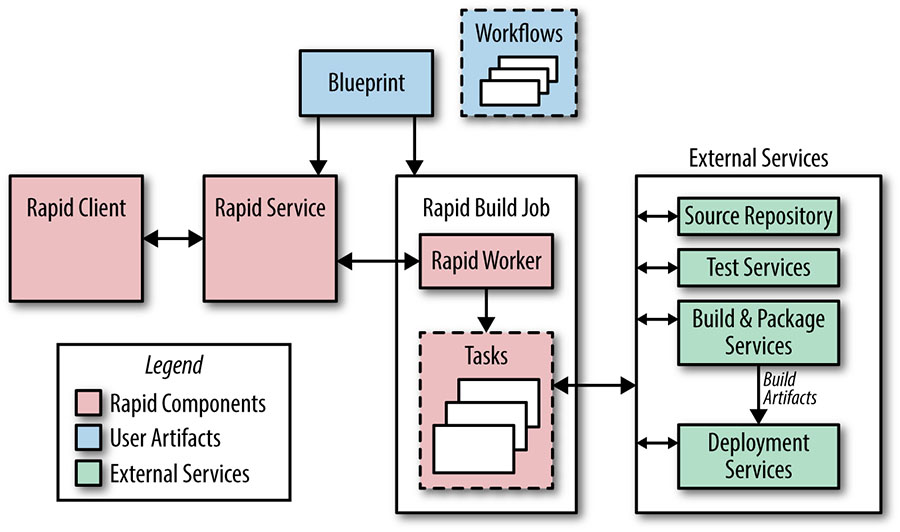

# Chương 8. Release Engineering (Kỹ thuật Phát hành)

> **Nguyên bản:** [Chapter 8 - Release Engineering](https://sre.google/sre-book/release-engineering/)
> **Nguồn:** Google SRE Book (O'Reilly)
> **Bản dịch tiếng Việt** (Thực hiện bởi Đội ngũ R&D Softdreams)

---

*Tác giả:* Dinah McNutt
*Biên tập:* Betsy Beyer và Tim Harvey

Release engineering (kỹ thuật phát hành) là một ngành của kỹ thuật phần mềm tương đối mới và đang phát triển nhanh, có thể mô tả ngắn gọn là xây dựng và cung cấp phần mềm [[McN14a]](https://sre.google/sre-book/bibliography#McN14a). Các kỹ sư phát hành (release engineer) có một hiểu biết vững chắc (dù không phải chuyên gia) về quản lý mã nguồn, trình biên dịch (compiler), ngôn ngữ cấu hình build (dựng), các công cụ build tự động, trình quản lý gói (package manager) và các trình cài đặt. Bộ kỹ năng của họ bao gồm kiến thức sâu về nhiều lĩnh vực: phát triển, quản lý cấu hình, tích hợp kiểm thử, quản trị hệ thống và hỗ trợ khách hàng.

Vận hành các dịch vụ đáng tin cậy đòi hỏi các quy trình phát hành đáng tin cậy. Các Site Reliability Engineer (SRE — Kỹ sư Độ tin cậy Trang web) cần biết rằng các binary (file thực thi) và cấu hình mà họ sử dụng được xây dựng theo cách tái lập được và tự động hóa, để các release (phát hành) có thể lặp lại được và không phải là "những bông tuyết độc nhất" (unique snowflakes). Các thay đổi đối với bất kỳ khía cạnh nào của quy trình phát hành nên có chủ đích, chứ không phải vô tình. Các SRE quan tâm đến quy trình này từ mã nguồn đến triển khai (deployment).

Release engineering là một chức năng công việc cụ thể tại Google. Các kỹ sư phát hành làm việc với các kỹ sư phần mềm (SWE) trong phát triển sản phẩm và các SRE để định nghĩa tất cả các bước cần thiết để phát hành phần mềm — từ cách phần mềm được lưu trong repository (kho lưu trữ) mã nguồn, đến các quy tắc build cho biên dịch, đến cách kiểm thử, đóng gói (packaging) và triển khai được thực hiện.

## Vai trò của một Kỹ sư Phát hành (The Role of a Release Engineer)

Google là một công ty dựa trên dữ liệu (data-driven), và [release engineering](https://sre.google/workbook/canarying-releases/) cũng vậy. Chúng tôi có các công cụ báo cáo về một loạt các metrics (chỉ số), như mất bao nhiêu thời gian để một thay đổi code được triển khai vào production (nói cách khác, tốc độ phát hành — release velocity) và thống kê về các tính năng nào đang được dùng trong các tệp cấu hình build [[Ada15]](https://sre.google/sre-book/bibliography#Ada15). Các kỹ sư phát hành đã hình dung và phát triển phần lớn các công cụ này.

Các kỹ sư phát hành định nghĩa các best practices (thực hành tốt nhất) cho việc sử dụng các công cụ của chúng tôi để đảm bảo các dự án được phát hành bằng các phương pháp nhất quán và lặp lại được. Các best practices của chúng tôi bao phủ tất cả các yếu tố của quy trình phát hành. Các ví dụ bao gồm các cờ trình biên dịch (compiler flags), các định dạng cho các thẻ định danh build (build identification tags) và các bước bắt buộc trong một build. Đảm bảo rằng các công cụ của chúng tôi hoạt động đúng theo mặc định và được tài liệu hóa đầy đủ giúp các đội dễ dàng tập trung vào các tính năng và người dùng, thay vì dành thời gian phát minh lại bánh xe (kém hiệu quả) khi nói đến việc phát hành phần mềm.

Google có một số lượng lớn các SRE được giao nhiệm vụ triển khai an toàn các sản phẩm và giữ cho các dịch vụ của Google hoạt động. Để đảm bảo các quy trình phát hành của chúng tôi đáp ứng các yêu cầu business, các kỹ sư phát hành và SRE làm việc cùng nhau để phát triển [các chiến lược canary (chạy thử nghiệm)](https://sre.google/workbook/canarying-releases/) cho các thay đổi, đẩy các release mới ra mà không ngắt dịch vụ và rollback (hoàn tác) các tính năng thể hiện các vấn đề.

## Triết lý (Philosophy)

Một triết lý kỹ thuật và dịch vụ dẫn dắt release engineering, thể hiện qua bốn nguyên lý chính, được trình bày chi tiết trong các phần sau.

## Mô hình Tự phục vụ (Self-Service Model)

Để làm việc ở quy mô, các đội phải tự túc. Release engineering đã phát triển các best practices và công cụ cho phép các đội phát triển sản phẩm của chúng tôi kiểm soát và vận hành các quy trình phát hành của chính họ. Mặc dù chúng tôi có hàng nghìn kỹ sư và sản phẩm, chúng tôi vẫn đạt được tốc độ phát hành cao vì các đội riêng lẻ có thể quyết định bao lâu và khi nào phát hành các phiên bản mới của sản phẩm mình. Các quy trình phát hành có thể được tự động hóa đến mức chỉ đòi hỏi sự tham gia tối thiểu từ các kỹ sư; nhiều dự án thậm chí được build và phát hành hoàn toàn tự động nhờ kết hợp giữa hệ thống build tự động hóa và các công cụ triển khai của chúng tôi. Các release thực sự là tự động, và chỉ đòi hỏi sự tham gia của kỹ sư nếu và khi có vấn đề nảy sinh.

## Tốc độ Cao (High Velocity)

Phần mềm hướng người dùng (như nhiều thành phần của Google Search) được build lại thường xuyên, vì chúng tôi nhắm đến việc triển khai các tính năng hướng khách hàng càng nhanh càng tốt. Chúng tôi đã đón nhận triết lý: các release thường xuyên dẫn đến ít thay đổi hơn giữa các phiên bản. Cách tiếp cận này khiến việc kiểm thử và debug dễ dàng hơn. Một số đội thực hiện các build theo giờ, rồi chọn phiên bản để thực sự triển khai vào production từ hồ (pool) các build kết quả. Việc lựa chọn dựa trên kết quả kiểm thử và các tính năng chứa trong một build cụ thể. Các đội khác đã áp dụng mô hình phát hành "Push on Green" (Đẩy khi Xanh) và triển khai mọi build vượt qua tất cả các kiểm thử [[Kle14]](https://sre.google/sre-book/bibliography#Kle14).

## Các Build Hermetic (Hermetic Builds)

Các công cụ build phải cho phép chúng tôi đảm bảo tính nhất quán và lặp lại được. Nếu hai người cố gắng build cùng một sản phẩm ở cùng một số revision (phiên bản) trong repository mã nguồn trên các machine khác nhau, chúng tôi kỳ vọng có kết quả giống hệt nhau.[1](#fn1) Các build của chúng tôi là hermetic, có nghĩa là chúng không nhạy cảm với các thư viện (libraries) và phần mềm khác được cài đặt trên machine build. Thay vào đó, các build phụ thuộc vào các phiên bản đã biết của các công cụ build, như các trình biên dịch, và các sự phụ thuộc, như các thư viện. Quy trình build là tự chứa (self-contained) và không được dựa vào các dịch vụ bên ngoài môi trường build.

Việc build lại các release cũ khi chúng tôi cần sửa một bug trong phần mềm đang chạy trong production có thể là một thách thức. Chúng tôi hoàn thành tác vụ này bằng cách build lại ở cùng revision với build ban đầu và bao gồm các thay đổi cụ thể được nộp sau thời điểm đó. Chúng tôi gọi chiến thuật này là *cherry picking*. Các công cụ build của chúng tôi bản thân được phiên bản hóa dựa trên revision trong repository mã nguồn của dự án đang được build. Do đó, một dự án được build tháng trước sẽ không dùng phiên bản trình biên dịch tháng này nếu cần cherry pick, vì phiên bản đó có thể chứa các tính năng không tương thích hoặc không mong muốn.

## Thi hành Các Chính sách và Quy trình (Enforcement of Policies and Procedures)

Nhiều tầng bảo mật và kiểm soát truy cập xác định ai có thể thực hiện các thao tác cụ thể khi phát hành một dự án. Các thao tác cần phê duyệt bao gồm:

-   Phê duyệt các thay đổi mã nguồn — thao tác này được quản lý thông qua các tệp cấu hình rải rác trong codebase (kho mã nguồn)
-   Quy định các hành động được thực hiện trong quy trình phát hành
-   Tạo một release mới
-   Phê duyệt đề xuất tích hợp ban đầu (là một yêu cầu thực hiện một build ở một số revision cụ thể trong repository mã nguồn) và các cherry pick tiếp theo
-   Triển khai một release mới
-   Thực hiện các thay đổi đối với cấu hình build của một dự án

Gần như tất cả các thay đổi đối với codebase đòi hỏi một cuộc xem xét code (code review), một hành động đã được tinh gọn và tích hợp vào luồng công việc developer thông thường của chúng tôi. Hệ thống phát hành tự động hóa của chúng tôi tạo ra một báo cáo về tất cả các thay đổi chứa trong một release, được lưu trữ cùng với các sản phẩm build khác. Bằng cách cho phép các SRE hiểu những thay đổi nào được bao gồm trong một release mới của một dự án, báo cáo này có thể đẩy nhanh việc debug khi một release gặp vấn đề.

## Build và Triển khai Liên tục (Continuous Build and Deployment)

Google đã phát triển một hệ thống phát hành tự động hóa có tên *Rapid*. Rapid là một hệ thống tận dụng một số công nghệ của Google để cung cấp một khung (framework) tạo ra các release có khả năng mở rộng, hermetic và đáng tin cậy. Các phần sau mô tả vòng đời phần mềm tại Google và cách nó được quản lý bằng Rapid cùng các công cụ liên quan khác.

## Build (Dựng) (Building)

Blaze[2](#fn2) là công cụ build được chọn của Google. Nó hỗ trợ build các binary từ một loạt các ngôn ngữ, bao gồm các ngôn ngữ chuẩn của chúng tôi là C++, Java, Python, Go và JavaScript. Các kỹ sư dùng Blaze để định nghĩa các mục tiêu build (build targets, ví dụ, đầu ra của một build, như một tệp JAR) và để quy định các sự phụ thuộc cho mỗi mục tiêu [[Kem11]](https://sre.google/sre-book/bibliography#Kem11). Khi thực hiện một build, Blaze tự động build các mục tiêu phụ thuộc.

Các mục tiêu build cho các binary và kiểm thử unit được định nghĩa trong các tệp cấu hình dự án của Rapid. Các cờ cụ thể cho dự án, như một bộ định danh build độc nhất, được Rapid truyền cho Blaze. Tất cả các binary hỗ trợ một cờ hiển thị ngày build, số revision và bộ định danh build, cho phép chúng tôi dễ dàng liên kết một binary với một bản ghi về cách nó được build.

## Nhánh (Branching) (Branching)

Tất cả code được check vào nhánh chính (main branch) của cây mã nguồn (mainline). Tuy nhiên, phần lớn các dự án lớn không phát hành trực tiếp từ mainline. Thay vào đó, chúng tôi tạo nhánh (branch) từ mainline ở một revision cụ thể và không bao giờ merge (hợp nhất) các thay đổi từ nhánh đó trở lại mainline. Các sửa lỗi được nộp vào mainline, rồi được cherry pick vào nhánh để bao gồm trong release. Thực hành này tránh vô tình nhặt lên các thay đổi không liên quan được nộp vào mainline kể từ khi build ban đầu xảy ra. Sử dụng phương pháp nhánh và cherry pick này, chúng tôi biết chính xác nội dung của mỗi release.

## Kiểm thử (Testing)

Một hệ thống kiểm thử liên tục chạy [các kiểm thử unit](https://sre.google/sre-book/testing-reliability/) đối với code trong mainline mỗi khi một thay đổi được nộp, cho phép chúng tôi phát hiện các thất bại build và kiểm thử nhanh chóng. Release engineering khuyến nghị rằng các mục tiêu kiểm thử build liên tục tương ứng với cùng các mục tiêu kiểm thử chặn (gate) release dự án. Chúng tôi cũng khuyến nghị tạo các release ở số revision (phiên bản) của build kiểm thử liên tục cuối cùng hoàn thành thành công tất cả các kiểm thử. Những biện pháp này giảm nguy cơ các thay đổi tiếp theo trên mainline gây ra thất bại trong quá trình build tại thời điểm phát hành.

Trong quy trình phát hành, chúng tôi chạy lại các kiểm thử unit sử dụng nhánh release và tạo một vết kiểm toán (audit trail) cho thấy tất cả các kiểm thử đã vượt qua. Bước này quan trọng vì nếu một release liên quan đến cherry pick, nhánh release có thể chứa một phiên bản code không tồn tại ở đâu trên mainline. Chúng tôi muốn đảm bảo rằng các kiểm thử vượt qua trong ngữ cảnh của những gì thực sự được phát hành.

Để bổ sung cho hệ thống kiểm thử liên tục, chúng tôi dùng một môi trường kiểm thử độc lập chạy các kiểm thử cấp hệ thống trên các sản phẩm build đã đóng gói. Các kiểm thử này có thể được khởi động thủ công hoặc từ Rapid.

## Đóng gói (Packaging) (Packaging)

Phần mềm được phân phối đến các machine production của chúng tôi qua Trình quản lý Gói Midas (Midas Package Manager, MPM) [[McN14c]](https://sre.google/sre-book/bibliography#McN14c). MPM lắp ráp các gói dựa trên các quy tắc Blaze liệt kê các sản phẩm build cần bao gồm, cùng với các chủ sở hữu và đặc quyền của chúng. Các gói được đặt tên (ví dụ, *search/shakespeare/frontend*), được phiên bản hóa với một hash (mã băm) độc nhất và được ký để đảm bảo tính xác thực. MPM hỗ trợ việc áp dụng các nhãn (labels) cho một phiên bản cụ thể của một gói. Rapid áp dụng một nhãn chứa ID build, điều này đảm bảo rằng một gói có thể được tham chiếu độc nhất bằng cách dùng tên của gói và nhãn này.

Các nhãn có thể được áp dụng cho một gói MPM để chỉ ra vị trí của gói trong quy trình phát hành (ví dụ, `dev` (phát triển), `canary` (thử nghiệm) hoặc `production` (sản xuất)). Nếu bạn áp dụng một nhãn hiện có cho một gói mới, nhãn tự động được chuyển từ gói cũ sang gói mới. Ví dụ: nếu một gói được gắn nhãn `canary`, ai đó sau đó cài đặt phiên bản canary của gói đó sẽ tự động nhận phiên bản mới nhất của gói với nhãn `canary`.

## Rapid

[Hình 8-1](#hinh-8-1) hiển thị các thành phần chính của hệ thống Rapid. Rapid được cấu hình bằng các tệp gọi là *blueprints* (bản thiết kế). Blueprints được viết bằng một ngôn ngữ cấu hình nội bộ và được dùng để định nghĩa các mục tiêu build và kiểm thử, các quy tắc cho triển khai, và thông tin quản trị (như các chủ sở hữu dự án). Các danh sách kiểm soát truy cập dựa trên vai trò (role-based access control lists) xác định ai có thể thực hiện các hành động cụ thể trên một dự án Rapid.

[Hình 8-1.](#hinh-8-1) Khung nhìn đơn giản hóa về kiến trúc Rapid hiển thị các thành phần chính của hệ thống.

Mỗi dự án Rapid có các luồng công việc (workflows) định nghĩa các hành động cần thực hiện trong quy trình phát hành. Các hành động luồng công việc có thể được thực hiện tuần tự hoặc song song, và một luồng công việc có thể khởi động các luồng công việc khác. Rapid phái (dispatch) các yêu cầu công việc đến các task chạy như một job Borg trên các server production của chúng tôi. Vì Rapid dùng hạ tầng production của chúng tôi, nó có thể xử lý hàng nghìn yêu cầu phát hành đồng thời.

Một quy trình phát hành điển hình diễn ra như sau:

1.  Rapid dùng số revision tích hợp được yêu cầu (thường được lấy tự động từ hệ thống kiểm thử liên tục của chúng tôi) để tạo một nhánh release.
2.  Rapid dùng Blaze để biên dịch tất cả các binary và thực hiện các kiểm thử unit, thường thực hiện hai bước này song song. Việc biên dịch và kiểm thử xảy ra trong các môi trường được dành riêng cho các tác vụ cụ thể đó, chứ không diễn ra trong job Borg nơi luồng công việc Rapid đang thực thi. Sự tách biệt này cho phép chúng tôi dễ dàng song song hóa công việc.
3.  Các sản phẩm build sau đó khả dụng cho kiểm thử hệ thống và triển khai canary. Một triển khai canary điển hình bao gồm việc khởi động một vài job trong môi trường production của chúng tôi sau khi hoàn thành các kiểm thử hệ thống.
4.  Kết quả của mỗi bước của quy trình được ghi log (nhật ký). Một báo cáo về tất cả các thay đổi kể từ release trước được tạo ra.

Rapid cho phép chúng tôi quản lý các nhánh release và cherry pick của mình; các yêu cầu cherry pick riêng lẻ có thể được phê duyệt hoặc từ chối để bao gồm trong một release.

## Triển khai (Deployment) (Deployment)

Rapid thường được dùng để trực tiếp điều khiển các triển khai đơn giản. Nó cập nhật các job Borg để dùng các gói MPM mới được build, dựa trên các định nghĩa triển khai trong các tệp blueprint và các trình thực thi task chuyên dụng.

Đối với các triển khai phức tạp hơn, chúng tôi dùng Sisyphus, một khung tự động hóa rollout tổng quát do SRE phát triển. Một rollout là một đơn vị công việc logic được tạo thành từ một hoặc nhiều task riêng lẻ. Sisyphus cung cấp một tập các lớp Python có thể được mở rộng để hỗ trợ bất kỳ quy trình triển khai nào. Nó có một dashboard (bảng điều khiển) cho phép kiểm soát chi tiết hơn về cách rollout được thực hiện và cung cấp một cách để giám sát tiến độ của rollout.

Trong một tích hợp điển hình, Rapid tạo một rollout trong một job Sisyphus chạy dài. Rapid biết nhãn build (build label) liên quan đến gói MPM mà nó đã tạo ra, và có thể quy định nhãn build đó khi tạo rollout trong Sisyphus. Sisyphus dùng nhãn build để quy định phiên bản nào của các gói MPM nên được triển khai.

Với Sisyphus, quy trình rollout có thể đơn giản hoặc phức tạp tùy theo nhu cầu. Ví dụ, nó có thể cập nhật tất cả các job liên quan ngay lập tức, hoặc nó có thể rollout một binary mới đến các cluster kế tiếp trong vài giờ.

Mục tiêu của chúng tôi là phù hợp quy trình triển khai với hồ sơ rủi ro của một dịch vụ cụ thể. Trong các môi trường phát triển hoặc trước-production, chúng tôi có thể build theo giờ và push (đẩy) các release tự động khi tất cả các kiểm thử vượt qua. Đối với các dịch vụ hướng người dùng lớn, chúng tôi có thể push bằng cách bắt đầu ở một cluster rồi mở rộng theo hàm mũ cho đến khi tất cả các cluster được cập nhật. Đối với các mảnh hạ tầng nhạy cảm, chúng tôi có thể kéo dài rollout trên vài ngày, xen kẽ chúng xuyên suốt các instance ở các khu vực địa lý khác nhau.

## Quản lý Cấu hình (Configuration Management)

Quản lý cấu hình là một lĩnh vực hợp tác đặc biệt chặt chẽ giữa các kỹ sư phát hành và SRE. Mặc dù quản lý cấu hình ban đầu có thể có vẻ đơn giản đến mức đánh lừa, các thay đổi cấu hình lại là một nguồn tiềm năng gây ra sự không ổn định. Kết quả là, cách tiếp cận của chúng tôi đối với việc phát hành và quản lý các cấu hình hệ thống và dịch vụ đã tiến hóa đáng kể theo thời gian. Ngày nay chúng tôi dùng một số mô hình để phân phối các tệp cấu hình, như được mô tả trong các đoạn sau. Tất cả các schema đều liên quan đến việc lưu trữ cấu hình trong repository mã nguồn chính của chúng tôi và thực thi một yêu cầu xem xét code nghiêm ngặt.

*Sử dụng mainline cho cấu hình.* Đây là phương pháp đầu tiên được dùng để cấu hình các dịch vụ trong Borg (và các hệ thống trước đó của Borg). Sử dụng schema này, các developer và SRE sửa đổi các tệp cấu hình ở đầu nhánh chính. Các thay đổi được xem xét và sau đó được áp dụng cho hệ thống đang chạy. Kết quả là, các release binary và các thay đổi cấu hình được tách rời. Trong khi đơn giản về mặt khái niệm và quy trình, kỹ thuật này thường dẫn đến sự lệch (skew) giữa phiên bản check-in của các tệp cấu hình và phiên bản chạy của tệp cấu hình, vì các job phải được cập nhật để nhặt lên các thay đổi.

*Bao gồm các tệp cấu hình và binary trong cùng một gói MPM.* Đối với các dự án có ít tệp cấu hình, hoặc các dự án mà các tệp (hoặc một tập con các tệp) thay đổi với mỗi chu kỳ release, các tệp cấu hình có thể được bao gồm trong gói MPM cùng với các binary. Trong khi chiến lược này giới hạn tính linh hoạt bằng cách ràng buộc chặt chẽ binary và các tệp cấu hình, nó đơn giản hóa triển khai vì chỉ đòi hỏi cài đặt một gói.

*Đóng gói các tệp cấu hình vào các "gói cấu hình" MPM.* Chúng tôi có thể áp dụng nguyên lý hermetic cho quản lý cấu hình. Các cấu hình binary có xu hướng bị ràng buộc chặt với các phiên bản cụ thể của binary, nên chúng tôi tận dụng các hệ thống build và đóng gói để chụp nhanh (snapshot) và phát hành các tệp cấu hình bên cạnh các binary của chúng. Giống như cách chúng tôi xử lý các binary, chúng tôi có thể dùng ID build để tái tạo cấu hình tại một thời điểm cụ thể.

Ví dụ, một thay đổi thực hiện một tính năng mới có thể được phát hành với một cài đặt flag cấu hình tính năng đó. Bằng cách tạo hai gói MPM, một cho binary và một cho cấu hình, chúng tôi giữ khả năng thay đổi mỗi gói độc lập. Đó là, nếu tính năng được phát hành với một cài đặt flag `first_folio` nhưng chúng tôi nhận ra rằng nó nên là `bad_quarto` thay vào đó — cả hai đều là tên vở kịch Shakespeare, đặt tên flag theo kiểu chơi chữ nội bộ — chúng tôi có thể cherry pick thay đổi đó lên nhánh release, build lại gói cấu hình rồi triển khai nó. Cách tiếp cận này có lợi thế là không đòi hỏi một build binary mới.

Chúng tôi có thể tận dụng chức năng nhãn của MPM để chỉ ra phiên bản nào của các gói MPM nên được cài đặt cùng nhau. Một nhãn `much_ado` có thể được áp dụng cho các gói MPM được mô tả trong đoạn trước, cho phép chúng tôi lấy cả hai gói sử dụng nhãn này. Khi một phiên bản mới của dự án được build, nhãn `much_ado` sẽ được áp dụng cho các gói mới. Vì các thẻ này là độc nhất trong không gian tên cho một gói MPM, chỉ gói mới nhất với thẻ đó sẽ được dùng.

*Đọc các tệp cấu hình từ một kho bên ngoài.* Một số dự án có các tệp cấu hình cần thay đổi thường xuyên hoặc động (tức là, trong khi binary đang chạy). Các tệp này có thể được lưu trữ trong Chubby, Bigtable, hoặc hệ thống tệp dựa trên mã nguồn của chúng tôi [[Yor11]](https://sre.google/sre-book/bibliography#Yor11).

Tóm lại, các chủ sở hữu dự án xem xét các tùy chọn khác nhau cho việc phân phối và quản lý các tệp cấu hình, rồi quyết định cái nào hoạt động tốt nhất theo từng trường hợp.

## Kết luận

Trong khi chương này đã đặc biệt thảo luận cách tiếp cận của Google đối với release engineering và các cách mà các kỹ sư phát hành làm việc, hợp tác với các SRE, thì những thực hành này cũng có thể được áp dụng rộng hơn.

## Không chỉ dành cho các Googler (It's Not Just for Googlers)

Khi được trang bị các công cụ đúng, tự động hóa thích hợp và các chính sách được định nghĩa rõ ràng, các developer và SRE không nên phải lo lắng về việc phát hành phần mềm. Các release có thể dễ dàng như đơn giản là nhấn một nút.

Đa số các công ty, bất kể kích thước hay công cụ, đều đối mặt với cùng một tập hợp các vấn đề release engineering: Bạn nên xử lý việc phiên bản hóa các gói của mình như thế nào? Bạn nên dùng một mô hình build và triển khai liên tục, hay thực hiện các build định kỳ? Bạn nên phát hành bao lâu một lần? Bạn nên dùng các chính sách quản lý cấu hình nào? Các metrics phát hành nào đáng quan tâm?

Các Kỹ sư Phát hành của Google đã phát triển các công cụ của riêng mình vì sự cần thiết, do các công cụ mã nguồn mở hoặc do nhà cung cấp cung cấp không hoạt động ở quy mô mà chúng tôi đòi hỏi. Các công cụ tùy chỉnh cho phép chúng tôi bao gồm chức năng để hỗ trợ (và thậm chí thực thi) các chính sách quy trình phát hành. Tuy nhiên, các chính sách này trước tiên phải được định nghĩa để thêm các tính năng thích hợp vào các công cụ của chúng tôi, và tất cả các công ty nên dành công sức để định nghĩa các quy trình phát hành của mình bất kể các quy trình đó có thể được tự động hóa và/hoặc thực thi hay không.

## Bắt đầu Release Engineering Ngay từ Đầu (Start Release Engineering at the Beginning)

Release engineering thường là một ý nghĩ sau cùng, và cách suy nghĩ này phải thay đổi khi các nền tảng và dịch vụ tiếp tục tăng về kích thước và độ phức tạp.

Các đội nên dự trù tài nguyên cho release engineering vào đầu chu kỳ phát triển sản phẩm. Rẻ hơn khi đặt các thực hành và quy trình tốt vào ban đầu, thay vì phải retrofit (trang bị bổ sung cho hệ thống sẵn có) sau đó.

Thiết yếu là các developer, SRE và kỹ sư phát hành làm việc cùng nhau. Kỹ sư phát hành cần hiểu ý định về cách code nên được build và triển khai. Các developer không nên build rồi "ném kết quả qua hàng rào" để các kỹ sư phát hành xử lý.

Các đội dự án riêng lẻ quyết định khi nào release engineering tham gia vào một dự án. Vì release engineering vẫn là một ngành tương đối trẻ, các quản lý không phải lúc nào cũng lập kế hoạch và dự trù cho release engineering ở giai đoạn đầu của một dự án. Do đó, khi xem xét cách kết hợp các thực hành release engineering, hãy đảm bảo rằng bạn xem xét vai trò của nó như được áp dụng cho toàn bộ vòng đời của sản phẩm hoặc dịch vụ của mình — đặc biệt là các giai đoạn đầu.

### Thông tin thêm (More Information)

Để biết thêm thông tin về release engineering, xem các bài thuyết trình sau, mỗi bài đều có video khả dụng trực tuyến:

-   [*How Embracing Continuous Release Reduced Change Complexity*](https://usenix.org/conference/ures14west/summit-program/presentation/dickson) (Làm thế nào Đón nhận Phát hành Liên tục Giảm Sự phức tạp của Thay đổi), USENIX Release Engineering Summit West 2014, [[Dic14]](https://sre.google/sre-book/bibliography#Dic14)
-   [*Maintaining Consistency in a Massively Parallel Environment*](https://www.usenix.org/conference/ucms13/summit-program/presentation/mcnutt) (Duy trì Sự nhất quán trong một Môi trường Song song Lớn), USENIX Configuration Management Summit 2013, [[McN13]](https://sre.google/sre-book/bibliography#McN13)
-   [*The 10 Commandments of Release Engineering*](https://www.youtube.com/watch?v=RNMjYV_UsQ8) (10 Điều răn của Release Engineering), 2nd International Workshop on Release Engineering 2014, [[McN14b]](https://sre.google/sre-book/bibliography#McN14b)
-   [*Distributing Software in a Massively Parallel Environment*](https://www.usenix.org/conference/lisa14/conference-program/presentation/mcnutt) (Phân phối Phần mềm trong một Môi trường Song song Lớn), LISA 2014, [[McN14c]](https://sre.google/sre-book/bibliography#McN14c)

[1](#fn1) Google dùng một repository mã nguồn thống nhất monolithic (toàn khối); xem [[Pot16]](https://sre.google/sre-book/bibliography#Pot16).

[2](#fn2) Blaze đã được mã nguồn mở dưới tên Bazel. Xem "Bazel FAQ" trên website Bazel, [*https://bazel.build/faq.html*](https://bazel.build/faq.html).

---

Copyright © 2017 Google, Inc. Published by O'Reilly Media, Inc. Licensed under [CC BY-NC-ND 4.0](https://creativecommons.org/licenses/by-nc-nd/4.0/)
