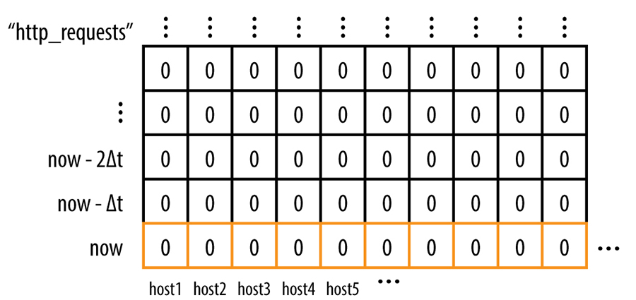
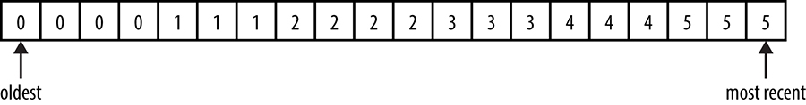
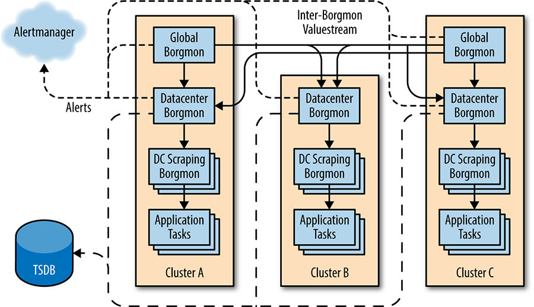

# Chương 10. Cảnh báo Thực tiễn từ Dữ liệu Chuỗi thời gian (Practical Alerting from Time-Series Data)

> **Nguyên bản:** [Chapter 10 - Practical Alerting](https://sre.google/sre-book/practical-alerting/)
> **Nguồn:** Google SRE Book (O'Reilly)
> **Bản dịch tiếng Việt** (Thực hiện bởi Đội ngũ R&D Softdreams)

---

*Tác giả:* Jamie Wilkinson
*Biên tập:* Kavita Guliani

> Hãy để các truy vấn (query) chảy đi, và để máy gọi trực (pager) im lặng.
>
> Lời chúc truyền thống của SRE

Giám sát (monitoring), lớp dưới cùng của *Hệ phân cấp các Nhu cầu Production* (Hierarchy of Production Needs), là nền tảng để vận hành một dịch vụ ổn định. Giám sát cho phép chủ sở hữu dịch vụ đưa ra quyết định hợp lý về tác động của các thay đổi lên dịch vụ, áp dụng phương pháp khoa học (scientific method) cho việc phản ứng sự cố, và, tất nhiên, hoàn thành lý do tồn tại của mình: đo mức độ dịch vụ đáp ứng các mục tiêu business (xem [Monitoring Distributed Systems](https://sre.google/sre-book/monitoring-distributed-systems/)).

Dù một dịch vụ có được SRE (Site Reliability Engineering — Kỹ thuật Độ tin cậy Trang web) hỗ trợ hay không, dịch vụ cũng nên được vận hành trong mối quan hệ cộng sinh với hệ thống giám sát. Nhưng vì gánh trách nhiệm cuối cùng cho Google Production, các SRE phát triển sự am hiểu đặc biệt sâu sát về hạ tầng giám sát hỗ trợ dịch vụ của họ.

Giám sát một hệ thống rất lớn là một thách thức vì vài lý do:

-   Số lượng lớn các thành phần cần phân tích
-   Cần giữ gánh nặng bảo trì (maintenance burden) trên các kỹ sư phụ trách hệ thống ở mức thấp hợp lý

Các [hệ thống giám sát](https://sre.google/sre-book/monitoring-distributed-systems/) của Google không chỉ đo các metrics (chỉ số) đơn giản, chẳng hạn thời gian phản hồi trung bình của một web server châu Âu; chúng tôi còn cần hiểu phân bố của các thời gian phản hồi đó trên toàn bộ web server trong vùng. Kiến thức này cho phép xác định các yếu tố đóng góp vào đuôi độ trễ (latency tail).

Ở quy mô mà hệ thống của chúng tôi vận hành, việc bị cảnh báo (alert) cho sự hỏng của một máy (machine) đơn lẻ là không thể chấp nhận, vì dữ liệu như vậy quá nhiễu (noisy) để hành động. Thay vào đó, chúng tôi cố gắng xây dựng hệ thống chống chịu (robust) trước các sự cố ở những hệ thống mà chúng phụ thuộc. Thay vì đòi hỏi quản lý nhiều thành phần riêng lẻ, một hệ thống lớn nên được thiết kế để tổng hợp các tín hiệu và cắt bỏ các ngoại lai (outlier). Chúng tôi cần các hệ thống giám sát cho phép cảnh báo ở các mục tiêu dịch vụ cấp cao, nhưng vẫn giữ độ hạt (granularity) để kiểm tra các thành phần riêng lẻ khi cần.

Các hệ thống giám sát của Google đã tiến hóa trong 10 năm, từ mô hình truyền thống của các script (lệnh) tùy chỉnh kiểm tra phản hồi và cảnh báo — tách biệt hoàn toàn khỏi hiển thị trực quan các xu hướng — sang một hệ hình (paradigm) mới. Mô hình mới này đặt việc thu thập chuỗi thời gian (time-series) vào vị trí trung tâm của hệ thống giám sát, và thay thế những script kiểm tra đó bằng một ngôn ngữ phong phú để thao tác các chuỗi thời gian thành biểu đồ (chart) và cảnh báo.

## Sự trỗi dậy của Borgmon

Ngay sau khi hạ tầng lên lịch job (nhiệm vụ) Borg [[Ver15]](https://sre.google/sre-book/bibliography#Ver15) ra đời vào năm 2003, một hệ thống giám sát mới — Borgmon — được xây dựng để bổ trợ cho nó.

### Giám sát Chuỗi thời gian Bên ngoài Google (Time-Series Monitoring Outside of Google)

Chương này mô tả kiến trúc và giao diện lập trình của một công cụ giám sát nội bộ, vốn là nền tảng cho sự phát triển và độ tin cậy của Google trong gần 10 năm… nhưng điều đó giúp gì cho bạn, độc giả thân mến?

Những năm gần đây, giám sát đã trải qua một Sự bùng nổ Cambrian (Cambrian Explosion): Riemann, Heka, Bosun và Prometheus nổi lên như các công cụ mã nguồn mở rất giống với cách cảnh báo dựa trên chuỗi thời gian của Borgmon. Đặc biệt, Prometheus[1](#fn1) chia sẻ nhiều điểm tương đồng với Borgmon, nhất là khi so sánh hai ngôn ngữ rule (quy tắc) của chúng. Nguyên lý về thu thập biến (variable) và đánh giá rule vẫn giống nhau giữa tất cả các công cụ này, tạo ra một môi trường để bạn thử nghiệm và, hy vọng là, đưa vào production những ý tưởng lấy cảm hứng từ chương này.

Thay vì thực thi các script tùy chỉnh để phát hiện sự cố hệ thống, Borgmon dựa vào một định dạng phơi bày dữ liệu (data exposition format) chung; điều này cho phép thu thập dữ liệu hàng loạt với chi phí thấp và tránh được chi phí của việc chạy subprocess (tiến trình con) và thiết lập kết nối mạng. Chúng tôi gọi đây là *giám sát hộp trắng* (white-box monitoring) (xem [Monitoring Distributed Systems](https://sre.google/sre-book/monitoring-distributed-systems/) để so sánh giám sát hộp trắng và *giám sát hộp đen* (black-box monitoring)).

Dữ liệu được dùng cho cả hiển thị biểu đồ lẫn tạo cảnh báo, thông qua các phép tính đại số đơn giản. Vì việc thu thập không còn nằm trong một tiến trình có thời gian sống ngắn nữa, lịch sử của dữ liệu thu thập có thể được dùng cho phép tính cảnh báo đó.

Các tính năng này giúp đạt được mục tiêu đơn giản được mô tả trong [Monitoring Distributed Systems](https://sre.google/sre-book/monitoring-distributed-systems/). Chúng cho phép giữ chi phí phần mềm của hệ thống thấp, để người vận hành dịch vụ có thể duy trì sự nhạy bén và phản ứng với sự thay đổi liên tục của hệ thống khi nó phát triển.

Để tạo điều kiện cho việc thu thập hàng loạt, định dạng metrics phải được chuẩn hóa. Một phương pháp cũ hơn để xuất ra trạng thái nội bộ (gọi là *varz*)[2](#fn2) đã được chính thức hóa, cho phép thu thập tất cả metrics từ một target (mục tiêu) duy nhất trong một truy cập HTTP. Ví dụ, để xem một trang metrics thủ công, bạn có thể dùng lệnh sau:

 % **curl http://webserver:80/varz**

http\_requests 37
errors\_total 12

Một Borgmon có thể thu thập từ các Borgmon khác[3](#fn3), nên chúng tôi có thể xây dựng các hệ phân cấp theo tô-pô (topology) của dịch vụ, tổng hợp và tóm tắt thông tin, đồng thời lược bỏ có chủ đích một phần ở mỗi cấp. Thông thường, một đội vận hành một Borgmon duy nhất mỗi cluster (cụm máy), và một cặp ở cấp toàn cầu. Một số dịch vụ rất lớn được chia shard (chẻ nhỏ) dưới cấp cluster thành nhiều Borgmon *scraper* (máy quét), cấp dữ liệu cho các Borgmon cấp cluster.

## Việc đo lường (Instrumentation) của các Ứng dụng

Handler (bộ xử lý) HTTP `/varz` đơn giản liệt kê tất cả biến đã xuất ra dưới dạng văn bản thuần, dưới dạng các khóa và giá trị ngăn cách bằng khoảng trắng, mỗi biến một dòng. Một phần mở rộng sau đó thêm biến ánh xạ (mapped variable), cho phép người xuất ra định nghĩa nhiều nhãn (label) trên một tên biến, rồi xuất ra một bảng các giá trị hoặc một histogram (đồ thị phân bố tần số). Một biến *giá trị ánh xạ* (map-valued) trông như ví dụ dưới đây, hiển thị 25 phản hồi HTTP 200 và 12 HTTP 500:

http\_responses map:code 200:25 404:0 500:12

Thêm một metric vào một chương trình chỉ cần một khai báo duy nhất trong code tại nơi cần metric.

Nhìn lại, rõ ràng giao diện văn bản không có schema (sơ đồ) này làm rào cản để thêm phép đo lường mới trở nên rất thấp — một điều tích cực cho cả các đội kỹ thuật phần mềm lẫn SRE. Tuy nhiên, điều này có một đánh đổi (trade-off) về bảo trì liên tục: việc tách rời định nghĩa biến khỏi việc dùng nó trong các rule Borgmon đòi hỏi quản lý thay đổi (change management) cẩn thận. Trong thực tế, đánh đổi này khá ổn thỏa vì các công cụ để xác thực và sinh rule cũng đã được viết.[4](#fn4)

### Việc xuất ra các Biến (Exporting Variables)

Gốc rễ của Google gắn chặt với web: mỗi ngôn ngữ chính được dùng tại Google đều có một cài đặt của giao diện biến xuất ra, tự động đăng ký với HTTP server được tích hợp sẵn vào mỗi binary Google.[5](#fn5) Các instance của biến xuất ra cho phép tác giả server thực hiện các thao tác hiển nhiên như cộng một lượng vào giá trị hiện tại, đặt một khóa thành một giá trị cụ thể, v.v. Thư viện `expvar` của Go và dạng đầu ra JSON của nó là một biến thể của API này.

## Thu thập Dữ liệu Đã xuất ra (Collection of Exported Data)

Để tìm các target của mình, một instance Borgmon được cấu hình bằng một danh sách target, sử dụng một trong nhiều phương pháp phân giải tên (name resolution).[6](#fn6) Danh sách target thường là động, nên dùng service discovery (khám phá dịch vụ) giúp giảm chi phí bảo trì của nó và cho phép giám sát mở rộng (scale).

Ở các khoảng thời gian định nghĩa trước, Borgmon lấy (fetch) URI `/varz` trên mỗi target, giải mã kết quả và lưu các giá trị vào bộ nhớ (memory). Borgmon còn trải đều việc thu thập từ mỗi instance trong danh sách target trên toàn bộ khoảng thời gian, để việc thu thập từ mỗi target không chạy cùng nhịp (in lockstep) với các phần tử ngang hàng.

Borgmon cũng ghi lại các biến "tổng hợp" (synthetic) cho mỗi target để xác định:

-   Liệu tên đã được phân giải thành một host và port (cổng) chưa
-   Liệu target đã phản hồi với một lần thu thập chưa
-   Liệu target đã phản hồi với một kiểm tra sức khỏe (health check) chưa
-   Việc thu thập kết thúc lúc nào

Các biến tổng hợp này giúp việc viết các rule phát hiện khi các task (nhiệm vụ) được giám sát không khả dụng trở nên dễ dàng hơn.

Thú vị là varz khá khác với SNMP (Simple Network Management Protocol — Giao thức Quản lý Mạng đơn giản), vốn "được thiết kế […] để có yêu cầu truyền tải (transport) tối thiểu và tiếp tục hoạt động khi phần lớn ứng dụng mạng khác thất bại" [[Mic03]](https://sre.google/sre-book/bibliography#Mic03). Việc quét (scraping) các target qua HTTP dường như đi ngược nguyên lý thiết kế này; tuy nhiên, kinh nghiệm cho thấy đây hiếm khi là vấn đề.[7](#fn7) Chính hệ thống đã được thiết kế để chống chịu các sự cố mạng và máy, và Borgmon cho phép kỹ sư viết các rule cảnh báo thông minh hơn bằng cách dùng chính sự thất bại của quá trình thu thập như một tín hiệu.

## Lưu trữ trong Vùng Arena Chuỗi thời gian (Storage in the Time-Series Arena)

Một dịch vụ thường được tạo thành từ nhiều binary (file thực thi) chạy với vai trò nhiều task trên nhiều máy, trong nhiều cluster. Borgmon cần giữ tất cả dữ liệu đó được tổ chức, đồng thời cho phép truy vấn và cắt lát (slicing) dữ liệu linh hoạt.

Borgmon lưu trữ tất cả dữ liệu trong một cơ sở dữ liệu trong bộ nhớ (in-memory database), được checkpoint (ghi điểm kiểm tra) ra disk (ổ đĩa) thường xuyên. Các điểm dữ liệu (data point) có dạng `(timestamp, value)` (dấu mốc thời gian, giá trị), và được lưu trong các danh sách theo thời gian gọi là *chuỗi thời gian*; mỗi chuỗi thời gian được đặt tên bằng một tập hợp các *label* (nhãn) độc nhất, có dạng `name=value` (tên=giá trị).

Như trình bày trong [Hình 10-1](#hinh-10-1), một chuỗi thời gian về mặt khái niệm là một ma trận các số một chiều, tiến triển theo thời gian. Khi thêm các hoán vị (permutation) của các label vào chuỗi thời gian này, ma trận trở thành nhiều chiều.

[Hình 10-1.](#hinh-10-1) Một chuỗi thời gian cho các lỗi, được dán nhãn theo host gốc nơi mỗi lỗi được thu thập.

Trong thực tế, cấu trúc là một khối bộ nhớ kích thước cố định, gọi là *vùng arena chuỗi thời gian* (time-series arena), với một bộ thu gom rác (garbage collector) làm hết hạn các entry (bản ghi) cũ nhất khi arena đầy. Khoảng thời gian giữa entry mới nhất và cũ nhất trong arena là *horizon* (tầm nhìn), cho biết lượng dữ liệu có thể truy vấn lưu được trong RAM. Thông thường, các Borgmon datacenter và toàn cầu được định kích thước để lưu khoảng 12 giờ dữ liệu[8](#fn8) cho việc hiển thị console (bảng điều khiển), và ít hơn nhiều nếu chúng là các shard bộ thu thập cấp thấp nhất. Yêu cầu bộ nhớ cho một điểm dữ liệu đơn lẻ là khoảng 24 byte, nên chúng tôi chứa được 1 triệu chuỗi thời gian độc nhất trong 12 giờ ở khoảng cách 1 phút với dưới 17 GB RAM.

Định kỳ, trạng thái trong bộ nhớ được lưu vào một hệ thống bên ngoài gọi là TSDB (CSDL chuỗi thời gian — Time-Series Database). Borgmon có thể truy vấn TSDB để lấy dữ liệu cũ hơn; và dù chậm hơn, TSDB rẻ hơn và lớn hơn RAM của một Borgmon.

## Các Label và Vector (Vectors) (Labels and Vectors)

Như hiển thị trong chuỗi thời gian ví dụ ở [Hình 10-2](#hinh-10-2), các chuỗi thời gian được lưu dưới dạng các dãy số kèm dấu mốc thời gian, gọi là các *vector*. Giống như vector trong đại số tuyến tính (linear algebra), các vector này là các lát cắt và mặt cắt ngang của ma trận nhiều chiều các điểm dữ liệu trong arena. Về mặt khái niệm, có thể bỏ qua các dấu mốc thời gian, vì các giá trị được chèn vào vector ở các khoảng thời gian đều đặn — ví dụ cách nhau 1 hoặc 10 giây, hoặc 1 phút.

[Hình 10-2.](#hinh-10-2) Một chuỗi thời gian ví dụ.

Tên của một chuỗi thời gian là một *labelset* (tập nhãn), vì nó được cài đặt như một tập hợp các label biểu diễn dưới dạng các cặp `key=value` (khóa=giá trị). Một trong các label này chính là tên biến, tức khóa xuất hiện trên trang varz.

Một số tên label được khai báo là quan trọng. Để chuỗi thời gian trong cơ sở dữ liệu chuỗi thời gian có thể nhận dạng được, nó tối thiểu phải có các label sau:

`var`

Tên của biến

`job`

Tên đặt cho loại server được giám sát

`service`

Một tập hợp các job được định nghĩa lỏng lẻo, cung cấp một dịch vụ cho người dùng, nội bộ hoặc bên ngoài

`zone`

Một quy ước của Google tham chiếu đến vị trí (thường là datacenter) của Borgmon đã thu thập biến này

Cùng nhau, các biến này xuất hiện như sau, gọi là *biểu thức biến* (variable expression):

 {var=http\_requests,job=webserver,instance=host0:80,service=web,zone=us-west}

Một truy vấn cho một chuỗi thời gian không yêu cầu phải quy định tất cả các label này, và một tìm kiếm cho một *labelset* trả về tất cả các chuỗi thời gian khớp trong một vector. Do đó chúng tôi có thể trả về một vector các kết quả bằng cách bỏ label `instance` trong truy vấn trước đó, nếu có nhiều hơn một instance trong cluster. Ví dụ:

        {var=http\_requests,job=webserver,service=web,zone=us-west}

có thể cho kết quả là năm dòng trong một vector, với giá trị mới nhất trong chuỗi thời gian như sau:

        {var=http\_requests,job=webserver,instance=host0:80,service=web,zone=us-west} 10
        {var=http\_requests,job=webserver,instance=host1:80,service=web,zone=us-west} 9
        {var=http\_requests,job=webserver,instance=host2:80,service=web,zone=us-west} 11
        {var=http\_requests,job=webserver,instance=host3:80,service=web,zone=us-west} 0
        {var=http\_requests,job=webserver,instance=host4:80,service=web,zone=us-west} 10

Các label có thể được thêm vào một chuỗi thời gian từ:

-   Tên của target, ví dụ job và instance
-   Chính target, ví dụ thông qua các biến giá trị ánh xạ
-   Cấu hình của Borgmon, ví dụ các chú thích về vị trí hoặc dán nhãn lại (relabeling)
-   Các rule Borgmon được đánh giá

Chúng tôi cũng có thể truy vấn các chuỗi thời gian theo thời gian, bằng cách chỉ định một duration (thời lượng) cho biểu thức biến:

 {var=http\_requests,job=webserver,service=web,zone=us-west}\[10m\]

Điều này trả về 10 phút lịch sử gần nhất của các chuỗi thời gian khớp với biểu thức. Nếu chúng tôi đang thu thập điểm dữ liệu một lần mỗi phút, chúng tôi sẽ mong đợi nhận về 10 điểm dữ liệu trong một cửa sổ 10 phút, như sau:[9](#fn9)

        {var=http\_requests,job=webserver,instance=host0:80, ...} 0 1 2 3 4 5 6 7 8 9 10
        {var=http\_requests,job=webserver,instance=host1:80, ...} 0 1 2 3 4 4 5 6 7 8 9
        {var=http\_requests,job=webserver,instance=host2:80, ...} 0 1 2 3 5 6 7 8 9 9 11
        {var=http\_requests,job=webserver,instance=host3:80, ...} 0 0 0 0 0 0 0 0 0 0 0
        {var=http\_requests,job=webserver,instance=host4:80, ...} 0 1 2 3 4 5 6 7 8 9 10

## Đánh giá Rule (Rule Evaluation)

Borgmon thực chất chỉ là một máy tính (calculator) có thể lập trình, với một vài đường cú pháp (syntactic sugar) cho phép nó tạo ra cảnh báo. Các thành phần thu thập và lưu trữ dữ liệu đã mô tả ở trước đó chỉ là những điều phiền phức nhưng bắt buộc phải có để chiếc máy tính lập trình đó rốt cuộc phù hợp cho mục đích ở đây, như một hệ thống giám sát. :)

> **Lưu ý:** Việc tập trung hóa đánh giá rule trong một hệ thống giám sát, thay vì ủy quyền cho các tiến trình con fork (chia nhánh), có nghĩa các phép tính có thể chạy song song trên nhiều target tương tự. Thực hành này giữ cấu hình tương đối nhỏ về kích thước (ví dụ, bằng cách loại bỏ sự lặp lại của code) nhưng mạnh mẽ hơn nhờ khả năng diễn đạt.

Mã chương trình Borgmon, còn gọi là *rule Borgmon*, gồm các biểu thức đại số đơn giản tính toán các chuỗi thời gian từ các chuỗi thời gian khác. Những rule này có thể khá mạnh mẽ vì chúng có thể truy vấn lịch sử của một chuỗi thời gian đơn lẻ (tức trục thời gian), truy vấn các tập con khác nhau của các label từ nhiều chuỗi thời gian cùng lúc (tức trục không gian), và áp dụng nhiều phép toán.

Các rule chạy song song trong một threadpool (bể luồng) khi có thể, nhưng phụ thuộc vào thứ tự khi dùng các rule định nghĩa trước đó làm input (đầu vào). Kích thước của các vector trả về bởi các biểu thức truy vấn cũng quyết định thời gian thực thi tổng thể của một rule. Vì vậy, thường có thể thêm tài nguyên CPU vào một task Borgmon để xử lý khi nó chạy chậm. Để hỗ trợ phân tích chi tiết hơn, các metrics nội bộ về thời gian thực thi của các rule được xuất ra để debug hiệu năng và để "giám sát việc giám sát".

Sự tổng hợp (aggregation) là viên gạch nền tảng của đánh giá rule trong môi trường phân tán. Tổng hợp bao gồm việc lấy tổng của một tập các chuỗi thời gian từ các task trong một job, để xử lý job như một tổng thể. Từ các tổng đó, có thể tính các tốc độ (rate) tổng thể. Ví dụ, tốc độ truy vấn-mỗi-giây (queries-per-second) tổng thể của một job trong một datacenter là tổng của tất cả các tốc độ thay đổi[10](#fn10) của tất cả bộ đếm truy vấn (query counter).[11](#fn11)

> **Mẹo:** Một counter (bộ đếm) là bất kỳ biến nào đơn điệu không giảm — tức các counter chỉ tăng về giá trị. Ngược lại, các gauge (thước đo) có thể mang bất kỳ giá trị nào. Các counter đo các giá trị tăng, chẳng hạn tổng số kilomet đã chạy, trong khi các gauge hiển thị trạng thái hiện tại, chẳng hạn lượng nhiên liệu còn lại hay tốc độ hiện tại. Khi thu thập dữ liệu theo kiểu Borgmon, tốt hơn là dùng các counter, vì chúng không mất ý nghĩa khi có sự kiện xảy ra giữa các khoảng lấy mẫu (sampling). Nếu bất kỳ hoạt động hay thay đổi nào diễn ra giữa các khoảng lấy mẫu, việc thu thập một gauge nhiều khả năng sẽ bỏ lỡ hoạt động đó.

Đối với một web server ví dụ, chúng tôi có thể muốn cảnh báo khi cluster web server bắt đầu trả về nhiều lỗi hơn (tính theo phần trăm các yêu cầu) so với mức bình thường — hoặc chính xác hơn, khi tổng các tốc độ của các mã trả về không phải HTTP-200 trên tất cả task trong cluster, chia cho tổng các tốc độ yêu cầu đến tất cả task trong cluster đó, lớn hơn một giá trị nào đó.

Điều này làm bằng cách:

1.  Tổng hợp các tốc độ của các mã phản hồi trên tất cả task, xuất ra một vector các tốc độ tại thời điểm đó, một tốc độ cho mỗi mã.
2.  Tính tốc độ lỗi tổng thể là tổng của vector đó, xuất ra một giá trị đơn lẻ cho cluster tại thời điểm đó. Tốc độ lỗi tổng thể này không tính mã 200 vào tổng, vì nó không phải là lỗi.
3.  Tính tỷ lệ lỗi trên số yêu cầu trên toàn cluster, chia tốc độ lỗi tổng thể cho tốc độ các yêu cầu đã đến, và một lần nữa xuất ra một giá trị đơn lẻ cho cluster tại thời điểm đó.

Mỗi đầu ra này tại một thời điểm được thêm vào biểu thức biến mang tên của nó, tạo ra một chuỗi thời gian mới. Kết quả là chúng tôi có thể kiểm tra lịch sử các tốc độ lỗi và tỷ lệ lỗi vào một thời điểm khác.

Các rule cho tốc độ yêu cầu được viết trong ngôn ngữ rule của Borgmon như sau:

rules <<<
      # Compute the rate of requests for each task from the count of requests
      {var=task:http\_requests:rate10m,job=webserver} =
        rate({var=http\_requests,job=webserver}\[10m\]);

      # Sum the rates to get the aggregate rate of queries for the cluster;
      # 'without instance' instructs Borgmon to remove the instance label
      # from the right hand side.
      {var=dc:http\_requests:rate10m,job=webserver} =
        sum without instance({var=task:http\_requests:rate10m,job=webserver})
    >>>

Hàm `rate()` nhận biểu thức được bao bọc và trả về tổng delta (độ chênh lệch) chia cho tổng thời gian giữa giá trị sớm nhất và muộn nhất.

Với dữ liệu chuỗi thời gian ví dụ từ truy vấn trước, kết quả cho rule `task:http_requests:rate10m` sẽ trông như:[12](#fn12)

      {var=task:http\_requests:rate10m,job=webserver,instance=host0:80, ...} 1
      {var=task:http\_requests:rate10m,job=webserver,instance=host1:80, ...} 0.9
      {var=task:http\_requests:rate10m,job=webserver,instance=host2:80, ...} 1.1
      {var=task:http\_requests:rate10m,job=webserver,instance=host3:80, ...} 0
      {var=task:http\_requests:rate10m,job=webserver,instance=host4:80, ...} 1

và kết quả cho rule `dc:http_requests:rate10m` sẽ là:

      {var=dc:http\_requests:rate10m,job=webserver,service=web,zone=us-west} 4

vì rule thứ hai dùng rule thứ nhất làm input.

> **Lưu ý:** Label `instance` giờ đã vắng mặt trong đầu ra, do rule tổng hợp loại bỏ. Nếu nó vẫn còn trong rule, Borgmon sẽ không thể cộng năm dòng đó lại với nhau.

Trong các ví dụ này, chúng tôi dùng một cửa sổ thời gian vì đang xử lý các điểm rời rạc trong chuỗi thời gian, trái ngược với các hàm liên tục. Làm vậy khiến việc tính tốc độ dễ hơn so với việc làm giải tích (calculus), nhưng có nghĩa là để tính một tốc độ, chúng tôi cần chọn đủ một số điểm dữ liệu. Chúng tôi cũng phải đối phó với khả năng một số lần thu thập gần đây đã thất bại. Hãy nhớ rằng ký hiệu biểu thức biến lịch sử dùng phạm vi `[10m]` để tránh các điểm dữ liệu thiếu do lỗi thu thập.

Ví dụ cũng dùng một quy ước của Google giúp tên biến dễ đọc. Mỗi tên biến được tính toán chứa một bộ ba phân tách bằng dấu hai chấm, chỉ ra cấp độ tổng hợp, tên biến, và phép toán đã tạo ra tên đó. Trong ví dụ này, các biến bên trái là "tốc độ 10 phút HTTP requests của task" và "tốc độ 10 phút HTTP requests của datacenter".

Bây giờ khi biết cách tạo một tốc độ truy vấn, chúng tôi có thể dựa trên đó để tính cả một tốc độ lỗi, rồi tính tỷ lệ phản hồi trên số yêu cầu để hiểu dịch vụ đang làm bao nhiêu việc hữu ích. Chúng tôi có thể so sánh tỷ lệ tốc độ lỗi với mục tiêu mức dịch vụ (service level objective) của mình (xem [Service Level Objectives](https://sre.google/sre-book/service-level-objectives/)) và cảnh báo nếu mục tiêu này bị lỡ hoặc có nguy cơ bị lỡ:

rules <<<
      # Compute a rate pertask and per 'code' label
      {var=task:http\_responses:rate10m,job=webserver} =
        rate by code({var=http\_responses,job=webserver}\[10m\]);

      # Compute a cluster level response rate per 'code' label
      {var=dc:http\_responses:rate10m,job=webserver} =
        sum without instance({var=task:http\_responses:rate10m,job=webserver});

      # Compute a new cluster level rate summing all non 200 codes
      {var=dc:http\_errors:rate10m,job=webserver} =
        sum without code({var=dc:http\_responses:rate10m,job=webserver,code=!/200/});

      # Compute the ratio of the rate of errors to the rate of requests
      {var=dc:http\_errors:ratio\_rate10m,job=webserver} =
        {var=dc:http\_errors:rate10m,job=webserver}
          /
        {var=dc:http\_requests:rate10m,job=webserver};
    >>>

Một lần nữa, phép tính này thể hiện quy ước thêm hậu tố vào tên biến chuỗi thời gian mới bằng phép toán đã tạo ra nó. Kết quả này được đọc là "tỷ lệ tốc độ 10 phút lỗi HTTP của datacenter".

Đầu ra của những rule này có thể trông như:[13](#fn13)

`{var=task:http_responses:rate10m,job=webserver}`

      {var=task:http\_responses:rate10m,job=webserver,code=200,instance=host0:80, ...} 1
      {var=task:http\_responses:rate10m,job=webserver,code=500,instance=host0:80, ...} 0
      {var=task:http\_responses:rate10m,job=webserver,code=200,instance=host1:80, ...} 0.5
      {var=task:http\_responses:rate10m,job=webserver,code=500,instance=host1:80, ...} 0.4
      {var=task:http\_responses:rate10m,job=webserver,code=200,instance=host2:80, ...} 1
      {var=task:http\_responses:rate10m,job=webserver,code=500,instance=host2:80, ...} 0.1
      {var=task:http\_responses:rate10m,job=webserver,code=200,instance=host3:80, ...} 0
      {var=task:http\_responses:rate10m,job=webserver,code=500,instance=host3:80, ...} 0
      {var=task:http\_responses:rate10m,job=webserver,code=200,instance=host4:80, ...} 0.9
      {var=task:http\_responses:rate10m,job=webserver,code=500,instance=host4:80, ...} 0.1

`{var=dc:http_responses:rate10m,job=webserver}`

      {var=dc:http\_responses:rate10m,job=webserver,code=200, ...} 3.4
      {var=dc:http\_responses:rate10m,job=webserver,code=500, ...} 0.6

`{var=dc:http_responses:rate10m,job=webserver,code=!/200/}`

      {var=dc:http\_responses:rate10m,job=webserver,code=500, ...} 0.6

`{var=dc:http_errors:rate10m,job=webserver}`

      {var=dc:http\_errors:rate10m,job=webserver, ...} 0.6

`{var=dc:http_errors:ratio_rate10m,job=webserver}`

      {var=dc:http\_errors:ratio\_rate10m,job=webserver} 0.15

> **Lưu ý:** Đầu ra trước đó hiển thị truy vấn trung gian trong rule `dc:http_errors:rate10m` lọc các mã lỗi không phải 200. Dù giá trị của các biểu thức là giống nhau, hãy chú ý rằng label code được giữ lại trong cái này nhưng bị loại khỏi cái kia.

Như đã đề cập, các rule Borgmon tạo ra các chuỗi thời gian mới, nên kết quả của các phép tính được giữ trong vùng arena chuỗi thời gian và có thể kiểm tra như các chuỗi thời gian nguồn. Khả năng làm điều đó cho phép truy vấn, đánh giá và khám phá ad hoc (tùy hứng) dưới dạng bảng hoặc biểu đồ. Đây là tính năng hữu ích cho việc debug khi on-call, và nếu các truy vấn ad hoc này tỏ ra hữu ích, chúng có thể được biến thành các hình ảnh hóa vĩnh viễn trên một console dịch vụ.

## Cảnh báo (Alerting)

Khi một Borgmon đánh giá một [rule cảnh báo](https://sre.google/workbook/alerting-on-slos/), kết quả là hoặc đúng (true) — khi đó cảnh báo *fire* (kích hoạt cảnh báo) — hoặc sai (false). Kinh nghiệm cho thấy các cảnh báo có thể "dao động" (flap — chuyển trạng thái nhanh); vì vậy các rule cho phép một duration tối thiểu mà rule cảnh báo phải đúng trước khi cảnh báo được gửi. Thông thường, duration này được đặt tối thiểu bằng hai chu kỳ đánh giá rule, để không có lần thu thập nào bị bỏ lỡ gây ra cảnh báo giả.

Ví dụ sau tạo một cảnh báo khi tỷ lệ lỗi trong 10 phút vượt quá 1% và tổng số lỗi vượt quá 1 mỗi giây:

rules <<<
      {var=dc:http\_errors:ratio\_rate10m,job=webserver} > 0.01
        and by job, error
      {var=dc:http\_errors:rate10m,job=webserver} > 1
        for 2m
        => ErrorRatioTooHigh
          details "webserver error ratio at %trigger\_value%"
          labels { severity=page };
    >>>

Ví dụ của chúng tôi giữ tỷ lệ tốc độ ở 0.15, vượt xa ngưỡng 0.01 trong rule cảnh báo. Tuy nhiên, số lỗi lúc này không lớn hơn 1, nên cảnh báo sẽ không bật. Khi số lỗi vượt quá 1, cảnh báo sẽ ở trạng thái *pending* (đang chờ) trong hai phút để đảm bảo nó không phải trạng thái nhất thời, và chỉ khi đó nó mới *fire* (kích hoạt cảnh báo).

Rule cảnh báo chứa một template (mẫu) nhỏ để điền một thông báo có chứa thông tin ngữ cảnh: cảnh báo cho job nào, tên cảnh báo, giá trị số của rule kích hoạt, v.v. Thông tin ngữ cảnh được Borgmon điền khi cảnh báo fire (kích hoạt cảnh báo) và được gửi trong Alert RPC (Remote Procedure Call — lời gọi thủ tục từ xa).

Borgmon được kết nối với một dịch vụ vận hành tập trung, gọi là Alertmanager, nhận các Alert RPC khi rule lần đầu kích hoạt, rồi lại nhận khi cảnh báo được coi là "đang fire (kích hoạt cảnh báo)". Alertmanager chịu trách nhiệm định tuyến thông báo cảnh báo đến điểm đến đúng. Alertmanager có thể được cấu hình để:

-   Ức chế (inhibit) một số cảnh báo khi các cảnh báo khác đang hoạt động
-   Loại bỏ trùng lặp (deduplicate) các cảnh báo từ nhiều Borgmon có cùng labelset
-   Fan-in (hội tụ) hoặc fan-out (tán ra) các cảnh báo dựa trên labelset của chúng khi nhiều cảnh báo có labelset tương tự cùng fire

Như mô tả trong [Monitoring Distributed Systems](https://sre.google/sre-book/monitoring-distributed-systems/), các đội gửi các cảnh báo ở mức gọi trực (page-worthy) của họ đến vòng on-call và các cảnh báo quan trọng nhưng dưới mức tới hạn (subcritical) đến các hàng đợi ticket (yêu cầu). Tất cả cảnh báo khác nên được giữ lại như dữ liệu thông tin cho các dashboard (bảng điều khiển) trạng thái.

Một hướng dẫn toàn diện hơn về thiết kế cảnh báo có ở [Service Level Objectives](https://sre.google/sre-book/service-level-objectives/).

## Chẻ Shard Tô-pô Giám sát (Sharding the Monitoring Topology)

Một Borgmon cũng có thể nhập (import) dữ liệu chuỗi thời gian từ các Borgmon khác. Dù có thể nghĩ đến việc thu thập từ tất cả task trong một dịch vụ trên toàn cầu, làm vậy sẽ nhanh chóng trở thành nút thắt cổ chai (bottleneck) về scale và đưa một điểm thất bại duy nhất (single point of failure) vào thiết kế. Thay vào đó, một giao thức streaming (luồng) được dùng để truyền dữ liệu chuỗi thời gian giữa các Borgmon, tiết kiệm thời gian CPU và byte mạng so với định dạng varz dựa trên văn bản. Một triển khai điển hình dùng hai hoặc nhiều Borgmon toàn cầu cho việc tổng hợp cấp cao nhất, và một Borgmon trong mỗi datacenter để giám sát tất cả job đang chạy ở vị trí đó. (Google chia mạng production thành các zone cho các thay đổi production, nên việc có hai hoặc nhiều bản sao toàn cầu cung cấp sự đa dạng trước bảo trì và các outage, tránh biến nó thành điểm thất bại duy nhất.)

Như hiển thị trong [Hình 10-3](#hinh-10-3), các triển khai phức tạp hơn chẻ shard thêm các Borgmon datacenter thành một tầng thuần túy chỉ quét (scraping) (thường do các ràng buộc RAM và CPU trong một Borgmon cho các dịch vụ rất lớn) và một tầng tổng hợp DC thực hiện phần lớn đánh giá rule cho việc tổng hợp. Đôi khi tầng toàn cầu được chia giữa đánh giá rule và hiển thị dashboard. Các Borgmon cấp cao hơn có thể lọc dữ liệu mà chúng muốn stream từ các Borgmon cấp thấp hơn, để Borgmon toàn cầu không lấp đầy arena của nó bằng tất cả chuỗi thời gian per-task (mỗi task) từ các tầng thấp hơn. Nhờ vậy, hệ phân cấp tổng hợp xây dựng các bộ nhớ đệm cục bộ (local cache) của các chuỗi thời gian liên quan, có thể đào sâu (drill down) vào chúng khi cần.

[Hình 10-3.](#hinh-10-3) Một mô hình luồng dữ liệu của một hệ phân cấp các Borgmon trong ba cluster.

## Giám sát Hộp đen (Black-Box Monitoring)

Borgmon là một hệ thống giám sát hộp trắng — nó kiểm tra trạng thái nội bộ của dịch vụ target, và các rule được viết với kiến thức về các chi tiết bên trong. Bản chất trong suốt của mô hình này mang lại sức mạnh lớn để nhanh chóng xác định thành phần nào đang thất bại, hàng đợi (queue) nào đầy, và nút thắt cổ chai ở đâu, cả khi phản ứng với một incident lẫn khi kiểm thử một tính năng triển khai mới.

Tuy nhiên, giám sát hộp trắng không cung cấp một bức tranh đầy đủ của hệ thống được giám sát; chỉ dựa vào giám sát hộp trắng có nghĩa là bạn không biết người dùng đang nhìn thấy gì. Bạn chỉ thấy các truy vấn đến được target; các truy vấn không bao giờ đến được do lỗi DNS (Domain Name System — Hệ thống Tên miền) là vô hình, trong khi các truy vấn bị mất do một server crash (sập) thì không để lại dấu vết. Bạn chỉ có thể cảnh báo về các sự cố mà bạn đã lường trước.

Các đội tại Google giải quyết vấn đề bao phủ này với Prober, chạy một kiểm tra giao thức (protocol check) đối với một target và báo cáo thành công hoặc thất bại. Prober có thể gửi các cảnh báo trực tiếp đến Alertmanager, hoặc một Borgmon có thể thu thập varz của Prober. Prober có thể xác thực payload (bộ dữ liệu mang) phản hồi của giao thức (ví dụ nội dung HTML của một phản hồi HTTP) và xác thực rằng nội dung đúng như kỳ vọng, thậm chí trích xuất và xuất ra các giá trị dưới dạng chuỗi thời gian. Các đội thường dùng Prober để xuất ra các histogram của thời gian phản hồi theo loại thao tác và kích thước payload, để họ có thể tách bạch và so sánh hiệu năng mà người dùng nhìn thấy. Prober là một lai ghép giữa mô hình kiểm-thử và trích xuất biến phong phú hơn, nhằm tạo ra các chuỗi thời gian.

Prober có thể được trỏ đến miền frontend hoặc phía sau load balancer (bộ cân bằng tải). Bằng cách dùng cả hai target, chúng tôi có thể phát hiện các sự cố cục bộ và ức chế các cảnh báo. Ví dụ, chúng tôi có thể giám sát cả *www.google.com* được cân bằng tải lẫn các web server trong mỗi datacenter phía sau load balancer. Thiết lập này cho phép chúng tôi hoặc biết rằng traffic vẫn được phục vụ khi một datacenter hỏng, hoặc nhanh chóng cô lập một cạnh (edge) trong đồ thị luồng traffic nơi đã xảy ra sự cố.

## Bảo trì Cấu hình (Maintaining the Configuration)

Cấu hình Borgmon tách rời định nghĩa các rule khỏi các target được giám sát. Điều này có nghĩa là cùng một tập hợp rule có thể được áp dụng cho nhiều target cùng lúc, thay vì phải viết cấu hình gần như giống hệt nhau đi và lại. Sự tách biệt mối quan tâm này có thể có vẻ ngẫu nhiên, nhưng nó giảm đáng kể chi phí bảo trì việc giám sát bằng cách tránh nhiều sự lặp lại trong việc mô tả các hệ thống target.

Borgmon cũng hỗ trợ các template ngôn ngữ. Hệ thống dạng macro (vĩ lệnh) này cho phép kỹ sư xây dựng các thư viện rule có thể tái sử dụng. Tính năng này một lần nữa giảm sự lặp lại, do đó giảm khả năng có bug trong cấu hình.

Tất nhiên, bất kỳ môi trường lập trình cấp cao nào cũng mở ra cơ hội cho sự phức tạp, nên Borgmon cung cấp một cách để xây dựng các kiểm thử unit (đơn vị) và hồi quy (regression) rộng lớn bằng cách tổng hợp dữ liệu chuỗi thời gian, nhằm đảm bảo các rule hoạt động như tác giả nghĩ. Đội Production Monitoring (Giám sát Production) vận hành một dịch vụ tích hợp liên tục (continuous integration), chạy một bộ các kiểm thử này, đóng gói cấu hình, và gửi cấu hình đến tất cả các Borgmon trong production, sau đó xác thực cấu hình trước khi chấp nhận.

Trong thư viện khổng lồ các template chung đã được tạo ra, hai lớp [cấu hình giám sát](https://sre.google/workbook/monitoring/) đã nổi lên. Lớp thứ nhất đơn giản hệ thống hóa schema nổi lên của các biến xuất ra từ một thư viện code cụ thể, để bất kỳ người dùng nào của thư viện đó đều có thể tái sử dụng template varz. Những template như vậy tồn tại cho thư viện HTTP server, cấp phát bộ nhớ (memory allocation), thư viện client lưu trữ, và các dịch vụ RPC tổng quát, cùng nhiều thứ khác. (Dù giao diện varz khai báo không có schema, thư viện rule gắn liền với thư viện code cuối cùng vẫn khai báo một schema.)

Lớp thư viện thứ hai nổi lên khi chúng tôi xây dựng các template để quản lý việc tổng hợp dữ liệu từ một task server đơn lẻ đến footprint (dấu chân) dịch vụ toàn cầu. Những thư viện này chứa các rule tổng hợp tổng quát cho các biến xuất ra, để kỹ sư có thể mô hình hóa tô-pô dịch vụ của mình.

Ví dụ, một dịch vụ có thể cung cấp một API toàn cầu đơn lẻ, nhưng được đặt (homed) trong nhiều datacenter. Trong mỗi datacenter, dịch vụ được tạo thành từ một số shard, và mỗi shard được tạo thành từ một số job với các số lượng task khác nhau. Một kỹ sư có thể mô hình hóa sự phân tách này bằng các rule Borgmon, để khi debug, các thành phần con có thể được cô lập khỏi phần còn lại của hệ thống. Các nhóm này thường theo "số phận chung" (shared fate) của các thành phần; ví dụ các task riêng lẻ chung số phận do các tệp cấu hình, các job trong một shard chung số phận vì chúng được đặt trong cùng một datacenter, và các vị trí vật lý chung số phận do mạng.

Các quy ước dán nhãn cho phép sự phân chia như vậy: một Borgmon thêm các label chỉ ra tên instance của target cùng shard và datacenter mà target chiếm, dùng để nhóm và tổng hợp các chuỗi thời gian đó lại với nhau.

Vậy là chúng tôi có nhiều cách dùng cho các label trên một chuỗi thời gian, dù tất cả đều có thể thay thế cho nhau:

-   Các label định nghĩa sự phân tách của chính dữ liệu (ví dụ mã phản hồi HTTP trên biến `http_responses`)
-   Các label định nghĩa nguồn gốc của dữ liệu (ví dụ tên instance hoặc job)
-   Các label chỉ ra tính cục bộ (locality) hoặc sự tổng hợp của dữ liệu trong toàn bộ dịch vụ (ví dụ label zone mô tả một vị trí vật lý, label shard mô tả một nhóm logic các task)

Bản chất template của các thư viện này cho phép sự linh hoạt khi sử dụng. Cùng một template có thể được dùng để tổng hợp từ mỗi tầng.

## Mười năm sau… (Ten Years On…)

Borgmon đã chuyển đổi mô hình kiểm-và-cảnh-báo trên mỗi target sang việc thu thập biến hàng loạt và đánh giá rule tập trung xuyên suốt các chuỗi thời gian, cho cả cảnh báo lẫn chẩn đoán.

Sự tách rời này cho phép kích thước của hệ thống được giám sát mở rộng (scale) độc lập với kích thước của các rule cảnh báo. Các rule này có chi phí bảo trì thấp hơn vì chúng được trừu tượng hóa trên một định dạng chuỗi thời gian chung. Các ứng dụng mới đến đã sẵn sàng với việc xuất metrics trong tất cả các thành phần và thư viện mà chúng liên kết, cùng với các template tổng hợp và console đã được dùng qua dùng lại, tiếp tục giảm gánh nặng cài đặt.

Đảm bảo rằng chi phí bảo trì tăng dưới tuyến tính (sublinearly) so với kích thước dịch vụ là chìa khóa để giám sát (và mọi công việc vận hành duy trì) có thể bảo trì được. Chủ đề này lặp lại trong mọi công việc SRE, khi các SRE tìm cách mở rộng (scale) mọi khía cạnh của công việc họ lên quy mô toàn cầu.

Mười năm là một khoảng thời gian dài, và tất nhiên, ngày nay diện mạo của cảnh quan giám sát trong Google đã tiến hóa qua các thí nghiệm và thay đổi, trong nỗ lực cải tiến liên tục khi công ty phát triển.

Mặc dù Borgmon vẫn là nội bộ của Google, ý tưởng về việc xử lý dữ liệu chuỗi thời gian như một nguồn dữ liệu để tạo ra các cảnh báo giờ đã tiếp cận được với mọi người thông qua những công cụ mã nguồn mở như Prometheus, Riemann, Heka và Bosun, và có thể còn có thêm nhiều cái khác nữa khi bạn đọc điều này.

[1](#fn1) Prometheus là một hệ thống giám sát và cơ sở dữ liệu chuỗi thời gian mã nguồn mở khả dụng tại [*https://prometheus.io*](https://prometheus.io).

[2](#fn2) Google được sinh ra ở nước Mỹ, nên chúng tôi phát âm điều này là *"var-zee."*

[3](#fn3) Số nhiều của Borgmon là Borgmon, giống như cừu (sheep).

[4](#fn4) Nhiều đội không phải SRE sử dụng một trình tạo (generator) để đóng dấu (stamp out) các boilerplate (mã khung) ban đầu và các cập nhật liên tục, và thấy trình tạo dễ sử dụng hơn (mặc dù kém mạnh mẽ hơn) so với việc chỉnh sửa trực tiếp các rule.

[5](#fn5) Nhiều ứng dụng khác cũng sử dụng giao thức dịch vụ của mình để xuất ra trạng thái nội bộ. OpenLDAP xuất ra nó thông qua cây con `cn=Monitor`; MySQL có thể báo cáo trạng thái với một truy vấn `SHOW VARIABLES`; Apache có handler `mod_status` của nó.

[6](#fn6) Hệ thống Tên Borg (Borg Name System, BNS) được mô tả trong [The Production Environment at Google, from the Viewpoint of an SRE](https://sre.google/sre-book/production-environment/).

[7](#fn7) Hãy nhớ trong [Monitoring Distributed Systems](https://sre.google/sre-book/monitoring-distributed-systems/) sự khác biệt giữa việc cảnh báo về các triệu chứng và về các nguyên nhân.

[8](#fn8) Horizon 12 giờ này là một con số ma thuật (magic number) nhắm đến việc có đủ thông tin để debug một incident trong RAM cho các truy vấn nhanh mà không tốn *quá nhiều* RAM.

[9](#fn9) Các label `service` và `zone` được lược bỏ ở đây vì không gian, nhưng có mặt trong biểu thức được trả về.

[10](#fn10) Việc tính tổng của các tốc độ thay vì tốc độ của các tổng bảo vệ kết quả chống lại việc đặt lại counter (counter resets) hoặc dữ liệu bị thiếu, có thể do một sự khởi động lại task hoặc một lần thu thập dữ liệu thất bại.

[11](#fn11) Mặc dù không có kiểu (untyped), phần lớn các varz là các counter đơn giản. Hàm rate của Borgmon xử lý tất cả các trường hợp khó (corner cases) của việc đặt lại counter.

[12](#fn12) Các label `service` và `zone` được lược bỏ vì không gian.

[13](#fn13) Các label `service` và `zone` được lược bỏ vì không gian.

---

Copyright © 2017 Google, Inc. Published by O'Reilly Media, Inc. Licensed under [CC BY-NC-ND 4.0](https://creativecommons.org/licenses/by-nc-nd/4.0/)
