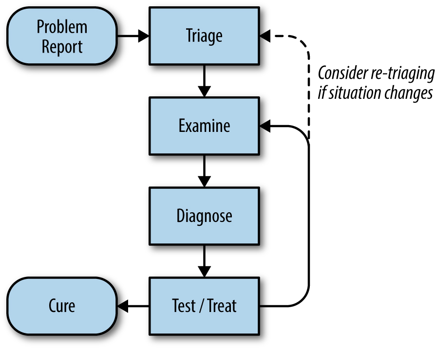
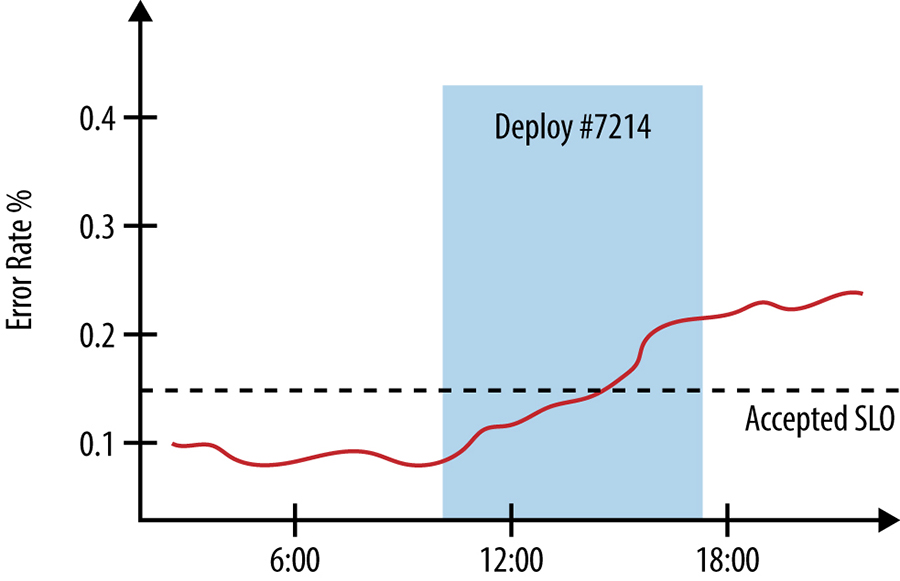
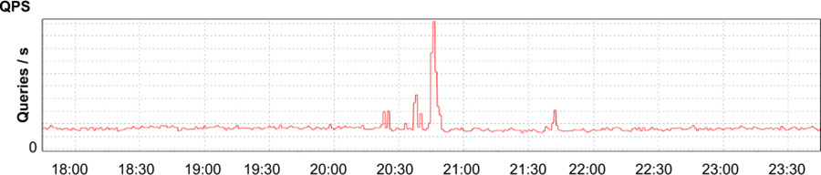
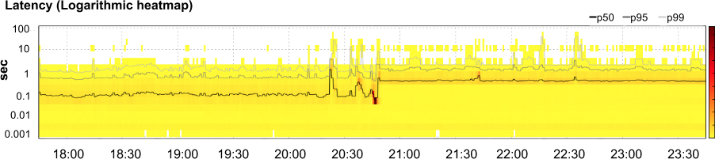
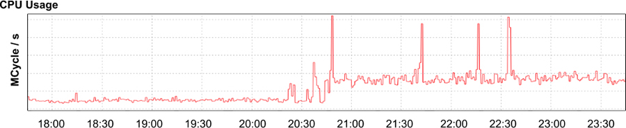
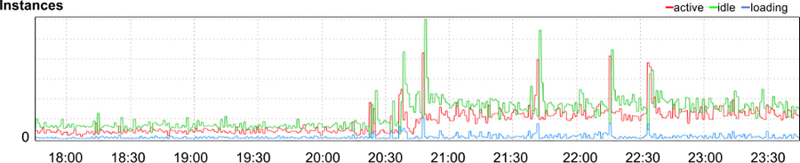

# Chương 12. Xử lý Lỗi Hiệu quả (Effective Troubleshooting)

> **Nguyên bản:** [Chapter 12 - Effective Troubleshooting](https://sre.google/sre-book/effective-troubleshooting/)
> **Nguồn:** Google SRE Book (O'Reilly)
> **Bản dịch tiếng Việt** (Thực hiện bởi Đội ngũ R&D Softdreams)

---

*Tác giả:* Chris Jones

> Hãy được cảnh báo rằng việc là một chuyên gia là hơn cả việc hiểu một hệ thống được giả định hoạt động như thế nào. Chuyên môn đạt được bằng cách điều tra lý do tại sao một hệ thống không hoạt động.
>
> Brian Redman

> Các cách mà mọi thứ đúng là các trường hợp đặc biệt của các cách mà mọi thứ sai.
>
> John Allspaw

Troubleshooting (xử lý lỗi) là một kỹ năng quan trọng cho bất kỳ ai vận hành các hệ thống tính toán phân tán — đặc biệt là các SRE (Site Reliability Engineering — Kỹ thuật Độ tin cậy) — nhưng nó thường bị coi là một kỹ năng bẩm sinh, có người có, có người không. Một lý do của định kiến này là, với những người xử lý lỗi thường xuyên, đó là một quy trình đã ăn sâu; việc giải thích *cách* xử lý lỗi thật khó, giống như giải thích cách đi xe đạp. Tuy nhiên, chúng tôi tin rằng troubleshooting *vừa* có thể học *vừa* có thể dạy.

Người mới thường vấp ngã khi troubleshooting vì bài toán lý tưởng phụ thuộc vào hai yếu tố: sự hiểu biết về cách xử lý lỗi một cách tổng quát (tức không cần kiến thức hệ thống cụ thể nào) và kiến thức vững chắc về chính hệ thống. Dù bạn có thể điều tra một vấn đề chỉ bằng quy trình tổng quát và suy luận từ các nguyên lý đầu tiên,[1](#fn1) chúng tôi thường thấy cách tiếp cận này kém hiệu quả và kém hiệu lực hơn so với việc hiểu các thứ được giả định hoạt động ra sao. Kiến thức về hệ thống thường giới hạn hiệu lực của một SRE mới với một hệ thống; không có gì thay thế được việc học cách hệ thống được thiết kế và xây dựng.

Hãy xem xét một mô hình chung của quy trình troubleshooting. Những độc giả am hiểu troubleshooting có thể tranh luận với các định nghĩa và quy trình của chúng tôi; nếu phương pháp của bạn hiệu quả với bạn, không có lý do gì để không giữ nguyên nó.

## Lý thuyết (Theory)

Một cách chính thức, chúng tôi có thể xem quy trình troubleshooting như một ứng dụng của phương pháp giả định-suy diễn (hypothetico-deductive method):[2](#fn2) với một tập các quan sát về một hệ thống và một nền tảng lý thuyết để hiểu hành vi của nó, chúng tôi lặp đi lặp lại giả thuyết (hypothesize) các nguyên nhân tiềm tàng cho sự cố và cố gắng kiểm thử những giả thuyết đó.

Trong một mô hình lý tưởng hóa như [Hình 12-1](#hinh-12-1), chúng tôi bắt đầu với một báo cáo vấn đề (problem report) cho biết có điều gì đó sai với hệ thống. Sau đó chúng tôi có thể nhìn vào telemetry[3](#fn3) và các log (nhật ký) của hệ thống để hiểu trạng thái hiện tại của nó. Thông tin này, kết hợp với kiến thức của chúng tôi về cách hệ thống được xây dựng, cách nó đáng lẽ phải vận hành, và các chế độ thất bại (failure mode) của nó, cho phép xác định một số nguyên nhân có thể.

[Hình 12-1.](#hinh-12-1) Một quy trình để troubleshooting.

Sau đó chúng tôi có thể kiểm thử các giả thuyết của mình theo một trong hai cách: hoặc so sánh trạng thái quan sát được của hệ thống với các lý thuyết của chúng tôi để tìm bằng chứng xác nhận hoặc phản bác, hoặc trong một số trường hợp, chủ động "trị" (treat) hệ thống — tức thay đổi hệ thống một cách có kiểm soát — rồi quan sát kết quả. Cách tiếp cận thứ hai này làm tinh chỉnh sự hiểu biết của chúng tôi về trạng thái hệ thống và nguyên nhân có thể của các vấn đề được báo cáo. Dùng bất kỳ chiến lược nào trong số này, chúng tôi lặp đi lặp lại kiểm thử cho đến khi một nguyên nhân gốc rễ (root cause) được xác định, lúc đó chúng tôi có thể thực hiện hành động khắc phục để ngăn tái phát và viết một postmortem (báo cáo sau sự cố). Tất nhiên, việc sửa các nguyên nhân gần nhất (proximate cause) không nhất thiết luôn phải chờ cho việc tìm nguyên nhân gốc rễ hay viết postmortem.

### Các Cạm bẫy Chung (Common Pitfalls)

Các phiên troubleshooting kém hiệu quả thường mắc lỗi ở các bước Triage (phân loại), Examine (xét) và Diagnose (chẩn đoán), phần lớn do thiếu hiểu biết sâu về hệ thống. Dưới đây là các cạm bẫy chung cần tránh:

-   Nhìn vào các triệu chứng không liên quan hoặc hiểu sai ý nghĩa của các metrics (chỉ số) hệ thống. Những cuộc truy lùng không đâu (wild goose chase) thường là hậu quả.
-   Hiểu sai cách thay đổi hệ thống, các input (đầu vào) của nó, hoặc môi trường của nó, để kiểm thử các giả thuyết một cách an toàn và hiệu quả.
-   Đưa ra các lý thuyết hoàn toàn không có khả năng xảy ra về điều gì sai, hoặc bám vào nguyên nhân của các vấn đề trong quá khứ, lập luận rằng vì nó đã xảy ra một lần thì giờ chắc phải đang xảy ra lần nữa.
-   Truy tìm các tương quan giả (spurious correlation) thực chất chỉ là trùng hợp hoặc có tương quan với các nguyên nhân chung.

Cách sửa cạm bẫy chung thứ nhất và thứ hai là học hệ thống liên quan và trở nên rành rọt với các mẫu (pattern) thường dùng trong các hệ thống phân tán. Cạm bẫy thứ ba là một tập các sai lầm logic có thể tránh được bằng cách nhớ rằng không phải mọi sự cố đều có khả năng như nhau — như các bác sĩ được dạy, "khi nghe tiếng móng ngựa, hãy nghĩ đến ngựa chứ không phải ngựa vằn."[4](#fn4) Hãy nhớ rằng, khi mọi thứ bằng nhau, chúng ta nên ưu tiên các giải thích đơn giản hơn.[5](#fn5)

Cuối cùng, chúng ta nên nhớ rằng tương quan không phải là nhân quả (correlation is not causation):[6](#fn6) một số sự kiện có tương quan vì chúng chia sẻ một nguyên nhân chung — chẳng hạn packet loss (mất gói tin) trong một cluster (cụm máy) và các ổ cứng hỏng trong cluster đều do một sự mất điện — dù rõ ràng sự cố mạng không gây ra hỏng ổ cứng và ngược lại. Tệ hơn, khi các hệ thống lớn hơn, phức tạp hơn và khi nhiều metrics hơn được giám sát, sẽ khó tránh có những sự kiện tình cờ tương quan tốt với các sự kiện khác, thuần túy do trùng hợp.[7](#fn7)

Việc hiểu các thất bại trong quy trình suy luận của mình là bước đầu tiên để tránh chúng và trở nên hiệu quả hơn trong giải quyết vấn đề. Một cách tiếp cận có hệ thống để nắm rõ những gì mình biết, những gì không biết, và những gì cần biết, sẽ giúp việc tìm ra điều gì đã sai và cách sửa trở nên đơn giản, trực tiếp hơn.

## Trong Thực tế (In Practice)

Trong thực tế, tất nhiên, troubleshooting không bao giờ suôn sẻ như mô hình lý tưởng hóa của chúng tôi gợi ý. Có một số bước có thể làm quy trình bớt đau đầu và hiệu quả hơn cho cả những người gặp vấn đề hệ thống lẫn những người phản ứng với chúng.

## Báo cáo Vấn đề (Problem Report)

Mọi vấn đề bắt đầu bằng một báo cáo vấn đề, có thể là một cảnh báo tự động hay một đồng nghiệp nói "Hệ thống chậm". Một báo cáo hiệu quả nên cho bạn biết hành vi *kỳ vọng*, hành vi *thực tế*, và, nếu có thể, cách tái hiện (reproduce) hành vi.[8](#fn8) Lý tưởng nhất, các báo cáo nên có một dạng nhất quán và được lưu ở một vị trí có thể tìm kiếm, như một hệ thống theo dõi bug (lỗi). Ở đây, các đội chúng tôi thường có các biểu mẫu (form) tùy chỉnh hoặc các ứng dụng web nhỏ, yêu cầu thông tin liên quan đến việc chẩn đoán các hệ thống cụ thể mà họ hỗ trợ, rồi tự động tạo và định tuyến một bug. Đây cũng là một chỗ thích hợp để cung cấp công cụ cho những người báo cáo vấn đề khi họ cố tự chẩn đoán hoặc tự sửa các vấn đề chung của mình.

Tại Google, một thực hành phổ biến là mở một bug cho mọi vấn đề, kể cả những vấn đề nhận qua email hay nhắn tin tức thời. Làm vậy tạo ra một log các hoạt động điều tra và khắc phục, có thể tham chiếu trong tương lai. Nhiều đội không khuyến khích báo cáo vấn đề trực tiếp cho một người vì vài lý do: thực hành này thêm một bước phải ghi lại báo cáo vào bug, tạo ra các báo cáo chất lượng thấp hơn, lại không hiển thị cho các thành viên khác của đội, và có xu hướng dồn khối lượng giải quyết vấn đề lên một vài thành viên mà người báo cáo tình cờ biết, thay vì người đang trực hiện tại (xem thêm [Dealing with Interrupts](https://sre.google/sre-book/dealing-with-interrupts/)).

### Shakespeare Có một Vấn đề (Shakespeare Has a Problem)

Bạn đang on-call (trực sự cố) cho dịch vụ tìm kiếm Shakespeare và nhận một cảnh báo, `Shakespeare-BlackboxProbe_SearchFailure`: giám sát hộp đen (black-box monitoring) của bạn không tìm thấy kết quả tìm kiếm cho "the forms of things unknown" trong năm phút qua. Hệ thống cảnh báo đã đệ trình một bug — kèm liên kết đến các kết quả gần đây của máy dò hộp đen và đến mục playbook (sổ tay kịch bản) cho cảnh báo này — và gán nó cho bạn. Đã đến lúc bung vào hành động!

## Triage (Phân loại)

Khi nhận được một báo cáo vấn đề, bước tiếp theo là tìm ra phải làm gì với nó. Các vấn đề có thể khác nhau về mức độ nghiêm trọng: một vấn đề có thể chỉ ảnh hưởng đến một người dùng trong một hoàn cảnh rất cụ thể (và có thể có cách làm việc thay thế — workaround), hoặc nó có thể là một outage toàn cầu hoàn toàn cho một dịch vụ. Phản ứng của bạn nên tương xứng với tác động của vấn đề: có thể hợp lý khi tuyên bố một tình trạng khẩn cấp all-hands-on-deck (tất cả nhân sự vào cuộc) cho trường hợp sau (xem [Managing Incidents](https://sre.google/sre-book/managing-incidents/)), nhưng làm vậy cho trường hợp trước lại là quá mức cần thiết. Đánh giá mức độ nghiêm trọng của một vấn đề đòi hỏi thực thi phán đoán kỹ thuật tốt và, thường, một mức bình tĩnh nhất định dưới áp lực.

Phản ứng đầu tiên của bạn trong một outage lớn có thể là bắt đầu troubleshooting và cố tìm nguyên nhân gốc rễ nhanh nhất có thể. Hãy bỏ qua trực giác đó!

Thay vào đó, lộ trình hành động của bạn nên là *làm cho hệ thống hoạt động tốt nhất có thể trong hoàn cảnh đó*. Điều này có thể bao gồm các tùy chọn khẩn cấp, như định tuyến traffic (lưu lượng) từ một cluster bị hỏng sang các cluster khác vẫn hoạt động, bỏ traffic đi để ngăn sự cố lan truyền (cascading failure), hoặc vô hiệu hóa các hệ thống con để giảm tải. Chặn sự chảy máu nên là ưu tiên đầu tiên; bạn không đang giúp người dùng nếu hệ thống chết trong khi bạn mải tìm nguyên nhân gốc rễ. Tất nhiên, nhấn mạnh vào triage nhanh không loại trừ việc thực hiện các bước bảo tồn bằng chứng về điều gì đang sai, như các log, để hỗ trợ phân tích nguyên nhân gốc rễ sau đó.

Các phi công mới được dạy rằng trách nhiệm đầu tiên của họ trong tình huống khẩn cấp là lái chiếc máy bay [[Gaw09]](https://sre.google/sre-book/bibliography#Gaw09); troubleshooting là thứ yếu so với việc đưa chiếc máy bay cùng tất cả mọi người trên nó hạ cánh *an toàn*. Cách tiếp cận này cũng áp dụng cho các hệ thống máy tính: ví dụ, nếu một bug đang gây hư hại dữ liệu có thể không thể phục hồi, việc đóng băng (freeze) hệ thống để ngăn thêm sự cố có thể tốt hơn là để hành vi đó tiếp diễn.

Nhận thức này thường khá gây bất an và phản trực giác với các SRE mới, đặc biệt là những người có kinh nghiệm trước đó ở các tổ chức phát triển sản phẩm.

## Examine (Xét) (Examine)

Chúng tôi cần có thể xem xét điều mà mỗi thành phần trong hệ thống đang làm, để hiểu liệu nó có đang hoạt động đúng không.

Lý tưởng nhất, một hệ thống giám sát đang ghi lại các metrics cho hệ thống của bạn như thảo luận trong [Practical Alerting from Time-Series Data](https://sre.google/sre-book/practical-alerting/). Những metrics này là một nơi tốt để bắt đầu tìm ra điều gì sai. Việc đồ thị hóa (graphing) các chuỗi thời gian và các phép toán trên chúng có thể là cách hiệu quả để hiểu hành vi của từng phần cụ thể của một hệ thống và tìm các tương quan có thể gợi ý nơi vấn đề bắt đầu.[9](#fn9)

Logging (ghi nhật ký) là một công cụ vô giá khác. Việc xuất ra (exporting) thông tin về mỗi thao tác và về trạng thái hệ thống cho phép hiểu chính xác một tiến trình (process) đang làm gì tại một thời điểm cụ thể. Bạn có thể cần phân tích các log hệ thống xuyên suốt một hoặc nhiều tiến trình. Việc theo dõi (tracing) các yêu cầu xuyên suốt toàn bộ stack sử dụng các công cụ như Dapper [[Sig10]](https://sre.google/sre-book/bibliography#Sig10) là một cách rất mạnh mẽ để hiểu một hệ thống phân tán hoạt động ra sao, dù các use case (trường hợp sử dụng) khác nhau ngụ ý các thiết kế tracing khác biệt đáng kể [[Sam14]](https://sre.google/sre-book/bibliography#Sam14).

### Logging (Ghi nhật ký)

Các log văn bản rất hữu ích cho việc debug (gỡ lỗi) phản ứng theo thời gian thực, trong khi lưu log ở một định dạng binary (nhị phân) có cấu trúc cho phép xây dựng các công cụ để làm phân tích hồi cứu (retrospective analysis) với nhiều thông tin hơn.

Thật hữu ích khi có nhiều mức độ chi tiết (verbosity level) khả dụng, kèm một cách để tăng các mức này lên tức thì (on-the-fly). Tính năng này cho phép xem xét bất kỳ hay tất cả các thao tác với chi tiết rất cao mà không cần khởi động lại tiến trình, đồng thời vẫn cho phép vặn nhỏ các mức chi tiết khi dịch vụ vận hành bình thường. Tùy vào lượng traffic mà dịch vụ nhận được, có thể tốt hơn là dùng lấy mẫu thống kê (statistical sampling); ví dụ, bạn có thể hiển thị một trong mỗi 1.000 thao tác.

Một bước tiếp theo là thêm một ngôn ngữ chọn lọc (selection language) để bạn có thể nói "cho tôi xem các thao tác khớp với X", với một phạm vi X rộng — ví dụ các RPC (Remote Procedure Call — lời gọi thủ tục từ xa) `Set` có kích thước payload (bộ dữ liệu mang) dưới 1.024 byte, hoặc các thao tác mất lâu hơn 10 ms để trả về, hoặc những cái đã gọi `doSomethingInteresting()` trong *rpc\_handler.py*. Bạn có thể thậm chí muốn thiết kế hạ tầng logging của mình sao cho có thể bật nó khi cần, nhanh chóng và có chọn lọc.

Việc phơi bày (exposing) trạng thái hiện tại là mánh khóe thứ ba trong hộp công cụ của chúng tôi. Ví dụ, các server Google có các endpoint (điểm cuối) hiển thị một mẫu các RPC đã gửi hoặc nhận gần đây, nên có thể hiểu bất kỳ server nào đang giao tiếp với server khác ra sao mà không cần tham chiếu một sơ đồ kiến trúc. Những endpoint này cũng hiển thị các histogram của các tốc độ lỗi và độ trễ cho mỗi loại RPC, để nhanh chóng nhận ra điều gì không ổn. Một số hệ thống có endpoint hiển thị cấu hình hiện tại hoặc cho phép xem xét dữ liệu của chúng; ví dụ các server Borgmon của Google ([Practical Alerting from Time-Series Data](https://sre.google/sre-book/practical-alerting/)) có thể hiển thị các rule giám sát mà chúng đang dùng, và thậm chí cho phép theo dõi một phép tính cụ thể từng bước ngược về các metrics nguồn mà một giá trị được suy ra.

Cuối cùng, bạn có thể thậm chí cần gắn phép đo (instrument) một client để thí nghiệm, nhằm khám phá một thành phần đang trả về gì làm phản hồi cho các yêu cầu.

### Debug Shakespeare (Debugging Shakespeare)

Dùng liên kết đến các kết quả giám sát hộp đen trong bug, bạn phát hiện máy dò gửi một yêu cầu HTTP GET đến endpoint `/api/search`:

{
      'search\_text': 'the forms of things unknown'
    }

Nó kỳ vọng nhận được một phản hồi có mã phản hồi HTTP 200 và một payload JSON khớp chính xác:

\[{
        "work": "A Midsummer Night's Dream",
        "act": 5,
        "scene": 1,
        "line": 2526,
        "speaker": "Theseus"
    }\]

Hệ thống được cấu hình để gửi một probe (mồi) một lần mỗi phút; trong mười phút qua, khoảng một nửa các probe thành công, dù không có mẫu nào nhận dạng được. Thật không may, máy dò không hiển thị cho bạn *điều gì* đã được trả về khi nó thất bại; bạn ghi chú để sửa điều đó trong tương lai.

Dùng `curl`, bạn thủ công gửi các yêu cầu đến endpoint tìm kiếm và nhận được một phản hồi thất bại với mã phản hồi HTTP 502 (Bad Gateway), không có payload. Nó có một HTTP header (tiêu đề), `X-Request-Trace`, liệt kê địa chỉ của các server backend (phía sau) chịu trách nhiệm trả lời cho yêu cầu đó. Với thông tin này, giờ bạn có thể xem xét những backend đó để kiểm tra chúng có đang phản hồi đúng không.

## Diagnose (Chẩn đoán) (Diagnose)

Một sự hiểu biết toàn diện về thiết kế hệ thống chắc chắn hữu ích để đưa ra các giả thuyết hợp lý về điều gì đã sai, nhưng cũng có một số thực hành tổng quát giúp được dù không có kiến thức miền (domain).

### Đơn giản hóa và giảm (Simplify and reduce)

Lý tưởng nhất, các thành phần trong một hệ thống có các giao diện (interface) được định nghĩa rõ ràng và thực hiện các phép biến đổi (transformation) đã biết từ input đến output (đầu ra) của chúng (trong ví dụ của chúng tôi, được cho một input văn bản tìm kiếm, một thành phần có thể trả về output chứa các khớp có thể). Khi đó có thể nhìn vào các kết nối *giữa* các thành phần — hoặc, tương đương, vào dữ liệu đang chảy giữa chúng — để xác định liệu một thành phần cụ thể có đang hoạt động đúng không. Việc tiêm (injecting) dữ liệu kiểm thử đã biết để kiểm tra rằng output kết quả đúng như kỳ vọng (một dạng kiểm thử hộp đen) ở mỗi bước có thể đặc biệt hiệu quả, cũng như việc tiêm dữ liệu có chủ đích để dò (probe) các nguyên nhân có thể của lỗi. Có một trường hợp kiểm thử tái hiện được vững chắc sẽ làm debug nhanh hơn nhiều, và có thể dùng trường hợp đó trong một môi trường non-production, nơi các kỹ thuật xâm lấn hơn hoặc rủi ro hơn khả dụng hơn so với trong production.

Việc "chia để trị" (divide and conquer) là một kỹ thuật giải quyết vấn đề đa dụng, rất hữu ích. Trong một hệ thống nhiều tầng mà công việc diễn ra xuyên suốt một stack các thành phần, cách tốt nhất thường là bắt đầu có hệ thống từ một đầu của stack và làm việc đến đầu kia, xem xét từng thành phần một. Chiến lược này cũng phù hợp tốt với các đường ống xử lý dữ liệu (data processing pipeline). Trong các hệ thống rất lớn, việc tiến tuyến tính có thể quá chậm; một cách thay thế là *bisection* (chia đôi), chia hệ thống làm hai và xem xét các đường truyền thông giữa các thành phần ở một bên với bên kia. Sau khi xác định một nửa có vẻ đang hoạt động đúng hay không, lặp lại quy trình cho đến khi còn lại một thành phần khả nghi có lỗi.

### Hỏi "cái gì", "ở đâu", và "tại sao" (Ask "what," "where," and "why")

Một hệ thống trục trặc thường vẫn đang cố làm *điều gì đó* — chỉ không phải điều bạn muốn nó làm. Tìm ra *nó* đang làm gì, rồi hỏi *tại sao* nó làm điều đó, và *ở đâu* tài nguyên của nó được dùng hoặc output của nó đi đâu, có thể giúp bạn hiểu các thứ đã sai ra sao.[10](#fn10)

### Gỡ bỏ các Nguyên nhân của một Triệu chứng (Unpacking the Causes of a Symptom)

**Triệu chứng**: Một cluster Spanner có độ trễ cao và các RPC đến các server của nó đang hết thời gian (time out).

**Tại sao**? Các task Spanner server đang dùng hết thời gian CPU và không thể xử lý tiếp tất cả các yêu cầu mà client gửi.

**Ở đâu** trong server thời gian CPU được dùng? Profiling (đo hiệu năng) server cho thấy nó đang sắp xếp các entry trong các log đã checkpoint (ghi điểm kiểm tra) ra disk (ổ đĩa).

**Ở đâu** trong code sắp xếp log mà nó được dùng? Khi đánh giá một regular expression (biểu thức chính quy) trên các đường dẫn đến các tệp log.

**Các giải pháp**: Viết lại regular expression để tránh backtracking (truy lùi). Tìm trong codebase (kho mã nguồn) các mẫu tương tự. Cân nhắc dùng RE2, không backtrack và đảm bảo thời gian thực thi tăng tuyến tính theo kích thước input.[11](#fn11)

### Điều gì đã chạm vào nó gần đây nhất (What touched it last)

Các hệ thống có quán tính (inertia): chúng tôi nhận thấy một hệ thống máy tính đang hoạt động có xu hướng giữ nguyên cho đến khi bị tác động bởi một lực bên ngoài, như một thay đổi cấu hình hay một thay đổi về loại tải được phục vụ. Các thay đổi gần đây đối với một hệ thống có thể là một điểm khởi đầu hiệu quả để xác định điều gì đang sai.[12](#fn12)

Các hệ thống được thiết kế tốt nên có log production rộng rãi để theo dõi các lần triển khai phiên bản mới và các thay đổi cấu hình ở mọi tầng của stack, từ các binary server xử lý traffic người dùng xuống đến các gói (package) cài đặt trên từng node (nút) trong cluster. Việc tương quan các thay đổi về hiệu năng và hành vi của một hệ thống với các sự kiện khác trong hệ thống và môi trường cũng có thể hữu ích khi xây dựng các dashboard giám sát; ví dụ, bạn có thể chú thích một đồ thị hiển thị các tốc độ lỗi của hệ thống với thời điểm bắt đầu và kết thúc của một lần triển khai phiên bản mới, như trong [Hình 12-2](#hinh-12-2).

[Hình 12-2.](#hinh-12-2) Các tốc độ lỗi được đồ thị đối với thời gian bắt đầu và kết thúc triển khai.

Việc thủ công gửi một yêu cầu đến endpoint `/api/search` (xem [Debug Shakespeare](#debug-shakespeare)) và thấy sự cố liệt kê các server backend đã xử lý phản hồi cho phép bạn loại trừ khả năng vấn đề nằm ở server API frontend (mặt trước) hay ở các load balancer (bộ cân bằng tải): phản hồi nhiều khả năng sẽ không chứa thông tin đó nếu yêu cầu không ít nhất đã đến được các backend tìm kiếm và thất bại ở đó. Giờ bạn có thể tập trung nỗ lực vào các backend — phân tích log của chúng, gửi các truy vấn kiểm thử để xem chúng trả về phản hồi gì, và xem xét các metrics đã xuất ra của chúng.

### Chẩn đoán Cụ thể (Specific diagnoses)

Dù các công cụ tổng quát được mô tả trước đó hữu ích trong một phạm vi rộng các miền vấn đề, bạn có thể thấy hữu ích khi xây dựng các công cụ, hệ thống để hỗ trợ chẩn đoán các dịch vụ cụ thể của mình. Các SRE Google dành phần lớn thời gian để xây dựng những công cụ như vậy. Dù nhiều công cụ trong số này nhất thiết đặc thù cho một hệ thống nhất định, hãy chắc chắn tìm các điểm chung giữa các dịch vụ và các đội để tránh trùng lặp nỗ lực.

## Kiểm thử và Trị (Test and Treat)

Khi đã có một danh sách ngắn các nguyên nhân có thể, đã đến lúc cố tìm *yếu tố nào* là gốc rễ thực sự của vấn đề. Dùng phương pháp thực nghiệm, chúng tôi có thể cố loại vào (rule in) hoặc loại ra (rule out) các giả thuyết. Ví dụ, giả sử chúng tôi nghĩ một vấn đề do một sự cố mạng giữa một server logic ứng dụng và một server database (cơ sở dữ liệu), hoặc do database từ chối kết nối. Thử kết nối đến database với cùng thông tin xác thực (credentials) mà server logic ứng dụng dùng có thể bác bỏ giả thuyết thứ hai, trong khi ping server database có thể bác bỏ giả thuyết thứ nhất, tùy vào tô-pô mạng, các rule firewall (tường lửa) và các yếu tố khác. Việc theo dõi code và cố bắt chước luồng code, từng bước một, có thể chỉ ra chính xác điều gì đang sai.

Có một số yếu tố cần cân nhắc khi thiết kế các kiểm thử (có thể đơn giản như gửi một ping, hoặc phức tạp như loại bỏ traffic từ một cluster và tiêm các yêu cầu được tạo riêng để tìm một race condition (trạng thái đua)):

-   Một kiểm thử lý tưởng nên có các phương án loại trừ lẫn nhau, để nó có thể loại một nhóm giả thuyết vào và loại một nhóm khác ra. Trong thực tế, điều này có thể khó đạt được.
-   Hãy cân nhắc điều hiển nhiên trước tiên: thực hiện các kiểm thử theo thứ tự giảm dần của khả năng xảy ra, cân nhắc các rủi ro có thể cho hệ thống từ kiểm thử. Thường hợp lý hơn là kiểm tra các vấn đề kết nối mạng giữa hai máy trước khi xem xét liệu một thay đổi cấu hình gần đây đã loại bỏ truy cập của một người dùng đến máy thứ hai hay chưa.
-   Một thí nghiệm có thể cho kết quả gây hiểu lầm do các yếu tố gây nhiễu (confounding factor). Ví dụ, một rule firewall có thể chỉ cho phép truy cập từ một địa chỉ IP cụ thể, điều có thể làm việc ping database từ workstation (máy trạm) của bạn thất bại, dù ping từ máy của server logic ứng dụng đã thành công.
-   Các kiểm thử chủ động (active) có thể có tác dụng phụ (side effect) làm thay đổi kết quả kiểm thử trong tương lai. Ví dụ, cho phép một tiến trình dùng nhiều CPU hơn có thể làm các thao tác nhanh hơn, nhưng cũng có thể tăng khả năng gặp data race (đua dữ liệu). Tương tự, bật logging chi tiết có thể làm một vấn đề độ trễ tồi tệ hơn và làm rối kết quả của bạn: vấn đề đang tự tồi tệ hơn, hay do logging?
-   Một số kiểm thử có thể không có tính quyết định, chỉ mang tính gợi ý. Có thể rất khó để làm cho race condition hay deadlock (tử tự khóa) xảy ra một cách kịp thời và tái hiện được, nên bạn có thể phải chấp nhận bằng chứng kém chắc chắn hơn rằng những cái đó là nguyên nhân.

Ghi chú rõ ràng về các ý tưởng bạn đã có, những kiểm thử đã chạy và các kết quả đã thấy.[13](#fn13) Đặc biệt khi đối phó với các trường hợp phức tạp và kéo dài, tài liệu này có thể quyết định trong việc giúp bạn nhớ chính xác điều gì đã xảy ra và ngăn việc lặp lại những bước này.[14](#fn14) Nếu bạn đã thực hiện kiểm thử chủ động bằng cách thay đổi một hệ thống — ví dụ cho một tiến trình nhiều tài nguyên hơn — việc thực hiện các thay đổi một cách có hệ thống và được ghi lại sẽ giúp bạn đưa hệ thống về cấu hình trước kiểm thử, thay vì để nó chạy trong một cấu hình hodge-podge (hỗn tạp) không xác định.

## Các Kết quả Âm là Ma thuật (Negative Results Are Magic)

*Tác giả:* Randall Bosetti
*Biên tập:* Joan Wendt

Một kết quả "âm" (negative) là một kết quả thực nghiệm mà hiệu ứng được kỳ vọng vắng mặt — tức là bất kỳ thí nghiệm nào không diễn ra theo kế hoạch. Điều này bao gồm các thiết kế mới, heuristics (quy tắc gần đúng), hay quy trình con người thất bại trong việc cải thiện các hệ thống mà chúng thay thế.

**Các kết quả âm không nên bị bỏ qua hay xem nhẹ.** Việc nhận ra mình sai có nhiều giá trị: một kết quả âm rõ ràng có thể giải quyết một số câu hỏi thiết kế khó nhất. Thường một đội có hai thiết kế dường như hợp lý nhưng đi theo hai hướng phải đối mặt với các câu hỏi mơ hồ, suy đoán về liệu hướng kia có thể tốt hơn hay không.

**Các thí nghiệm có kết quả âm là có tính quyết định.** Chúng cho chúng tôi biết điều gì đó chắc chắn về production, về không gian thiết kế, hay về các giới hạn hiệu năng của một hệ thống hiện có. Chúng có thể giúp người khác xác định liệu thí nghiệm hay thiết kế của chính họ có đáng giá không. Ví dụ, một đội phát triển cụ thể có thể quyết định loại một web server (server web) vì nó chỉ xử lý được khoảng 800 kết nối trong số 8.000 kết nối cần thiết trước khi sập do lock contention (tranh chấp khóa). Khi một đội phát triển sau đó muốn đánh giá các web server, thay vì bắt đầu từ đầu, họ có thể dùng kết quả âm đã được ghi lại kỹ lưỡng này làm điểm khởi đầu để nhanh chóng quyết định liệu (a) họ cần ít hơn 800 kết nối, hay (b) các vấn đề lock contention đã được giải quyết.

Ngay cả khi kết quả âm không áp dụng trực tiếp cho thí nghiệm của người khác, dữ liệu bổ trợ thu được có thể giúp họ chọn thí nghiệm mới hoặc tránh các cạm bẫy trong các thiết kế trước đó. Các microbenchmark (đo hiệu năng vi mô), các antipattern (mô hình chống) được ghi lại, và các postmortem dự án đều thuộc danh mục này. Khi thiết kế một thí nghiệm, bạn nên cân nhắc phạm vi của kết quả âm, vì một kết quả âm rộng hoặc đặc biệt vững chắc sẽ giúp đồng nghiệp của bạn nhiều hơn.

**Các công cụ và phương pháp có thể sống sót lâu hơn thí nghiệm và dẫn dắt công việc tương lai.** Ví dụ, các công cụ benchmark (đo chuẩn) và máy tạo tải (load generator) có thể ra đời dễ dàng như nhau từ một thí nghiệm phản bác hay một thí nghiệm xác nhận. Nhiều webmaster (quản trị web) đã hưởng lợi từ công việc tỉ mỉ, khó khăn tạo ra Apache Bench, một công cụ loadtest web server, ngay cả khi các kết quả đầu tiên của nó nhiều khả năng đáng thất vọng.

Việc xây dựng công cụ cho các thí nghiệm có thể lặp lại cũng có thể mang lại lợi ích gián tiếp: dù một ứng dụng bạn xây dựng có thể không hưởng lợi từ việc đặt database lên SSD (Ổ đĩa Trạng thái Rắn) hay từ việc tạo các index (chỉ mục) cho các key (khóa) dày đặc, ứng dụng tiếp theo có thể làm được. Việc viết một script (lệnh) cho phép bạn dễ dàng thử những thay đổi cấu hình này đảm bảo bạn không quên hay bỏ lỡ các tối ưu hóa trong dự án tiếp theo.

**Việc công bố các kết quả âm cải thiện văn hóa dựa trên dữ liệu của ngành chúng tôi.** Việc tính đến các kết quả âm và sự không có ý nghĩa thống kê giúp giảm thiên kiến trong các metrics của chúng tôi và cho người khác một ví dụ về cách chấp nhận sự không chắc chắn một cách chín chắn. Bằng cách công bố mọi thứ, bạn khuyến khích người khác làm theo, và tất cả mọi người trong ngành cùng học nhanh hơn nhiều. SRE đã học bài học này qua các postmortem chất lượng cao, vốn có tác động tích cực lớn đến sự ổn định production.

**Hãy công bố kết quả của bạn.** Nếu bạn quan tâm đến kết quả của một thí nghiệm, nhiều khả năng người khác cũng vậy. Khi bạn công bố kết quả, họ không cần phải thiết kế và chạy một thí nghiệm tương tự riêng. Rất cám dỗ và phổ biến để tránh báo cáo các kết quả âm vì dễ thấy rằng thí nghiệm đã "thất bại". Một số thí nghiệm bị định sẵn số phận, và chúng có xu hướng bị bắt bởi việc xem xét (review). Nhiều thí nghiệm hơn nữa đơn giản không được báo cáo vì mọi người nhầm tưởng rằng kết quả âm không phải là tiến bộ.

Hãy làm phần của mình bằng cách kể cho mọi người về các thiết kế, thuật toán và luồng công việc đội mà bạn đã loại bỏ. Khuyến khích đồng nghiệp bằng cách công nhận rằng kết quả âm là một phần của việc chấp nhận rủi ro có suy nghĩ và rằng mọi thí nghiệm được thiết kế kỹ lưỡng đều có giá trị. Hãy hoài nghi bất kỳ tài liệu thiết kế, đánh giá hiệu năng hay bài luận nào không đề cập đến sự thất bại. Một tài liệu như vậy có khả năng hoặc bị lọc quá nặng, hoặc tác giả không nghiêm ngặt trong phương pháp của mình.

Trên hết, hãy công bố các kết quả khiến bạn bất ngờ, để người khác — kể cả chính bạn trong tương lai — không bị bất ngờ.

## Chữa trị (Cure)

Lý tưởng nhất, bạn giờ đã thu hẹp tập các nguyên nhân có thể xuống còn một. Tiếp theo, chúng tôi muốn chứng minh đó chính là nguyên nhân thực sự. Việc chứng minh dứt khoát rằng một yếu tố cụ thể *đã gây ra* một vấn đề — bằng cách tái hiện nó theo ý muốn — có thể khó thực hiện trong các hệ thống production; thường chúng tôi chỉ có thể tìm ra các yếu tố nhân quả *khả năng*, vì các lý do sau:

-   *Các hệ thống là phức tạp*. Rất có thể có nhiều yếu tố, mỗi yếu tố riêng lẻ không đủ để là nguyên nhân, nhưng khi kết hợp lại thì lại là nguyên nhân.[15](#fn15) Các hệ thống thực cũng thường phụ thuộc vào đường dẫn (path-dependent), nghĩa là chúng phải ở trong một trạng thái cụ thể trước khi một sự cố xảy ra.
-   *Việc tái hiện vấn đề trong một hệ thống production đang chạy có thể không phải là một tùy chọn*, hoặc vì độ phức tạp của việc đưa hệ thống vào trạng thái mà sự cố có thể được kích hoạt, hoặc vì thêm thời gian downtime có thể không thể chấp nhận được. Có một môi trường non-production có thể giảm nhẹ những thách thức này, dù với chi phí là phải có một bản sao khác của hệ thống để chạy.

Khi đã tìm ra các yếu tố gây ra vấn đề, đã đến lúc viết ghi chú về điều gì đã sai với hệ thống, cách bạn đã truy tìm vấn đề, cách bạn đã sửa, và cách ngăn nó xảy ra lần nữa. Nói cách khác, bạn cần viết một postmortem (dù lý tưởng nhất, hệ thống đang *chạy* tại thời điểm này!).

## Nghiên cứu Tình huống (Case Study)

App Engine,[16](#fn16) một phần của Cloud Platform của Google, là một sản phẩm platform-as-a-service (nền tảng-dịch-vụ) cho phép các developer (nhà phát triển) xây dựng dịch vụ trên hạ tầng của Google. Một trong những khách hàng nội bộ của chúng tôi đã đệ trình một báo cáo vấn đề cho biết họ gần đây thấy một sự tăng đáng kể về độ trễ, việc dùng CPU, và số lượng tiến trình đang chạy cần thiết để phục vụ traffic cho ứng dụng của họ — một hệ thống quản lý nội dung dùng để xây dựng tài liệu cho các developer.[17](#fn17) Khách hàng không tìm thấy bất kỳ thay đổi gần đây nào trong code của họ có tương quan với sự tăng tài nguyên, và cũng không có sự tăng traffic đến ứng dụng (xem [Hình 12-3](#hinh-12-3)), nên họ tự hỏi liệu một thay đổi trong dịch vụ App Engine có phải thủ phạm hay không.

Cuộc điều tra của chúng tôi phát hiện ra rằng độ trễ thực sự đã tăng gần một bậc độ lớn (như hiển thị trong [Hình 12-4](#hinh-12-4)). Cùng lúc, lượng thời gian CPU ([Hình 12-5](#hinh-12-5)) và số tiến trình phục vụ ([Hình 12-6](#hinh-12-6)) đã gần gấp bốn lần. Rõ ràng có điều gì đó sai. Đã đến lúc bắt đầu troubleshooting.

[Hình 12-3.](#hinh-12-3) Các yêu cầu nhận được mỗi giây của ứng dụng, hiển thị một đỉnh (spike) ngắn và trở lại bình thường.

[Hình 12-4.](#hinh-12-4) Độ trễ của ứng dụng, hiển thị các phân vị (percentiles) thứ 50, 95, và 99 (các đường) với một heatmap (bản đồ nhiệt) hiển thị bao nhiêu yêu cầu rơi vào một bucket (hộp) độ trễ cụ thể tại bất kỳ điểm thời gian nào (bóng mờ).

[Hình 12-5.](#hinh-12-5) Việc sử dụng CPU tổng hợp cho ứng dụng.

[Hình 12-6.](#hinh-12-6) Số lượng các instance cho ứng dụng.

Thông thường, một sự tăng đột ngột về độ trễ và việc dùng tài nguyên chỉ hoặc là do một sự tăng traffic gửi đến hệ thống, hoặc do một thay đổi cấu hình hệ thống. Tuy nhiên, chúng tôi có thể dễ dàng loại trừ cả hai nguyên nhân có thể này: dù một đỉnh traffic đến ứng dụng quanh 20:45 có thể giải thích một sự gia tăng ngắn việc dùng tài nguyên, chúng tôi vẫn mong đợi mức traffic quay về mức cơ sở (baseline) khá sớm sau khi lượng yêu cầu trở lại bình thường. Đỉnh này chắc chắn không nên kéo dài nhiều ngày, bắt đầu từ khi các developer ứng dụng đệ trình báo cáo và chúng tôi bắt đầu xem xét vấn đề. Thứ hai, sự thay đổi hiệu năng xảy ra vào thứ Bảy, lúc mà cả thay đổi ứng dụng lẫn môi trường production đều không đang được triển khai. Các lần push code gần nhất và các lần push cấu hình của dịch vụ đã hoàn thành từ nhiều ngày trước. Hơn nữa, nếu vấn đề bắt nguồn từ dịch vụ, chúng tôi sẽ mong đợi thấy các hiệu ứng tương tự trên các ứng dụng khác dùng chung hạ tầng. Tuy nhiên, không ứng dụng nào khác đang trải qua các hiệu ứng tương tự.

Chúng tôi đã chuyển báo cáo vấn đề cho các đối tác — các developer của App Engine — để điều tra xem liệu khách hàng có đang gặp phải đặc điểm riêng (idiosyncrasy) nào trong hạ tầng phục vụ không. Các developer cũng không tìm thấy điều gì kỳ lạ. Tuy nhiên, một developer nhận thấy một tương quan giữa sự tăng độ trễ và sự tăng của một lời gọi API lưu trữ dữ liệu cụ thể, `merge_join`, thường chỉ báo các index không tối ưu khi đọc từ datastore (kho dữ liệu). Việc thêm một composite index (chỉ mục ghép) trên các thuộc tính mà ứng dụng dùng để chọn các object (đối tượng) từ datastore sẽ làm nhanh các yêu cầu đó, và về mặt nguyên tắc, làm nhanh ứng dụng nói chung — nhưng chúng tôi cần tìm ra *thuộc tính nào* cần được index. Một cái nhìn nhanh vào code ứng dụng không tiết lộ nghi phạm nào hiển nhiên.

Đã đến lúc rút các "máy móc nặng" trong hộp công cụ của chúng tôi: dùng Dapper [[Sig10]](https://sre.google/sre-book/bibliography#Sig10), chúng tôi đã theo dõi các bước mà các yêu cầu HTTP riêng lẻ thực hiện — từ lúc reverse proxy (bộ proxy ngược) frontend nhận cho đến điểm code ứng dụng trả phản hồi — và xem các RPC mỗi server phát ra liên quan đến việc xử lý yêu cầu đó. Làm vậy cho phép chúng tôi thấy thuộc tính nào được chứa trong các yêu cầu đến datastore, rồi tạo các index phù hợp.

Trong khi điều tra, chúng tôi phát hiện ra rằng các yêu cầu cho nội dung tĩnh như hình ảnh, không được phục vụ từ datastore, cũng chậm hơn đáng kể so với kỳ vọng. Nhìn vào các đồ thị với độ hạt cấp tệp, chúng tôi thấy các phản hồi của chúng nhanh hơn nhiều chỉ vài ngày trước. Điều này ngụ ý rằng tương quan quan sát được giữa `merge_join` và sự tăng độ trễ là giả, và rằng lý thuyết index không tối ưu của chúng tôi sai lầm chí mạng.

Xem xét các yêu cầu bất ngờ chậm cho nội dung tĩnh, phần lớn các RPC phát ra từ ứng dụng là đến một dịch vụ memcache (bộ nhớ đệm), nên các yêu cầu lẽ ra phải rất nhanh — ở mức vài mili giây. Các yêu cầu này thực ra đã rất nhanh, nên vấn đề dường như không bắt nguồn ở đó. Tuy nhiên, giữa thời điểm ứng dụng bắt đầu xử lý một yêu cầu và lúc nó thực hiện các RPC đầu tiên, có một khoảng thời gian khoảng 250 ms mà ứng dụng đang làm… chà, *điều gì đó*. Vì App Engine chạy code do người dùng cung cấp, đội SRE của nó không profiling hay xem xét code ứng dụng, nên chúng tôi không thể biết ứng dụng đang làm gì trong khoảng đó; tương tự, Dapper không giúp truy tìm điều gì đang xảy ra vì nó chỉ có thể trace (theo dõi) các lời gọi RPC, và không có lời gọi nào được thực hiện trong khoảng thời gian đó.

Đối mặt với điều mà, vào lúc này, là một bí ẩn khá lớn, chúng tôi quyết định không giải quyết nó…*lúc này*. Khách hàng có một lần ra mắt công khai vào tuần tiếp theo, và chúng tôi không chắc khi nào sẽ xác định và sửa được vấn đề. Thay vào đó, chúng tôi khuyến nghị khách hàng tăng tài nguyên cấp phát cho ứng dụng lên loại instance giàu CPU nhất khả dụng. Làm vậy đã giảm độ trễ của ứng dụng xuống mức chấp nhận được, dù không thấp như chúng tôi muốn. Chúng tôi kết luận rằng việc giảm nhẹ độ trễ là đủ để đội có thể ra mắt thành công, rồi điều tra một cách thong thả.[18](#fn18)

Vào thời điểm này, chúng tôi nghi ngờ rằng ứng dụng là nạn nhân của một nguyên nhân chung khác của các sự tăng đột ngột về độ trễ và việc dùng tài nguyên: một thay đổi trong loại công việc. Chúng tôi đã thấy một sự tăng trong các ghi (writes) đến datastore từ ứng dụng, ngay trước khi độ trễ của nó tăng, nhưng vì sự tăng này không lớn — và cũng không được duy trì — chúng tôi đã gạt bỏ nó, cho là một sự trùng hợp. Tuy nhiên, hành vi này thực sự giống một mẫu phổ biến: một instance của ứng dụng được khởi tạo bằng cách đọc các object từ datastore, rồi lưu trữ chúng trong bộ nhớ của instance. Bằng cách làm vậy, instance tránh việc đọc các cấu hình hiếm thay đổi từ datastore ở mỗi yêu cầu, và thay vào đó tra các object trong bộ nhớ. Sau đó, thời gian xử lý các yêu cầu thường sẽ tăng theo lượng dữ liệu cấu hình.[19](#fn19) Chúng tôi không thể chứng minh rằng hành vi này là gốc rễ của vấn đề, nhưng nó là một antipattern phổ biến.

Các developer ứng dụng đã thêm việc đo lường để hiểu ứng dụng đang dành thời gian ở đâu. Họ xác định được một method (phương thức) được gọi trên mỗi yêu cầu, kiểm tra xem liệu một người dùng có quyền truy cập đã được whitelist (danh sách trắng) đến một đường dẫn cụ thể không. Method dùng một tầng cache (bộ đệm) cố gắng giảm thiểu các truy cập vào cả datastore lẫn dịch vụ memcache, bằng cách giữ các object whitelist trong bộ nhớ của các instance. Như một developer ứng dụng đã lưu ý trong cuộc điều tra, "Tôi không biết ngọn lửa ở đâu, nhưng tôi bị mù bởi khói bốc lên từ cache whitelist này."

Một thời gian sau, nguyên nhân gốc rễ được tìm thấy: do một bug lâu năm trong hệ thống kiểm soát truy cập của ứng dụng, mỗi khi một đường dẫn cụ thể được truy cập, một object whitelist được tạo và lưu vào datastore. Trong giai đoạn chạy nước rút trước ra mắt, một máy quét bảo mật tự động đã kiểm thử ứng dụng để tìm lỗ hổng, và như một tác dụng phụ, việc quét của nó tạo ra hàng nghìn object whitelist trong suốt nửa giờ. Những object whitelist thừa thãi này sau đó phải được kiểm tra trên mỗi yêu cầu đến ứng dụng, dẫn đến các phản hồi chậm đến mức bệnh lý — mà không hề gây ra bất kỳ lời gọi RPC nào từ ứng dụng đến các dịch vụ khác. Việc sửa bug và loại bỏ những object đó đã đưa hiệu năng ứng dụng về mức kỳ vọng.

## Làm cho Troubleshooting Dễ hơn (Making Troubleshooting Easier)

Có nhiều cách để đơn giản hóa và tăng tốc troubleshooting. Có lẽ cơ bản nhất là:

-   Xây dựng khả năng quan sát được (observability) — với cả metrics hộp trắng lẫn log có cấu trúc — vào mỗi thành phần từ nền móng
-   Thiết kế các hệ thống với các giao diện rõ ràng và có thể quan sát được giữa các thành phần.

Đảm bảo rằng thông tin khả dụng theo cách nhất quán xuyên suốt một hệ thống — ví dụ dùng một định danh yêu cầu duy nhất xuyên suốt span của các RPC do các thành phần khác nhau tạo ra — giảm nhu cầu phải tìm entry log *nào* trên một thành phần upstream (phía trên) khớp với entry log trên một thành phần downstream (phía dưới), tăng tốc thời gian đến chẩn đoán và phục hồi.

Các vấn đề trong việc biểu diễn đúng trạng thái thực tế của một thay đổi code hay một thay đổi môi trường thường dẫn đến nhu cầu phải troubleshooting. Việc đơn giản hóa, kiểm soát và ghi log những thay đổi như vậy có thể giảm nhu cầu phải troubleshooting, và làm cho nó dễ hơn khi nó xảy ra.

## Kết luận (Conclusion)

Chúng tôi đã xem xét một số bước bạn có thể thực hiện để làm cho quy trình troubleshooting rõ ràng và dễ hiểu cho người mới, để họ cũng có thể trở nên hiệu quả trong giải quyết vấn đề. Việc áp dụng một cách tiếp cận có hệ thống với troubleshooting — thay vì dựa vào may mắn hay kinh nghiệm — có thể giúp giới hạn thời gian phục hồi của các dịch vụ, dẫn đến một trải nghiệm tốt hơn cho người dùng của bạn.

[1](#fn1) Thật vậy, việc chỉ sử dụng các nguyên lý đầu tiên và kỹ năng troubleshooting thường là một cách hiệu quả để học cách một hệ thống hoạt động; xem [Accelerating SREs to On-Call and Beyond](https://sre.google/sre-book/accelerating-sre-on-call/).

[2](#fn2) Xem [*https://en.wikipedia.org/wiki/Hypothetico-deductive\_model*](https://en.wikipedia.org/wiki/Hypothetico-deductive_model).

[3](#fn3) Ví dụ, các biến đã xuất ra như được mô tả trong [Practical Alerting from Time-Series Data](https://sre.google/sre-book/practical-alerting/).

[4](#fn4) Thuộc về Theodore Woodward, của Trường Y University of Maryland, vào những năm 1940. Xem [*https://en.wikipedia.org/wiki/Zebra\_(medicine)*](https://en.wikipedia.org/wiki/Zebra_\(medicine\)). Điều này hoạt động trong một số miền, nhưng trong một số hệ thống, cả các lớp sự cố có thể bị loại bỏ: ví dụ, sử dụng một cluster filesystem được thiết kế tốt có nghĩa là một vấn đề độ trễ ít có khả năng là do một disk (ổ đĩa) chết đơn lẻ.

[5](#fn5) Dao cạo của Occam (Occam's Razor); xem [*https://en.wikipedia.org/wiki/Occam%27s\_razor*](https://en.wikipedia.org/wiki/Occam%27s_razor). Nhưng hãy nhớ rằng có thể vẫn là trường hợp rằng có nhiều vấn đề; đặc biệt, có thể nhiều khả năng hơn rằng một hệ thống có một số vấn đề chung mức thấp, khi xét chung lại, giải thích tất cả các triệu chứng thay vì một vấn đề hiếm gây ra tất cả chúng. So sánh [*https://en.wikipedia.org/wiki/Hickam%27s\_dictum*](https://en.wikipedia.org/wiki/Hickam%27s_dictum).

[6](#fn6) Tất nhiên, xem [*https://xkcd.com/552*](https://xkcd.com/552).

[7](#fn7) Ít nhất, chúng tôi không có một lý thuyết hợp lý để giải thích tại sao số lượng tiến sĩ (PhDs) được cấp trong lĩnh vực Khoa học Máy tính ở nước Mỹ nên có tương quan cực kỳ tốt (r2 = 0.9416) với mức tiêu thụ phô mai trên đầu người, giữa năm 2000 và 2009: [*https://tylervigen.com/view\_correlation?id=1099*](https://tylervigen.com/view_correlation?id=1099).

[8](#fn8) Có thể hữu ích khi tham chiếu những người báo cáo bug tiềm tàng đến [[Tat99]](https://sre.google/sre-book/bibliography#Tat99) để giúp họ cung cấp các báo cáo vấn đề chất lượng cao.

[9](#fn9) Nhưng hãy cảnh giác các tương quan giả có thể dẫn bạn xuống các con đường sai!

[10](#fn10) Về nhiều mặt, điều này tương tự như kỹ thuật "Năm Câu hỏi Tại sao" (Five Whys) [[Ohn88]](https://sre.google/sre-book/bibliography#Ohn88) được Taiichi Ohno giới thiệu để hiểu các nguyên nhân gốc rễ của các lỗi sản xuất.

[11](#fn11) Trái ngược với RE2, PCRE có thể đòi hỏi thời gian mũ để đánh giá một số regular expressions. RE2 khả dụng tại [*https://github.com/google/re2*](https://github.com/google/re2).

[12](#fn12) [[All15]](https://sre.google/sre-book/bibliography#All15) quan sát rằng đây là một heuristic được sử dụng thường xuyên trong việc giải quyết các outage.

[13](#fn13) Việc sử dụng một tài liệu chia sẻ hoặc chat thời gian thực cho các ghi chú cung cấp một dấu mốc thời gian của *khi* bạn đã làm một điều gì đó, điều hữu ích cho các postmortem. Nó cũng chia sẻ thông tin đó với người khác, để họ cập nhật với trạng thái hiện tại của thế giới và không cần phải ngắt troubleshooting của bạn.

[14](#fn14) Xem thêm [Các Kết quả Âm là Ma thuật](#cac-ket-qua-am-la-ma-phuat) để có thêm về điểm này.

[15](#fn15) Xem [[Mea08]](https://sre.google/sre-book/bibliography#Mea08) về cách suy nghĩ về các hệ thống, và cũng [[Coo00]](https://sre.google/sre-book/bibliography#Coo00) và [[Dek14]](https://sre.google/sre-book/bibliography#Dek14) về các giới hạn của việc tìm một nguyên nhân gốc rễ đơn lẻ thay vì xem xét hệ thống và môi trường của nó cho các yếu tố gây nhân.

[16](#fn16) Xem [*https://cloud.google.com/appengine*](https://cloud.google.com/appengine).

[17](#fn17) Chúng tôi đã nén và đơn giản hóa nghiên cứu tình huống này để hỗ trợ hiểu biết.

[18](#fn18) Mặc dù việc ra mắt với một bug không xác định không phải là lý tưởng, thường là không thực tế để loại bỏ tất cả các bug đã biết. Thay vào đó, đôi khi chúng tôi phải làm với phương án tốt thứ hai và giảm nhẹ rủi ro tốt nhất có thể, sử dụng phán đoán kỹ thuật tốt.

[19](#fn19) Việc tra cứu datastore có thể sử dụng một index để làm nhanh việc so sánh, nhưng một cài đặt trong bộ nhớ phổ biến là một vòng lặp `for` so sánh đơn giản xuyên suốt tất cả các object đã cache. Nếu chỉ có một vài object, sẽ không có vấn đề gì nếu nó mất thời gian tuyến tính — nhưng điều này có thể gây ra một sự tăng đáng kể trong độ trễ và việc sử dụng tài nguyên khi số lượng object đã cache tăng.

---

Copyright © 2017 Google, Inc. Published by O'Reilly Media, Inc. Licensed under [CC BY-NC-ND 4.0](https://creativecommons.org/licenses/by-nc-nd/4.0/)
