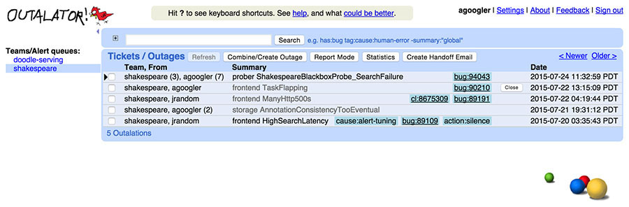
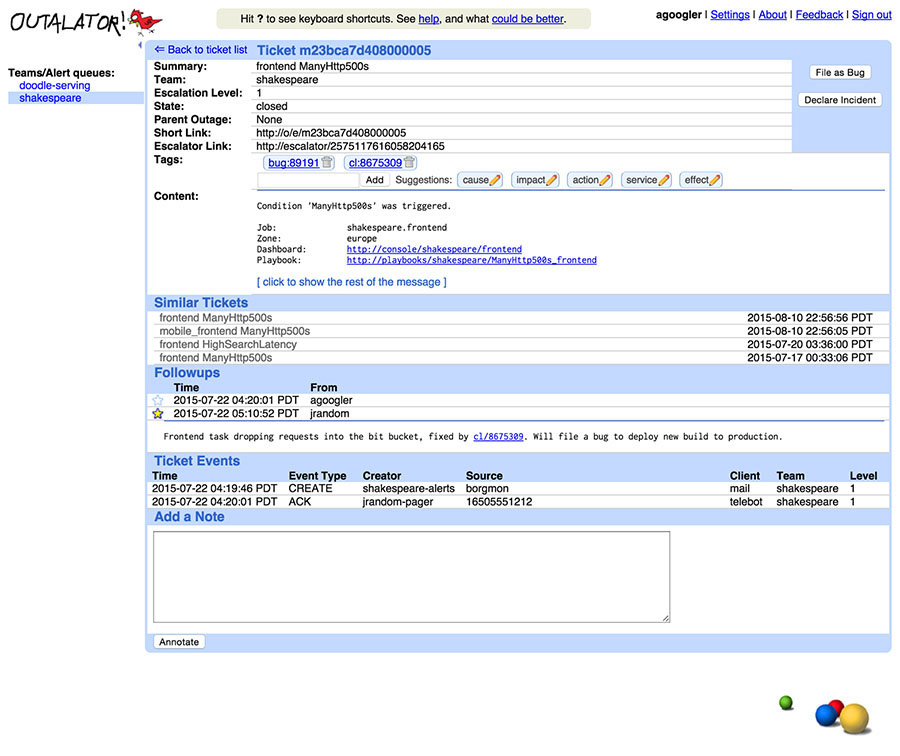

# Chương 16. Theo dõi Outage (Tracking Outages)

> **Nguyên bản:** [Chapter 16 - Tracking Outages](https://sre.google/sre-book/tracking-outages/)
> **Nguồn:** Google SRE Book (O'Reilly)
> **Bản dịch tiếng Việt** (Thực hiện bởi Đội ngũ R&D Softdreams)

---

*Tác giả:* Gabe Krabbe
*Biên tập:* Lisa Carey

Việc cải thiện độ tin cậy theo thời gian chỉ có thể nếu bạn bắt đầu từ một baseline (mốc chuẩn) đã biết và có thể theo dõi tiến bộ. "Outalator," trình theo dõi outage (mất dịch vụ) của chúng tôi, là một trong những công cụ dùng để làm chính xác điều đó. Outalator là một hệ thống thụ động, nhận tất cả cảnh báo do các hệ thống giám sát gửi đến, cho phép chúng tôi chú thích (annotate), nhóm và phân tích dữ liệu này.

Việc học có hệ thống từ các vấn đề trong quá khứ là thiết yếu cho quản lý dịch vụ hiệu quả. Các postmortem (báo cáo sau sự cố) (xem [Postmortem Culture: Learning from Failure](https://sre.google/sre-book/postmortem-culture/)) cung cấp chi tiết cho từng outage riêng lẻ, nhưng chỉ là một phần câu trả lời. Chúng chỉ được viết cho các incident (sự cố) có tác động lớn, nên những vấn đề có tác động nhỏ lẻ nhưng thường xuyên và phổ biến thì không nằm trong phạm vi. Tương tự, postmortem có xu hướng mang lại các nhận thấy (insight) hữu ích để cải thiện một dịch vụ hay một nhóm dịch vụ đơn lẻ, nhưng có thể bỏ lỡ các cơ hội có hiệu ứng nhỏ trong từng trường hợp, hoặc những cơ hội có tỷ lệ chi phí/lợi ích (cost/benefit) thấp nhưng lại có tác động ngang (horizontal) lớn.[1](#fn1)

Chúng tôi cũng có thể thu được thông tin hữu ích từ các câu hỏi như "Đội này nhận được bao nhiêu cảnh báo mỗi ca on-call (trực sự cố)?", "Tỷ lệ cảnh báo có thể hành động/không thể hành động (actionable/nonactionable) quý vừa qua là bao nhiêu?", hoặc đơn giản "Trong các dịch vụ do đội này quản lý, dịch vụ nào tạo ra nhiều toil (công việc nhàm chán, thủ công) nhất?"

## Escalator (Bậc thang leo thang)

Tại Google, tất cả thông báo cảnh báo cho SRE (Site Reliability Engineering — Kỹ thuật Độ tin cậy Trang web) đi qua một hệ thống tập trung được nhân bản (replicated), theo dõi xem đã có người xác nhận nhận thông báo hay chưa. Nếu sau một khoảng thời gian được cấu hình mà không nhận được xác nhận, hệ thống leo thang (escalate) đến điểm đến tiếp theo đã cấu hình — ví dụ từ on-call chính (primary) sang on-call phụ (secondary). Hệ thống này, gọi là "The Escalator" (Bậc thang Leo thang), ban đầu được thiết kế như một công cụ gần như trong suốt, nhận các bản sao của email gửi đến các alias (biệt danh) on-call. Nhờ đó Escalator dễ dàng tích hợp với các luồng công việc hiện có mà không đòi hỏi thay đổi hành vi người dùng (hay, vào thời điểm đó, hành vi của hệ thống giám sát).

## Outalator

Theo gương Escalator, nơi chúng tôi thêm các tính năng hữu ích vào hạ tầng hiện có, chúng tôi đã tạo ra một hệ thống xử lý không chỉ các thông báo leo thang cá nhân, mà cả lớp trừu tượng (abstraction) cao hơn: các outage.

Outalator cho phép người dùng xem một danh sách các thông báo đan xen theo thời gian của nhiều hàng đợi (queue) cùng lúc, thay vì phải chuyển đổi thủ công giữa các hàng đợi. [Hình 16-1](#hinh-16-1) hiển thị nhiều hàng đợi như chúng xuất hiện trong chế độ xem hàng đợi của Outalator. Tính năng này tiện lợi, vì thường một đội SRE là điểm liên lạc chính cho nhiều dịch vụ có các điểm leo thang phụ riêng biệt, thường là các đội developer (phát triển).

[Hình 16-1.](#hinh-16-1) Chế độ xem hàng đợi của Outalator.

Outalator lưu một bản sao của thông báo gốc và cho phép chú thích các incident. Để tiện, nó lặng lẽ nhận và lưu cả bản sao của mọi email trả lời. Vì một số nội dung ít hữu ích hơn (ví dụ một reply-all (trả lời tất cả) chỉ nhằm thêm người nhận vào danh sách cc), các chú thích có thể được đánh dấu là "quan trọng". Khi một chú thích quan trọng, các phần khác của thông điệp sẽ được gập (collapse) trong giao diện để giảm bừa bộn. Kết hợp lại, điều này cho nhiều ngữ cảnh hơn khi tham chiếu đến một incident so với một chuỗi email có thể phân mảnh.

Nhiều thông báo leo thang ("cảnh báo") có thể được hợp nhất thành một thực thể đơn lẻ ("incident") trong Outalator. Những thông báo này có thể liên quan đến cùng một incident, có thể không liên quan và là các sự kiện không thú vị nhưng có thể kiểm toán (auditable) như truy cập database đặc quyền, hoặc có thể là các sự cố giám sát giả. Tính năng nhóm này, hiển thị trong [Hình 16-2](#hinh-16-2), làm giảm sự bừa bộn của các hiển thị tổng quan và cho phép phân tích riêng "incidents mỗi ngày" so với "cảnh báo mỗi ngày".

[Hình 16-2.](#hinh-16-2) Chế độ xem của Outalator về một incident.

### Xây dựng Outalator của Riêng bạn (Building Your Own Outalator)

Nhiều tổ chức dùng các hệ thống nhắn tin như Slack, Hipchat, hoặc thậm chí IRC (Internet Relay Chat — Trò chuyện Trung chuyển Internet) cho truyền thông nội bộ và/hoặc cập nhật dashboard (bảng điều khiển) trạng thái. Những hệ thống này là nơi lý tưởng để kết nối với một hệ thống như Outalator.

## Tổng hợp (Aggregation)

Một sự kiện đơn lẻ có thể, và thường sẽ, kích hoạt nhiều cảnh báo. Ví dụ, một sự cố mạng gây ra các timeout (thời gian chờ hết) và khiến dịch vụ backend (phía sau) không truy cập được, nên mọi đội bị ảnh hưởng đều nhận cảnh báo của riêng mình, bao gồm cả chủ sở hữu dịch vụ backend; trong khi đó, trung tâm vận hành mạng (network operations center) lại có hẳn các còi báo động (klaxon) của nó. Tuy nhiên, ngay cả các vấn đề nhỏ hơn chỉ ảnh hưởng đến một dịch vụ đơn lẻ cũng có thể kích hoạt nhiều cảnh báo do nhiều điều kiện lỗi được chẩn đoán. Dù đáng cố gắng tối thiểu hóa số cảnh báo do một sự kiện đơn lẻ kích hoạt, việc kích hoạt nhiều cảnh báo là không thể tránh khỏi trong hầu hết các phép đánh đổi giữa dương tính giả (false positive) và âm tính giả (false negative).

Khả năng nhóm nhiều cảnh báo thành một *incident* (sự cố) đơn lẻ là thiết yếu để xử lý sự trùng lặp này. Gửi một email nói "đây là cùng một thứ với thứ kia; chúng là triệu chứng của cùng một incident" thì hữu ích cho một cảnh báo cụ thể: nó có thể ngăn việc debug (xử lý lỗi) hoặc hoảng loạn lặp lại. Nhưng gửi một email cho mỗi cảnh báo không phải giải pháp thực tế hay có thể mở rộng (scale) để xử lý cảnh báo trùng lặp trong một đội, chứ đừng nói đến giữa các đội hay trên các khoảng thời gian dài hơn.

## Dán Nhãn (Tagging)

Tất nhiên, không phải mọi sự kiện cảnh báo đều là một incident. Các cảnh báo dương tính giả xảy ra, cũng như các sự kiện kiểm thử hay email gửi sai người do con người. Bản thân Outalator không phân biệt những sự kiện này, nhưng cho phép *dán nhãn* (tagging) tổng quát để thêm metadata (dữ liệu mô tả) vào các thông báo, ở bất kỳ cấp nào. Các tag (nhãn) phần lớn tự do, là những "từ" đơn lẻ. Tuy nhiên, dấu hai chấm được diễn giải như bộ phận ngữ nghĩa (semantic separator), điều này tinh tế khuyến khích dùng các không gian tên phân cấp (hierarchical namespace) và cho phép một số xử lý tự động. Việc đặt không gian tên này được hỗ trợ bởi các tiền tố tag (tag prefix) được đề xuất, chủ yếu là "cause" (nguyên nhân) và "action" (hành động), nhưng danh sách cụ thể cho từng đội và được xây dựng dựa trên việc sử dụng trong quá khứ. Ví dụ, "cause:network" (nguyên nhân:mạng) có thể đủ thông tin cho một số đội, trong khi một đội khác có thể chọn tag cụ thể hơn, như "cause:network:switch" (nguyên nhân:mạng:mạch chuyển) so với "cause:network:cable" (nguyên nhân:mạng:dây cáp). Một số đội thường xuyên dùng tag kiểu "customer:132456" (khách hàng:132456), nên "customer" (khách hàng) sẽ được đề xuất cho những đội đó, nhưng không cho đội khác.

Các tag có thể được phân tích và chuyển thành liên kết tiện lợi ("bug:76543" liên kết đến hệ thống theo dõi bug). Một số tag khác chỉ là một từ đơn ("bogus" (giả) được dùng rộng rãi cho các dương tính giả). Tất nhiên, một số tag là lỗi chính tả (typo) ("cause:netwrok") và một số tag không đặc biệt hữu ích ("problem-went-away" (vấn đề-biến-mất)), nhưng việc tránh một danh sách định trước và để các đội tìm ra sở thích, tiêu chuẩn riêng sẽ dẫn đến một công cụ hữu ích hơn và dữ liệu tốt hơn. Nhìn chung, tag đã là một công cụ mạnh để các đội thu thập và tổng quan các điểm đau của một dịch vụ, ngay cả khi không có nhiều — hoặc thậm chí không có — phân tích chính thức. Dù dán nhãn có vẻ tầm thường, nó có lẽ là một trong những tính năng độc đáo hữu ích nhất của Outalator.

## Phân tích (Analysis)

Tất nhiên, SRE làm nhiều hơn rất nhiều so với chỉ phản ứng với incident. Dữ liệu lịch sử hữu ích khi đang phản ứng với incident — câu hỏi "lần trước chúng tôi đã làm gì?" luôn là một điểm khởi đầu tốt. Nhưng thông tin lịch sử còn hữu ích hơn rất nhiều khi liên quan đến các vấn đề có hệ thống, định kỳ, hoặc các vấn đề rộng hơn có thể tồn tại. Tạo điều kiện thuận lợi cho loại phân tích này là một trong những chức năng quan trọng nhất của một công cụ theo dõi outage.

Lớp dưới cùng của phân tích bao gồm việc đếm và các thống kê tổng hợp cơ bản cho báo cáo. Chi tiết tùy vào đội, nhưng gồm các thông tin như số incident mỗi tuần/tháng/quý và số cảnh báo mỗi incident. Lớp tiếp theo quan trọng hơn, và dễ cung cấp hơn: so sánh giữa các đội/dịch vụ và theo thời gian để xác định các mẫu (pattern) và xu hướng (trend) ban đầu. Lớp này cho phép các đội xác định liệu một tải cảnh báo nhất định có "bình thường" so với hồ sơ của chính họ và của các dịch vụ khác. "Đó là lần thứ ba trong tuần này" có thể tốt hoặc xấu, nhưng biết "nó" từng xảy ra năm lần mỗi ngày hay năm lần mỗi tháng cho phép diễn giải.

Bước tiếp theo trong phân tích dữ liệu là tìm ra các vấn đề rộng hơn, không chỉ là đếm thô mà đòi hỏi một số phân tích ngữ nghĩa. Ví dụ, xác định thành phần hạ tầng gây ra nhiều incident nhất, và do đó lợi ích tiềm tàng từ việc nâng độ ổn định hoặc hiệu năng của thành phần đó, [2](#fn2) giả định rằng có một cách trực tiếp để cung cấp thông tin này cùng với các bản ghi incident. Một ví dụ đơn giản: các đội khác nhau có các điều kiện cảnh báo cụ thể cho dịch vụ như "stale data" (dữ liệu cũ) hoặc "high latency" (độ trễ cao). Cả hai điều kiện đều có thể do tắc nghẽn mạng gây ra các độ trễ nhân bản database và cần can thiệp. Hoặc, chúng có thể nằm trong mục tiêu mức dịch vụ (service level objective) danh nghĩa nhưng không đáp ứng được kỳ vọng cao hơn của người dùng. Xem xét thông tin này xuyên suốt nhiều đội cho phép chúng tôi xác định các vấn đề có hệ thống và chọn giải pháp đúng, đặc biệt nếu giải pháp có thể là việc chủ động gây ra các sự cố giả định để ngăn tình trạng vận hành quá tải.

### Báo cáo và truyền thông (Reporting and communication)

Có một ứng dụng thiết thực hơn cho các SRE tuyến đầu: khả năng chọn một hoặc nhiều outalation (sự mất dịch vụ đã ghi nhận) và đưa các chủ đề, tag, cùng các chú thích "quan trọng" của chúng vào một email gửi cho kỹ sư on-call tiếp theo (kèm một danh sách cc tùy ý) để truyền đạt trạng thái gần đây giữa các ca. Với các cuộc xem xét định kỳ các dịch vụ production (thường là hàng tuần đối với phần lớn các đội), Outalator cũng hỗ trợ một "chế độ báo cáo" (report mode), trong đó các chú thích quan trọng được mở rộng inline (trực tiếp) cùng danh sách chính, cung cấp một tổng quan nhanh các điểm nổi bật.

## Các Lợi ích Bất ngờ (Unexpected Benefits)

Việc nhận ra rằng một cảnh báo, hay cả một trận lũ cảnh báo, trùng khớp với một outage khác nhất định mang lại các lợi ích hiển nhiên: nó tăng tốc độ chẩn đoán và giảm tải cho các đội khác bằng cách xác nhận rằng thực sự có một incident. Còn có những lợi ích ít hiển nhiên hơn. Lấy Bigtable làm ví dụ, nếu một dịch vụ bị gián đoạn do một incident Bigtable rõ ràng, nhưng bạn thấy đội SRE Bigtable chưa được cảnh báo, thì việc chủ động cảnh báo đội đó có lẽ là ý hay. Khả năng nhìn thấy xuyên đội tốt hơn có thể — và thực sự đã — tạo ra khác biệt lớn trong việc giải quyết incident, hoặc ít nhất là trong việc giảm nhẹ incident.

Một số đội trong công ty đã đi xa đến mức thiết lập các cấu hình escalator giả (dummy): không người nào nhận thông báo gửi đến đó, nhưng các thông báo vẫn xuất hiện trong Outalator và có thể được dán nhãn, chú thích, xem xét. Một ví dụ dùng "hệ thống ghi nhận" (system of record) này là ghi log và kiểm toán việc sử dụng các tài khoản đặc quyền hoặc vai trò (cần lưu ý tính năng này ở mức cơ bản, dùng cho kiểm toán kỹ thuật chứ không phải pháp lý). Một ứng dụng khác là ghi lại và tự động chú thích các lần chạy của các job (nhiệm vụ) định kỳ có thể không idempotent (không phụ thuộc số lần chạy) — ví dụ việc tự động áp dụng các thay đổi schema (mô hình dữ liệu) từ hệ thống kiểm soát phiên bản xuống các hệ thống database.

[1](#fn1) Ví dụ, có thể đòi hỏi nỗ lực kỹ thuật đáng kể để thực hiện một thay đổi nhất định đối với Bigtable mà chỉ có một hiệu ứng giảm nhẹ nhỏ cho một outage. Tuy nhiên, nếu sự giảm nhẹ tương tự đó khả dụng xuyên suốt nhiều sự kiện, nỗ lực kỹ thuật có thể thực sự đáng giá.

[2](#fn2) Một mặt, "gây ra nhiều incident nhất" là một điểm khởi đầu tốt để giảm số lượng cảnh báo được kích hoạt và cải thiện hệ thống tổng thể. Mặt khác, metric (chỉ số) này có thể đơn giản là một sản phẩm của việc giám sát quá nhạy cảm hoặc một tập nhỏ các hệ thống client (khách hàng) hoạt động sai hoặc tự chúng đang chạy bên ngoài mức dịch vụ được thỏa thuận. Và giữ chặt, số lượng incident đơn lẻ không đưa ra bất kỳ chỉ thị nào về mức độ khó để sửa hoặc mức độ nghiêm trọng của tác động.

---

Copyright © 2017 Google, Inc. Published by O'Reilly Media, Inc. Licensed under [CC BY-NC-ND 4.0](https://creativecommons.org/licenses/by-nc-nd/4.0/)
