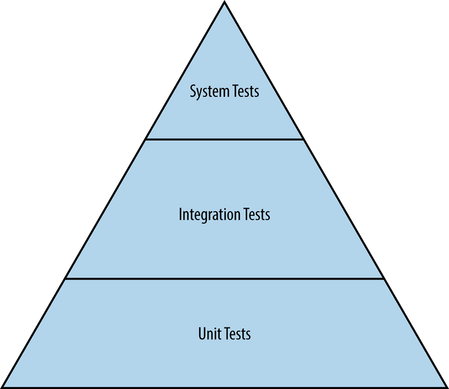

# Chương 17. Kiểm thử cho Độ tin cậy (Testing for Reliability)

> **Nguyên bản:** [Chapter 17 - Testing for Reliability](https://sre.google/sre-book/testing-reliability/)
> **Nguồn:** Google SRE Book (O'Reilly)
> **Bản dịch tiếng Việt** (Thực hiện bởi Đội ngũ R&D Softdreams)

---

*Tác giả:* Alex Perry và Max Luebbe
*Biên tập:* Diane Bates

> Nếu bạn chưa thử nó, hãy giả định rằng nó bị hỏng.
>
> Không rõ tác giả

Một trách nhiệm chính của Site Reliability Engineer (SRE) là định lượng mức độ tin cậy vào các hệ thống mà họ vận hành. Các SRE làm việc này bằng cách thích ứng các [kỹ thuật kiểm thử phần mềm](https://sre.google/sre-book/testing-reliability/) cổ điển cho hệ thống ở quy mô lớn.<sup>[1](#fn1)</sup> Sự tin tưởng có thể được đo bằng cả độ tin cậy trong quá khứ lẫn độ tin cậy trong tương lai. Thứ nhất được bắt giữ bằng cách phân tích dữ liệu được cung cấp bởi việc giám sát hành vi hệ thống trong quá khứ, trong khi thứ hai được định lượng bằng cách đưa ra các dự đoán từ dữ liệu về hành vi hệ thống trong quá khứ. Để những dự đoán này đủ mạnh để hữu ích, một trong các điều kiện sau phải đúng:

-   Site không thay đổi theo thời gian, không có release phần mềm hay thay đổi trong fleet server, nghĩa là hành vi trong tương lai sẽ giống hành vi trong quá khứ.
-   Bạn có thể mô tả tin cậy mọi thay đổi đối với site, để phân tích có thể tính đến sự không chắc chắn (uncertainty) do mỗi thay đổi gây ra.

Kiểm thử là cơ chế bạn sử dụng để minh họa các vùng tương đương cụ thể khi các thay đổi xảy ra.<sup>[2](#fn2)</sup> Mỗi kiểm thử vượt qua cả trước lẫn sau một thay đổi giảm sự không chắc chắn mà phân tích cần phải tính đến. Kiểm thử kỹ lưỡng giúp chúng tôi dự đoán độ tin cậy trong tương lai của một site nhất định với đủ chi tiết để hữu ích trên thực tế.

Lượng kiểm thử cần thiết phụ thuộc vào yêu cầu độ tin cậy của hệ thống. Khi tỷ lệ codebase được bao phủ bởi kiểm thử tăng, bạn giảm được sự không chắc chắn và nguy cơ giảm độ tin cậy từ mỗi thay đổi. Bao phủ kiểm thử đầy đủ nghĩa là bạn có thể thực hiện nhiều thay đổi hơn trước khi độ tin cậy rơi xuống dưới mức chấp nhận được. Nếu bạn thực hiện quá nhiều thay đổi quá nhanh, độ tin cậy dự đoán sẽ tiến đến giới hạn chấp nhận được. Khi đó, bạn có thể muốn tạm dừng các thay đổi cho đến khi dữ liệu giám sát mới tích lũy đủ. Dữ liệu đang tích lũy bổ sung cho phần bao phủ đã kiểm thử, xác nhận độ tin cậy đang được khẳng định cho các đường thực thi đã sửa. Giả định các client được phục vụ phân bố ngẫu nhiên [[Woo96]](https://sre.google/sre-book/bibliography#Woo96), thống kê lấy mẫu có thể ngoại suy từ các metrics được giám sát để biết hành vi tổng hợp có đang dùng các đường mới hay không. Những thống kê này xác định các khu vực cần kiểm thử tốt hơn hoặc các cải tiến (retrofitting) khác.

### Mối quan hệ Giữa Kiểm thử và Thời gian Trung bình Để Sửa chữa (Relationships Between Testing and Mean Time to Repair)

Việc vượt qua một kiểm thử hoặc một chuỗi kiểm thử không nhất thiết chứng minh độ tin cậy. Tuy nhiên, các kiểm thử đang thất bại nhìn chung chứng minh sự vắng mặt của độ tin cậy.

Một hệ thống giám sát có thể phát hiện các bug, nhưng chỉ nhanh bằng tốc độ đường ống báo cáo (reporting pipeline) phản ứng. *Mean Time to Repair* (MTTR) đo thời gian đội vận hành mất để sửa bug, bằng cách hoàn tác (rollback) hoặc một hành động khác.

Một hệ thống kiểm thử có thể xác định bug với MTTR bằng 0. Điều này xảy ra khi một kiểm thử cấp hệ thống được áp dụng cho một hệ thống con, và kiểm thử đó phát hiện đúng vấn đề mà giám sát sẽ phát hiện. Kiểm thử như vậy cho phép chặn push để bug không bao giờ đến production (mặc dù vẫn cần sửa trong code nguồn). Việc sửa các bug MTTR-0 bằng cách chặn push vừa nhanh vừa tiện lợi. Càng nhiều bug bạn tìm thấy với MTTR bằng 0, *Mean Time Between Failures* (MTBF) mà người dùng trải nghiệm càng cao.

Khi MTBF tăng nhờ kiểm thử tốt hơn, các developer được khuyến khích release tính năng nhanh hơn. Tất nhiên, một số tính năng sẽ có bug. Các bug mới dẫn đến điều chỉnh ngược lại với tốc độ release khi chúng được tìm thấy và sửa.

Các tác giả viết về kiểm thử phần mềm phần lớn đồng thuận về mức bao phủ (coverage) cần thiết. Xung đột ý kiến chủ yếu bắt nguồn từ thuật ngữ mâu thuẫn, sự nhấn mạnh khác nhau về tác động của kiểm thử ở mỗi giai đoạn vòng đời phần mềm, hoặc đặc thù của các hệ thống mà họ đã kiểm thử. Để có thảo luận về kiểm thử tại Google nói chung, xem [[Whi12]](https://sre.google/sre-book/bibliography#Whi12). Các phần sau xác định cách các thuật ngữ liên quan đến kiểm thử phần mềm được sử dụng trong chương này.

## Các Loại Kiểm thử Phần mềm (Types of Software Testing)

Các kiểm thử phần mềm được phân loại rộng rãi thành hai danh mục: truyền thống và production. Các kiểm thử truyền thống phổ biến hơn trong phát triển phần mềm để đánh giá tính chính xác của phần mềm offline, trong khi phát triển. Các kiểm thử production được thực hiện trên một dịch vụ web đang hoạt động để đánh giá liệu một hệ thống phần mềm đã triển khai có đang hoạt động đúng không.

## Các Kiểm thử Truyền thống (Traditional Tests)

Như [Hình 17-1](#hinh-17-1) cho thấy, kiểm thử phần mềm truyền thống bắt đầu với kiểm thử unit. Kiểm thử cho các chức năng phức tạp hơn được xếp chồng lên trên kiểm thử unit.


<a id="hinh-17-1"></a>

[Hình 17-1.](#hinh-17-1) Hệ phân cấp của các kiểm thử truyền thống.

### Kiểm thử Unit (Unit tests)

Một *kiểm thử unit* là dạng kiểm thử phần mềm nhỏ nhất và đơn giản nhất. Chúng đánh giá một đơn vị phần mềm có thể tách rời, như một class hoặc function, về tính chính xác độc lập với hệ thống phần mềm lớn hơn chứa đơn vị đó. Kiểm thử unit cũng được dùng như một dạng đặc tả (specification) để đảm bảo một function hoặc module thực hiện đúng hành vi mà hệ thống yêu cầu. Kiểm thử unit thường được dùng để giới thiệu khái niệm phát triển theo kiểm thử (test-driven development).

### Kiểm thử Tích hợp (Integration tests)

Các thành phần phần mềm vượt qua kiểm thử unit được lắp ráp thành các thành phần lớn hơn. Kỹ sư sau đó chạy một *kiểm thử tích hợp* trên thành phần đã lắp ráp để xác nhận nó hoạt động đúng. Tiêm phụ thuộc (dependency injection), thực hiện bằng các công cụ như Dagger,<sup>[3](#fn3)</sup> là kỹ thuật rất mạnh để tạo ra các mock của các phụ thuộc phức tạp, giúp kỹ sư kiểm thử sạch một thành phần. Ví dụ phổ biến của dependency injection là thay thế một database có trạng thái (stateful) bằng một mock nhẹ có hành vi được quy định chính xác.

### Kiểm thử Hệ thống (System tests)

Một *kiểm thử hệ thống* là kiểm thử có quy mô lớn nhất mà kỹ sư chạy cho hệ thống chưa triển khai. Tất cả các module thuộc một thành phần, như server đã vượt qua kiểm thử tích hợp, được lắp ráp thành hệ thống. Sau đó kỹ sư kiểm thử chức năng đầu-cuối (end-to-end) của hệ thống. Các kiểm thử hệ thống có nhiều hương vị khác nhau:

#### Kiểm thử khói (Smoke tests)

*Smoke tests*, trong đó kỹ sư kiểm thử các hành vi rất đơn giản nhưng quan trọng, là một trong những loại kiểm thử hệ thống đơn giản nhất. Smoke tests còn gọi là *sanity testing* (kiểm thử tính hợp lý), dùng để ngắt ngắn mạch (short-circuit) các kiểm thử bổ sung, tốn kém hơn.

#### Kiểm thử Hiệu năng (Performance tests)

Sau khi tính chính xác cơ bản được thiết lập qua smoke test, bước tiếp theo phổ biến là viết một biến thể khác của kiểm thử hệ thống để đảm bảo hiệu năng hệ thống vẫn ở mức chấp nhận được trong suốt vòng đời của nó. Vì thời gian phản hồi cho các phụ thuộc hay yêu cầu tài nguyên có thể thay đổi đáng kể trong quá trình phát triển, hệ thống cần được kiểm thử để đảm bảo không trở nên chậm dần mà không ai nhận ra (trước khi release đến người dùng). Ví dụ, một chương trình có thể tiến hóa để cần 32 GB bộ nhớ thay vì 8 GB, hoặc thời gian phản hồi 10 ms có thể thành 50 ms rồi 100 ms. Kiểm thử hiệu năng đảm bảo hệ thống không suy giảm hoặc trở nên quá tốn kém theo thời gian.

#### Kiểm thử Regression (Regression tests)

Một loại kiểm thử hệ thống khác ngăn các bug lén lút quay lại codebase. Kiểm thử regression có thể ví như một phòng trưng bày các bug "vô lại" đã từng khiến hệ thống thất bại hoặc cho ra kết quả sai. Bằng cách ghi tài liệu những bug này thành kiểm thử ở cấp hệ thống hoặc tích hợp, kỹ sư đang refactor codebase có thể yên tâm rằng họ không vô tình tái giới thiệu các bug mà họ đã tốn thời gian và công sức để loại bỏ.

Lưu ý rằng kiểm thử có chi phí, cả về thời gian lẫn tài nguyên tính toán. Ở một đầu, kiểm thử unit rất rẻ ở cả hai chiều, vì chúng thường hoàn thành trong vài mili giây trên tài nguyên của một laptop. Ở đầu kia, việc khởi động một server hoàn chỉnh với các phụ thuộc cần thiết (hoặc mock tương đương) để chạy các kiểm thử liên quan có thể mất nhiều thời gian hơn đáng kể — từ vài phút đến vài giờ — và có thể đòi hỏi tài nguyên tính toán chuyên dụng. Nhận thức về các chi phí này là thiết yếu cho năng suất developer, và khuyến khích sử dụng hiệu quả tài nguyên kiểm thử.

## Các Kiểm thử Production (Production Tests)

Kiểm thử production tương tác với hệ thống production đang hoạt động, khác với hệ thống trong môi trường kiểm thử cô lập (hermetic). Về nhiều mặt, chúng tương tự giám sát hộp đen (black-box monitoring) (xem [Monitoring Distributed Systems](https://sre.google/sre-book/monitoring-distributed-systems/)), và do đó đôi khi được gọi là *kiểm thử hộp đen* (black-box testing). Kiểm thử production là thiết yếu để vận hành dịch vụ production đáng tin cậy.

### Các Rollout (Triển khai) Làm rối lẫn nhau các Kiểm thử (Rollouts Entangle Tests)

Thường nói rằng kiểm thử là (hoặc nên được) thực hiện trong môi trường cô lập [[Nar12]](https://sre.google/sre-book/bibliography#Nar12). Điều này ngụ ý rằng production không phải là cô lập. Đúng vậy, production thường không cô lập, vì nhịp độ rollout (rollout cadence) tạo ra các thay đổi đang chạy trong môi trường production thành từng phần nhỏ, được hiểu rõ.

Để quản lý sự không chắc chắn và che giấu rủi ro khỏi người dùng, các thay đổi có thể không được push lên trực tuyến theo cùng thứ tự mà chúng được thêm vào source control. Rollout thường diễn ra theo các giai đoạn, dùng các cơ chế dần dần xáo trộn (shuffle) người dùng, kèm giám sát ở mỗi giai đoạn để đảm bảo môi trường mới không gặp các vấn đề đã dự đoán nhưng bất ngờ. Kết quả, toàn bộ môi trường production cố ý không đại diện cho bất kỳ phiên bản cụ thể nào của một binary đã được check vào source control.

Source control có thể có nhiều hơn một phiên bản của một binary cùng tệp cấu hình liên quan, đang chờ được đưa lên trực tuyến. Kịch bản này có thể gây vấn đề khi kiểm thử chạy trên môi trường đang chạy. Ví dụ, kiểm thử có thể dùng phiên bản mới nhất của một tệp cấu hình trong source control cùng với một phiên bản cũ hơn của binary đang trực tuyến. Hoặc nó có thể kiểm thử một phiên bản cũ hơn của tệp cấu hình và tìm thấy bug đã được sửa trong phiên bản mới hơn của tệp.

Tương tự, một kiểm thử hệ thống có thể dùng các tệp cấu hình để lắp ráp các module trước khi chạy. Nếu kiểm thử vượt qua, nhưng phiên bản của nó là phiên bản mà kiểm thử cấu hình (thảo luận ở phần tiếp theo) thất bại, thì kết quả kiểm thử hợp lệ về mặt cô lập nhưng không hợp lệ về mặt vận hành. Kết quả như vậy là bất tiện.

### Kiểm thử Cấu hình (Configuration test)

Tại Google, cấu hình dịch vụ web được mô tả trong các tệp lưu trữ trong hệ thống kiểm soát phiên bản. Với mỗi tệp cấu hình, một *kiểm thử cấu hình* riêng biệt xem xét production để xác định một binary thực sự được cấu hình ra sao và báo cáo các khác biệt so với tệp đó. Những kiểm thử này về bản chất không cô lập, vì chúng vận hành bên ngoài sandbox của hạ tầng kiểm thử.

Kiểm thử cấu hình được xây dựng và kiểm thử cho một phiên bản cụ thể của tệp cấu hình đã check-in. Việc so sánh phiên bản nào của kiểm thử đang vượt qua với phiên bản mục tiêu cho tự động hóa ngụ ý chỉ ra production thực sự đang tụt hậu so với công việc kỹ thuật đang diễn ra đến mức nào.

Những kiểm thử cấu hình không cô lập này có xu hướng đặc biệt có giá trị như một phần của giải pháp giám sát phân tán, vì mẫu vượt qua/thất bại xuyên suốt production có thể xác định các đường xuyên suốt stack dịch vụ không có tổ hợp hợp lý của các cấu hình cục bộ. Các rule của giải pháp giám sát cố khớp các đường của yêu cầu người dùng thực (từ log truy vết) với tập hợp các đường không mong muốn đó. Bất kỳ sự khớp nào mà các rule tìm thấy đều trở thành cảnh báo rằng các release đang diễn ra và/hoặc các push không an toàn, cần hành động sửa chữa.

Kiểm thử cấu hình có thể rất đơn giản khi triển khai production dùng nội dung tệp thực và cung cấp truy vấn thời gian thực để lấy bản sao nội dung. Khi đó, code kiểm thử chỉ cần phát truy vấn và so sánh (diff) phản hồi với tệp. Kiểm thử phức tạp hơn khi cấu hình thực hiện một trong các điều sau:

-   Tích hợp ngầm các giá trị mặc định được xây dựng vào binary (khiến kiểm thử phải được phiên bản hóa riêng biệt)
-   Truyền qua một trình tiền xử lý (preprocessor) như bash thành các cờ dòng lệnh (khiến kiểm thử phải chịu các quy tắc mở rộng)
-   Quy định ngữ cảnh hành vi cho một runtime được chia sẻ (khiến kiểm thử phụ thuộc lịch trình release của runtime đó)

### Kiểm thử Áp lực (Stress test)

Để vận hành an toàn một hệ thống, SRE cần hiểu giới hạn của cả hệ thống lẫn các thành phần. Trong nhiều trường hợp, các thành phần riêng lẻ không suy giảm êm ả (gracefully degrade) khi vượt quá một điểm nhất định — thay vào đó, chúng thất bại thảm khốc (catastrophically fail). Kỹ sư dùng *stress test* (kiểm thử áp lực) để tìm các giới hạn của một dịch vụ web. Stress test trả lời các câu hỏi như:

-   Một database có thể đầy đến mức nào trước khi các ghi (writes) bắt đầu thất bại?
-   Bao nhiêu truy vấn mỗi giây có thể gửi đến một ứng dụng server trước khi nó quá tải, khiến yêu cầu thất bại?

### Kiểm thử Canary (Canary test)

*Kiểm thử canary* (canary test) vắng mặt một cách nổi bật khỏi danh sách kiểm thử production này. Thuật ngữ *canary* đến từ thành ngữ "canary in a coal mine" (chim canary trong mỏ than), chỉ thực hành dùng một con chim sống để phát hiện khí độc trước khi con người bị đầu độc.

Để tiến hành canary test, một tập con các server được nâng cấp lên phiên bản hoặc cấu hình mới, sau đó được để trong một thời kỳ ấp ủ (incubation period). Nếu không có sai lệch (variance) bất ngờ nào, release tiếp tục và phần còn lại của các server được nâng cấp theo cách tiến bộ.<sup>[4](#fn4)</sup> Nếu có trục trặc, các server đã sửa đổi có thể nhanh chóng được hoàn tác về một trạng thái tốt đã biết. Chúng tôi thường gọi thời kỳ ấp ủ của các server đã nâng cấp là "baking the binary" (nướng binary).

Canary test thực ra không phải là kiểm thử; đúng hơn, nó là chấp nhận người dùng có cấu trúc (structured user acceptance). Trong khi kiểm thử cấu hình và áp lực xác nhận sự tồn tại của một điều kiện cụ thể trên phần mềm tất định (deterministic), canary test mang tính ad hoc hơn. Nó chỉ phơi bày code đang kiểm thử với traffic production sống, ít dự đoán được hơn, do đó không hoàn hảo và không phải lúc nào cũng bắt được lỗi mới.

Để lấy ví dụ cụ thể về cách một canary có thể diễn ra: hãy cân nhắc một lỗi cơ bản tương đối hiếm khi ảnh hưởng đến traffic người dùng, đang được triển khai với rollout nâng cấp theo hàm mũ (exponential). Chúng tôi kỳ vọng một số lũy tiến tăng dần của các sai lệch được báo cáo CU = RK, trong đó R là tốc độ của các báo cáo đó, U là bậc (order) của lỗi (định nghĩa sau), và K là khoảng thời gian mà trong đó traffic tăng một hệ số e, tức 172%.<sup>[5](#fn5)</sup>

Để tránh tác động lên người dùng, một rollout kích hoạt các sai lệch không mong muốn cần được nhanh chóng hoàn tác về cấu hình trước đó. Trong khoảng thời gian ngắn để tự động hóa quan sát các sai lệch và phản ứng, nhiều khả năng một số báo cáo bổ sung sẽ được tạo ra. Khi mọi chuyện lắng xuống, những báo cáo này có thể dùng để ước tính cả số lũy tiến C lẫn tốc độ R.

Việc chia và hiệu chỉnh cho K cho ta ước tính của U, bậc của lỗi cơ bản.<sup>[6](#fn6)</sup> Một số ví dụ:

-   U=1: Yêu cầu của người dùng chạm phải code đơn giản là bị hỏng.
-   U=2: Yêu cầu của người dùng này ngẫu nhiên hư hại dữ liệu mà yêu cầu của một người dùng trong tương lai có thể nhìn thấy.
-   U=3: Dữ liệu bị hư hại ngẫu nhiên đó cũng là một định danh hợp lệ cho một yêu cầu trước đó.

Phần lớn bug là bậc một: chúng tăng tuyến tính theo lượng traffic người dùng [[Per07]](https://sre.google/sre-book/bibliography#Per07). Bạn thường có thể truy tìm các bug này bằng cách chuyển các log của tất cả yêu cầu có phản hồi bất thường thành kiểm thử regression mới. Chiến lược này không hiệu quả cho bug bậc cao hơn: một yêu cầu thất bại lặp lại nếu tất cả yêu cầu trước đó được thử theo thứ tự sẽ đột nhiên vượt qua nếu một số yêu cầu bị bỏ qua. Việc bắt được các bug bậc cao hơn này trong lúc release là quan trọng, vì nếu không, khối lượng công việc vận hành có thể tăng rất nhanh.

Giữ trong tâm trí động lực học giữa bug bậc cao và bậc thấp, khi dùng chiến lược rollout theo hàm mũ, không cần cố đạt được sự công bằng giữa các phân số traffic người dùng. Miễn là mỗi phương pháp thiết lập một phân số đều dùng cùng khoảng K, ước tính của U sẽ hợp lệ, dù bạn chưa xác định được phương pháp nào là then chốt để làm sáng tỏ lỗi. Việc dùng nhiều phương pháp tuần tự, cho phép một số chồng chéo, giữ giá trị K ở mức nhỏ. Chiến lược này tối thiểu hóa tổng số sai lệch nhìn thấy được bởi người dùng C, trong khi vẫn cho phép ước tính sớm của U (hy vọng là 1).

## Tạo một Môi trường Kiểm thử và Dựng (Creating a Test and Build Environment)

Việc nghĩ về các loại kiểm thử và kịch bản thất bại này ngay từ ngày đầu của một dự án là điều lý tưởng, nhưng thường SRE tham gia một đội developer khi dự án đã đang diễn ra suôn sẻ — khi dự án của đội xác thực được mô hình nghiên cứu, thư viện chứng minh thuật toán cơ bản có thể scale, hoặc khi tất cả mock giao diện người dùng cuối cùng cũng chấp nhận được. Codebase của đội vẫn là nguyên mẫu (prototype) và kiểm thử toàn diện chưa được thiết kế hay triển khai. Trong những tình huống như vậy, nỗ lực kiểm thử của bạn nên bắt đầu từ đâu? Việc thực hiện kiểm thử unit cho mọi function và class là một viễn cảnh hoàn toàn áp đảo nếu bao phủ kiểm thử hiện tại thấp hoặc không tồn tại. Thay vào đó, bắt đầu với kiểm thử mang lại tác động lớn nhất với ít nỗ lực nhất.

Bạn có thể bắt đầu cách tiếp cận của mình bằng cách đặt các câu hỏi sau:

-   Bạn có thể ưu tiên hóa codebase theo cách nào không? Vay mượn một kỹ thuật từ phát triển tính năng và quản lý dự án: nếu mọi tác vụ đều ưu tiên cao, thì không có tác vụ nào là ưu tiên cao. Bạn có thể xếp hạng các thành phần của hệ thống đang kiểm thử theo bất kỳ thước đo tầm quan trọng nào không?
-   Có function hay class cụ thể nào hoàn toàn quan trọng cho sứ mệnh hoặc cho business không? Ví dụ, code liên quan đến tính phí (billing) thường quan trọng cho business. Code tính phí cũng thường tách rời sạch sẽ khỏi các phần khác của hệ thống.
-   Các API mà các đội khác đang tích hợp (integrate) là gì? Ngay cả loại hỏng hóc không bao giờ vượt qua kiểm thử release để đến người dùng cũng có thể cực kỳ có hại nếu nó khiến một đội developer khác nhầm lẫn, dẫn đến họ viết các client sai (hoặc thậm chí chỉ là không tối ưu) cho API của bạn.

Việc phát hành phần mềm rõ ràng bị hỏng nằm trong số những "tội lỗi cơ bản" (cardinal sins) của một developer. Tạo ra một chuỗi smoke test để chạy cho mỗi release không mất nhiều nỗ lực. Bước đầu tiên ít nỗ lực, tác động cao này có thể dẫn đến phần mềm được kiểm thử cao, đáng tin cậy.

Một cách để thiết lập văn hóa kiểm thử mạnh mẽ<sup>[7](#fn7)</sup> là bắt đầu ghi tài liệu mọi bug được báo cáo thành các trường hợp kiểm thử. Nếu mỗi bug được chuyển thành một kiểm thử, thì mỗi kiểm thử được giả định là ban đầu thất bại vì bug chưa được sửa. Khi kỹ sư sửa các bug, phần mềm vượt qua kiểm thử và bạn đang tiến đến một bộ kiểm thử regression toàn diện.

Một tác vụ chính khác để tạo phần mềm được kiểm thử tốt là thiết lập hạ tầng kiểm thử. Nền tảng của hạ tầng kiểm thử mạnh là một hệ thống kiểm soát phiên bản (versioned source control) theo dõi mọi thay đổi của codebase.

Khi source control đã có, bạn có thể thêm một hệ thống dựng liên tục (continuous build) dựng phần mềm và chạy kiểm thử mỗi khi code được đệ trình. Chúng tôi thấy tối ưu nếu hệ thống dựng thông báo cho kỹ sư ngay khoảnh khắc một thay đổi phá vỡ dự án phần mềm. Dù nghe có vẻ hiển nhiên, điều thiết yếu là phiên bản mới nhất của dự án phần mềm trong source control phải hoạt động hoàn toàn. Khi hệ thống dựng báo code bị hỏng, kỹ sư nên bỏ mọi tác vụ khác và ưu tiên sửa vấn đề. Việc đối xử nghiêm túc với các khiếm khuyết là phù hợp vì một số lý do:

-   Thường khó sửa hơn nếu có các thay đổi đối với codebase sau khi khiếm khuyết được giới thiệu.
-   Phần mềm bị hỏng làm chậm đội vì họ phải làm việc quanh sự hỏng hóc.
-   Nhịp độ release, như build hàng đêm và hàng tuần, mất giá trị.
-   Khả năng của đội phản ứng với yêu cầu release khẩn cấp (ví dụ, để đáp lại một tiết lộ lỗ hổng bảo mật) trở nên phức tạp và khó khăn hơn nhiều.

Các khái niệm ổn định và linh hoạt (agility) truyền thống trong thế giới SRE luôn căng thẳng. Điểm liệt cuối cùng cho thấy một trường hợp thú vị mà sự ổn định thực sự thúc đẩy sự linh hoạt. Khi build được dự đoán là vững chắc và đáng tin cậy, developer có thể lặp lại (iterate) nhanh hơn!

Một số hệ thống build như Bazel<sup>[8](#fn8)</sup> có các tính năng cho phép kiểm soát chính xác hơn đối với kiểm thử. Ví dụ, Bazel tạo ra đồ thị phụ thuộc (dependency graph) cho các dự án phần mềm. Khi một thay đổi được thực hiện trên một tệp, Bazel chỉ dựng lại phần phần mềm phụ thuộc vào tệp đó. Những hệ thống như vậy cung cấp build có thể tái lập (reproducible). Thay vì chạy tất cả kiểm thử ở mỗi lần submit, kiểm thử chỉ chạy cho code đã thay đổi. Kết quả, kiểm thử chạy rẻ hơn và nhanh hơn.

Có một số công cụ giúp bạn định lượng và hình ảnh hóa mức bao phủ kiểm thử cần thiết [[Cra10]](https://sre.google/sre-book/bibliography#Cra10). Dùng chúng để định hình trọng tâm kiểm thử: hãy coi việc tạo ra code được kiểm thử cao như một dự án kỹ thuật, không phải bài tập tâm lý học triết lý. Thay vì lặp đi lặp lại điệp khúc mơ hồ "Chúng tôi cần nhiều kiểm thử hơn", hãy đặt mục tiêu và hạn chót rõ ràng.

Nhớ rằng không phải phần mềm nào cũng bình đẳng. Các hệ thống quan trọng cho sự sống (life-critical) hoặc quan trọng cho doanh thu (revenue-critical) đòi hỏi mức chất lượng và bao phủ kiểm thử cao hơn đáng kể so với một script nonproduction có vòng đời ngắn (short shelf life).

## Kiểm thử ở Quy mô (Testing at Scale)

Bây giờ khi chúng tôi đã bao quát các nền tảng của kiểm thử, hãy xem xét SRE lấy một góc nhìn hệ thống đối với kiểm thử như thế nào để thúc đẩy độ tin cậy ở quy mô.

Một kiểm thử unit nhỏ có thể có một danh sách ngắn các phụ thuộc: một tệp nguồn, thư viện kiểm thử, các thư viện runtime, trình biên dịch (compiler), và phần cứng cục bộ chạy kiểm thử. Một môi trường kiểm thử vững chắc đòi hỏi mỗi phụ thuộc đó phải có bao phủ kiểm thử riêng, với các kiểm thử đặc biệt xử lý các use case mà các phần khác của môi trường kỳ vọng. Nếu cài đặt của kiểm thử unit đó phụ thuộc vào một đường code bên trong thư viện runtime không có bao phủ kiểm thử, một thay đổi không liên quan trong môi trường<sup>[9](#fn9)</sup> có thể khiến kiểm thử unit luôn luôn vượt qua, bất kể lỗi trong code đang kiểm thử.

Ngược lại, một kiểm thử release có thể phụ thuộc vào nhiều phần đến mức có sự phụ thuộc truyền đạt (transitive dependency) vào mọi object trong kho code. Nếu kiểm thử phụ thuộc vào một bản sao sạch của môi trường production, về nguyên tắc, mọi bản vá (patch) nhỏ đòi hỏi một vòng lặp phục hồi thảm họa (disaster recovery) đầy đủ. Các môi trường kiểm thử thực tế cố chọn các điểm phân nhánh (branch point) giữa các phiên bản và các merge. Cách này giải quyết lượng lớn nhất sự không chắc chắn phụ thuộc với số vòng lặp tối thiểu. Tất nhiên, khi một vùng không chắc chắn được giải quyết thành một lỗi, bạn cần chọn thêm các điểm phân nhánh.

<a id="kiem-thu-cac-cong-cu-scale-duoc"></a>## Kiểm thử Các Công cụ Scale được (Testing Scalable Tools)

Với tư cách là các mảnh phần mềm, công cụ SRE cũng cần kiểm thử.<sup>[10](#fn10)</sup> Công cụ do SRE phát triển có thể thực hiện các tác vụ như:

-   Lấy và lan truyền các metrics hiệu năng database
-   Dự đoán các metrics sử dụng để lập kế hoạch cho rủi ro năng lực
-   Refactor dữ liệu bên trong một replica dịch vụ không thể truy cập bởi người dùng
-   Thay đổi các tệp trên một server

Các công cụ SRE chia sẻ hai đặc tính:

-   Các tác dụng phụ (side effects) của chúng nằm trong phạm vi API mainstream (chủ lưu) đã được kiểm thử
-   Chúng được cô lập khỏi production hướng người dùng bởi một rào chắn xác thực và release hiện có

### Các Phòng thủ Rào chắn Chống lại Phần mềm Rủi ro (Barrier Defenses Against Risky Software)

Phần mềm vượt qua API thông thường đã được kiểm thử kỹ (ngay cả khi vì lý do tốt) có thể gây hỗn loạn cho một dịch vụ đang chạy. Ví dụ, một engine database có thể cho phép quản trị viên tạm thời tắt các giao dịch (transaction) để rút ngắn cửa sổ bảo trì. Nếu engine được dùng bởi phần mềm cập nhật theo lô (batch update), sự cô lập hướng người dùng có thể mất nếu tiện ích đó tình cờ được khởi động trên một replica hướng người dùng. Tránh rủi ro này bằng thiết kế:

1.  Dùng một công cụ riêng để đặt rào chắn trong cấu hình nhân bản (replication) để replica không thể vượt qua kiểm tra sức khỏe (health check). Kết quả, replica không được release đến người dùng.
2.  Cấu hình phần mềm rủi ro để kiểm tra rào chắn khi khởi động. Cho phép phần mềm rủi ro chỉ truy cập các replica không khỏe mạnh.
3.  Dùng công cụ xác thực sức khỏe replica (cùng dùng cho giám sát hộp đen) để loại bỏ rào chắn.

Công cụ tự động hóa cũng là phần mềm. Vì dấu chân rủi ro của chúng xuất hiện out-of-band (ngoài băng) cho một tầng khác của dịch vụ, nhu cầu kiểm thử của chúng tinh tế hơn. Công cụ tự động hóa thực hiện các tác vụ như:

-   Chọn index (chỉ mục) database
-   Cân bằng tải (load balancing) giữa các datacenter
-   Xáo trộn (shuffle) các log relay cho việc remastering (làm chủ lại) nhanh

Các công cụ tự động hóa chia sẻ hai đặc tính:

-   Thao tác thực tế được thực hiện là đối với một API vững chắc, có thể dự đoán, và được kiểm thử kỹ
-   Mục đích của thao tác là tác dụng phụ mà là một sự gián đoạn vô hình đối với một client API khác

Kiểm thử có thể minh họa hành vi mong muốn của tầng dịch vụ khác, cả trước lẫn sau thay đổi. Thường có thể kiểm thử liệu trạng thái nội bộ, nhìn qua API, có hằng định xuyên suốt thao tác không. Ví dụ, database theo đuổi câu trả lời đúng, ngay cả khi một index phù hợp không khả dụng cho truy vấn. Mặt khác, một số bất biến (invariant) API được ghi tài liệu (như cache DNS giữ cho đến khi hết TTL) có thể không giữ được xuyên suốt thao tác. Ví dụ, nếu một thay đổi runlevel thay thế nameserver cục bộ bằng một caching proxy, cả hai lựa chọn có thể hứa giữ các tra cứu đã hoàn thành trong nhiều giây, nhưng không có khả năng trạng thái cache được bàn giao từ cái này sang cái kia.

Giả định rằng công cụ tự động hóa ngụ ý các kiểm thử release bổ sung cho các binary khác để xử lý các sự nhất thời của môi trường, bạn định nghĩa môi trường mà chúng chạy như thế nào? Cuối cùng, tự động hóa cho việc xáo trộn container để cải thiện việc sử dụng nhiều khả năng sẽ cố xáo trộn chính nó vào một lúc nào đó nếu nó cũng chạy trong một container. Sẽ là điều đáng xấu hổ nếu một release mới của thuật toán nội bộ tạo ra các trang bộ nhớ bẩn (dirty memory page) nhanh đến mức băng thông mạng của việc mirror liên quan cuối cùng ngăn code hoàn tất di chuyển đang chạy (live migration). Ngay cả khi có kiểm thử tích hợp mà binary cố ý xáo trộn chính nó, kiểm thử nhiều khả năng không dùng mô hình hạm đội container có kích thước production. Gần như chắc chắn nó không được phép dùng băng thông liên châu lục khan hiếm, độ trễ cao để kiểm thử những cuộc đua như vậy.

Thú vị hơn, một công cụ tự động hóa có thể đang thay đổi môi trường mà một công cụ tự động hóa khác chạy. Hoặc cả hai có thể đang thay đổi môi trường của nhau đồng thời! Ví dụ, công cụ nâng cấp hạm đội nhiều khả năng tiêu thụ nhiều tài nguyên nhất khi push các nâng cấp. Kết quả, việc cân bằng lại container sẽ bị cám dỗ để di chuyển công cụ. Đổi lại, công cụ cân bằng lại container thỉnh thoảng cần nâng cấp. Sự phụ thuộc tuần hoàn này không thành vấn đề nếu các API liên quan có ngữ nghĩa khởi động lại (restart semantics), ai đó nhớ cài bao phủ kiểm thử cho các ngữ nghĩa đó, và sức khỏe checkpoint được đảm bảo độc lập.

## Kiểm thử Thảm họa (Testing Disaster)

Nhiều công cụ phục hồi thảm họa có thể được thiết kế cẩn thận để vận hành *offline* (ngoại tuyến). Chúng thực hiện:

-   Tính toán một trạng thái *checkpoint* tương đương với việc dừng dịch vụ sạch sẽ
-   Push trạng thái checkpoint để *tải được* (loadable) bởi các công cụ xác thực phi thảm họa hiện có
-   Hỗ trợ các công cụ *rào chắn* release thông thường, kích hoạt quy trình *khởi động sạch* (clean start)

Trong nhiều trường hợp, bạn có thể cài đặt các giai đoạn này để kiểm thử liên quan dễ viết và cho bao phủ tốt. Nếu bất kỳ ràng buộc nào (offline, checkpoint, tải được, rào chắn, hoặc khởi động sạch) phải bị phá vỡ, sẽ khó hơn nhiều để thể hiện sự tin tưởng rằng cài đặt công cụ liên quan sẽ hoạt động bất cứ lúc nào khi có thông báo ngắn.

Công cụ sửa chữa online về bản chất vận hành bên ngoài API chính (mainstream) và do đó thú vị hơn để kiểm thử. Một thách thức trong hệ thống phân tán là xác định liệu hành vi bình thường, vốn có thể nhất quán theo sự kiện (eventual consistency) về bản chất, có tương tác xấu với quá trình sửa chữa không. Ví dụ, hãy cân nhắc một race condition mà bạn có thể cố phân tích bằng công cụ offline. Công cụ offline thường được viết để kỳ vọng sự nhất quán tức thì (instant consistency), trái ngược với nhất quán theo sự kiện, vì nhất quán tức thì dễ kiểm thử hơn. Tình huống này phức tạp vì binary sửa chữa thường được dựng riêng biệt từ binary production mà nó đang đua. Kết quả, bạn có thể cần dựng một binary được đo lường (instrumented) thống nhất để chạy trong các kiểm thử này, để công cụ có thể quan sát các giao dịch.

### Sử dụng Các Kiểm thử Thống kê (Using Statistical Tests)

Các kỹ thuật thống kê, như Lemon [[Ana07]](https://sre.google/sre-book/bibliography#Ana07) cho fuzzing, và Chaos Monkey<sup>[11](#fn11)</sup> cùng Jepsen<sup>[12](#fn12)</sup> cho trạng thái phân tán, không nhất thiết là kiểm thử có thể lặp lại. Việc đơn giản chạy lại các kiểm thử đó sau một thay đổi code không chứng minh quyết định rằng lỗi quan sát được đã được sửa.<sup>[13](#fn13)</sup> Tuy nhiên, chúng có thể hữu ích:

-   Cung cấp một log của tất cả hành động được chọn ngẫu nhiên trong một lần chạy nhất định — đôi khi chỉ bằng cách ghi log hạt (seed) của trình tạo số ngẫu nhiên.
-   Nếu log này được refactor ngay thành kiểm thử release, việc chạy vài lần trước khi viết báo cáo bug thường hữu ích. Tốc độ không-thất bại khi phát lại (replay) cho bạn biết sẽ khó đến mức nào để sau đó khẳng định lỗi đã được sửa.
-   Các biến thể trong cách lỗi được biểu đạt giúp bạn định vị chính xác các vùng đáng ngờ trong code.
-   Một số lần chạy sau đó có thể cho thấy tình huống thất bại nghiêm trọng hơn so với lần chạy ban đầu. Khi đó, bạn có thể muốn leo thang mức nghiêm trọng và tác động của bug.

## Nhu cầu về Tốc độ (The Need for Speed)

Với mỗi phiên bản trong kho code, mỗi kiểm thử được định nghĩa cho ra một chỉ thị vượt qua hoặc thất bại. Chỉ thị đó có thể thay đổi giữa các lần chạy lặp lại trông giống hệt nhau. Bạn có thể ước tính khả năng thực tế kiểm thử vượt qua hay thất bại bằng cách lấy trung bình trên các lần chạy đó và tính sự không chắc chắn thống kê của khả năng này. Tuy nhiên, thực hiện phép tính này cho mỗi kiểm thử ở mỗi điểm phiên bản là không thể về mặt tính toán.

Thay vào đó, bạn phải hình thành các giả thuyết về nhiều kịch bản quan tâm và chạy số lượng lặp lại phù hợp cho mỗi kiểm thử và phiên bản để cho phép suy luận hợp lý. Một số kịch bản là vô hại (về mặt chất lượng code), trong khi những cái khác có thể hành động được. Các kịch bản này ảnh hưởng đến mọi nỗ lực kiểm thử ở các mức độ khác nhau và, vì chúng liên kết (coupled) với nhau, việc thu thập tin cậy và nhanh chóng một danh sách các giả thuyết có thể hành động (tức các thành phần thực sự bị hỏng) nghĩa là ước tính tất cả các kịch bản cùng một lúc.

Kỹ sư sử dụng hạ tầng kiểm thử muốn biết code của họ — thường chỉ là một phần nhỏ trong tổng số nguồn đằng sau một lần chạy kiểm thử — có bị hỏng không. Thường, nếu code không bị hỏng, bất kỳ thất bại nào quan sát được có thể quy cho code của người khác. Nói cách khác, kỹ sư muốn biết code của họ có race condition bất ngờ nào làm kiểm thử flaky (bất ổn) — hoặc flaky hơn so với mức đã flaky do các yếu tố khác — hay không.

### Các Hạn chót Kiểm thử (Testing Deadlines)

Phần lớn kiểm thử là đơn giản, theo nghĩa chúng chạy như một binary cô lập, tự chứa (self-contained hermetic) vừa vặn trong một container tính toán nhỏ trong vài giây. Những kiểm thử này cho kỹ sư phản hồi tương tác về các sai lầm trước khi họ chuyển ngữ cảnh (context) sang bug hay tác vụ tiếp theo.

Các kiểm thử đòi hỏi điều phối (orchestration) xuyên suốt nhiều binary và/hoặc xuyên suốt hạm đội có nhiều container thường có thời gian khởi động tính bằng giây. Chúng thường không thể cho phản hồi tương tác, nên có thể được xếp vào loại kiểm thử lô (batch). Thay vì nói với kỹ sư "đừng đóng tab trình soạn thảo", các thất bại kiểm thử này đang nói với người xem xét code "code này chưa sẵn sàng để xem xét".

Hạn chót không chính thức cho kiểm thử là điểm mà kỹ sư thực hiện lần chuyển ngữ cảnh tiếp theo. Kết quả kiểm thử nên được cung cấp trước khi kỹ sư chuyển ngữ cảnh, vì nếu không, ngữ cảnh tiếp theo có thể liên quan đến việc biên dịch XKCD.<sup>[14](#fn14)</sup>

Giả sử một kỹ sư đang làm việc trên dịch vụ có hơn 21.000 kiểm thử đơn giản và thỉnh thoảng đề xuất một bản vá cho codebase. Để kiểm thử bản vá, bạn muốn so sánh vector các kết quả vượt qua/thất bại từ codebase trước bản vá với vector từ codebase sau bản vá. Một sự so sánh thuận lợi của hai vector tạm thời đủ điều kiện codebase như có thể release được. Sự đủ điều kiện này tạo động lực để chạy nhiều kiểm thử release và tích hợp, cũng như các kiểm thử binary phân tán khác xem xét việc scale của hệ thống (nếu bản vá dùng nhiều tài nguyên tính toán cục bộ hơn đáng kể) và độ phức tạp (nếu bản vá tạo ra khối lượng công việc siêu tuyến tính ở nơi khác).

Với tốc độ nào bạn có thể cờ sai một bản vá của người dùng là gây hại bằng cách tính sai sự flaky của môi trường? Có vẻ người dùng sẽ phàn nàn gay gắt nếu 1 trong 10 bản vá bị từ chối. Nhưng việc từ chối 1 bản vá giữa 100 bản vá hoàn hảo có thể đi qua mà không ai bình luận.

Điều này nghĩa là bạn quan tâm đến căn 42.000 (một cho mỗi kiểm thử được định nghĩa trước bản vá, và một cho mỗi kiểm thử sau bản vá) của 0.99 (phân số các bản vá được chấp nhận). Phép tính này:

```
0.99^(1/42000) ≈ 0.9999995
```

gợi ý rằng những kiểm thử cá nhân đó phải chạy đúng hơn 99.9999% thời gian. Chà.

## Push đến Production (Pushing to Production)

Mặc dù quản lý cấu hình production thường được giữ trong một kho source control, cấu hình thường tách biệt khỏi code nguồn. Tương tự, hạ tầng kiểm thử phần mềm thường không nhìn thấy cấu hình production. Ngay cả khi cả hai nằm trong cùng một kho, các thay đổi cho quản lý cấu hình được thực hiện trong các nhánh (branch) và/hoặc một cây thư mục tách biệt mà tự động hóa kiểm thử từ lâu đã bỏ qua.

Trong một môi trường doanh nghiệp kế thừa (legacy) nơi kỹ sư phần mềm phát triển các binary rồi ném chúng qua bức tường đến quản trị viên cập nhật server, sự tách biệt giữa hạ tầng kiểm thử và cấu hình production tốt nhất cũng phiền toái, tệ nhất có thể làm hỏng độ tin cậy và sự linh hoạt. Sự tách biệt như vậy cũng có thể dẫn đến trùng lặp công cụ. Trong môi trường Ops (Vận hành) tích hợp danh nghĩa, sự tách biệt này suy giảm khả năng chống chịu (resilience) vì nó tạo ra các bất nhất quán tinh tế giữa hành vi của hai tập công cụ. Nó cũng giới hạn tốc độ dự án vì các cuộc đua commit giữa các hệ thống phiên bản hóa.

Trong mô hình SRE, tác động của việc tách biệt hạ tầng kiểm thử khỏi cấu hình production tệ hơn đáng kể, vì nó ngăn liên hệ mô hình mô tả production với mô hình mô tả hành vi ứng dụng. Sự khác biệt này ảnh hưởng đến kỹ sư muốn tìm các bất nhất quán thống kê trong các kỳ vọng tại thời điểm phát triển. Tuy nhiên, sự tách biệt này không làm chậm phát triển cho bằng là ngăn kiến trúc hệ thống thay đổi, vì không có cách nào loại bỏ rủi ro di cư (migration).

Hãy cân nhắc một kịch bản của việc phiên bản hóa thống nhất và kiểm thử thống nhất, để phương pháp luận SRE áp dụng được. Sự thất bại của một cuộc di cư kiến trúc phân tán sẽ gây tác động gì? Một lượng lớn kiểm thử nhiều khả năng sẽ diễn ra. Cho đến nay, đã giả định rằng kỹ sư phần mềm nhiều khả năng chấp nhận hệ thống kiểm thử trả lời sai 1 trong khoảng 10 lần. Bạn sẵn sàng chấp nhận rủi ro nào với cuộc di cư nếu biết kiểm thử có thể trả về âm tính giả (false negative) và tình hình có thể trở nên thực sự thú vị, thực sự nhanh chóng? Rõ ràng, một số khu vực bao phủ kiểm thử cần mức độ đa nghi (paranoia) cao hơn. Sự phân biệt này có thể tổng quát hóa: một số thất bại kiểm thử cho thấy rủi ro tác động lớn hơn so với các thất bại khác.

## Kỳ vọng Kiểm thử Thất bại (Expect Testing Fail)

Không lâu trước đây, một sản phẩm phần mềm có thể release một lần một năm. Các binary được tạo bởi một chuỗi công cụ biên dịch (compiler toolchain) trong nhiều giờ hoặc ngày, và phần lớn kiểm thử được thực hiện bởi con người theo các hướng dẫn viết thủ công. Quy trình release này không hiệu quả, nhưng ít có nhu cầu tự động hóa. Nỗ lực release bị chi phối bởi tài liệu, di cư dữ liệu, đào tạo lại người dùng và các yếu tố khác. MTBF cho những release đó là một năm, bất kể có bao nhiêu kiểm thử diễn ra. Nhiều thay đổi xảy ra mỗi release đến mức một số hỏng hóc nhìn thấy được bởi người dùng chắc chắn sẽ ẩn trong phần mềm. Về hiệu quả, dữ liệu độ tin cậy từ release trước không liên quan đến release tiếp theo.

Các công cụ quản lý API/ABI hiệu quả và các ngôn ngữ được giải thích (interpreted) scale đến lượng lớn code giờ đây hỗ trợ việc dựng và chạy một phiên bản phần mềm mới mỗi vài phút. Về nguyên tắc, một đội quân đủ lớn con người<sup>[15](#fn15)</sup> có thể hoàn thành kiểm thử trên mỗi phiên bản mới bằng các phương pháp đã mô tả và đạt được cùng thanh chuẩn chất lượng cho mỗi phiên bản gia tăng. Ngay cả khi cuối cùng chỉ cùng các kiểm thử áp dụng cho cùng code, phiên bản phần mềm cuối cùng có chất lượng cao hơn trong release được phát hành hàng năm. Điều này là vì ngoài các phiên bản hàng năm, các phiên bản trung gian của code cũng được kiểm thử. Dùng các phiên bản trung gian, bạn có thể ánh xạ không mơ hồ các vấn đề tìm thấy khi kiểm thử về các nguyên nhân gốc của chúng, và tự tin rằng toàn bộ vấn đề — không chỉ triệu chứng hạn chế được phơi bày — đã được sửa. Nguyên lý của chu kỳ phản hồi ngắn này cũng hiệu quả như nhau khi áp dụng cho bao phủ kiểm thử tự động.

Nếu bạn để người dùng thử nhiều phiên bản phần mềm hơn trong năm, MTBF bị ảnh hưởng vì có nhiều cơ hội hơn cho hỏng hóc nhìn thấy được bởi người dùng. Tuy nhiên, bạn cũng có thể khám phá các khu vực hưởng lợi từ bao phủ kiểm thử bổ sung. Nếu các kiểm thử này được cài đặt, mỗi cải tiến bảo vệ chống lại một số thất bại trong tương lai. Quản lý độ tin cậy cẩn thận kết hợp các giới hạn về sự không chắc chắn do bao phủ kiểm thử với các giới hạn về lỗi nhìn thấy được bởi người dùng để điều chỉnh nhịp độ release. Sự kết hợp này tối đa hóa kiến thức bạn thu được từ vận hành và người dùng cuối. Những lợi ích này thúc đẩy bao phủ kiểm thử và, theo đó, tốc độ release sản phẩm.

Nếu một SRE sửa đổi một tệp cấu hình hoặc điều chỉnh chiến lược của một công cụ tự động hóa (thay vì cài đặt một tính năng người dùng), công việc kỹ thuật khớp với cùng mô hình khái niệm. Khi định nghĩa nhịp độ release dựa trên độ tin cậy, thường có ý nghĩa để phân đoạn ngân sách độ tin cậy theo chức năng, hoặc (thuận tiện hơn) theo đội. Trong kịch bản đó, đội kỹ thuật tính năng nhắm đến việc đạt được một giới hạn không chắc chắn nhất định ảnh hưởng đến nhịp độ release mục tiêu. Đội SRE có ngân sách riêng với sự không chắc chắn liên quan riêng, và do đó một giới hạn trên cho tốc độ release của họ.

Để tiếp tục đáng tin cậy và tránh scale số lượng SRE hỗ trợ một dịch vụ một cách tuyến tính, môi trường production phải chạy phần lớn không có người giám sát (unattended). Để duy trì được điều đó, môi trường phải chống chịu với các lỗi nhỏ. Khi một sự kiện lớn đòi hỏi can thiệp thủ công của SRE xảy ra, các công cụ SRE dùng phải được kiểm thử phù hợp. Nếu không, sự can thiệp đó làm giảm sự tin tưởng rằng dữ liệu lịch sử còn áp dụng được cho tương lai gần. Sự giảm tin tưởng buộc phải chờ phân tích dữ liệu giám sát để loại bỏ sự không chắc chắn phát sinh. Trong khi thảo luận trước đó trong [Kiểm thử Các Công cụ Scale được](#kiem-thu-cac-cong-cu-scale-duoc) tập trung vào cách tận dụng cơ hội bao phủ kiểm thử cho một công cụ SRE, ở đây bạn thấy kiểm thử xác định bao lâu thì phù hợp để dùng công cụ đó trên production.

Tệp cấu hình nhìn chung tồn tại vì việc thay đổi cấu hình nhanh hơn dựng lại một công cụ. Độ trễ thấp này thường là một yếu tố giữ MTTR thấp. Tuy nhiên, những tệp đó cũng được thay đổi thường xuyên vì các lý do không cần độ trễ giảm. Khi nhìn từ quan điểm của độ tin cậy:

-   Tệp cấu hình tồn tại để giữ MTTR thấp, chỉ được sửa đổi khi có sự thất bại, thì có nhịp độ release chậm hơn MTBF. Có thể có một lượng không chắc chắn đáng kể về việc một sửa đổi thủ công nhất định có thực sự tối ưu hay không, mà không làm ảnh hưởng đến độ tin cậy tổng thể của site.
-   Tệp cấu hình thay đổi nhiều hơn một lần mỗi release ứng dụng hướng người dùng (ví dụ, vì nó giữ trạng thái release) có thể là rủi ro lớn nếu những thay đổi này không được đối xử như các release ứng dụng. Nếu bao phủ kiểm thử và giám sát của tệp đó không tốt hơn đáng kể so với ứng dụng người dùng, tệp đó sẽ chi phối độ tin cậy site theo cách tiêu cực.

Một phương pháp để xử lý các tệp cấu hình là đảm bảo mỗi tệp được phân loại dưới đúng một trong các tùy chọn trong danh sách trước, và thực thi quy tắc đó theo một cách nào đó. Nếu chọn chiến lược sau, hãy đảm bảo:

-   Mỗi tệp cấu hình có đủ bao phủ kiểm thử để hỗ trợ việc chỉnh sửa thường quy.
-   Trước các release, việc sửa tệp bị trì hoãn một chút trong khi chờ kiểm thử release.
-   Cung cấp một cơ chế phá kính (break-glass) để push tệp lên trực tuyến trước khi hoàn thành kiểm thử. Vì phá kính làm suy giảm độ tin cậy, tốt hơn nên làm cho sự phá vỡ "ồn ào" bằng (ví dụ) đệ trình một bug yêu cầu giải pháp vững chắc hơn cho lần sau.

### Phá kính (Break-Glass) và Kiểm thử

Bạn có thể cài đặt một cơ chế phá kính để vô hiệu hóa kiểm thử release. Điều này nghĩa là bất kỳ ai thực hiện sửa thủ công vội vàng sẽ không được báo về bất kỳ sai lầm nào cho đến khi tác động người dùng thực được giám sát báo cáo. Tốt hơn là để các kiểm thử tiếp tục chạy, liên kết sự kiện push sớm với sự kiện kiểm thử đang chờ, và (nhanh nhất có thể) chú thích ngược (back-annotate) push với bất kỳ kiểm thử nào bị hỏng. Bằng cách này, một push thủ công khiếm khuyết có thể nhanh chóng được theo sau bởi một push thủ công khác (hy vọng ít khiếm khuyết hơn). Lý tưởng, cơ chế phá kính đó tự động tăng ưu tiên của các kiểm thử release để chúng có thể tiền xử lý (preempt) khối lượng công việc xác thực và bao phủ gia tăng thường quy mà hạ tầng kiểm thử đang xử lý.

## Tích hợp (Integration)

Ngoài việc kiểm thử unit một tệp cấu hình để giảm thiểu rủi ro của nó đối với độ tin cậy, cũng quan trọng là xem xét kiểm thử tích hợp các tệp cấu hình. Nội dung của tệp cấu hình là (cho mục đích kiểm thử) nội dung có thể gây thù địch (hostile) đối với trình giải thích (interpreter) đọc cấu hình. Các ngôn ngữ được giải thích như Python thường được dùng cho tệp cấu hình vì trình giải thích của chúng có thể được nhúng (embedded), và có một số sandboxing đơn giản khả dụng để bảo vệ chống lại các lỗi code không ác ý.

Việc viết các tệp cấu hình trong một ngôn ngữ được giải thích là rủi ro, vì cách tiếp cận này tràn ngập các thất bại tiềm ẩn khó xử lý một cách quyết định. Vì việc tải nội dung thực chất là thực thi một chương trình, không có giới hạn trên nội tại về mức độ kém hiệu quả mà việc tải có thể đạt đến. Ngoài bất kỳ kiểm thử nào khác, bạn nên kết hợp loại kiểm thử tích hợp này với việc kiểm tra hạn chót cẩn thận trên tất cả các phương pháp kiểm thử tích hợp, để dán nhãn các kiểm thử không chạy đến hoàn tất trong thời gian hợp lý là thất bại.

Nếu cấu hình được viết như văn bản trong một cú pháp (syntax) tùy chỉnh, mỗi danh mục kiểm thử cần bao phủ riêng biệt từ đầu. Việc dùng một cú pháp hiện có như YAML kết hợp với một trình phân tích (parser) được kiểm thử kỹ như `safe_load` của Python loại bỏ một số toil phát sinh từ tệp cấu hình. Việc chọn cẩn thận cú pháp và trình phân tích có thể đảm bảo một giới hạn trên cứng về thời gian thao tác tải. Tuy nhiên, người cài đặt cần xử lý các lỗi schema, và phần lớn các chiến lược đơn giản để làm điều đó không có giới hạn trên về thời gian thực thi. Tồi tệ hơn, những chiến lược này thường không được kiểm thử unit vững chắc.

Lợi ích của việc dùng protocol buffers<sup>[16](#fn16)</sup> là schema được định nghĩa trước và tự động kiểm tra tại thời điểm tải, loại bỏ nhiều toil hơn nữa, trong khi vẫn cung cấp thời gian thực thi có giới hạn.

Vai trò của SRE nhìn chung bao gồm việc viết các công cụ kỹ thuật hệ thống<sup>[17](#fn17)</sup> (nếu chưa ai khác đang viết) và thêm xác thực vững chắc kèm bao phủ kiểm thử. Mọi công cụ đều có thể hành vi bất ngờ do các bug không được kiểm thử bắt được, nên phòng thủ có độ sâu (defense in depth) là cần thiết. Khi một công cụ hành vi bất ngờ, kỹ sư cần tự tin nhất có thể rằng phần lớn công cụ khác của họ đang hoạt động đúng, và do đó có thể giảm nhẹ hoặc giải quyết tác dụng phụ của sự sai lầm đó. Một yếu tố chính của việc cung cấp độ tin cậy site là tìm mỗi dạng sai lầm được dự kiến và đảm bảo một kiểm thử nào đó (hoặc bộ xác thực input được kiểm thử của công cụ khác) báo cáo nó. Công cụ tìm ra vấn đề có thể không thể sửa hoặc thậm chí dừng nó, nhưng nên ít nhất báo cáo vấn đề trước khi một outage thảm khốc xảy ra.

Ví dụ, hãy cân nhắc danh sách cấu hình của tất cả người dùng (như */etc/passwd* trên một máy kiểu Unix không có mạng) và hình dung một sửa khiến trình phân tích dừng sau khi phân tích chỉ một nửa tệp một cách vô tình. Vì các người dùng được tạo gần đây chưa được tải, máy nhiều khả năng tiếp tục chạy mà không có vấn đề, và nhiều người dùng có thể không nhận ra lỗi. Công cụ duy trì các thư mục home có thể dễ dàng nhận ra sự không khớp giữa các thư mục thực tế hiện diện và những cái được ngụ ý bởi (danh sách người dùng) (tách rời), và khẩn cấp báo cáo sự khác biệt. Giá trị của công cụ này nằm ở việc báo cáo vấn đề, và nó nên tránh cố khắc phục một mình (bằng cách xóa rất nhiều dữ liệu người dùng).

## Các Mồi Production (Production Probes)

Giả định rằng kiểm thử quy định hành vi chấp nhận được trước dữ liệu đã biết, trong khi giám sát xác nhận hành vi chấp nhận được trước dữ liệu người dùng chưa biết, có vẻ như các nguồn rủi ro chính — cả đã biết lẫn chưa biết — đều được bao phủ bởi sự kết hợp của kiểm thử và giám sát. Thật không may, rủi ro thực tế phức tạp hơn.

Các yêu cầu tốt đã biết nên hoạt động, trong khi các yêu cầu xấu đã biết nên lỗi. Cài đặt cả hai loại bao phủ như một kiểm thử tích hợp nhìn chung là ý tưởng tốt. Bạn có thể phát lại (replay) cùng ngân hàng các yêu cầu kiểm thử như một kiểm thử release. Việc chia các yêu cầu tốt đã biết thành những cái có thể phát lại đối với production và những cái không thể tạo ra ba tập yêu cầu:

-   Các yêu cầu xấu đã biết
-   Các yêu cầu tốt đã biết có thể được phát lại đối với production
-   Các yêu cầu tốt đã biết không thể được phát lại đối với production

Bạn có thể dùng mỗi tập như cả kiểm thử tích hợp lẫn release. Phần lớn các kiểm thử này cũng có thể dùng như mồi giám sát (monitoring probe).

Có vẻ là thừa và, về nguyên tắc, vô nghĩa để triển khai giám sát như vậy vì chính xác các yêu cầu đó đã được thử theo hai cách khác. Tuy nhiên, hai cách đó khác nhau vì một số lý do:

-   Kiểm thử release nhiều khả năng đã bọc server tích hợp với một frontend và một backend giả (fake backend).
-   Kiểm thử mồi nhiều khả năng đã bọc binary release với một frontend cân bằng tải và một backend bền (persistent) scale được riêng biệt.
-   Các frontend và backend nhiều khả năng có các chu kỳ release độc lập, với lịch trình xảy ra ở các tốc độ khác nhau (do nhịp độ release thích nghi của chúng).

Vì vậy, mồi giám sát đang chạy trong production là một cấu hình chưa được kiểm thử trước đó.

Những mồi đó không bao giờ nên thất bại, nhưng nếu chúng thất bại thì có nghĩa là gì? Hoặc API frontend (từ load balancer) hoặc API backend (đến kho lưu trữ bền) không tương đương giữa môi trường production và release. Trừ khi bạn đã biết lý do các môi trường production và release không tương đương, site nhiều khả năng bị hỏng.

Cùng trình cập nhật production đang dần dần thay thế ứng dụng cũng dần dần thay thế các mồi, để tất cả bốn tổ hợp của mồi cũ-hay-mới gửi yêu cầu đến ứng dụng cũ-hay-mới được liên tục tạo ra. Trình cập nhật đó có thể phát hiện khi một trong bốn tổ hợp đang tạo lỗi và hoàn tác về trạng thái tốt đã biết cuối cùng. Thường, trình cập nhật kỳ vọng mỗi instance ứng dụng mới khởi động ở trạng thái không khỏe mạnh trong một thời gian ngắn khi nó chuẩn bị bắt đầu nhận nhiều traffic người dùng. Nếu các mồi đã được kiểm tra như một phần của kiểm tra sẵn sàng (readiness check), việc cập nhật an toàn sẽ thất bại vô hạn, và không có traffic người dùng nào bao giờ được định tuyến đến phiên bản mới. Việc cập nhật tiếp tục bị tạm dừng cho đến khi kỹ sư có thời gian và xu hướng để chẩn đoán điều kiện lỗi, rồi khuyến khích trình cập nhật production hoàn tác sạch sẽ.

Kiểm thử production này bằng mồi thực sự cung cấp bảo vệ cho site, cộng với phản hồi rõ ràng cho kỹ sư. Càng sớm phản hồi đó được cung cấp, càng hữu ích. Cũng thích hợp hơn khi kiểm thử được tự động hóa để việc gửi cảnh báo cho kỹ sư scale được.

Giả sử mỗi thành phần có phiên bản phần mềm cũ đang được thay thế và phiên bản mới đang rollout (bây giờ hoặc rất sớm). Phiên bản mới có thể đang nói chuyện với peer của phiên bản cũ, buộc nó dùng API đã bị hủy bỏ (deprecated). Hoặc phiên bản cũ có thể đang nói chuyện với phiên bản mới hơn của một peer, dùng API mà (tại thời điểm phiên bản cũ được release) chưa hoạt động đúng. Nhưng giờ nó hoạt động rồi, thành thật mà nói! Tốt nhất hãy hy vọng rằng các kiểm thử đó cho sự tương thích tương lai (đang chạy như mồi giám sát) có bao phủ API tốt.

### Các Phiên bản Backend Giả (Fake Backend Versions)

Khi cài đặt các kiểm thử release, backend giả thường được duy trì bởi đội kỹ thuật của dịch vụ đối tác và đơn giản được tham chiếu như một phụ thuộc build. Kiểm thử cô lập do hạ tầng kiểm thử thực hiện luôn luôn kết hợp backend giả và frontend kiểm thử ở cùng điểm build trong lịch sử kiểm soát revision.

Phụ thuộc build đó có thể đang cung cấp một binary cô lập có thể chạy và, lý tưởng, đội kỹ thuật duy trì nó cắt một release của binary backend giả đó cùng thời điểm họ cắt ứng dụng backend chính và các mồi của họ. Nếu release backend đó khả dụng, có thể đáng giá để bao gồm các kiểm thử release frontend cô lập (không có binary backend giả) trong gói release frontend.

Giám sát của bạn nên nhận thức được tất cả các phiên bản release ở cả hai bên của một giao diện dịch vụ nhất định giữa hai peer. Thiết lập này đảm bảo việc lấy về mọi tổ hợp của hai release và xác định liệu kiểm thử vẫn vượt qua không tốn nhiều cấu hình bổ sung. Giám sát này không cần xảy ra liên tục — bạn chỉ cần chạy các tổ hợp mới do một đội cắt một release mới tạo ra. Những vấn đề như vậy không cần chặn chính release mới đó.

Mặt khác, tự động hóa rollout lý tưởng nên chặn rollout production liên quan cho đến khi các tổ hợp có vấn đề không còn khả thi. Tương tự, tự động hóa của đội đối tác có thể cân nhắc rút (draining) (và nâng cấp) các replica chưa di chuyển khỏi một tổ hợp có vấn đề.

## Kết luận (Conclusion)

Kiểm thử là một trong những khoản đầu tư sinh lợi nhất mà kỹ sư có thể thực hiện để cải thiện độ tin cậy của sản phẩm. Kiểm thử không phải hoạt động xảy ra một hoặc hai lần trong vòng đời dự án; nó liên tục. Nỗ lực cần thiết để viết kiểm thử tốt là đáng kể, cũng như nỗ lực xây dựng và duy trì hạ tầng thúc đẩy văn hóa kiểm thử mạnh. Bạn không thể sửa một vấn đề cho đến khi hiểu nó, và trong kỹ thuật, bạn chỉ hiểu được vấn đề bằng cách đo lường nó. Các phương pháp luận và kỹ thuật trong chương này cung cấp nền tảng vững chắc để đo lường các lỗi và sự không chắc chắn trong một hệ thống phần mềm, và giúp kỹ sư suy luận về độ tin cậy của phần mềm khi nó được viết và release đến người dùng.

<a id="fn1"></a>[1](#fn1) Chương này giải thích cách tối đa hóa giá trị thu được từ việc đầu tư nỗ lực kỹ thuật vào kiểm thử. Một khi một kỹ sư định nghĩa các kiểm thử phù hợp (cho một hệ thống nhất định) một cách tổng quát, công việc còn lại là chung giữa tất cả các đội SRE và do đó có thể coi là hạ tầng chia sẻ. Hạ tầng đó bao gồm một trình lên lịch (scheduler, chia sẻ tài nguyên được ngân sách hóa xuyên suốt các dự án vốn không liên quan) và các trình thực thi (executors, sandbox hóa các binary kiểm thử để ngăn chúng được coi là tin cậy). Hai thành phần hạ tầng này mỗi cái có thể coi là một dịch vụ được SRE hỗ trợ bình thường (giống lưu trữ scale cụm), và do đó sẽ không được thảo luận thêm.

<a id="fn2"></a>[2](#fn2) Để đọc thêm về sự tương đương, xem [*https://stackoverflow.com/questions/1909280/equivalence-class-testing-vs-boundary-value-testing*](https://stackoverflow.com/questions/1909280/equivalence-class-testing-vs-boundary-value-testing).

<a id="fn3"></a>[3](#fn3) Xem [*https://dagger.dev/*](https://dagger.dev/).

<a id="fn4"></a>[4](#fn4) Một quy tắc ngón tay cái tiêu chuẩn là bắt đầu bằng việc để release ảnh hưởng 0.1% traffic người dùng, và sau đó scale theo các bậc độ lớn mỗi 24 giờ trong khi thay đổi vị trí địa lý của các server đang được nâng cấp (sau đó ngày 2: 1%, ngày 3: 10%, ngày 4: 100%).

<a id="fn5"></a>[5](#fn5) Ví dụ, giả định một khoảng cách 24 giờ của sự tăng trưởng hàm mũ liên tục giữa 1% và 10%, khoảng 37.500 giây, hoặc khoảng 10 giờ và 25 phút.

<a id="fn6"></a>[6](#fn6) Chúng tôi đang sử dụng "order" (bậc) ở đây theo nghĩa bậc của "not ký hiệu big O" (big O notation). Để có thêm ngữ cảnh, xem [*https://en.wikipedia.org/wiki/Big\_O\_notation*](https://en.wikipedia.org/wiki/Big_O_notation).

<a id="fn7"></a>[7](#fn7) Để có thêm về chủ đề này, chúng tôi rất khuyên [[Bla14]](https://sre.google/sre-book/bibliography#Bla14) bởi đồng nghiệp trước đây của chúng tôi và cựu Googler, Mike Bland.

<a id="fn8"></a>[8](#fn8) Xem [*https://github.com/google/bazel*](https://github.com/google/bazel).

<a id="fn9"></a>[9](#fn9) Ví dụ, code đang kiểm thử bao bọc một API không tầm thường để cung cấp một trừu tượng đơn giản hơn và tương thích ngược. API vốn đồng bộ (synchronous) thay vào đó trả về một future. Các lỗi tham số gọi vẫn giao một ngoại lệ (exception), nhưng không cho đến khi future được đánh giá. Code đang kiểm thử truyền kết quả API trực tiếp trở lại cho người gọi. Nhiều trường hợp lạm dụng tham số có thể không được bắt.

<a id="fn10"></a>[10](#fn10) Phần này nói cụ thể về các công cụ được sử dụng bởi SRE cần phải scale được. Tuy nhiên, SRE cũng phát triển và sử dụng các công cụ không nhất thiết cần phải scale được. Các công cụ không cần phải scale được cũng cần được kiểm thử, nhưng những công cụ này nằm ngoài phạm vi của phần này, và do đó sẽ không được thảo luận ở đây. Vì dấu chân rủi ro của chúng tương tự như các ứng dụng hướng người dùng, các chiến lược kiểm thử tương tự áp dụng được cho những công cụ do SRE phát triển đó.

<a id="fn11"></a>[11](#fn11) Xem [*https://github.com/Netflix/SimianArmy/wiki/Chaos-Monkey*](https://github.com/Netflix/SimianArmy/wiki/Chaos-Monkey).

<a id="fn12"></a>[12](#fn12) Xem [*https://github.com/aphyr/jepsen*](https://github.com/aphyr/jepsen).

<a id="fn13"></a>[13](#fn13) Ngay cả nếu lần chạy kiểm thử được lặp lại với cùng hạt ngẫu nhiên để các sự giết (kills) của task ở cùng thứ tự, không có sự tuần tự hóa (serialization) giữa các lần giết và traffic người dùng giả. Vì vậy, không có bảo đảm rằng đường code thực tế quan sát được trước đó sẽ bây giờ được thực thi lại.

<a id="fn14"></a>[14](#fn14) Xem [*https://xkcd.com/303/*](https://xkcd.com/303/).

<a id="fn15"></a>[15](#fn15) Có thể thu được qua *Mechanical Turk* hoặc các dịch vụ tương tự.

<a id="fn16"></a>[16](#fn16) Xem [*https://github.com/google/protobuf*](https://github.com/google/protobuf).

<a id="fn17"></a>[17](#fn17) Không phải vì các kỹ sư phần mềm không nên viết chúng. Các công cụ vượt giữa các mảng công nghệ và trải qua các tầng trừu tượng có xu hướng có các liên kết yếu với nhiều đội phần mềm và một liên kết hơi mạnh hơn với các đội hệ thống.

---

Copyright © 2017 Google, Inc. Published by O'Reilly Media, Inc. Licensed under [CC BY-NC-ND 4.0](https://creativecommons.org/licenses/by-nc-nd/4.0/)
