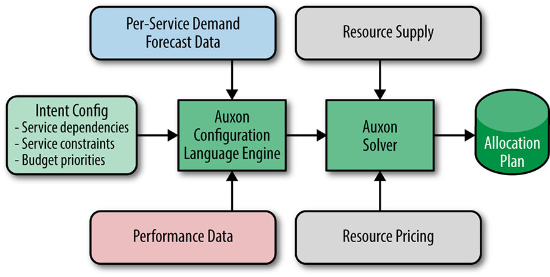

# Chương 18. Kỹ thuật Phần mềm trong SRE (Software Engineering in SRE)

> **Nguyên bản:** [Chapter 18 - Software Engineering in SRE](https://sre.google/sre-book/software-engineering-in-sre/)
> **Nguồn:** Google SRE Book (O'Reilly)
> **Bản dịch tiếng Việt** (Thực hiện bởi Đội ngũ R&D Softdreams)

---

*Tác giả:* Dave Helstroom và Trisha Weir cùng Evan Leonard và Kurt Delimon
*Biên tập:* Kavita Guliani

Hỏi ai đó nêu tên một nỗ lực kỹ thuật phần mềm của Google và họ có thể liệt kê một sản phẩm hướng người tiêu dùng như Gmail hay Maps; một số người có thể nhắc đến hạ tầng cơ bản như Bigtable hay Colossus. Nhưng thực tế, có một lượng khổng lồ công việc kỹ thuật phần mềm diễn ra sau cánh gà mà người tiêu dùng không bao giờ thấy. Một số sản phẩm đó được phát triển bên trong SRE.

Theo một số thước đo, môi trường production của Google là một trong những cỗ máy phức tạp nhất mà nhân loại từng xây dựng. Chính nhờ kinh nghiệm trực tiếp với sự tinh vi của production, SRE đặc biệt phù hợp để phát triển các công cụ giải quyết những vấn đề và use case nội bộ liên quan đến việc duy trì hoạt động của production. Phần lớn các công cụ này hướng đến mục tiêu tổng thể là duy trì uptime và giữ độ trễ (latency) thấp, nhưng mang nhiều hình thức khác nhau, chẳng hạn như các cơ chế rollout binary, giám sát, hoặc một môi trường phát triển được xây dựng dựa trên việc tổ hợp server động. Nhìn chung, những công cụ do SRE phát triển là các dự án kỹ thuật phần mềm hoàn chỉnh, khác với các giải pháp dùng một lần hay các hack nhanh. Các SRE phát triển chúng đã áp dụng một tâm thế dựa trên sản phẩm (product-based mindset), tính đến cả khách hàng nội bộ lẫn một bản đồ đường (roadmap) cho các kế hoạch trong tương lai.

## Tại sao Kỹ thuật Phần mềm Bên trong SRE lại Quan trọng? (Why Is Software Engineering Within SRE Important?)

Ở nhiều khía cạnh, quy mô khổng lồ của production Google đã buộc chúng tôi phải tự phát triển phần mềm nội bộ, bởi hiếm có công cụ bên thứ ba nào được thiết kế đủ lớn để đáp ứng nhu cầu của Google. Chính lịch sử thành công của các dự án phần mềm trong công ty đã giúp chúng tôi nhận ra lợi ích của việc phát triển trực tiếp ngay trong SRE.

Các SRE ở một vị trí độc đáo để phát triển phần mềm nội bộ một cách hiệu quả vì một số lý do:

-   Nhờ có kiến thức chuyên sâu về production của Google, các kỹ sư SRE có thể thiết kế và phát triển phần mềm với những cân nhắc phù hợp về khả năng scale, suy giảm nhẹ nhàng (graceful degradation) khi xảy ra sự cố, cũng như khả năng tương tác dễ dàng với hạ tầng hoặc công cụ khác.
-   Vì SRE gắn bó sâu với lĩnh vực chuyên môn, họ dễ hiểu các nhu cầu và yêu cầu của công cụ đang phát triển.
-   Mối quan hệ trực tiếp với người dùng dự định — các SRE đồng nghiệp — giúp đội nhận được phản hồi thẳng thắn và có tín hiệu cao (high-signal). Khi release công cụ cho một khán giả nội bộ vốn đã quen thuộc với không gian vấn đề, đội phát triển có thể khởi động và lặp lại (iterate) nhanh hơn. Người dùng nội bộ thường dễ chấp nhận UI tối giản và các vấn đề ở giai đoạn alpha.

Từ quan điểm thuần túy thực dụng, Google rõ ràng hưởng lợi từ việc có kỹ sư có kinh nghiệm SRE phát triển phần mềm. Theo thiết kế chủ ý, tốc độ tăng trưởng của các dịch vụ được SRE hỗ trợ vượt quá tốc độ tăng trưởng của tổ chức SRE; một trong những nguyên lý chỉ đường của SRE là "kích thước đội không nên scale trực tiếp với sự tăng trưởng dịch vụ." Việc đạt được tăng trưởng đội tuyến tính trước sự tăng trưởng dịch vụ theo hàm mũ đòi hỏi công việc tự động hóa không ngừng và các nỗ lực tinh giản công cụ, quy trình, và các khía cạnh khác của dịch vụ vốn đang gây ra sự kém hiệu quả trong vận hành production hàng ngày. Việc để những người có kinh nghiệm trực tiếp vận hành các hệ thống production phát triển các công cụ cuối cùng sẽ đóng góp vào các mục tiêu uptime và độ trễ là rất hợp lý.

Mặt khác, các SRE cá nhân, cũng như tổ chức SRE rộng lớn hơn, cũng hưởng lợi từ việc phát triển phần mềm do SRE thúc đẩy.

Các dự án phát triển phần mềm trọn vẹn trong SRE không chỉ mở ra cơ hội phát triển nghề nghiệp cho SRE, mà còn là lối thoát để các kỹ sư tránh bị gỉ sét kỹ năng code. Công việc dự án dài hạn giúp cân bằng với các gián đoạn (interrupt) và công việc on-call, đồng thời có thể mang lại sự hài lòng cho những kỹ sư muốn sự nghiệp của họ duy trì sự cân bằng giữa [kỹ thuật phần mềm và kỹ thuật hệ thống](https://sre.google/resources/practices-and-processes/enterprise-roadmap-to-sre/).

Ngoài việc thiết kế các công cụ tự động hóa và các nỗ lực khác nhằm giảm khối lượng công việc cho kỹ sư SRE, các dự án phát triển phần mềm còn có thể mang lại lợi ích cho tổ chức SRE bằng cách thu hút và giữ chân các kỹ sư với nhiều loại kỹ năng khác nhau. Mong muốn có một đội ngũ đa dạng càng đúng với SRE, nơi một loạt nền tảng và cách tiếp cận giải quyết vấn đề có thể giúp ngăn các điểm mù (blind spots). Vì mục đích này, Google luôn cố bố trí nhân sự cho các đội SRE bằng một sự pha trộn giữa kỹ sư có kinh nghiệm phát triển phần mềm truyền thống và kỹ sư có kinh nghiệm kỹ thuật hệ thống.

## Nghiên cứu Tình huống Auxon: Bối cảnh Dự án và Không gian Vấn đề (Auxon Case Study: Project Background and Problem Space)

Nghiên cứu tình huống này xem xét Auxon, một công cụ mạnh mẽ được phát triển bên trong SRE để tự động hóa việc lập kế hoạch năng lực (capacity planning) cho các dịch vụ đang chạy trong production Google. Để hiểu tốt nhất Auxon ra đời thế nào và giải quyết những vấn đề gì, chúng tôi trước tiên xem xét không gian vấn đề liên quan đến lập kế hoạch năng lực, cùng những khó khăn mà các cách tiếp cận truyền thống đặt ra cho các dịch vụ tại Google và trong cả ngành công nghiệp. Để có thêm ngữ cảnh về cách Google dùng các thuật ngữ *dịch vụ* (service) và *cluster* (cụm máy), xem [The Production Environment at Google, from the Viewpoint of an SRE](https://sre.google/sre-book/production-environment/).

## Lập kế hoạch Năng lực Truyền thống (Traditional Capacity Planning)

Có vô số chiến thuật lập kế hoạch năng lực cho các tài nguyên tính toán (xem [[Hix15a]](https://sre.google/sre-book/bibliography#Hix15a)), nhưng phần lớn các cách tiếp cận này đều rút gọn về một *chu kỳ* (cycle) có thể xấp xỉ như sau:

1) Thu thập các dự báo nhu cầu (demand forecasts).

Cần bao nhiêu tài nguyên? Khi nào và ở đâu những tài nguyên này được cần?

-   Sử dụng dữ liệu tốt nhất khả dụng ngày hôm nay để lập kế hoạch vào tương lai
-   Thường bao phủ bất kỳ đâu từ vài quý đến vài năm

2) Xây dựng các kế hoạch xây dựng và cấp phát.

Với dự báo như vậy, cách tốt nhất để đáp ứng nhu cầu này bằng nguồn cung cấp bổ sung tài nguyên là gì? Bao nhiêu nguồn cung, và ở những vị trí nào?

3) Xem xét và ký phê duyệt kế hoạch.

Dự báo có hợp lý không? Kế hoạch có khớp với các cân nhắc ngân sách, cấp độ sản phẩm, và kỹ thuật không?

4) Triển khai và cấu hình tài nguyên.

Khi các tài nguyên cuối cùng được cấp phát (có thể theo từng giai đoạn trong một khoảng thời gian xác định), dịch vụ nào sẽ sử dụng chúng? Làm sao để tận dụng các tài nguyên cấp thấp hơn thông thường (CPU, disk (ổ đĩa), v.v.) cho các dịch vụ?

Cần nhấn mạnh rằng lập kế hoạch năng lực là một *chu kỳ* không bao giờ kết thúc: các giả định thay đổi, các triển khai bị trượt (slip), và ngân sách bị cắt, dẫn đến những lần sửa đổi liên tiếp trên "Kế hoạch" (The Plan). Mỗi lần sửa đổi đều tạo ra các hiệu ứng lan truyền (trickle-down) phải được xử lý xuyên suốt kế hoạch của tất cả các quý tiếp theo. Ví dụ, một sự thiếu hụt trong quý này phải được bù đắp trong các quý sau. Trong khi đó, lập kế hoạch năng lực truyền thống lấy nhu cầu làm động lực chính, rồi thủ công điều chỉnh nguồn cung để khớp với nhu cầu mỗi khi có thay đổi.

### Mong manh theo bản chất (Brittle by nature)

Lập kế hoạch năng lực truyền thống tạo ra một kế hoạch cấp phát tài nguyên có thể bị gián đoạn bởi bất kỳ thay đổi nào tưởng chừng nhỏ nhặt. Ví dụ:

-   Một dịch vụ trải qua suy giảm hiệu quả, và cần nhiều tài nguyên hơn dự kiến để phục vụ cùng nhu cầu.
-   Tỷ lệ chấp nhận của khách hàng tăng, dẫn đến nhu cầu dự kiến tăng.
-   Ngày giao hàng cho một cluster tài nguyên tính toán mới bị trượt.
-   Một quyết định sản phẩm về mục tiêu hiệu năng sẽ thay đổi hình dạng triển khai dịch vụ cần thiết (dấu chân của dịch vụ) và lượng tài nguyên được yêu cầu.

Những thay đổi nhỏ buộc phải đối chiếu toàn bộ kế hoạch cấp phát để xác nhận tính khả thi; trong khi đó, các thay đổi lớn hơn (như chậm trễ giao tài nguyên hoặc thay đổi chiến lược sản phẩm) có thể khiến phải xây dựng lại kế hoạch từ đầu. Một sự chậm trễ giao hàng ở một cluster đơn lẻ có thể tác động đến yêu cầu dự phòng (redundancy) hoặc độ trễ của nhiều dịch vụ: lúc này, việc cấp phát tài nguyên ở các cluster khác phải được tăng lên để bù đắp, và những điều chỉnh này sẽ lan truyền khắp kế hoạch.

Ngoài ra, cần lưu ý rằng kế hoạch năng lực cho bất kỳ quý nào (hoặc khung thời gian khác) đều dựa trên kết quả dự kiến của các quý trước, do đó, một thay đổi ở bất kỳ quý nào cũng sẽ kéo theo việc phải cập nhật kế hoạch cho các quý tiếp theo.

### Vất vả và không chính xác (Laborious and imprecise)

Với nhiều đội, quy trình thu thập dữ liệu phục vụ dự báo nhu cầu thường chậm và dễ sai. Khi tìm năng lực để đáp ứng nhu cầu tương lai, không phải tài nguyên nào cũng tương đương nhau. Chẳng hạn, nếu yêu cầu về độ trễ bắt buộc dịch vụ phải cam kết phục vụ người dùng trong cùng một châu lục, thì việc bổ sung tài nguyên ở Bắc Mỹ sẽ không giải quyết được tình trạng thiếu hụt năng lực tại châu Á. Mỗi dự báo đi kèm các *ràng buộc* (constraints), tức các tham số quy định cách thức đáp ứng; các ràng buộc này về bản chất gắn liền với ý định (intent), sẽ được thảo luận ở phần tiếp theo.

Việc ánh xạ các yêu cầu tài nguyên bị ràng buộc thành các cấp phát tài nguyên thực từ năng lực khả dụng cũng chậm chạp không kém: việc bin pack (đóng gói) các yêu cầu vào không gian hạn chế bằng tay, hoặc tìm giải pháp khớp với ngân sách hạn chế, vừa phức tạp vừa tẻ nhạt.

Bức tranh trên đã đủ ảm đạm, nhưng tệ hơn, các công cụ mà nó đòi hỏi thường không đáng tin cậy hoặc cồng kềnh. Các bảng tính (spreadsheets) bị ảnh hưởng nghiêm trọng bởi vấn đề scale và có khả năng kiểm tra lỗi hạn chế. Dữ liệu trở nên cũ (stale), và việc theo dõi các thay đổi trở nên khó khăn. Các đội thường bị buộc phải đưa ra các giả định đơn giản hóa và giảm độ phức tạp của yêu cầu, đơn giản để làm cho việc duy trì năng lực đầy đủ trở thành một vấn đề có thể xử lý được.

Khi chủ sở hữu dịch vụ phải khớp một chuỗi yêu cầu năng lực từ các dịch vụ khác nhau vào các tài nguyên khả dụng, đồng thời đáp ứng các ràng buộc riêng của từng dịch vụ, sự không chính xác lại tiếp diễn. Bin packing là một vấn đề NP-hard, rất khó để con người tính toán thủ công. Hơn nữa, yêu cầu năng lực từ một dịch vụ nhìn chung là một tập yêu cầu nhu cầu không linh hoạt: *X* cores trong cluster *Y*. Lý do cần *X* cores hay *Y* cluster, cũng như bất kỳ mức độ tự do nào xoay quanh các tham số đó, đã mất từ lâu khi yêu cầu đến tay một con người đang cố khớp danh sách nhu cầu vào nguồn cung khả dụng.

Kết quả ròng là một sự chi tiêu khổng lồ nỗ lực con người để đạt được một bin packing, tốt nhất cũng chỉ là xấp xỉ. Quy trình vỡ vụn trước thay đổi, và không có giới hạn đã biết cho một giải pháp tối ưu.

## Giải pháp của Chúng tôi: Lập kế hoạch Năng lực Dựa trên Ý định (Our Solution: Intent-Based Capacity Planning)

*Hãy chỉ định các yêu cầu, chứ không phải cài đặt.*

Tại Google, nhiều đội đã chuyển sang cách tiếp cận mà chúng tôi gọi là *Lập kế hoạch Năng lực Dựa trên Ý định* (Intent-based Capacity Planning). Tiền đề cơ bản của cách tiếp cận này là mã hóa dưới dạng lập trình các phụ thuộc và tham số (*ý định*) của nhu cầu dịch vụ, sau đó dùng mã hóa đó để tự động tạo ra kế hoạch cấp phát chi tiết tài nguyên nào được phân bổ cho dịch vụ nào, trong cluster nào. Khi nhu cầu, nguồn cung hoặc yêu cầu dịch vụ thay đổi, chúng tôi có thể đơn giản tự động tạo một kế hoạch mới phản ánh các tham số đã thay đổi — lúc này, đó chính là sự phân phối tài nguyên tối ưu nhất.

Với các yêu cầu thực và sự linh hoạt của một dịch vụ được nắm bắt, kế hoạch năng lực giờ đây linh hoạt hơn đáng kể trước thay đổi, và chúng tôi có thể đạt được một giải pháp tối ưu đáp ứng nhiều tham số nhất có thể. Việc ủy thác bin packing cho máy tính giúp giảm đáng kể toil con người, và chủ sở hữu dịch vụ có thể tập trung vào các ưu tiên bậc cao như SLO, phụ thuộc production, và yêu cầu hạ tầng dịch vụ, thay vì lục lọi tài nguyên cấp thấp.

Một lợi ích đi kèm là việc dùng tối ưu hóa tính toán để ánh xạ từ ý định sang cài đặt giúp đạt độ chính xác cao hơn rất nhiều, từ đó tiết kiệm chi phí cho tổ chức. Bin packing vẫn chưa phải là bài toán đã được giải quyết triệt để, do một số biến thể vẫn được coi là NP-hard; tuy nhiên, các thuật toán hiện nay có thể tìm ra giải pháp tối ưu đã biết.

## Lập kế hoạch Năng lực Dựa trên Ý định (Intent-Based Capacity Planning)

*Ý định* (intent) là lý do giải thích cách một chủ sở hữu dịch vụ muốn vận hành dịch vụ. Việc chuyển từ các yêu cầu tài nguyên cụ thể sang các lý do thúc đẩy, nhằm đạt đến ý định lập kế hoạch năng lực thực, thường đòi hỏi một số lớp trừu tượng (abstraction). Hãy cân nhắc chuỗi trừu tượng sau:

1) "Tôi muốn 50 cores trong các cluster X, Y, và Z cho dịch vụ Foo."

Đây là một yêu cầu tài nguyên rõ ràng. Nhưng…*tại sao chúng tôi cần nhiều tài nguyên như vậy cụ thể trong những cluster này?*

2) "Tôi muốn một dấu chân 50-core trong bất kỳ 3 cluster nào trong vùng địa lý YYY cho dịch vụ Foo."

Yêu cầu này cho phép nhiều mức độ tự do hơn và dễ đáp ứng hơn, dù không giải thích lý do đằng sau các yêu cầu của nó. Nhưng…*tại sao chúng tôi cần lượng tài nguyên này, và tại sao 3 dấu chân?*

3) "Tôi muốn đáp ứng nhu cầu của dịch vụ Foo trong mỗi vùng địa lý, và có dự phòng N + 2."

Đột nhiên, hệ thống trở nên linh hoạt hơn hẳn, và chúng tôi có thể hiểu rõ hơn ở góc độ con người về những gì xảy ra khi dịch vụ Foo không nhận đủ tài nguyên. Nhưng… *tại sao dịch vụ Foo lại cần N + 2?*

4) "Tôi muốn chạy dịch vụ Foo ở 5 nines độ tin cậy."

Đây là một yêu cầu trừu tượng hơn, và hậu quả nếu không đáp ứng được sẽ rõ ràng: độ tin cậy bị ảnh hưởng. Ở đây, chúng tôi có nhiều linh hoạt hơn: có thể chạy ở *N* + 2 thực sự không đủ hoặc không tối ưu cho dịch vụ này, và một kế hoạch triển khai khác sẽ phù hợp hơn.

Vậy nên lập kế hoạch năng lực dựa trên ý định sử dụng ở cấp độ nào? Về lý tưởng, mọi cấp độ ý định đều cần được hỗ trợ đồng thời, và dịch vụ càng hưởng lợi khi chuyển sang chỉ định ý định thay vì cấu hình. Theo kinh nghiệm của Google, các dịch vụ thường đạt kết quả tốt nhất khi tiến đến bước 3: mức linh hoạt tốt khả dụng, và các hệ quả của yêu cầu được diễn đạt bằng thuật ngữ cấp cao hơn, dễ hiểu hơn. Những dịch vụ đặc biệt tinh vi có thể nhắm đến bước 4.

## Các Tiền thân của Ý định (Precursors to Intent)

Chúng tôi cần thông tin gì để nắm bắt ý định của một dịch vụ? Các phụ thuộc, metrics hiệu năng, và ưu tiên hóa (prioritization) sẽ vào cuộc.

### Các Sự phụ thuộc (Dependencies)

Các dịch vụ tại Google phụ thuộc vào nhiều dịch vụ hạ tầng và dịch vụ hướng người dùng khác, và các phụ thuộc này ảnh hưởng mạnh mẽ đến vị trí triển khai của một dịch vụ. Ví dụ, hãy hình dung dịch vụ hướng người dùng Foo phụ thuộc vào Bar, một dịch vụ lưu trữ hạ tầng. Foo đặt ra yêu cầu rằng Bar phải được đặt trong phạm vi 30 mili giây độ trễ mạng so với Foo. Yêu cầu này có những hệ quả quan trọng đối với vị trí triển khai của cả Foo *và* Bar, và việc lập kế hoạch năng lực dựa trên ý định phải tính đến những ràng buộc này.

Hơn nữa, các phụ thuộc production có cấu trúc lồng nhau (nested): tiếp tục ví dụ trước, hãy hình dung dịch vụ Bar có các phụ thuộc riêng vào Baz, một dịch vụ lưu trữ phân tán cấp thấp hơn, và Qux, một dịch vụ quản lý ứng dụng. Do đó, vị trí triển khai Foo sẽ bị ràng buộc bởi vị trí triển khai của Bar, Baz và Qux. Một tập phụ thuộc production nhất định có thể được chia sẻ, có thể kèm theo các điều khoản khác nhau xoay quanh ý định sử dụng.

### Các Metrics Hiệu năng (Performance metrics)

Nhu cầu của một dịch vụ lan truyền, kéo theo nhu cầu của một hoặc nhiều dịch vụ khác. Hiểu rõ chuỗi phụ thuộc này giúp định hình phạm vi chung của bài toán bin packing, nhưng chúng tôi vẫn cần thêm thông tin về mức sử dụng tài nguyên dự kiến. Dịch vụ Foo cần bao nhiêu tài nguyên tính toán để phục vụ *N* truy vấn người dùng? Với mỗi *N* truy vấn của dịch vụ Foo, chúng tôi kỳ vọng dịch vụ Bar sẽ truyền bao nhiêu Mbps dữ liệu?

Các metrics hiệu năng đóng vai trò chất kết dính giữa các phụ thuộc, chuyển đổi từ một hoặc nhiều loại tài nguyên cấp cao hơn sang một hoặc nhiều loại tài nguyên cấp thấp hơn. Để suy ra các metrics hiệu năng phù hợp cho một dịch vụ, có thể cần thực hiện kiểm thử tải (load testing) và giám sát mức sử dụng tài nguyên.

### Ưu tiên hóa (Prioritization)

Không thể tránh khỏi, các ràng buộc về tài nguyên buộc ta phải đánh đổi và đưa ra những quyết định khó khăn: khi năng lực bị thiếu hụt, trong số nhiều yêu cầu từ các dịch vụ, yêu cầu nào nên được ưu tiên hy sinh?

Có thể dự phòng *N* + 2 cho dịch vụ Foo quan trọng hơn dự phòng *N* + 1 cho dịch vụ Bar. Hoặc ra mắt tính năng *X* có thể ít quan trọng hơn dự phòng *N* + 0 cho dịch vụ Baz.

Lập kế hoạch dựa trên ý định giúp các quyết định này được đưa ra một cách minh bạch, cởi mở và nhất quán. Các ràng buộc tài nguyên luôn đi kèm những đánh đổi tương tự, nhưng trên thực tế, việc ưu tiên hóa lại thường mang tính ad hoc (tùy hứng) và thiếu rõ ràng đối với chủ sở hữu dịch vụ. Phương pháp này cho phép ưu tiên hóa ở mức độ tinh tế hoặc thô tùy theo nhu cầu.

## Giới thiệu về Auxon (Introduction to Auxon)

Auxon là giải pháp lập kế hoạch năng lực và cấp phát tài nguyên dựa trên ý định của Google, đồng thời là ví dụ điển hình cho một sản phẩm kỹ thuật phần mềm do SRE thiết kế và phát triển. Trong suốt hai năm, một nhóm nhỏ gồm các kỹ sư phần mềm và một quản lý chương trình kỹ thuật (technical program manager) thuộc SRE đã xây dựng hệ thống này. Auxon là tình huống nghiên cứu hoàn hảo để minh họa cách phát triển phần mềm có thể được nuôi dưỡng trong SRE.

Auxon được sử dụng tích cực để lập kế hoạch cho hàng triệu đô la tài nguyên máy tại Google. Nó đã trở thành một thành phần quan trọng trong công tác lập kế hoạch năng lực của một số bộ phận lớn trong Google.

Là một sản phẩm, Auxon cung cấp các công cụ để thu thập mô tả dựa trên ý định về các yêu cầu tài nguyên và phụ thuộc của một dịch vụ. Những ý định này của người dùng được thể hiện dưới dạng các yêu cầu về cách chủ sở hữu muốn dịch vụ được provision (cấp phát). Ví dụ, các yêu cầu có thể là "Dịch vụ của tôi phải có *N* + 2 mỗi châu lục" hoặc "Các server frontend phải cách các server backend không quá 50 ms." Auxon thu thập thông tin này thông qua một ngôn ngữ cấu hình dành cho người dùng hoặc qua một API (Application Programming Interface — Giao diện Lập trình Ứng dụng) lập trình, qua đó chuyển đổi ý định con người thành các ràng buộc mà máy có thể phân tích. Các yêu cầu có thể được ưu tiên hóa, một tính năng hữu ích khi tài nguyên không đủ để đáp ứng tất cả các yêu cầu và do đó phải thực hiện các đánh đổi. Những yêu cầu này — tức là các ý định — cuối cùng được biểu diễn bên trong dưới dạng một chương trình nguyên hỗn hợp (mixed-integer) hoặc tuyến tính (linear program) khổng lồ. Auxon giải quyết chương trình tuyến tính này, sau đó dùng giải pháp bin packing thu được để xây dựng kế hoạch cấp phát cho các tài nguyên.

[Hình 18-1](#hinh-18-1) và các giải thích tiếp theo phác thảo các thành phần chính của Auxon.

[Hình 18-1.](#hinh-18-1) Các thành phần chính của Auxon.

*Dữ liệu Hiệu năng* (Performance Data) cho biết một dịch vụ scale như thế nào: với mỗi đơn vị nhu cầu *X* trong cluster *Y*, bao nhiêu đơn vị phụ thuộc *Z* được sử dụng? Cách suy ra dữ liệu scale này phụ thuộc vào độ trưởng thành của dịch vụ. Một số dịch vụ đã được kiểm thử tải, trong khi những dịch vụ khác dựa vào hiệu năng trong quá khứ để suy ra mức scale.

*Dữ liệu Dự báo Nhu cầu Mỗi Dịch vụ* (Per-Service Demand Forecast Data) mô tả xu hướng sử dụng của các tín hiệu nhu cầu đã được dự báo. Một số dịch vụ suy ra mức sử dụng tương lai dựa trên các dự báo nhu cầu — cụ thể là dự báo số truy vấn mỗi giây, được chia theo châu lục. Tuy nhiên, không phải dịch vụ nào cũng có dự báo nhu cầu: một số dịch vụ (ví dụ, dịch vụ lưu trữ như Colossus) suy ra nhu cầu của chúng thuần túy từ các dịch vụ phụ thuộc vào chúng.

*Nguồn cung Tài nguyên* (Resource Supply) cung cấp dữ liệu về mức độ khả dụng của các tài nguyên cơ bản, nền tảng, chẳng hạn như số máy dự kiến khả dụng tại một thời điểm tương lai nhất định. Trong thuật ngữ chương trình tuyến tính, nguồn cung tài nguyên đóng vai trò như một *giới hạn trên* (upper bound), quy định cách các dịch vụ có thể phát triển và vị trí triển khai của chúng. Cuối cùng, chúng tôi muốn khai thác tối ưu nguồn cung tài nguyên này, trong phạm vi cho phép bởi mô tả dựa trên ý định của các nhóm dịch vụ.

*Định giá Tài nguyên* (Resource Pricing) cung cấp dữ liệu về mức độ tiêu tốn của các tài nguyên cơ bản, nền tảng. Ví dụ, chi phí của máy có thể khác nhau trên toàn cầu tùy theo các phí không gian/điện của một cơ sở nhất định. Trong thuật ngữ chương trình tuyến tính, các giá trị này phản ánh chi phí tính toán tổng thể và đóng vai trò là *mục tiêu* (objective) cần tối thiểu hóa.

*Cấu hình Ý định* (Intent Config) là chìa khóa để đưa thông tin dựa trên ý định vào Auxon. Nó định nghĩa thế nào là một dịch vụ và cách các dịch vụ liên kết với nhau. Config đóng vai trò như một tầng cấu hình, cho phép kết nối tất cả các thành phần khác. Nó được thiết kế để con người có thể đọc và cấu hình.

*Engine Ngôn ngữ Cấu hình Auxon* (Auxon Configuration Language Engine) hoạt động dựa trên thông tin nhận từ Intent Config. Thành phần này định hình một yêu cầu mà máy có thể đọc: một protocol buffer (bộ đệm giao thức) để Auxon Solver (Bộ giải) hiểu. Nó áp dụng một số kiểm tra hợp lý (sanity checking) nhẹ đối với cấu hình, đóng vai trò là cổng giữa định nghĩa ý định do con người cấu hình và yêu cầu tối ưu hóa mà máy có thể phân tích.

*Auxon Solver* đóng vai trò là bộ não của công cụ. Nó xây dựng chương trình nguyên hỗn hợp hoặc tuyến tính khổng lồ dựa trên yêu cầu tối ưu hóa nhận từ Configuration Language Engine. Bộ giải này được thiết kế để scale mạnh, cho phép chạy song song trên hàng trăm hoặc thậm chí hàng nghìn máy trong các cluster của Google. Ngoài các công cụ lập trình tuyến tính nguyên hỗn hợp, Auxon Solver còn bao gồm các thành phần xử lý các tác vụ như lên lịch, quản lý một bể (pool) các worker (máy công nhân), và đi xuống các cây quyết định (decision trees).

*Kế hoạch Cấp phát* (Allocation Plan) là đầu ra của Auxon Solver. Nó xác định tài nguyên nào được cấp cho dịch vụ nào tại vị trí nào. Đây là các chi tiết cài đặt được tính toán từ định nghĩa dựa trên ý định của các yêu cầu trong bài toán lập kế hoạch năng lực. Kế hoạch Cấp phát cũng nêu rõ những yêu cầu không thể đáp ứng — chẳng hạn, khi một yêu cầu không thể thực hiện do thiếu tài nguyên, hoặc do các yêu cầu cạnh tranh quá khắt khe.

## Các Yêu cầu và Cài đặt: Những Thành công và Bài học Rút ra (Requirements and Implementation: Successes and Lessons Learned)

Auxon ra đời từ ý tưởng của một SRE và một quản lý chương trình kỹ thuật. Cả hai đều được các nhóm tương ứng giao nhiệm vụ lập kế hoạch năng lực cho phần lớn hạ tầng của Google. Trước đó, họ vẫn phải làm việc thủ công trên bảng tính, nên nắm rõ những điểm kém hiệu quả và cơ hội cải thiện nhờ tự động hóa, cũng như các tính năng mà một công cụ như vậy cần có.

Trong suốt quá trình phát triển Auxon, đội SRE đằng sau sản phẩm tiếp tục gắn chặt vào thế giới production. Đội tiếp tục tham gia vòng trực on-call cho một số dịch vụ của Google, và tham gia vào các cuộc thảo luận thiết kế cũng như lãnh đạo kỹ thuật của những dịch vụ này. Qua những tương tác liên tục, đội giữ được cảm giác chân thực với production: họ vừa là người dùng vừa là người phát triển của chính sản phẩm. Khi sản phẩm thất bại, đội bị ảnh hưởng trực tiếp. Các yêu cầu tính năng được thúc đẩy bởi chính trải nghiệm thực tế của đội. Kinh nghiệm trực tiếp với không gian vấn đề không chỉ mang lại cảm giác sở hữu lớn đối với sự thành công của sản phẩm, mà còn giúp tăng cường độ tin cậy và tính chính đáng của sản phẩm trong SRE.

### Xấp xỉ (Approximation)

Đừng cố chấp theo đuổi sự hoàn hảo hay tính thuần túy của giải pháp, đặc biệt khi các giới hạn của vấn đề chưa rõ. Hãy khởi động và lặp lại.

Bất kỳ nỗ lực kỹ thuật phần mềm đủ phức tạp nào cũng chắc chắn sẽ đối mặt với sự không chắc chắn về cách thiết kế một thành phần hoặc cách tiếp cận một vấn đề. Auxon gặp phải điều này sớm trong quá trình phát triển, vì thế giới lập trình tuyến tính là lãnh thổ chưa được khai phá đối với các thành viên nhóm. Các giới hạn của lập trình tuyến tính — dường như là một phần trung tâm của cách sản phẩm nhiều khả năng sẽ hoạt động — không được hiểu rõ. Để vượt qua sự lúng túng này, chúng tôi chọn ban đầu xây dựng một engine bộ giải đơn giản hóa (còn gọi là "Stupid Solver" — Bộ giải ngốc) áp dụng một số heuristics (thuật toán gần đúng) đơn giản về cách sắp xếp các dịch vụ dựa trên yêu cầu do người dùng chỉ định. Trong khi Stupid Solver sẽ không bao giờ tạo ra một giải pháp thực sự tối ưu, nó cho nhóm cảm giác rằng tầm nhìn của chúng tôi cho Auxon là có thể đạt được, ngay cả khi chúng tôi không xây dựng một thứ hoàn hảo từ ngày đầu tiên.

Khi dùng xấp xỉ để đẩy nhanh tiến độ, điều quan trọng là phải làm việc sao cho nhóm có thể nâng cấp và xem xét lại các phần xấp xỉ trong tương lai. Với Stupid Solver, toàn bộ giao diện bộ giải được trừu tượng hóa trong Auxon, giúp việc thay thế các thành phần bên trong bộ giải sau này trở nên dễ dàng. Cuối cùng, khi chúng tôi đủ tin tưởng vào một mô hình lập trình tuyến tính thống nhất, việc thay Stupid Solver bằng một thứ, chà, thông minh hơn chỉ là một thao tác đơn giản.

Yêu cầu sản phẩm của Auxon cũng tồn tại một số điểm chưa rõ ràng. Phát triển phần mềm dựa trên các yêu cầu mơ hồ có thể gây nản lòng, nhưng một mức độ bất định nhất định không nhất thiết phải là rào cản. Hãy biến sự mơ hồ đó thành động lực để đảm bảo phần mềm được thiết kế vừa tổng quát vừa có tính module. Ví dụ, một trong những mục tiêu của dự án Auxon là tích hợp với các hệ thống tự động hóa bên trong Google để một Kế hoạch Cấp phát có thể được thực thi trực tiếp trên production (gán tài nguyên và khởi động/tắt/điều chỉnh kích thước các dịch vụ tương ứng). Tuy nhiên, vào thời điểm đó, lĩnh vực hệ thống tự động hóa đang biến động mạnh, với vô số cách tiếp cận khác nhau. Thay vì thiết kế các giải pháp riêng biệt để Auxon hoạt động với từng công cụ, chúng tôi định hình Kế hoạch Cấp phát đủ phổ quát, giúp những hệ thống tự động hóa này tích hợp ở các điểm riêng của chúng. Cách tiếp cận trung lập công nghệ này trở thành chìa khóa cho quy trình tiếp nhận khách hàng mới của Auxon, vì nó cho phép khách hàng bắt đầu sử dụng mà không cần cam kết với một công cụ tự động hóa, công cụ dự báo, hay công cụ dữ liệu hiệu năng cụ thể.

Chúng tôi cũng tận dụng thiết kế có tính module để xử lý các yêu cầu chưa rõ ràng khi xây dựng mô hình hiệu năng máy trong Auxon. Dữ liệu về hiệu năng nền tảng máy trong tương lai (ví dụ, CPU) rất khan hiếm, nhưng người dùng lại muốn một cách để mô hình hóa các kịch bản khác nhau về sức mạnh máy. Chúng tôi trừu tượng hóa dữ liệu máy phía sau một giao diện đơn lẻ, cho phép người dùng hoán đổi các mô hình hiệu năng máy trong tương lai khác nhau. Sau đó, dựa trên các yêu cầu ngày càng cụ thể, chúng tôi mở rộng tính module này để cung cấp một thư viện các mô hình hiệu năng máy đơn giản hoạt động trong giao diện đó.

Nếu có một bài học rút ra từ nghiên cứu tình huống Auxon, đó là khẩu hiệu cũ "[khởi động và lặp lại](https://sre.google/sre-book/reliable-product-launches/)" đặc biệt phù hợp với các dự án phát triển phần mềm SRE. Đừng chờ thiết kế hoàn hảo; thay vào đó, hãy luôn giữ tầm nhìn tổng thể trong đầu khi tiếp tục thiết kế và phát triển. Khi gặp các vùng không chắc chắn, hãy thiết kế phần mềm đủ linh hoạt để nếu quy trình hay chiến lược thay đổi ở cấp cao hơn, bạn không phải chịu một chi phí làm lại khổng lồ. Nhưng đồng thời, hãy giữ chân mình bằng cách đảm bảo các giải pháp tổng quát có một cài đặt cụ thể trong thế giới thực minh họa tính hữu dụng của thiết kế.

## Nâng cao Nhận thức và Thúc đẩy Chấp nhận (Raising Awareness and Driving Adoption)

Giống như mọi sản phẩm khác, phần mềm do SRE phát triển phải được thiết kế dựa trên hiểu biết về người dùng và yêu cầu của họ. Sản phẩm cần thúc đẩy việc chấp nhận thông qua tính hữu dụng, hiệu năng, và khả năng chứng minh được vừa đáp ứng các mục tiêu độ tin cậy production của Google, vừa cải thiện cuộc sống của các SRE. Việc xã hội hóa sản phẩm và đạt được sự cam kết (buy-in) xuyên suốt tổ chức là chìa khóa cho thành công của dự án.

Đừng xem nhẹ công sức cần bỏ ra để nâng cao nhận thức và sự quan tâm đối với sản phẩm phần mềm của bạn — một bài thuyết trình hay một email thông báo đơn lẻ là không đủ. Việc phổ biến các công cụ phần mềm nội bộ đến một lượng lớn người dùng đòi hỏi tất cả những điều sau:

-   Một cách tiếp cận nhất quán và mạch lạc
-   Sự ủng hộ của người dùng
-   Sự bảo trợ của các kỹ sư cấp cao và ban quản lý, những người bạn sẽ phải thuyết phục bằng tính hữu dụng của sản phẩm

Khi làm cho sản phẩm dễ sử dụng, điều quan trọng là phải xem xét quan điểm của khách hàng. Một kỹ sư có thể không có thời gian hay xu hướng để đào sâu vào code nguồn nhằm tìm ra cách dùng một công cụ. Dù các khách hàng nội bộ nhìn chung bao dung hơn với các cạnh thô và các bản alpha (thử nghiệm) sớm so với khách hàng bên ngoài, việc cung cấp tài liệu vẫn cần thiết. Các SRE bận rộn, và nếu giải pháp của bạn quá khó hay gây nhầm lẫn, họ sẽ tự viết giải pháp của riêng họ.

### Đặt kỳ vọng (Set expectations)

Khi một kỹ sư có nhiều năm kinh nghiệm trong một không gian vấn đề bắt đầu thiết kế một sản phẩm, dễ dàng hình dung một trạng thái cuối cùng lý tưởng cho công việc. Tuy nhiên, quan trọng là phải phân biệt các mục tiêu mong muốn của sản phẩm với các tiêu chí thành công tối thiểu (hay Sản phẩm Tối thiểu Khả thi — Minimum Viable Product). Dự án có thể mất uy tín và thất bại khi hứa hẹn quá nhiều, quá sớm; nhưng cùng lúc, nếu một sản phẩm không hứa hẹn một kết quả đủ mang lại lợi ích, có thể khó vượt qua năng lượng kích hoạt cần thiết để thuyết phục các đội nội bộ thử một thứ mới. Minh họa sự tiến bộ ổn định, tăng dần qua các release nhỏ giúp củng cố niềm tin của người dùng vào khả năng cung cấp phần mềm hữu ích của đội bạn.

Với Auxon, chúng tôi tìm được sự cân bằng bằng cách lập bản đồ cho các giải pháp dài hạn song song với việc vá các lỗi ngắn hạn. Các nhóm được cam kết rằng:

-   Mọi nỗ lực onboard và cấu hình đều mang lại lợi ích tức thì: giảm bớt sự khó chịu khi phải bin pack thủ công các yêu cầu tài nguyên ngắn hạn.
- Khi phát triển thêm các tính năng cho Auxon, các tệp cấu hình sẽ được kế thừa, từ đó mang lại những tiết kiệm chi phí dài hạn mới, rộng lớn hơn, cùng các lợi ích khác. Nhờ bản đồ đường dự án, các dịch vụ có thể nhanh chóng xác định xem use case hay tính năng mà chúng cần đã được cài đặt trong các phiên bản ban đầu hay chưa. Trong khi đó, cách tiếp cận phát triển lặp đi lặp lại của Auxon liên tục được đưa vào các ưu tiên phát triển và các mốc mới của bản đồ đường.

### Xác định các Khách hàng Phù hợp (Identify appropriate customers)

Nhóm phát triển Auxon nhận ra rằng một giải pháp kích thước đơn (one-size) có thể không phù hợp với tất cả; nhiều nhóm lớn hơn đã có các giải pháp tự phát triển cho lập kế hoạch năng lực hoạt động khá tốt. Dù các công cụ tùy chỉnh của họ không hoàn hảo, những nhóm này không trải qua đủ đau đớn trong quy trình lập kế hoạch năng lực để thử một công cụ mới, đặc biệt là một release alpha còn nhiều cạnh thô.

Các phiên bản ban đầu của Auxon cố ý nhắm đến các đội không có quy trình lập kế hoạch năng lực hiện có. Những đội này sẽ phải đầu tư nỗ lực cấu hình bất kể họ chọn một công cụ hiện có hay cách tiếp cận mới của chúng tôi, nên họ quan tâm đến việc chấp nhận công cụ mới nhất. Những thành công ban đầu mà Auxon đạt được với những đội đó minh họa tính hữu dụng của dự án, và biến chính những khách hàng đó thành những người ủng hộ công cụ. Việc định lượng tính hữu dụng của sản phẩm chứng tỏ là một lợi ích liên tục; khi onboard một trong các Business Area (Khu vực Kinh doanh) của Google, đội đã tạo ra một nghiên cứu tình huống chi tiết về quy trình và so sánh kết quả trước và sau. Chỉ riêng việc tiết kiệm thời gian và giảm toil con người đã là một động lực lớn để các đội khác thử Auxon.

### Dịch vụ Khách hàng (Customer service)

Dù phần mềm phát triển trong SRE hướng đến đối tượng là các TPM (Technical Program Manager — Quản lý Chương trình Kỹ thuật) và kỹ sư có trình độ cao, bất kỳ phần mềm đủ đổi mới nào cũng có đường cong học tập với người dùng mới. Hãy mạnh dạn cung cấp hỗ trợ khách hàng găng tay trắng (white glove) cho những người chấp nhận sớm để giúp họ vượt qua quy trình onboard. Đôi khi, tự động hóa còn kéo theo nhiều lo ngại cảm xúc, chẳng hạn như nỗi sợ công việc của ai đó sẽ bị thay thế bởi một shell script. Bằng cách làm việc một-một với những người dùng sớm, bạn có thể giải quyết các nỗi sợ đó một cách cá nhân, đồng thời chỉ ra rằng thay vì trực tiếp thực hiện các tác vụ tẻ nhạt, đội ngũ giờ đây đang sở hữu các cấu hình, quy trình và kết quả cuối cùng của công việc kỹ thuật. Những người chấp nhận muộn hơn sẽ bị thuyết phục bởi các ví dụ thành công từ những người đi trước.

Hơn nữa, do các đội SRE của Google phân bố trên toàn cầu, những người ủng hộ chấp nhận sớm một dự án đặc biệt có lợi, vì họ có thể đóng vai trò như các chuyên gia địa phương cho những đội khác quan tâm đến việc thử dự án.

### Thiết kế ở Cấp độ Đúng (Designing at the right level)

Một ý tưởng mà chúng tôi gọi là *trung lập công nghệ* (agnosticism) — viết phần mềm đủ tổng quát để chấp nhận vô số nguồn dữ liệu làm input (đầu vào) — là một nguyên lý chính của thiết kế Auxon. Trung lập công nghệ có nghĩa là khách hàng không bị yêu cầu cam kết với bất kỳ công cụ nào để sử dụng khung Auxon. Cách tiếp cận này giúp Auxon duy trì đủ hữu dụng và tổng quát ngay cả khi các đội với use case khác nhau bắt đầu sử dụng nó. Chúng tôi tiếp cận những người dùng tiềm năng với thông điệp, "cứ đến với chúng tôi như hiện trạng của bạn; chúng tôi sẽ làm việc với những gì bạn đang có." Bằng cách tránh tùy chỉnh quá mức cho một hoặc hai người dùng lớn, chúng tôi đạt được sự chấp nhận rộng hơn xuyên suốt tổ chức và giảm rào cản gia nhập cho các dịch vụ mới.

Chúng tôi cũng chủ động tránh cái bẫy coi thành công là 100% sự chấp nhận trên toàn tổ chức. Trong nhiều trường hợp, lợi ích giảm dần khi cố gắng hoàn tất những chặng cuối cùng để đưa tập tính năng đủ cho mọi dịch vụ thuộc phần đuôi dài (long tail) tại Google.

## Động lực Đội (Team Dynamics)

Khi tuyển dụng kỹ sư cho các sản phẩm phần mềm thuộc phạm vi SRE, chúng tôi nhận thấy lợi ích rõ rệt từ việc xây dựng một đội hạt giống (seed team) kết hợp giữa những người đa năng (generalists) có khả năng nắm bắt nhanh chủ đề mới và các kỹ sư có bề dày kiến thức, kinh nghiệm. Sự đa dạng này giúp lấp đầy các điểm mù, đồng thời tránh được cạm bẫy của việc mặc định rằng use case của mọi đội đều giống với đội của bạn.

Điều thiết yếu là đội bạn thiết lập mối quan hệ làm việc với các chuyên gia cần thiết, và cho các kỹ sư của bạn thoải mái làm việc trong một không gian vấn đề mới. Đối với các đội SRE tại phần lớn các công ty, việc dấn vào không gian vấn đề mới này đòi hỏi thuê ngoài các tác vụ hoặc làm việc với các nhà tư vấn, nhưng các đội SRE tại các tổ chức lớn hơn có thể hợp tác với các chuyên gia nội bộ. Trong các giai đoạn đầu của việc hình dung và thiết kế Auxon, chúng tôi đã trình bày tài liệu thiết kế của mình đến các đội nội bộ của Google chuyên về Operations Research (Nghiên cứu Vận hành) và Quantitative Analysis (Phân tích Định lượng) để tận dụng chuyên môn của họ và khởi tạo kiến thức của đội Auxon về lập kế hoạch năng lực.

Khi dự án tiếp tục phát triển và tập tính năng của Auxon ngày càng mở rộng, phức tạp hơn, nhóm đã bổ sung các thành viên có nền tảng về thống kê và tối ưu hóa toán học. Ở một công ty nhỏ hơn, điều này có thể tương đương với việc đưa một nhà tư vấn bên ngoài vào nội bộ. Những thành viên mới này có thể xác định các khu vực cần cải thiện khi chức năng cơ bản của dự án hoàn thành và việc bổ sung sự tinh tế trở thành ưu tiên hàng đầu.

Thời điểm thích hợp để mời chuyên gia tham gia, tất nhiên, sẽ khác nhau tùy dự án. Theo một nguyên tắc chung, dự án cần đã khởi động thành công và chứng minh được hiệu quả, để chuyên môn bổ sung có thể giúp củng cố đáng kể kỹ năng của đội hiện tại.

## Nuôi dưỡng Kỹ thuật Phần mềm trong SRE (Fostering Software Engineering in SRE)

Điều gì khiến một dự án đủ điều kiện để chuyển từ công cụ dùng một lần sang một nỗ lực kỹ thuật phần mềm đầy đủ? Các tín hiệu tích cực mạnh bao gồm: kỹ sư có kinh nghiệm trực tiếp trong lĩnh vực liên quan, quan tâm đến việc làm trên dự án, và một cơ sở người dùng mục tiêu rất kỹ thuật (và do đó có thể cung cấp các báo cáo bug chất lượng cao trong các giai đoạn đầu phát triển). Dự án nên mang lại các lợi ích đáng kể, như giảm toil cho các SRE, cải thiện một phần hạ tầng hiện có, hoặc tinh giản một quy trình phức tạp.

Điều quan trọng là dự án phải khớp với tổng thể bộ mục tiêu của tổ chức, để các lãnh đạo kỹ thuật có thể cân nhắc tác động tiềm tàng của nó và sau đó ủng hộ dự án của bạn, cả với các đội trực thuộc lẫn với các đội khác có thể giao tiếp với các đội của họ. Việc xã hội hóa và xem xét liên tổ chức giúp ngăn các nỗ lực rời rạc hoặc chồng chéo, và một sản phẩm dễ được định vị là thúc đẩy một mục tiêu trên toàn bộ phòng ban sẽ dễ được bố trí nhân sự và hỗ trợ hơn.

Điều gì khiến một dự án trở thành ứng cử viên kém? Đó là sự xuất hiện đồng thời của nhiều "cờ đỏ" (red flags) — thứ mà bạn có thể trực giác nhận ra trong bất kỳ dự án phần mềm nào — chẳng hạn như phần mềm can thiệp vào nhiều bộ phận chuyển động cùng lúc, hoặc thiết kế đòi hỏi cách tiếp cận tất-cả-hoặc-không-gì (all-or-nothing) khiến việc phát triển lặp đi lặp lại trở nên bất khả thi. Vì các đội SRE tại Google hiện được tổ chức xoay quanh các dịch vụ mà họ vận hành, các dự án do SRE phát triển đặc biệt dễ rơi vào tình trạng quá cụ thể, chỉ mang lại lợi ích cho một phần nhỏ tổ chức. Do động lực của các đội chủ yếu được căn chỉnh để mang lại trải nghiệm tuyệt vời cho người dùng của một dịch vụ cụ thể, các dự án thường thất bại trong việc tổng quát hóa sang một use case rộng hơn khi sự chuẩn hóa xuyên suốt các đội SRE bị xếp xuống sau. Ở đầu kia của phổ, các khung quá tổng quát cũng có thể gây ra vấn đề tương đương; nếu một công cụ cố gắng quá linh hoạt và quá phổ quát, nó sẽ đối mặt với rủi ro không vừa khít với bất kỳ use case nào, và do đó không đủ giá trị trong bản thân nó. Các dự án có phạm vi rộng lớn và mục tiêu trừu tượng thường đòi hỏi nỗ lực phát triển đáng kể, nhưng lại thiếu các use case cụ thể cần thiết để mang lại lợi ích cho người dùng cuối trong một khung thời gian hợp lý.

Lấy một ví dụ về use case rộng: một load balancer (bộ cân bằng tải) tầng-3 do các SRE Google phát triển đã thành công đến mức, qua nhiều năm, nó được tái sử dụng như một đề xuất sản phẩm hướng khách hàng thông qua Google Cloud Load Balancer [[Eis16]](https://sre.google/sre-book/bibliography#Eis16).

## Thành công Xây dựng một Văn hóa Kỹ thuật Phần mềm trong SRE: Nhân sự và Thời gian Phát triển (Successfully Building a Software Engineering Culture in SRE: Staffing and Development Time)

SRE thường là những người đa năng, vì họ ưu tiên mở rộng kiến thức hơn là đào sâu chuyên môn — điều này rất hữu ích để nắm bắt bức tranh tổng thể (nhất là khi bức tranh đó còn mờ nhạt so với sự phức tạp bên trong của hạ tầng kỹ thuật hiện đại). Những kỹ sư này thường có kỹ năng code và phát triển phần mềm vững chắc, nhưng có thể thiếu kinh nghiệm SWE (Kỹ sư Phần mềm) truyền thống, chẳng hạn như việc làm việc trong một đội sản phẩm hay phải cân nhắc các yêu cầu tính năng từ khách hàng. Một trích dẫn từ kỹ sư trong dự án phát triển phần mềm SRE ban đầu đã tóm tắt cách tiếp cận phần mềm truyền thống của SRE: "Tôi có tài liệu thiết kế; tại sao chúng tôi cần các yêu cầu?" Hợp tác với các kỹ sư, TPM hoặc PM (Quản lý Sản phẩm) quen với phát triển phần mềm hướng người dùng có thể giúp xây dựng văn hóa phát triển phần mềm cho đội, kết hợp những điểm mạnh nhất của cả phát triển sản phẩm phần mềm lẫn kinh nghiệm vận hành production trực tiếp.

Thời gian làm việc chuyên tâm, không bị ngắt, là điều thiết yếu cho mọi nỗ lực phát triển phần mềm. Cần có khoảng thời gian như vậy để dự án có tiến bộ, bởi gần như không thể viết code — chứ đừng nói đến việc tập trung vào các dự án lớn hơn, có tác động hơn — khi bạn đang nhảy nhót giữa nhiều tác vụ trong suốt một giờ. Vì vậy, khả năng làm việc trên một dự án phần mềm mà không bị ngắt thường là lý do hấp dẫn khiến các kỹ sư bắt đầu một dự án phát triển. Những khoảng thời gian như vậy phải được bảo vệ một cách quyết liệt.

Phần lớn các sản phẩm phần mềm trong SRE khởi đầu là những dự án phụ; chính tính hữu dụng đã giúp chúng phát triển và được chính thức hóa. Đến giai đoạn này, một sản phẩm có thể rẽ sang một trong vài hướng khả thi:

-   Tiếp tục là một nỗ lực cơ sở được phát triển trong thời gian rảnh của các kỹ sư
-   Được thiết lập như một dự án chính thức thông qua các quy trình có cấu trúc (xem [Đi đến đó](#di-den-do))
-   Đạt được sự bảo trợ điều hành từ bên trong lãnh đạo SRE để mở rộng thành một nỗ lực phát triển phần mềm được bố trí nhân sự đầy đủ

Tuy nhiên, trong bất kỳ kịch bản nào — và đây là điểm đáng nhấn mạnh — các SRE tham gia phát triển vẫn phải làm việc với tư cách SRE, chứ không phải trở thành developer toàn thời gian gắn vào tổ chức SRE. Việc luôn đứng trong thế giới production mang lại cho các SRE làm công việc phát triển một góc nhìn vô giá, bởi họ vừa là người sáng tạo, vừa là khách hàng của bất kỳ sản phẩm nào.

## Đi đến đó (Getting There)

Nếu bạn thích ý tưởng về phát triển phần mềm có tổ chức trong SRE, bạn có thể đang tự hỏi làm thế nào để đưa một mô hình phát triển phần mềm vào một tổ chức SRE vốn tập trung vào hỗ trợ production.

Trước hết, cần nhận ra rằng mục tiêu này vừa là sự thay đổi về tổ chức, vừa là thách thức kỹ thuật. Các SRE vốn quen làm việc sát sao với đồng đội, nhanh chóng phân tích và xử lý sự cố. Do đó, việc bạn đang làm đi ngược lại bản năng tự nhiên của SRE là lập tức viết code để đáp ứng nhu cầu cấp bách. Nếu đội SRE của bạn nhỏ, cách tiếp cận này có thể không gây vấn đề. Tuy nhiên, khi tổ chức phát triển, phương pháp ad hoc này sẽ không scale được, mà dẫn đến các giải pháp phần mềm phần lớn hoạt động được nhưng hẹp hoặc chỉ dùng cho một mục đích, không thể chia sẻ, điều tất yếu dẫn đến nỗ lực trùng lặp và thời gian bị lãng phí.

Tiếp theo, hãy suy nghĩ về điều bạn muốn đạt được bằng cách phát triển phần mềm trong SRE. Bạn chỉ muốn nuôi dưỡng các thực hành phát triển phần mềm tốt hơn trong đội của mình, hay bạn quan tâm đến việc phát triển phần mềm tạo ra các kết quả có thể được sử dụng xuyên suốt các đội, có thể như một tiêu chuẩn cho tổ chức? Trong các tổ chức lớn đã ổn định, sự thay đổi sau sẽ mất nhiều thời gian, có thể trải qua nhiều năm. Một sự thay đổi như vậy cần được xử lý trên nhiều mặt, nhưng đổi lại có hiệu quả cao hơn. Dưới đây là một số hướng dẫn từ kinh nghiệm của Google:

**Tạo và truyền thông một thông điệp rõ ràng**

Điều quan trọng là phải định nghĩa và truyền thông chiến lược, kế hoạch, và — quan trọng nhất — các lợi ích SRE đạt được từ nỗ lực này. SRE thường là những người hay hoài nghi (thực tế, sự hoài nghi là một đặc tính mà chúng tôi chủ động tuyển dụng); phản hồi ban đầu của một SRE đối với một nỗ lực như vậy nhiều khả năng là, "điều đó nghe có vẻ như quá nhiều gánh nặng" hoặc "nó sẽ không bao giờ hoạt động." Hãy bắt đầu bằng cách tạo một lập luận thuyết phục về cách chiến lược này sẽ giúp SRE; ví dụ:

-   Các giải pháp phần mềm nhất quán và được hỗ trợ tăng tốc quá trình ramp-up (chạy lên) cho các SRE mới.
-   Việc giảm số cách thực hiện một tác vụ giúp toàn bộ phòng ban tận dụng được kỹ năng mà bất kỳ đội nào đã phát triển, nhờ đó kiến thức và nỗ lực có thể lan tỏa giữa các đội.

Khi các SRE bắt đầu hỏi *cách* chiến lược của bạn sẽ vận hành, thay vì *liệu* có nên theo đuổi nó hay không, bạn biết mình đã vượt qua rào cản đầu tiên.

**Đánh giá các khả năng của tổ chức bạn**

SRE thường có nhiều kỹ năng, nhưng không hiếm trường hợp một SRE thiếu kinh nghiệm trong việc tham gia đội ngũ xây dựng và phát hành sản phẩm đến người dùng. Về bản chất, để phát triển phần mềm hữu ích, bạn đang tạo ra một đội sản phẩm. Đội này đòi hỏi các vai trò và kỹ năng mà tổ chức SRE của bạn có thể chưa từng cần trước đây. Liệu có ai đóng vai trò quản lý sản phẩm, hoạt động như người đại diện cho khách hàng không? Tech lead (lãnh đạo kỹ thuật) hay quản lý dự án của bạn có đủ kỹ năng và/hoặc kinh nghiệm để vận hành quy trình phát triển agile (linh hoạt) không?

Hãy lấp đầy những khoảng trống này bằng cách tận dụng các kỹ năng sẵn có trong công ty. Để đội phát triển sản phẩm hỗ trợ thiết lập các thực hành agile thông qua đào tạo hoặc hướng dẫn. Xin thời gian tư vấn từ một quản lý sản phẩm để giúp định nghĩa các yêu cầu sản phẩm và ưu tiên hóa công việc tính năng. Với một cơ hội phát triển phần mềm đủ lớn, có thể có một lập luận để tuyển dụng những người chuyên tâm cho những vai trò này. Việc lập luận để tuyển dụng cho những vai trò này sẽ dễ dàng hơn một khi bạn đã có một số kết quả thử nghiệm tích cực.

**Khởi động và lặp lại**

Khi khởi động chương trình phát triển phần mềm SRE, mọi nỗ lực của bạn đều nằm dưới sự giám sát chặt chẽ. Điều quan trọng là phải thiết lập uy tín bằng cách giao một số sản phẩm có giá trị trong khoảng thời gian hợp lý. Vòng sản phẩm đầu tiên nên nhắm đến các mục tiêu tương đối đơn giản và có thể đạt được — những mục tiêu không gây tranh cãi hoặc đã có sẵn giải pháp. Chúng tôi cũng thấy hiệu quả khi kết hợp cách tiếp cận này với nhịp điệu sáu tháng của các release cập nhật sản phẩm, mang lại các tính năng hữu ích bổ sung. Chu kỳ release này cho phép các đội tập trung vào việc xác định đúng tập tính năng cần xây dựng, rồi triển khai những tính năng đó trong khi đồng thời học cách trở thành một đội phát triển phần mềm năng suất. Sau giai đoạn khởi động ban đầu, một số đội tại Google chuyển sang mô hình push-on-green (đẩy khi xanh) để giao hàng và phản hồi nhanh hơn nữa.

**Đừng hạ thấp các chuẩn mực của bạn**

Khi bắt đầu phát triển phần mềm, bạn có thể bị cám dỗ cắt góc (cut corners). Hãy chống lại sự cám dỗ này bằng cách giữ bản thân ở cùng các chuẩn mực mà các đội phát triển sản phẩm của bạn được yêu cầu. Ví dụ:

-   Tự hỏi mình: nếu sản phẩm này được tạo ra bởi một đội dev (phát triển) riêng biệt, bạn có sẵn sàng onboard sản phẩm không?
-   Nếu giải pháp của bạn hưởng lợi từ việc được chấp nhận rộng rãi, nó có thể trở thành thiết yếu để các SRE thực hiện công việc của họ thành công. Vì vậy, độ tin cậy là quan trọng nhất. Bạn có các thực hành xem xét code phù hợp không? Bạn có kiểm thử đầu-cuối hoặc tích hợp không? Hãy để một đội SRE khác xem xét sản phẩm về sự sẵn sàng production, như cách họ sẽ làm khi onboard bất kỳ dịch vụ nào khác.

Mất rất nhiều thời gian để xây dựng uy tín cho nỗ lực phát triển phần mềm của bạn, nhưng chỉ cần một bước đi sai là uy tín đó có thể tan biến.

## Kết luận (Conclusions)

Các dự án kỹ thuật phần mềm trong Google SRE đã phát triển mạnh mẽ cùng với sự lớn lên của tổ chức. Trong nhiều trường hợp, những bài học rút ra và thành công từ việc triển khai các dự án phần mềm trước đó đã mở đường cho những nỗ lực tiếp theo. Kinh nghiệm production trực tiếp độc đáo mà các SRE mang đến cho công tác phát triển công cụ có thể dẫn đến những cách tiếp cận đổi mới cho các vấn đề tồn tại lâu năm, như trường hợp phát triển Auxon để giải quyết bài toán phức tạp về lập kế hoạch năng lực. Các dự án phần mềm do SRE thúc đẩy cũng đáng chú ý ở chỗ mang lại lợi ích cho công ty trong việc xây dựng một mô hình bền vững để hỗ trợ các dịch vụ ở quy mô lớn. Vì các SRE thường phát triển phần mềm nhằm tinh giản các quy trình kém hiệu quả hoặc tự động hóa các tác vụ chung, những dự án này giúp đội SRE không phải scale tuyến tính theo kích thước của các dịch vụ mà họ hỗ trợ. Cuối cùng, việc có SRE dành một phần thời gian cho phát triển phần mềm mang lại lợi ích cho cả công ty, tổ chức SRE và chính các SRE.

---

Copyright © 2017 Google, Inc. Published by O'Reilly Media, Inc. Licensed under [CC BY-NC-ND 4.0](https://creativecommons.org/licenses/by-nc-nd/4.0/)
