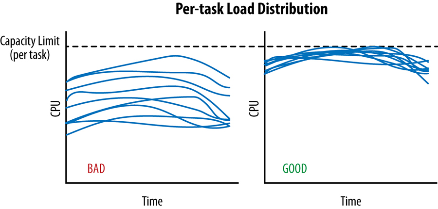
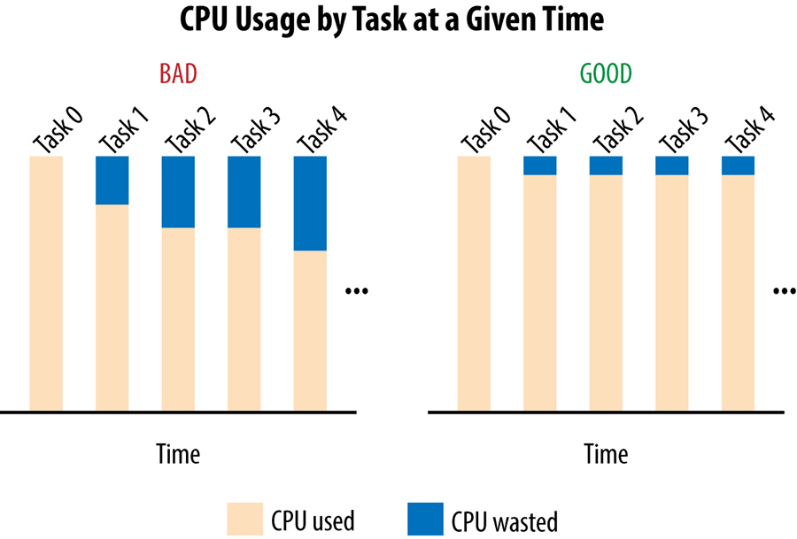
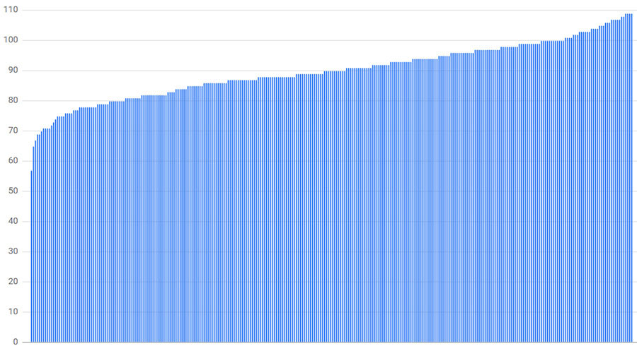
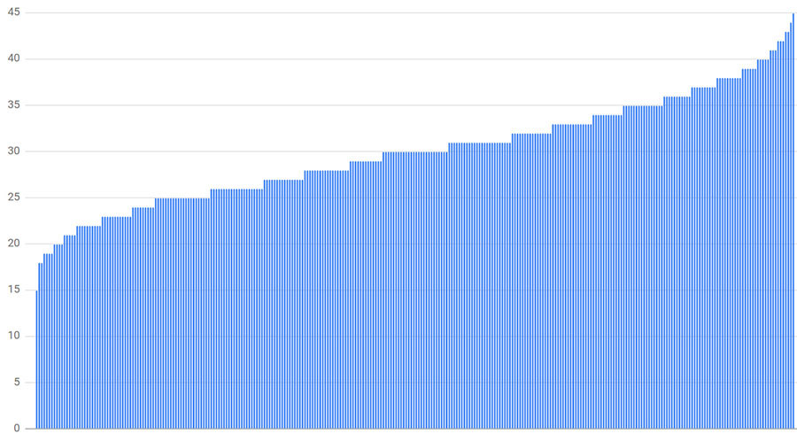
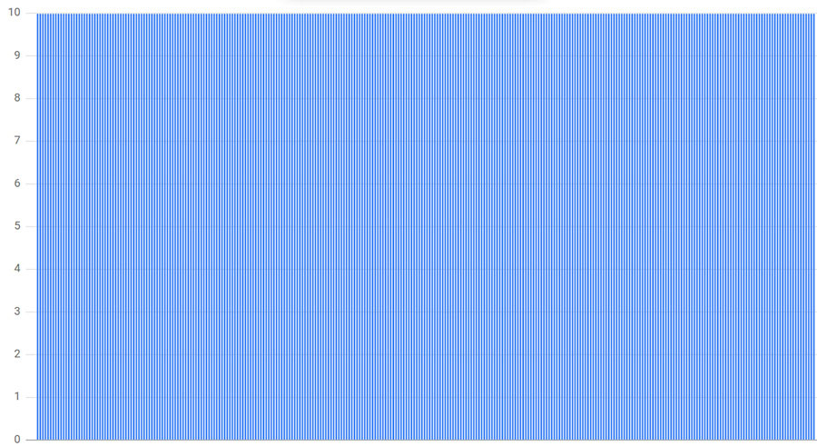
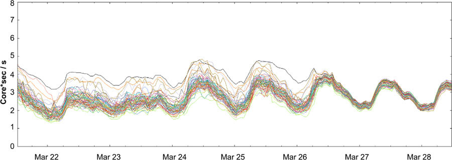

# Chương 20. Cân bằng Tải trong Datacenter (Load Balancing in the Datacenter)

> **Nguyên bản:** [Chapter 20 - Load Balancing in the Datacenter](https://sre.google/sre-book/load-balancing-datacenter/)
> **Nguồn:** Google SRE Book (O'Reilly)
> **Bản dịch tiếng Việt** (do AI hỗ trợ)

---

*Tác giả:* Alejandro Forero Cuervo
*Biên tập:* Sarah Chavis

Chương này tập trung vào cân bằng tải (load balancing) bên trong datacenter (trung tâm dữ liệu). Cụ thể, nó thảo luận các thuật toán để phân phối công việc bên trong một datacenter cho một luồng các truy vấn (query). Chúng tôi bao quát các chính sách cấp ứng dụng (application-level policies) để định tuyến các yêu cầu (request) đến các server đơn lẻ có thể xử lý chúng. Các nguyên lý mạng cấp thấp hơn (ví dụ, switch (bo mạch chuyển), định tuyến packet (gói tin)) và việc chọn datacenter nằm ngoài phạm vi của chương này.

Giả sử có một luồng truy vấn đến datacenter — có thể từ chính datacenter, từ các datacenter từ xa, hoặc một hỗn hợp của cả hai — ở một tốc độ không vượt quá tài nguyên mà datacenter có để xử lý (hoặc chỉ vượt quá trong các khoảng thời gian rất ngắn). Cũng giả sử rằng bên trong datacenter có các *dịch vụ* (services) mà những truy vấn này hướng tới. Những dịch vụ này được cài đặt dưới dạng nhiều tiến trình server đồng nhất (homogeneous), thay thế được, phần lớn chạy trên các máy khác nhau. Các dịch vụ nhỏ nhất thường có ít nhất ba tiến trình như vậy (dùng ít hơn có nghĩa là mất 50% hoặc nhiều hơn năng lực khi mất một máy đơn lẻ), còn những cái lớn nhất có thể có hơn 10.000 tiến trình (tùy thuộc vào kích thước datacenter). Trong trường hợp điển hình, các dịch vụ gồm từ 100 đến 1.000 tiến trình. Chúng tôi gọi những tiến trình này là *backend tasks* (nhiệm vụ phía sau, hoặc đơn giản là *backends*). Các task (nhiệm vụ) khác, gọi là *client tasks* (nhiệm vụ khách hàng), giữ các kết nối đến các backend task. Với mỗi truy vấn đến, một client task phải quyết định backend task nào nên xử lý nó. Các client giao tiếp với các backends bằng một giao thức cài đặt trên sự kết hợp của TCP và UDP.

Chúng tôi nên lưu ý rằng các datacenter của Google chứa một tập dịch vụ đa dạng rộng lớn, cài đặt các kết hợp khác nhau của các chính sách được thảo luận trong chương này. Ví dụ làm việc của chúng tôi, như vừa mô tả, không khớp trực tiếp với bất kỳ dịch vụ nào. Nó là một kịch bản tổng quát cho phép chúng tôi thảo luận các kỹ thuật khác nhau mà chúng tôi thấy hữu ích cho các dịch vụ khác nhau. Một số kỹ thuật có thể áp dụng được nhiều hơn (hoặc ít hơn) cho các use case (trường hợp sử dụng) cụ thể, nhưng tất cả đều được thiết kế và cài đặt bởi nhiều kỹ sư Google trong suốt nhiều năm.

Những kỹ thuật này được áp dụng ở nhiều phần của stack (tòa) của chúng tôi. Ví dụ, phần lớn các yêu cầu HTTP bên ngoài đạt đến GFE (Google Frontend), hệ thống proxy ngược HTTP của chúng tôi. GFE dùng những thuật toán này, cùng với các thuật toán được mô tả trong [Cân bằng Tải ở Frontend](https://sre.google/sre-book/load-balancing-frontend/), để định tuyến payload (bộ dữ liệu mang) và metadata (dữ liệu mô tả) của yêu cầu đến các tiến trình đơn lẻ đang chạy các ứng dụng có thể xử lý thông tin. Điều này dựa trên một cấu hình ánh xạ các mẫu URL (địa chỉ) khác nhau đến các ứng dụng đơn lẻ, mỗi ứng dụng nằm dưới sự kiểm soát của các đội khác nhau. Để tạo ra các payload phản hồi (để trả về cho GFE, rồi trả lại cho các trình duyệt), những ứng dụng này thường dùng lại chính các thuật toán đó để giao tiếp với hạ tầng hoặc các dịch vụ bổ sung mà chúng phụ thuộc. Đôi khi stack các phụ thuộc có thể tương đối sâu, đến mức một yêu cầu HTTP đến đơn lẻ có thể kích hoạt một chuỗi phụ dependence truyền dẫn (transitive chain) dài các yêu cầu phụ thuộc đến nhiều hệ thống, có thể với fan-out (sự tán ra) cao ở các điểm khác nhau.

## Trường hợp Lý tưởng (The Ideal Case)

Trong một trường hợp lý tưởng, tải cho một dịch vụ nhất định được trải ra hoàn hảo trên tất cả các backend task của nó và, tại bất kỳ thời điểm nào, backend task ít tải nhất và nhiều tải nhất tiêu thụ chính xác cùng một lượng CPU.

Chúng tôi chỉ có thể gửi traffic (lưu lượng) đến một datacenter cho đến khi task nhiều tải nhất chạm đến giới hạn năng lực của nó; điều này được mô tả trong [Hình 20-1](#hinh-20-1) cho hai kịch bản trong cùng một khoảng thời gian. Trong khoảng thời gian đó, [thuật toán cân bằng tải cross-datacenter (liên datacenter)](https://sre.google/workbook/managing-load/) phải tránh gửi thêm bất kỳ traffic nào vào datacenter, vì việc làm như vậy có nguy cơ quá tải một số task.


<a id="hinh-20-1"></a>

[Hình 20-1.](#hinh-20-1) Hai kịch bản của sự phân phối tải mỗi task theo thời gian.

Như đồ thị bên trái trong [Hình 20-2](#hinh-20-2) cho thấy, một lượng năng lực đáng kể bị lãng phí: phần năng lực rảnh của mọi task ngoại trừ task nhiều tải nhất.


<a id="hinh-20-2"></a>

[Hình 20-2.](#hinh-20-2) Histogram (đồ thị phân bố tần số) của CPU được sử dụng và lãng phí trong hai kịch bản.

Chính xác hơn, hãy cho *CPU[i]* là tốc độ CPU mà task *i* tiêu thụ tại một thời điểm, và giả sử task 0 là task nhiều tải nhất. Khi đó, trong trường hợp có sự trải rộng (spread) lớn, chúng tôi đang lãng phí tổng các chênh lệch CPU của bất kỳ task nào so với *CPU[0]*: tức là, tổng trên tất cả các task *i* của *(CPU[0] – CPU[i])* sẽ bị lãng phí. Ở đây, "lãng phí" có nghĩa là đã được đặt trước (reserved) nhưng không được sử dụng.

Ví dụ này minh họa cách các thực hành cân bằng tải trong-datacenter kém cỏi làm giới hạn nhân tạo tính khả dụng của tài nguyên: bạn có thể đặt trước 1.000 CPUs cho dịch vụ của mình trong một datacenter, nhưng không thể thực sự sử dụng nhiều hơn, ví dụ, 700 CPUs.

## Xác định các Task Xấu: Flow Control (Kiểm soát Luồng) và Lame Ducks (Vịt què) (Identifying Bad Tasks: Flow Control and Lame Ducks)

Trước khi có thể quyết định backend task nào nên nhận một yêu cầu client, chúng tôi cần xác định — và tránh — các task không khỏe mạnh (unhealthy) trong bể backend.

## Một Cách tiếp cận Đơn giản cho các Task Không khỏe mạnh: Flow Control (A Simple Approach to Unhealthy Tasks: Flow Control)

Giả sử các client task của chúng tôi theo dõi số lượng yêu cầu đang hoạt động (active) mà chúng đã gửi trên mỗi kết nối đến một backend task. Khi số đếm yêu cầu đang hoạt động này chạm đến một giới hạn được cấu hình, client coi backend đó là không khỏe mạnh và ngừng gửi yêu cầu cho nó. Đối với phần lớn các backends, 100 là một giới hạn hợp lý; trong trường hợp trung bình, các yêu cầu có xu hướng kết thúc đủ nhanh để rất hiếm khi số yêu cầu đang hoạt động từ một client nhất định đạt đến giới hạn này trong điều kiện vận hành bình thường. Hình thức (rất cơ bản!) của flow control này cũng đóng vai trò như một dạng cân bằng tải đơn giản: nếu một backend task nhất định trở nên quá tải và các yêu cầu bắt đầu xếp hàng, các client sẽ tránh backend đó, và khối lượng công việc trải ra một cách tự nhiên giữa các backend task khác.

Thật không may, cách tiếp cận rất đơn giản này chỉ bảo vệ các backend task chống lại những dạng quá tải rất cực đoan, và các backends rất dễ trở nên quá tải trước khi giới hạn này kịp được chạm đến. Điều ngược lại cũng đúng: trong một số trường hợp, các client có thể chạm đến giới hạn này khi các backend của chúng vẫn còn rất nhiều tài nguyên dự phòng. Ví dụ, một số backends có thể có các yêu cầu sống rất dài (very long-lived) khiến chúng không thể phản hồi nhanh. Chúng tôi đã thấy những trường hợp mà giới hạn mặc định này lại phản tác dụng, khiến tất cả các backend task trở nên không thể truy cập, với các yêu cầu bị chặn trong các client cho đến khi hết thời gian (time out) và thất bại. Việc tăng giới hạn yêu cầu đang hoạt động có thể tránh tình huống này, nhưng không giải quyết được vấn đề cơ bản là làm thế nào để biết một task thực sự không khỏe mạnh hay chỉ đơn giản là phản hồi chậm.

## Một Cách tiếp cận Vững chắc cho các Task Không khỏe mạnh: Trạng thái Lame Duck (A Robust Approach to Unhealthy Tasks: Lame Duck State)

Từ quan điểm của client, một backend task có thể ở trong một trong các trạng thái sau:

#### Khỏe mạnh (Healthy)

Backend task đã khởi tạo đúng và đang xử lý các yêu cầu.

#### Từ chối kết nối (Refusing connections)

Backend task không phản hồi. Điều này có thể xảy ra vì task đang khởi động hoặc tắt, hoặc vì backend ở trong một trạng thái bất thường (dù hiếm khi một backend ngừng nghe (listen) trên port (cổng) của nó nếu không đang tắt).

#### Vịt què (Lame duck)

Backend task đang nghe trên port của nó và có thể phục vụ, nhưng đang yêu cầu một cách rõ ràng các client ngừng gửi các yêu cầu.

Khi một task chuyển sang trạng thái vịt què, nó phát sóng (broadcast) điều đó đến tất cả các client đang hoạt động của nó. Còn các client không hoạt động thì sao? Với cài đặt RPC (Remote Procedure Call — lời gọi thủ tục từ xa) của Google, các client không hoạt động (tức là các client không có kết nối TCP đang hoạt động) vẫn gửi các kiểm tra sức khỏe UDP định kỳ. Kết quả là thông tin vịt què được lan truyền nhanh chóng đến tất cả các client — thường chỉ trong 1 hoặc 2 RTT (thời gian đi-và-đến) — bất kể trạng thái hiện tại của chúng.

Lợi ích chính của việc cho phép một task tồn tại trong trạng thái vịt què bán-vận hành là nó đơn giản hóa việc tắt sạch (clean shutdown), từ đó tránh việc trả về lỗi cho tất cả các yêu cầu xui xẻo đang hoạt động trên các backend task đang tắt. Việc hạ một backend task có các yêu cầu đang hoạt động mà không phục vụ bất kỳ lỗi nào tạo thuận lợi cho việc push code (đẩy mã), các hoạt động bảo trì, hoặc các sự cố máy có thể đòi hỏi khởi động lại tất cả các task liên quan. Một quá trình tắt như vậy sẽ đi qua các bước tổng quát sau:

1.  Trình lên lịch job (nhiệm vụ) gửi một tín hiệu SIGTERM đến backend task.
2.  Backend task chuyển sang trạng thái vịt què và yêu cầu các client của nó gửi các yêu cầu mới đến các backend task khác. Điều này được thực hiện thông qua một lời gọi API trong cài đặt RPC, được gọi một cách rõ ràng trong bộ xử lý SIGTERM (SIGTERM handler).
3.  Bất kỳ yêu cầu nào đang diễn ra, được bắt đầu trước khi backend task vào trạng thái vịt què (hoặc sau khi nó vào trạng thái đó nhưng trước khi một client phát hiện), đều được thực thi bình thường.
4.  Khi các phản hồi chảy ngược về các client, số lượng yêu cầu đang hoạt động cho backend dần dần giảm về zero.
5.  Sau một khoảng thời gian được cấu hình, backend task hoặc thoát sạch hoặc bị trình lên lịch job giết (kill). Khoảng thời gian nên đủ lớn để tất cả các yêu cầu điển hình có đủ thời gian kết thúc. Giá trị này phụ thuộc vào dịch vụ, nhưng một quy tắc ngón tay cái tốt là từ 10s đến 150s tùy theo độ phức tạp của client.

Chiến lược này cũng cho phép một client thiết lập các kết nối đến các backend task trong khi các task đó đang thực hiện các thủ tục khởi tạo có thể kéo dài (và do đó chưa sẵn sàng bắt đầu phục vụ). Các backend task có thể thay vào đó bắt đầu nghe các kết nối chỉ khi chúng sẵn sàng phục vụ, nhưng việc làm như vậy sẽ trì hoãn việc đàm phán kết nối một cách không cần thiết. Ngay khi backend task sẵn sàng bắt đầu phục vụ, nó gửi tín hiệu rõ ràng cho các client.

## Giới hạn Bể Kết nối bằng Subsetting (Phân tập) (Limiting the Connections Pool with Subsetting)

Ngoài việc quản lý sức khỏe, một cân nhắc khác cho cân bằng tải là *subsetting*: giới hạn bể các backend task tiềm tàng mà một client task tương tác.

Mỗi client trong hệ thống RPC của chúng tôi duy trì một bể các kết nối sống dài đến các backend của nó để gửi các yêu cầu mới. Những kết nối này thường được thiết lập sớm khi client khởi động và thường tiếp tục mở, với các yêu cầu chảy qua chúng, cho đến khi client kết thúc. Một mô hình thay thế là thiết lập và tháo gỡ một kết nối cho mỗi yêu cầu, nhưng mô hình này có chi phí tài nguyên và độ trễ đáng kể. Trong trường hợp góc (corner case) mà một kết nối vẫn rảnh trong một thời gian dài, cài đặt RPC của chúng tôi có một tối ưu hóa chuyển kết nối sang một chế độ "không hoạt động" rẻ hơn, trong đó, ví dụ, tần suất kiểm tra sức khỏe được giảm và kết nối TCP cơ bản bị hủy bỏ để nhường chỗ cho UDP.

Mỗi kết nối đòi hỏi một số bộ nhớ và CPU (do việc kiểm tra sức khỏe định kỳ) ở cả hai đầu. Trong khi overhead (chi phí phụ) này nhỏ về mặt lý thuyết, nó có thể nhanh chóng trở nên đáng kể khi tích lũy xuyên suốt nhiều máy. Subsetting tránh tình huống một client kết nối đến một số lượng rất lớn các backend task, hoặc một backend task nhận kết nối từ một số lượng rất lớn các client task. Trong cả hai trường hợp, bạn có thể lãng phí rất nhiều tài nguyên cho lợi ích rất ít.

## Chọn Tập phù hợp (Picking the Right Subset)

Việc chọn đúng tập (subset) rút gọn về việc chọn bao nhiêu backend task mà mỗi client kết nối đến — kích thước tập (subset size) — và thuật toán chọn. Chúng tôi thường dùng một kích thước tập từ 20 đến 100 backend task, nhưng kích thước tập "đúng" cho một hệ thống phụ thuộc mạnh mẽ vào hành vi điển hình của dịch vụ bạn. Ví dụ, bạn có thể muốn dùng một kích thước tập lớn hơn nếu:

-   Số lượng client đáng kể nhỏ hơn số lượng backends. Trong trường hợp này, bạn muốn số lượng backends mỗi client đủ lớn để tránh việc có các backend task không bao giờ nhận bất kỳ traffic nào.
-   Có sự mất cân bằng tải thường xuyên giữa các job client (tức là một client task gửi nhiều yêu cầu hơn những cái khác). Kịch bản này điển hình trong các tình huống mà các client thỉnh thoảng gửi các đợt (bursts) yêu cầu. Trong trường hợp này, chính các client nhận yêu cầu từ các client khác đôi khi có fan-out lớn (ví dụ, "đọc tất cả thông tin của tất cả những người theo dõi của một user nhất định"). Vì một đợt yêu cầu sẽ tập trung vào tập được gán cho client, bạn cần một kích thước tập lớn hơn để đảm bảo tải được trải đều trên một tập lớn hơn các backend task khả dụng.

Một khi kích thước tập được xác định, chúng tôi cần một thuật toán để định nghĩa tập các backend task mà mỗi client task sẽ dùng. Điều này có thể tưởng chừng là một tác vụ đơn giản, nhưng nó nhanh chóng trở nên phức tạp khi làm việc với các hệ thống quy mô lớn, nơi việc provision (cấp phát) hiệu quả là thiết yếu và các lần khởi động lại hệ thống là điều chắc chắn xảy ra.

Thuật toán chọn cho các client nên gán các backend một cách đồng đều để tối ưu hóa việc provision tài nguyên. Ví dụ, nếu [subsetting làm quá tải](https://sre.google/sre-book/load-balancing-datacenter/) một backend bằng 10%, toàn bộ tập các backends cần được provision vượt (overprovisioned) bằng 10%. Thuật toán cũng nên xử lý các lần khởi động lại và sự cố một cách êm ả, vững chắc bằng cách tiếp tục tải các backend đồng đều nhất có thể trong khi tối thiểu hóa sự churn (sự thay đổi). Ở đây, "churn" liên quan đến việc chọn lại backend thay thế. Ví dụ, khi một backend task trở nên không khả dụng, các client của nó có thể cần tạm thời chọn một backend thay thế. Khi một backend thay thế được chọn, các client phải tạo các kết nối TCP mới (và nhiều khả năng thực hiện đàm phán cấp ứng dụng), tạo ra một overhead bổ sung. Tương tự, khi một client task khởi động lại, nó cần mở lại các kết nối đến tất cả các backend của mình.

Thuật toán cũng nên xử lý các lần thay đổi kích thước (resize) trong số lượng client và/hoặc số lượng backend, với sự churn kết nối tối thiểu và không cần biết trước các con số đó. Tính năng này đặc biệt quan trọng (và khó khăn) khi toàn bộ tập client hoặc backend task được khởi động lại lần lượt một (ví dụ, để push một phiên bản mới). Khi các backend được push, chúng tôi muốn các client tiếp tục phục vụ một cách trong suốt, với sự churn kết nối ít nhất có thể.

## Một Thuật toán Chọn Tập: Random Subsetting (Phân tập Ngẫu nhiên) (A Subset Selection Algorithm: Random Subsetting)

Một cài đặt ngây thơ (naive) của một thuật toán chọn tập có thể cho mỗi client xáo trộn (shuffle) danh sách các backends một lần, rồi lấp đầy tập của nó bằng cách chọn các backend có thể phân giải/khỏe mạnh từ danh sách. Việc xáo trộn một lần rồi chọn các backend từ đầu danh sách xử lý các lần khởi động lại và sự cố một cách vững chắc (ví dụ, với sự churn tương đối ít) vì nó loại trừ rõ ràng chúng khỏi việc xem xét. Tuy nhiên, chúng tôi nhận thấy rằng chiến lược này thực tế hoạt động rất kém trong hầu hết các kịch bản vì nó trải tải rất không đều.

Trong công việc ban đầu về cân bằng tải, chúng tôi đã cài đặt random subsetting và tính toán tải dự kiến cho các trường hợp khác nhau. Như một ví dụ, hãy cân nhắc:

-   300 clients
-   300 backends
-   Một kích thước tập 30% (mỗi client kết nối đến 90 backends)

Như [Hình 20-3](#hinh-20-3) cho thấy, backend ít tải nhất chỉ có 63% tải trung bình (57 kết nối, trong khi trung bình là 90 kết nối) và backend nhiều tải nhất có 121% (109 kết nối). Trong phần lớn các trường hợp, một kích thước tập 30% đã lớn hơn mức chúng tôi muốn dùng trong thực tế. Phân phối tải được tính thay đổi mỗi lần chạy mô phỏng, trong khi mẫu chung vẫn giữ nguyên.


<a id="hinh-20-3"></a>

[Hình 20-3.](#hinh-20-3) Phân phối kết nối với 300 clients, 300 backends, và một kích thước tập 30%.

Thật không may, các kích thước tập nhỏ hơn dẫn đến sự mất cân bằng còn tồi tệ hơn. Ví dụ, [Hình 20-4](#hinh-20-4) mô tả kết quả nếu kích thước tập được giảm xuống 10% (30 backend mỗi client). Trong trường hợp này, backend ít tải nhất nhận 50% tải trung bình (15 kết nối) và backend nhiều tải nhất nhận 150% (45 kết nối).


<a id="hinh-20-4"></a>

[Hình 20-4.](#hinh-20-4) Phân phối kết nối với 300 clients, 300 backends, và một kích thước tập 10%.

Chúng tôi kết luận rằng để random subsetting trải tải tương đối đều trên tất cả các task khả dụng, chúng tôi sẽ cần các kích thước tập lớn đến 75%. Một tập lớn như vậy đơn giản là không thực tế; phương sai (variance) trong số lượng client kết nối đến một task chỉ quá lớn để có thể coi random subsetting là một chính sách chọn tập tốt ở quy mô.

## Một Thuật toán Chọn Tập: Deterministic Subsetting (Phân tập Xác định) (A Subset Selection Algorithm: Deterministic Subsetting)

Giải pháp của Google cho các giới hạn của random subsetting là phân tập *xác định* (deterministic). Code sau đây cài đặt thuật toán này, được mô tả chi tiết bên dưới:

```python
def Subset(backends, client_id, subset_size):
  subset_count = len(backends) / subset_size

  # Group clients into rounds; each round uses the same shuffled list:
  round = client_id / subset_count
  random.seed(round)
  random.shuffle(backends)

  # The subset id corresponding to the current client:
  subset_id = client_id % subset_count

  start = subset_id * subset_size
  return backends[start:start + subset_size]
```

Chúng tôi chia các *client* task thành các "rounds" (vòng), trong đó `round i` bao gồm `subset_count` client task liên tiếp, bắt đầu từ task `subset_count × i`, và `subset_count` là số lượng các tập (tức là số lượng backend task chia cho kích thước tập mong muốn). Trong mỗi vòng, mỗi backend được gán cho chính xác một client (trừ có thể là vòng cuối cùng, có thể không chứa đủ client, nên một số backend có thể không được gán).

Ví dụ, nếu chúng tôi có 12 backend task [0, 11] và một kích thước tập mong muốn là 3, chúng tôi sẽ có các vòng chứa 4 client mỗi (`subset_count = 12/3`). Nếu chúng tôi có 10 client, thuật toán trước đó có thể tạo ra *shuffled_backends* (backends đã xáo trộn) như sau:

-   Round 0: [0, 6, 3, 5, 1, 7, 11, 9, 2, 4, 8, 10]
-   Round 1: [8, 11, 4, 0, 5, 6, 10, 3, 2, 7, 9, 1]
-   Round 2: [8, 3, 7, 2, 1, 4, 9, 10, 6, 5, 0, 11]

Điểm chính cần chú ý là mỗi vòng chỉ gán mỗi backend trong toàn bộ danh sách cho đúng một client (ngoại trừ vòng cuối, nơi mà chúng tôi đã hết client). Trong ví dụ này, mọi backend được gán cho chính xác hai hoặc ba client.

Danh sách nên được xáo trộn; nếu không, các client sẽ được gán một nhóm các backend task liên tiếp, và nhóm đó có thể tất cả trở nên tạm thời không khả dụng (ví dụ, vì backend job đang được cập nhật dần dần theo thứ tự, từ task đầu tiên đến task cuối cùng). Các vòng khác nhau dùng một hạt (seed) xáo trộn khác nhau. Nếu không, khi một backend thất bại, tải mà nó đang nhận chỉ được trải trên các backend còn lại *trong tập của nó*. Nếu các backend khác trong tập cũng thất bại, hiệu ứng cộng dồn và tình hình có thể nhanh chóng tồi tệ đi đáng kể: nếu `N` backend trong một tập bị xuống, tải tương ứng của chúng được trải trên (`subset_size - N`) backend còn lại. Một cách tiếp cận tốt hơn nhiều là trải tải này trên tất cả các backend còn lại bằng cách dùng một sự xáo trộn khác cho mỗi vòng.

Khi chúng tôi dùng một sự xáo trộn khác cho mỗi vòng, các client trong cùng một vòng sẽ bắt đầu với cùng một danh sách đã xáo trộn, nhưng các client xuyên suốt các vòng sẽ có các danh sách đã xáo trộn khác nhau. Từ đây, thuật toán xây dựng các *định nghĩa* tập dựa trên danh sách backends đã xáo trộn và kích thước tập mong muốn. Ví dụ:

-   `Subset[0]` = `shuffled_backends[0]` đến `shuffled_backends[2]`
-   `Subset[1]` = `shuffled_backends[3]` đến `shuffled_backends[5]`
-   `Subset[2]` = `shuffled_backends[6]` đến `shuffled_backends[8]`
-   `Subset[3]` = `shuffled_backends[9]` đến `shuffled_backends[11]`

trong đó `shuffled_backends` là danh sách đã xáo trộn được tạo ra bởi mỗi client. Để gán một tập cho một client task, chúng tôi đơn giản lấy tập tương ứng với vị trí của nó trong vòng (ví dụ, `(i % 4)` cho `client[i]` với bốn tập):

-   `client[0]`, `client[4]`, `client[8]` sẽ sử dụng `subset[0]`
-   `client[1]`, `client[5]`, `client[9]` sẽ sử dụng `subset[1]`
-   `client[2]`, `client[6]`, `client[10]` sẽ sử dụng `subset[2]`
-   `client[3]`, `client[7]`, `client[11]` sẽ sử dụng `subset[3]`

Vì các client xuyên suốt các vòng sẽ dùng một giá trị khác cho `shuffled_backends` (và do đó cho `subset`), còn các client trong cùng vòng dùng các tập khác nhau, tải kết nối được trải một cách đồng đều. Trong các trường hợp tổng số backend không chia hết cho kích thước tập mong muốn, chúng tôi cho phép một số tập hơi lớn hơn những tập khác, nhưng trong phần lớn các trường hợp, số lượng client được gán cho một backend chỉ khác nhau nhiều nhất là 1.

Như [Hình 20-5](#hinh-20-5) cho thấy, sự phân phối cho ví dụ trước đó của 300 client, mỗi cái kết nối đến 10 trong số 300 backends, tạo ra kết quả rất tốt: mỗi backend nhận chính xác cùng một số lượng kết nối.


<a id="hinh-20-5"></a>

[Hình 20-5.](#hinh-20-5) Phân phối kết nối với 300 clients và deterministic subsetting đến 10 của 300 backends.

## Các Chính sách Cân bằng Tải (Load Balancing Policies)

Bây giờ khi đã thiết lập nền tảng cho cách một client task duy trì một tập các kết nối được biết là khỏe mạnh, hãy xem xét *các chính sách cân bằng tải*. Đây là các cơ chế mà các client task sử dụng để chọn backend task nào trong tập của mình nhận một yêu cầu client. Nhiều sự phức tạp trong các chính sách cân bằng tải bắt nguồn từ bản chất phân tán của quá trình ra quyết định: các client phải quyết định, trong thời gian thực (và chỉ với thông tin trạng thái backend một phần và/hoặc cũ), backend nào nên được dùng cho mỗi yêu cầu.

Các chính sách cân bằng tải có thể rất đơn giản và không tính đến bất kỳ thông tin nào về trạng thái của các backend (ví dụ, *Round Robin* — Vòng quay), hoặc có thể vận hành với nhiều thông tin hơn về các backend (ví dụ, *Least-Loaded Round Robin* — Vòng quay ít tải nhất, hoặc *Weighted Round Robin* — Vòng quay có trọng số).

## Round Robin Đơn giản (Simple Round Robin)

Một cách tiếp cận rất đơn giản cho [cân bằng tải](https://sre.google/sre-book/handling-overload/) là cho mỗi client gửi các yêu cầu theo kiểu vòng quay đến từng backend task trong tập của nó mà nó có thể kết nối thành công và không ở trạng thái vịt què. Trong nhiều năm, đây là cách tiếp cận phổ biến nhất của chúng tôi, và nó vẫn được nhiều dịch vụ sử dụng.

Thật không may, trong khi Round Robin có lợi thế là rất đơn giản và thực hiện đáng kể tốt hơn so với việc chọn các backend task ngẫu nhiên, kết quả của chính sách này có thể rất kém. Dù các con số thực tế phụ thuộc vào nhiều yếu tố như chi phí truy vấn thay đổi và sự đa dạng máy, chúng tôi nhận thấy rằng Round Robin có thể dẫn đến một sự trải rộng lên đến 2 lần trong mức tiêu thụ CPU giữa task ít tải nhất và task nhiều tải nhất. Một sự trải rộng như vậy cực kỳ lãng phí và xảy ra vì một số lý do, bao gồm:

-   Subsetting nhỏ
-   Chi phí truy vấn thay đổi
-   Sự đa dạng máy
-   Các yếu tố hiệu năng không thể dự đoán

## Subsetting nhỏ (Small subsetting)

Một trong những lý do đơn giản nhất khiến Round Robin phân phối tải kém là không phải tất cả các client của nó đều phát ra yêu cầu ở cùng tốc độ. Tốc độ yêu cầu khác nhau giữa các client đặc biệt dễ xảy ra khi các tiến trình khác biệt rất nhiều cùng chia sẻ các backend. Trong trường hợp này, và đặc biệt nếu bạn đang dùng các kích thước tập tương đối nhỏ, các backend trong tập của các client tạo ra nhiều traffic nhất sẽ tự nhiên có xu hướng nhiều tải hơn.

## Chi phí truy vấn thay đổi (Varying query costs)

Nhiều dịch vụ xử lý các yêu cầu đòi hỏi lượng tài nguyên xử lý khác nhau rất lớn. Trong thực tế, chúng tôi nhận thấy rằng ngữ nghĩa của nhiều dịch vụ trong Google đến mức các yêu cầu đắt tiền nhất tiêu thụ 1000 lần (hoặc nhiều hơn) CPU so với các yêu cầu rẻ nhất. Cân bằng tải bằng Round Robin còn khó khăn hơn khi chi phí truy vấn không thể dự đoán trước. Ví dụ, một truy vấn như "trả về tất cả các email nhận được bởi user XYZ trong ngày qua" có thể rất rẻ (nếu user nhận ít email trong ngày) hoặc cực kỳ đắt tiền.

Cân bằng tải trong một hệ thống có sự chênh lệch lớn về chi phí truy vấn tiềm tàng là một vấn đề rất khó khăn. Đôi khi cần điều chỉnh các giao diện (interfaces) dịch vụ để giới hạn lượng công việc thực hiện mỗi yêu cầu. Ví dụ, trong trường hợp truy vấn email được mô tả trước đó, bạn có thể giới thiệu một giao diện phân trang (pagination) và thay đổi ngữ nghĩa yêu cầu thành "trả về 100 email gần đây nhất (hoặc ít hơn) nhận được bởi user XYZ trong ngày qua." Thật không may, thường khó khăn để giới thiệu những thay đổi ngữ nghĩa như vậy. Không chỉ điều này đòi hỏi thay đổi trong tất cả các client code, mà nó còn kéo theo các cân nhắc về tính nhất quán (consistency) bổ sung. Ví dụ, user có thể đang nhận email mới hoặc xóa email trong khi client đang lấy email từng trang. Với use case này, một client ngây thơ lặp đi lặp lại qua các kết quả và nối các phản hồi (thay vì phân trang dựa trên một tầm nhìn cố định của dữ liệu) nhiều khả năng tạo ra một tầm nhìn không nhất quán, lặp lại một số thông điệp và/hoặc bỏ qua những thông điệp khác.

Để giữ các giao diện (và cài đặt của chúng) đơn giản, các dịch vụ thường được định nghĩa sao cho các yêu cầu đắt tiền nhất được phép tiêu thụ 100, 1.000, hoặc thậm chí 10.000 lần nhiều tài nguyên hơn so với các yêu cầu rẻ nhất. Tuy nhiên, việc các yêu cầu có mức tiêu thụ tài nguyên thay đổi theo mỗi yêu cầu đồng nghĩa với việc một số backend task sẽ xui xẻo và thỉnh thoảng nhận nhiều yêu cầu đắt tiền hơn những task khác. Mức độ tình huống này ảnh hưởng đến cân bằng tải phụ thuộc vào việc các yêu cầu đắt tiền nhất đắt đến mức nào. Ví dụ, cho một trong những backends Java của chúng tôi, các truy vấn tiêu thụ trung bình khoảng 15 ms CPU, nhưng một số truy vấn có thể dễ dàng đòi hỏi lên đến 10 giây. Mỗi task trong backend này đặt trước nhiều CPU core (nhân), điều này giúp giảm độ trễ bằng cách cho phép một số phép tính diễn ra song song. Nhưng bất chấp những core đặt trước này, khi một backend nhận một trong những truy vấn lớn, tải của nó tăng đáng kể trong vài giây. Một task hoạt động kém có thể hết bộ nhớ hoặc thậm chí ngừng phản hồi hoàn toàn (ví dụ, do memory thrashing — dao động bộ nhớ), nhưng ngay cả trong trường hợp bình thường (tức là backend có đủ tài nguyên và tải của nó trở lại bình thường một khi truy vấn lớn hoàn thành), độ trễ của các yêu cầu khác vẫn bị ảnh hưởng do sự cạnh tranh tài nguyên với yêu cầu đắt tiền.

## Sự đa dạng máy (Machine diversity)

Một thách thức khác cho Simple Round Robin là thực tế rằng không phải tất cả các máy trong cùng một datacenter nhất thiết giống nhau. Một datacenter có thể có các máy với các CPU hiệu năng khác nhau, và do đó, cùng một yêu cầu có thể đại diện cho lượng công việc khác nhau đáng kể trên các máy khác nhau.

Việc ứng phó với sự đa dạng máy — mà *không* đòi hỏi sự đồng nhất nghiêm ngặt — là một thách thức trong nhiều năm tại Google. Về mặt lý thuyết, giải pháp cho việc làm việc với năng lực tài nguyên dị thể (heterogeneous) trong một hạm đội (fleet) là đơn giản: scale các đặt trước CPU tùy theo loại trình xử lý/máy. Tuy nhiên, trong thực tế, việc triển khai giải pháp này đòi hỏi nỗ lực đáng kể, vì nó yêu cầu trình lên lịch job của chúng tôi phải tính đến các mức tương đương tài nguyên dựa trên hiệu năng máy trung bình qua việc lấy mẫu các dịch vụ. Ví dụ, 2 đơn vị CPU trong máy X (một máy "chậm") tương đương với 0,8 đơn vị CPU trong máy Y (một máy "nhanh"). Với thông tin này, trình lên lịch job sau đó được yêu cầu điều chỉnh các đặt trước CPU cho một tiến trình dựa trên hệ số tương đương và loại máy mà tiến trình được lên lịch. Để giảm nhẹ độ phức tạp này, chúng tôi đã tạo ra một đơn vị ảo cho tốc độ CPU gọi là "GCU" (Google Compute Units — Đơn vị Tính toán Google). GCU trở thành tiêu chuẩn để mô hình hóa tốc độ CPU, và được dùng để duy trì một ánh xạ từ mỗi kiến trúc CPU trong các datacenter của chúng tôi đến GCU tương ứng dựa trên hiệu năng của nó.

## Các yếu tố hiệu năng không thể dự đoán (Unpredictable performance factors)

Có lẽ yếu tố gây phức tạp lớn nhất cho Simple Round Robin là các máy — hoặc, chính xác hơn, hiệu năng của các backend task — có thể khác nhau rất lớn do một số khía cạnh *không thể dự đoán*, thứ không thể được tính đến một cách tĩnh.

Hai trong số nhiều yếu tố không thể dự đoán góp phần vào hiệu năng bao gồm:

#### Các hàng xóm đối kháng (Antagonistic neighbors)

Các tiến trình khác (thường hoàn toàn không liên quan và được chạy bởi các đội khác) có thể có tác động đáng kể đến hiệu năng của các tiến trình của bạn. Chúng tôi đã thấy sự khác biệt về hiệu năng theo cách này lên đến 20%. Sự khác biệt này phần lớn bắt nguồn từ sự cạnh tranh cho các tài nguyên chia sẻ, như không gian trong memory cache (bộ đệm bộ nhớ) hoặc băng thông, theo những cách có thể không trực tiếp và rõ ràng. Ví dụ, nếu độ trễ của các yêu cầu đến từ một backend task tăng (do cạnh tranh tài nguyên mạng với một hàng xóm đối kháng), số lượng yêu cầu đang hoạt động cũng sẽ tăng, điều này có thể kích hoạt việc thu gom rác (garbage collection) nhiều hơn.

#### Các lần khởi động lại task (Task restarts)

Khi một task được khởi động lại, nó thường đòi hỏi nhiều tài nguyên hơn đáng kể trong vài phút. Chỉ lấy một ví dụ, chúng tôi đã thấy điều kiện này ảnh hưởng đến các nền tảng như Java (tối ưu hóa code động) nhiều hơn những nền tảng khác. Để ứng phó, chúng tôi thực sự đã thêm vào logic của một số server code — chúng tôi giữ các server trong trạng thái vịt què và làm ấm chúng trước (prewarm, kích hoạt các tối ưu hóa này) trong một khoảng thời gian sau khi khởi động, cho đến khi hiệu năng của chúng đạt mức danh nghĩa. Hiệu ứng của các lần khởi động lại task có thể trở thành một vấn đề đáng kể, đặc biệt khi cân nhắc rằng chúng tôi cập nhật nhiều server (ví dụ, push các build mới, đòi hỏi khởi động lại những task này) mỗi ngày.

Nếu chính sách cân bằng tải của bạn không thể thích nghi với các hạn chế hiệu năng không lường trước, bạn sẽ về cơ bản kết thúc với một sự phân phối tải không tối ưu khi vận hành ở quy mô.

## Least-Loaded Round Robin (Vòng quay ít tải nhất) (Least-Loaded Round Robin)

Một cách tiếp cận thay thế cho Simple Round Robin là cho mỗi client task theo dõi số lượng yêu cầu đang hoạt động mà nó có đến mỗi backend task trong tập của nó, rồi sử dụng Round Robin *trong số tập các task có số lượng yêu cầu đang hoạt động nhỏ nhất*.

Ví dụ, giả sử một client dùng một tập các backend task *t0* đến *t9*, và hiện tại có số lượng yêu cầu đang hoạt động sau đây cho mỗi backend:

**t0** | **t1** | **t2** | **t3** | **t4** | **t5** | **t6** | **t7** | **t8** | **t9**
---|---|---|---|---|---|---|---|---|---
`2` | `1` | `0` | `0` | `1` | `0` | `2` | `0` | `0` | `1`

Với một yêu cầu mới, client sẽ lọc danh sách các backend task tiềm tàng xuống chỉ còn những task có ít kết nối nhất (*t2*, *t3*, *t5*, *t7*, và *t8*), rồi chọn một backend từ danh sách đó. Giả sử nó chọn *t2*. Bảng trạng thái kết nối của client lúc này sẽ trông như sau:

**t0** | **t1** | **t2** | **t3** | **t4** | **t5** | **t6** | **t7** | **t8** | **t9**
---|---|---|---|---|---|---|---|---|---
`2` | `1` | `1` | `0` | `1` | `0` | `2` | `0` | `0` | `1`

Giả sử không có yêu cầu hiện tại nào đã hoàn thành, ở yêu cầu tiếp theo, bể ứng viên backend trở thành *t3*, *t5*, *t7*, và *t8*.

Hãy tua nhanh đến khi chúng tôi đã phát ra bốn yêu cầu mới. Vẫn giả sử không có yêu cầu nào kết thúc trong khoảng thời gian đó, bảng trạng thái kết nối sẽ trông như sau:

**t0** | **t1** | **t2** | **t3** | **t4** | **t5** | **t6** | **t7** | **t8** | **t9**
---|---|---|---|---|---|---|---|---|---
`2` | `1` | `1` | `1` | `1` | `1` | `2` | `1` | `1` | `1`

Tại thời điểm này, tập các ứng viên backend là tất cả các task trừ *t0* và *t6*. Tuy nhiên, nếu yêu cầu dành cho task *t4* kết thúc, trạng thái hiện tại của nó trở thành "0 yêu cầu đang hoạt động" và một yêu cầu mới sẽ được gán cho *t4*.

Cài đặt này thực sự dùng Round Robin, nhưng nó được áp dụng xuyên suốt tập các task có số yêu cầu đang hoạt động nhỏ nhất. Không có sự lọc như vậy, chính sách có thể không trải các yêu cầu đủ tốt để tránh tình huống một phần các backend task khả dụng không được sử dụng. Ý tưởng đằng sau chính sách ít tải nhất là các task nhiều tải có xu hướng có độ trễ cao hơn so với những task còn năng lực dự phòng, và chiến lược này sẽ tự nhiên lấy tải khỏi những task nhiều tải đó.

Tất cả những gì đã nói, chúng tôi đã học (theo cách khó khăn!) về một cạm bẫy rất nguy hiểm của cách tiếp cận Least-Loaded Round Robin: nếu một task thực sự không khỏe mạnh, nó có thể bắt đầu phục vụ 100% là lỗi. Tùy thuộc vào bản chất của những lỗi đó, chúng có thể có độ trễ rất thấp; việc đơn giản trả về một lỗi "tôi không khỏe mạnh!" thường nhanh hơn đáng kể so với việc thực sự xử lý một yêu cầu. Kết quả là, các client có thể bắt đầu gửi một lượng traffic rất lớn đến task không khỏe mạnh, nhầm lẫn cho rằng task khả dụng, thay vì làm thất bại các yêu cầu đó nhanh chóng (fast-fail)! Chúng tôi nói rằng task không khỏe mạnh lúc này đang *sinkholing* (bắt bẫy) traffic. May mắn thay, cạm bẫy này có thể được giải quyết tương đối dễ dàng bằng cách sửa đổi chính sách để đếm các lỗi gần đây như thể chúng là các yêu cầu đang hoạt động. Bằng cách này, nếu một backend task trở nên không khỏe mạnh, chính sách cân bằng tải sẽ bắt đầu chuyển tải khỏi nó, giống như cách nó chuyển tải khỏi một task bị quá gánh.

Least-Loaded Round Robin có hai giới hạn quan trọng:

**Số đếm các yêu cầu đang hoạt động có thể không phải là một đại lý (proxy) rất tốt cho khả năng của một backend nhất định**

Nhiều yêu cầu dành phần đáng kể thời gian sống của chúng chỉ để chờ phản hồi từ mạng (tức là chờ các phản hồi cho các yêu cầu mà chúng khởi tạo đến các backend khác) và rất ít thời gian cho việc xử lý thực. Ví dụ, một backend task có thể xử lý gấp đôi số yêu cầu so với một task khác (ví dụ, vì nó chạy trên một máy với CPU nhanh gấp đôi), nhưng độ trễ của các yêu cầu của nó có thể vẫn xấp xỉ giống như độ trễ của các yêu cầu trong task khác (vì các yêu cầu dành phần lớn thời gian chỉ để chờ mạng phản hồi). Trong trường hợp này, vì việc chặn (blocking) trên I/O (nhập/xuất) thường tiêu thụ zero CPU, rất ít RAM, và không dùng băng thông, chúng tôi vẫn muốn gửi gấp đôi số yêu cầu đến backend nhanh hơn. Tuy nhiên, Least-Loaded Round Robin sẽ coi cả hai backend task là nhiều tải như nhau.

**Số đếm các yêu cầu đang hoạt động trong mỗi client không bao gồm các yêu cầu từ các client khác đến cùng các backends**

Tức là, mỗi client task chỉ có một tầm nhìn rất hạn chế vào trạng thái của các backend task của nó: chỉ qua các yêu cầu của chính nó.

Trong thực tế, chúng tôi nhận thấy rằng các dịch vụ lớn dùng Least-Loaded Round Robin sẽ thấy backend task nhiều tải nhất của chúng sử dụng gấp đôi CPU so với task ít tải nhất, thực hiện kém xấp xỉ như Round Robin.

## Weighted Round Robin (Vòng quay có trọng số) (Weighted Round Robin)

Weighted Round Robin là một chính sách cân bằng tải quan trọng, cải thiện trên Simple và Least-Loaded Round Robin bằng cách tích hợp thông tin do backend cung cấp vào quá trình ra quyết định.

Weighted Round Robin khá đơn giản về mặt nguyên lý: mỗi client task giữ một điểm "khả năng" (capability) cho mỗi backend trong tập của nó. Các yêu cầu được phân phối theo kiểu vòng quay, nhưng các client trọng số hóa sự phân phối yêu cầu đến các backend một cách tỷ lệ. Trong mỗi phản hồi (bao gồm các phản hồi cho các kiểm tra sức khỏe), các backend bao gồm các tốc độ quan sát hiện tại của số truy vấn và lỗi mỗi giây, bên cạnh mức sử dụng (utilization, thường là mức dùng CPU). Các client điều chỉnh các điểm khả năng một cách định kỳ để chọn backend task dựa trên số lượng yêu cầu thành công hiện tại đã xử lý và ở mức chi phí sử dụng nào; các yêu cầu thất bại dẫn đến một hình phạt ảnh hưởng đến các quyết định trong tương lai.

Trong thực tế, Weighted Round Robin đã hoạt động rất tốt và giảm đáng kể sự khác biệt giữa task được sử dụng nhiều nhất và ít nhất. [Hình 20-6](#hinh-20-6) hiển thị các tốc độ CPU cho một tập ngẫu nhiên các backend task quanh thời điểm các client của nó chuyển từ Least-Loaded sang Weighted Round Robin. Sự trải rộng từ task ít tải nhất đến task nhiều tải nhất giảm mạnh.


<a id="hinh-20-6"></a>

[Hình 20-6.](#hinh-20-6) Phân phối CPU trước và sau khi bật Weighted Round Robin.

---

Copyright © 2017 Google, Inc. Published by O'Reilly Media, Inc. Licensed under [CC BY-NC-ND 4.0](https://creativecommons.org/licenses/by-nc-nd/4.0/)
