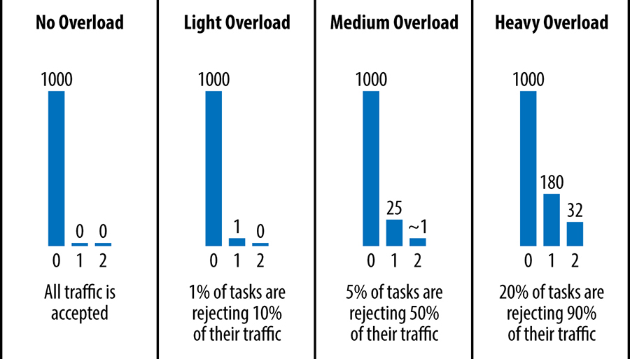
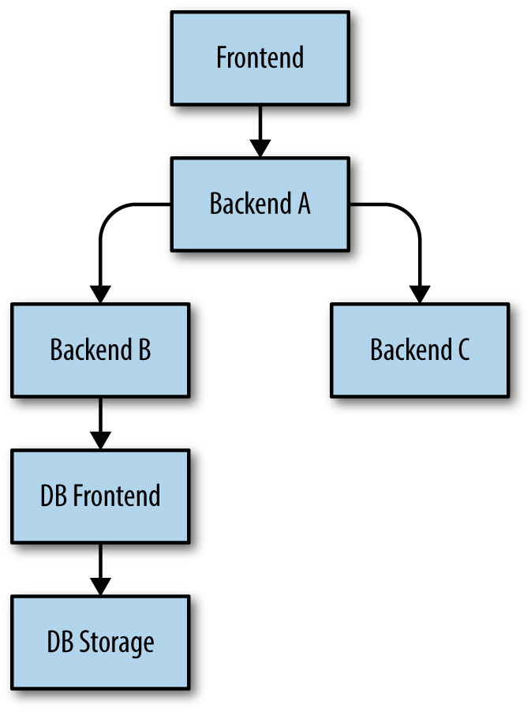

# Chương 21. Xử lý Quá tải (Handling Overload)

> **Nguyên bản:** [Chapter 21 - Handling Overload](https://sre.google/sre-book/handling-overload/)
> **Nguồn:** Google SRE Book (O'Reilly)
> **Bản dịch tiếng Việt** (Thực hiện bởi Đội ngũ R&D Softdreams)

---

*Tác giả:* Alejandro Forero Cuervo
*Biên tập:* Sarah Chavis

Tránh quá tải (overload) là một mục tiêu của các chính sách cân bằng tải. Tuy nhiên, dù chính sách cân bằng tải của bạn có hiệu quả đến đâu, *cuối cùng* một phần hệ thống vẫn sẽ bị quá tải. Xử lý các điều kiện quá tải một cách nhẹ nhàng (gracefully) chính là nền tảng để vận hành một hệ thống phục vụ đáng tin cậy.

Một cách xử lý quá tải là trả về các phản hồi suy giảm (degraded responses): những phản hồi kém chính xác hơn hoặc chứa ít dữ liệu hơn so với bình thường, nhưng dễ tính toán hơn. Ví dụ:

-   Thay vì tìm kiếm toàn bộ hệ thống (corpus) để đưa ra kết quả tốt nhất khả dụng cho một truy vấn tìm kiếm, chỉ tìm kiếm một phần nhỏ của tập ứng viên.
-   Dựa vào một bản sao cục bộ của các kết quả, có thể không hoàn toàn cập nhật, nhưng rẻ hơn so với việc truy cập kho lưu trữ chính thống (canonical storage).

Tuy nhiên, dưới quá tải cực đoan, dịch vụ có thể thậm chí không thể tính toán và phục vụ được cả các phản hồi suy giảm. Lúc này nó có thể không còn tùy chọn tức thời nào ngoài việc phục vụ các lỗi. Một cách để giảm nhẹ kịch bản này là cân bằng traffic xuyên suốt các datacenter (trung tâm dữ liệu) sao cho không có datacenter nào nhận nhiều traffic hơn năng lực mà nó có để xử lý. Ví dụ, nếu một datacenter chạy 100 backend task (nhiệm vụ phía sau) và mỗi task có thể xử lý tối đa 500 yêu cầu mỗi giây, thuật toán cân bằng tải sẽ không cho phép gửi nhiều hơn 50.000 truy vấn mỗi giây đến datacenter đó. Tuy nhiên, ngay cả ràng buộc này cũng có thể là không đủ để tránh quá tải khi vận hành ở quy mô. Cuối cùng, tốt nhất là xây dựng các client (khách hàng) và backend để xử lý các hạn chế tài nguyên một cách nhẹ nhàng: chuyển hướng khi có thể, phục vụ các kết quả suy giảm khi cần thiết, và xử lý các lỗi tài nguyên một cách trong suốt khi mọi thứ khác đều thất bại.

## Các Cạm bẫy của "Số truy vấn mỗi giây" (The Pitfalls of "Queries per Second")

Các truy vấn khác nhau có thể đòi hỏi tài nguyên khác nhau rất lớn. Chi phí của một truy vấn có thể thay đổi theo nhiều yếu tố, chẳng hạn như code trong client phát ra chúng (đối với các dịch vụ có nhiều client khác nhau), hoặc thậm chí thời điểm trong ngày (ví dụ, người dùng tại nhà so với người dùng làm việc; hay traffic tương tác của người dùng cuối so với traffic theo lô).

Chúng tôi học bài học này theo cách khó khăn: mô hình hóa năng lực dưới dạng "số truy vấn mỗi giây", hoặc dùng các đặc tính tĩnh của các yêu cầu được cho là một chỉ số đại diện (proxy) cho tài nguyên mà chúng tiêu thụ (ví dụ, "các yêu cầu đọc bao nhiêu keys (khóa)"), thường là một metric (chỉ số) kém. Ngay cả khi những metric này hoạt động đầy đủ tại một thời điểm, các tỷ số có thể thay đổi. Đôi khi sự thay đổi diễn ra dần dần, nhưng đôi khi nó rất đột ngột (ví dụ, một phiên bản mới của phần mềm bất ngờ khiến một số tính năng của một số yêu cầu đòi hỏi ít tài nguyên hơn đáng kể). Một mục tiêu luôn di chuyển là một metric kém cho việc thiết kế và cài đặt cân bằng tải.

Một cách tiếp cận tốt hơn là đo lường năng lực trực tiếp dựa trên các tài nguyên khả dụng. Chẳng hạn, một dịch vụ cụ thể trong datacenter có thể được cấp phát trước 500 CPU core (nhân) và 1 TB bộ nhớ. Việc sử dụng các con số này để mô hình hóa năng lực của datacenter sẽ mang lại hiệu quả cao hơn đáng kể. Chúng tôi thường dùng thuật ngữ *chi phí* (cost) của một yêu cầu để chỉ mức đo chuẩn hóa về lượng thời gian CPU mà yêu cầu đó tiêu thụ (xuyên suốt các kiến trúc CPU khác nhau, có tính đến sự khác biệt về hiệu năng).

Trong phần lớn các trường hợp (dù chắc chắn không phải tất cả), chúng tôi nhận thấy rằng đơn giản dùng mức tiêu thụ CPU làm tín hiệu cho việc provision (cấp phát) hoạt động tốt, vì các lý do sau:

-   Trong các nền tảng có thu gom rác (garbage collection), áp lực bộ nhớ tự nhiên chuyển thành mức tiêu thụ CPU tăng.
-   Trong các nền tảng khác, có thể provision các tài nguyên còn lại sao cho chúng rất ít khả năng cạn trước khi CPU cạn.

Khi việc provision vượt quá các tài nguyên không phải CPU gây tốn kém đến mức không thể chấp nhận, chúng tôi sẽ xem xét từng tài nguyên hệ thống riêng biệt khi đánh giá mức tiêu thụ.

## Các Giới hạn Mỗi Khách hàng (Per-Customer Limits)

Một phần trong [cách xử lý quá tải](https://sre.google/sre-book/addressing-cascading-failures/) là quyết định hành động khi xảy ra quá tải *toàn cục* (global). Trong một thế giới lý tưởng, nơi các đội phối hợp cẩn thận lịch ra mắt với chủ sở hữu các phụ thuộc backend, quá tải toàn cục sẽ không bao giờ xảy ra và các dịch vụ backend luôn đủ năng lực phục vụ khách hàng. Tuy nhiên, thực tế không hoàn hảo như vậy. Trên thực tế, quá tải toàn cục xảy ra khá thường xuyên (đặc biệt với các dịch vụ nội bộ, vốn có xu hướng có nhiều client do nhiều đội vận hành).

Khi quá tải toàn cục *thực sự* xảy ra, điều thiết yếu là dịch vụ chỉ trả về phản hồi lỗi cho các khách hàng có hành vi xấu, trong khi các khách hàng khác tiếp tục không bị ảnh hưởng. Để đạt được kết quả này, chủ sở hữu dịch vụ provision năng lực dựa trên mức sử dụng đã đàm phán với các khách hàng và định nghĩa quota cho từng khách hàng theo những thỏa thuận đó.

Ví dụ, nếu một dịch vụ backend có 10.000 CPUs được phân bổ trên toàn cầu (xuyên suốt các datacenter), các giới hạn cho mỗi khách hàng của dịch vụ này có thể như sau:

-   Gmail được phép tiêu thụ lên đến 4.000 CPU giây mỗi giây.
-   Calendar (Lịch) được phép tiêu thụ lên đến 4.000 CPU giây mỗi giây.
-   Android được phép tiêu thụ lên đến 3.000 CPU giây mỗi giây.
-   Google+ được phép tiêu thụ lên đến 2.000 CPU giây mỗi giây.
-   Mọi user khác được phép tiêu thụ lên đến 500 CPU giây mỗi giây.

Lưu ý rằng tổng các con số này có thể vượt quá 10.000 CPU được phân bổ cho dịch vụ backend. Chủ sở hữu dịch vụ đang dựa vào thực tế rằng ít khả năng *tất cả* khách hàng của họ chạm đến giới hạn tài nguyên đồng thời.

Chúng tôi tổng hợp thông tin sử dụng toàn cục trong thời gian thực từ tất cả các backend task, rồi dùng dữ liệu đó để push các giới hạn hiệu lực đến từng backend task. Việc xem kỹ hơn hệ thống cài đặt logic này nằm ngoài phạm vi thảo luận, nhưng chúng tôi đã viết một lượng code đáng kể để cài đặt điều này trong các backend task của mình. Một phần thú vị của bài toán là tính toán trong thời gian thực lượng tài nguyên — cụ thể là CPU — mà mỗi yêu cầu đơn lẻ tiêu thụ. Phép tính này đặc biệt khó khăn với các server không cài đặt mô hình thread (luồng) mỗi yêu cầu, trong đó một bể các thread đơn giản thực thi các phần khác nhau của tất cả các yêu cầu khi chúng đến, sử dụng các API (Application Programming Interface — Giao diện Lập trình Ứng dụng) không chặn (nonblocking).

## Giới hạn phía Client (Client-Side Throttling)

Khi một khách hàng hết định mức, một backend task nên từ chối các yêu cầu nhanh chóng, với kỳ vọng rằng việc trả về một lỗi "khách hàng hết định mức" tiêu thụ ít tài nguyên hơn đáng kể so với việc thực sự xử lý yêu cầu và phục vụ lại một phản hồi đúng. Tuy nhiên, logic này không đúng cho tất cả các dịch vụ. Ví dụ, việc từ chối một yêu cầu đòi hỏi một tra cứu RAM (bộ nhớ truy cập trực tiếp) đơn giản (nơi overhead (công việc phụ) của việc xử lý giao thức yêu cầu/phản hồi lớn hơn đáng kể so với overhead của việc tạo ra phản hồi) gần như đắt đỏ ngang nhau như việc chấp nhận và chạy yêu cầu đó. Và ngay cả khi việc từ chối các yêu cầu tiết kiệm được nhiều tài nguyên, những yêu cầu đó *vẫn* tiêu thụ một lượng tài nguyên nhất định. Nếu số lượng yêu cầu bị từ chối đáng kể, những con số này sẽ cộng lại rất nhanh. Trong những trường hợp như vậy, backend có thể trở nên quá tải ngay cả khi phần lớn CPU của nó chỉ dành để từ chối các yêu cầu!

Giới hạn phía client giải quyết vấn đề này.<sup>[1](#fn1)</sup> Khi một client nhận thấy rằng một phần đáng kể các yêu cầu gần đây của nó bị từ chối do lỗi "hết định mức", nó sẽ tự điều chỉnh và giới hạn lượng traffic đến mà nó tạo ra. Các yêu cầu vượt quá giới hạn sẽ thất bại ngay tại cục bộ, thậm chí không cần chạm đến mạng.

Chúng tôi cài đặt giới hạn phía client bằng một kỹ thuật gọi là *giới hạn thích nghi* (adaptive throttling). Cụ thể, mỗi client task lưu trữ các thông tin sau cho hai phút lịch sử gần nhất của nó:

`requests`

Số lượng các yêu cầu đã thử bởi tầng ứng dụng (trong client, trên cùng hệ thống giới hạn thích nghi)

`accepts`

Số lượng các yêu cầu được backend chấp nhận

Trong điều kiện bình thường, hai giá trị này bằng nhau. Khi backend bắt đầu từ chối traffic, số `accepts` sẽ nhỏ hơn số `requests`. Các client có thể tiếp tục gửi yêu cầu đến backend cho đến khi `requests` lớn gấp K lần `accepts`. Khi chạm ngưỡng đó, client bắt đầu tự điều chỉnh và từ chối các yêu cầu mới ngay tại cục bộ (tức là trong client) với xác suất được tính toán trong [Xác suất từ chối yêu cầu client](#xac-suat-tu-choi-yeu-cau-client).

<a id="xac-suat-tu-choi-yeu-cau-client"></a>

### Xác suất từ chối yêu cầu client (Client request rejection probability)

```
max(0, (requests - K * accepts) / (requests + 1))
```

Khi chính client bắt đầu từ chối các yêu cầu, `requests` sẽ tiếp tục vượt qua `accepts`. Điều này nghe có vẻ ngược trực giác — vì các yêu cầu bị từ chối cục bộ thực ra không hề chạm tới backend — nhưng đây chính là hành vi được ưu tiên. Khi tốc độ ứng dụng gửi yêu cầu đến client tăng (so với tốc độ backend chấp nhận), chúng tôi muốn tăng xác suất loại bỏ (drop) các yêu cầu mới.

Với những dịch vụ mà chi phí xử lý một yêu cầu gần bằng chi phí từ chối nó, việc để gần một nửa tài nguyên backend bị tiêu hao cho các yêu cầu bị từ chối có thể không chấp nhận được. Khi đó, giải pháp đơn giản là điều chỉnh hệ số chấp nhận K (ví dụ, 2) trong công thức tính xác suất từ chối yêu cầu client ([Xác suất từ chối yêu cầu client](#xac-suat-tu-choi-yeu-cau-client)). Cụ thể:

-   Giảm hệ số sẽ khiến giới hạn thích nghi phản ứng theo cách tích cực hơn
-   Tăng hệ số sẽ khiến giới hạn thích nghi phản ứng theo cách ít tích cực hơn

Ví dụ, thay vì để client tự điều chỉnh khi `requests = 2 * accepts`, hãy để nó tự điều chỉnh khi `requests = 1.1 * accepts`. Việc giảm hệ số xuống 1.1 có nghĩa là chỉ một yêu cầu sẽ bị backend từ chối cho mỗi 10 yêu cầu được chấp nhận.

Chúng tôi thường ưu tiên hệ số 2 lần. Bằng cách cho phép nhiều yêu cầu đạt đến backend hơn số lượng được kỳ vọng thực sự chấp nhận, chúng tôi lãng phí nhiều tài nguyên hơn ở backend, nhưng cũng tăng tốc sự lan truyền trạng thái từ backend đến các client. Ví dụ, nếu backend quyết định ngừng từ chối traffic từ các client task, thời gian cho đến khi tất cả các client task phát hiện ra sự thay đổi trạng thái này sẽ ngắn hơn.

Trong thực tế, giới hạn thích nghi hoạt động hiệu quả, giúp tốc độ yêu cầu nhìn chung ổn định. Ngay cả khi quá tải nghiêm trọng, các backend chỉ từ chối một yêu cầu cho mỗi yêu cầu được xử lý thành công. Ưu điểm lớn của cách tiếp cận này là quyết định do client task đưa ra dựa hoàn toàn vào thông tin cục bộ và sử dụng cấu hình tương đối đơn giản: không có phụ thuộc bổ sung hay hình phạt độ trễ.

Một cân nhắc bổ sung là giới hạn phía client có thể không hoạt động tốt với các client chỉ gửi yêu cầu đến backends của chúng một cách rất thất thường (sporadic). Trong trường hợp này, tầm nhìn mà mỗi client có về trạng thái backend bị giảm đáng kể, và các cách tiếp cận để tăng tầm nhìn đó có xu hướng tốn kém.

## Tính Quan trọng (Criticality)

*Tính quan trọng* (criticality) là một khái niệm khác mà chúng tôi thấy rất hữu ích trong ngữ cảnh của các định mức toàn cục và giới hạn. Mỗi yêu cầu gửi đến một backend sẽ được gắn với một trong bốn giá trị quan trọng khả thi, tùy thuộc vào mức độ quan trọng mà chúng tôi dành cho yêu cầu đó:

`CRITICAL_PLUS`

Đặt riêng cho các yêu cầu quan trọng nhất, những yêu cầu mà nếu thất bại sẽ gây tác động nghiêm trọng mà người dùng thấy rõ.

`CRITICAL`

Đây là giá trị mặc định cho các yêu cầu phát sinh từ job production (sản xuất). Những yêu cầu này tạo ra tác động mà người dùng có thể nhận thấy, dù mức độ có thể nhẹ hơn so với `CRITICAL_PLUS`. Các dịch vụ cần được trang bị đủ năng lực để xử lý toàn bộ traffic `CRITICAL` và `CRITICAL_PLUS` dự kiến.

`SHEDDABLE_PLUS`

Traffic mà sự không khả dụng một phần được dự kiến. Đây là giá trị mặc định cho các job theo lô, những job có thể thử lại các yêu cầu sau vài phút hoặc thậm chí vài giờ.

`SHEDDABLE`

Traffic mà sự không khả dụng một phần thường xuyên và sự không khả dụng toàn cục thỉnh thoảng được dự kiến.

Chúng tôi nhận thấy bốn giá trị này đủ vững chắc để mô hình hóa gần như mọi dịch vụ. Đã có một số cuộc thảo luận về việc đề xuất thêm nhiều giá trị hơn, nhằm phân loại các yêu cầu tinh tế hơn. Tuy nhiên, việc định nghĩa thêm các giá trị sẽ đòi hỏi nhiều tài nguyên hơn để vận hành các hệ thống nhận thức quan trọng (criticality-aware) khác nhau.

Chúng tôi đã đưa tính quan trọng thành một khái niệm hạng nhất (first-class notion) của hệ thống RPC (Remote Procedure Call — lời gọi thủ tục từ xa) và đã làm việc chăm chỉ để tích hợp nó vào nhiều cơ chế kiểm soát, nhằm đảm bảo nó được tính đến khi [phản ứng với các tình huống quá tải](https://sre.google/workbook/overload/). Ví dụ:

-   Khi một khách hàng hết định mức toàn cục, một backend task chỉ từ chối các yêu cầu của một mức quan trọng nhất định nếu nó đã từ chối tất cả các yêu cầu của tất cả các mức quan trọng thấp hơn (thực tế, các giới hạn mỗi khách hàng mà hệ thống của chúng tôi hỗ trợ, như đã mô tả trước đó, có thể được đặt theo tính quan trọng).
-   Khi một task tự nó quá tải, nó sẽ từ chối các yêu cầu của các mức quan trọng thấp hơn sớm hơn.
-   Hệ thống giới hạn thích nghi cũng giữ các thống kê riêng cho mỗi mức quan trọng.

Mức độ quan trọng của một yêu cầu là trực giao (orthogonal) so với yêu cầu độ trễ của nó, và do đó so với chất lượng dịch vụ (quality of service, QoS) mạng cơ bản được sử dụng. Ví dụ, khi một hệ thống hiển thị các kết quả tìm kiếm hoặc các đề xuất trong khi user đang nhập truy vấn tìm kiếm, các yêu cầu này rất có thể bị cắt giảm (sheddable — nếu hệ thống quá tải, có thể chấp nhận được việc không hiển thị những kết quả này), nhưng thường có yêu cầu độ trễ rất nghiêm ngặt.

Chúng tôi cũng đã mở rộng đáng kể hệ thống RPC để tự động lan truyền tính quan trọng. Cụ thể, khi một backend nhận yêu cầu *A* và trong quá trình xử lý, phát sinh các yêu cầu *B* và *C* gửi đến các backend khác, thì *B* và *C* mặc định sẽ kế thừa cùng mức độ quan trọng với *A*.

Trong quá khứ, nhiều hệ thống tại Google đã phát triển các khái niệm tính quan trọng tùy hứng (ad hoc) riêng, thường không tương thích xuyên suốt các dịch vụ. Bằng cách chuẩn hóa và lan truyền tính quan trọng như một phần của hệ thống RPC, giờ đây chúng tôi có thể đặt tính quan trọng một cách nhất quán tại các điểm cụ thể. Điều này có nghĩa là chúng tôi có thể tự tin rằng các phụ thuộc quá tải sẽ tuân theo tính quan trọng cấp cao mong muốn khi chúng từ chối traffic, bất kể chúng nằm sâu đến đâu trong stack RPC. Thực hành của chúng tôi do đó là đặt tính quan trọng càng gần càng tốt với các trình duyệt hoặc client di động — thường là trong các HTTP frontend (mặt trước) tạo ra HTML để trả về — và chỉ ghi đè tính quan trọng trong các trường hợp cụ thể mà nó có ý nghĩa tại một điểm cụ thể trong stack.

## Các Tín hiệu Sử dụng (Utilization Signals)

Cơ chế bảo vệ quá tải cấp task của chúng tôi dựa trên khái niệm *sự sử dụng* (utilization). Trong nhiều trường hợp, sự sử dụng đơn thuần là phép đo tốc độ CPU (tức là tốc độ CPU hiện tại chia cho tổng số CPU đặt trước cho task), nhưng đôi khi chúng tôi cũng tính đến các phép đo khác như phần bộ nhớ đặt trước hiện đang được sử dụng. Khi sự sử dụng tiến gần đến các ngưỡng đã cấu hình, chúng tôi bắt đầu từ chối các yêu cầu dựa trên mức độ quan trọng của chúng (ngưỡng cao hơn dành cho các mức quan trọng cao hơn).

Các tín hiệu này dựa trên trạng thái cục bộ của task (vì mục tiêu là bảo vệ task), và chúng tôi có các cài đặt riêng cho từng loại tín hiệu. Tín hiệu hữu ích nhất nhìn chung là dựa trên “tải” trong tiến trình, được xác định bằng một hệ thống mà chúng tôi gọi là *executor load average* (trung bình tải trình thực thi).

Để ước tính tải trung bình của trình thực thi, chúng tôi đếm số thread đang hoạt động trong tiến trình. Ở đây, “đang hoạt động” bao gồm các thread hiện đang chạy hoặc sẵn sàng chạy và đang chờ một trình xử lý rảnh. Chúng tôi làm mượt (smooth) giá trị này bằng sự suy giảm mũ (exponential decay) và bắt đầu từ chối các yêu cầu khi số thread đang hoạt động vượt quá số trình xử lý khả dụng cho task. Điều này có nghĩa là một yêu cầu đến có fan-out (sự tán ra) rất lớn (tức là lên lịch một đợt gồm một số lượng rất lớn các thao tác sống ngắn) sẽ gây ra một đợt tăng tải rất ngắn, nhưng cơ chế làm mượt sẽ phần lớn hấp thụ đợt tăng đó. Tuy nhiên, nếu các thao tác không sống ngắn (tức là tải tăng và duy trì ở mức cao trong một khoảng thời gian đáng kể), task sẽ bắt đầu từ chối các yêu cầu.

Mặc dù trung bình tải trình thực thi đã chứng minh là một tín hiệu rất hữu ích, hệ thống của chúng tôi có thể tích hợp bất kỳ tín hiệu sử dụng nào mà một backend nhất định có thể cần. Chẳng hạn, chúng tôi có thể dùng áp lực bộ nhớ — cho biết mức sử dụng bộ nhớ trong một backend task đã vượt quá các tham số vận hành bình thường hay chưa — làm một tín hiệu sử dụng khả thi khác. Hệ thống cũng có thể được cấu hình để kết hợp nhiều tín hiệu và từ chối các yêu cầu sẽ vượt quá các ngưỡng sử dụng mục tiêu (kết hợp hoặc riêng lẻ).

## Xử lý Các Lỗi Quá tải (Handling Overload Errors)

Ngoài việc xử lý tải một cách nhẹ nhàng, chúng tôi cũng đã cân nhắc kỹ lưỡng cách các client nên phản ứng khi nhận được phản hồi lỗi liên quan đến tải. Với [các lỗi quá tải,](https://sre.google/sre-book/addressing-cascading-failures/) chúng tôi phân biệt hai tình huống khả thi.

**Một tập con lớn các backend task trong datacenter bị quá tải.**

Nếu hệ thống cân bằng tải cross-datacenter (liên datacenter) hoạt động hoàn hảo — tức là có khả năng lan truyền trạng thái và phản ứng tức thời trước các biến động traffic — thì tình trạng này sẽ không xảy ra.

**Một tập con nhỏ các backend task trong datacenter bị quá tải.**

Tình huống này thường do các điểm không hoàn hảo trong cân bằng tải bên trong datacenter gây ra. Ví dụ, một task có thể vừa nhận một yêu cầu rất đắt tiền. Khi đó, rất có thể datacenter còn năng lực dự phòng trong các task khác để xử lý yêu cầu.

Nếu một tập con lớn các backend task trong datacenter bị quá tải, các yêu cầu không nên được thử lại mà nên để lỗi bọt lên (bubble up) tới tận người gọi (ví dụ, trả về một lỗi cho user cuối). Trường hợp phổ biến hơn nhiều là chỉ một phần nhỏ các task trở nên quá tải, và khi đó phản hồi được ưu tiên là thử lại yêu cầu ngay lập tức. Nhìn chung, hệ thống cân bằng tải cross-datacenter của chúng tôi cố định tuyến traffic từ các client đến datacenter backend khả dụng gần nhất của chúng. Trong một số trường hợp, datacenter gần nhất ở xa (ví dụ, một client có thể có backend khả dụng gần nhất ở một châu lục khác), nhưng chúng tôi thường tìm cách đặt các client gần các backend của chúng. Nhờ đó, độ trễ bổ sung của việc thử lại một yêu cầu — chỉ một vài chuyến đi mạng — thường không đáng kể.

Theo góc nhìn của các chính sách cân bằng tải, các lần thử lại không thể phân biệt với các yêu cầu mới. Nói cách khác, chúng tôi không dùng bất kỳ logic rõ ràng nào để đảm bảo một lần thử lại thực sự đi đến một backend task khác; thay vào đó, chúng tôi chỉ dựa vào khả năng cao rằng lần thử lại sẽ đáp xuống một backend task khác do số lượng backends tham gia trong tập. Việc đảm bảo tất cả các lần thử lại thực sự đi đến một task khác sẽ đòi hỏi nhiều độ phức tạp hơn trong các API của chúng tôi so với mức đáng giá.

Ngay cả khi một backend chỉ hơi quá tải, việc từ chối đồng đều và nhanh chóng các yêu cầu thử lại lẫn yêu cầu mới thường giúp phục vụ client tốt hơn. Những yêu cầu bị từ chối này có thể được thử lại ngay lập tức trên một backend task khác, nơi có thể còn tài nguyên dự phòng. Nếu backend đối xử giống hệt nhau giữa các lần thử lại và yêu cầu mới, việc thử lại trên các task khác sẽ trở thành một hình thức cân bằng tải hữu cơ: nó chuyển hướng tải đến các task có thể phù hợp hơn cho những yêu cầu đó.

## Quyết định Thử lại (Deciding to Retry)

Khi nhận được phản hồi lỗi “task quá tải”, client phải quyết định có nên thử lại yêu cầu hay không. Để tránh việc thử lại khi một phần đáng kể các task trong một cluster (cụm máy) bị quá tải, chúng tôi đã thiết lập một số cơ chế.

Trước tiên, chúng tôi thiết lập một *ngân sách thử lại cho mỗi yêu cầu* (per-request retry budget) với giới hạn tối đa ba lần. Khi một yêu cầu đã thất bại ba lần, chúng tôi để lỗi đó truyền lên người gọi. Lập luận ở đây là nếu một yêu cầu đã rơi vào các task quá tải ba lần, khả năng việc thử lại sẽ mang lại lợi ích là tương đối thấp, bởi lẽ toàn bộ datacenter nhiều khả năng đang trong tình trạng quá tải.

Thứ hai, chúng tôi áp dụng *ngân sách thử lại cho từng client* (per-client retry budget). Mỗi client sẽ theo dõi tỷ lệ giữa số yêu cầu và số lần thử lại. Một yêu cầu chỉ được phép thử lại khi tỷ lệ này dưới 10%. Lập luận ở đây là nếu chỉ một tập con nhỏ các task bị quá tải, nhu cầu thử lại sẽ rất ít.

Lấy ví dụ cụ thể (của kịch bản tồi tệ nhất), giả sử một datacenter đang chấp nhận một lượng nhỏ yêu cầu và từ chối phần lớn các yêu cầu còn lại. Gọi X là tổng tốc độ các yêu cầu đã thử đối với datacenter theo logic phía client. Do các lần thử lại sẽ xảy ra, số lượng yêu cầu tăng đáng kể, lên mức nào đó vừa dưới 3X. Mặc dù chúng tôi đã thực chất giới hạn sự tăng trưởng do các lần thử lại gây ra, một sự tăng gấp ba số yêu cầu vẫn là đáng kể, đặc biệt khi chi phí từ chối so với xử lý một yêu cầu đáng kể. Tuy nhiên, việc chồng thêm ngân sách thử lại mỗi client (tỷ số thử lại 10%) đã giảm sự tăng trưởng xuống chỉ còn 1,1 lần trong trường hợp chung — một cải tiến đáng kể.

Cách tiếp cận thứ ba là cho các client đưa một bộ đếm số lần yêu cầu đã thử vào metadata (dữ liệu mô tả) của yêu cầu. Ví dụ, bộ đếm bắt đầu ở 0 trong lần thử đầu tiên và tăng lên ở mỗi lần thử lại cho đến khi đạt 2, lúc đó ngân sách mỗi yêu cầu khiến nó ngừng được thử lại. Các backend giữ các histogram (đồ thị phân bố tần số) của những giá trị này trong lịch sử gần đây. Khi một backend cần từ chối một yêu cầu, nó tham khảo những histogram này để xác định xác suất các backend task khác cũng bị quá tải. Nếu những histogram này cho thấy một lượng đáng kể các lần thử lại (tức là các backend task nhiều khả năng cũng bị quá tải), chúng trả về phản hồi lỗi "quá tải; đừng thử lại" thay vì lỗi "task quá tải" tiêu chuẩn vốn kích hoạt các lần thử lại.

[Hình 21-1](#hinh-21-1) hiển thị số lần thử trong mỗi yêu cầu mà một backend task nhất định nhận được trong các tình huống ví dụ khác nhau, xuyên suốt một cửa sổ trượt (tương ứng với 1.000 yêu cầu ban đầu, không tính các lần thử lại). Để đơn giản, ngân sách thử lại mỗi client được bỏ qua (tức là những con số này giả định rằng giới hạn duy nhất cho các lần thử lại là ngân sách ba lần thử mỗi yêu cầu), và subsetting (phân tập) có thể làm thay đổi những con số này một chút.


<a id="hinh-21-1"></a>

[Hình 21-1.](#hinh-21-1) Các histogram của các lần thử trong các điều kiện khác nhau.

Các dịch vụ lớn hơn của chúng tôi có xu hướng là các stack (tòa) sâu gồm nhiều hệ thống, những hệ thống này lần lượt có thể phụ thuộc vào nhau. Trong kiến trúc này, các yêu cầu chỉ nên được thử lại ở tầng ngay lập tức phía trên tầng đang từ chối chúng. Khi chúng tôi quyết định rằng một yêu cầu nhất định không thể được phục vụ và không nên được thử lại, chúng tôi dùng một lỗi "quá tải; đừng thử lại", và do đó tránh một sự bùng nổ thử lại tổ hợp (combinatorial).

Hãy xem xét ví dụ trong [Hình 21-2](#hinh-21-2) (thực tế, các stack của chúng tôi thường phức tạp hơn đáng kể). Giả sử DB Frontend hiện đang quá tải và từ chối một yêu cầu. Khi đó:

-   Backend B sau đó sẽ thử lại yêu cầu theo các hướng dẫn trước đó.
-   Tuy nhiên, một khi Backend B xác định rằng yêu cầu đến DB Frontend không thể được phục vụ (ví dụ, vì yêu cầu đã được thử và từ chối ba lần), Backend B phải trả về cho Backend A một lỗi "quá tải; đừng thử lại" hoặc một phản hồi suy giảm (giả sử nó có thể tạo ra một phản hồi đủ hữu ích ở mức độ vừa phải ngay cả khi yêu cầu của nó đến DB Frontend thất bại).
-   Backend A có chính xác các tùy chọn tương tự cho yêu cầu mà nó nhận từ Frontend, và hành xử theo tương ứng.


<a id="hinh-21-2"></a>

[Hình 21-2.](#hinh-21-2) Một stack các sự phụ thuộc.

Điểm chính là một yêu cầu thất bại từ DB Frontend chỉ nên được thử lại bởi Backend B, tầng ngay lập tức phía trên nó. Nếu nhiều tầng cùng thử lại, chúng tôi sẽ có một sự bùng nổ tổ hợp.

## Tải từ Các Kết nối (Load from Connections)

Tải liên quan đến các kết nối là một yếu tố cuối cùng đáng để đề cập. Đôi khi chúng tôi chỉ tính đến tải ở các backend được gây ra trực tiếp bởi các yêu cầu mà chúng nhận (đây là một trong những vấn đề của các cách tiếp cận mô hình tải dựa trên số truy vấn mỗi giây). Tuy nhiên, việc làm như vậy bỏ qua chi phí CPU và bộ nhớ của việc duy trì một bể kết nối lớn, hoặc chi phí của một tốc độ churn (sự thay đổi) kết nối nhanh. Những vấn đề như vậy không đáng kể trong các hệ thống nhỏ, nhưng nhanh chóng trở nên gây rắc rối khi vận hành các hệ thống RPC quy mô rất lớn.

Như đã đề cập, giao thức RPC của chúng tôi yêu cầu các client không hoạt động phải thực hiện kiểm tra sức khỏe định kỳ. Sau khi một kết nối ở trạng thái rảnh trong khoảng thời gian có thể cấu hình, client sẽ hủy kết nối TCP và chuyển sang UDP để kiểm tra sức khỏe. Tuy nhiên, hành vi này gây ra vấn đề khi có số lượng lớn client task phát yêu cầu với tần suất rất thấp: việc kiểm tra sức khỏe trên các kết nối có thể tiêu tốn nhiều tài nguyên hơn so với việc thực sự phục vụ các yêu cầu. Các cách tiếp cận như tinh chỉnh cẩn thận các tham số kết nối (ví dụ, giảm đáng kể tần suất kiểm tra sức khỏe) hoặc thậm chí tạo và hủy các kết nối một cách động có thể cải thiện đáng kể tình huống này.

Việc xử lý các đợt yêu cầu kết nối mới là một vấn đề thứ hai (nhưng liên quan). Chúng tôi đã thấy các đợt như vậy xảy ra với các job theo lô rất lớn, tạo ra một số lượng rất lớn các worker client task tất cả cùng một lúc. Nhu cầu đàm phán và duy trì một số lượng quá mức các kết nối mới đồng thời có thể dễ dàng làm quá tải một nhóm các backend. Theo kinh nghiệm của chúng tôi, có một vài chiến thuật có thể giúp giảm nhẹ tải này:

-   Phơi bày tải đến thuật toán [cân bằng tải](https://sre.google/sre-book/load-balancing-frontend/) cross-datacenter (ví dụ, dựa vào mức sử dụng của cluster để cân bằng tải, thay vì chỉ dựa trên số lượng yêu cầu). Khi đó, tải từ các yêu cầu sẽ được phân bổ lại sang các datacenter khác có năng lực dự phòng.
-   Buộc các job client theo lô sử dụng một tập riêng các backend task *batch proxy* (bộ proxy theo lô), những task này không làm gì ngoài việc chuyển các yêu cầu đến các backend cơ bản và giao các phản hồi ngược lại cho các client một cách có kiểm soát. Vì vậy, thay vì "batch client → backend," bạn có "batch client → batch proxy → backend." Trong trường hợp này, khi job rất lớn bắt đầu, chỉ batch proxy chịu thiệt hại, che chắn các backend thực sự (và các client ưu tiên cao hơn). Thực chất, batch proxy hành động như một cầu chì (fuse). Một lợi ích khác của việc dùng proxy là nó thường giảm số lượng kết nối đến backend, điều này có thể cải thiện cân bằng tải cho backend (ví dụ, các proxy task có thể dùng các tập lớn hơn và nhiều khả năng có một tầm nhìn tốt hơn về trạng thái của các backend task).

## Kết luận (Conclusions)

Chương này và [Cân bằng Tải trong Datacenter](https://sre.google/sre-book/load-balancing-datacenter/) đã thảo luận cách các kỹ thuật khác nhau (deterministic subsetting, Weighted Round Robin, giới hạn phía client, các định mức khách hàng, v.v.) có thể giúp trải tải trên các task trong một datacenter tương đối đều. Tuy nhiên, những cơ chế này phụ thuộc vào sự lan truyền trạng thái trên một hệ thống phân tán. Trong khi chúng hoạt động khá tốt trong trường hợp chung, việc ứng dụng thực tế đã dẫn đến một số ít tình huống mà chúng hoạt động không hoàn hảo.

Kết quả là, chúng tôi coi việc đảm bảo rằng các task đơn lẻ được bảo vệ chống lại quá tải là điều thiết yếu. Nói đơn giản: một backend task được provision để phục vụ một tốc độ traffic nhất định nên tiếp tục phục vụ traffic ở tốc độ đó mà không có bất kỳ tác động đáng kể nào đến độ trễ, bất kể bao nhiêu traffic vượt mức được ném vào task. Hệ quả là, backend task không nên sụp đổ và sập dưới tải. Những tuyên bố này nên đúng cho đến một tốc độ traffic nhất định — đâu đó trên 2 lần hoặc thậm chí 10 lần so với mức task được provision để xử lý. Chúng tôi chấp nhận rằng có thể có một điểm mà tại đó một hệ thống bắt đầu sụp đổ, và việc nâng ngưỡng mà sự sụp đổ này xảy ra trở nên tương đối khó khăn để đạt được.

Chìa khóa là phải coi những điều kiện suy giảm này một cách nghiêm túc. Khi những điều kiện suy giảm này bị bỏ qua, nhiều hệ thống sẽ thể hiện hành vi khủng khiếp. Và khi công việc chồng chất, các task cuối cùng hết bộ nhớ và sập (hoặc kết thúc bằng việc đốt cháy gần như toàn bộ CPU của chúng trong memory thrashing — dao động bộ nhớ), độ trễ bị ảnh hưởng khi traffic bị loại bỏ và các task cạnh tranh cho các tài nguyên. Nếu không được kiểm soát, sự cố trong một tập con của một hệ thống (như một backend task đơn lẻ) có thể kích hoạt sự cố của các thành phần hệ thống khác, và có thể kéo theo toàn bộ hệ thống (hoặc một tập con đáng kể) gặp sự cố. Tác động từ loại sự cố lan truyền (cascading failure) này có thể nghiêm trọng đến mức việc bảo vệ chống lại nó là thiết yếu cho bất kỳ hệ thống nào vận hành ở quy mô; xem [Đối phó với Các Sự cố Lan truyền](https://sre.google/sre-book/addressing-cascading-failures/).

Một sai lầm phổ biến là giả định rằng một backend quá tải nên từ chối và ngừng chấp nhận tất cả traffic. Tuy nhiên, giả định này thực chất đi ngược lại mục tiêu của cân bằng tải vững chắc. Chúng tôi thực sự muốn backend tiếp tục chấp nhận nhiều traffic nhất có thể, nhưng chỉ nhận tải đó khi năng lực được giải phóng. Một backend hành vi tốt, được hỗ trợ bởi các chính sách cân bằng tải vững chắc, nên chỉ chấp nhận các yêu cầu mà nó có thể xử lý và từ chối phần còn lại một cách nhẹ nhàng.

Mặc dù chúng tôi có một loạt các công cụ để cài đặt cân bằng tải tốt và các cơ chế bảo vệ quá tải, không có viên đạn thần kỳ (magic bullet): cân bằng tải thường đòi hỏi sự hiểu biết sâu sắc về một hệ thống và ngữ nghĩa của các yêu cầu của nó. Các kỹ thuật được mô tả trong chương này đã tiến hóa cùng với nhu cầu của nhiều hệ thống tại Google, và nhiều khả năng sẽ tiếp tục tiến hóa khi bản chất của các hệ thống của chúng tôi tiếp tục thay đổi.

<a id="fn1"></a>[1](#fn1) Ví dụ, xem [Doorman](https://github.com/youtube/doorman), cung cấp một hệ thống giới hạn phía client phân tán hợp tác.

---

Copyright © 2017 Google, Inc. Published by O'Reilly Media, Inc. Licensed under [CC BY-NC-ND 4.0](https://creativecommons.org/licenses/by-nc-nd/4.0/)
