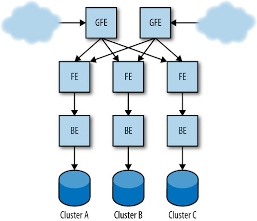
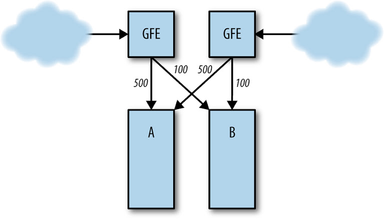
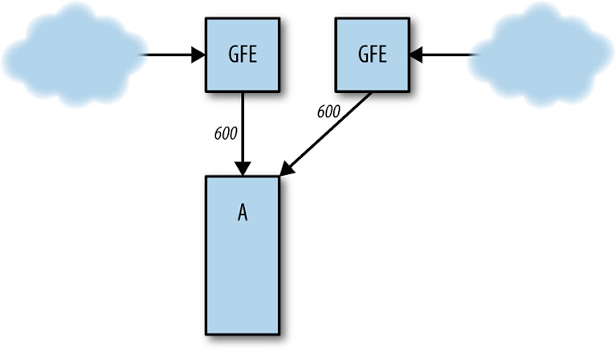

# Chương 22. Đối phó với Các Sự thất bại Lan truyền (Addressing Cascading Failures)

> **Nguyên bản:** [Chapter 22 - Addressing Cascading Failures](https://sre.google/sre-book/addressing-cascading-failures/)
> **Nguồn:** Google SRE Book (O'Reilly)
> **Bản dịch tiếng Việt** (Thực hiện bởi Đội ngũ R&D Softdreams)

---

*Tác giả:* Mike Ulrich

> Nếu lần đầu tiên bạn không thành công, hãy lùi lại theo cấp số nhân.
>
> Dan Sandler, Google Software Engineer (Kỹ sư Phần mềm Google)

> Tại sao mọi người luôn quên rằng bạn cần thêm một chút jitter (sự nhiễu ngẫu nhiên)?
>
> Ade Oshineye, Google Developer Advocate (Nhà truyền bá Developer của Google)

Một sự thất bại lan truyền (cascading failure) là một sự thất bại tăng lên theo thời gian do kết quả của phản hồi tích cực (positive feedback).<sup>[1](#fn1)</sup> Nó có thể xảy ra khi một phần của một hệ thống thất bại, làm tăng xác suất để các phần khác của hệ thống cũng thất bại. Ví dụ, một replica (bản sao) đơn lẻ của một dịch vụ có thể thất bại do quá tải (overload), làm tăng tải lên các replica còn lại và tăng xác suất để chúng cũng thất bại, tạo ra hiệu ứng domino kéo theo toàn bộ các replica của dịch vụ đi xuống.

Chúng tôi sẽ dùng dịch vụ tìm kiếm Shakespeare được thảo luận trong [Shakespeare: A Sample Service](https://sre.google/sre-book/production-environment#xref_production-environment_shakespeare) làm một ví dụ xuyên suốt chương này. Cấu hình production (sản xuất) của nó có thể trông như [Hình 22-1](#hinh-22-1).


<a id="hinh-22-1"></a>

[Hình 22-1.](#hinh-22-1) Ví dụ cấu hình production cho dịch vụ tìm kiếm Shakespeare.

## Các Nguyên nhân của Các Sự thất bại Lan truyền và Thiết kế để Tránh chúng (Causes of Cascading Failures and Designing to Avoid Them)

Thiết kế hệ thống có tính toán kỹ lưỡng nên bao quát một số kịch bản điển hình giải thích cho phần lớn các sự thất bại lan truyền.

<a id="server-qua-tai"></a>

## Quá tải Server (Server Overload)

Nguyên nhân phổ biến nhất của các sự thất bại lan truyền là quá tải. Phần lớn các sự thất bại lan truyền được mô tả ở đây hoặc do trực tiếp server quá tải, hoặc do các dạng mở rộng hay biến thể của kịch bản này.

Giả sử frontend (mặt trước) trong cluster (cụm máy) A đang xử lý 1.000 yêu cầu mỗi giây (QPS), như trong [Hình 22-2](#hinh-22-2).


<a id="hinh-22-2"></a>

[Hình 22-2.](#hinh-22-2) Sự phân phối tải server bình thường giữa các cluster A và B.

Nếu cluster B thất bại ([Hình 22-3](#hinh-22-3)), lượng yêu cầu đến cluster A tăng lên 1.200 QPS. Các frontend trong A không thể xử lý các yêu cầu ở mức 1.200 QPS, và do đó bắt đầu hết tài nguyên, khiến chúng sập (crash), bỏ lỡ các hạn chót (deadlines), hoặc hành xử sai theo cách khác. Kết quả là, tốc độ các yêu cầu được xử lý thành công trong A giảm xuống đáng kể dưới 1.000 QPS.


<a id="hinh-22-3"></a>

[Hình 22-3.](#hinh-22-3) Cluster B thất bại, gửi tất cả traffic đến cluster A.

Sự giảm này trong tốc độ thực hiện công việc hữu ích có thể lan sang các failure domain khác, thậm chí lan truyền toàn cục. Ví dụ, quá tải cục bộ trong một cluster có thể khiến các server của nó sập; để đáp lại, bộ điều khiển cân bằng tải (load balancing controller) chuyển các yêu cầu sang các cluster khác, làm quá tải các server ở đó, dẫn đến một sự thất bại quá tải toàn dịch vụ. Những sự kiện này có thể diễn ra không mất lâu (ví dụ, chỉ trong vòng vài phút), vì [bộ cân bằng tải](https://sre.google/sre-book/handling-overload/) và các hệ thống lên lịch task (nhiệm vụ) liên quan có thể phản ứng rất nhanh.

## Hết Tài nguyên (Resource Exhaustion)

Việc cạn một tài nguyên có thể dẫn đến độ trễ (latency) cao hơn, tốc độ lỗi (error rates) tăng cao, hoặc sự xuất hiện của các kết quả kém chất lượng hơn. Đây thực chất là những hiệu ứng được mong đợi của việc cạn tài nguyên: rốt cuộc một thứ gì đó phải nhượng bộ khi tải tăng vượt quá những gì một server có thể xử lý.

Tùy thuộc vào tài nguyên nào cạn trong một server và cách server được xây dựng, việc cạn tài nguyên có thể khiến server kém hiệu quả hơn hoặc gây ra sập server, buộc bộ cân bằng tải phải phân phối lại tải sang các server khác. Khi điều này xảy ra, tốc độ các yêu cầu được xử lý thành công có thể giảm và có thể kéo cả cluster hoặc toàn bộ dịch vụ vào một sự thất bại lan truyền.

Các loại tài nguyên khác nhau có thể cạn, dẫn đến các hiệu ứng khác nhau lên các server.

### CPU

Nếu không có đủ CPU để xử lý tải yêu cầu, thường tất cả các yêu cầu sẽ trở nên chậm hơn. Kịch bản này có thể dẫn đến các hiệu ứng thứ cấp khác nhau, bao gồm:

#### Tăng số lượng các yêu cầu đang bay (in-flight requests)

Vì các yêu cầu mất lâu hơn để xử lý, nhiều yêu cầu hơn được xử lý đồng thời (cho đến một năng lực tối đa mà tại đó việc xếp hàng có thể xảy ra). Điều này ảnh hưởng đến hầu như tất cả các tài nguyên, bao gồm bộ nhớ, số lượng thread (luồng) đang hoạt động (trong mô hình server thread-mỗi-yêu-cầu), số lượng file descriptor (mô tả tệp), và các tài nguyên backend (phía sau) (những tài nguyên mà lần lượt có thể có các hiệu ứng khác).

**Các độ dài hàng đợi (queue) quá dài**

Nếu không có đủ năng lực để xử lý tất cả các yêu cầu ở trạng thái ổn định (steady state), server sẽ làm bão hòa các hàng đợi của nó. Điều này đồng nghĩa với việc độ trễ tăng (các yêu cầu phải xếp hàng trong các khoảng thời gian dài hơn) và hàng đợi tiêu tốn nhiều bộ nhớ hơn. Xem [Quản lý Hàng đợi](#quan-ly-hang-doi) cho một thảo luận về các chiến lược giảm nhẹ.

#### Thread đói (Thread starvation)

Khi một thread không thể tiến bộ vì đang chờ một lock (khóa), các kiểm tra sức khỏe (health checks) có thể thất bại nếu endpoint (điểm cuối) kiểm tra sức khỏe không thể được phục vụ kịp thời.

#### CPU hoặc yêu cầu bị đói (CPU or request starvation)

Các watchdog (chó canh) nội bộ<sup>[2](#fn2)</sup> trong server phát hiện rằng server không đang tiến bộ, dẫn đến sập server do CPU bị đói, hoặc do yêu cầu bị đói nếu các sự kiện watchdog được kích hoạt từ xa và được xử lý như một phần của hàng đợi yêu cầu.

#### Bỏ lỡ các hạn chót RPC (Remote Procedure Call — lời gọi thủ tục từ xa)

Khi một server trở nên quá tải, các phản hồi của nó cho các RPC từ các client (khách hàng) của nó đến muộn hơn, có thể vượt qua bất kỳ hạn chót nào mà những client đó đặt ra. Công việc mà server đã thực hiện để phản hồi lúc đó bị lãng phí, và các client có thể thử lại các RPC, dẫn đến quá tải còn nhiều hơn nữa.

#### Giảm lợi ích của cache CPU (CPU caching)

Khi nhiều CPU hơn được sử dụng, khả năng tràn (spilling) sang nhiều core (nhân) hơn tăng lên, dẫn đến giảm việc sử dụng cache (bộ đệm) cục bộ và giảm hiệu năng CPU.

### Bộ nhớ (Memory)

Nếu không có gì khác, nhiều yêu cầu đang bay hơn sẽ tiêu thụ nhiều RAM (bộ nhớ truy cập trực tiếp) hơn do việc cấp phát (allocating) các object (đối tượng) cho yêu cầu, phản hồi, và RPC. Việc cạn bộ nhớ có thể gây ra các hiệu ứng sau:

#### Các task chết (dying tasks)

Ví dụ, một task có thể bị trục xuất (evicted) bởi trình quản lý container (hộp) (VM hoặc khác) vì vượt quá giới hạn tài nguyên khả dụng, hoặc các sự cố sập cụ thể của ứng dụng có thể khiến task chết.

**Tăng tốc độ thu gom rác (garbage collection, GC) trong Java, dẫn đến tăng việc sử dụng CPU**

Trong kịch bản này có thể xảy ra một vòng lặp luẩn quẩn (vicious cycle): CPU khả dụng giảm khiến yêu cầu xử lý chậm hơn, khiến mức dùng RAM tăng, khiến GC chạy nhiều hơn, và điều đó lại khiến CPU khả dụng giảm thêm nữa. Trong ngôn ngữ thông tục, điều này được gọi là "xoáy cái chết GC" (GC death spiral).

#### Giảm các tỷ lệ hit cache (cache hit rates)

Sự giảm trong RAM khả dụng có thể làm giảm tỷ lệ hit cache cấp ứng dụng, dẫn đến nhiều RPC hơn đến các backend, và có thể khiến các backend trở nên quá tải.

### Threads (Luồng)

Thread bị đói có thể trực tiếp gây ra các lỗi hoặc dẫn đến thất bại kiểm tra sức khỏe. Nếu server thêm các thread khi cần, overhead thread có thể tiêu thụ quá nhiều RAM. Trong các trường hợp cực đoan, thread bị đói cũng có thể khiến bạn cạn hết process ID (định danh tiến trình).

### File descriptors (Mô tả tệp) (File descriptors)

Việc cạn các file descriptor có thể dẫn đến không thể khởi tạo các kết nối mạng, và điều này lần lượt có thể khiến các kiểm tra sức khỏe thất bại.

### Các Sự phụ thuộc giữa các Tài nguyên (Dependencies among resources)

Hãy lưu ý rằng nhiều kịch bản cạn tài nguyên này có thể nuôi dưỡng lẫn nhau — một [dịch vụ đang trải qua quá tải](https://sre.google/sre-book/handling-overload/) thường có một loạt các triệu chứng thứ cấp trông giống như nguyên nhân gốc rễ (root cause), khiến việc debug (gỡ lỗi) trở nên khó khăn.

Ví dụ, hãy hình dung kịch bản sau:

1.  Một frontend Java có các tham số thu gom rác (GC) được tinh chỉnh kém.
2.  Dưới tải cao (nhưng vẫn nằm trong dự kiến), frontend cạn CPU do GC.
3.  Việc cạn CPU làm chậm việc hoàn thành các yêu cầu.
4.  Số lượng yêu cầu đang tiến hành tăng lên khiến nhiều RAM hơn được sử dụng để xử lý các yêu cầu.
5.  Áp lực bộ nhớ từ các yêu cầu, kết hợp với một mức cấp phát bộ nhớ cố định cho tiến trình frontend nói chung, để lại ít RAM hơn cho cache.
6.  Kích thước cache giảm đồng nghĩa với ít entry (bản ghi) trong cache hơn, bên cạnh tỷ lệ hit thấp hơn.
7.  Sự tăng trong số lần bỏ lỡ cache (cache miss) đồng nghĩa với việc nhiều yêu cầu hơn rơi xuống (fall through) đến backend để được phục vụ.
8.  Backend, lần lượt, cạn CPU hoặc thread.
9.  Cuối cùng, sự thiếu CPU khiến các kiểm tra sức khỏe cơ bản thất bại, khởi đầu một sự thất bại lan truyền.

Trong các tình huống phức tạp như kịch bản trên, ít khả năng chuỗi nhân quả sẽ được chẩn đoán hoàn toàn trong một lần outage (mất dịch vụ). Có thể rất khó để xác định rằng sự sập backend bắt nguồn từ một sự giảm tỷ lệ cache trong frontend, đặc biệt nếu các thành phần frontend và backend có các chủ sở hữu khác nhau.

## Sự Không khả dụng của Dịch vụ (Service Unavailability)

Việc cạn tài nguyên có thể dẫn đến các server sập; ví dụ, các server có thể sập khi quá nhiều RAM được cấp phát cho một container. Một khi vài server sập do quá tải, tải trên các server còn lại có thể tăng lên, khiến chúng cũng sập. Vấn đề có xu hướng lăn như quả tuyết và chẳng bao lâu tất cả các server bắt đầu crash-loop (vòng lặp sập). Thường rất khó để thoát khỏi kịch bản này, bởi vì ngay khi các server quay lại online, chúng lập tức bị dồn một tỷ lệ yêu cầu cực kỳ cao và gần như ngay lập tức thất bại.

Ví dụ, nếu một dịch vụ khỏe mạnh ở 10.000 QPS, nhưng bắt đầu một sự thất bại lan truyền do các lần sập ở 11.000 QPS, việc giảm tải xuống 9.000 QPS gần như chắc chắn sẽ không dừng được các lần sập. Lý do là dịch vụ vẫn phải xử lý nhu cầu tăng lên trong khi sức chứa đã giảm; thường chỉ một phần nhỏ các server đủ khỏe để xử lý yêu cầu. Tỷ lệ server đủ khỏe phụ thuộc vào một số yếu tố: tốc độ mà hệ thống có thể khởi chạy các task, tốc độ mà binary có thể bắt đầu phục vụ ở sức chứa đầy đủ, và một task mới khởi chạy có thể trụ được trước tải trong bao lâu. Trong ví dụ này, nếu 10% server đủ khỏe để xử lý yêu cầu, thì tỷ lệ yêu cầu sẽ cần giảm xuống khoảng 1.000 QPS để hệ thống có thể ổn định và phục hồi.

Tương tự, các server có thể có vẻ không khỏe đối với tầng cân bằng tải, dẫn đến sức chứa cân bằng tải giảm: các server có thể chuyển sang trạng thái “lame duck” (xem [Một Cách tiếp cận Vững chắc cho các Task Không khỏe mạnh: Trạng thái Lame Duck](https://sre.google/sre-book/load-balancing-datacenter/#robust-approach-unhealthy-tasks-lame-duck-state)) hoặc thất bại các kiểm tra sức khỏe mà không sập. Hiệu ứng có thể rất giống với việc sập: nhiều server hơn có vẻ không khỏe, các server khỏe có xu hướng chỉ chấp nhận yêu cầu trong một khoảng thời gian rất ngắn trước khi trở nên không khỏe, và ít server hơn tham gia vào việc xử lý yêu cầu.

Các chính sách cân bằng tải tránh các server đã phục vụ lỗi có thể làm trầm trọng thêm vấn đề — một vài backend phục vụ một số lỗi, vì vậy chúng không đóng góp vào sức chứa khả dụng cho dịch vụ. Điều này làm tăng tải trên các server còn lại, khởi đầu hiệu ứng tuyết lăn.

<a id="phong-tranh-server-qua-tai"></a>

## Phòng Tránh Server Quá Tải (Preventing Server Overload)

Danh sách dưới đây trình bày các chiến lược cho [việc tránh server quá tải](https://sre.google/sre-book/handling-overload/) theo thứ tự ưu tiên xấp xỉ:

Kiểm thử tải các giới hạn sức chứa của server, và kiểm thử chế độ thất bại cho quá tải

Đây là bài tập quan trọng nhất bạn nên thực hiện để phòng tránh server quá tải. Trừ khi bạn kiểm thử trong một môi trường thực tế, rất khó để dự đoán chính xác tài nguyên nào sẽ cạn và việc tài nguyên đó cạn sẽ biểu hiện ra sao. Để biết chi tiết, xem [Kiểm thử cho các Sự thất bại Lan truyền](#kiem-thu-cho-cac-su-that-bai-lan-truyen).

Phục vụ các kết quả suy giảm

Phục vụ các kết quả kém chất lượng hơn, rẻ hơn để tính toán, cho người dùng. Chiến lược của bạn ở đây sẽ phụ thuộc vào dịch vụ. Xem [Gánh nhẹ Tải và Suy giảm Nhẹ nhàng](#ganh-nhe-tai-va-suy-giam-nhe-nhan).

Trang bị (instrument) server để từ chối yêu cầu khi quá tải

Các server nên tự bảo vệ mình khỏi việc trở nên quá tải và sập. Khi quá tải ở tầng frontend hoặc backend, hãy thất bại sớm và rẻ. Để biết chi tiết, xem [Gánh nhẹ Tải và Suy giảm Nhẹ nhàng](#ganh-nhe-tai-va-suy-giam-nhe-nhan).

Trang bị các hệ thống cấp cao hơn để từ chối yêu cầu, thay vì làm các server quá tải

Hãy lưu ý rằng vì việc giới hạn tốc độ (rate limiting) thường không tính đến sức khỏe tổng thể của dịch vụ, nó có thể không ngăn được một sự thất bại đã khởi đầu. Các cài đặt giới hạn tốc độ đơn giản cũng có xu hướng để lại sức chứa không được sử dụng. Việc giới hạn tốc độ có thể được thực hiện ở một số nơi:

-   *Tại các reverse proxy*, bằng cách giới hạn khối lượng yêu cầu theo các tiêu chí như địa chỉ IP để giảm nhẹ các cuộc tấn công phủ nhận dịch vụ (denial-of-service) và các client lạm dụng.
-   *Tại các load balancer*, bằng cách bỏ rơi các yêu cầu khi dịch vụ đi vào quá tải toàn cục. Tùy thuộc vào bản chất và độ phức tạp của dịch vụ, việc giới hạn tốc độ này có thể không phân biệt (“bỏ mọi traffic vượt X yêu cầu mỗi giây”) hoặc có chọn lọc hơn (“bỏ các yêu cầu không đến từ những người dùng gần đây đã tương tác với dịch vụ” hoặc “bỏ các yêu cầu cho các thao tác ưu tiên thấp như đồng bộ hóa nền, nhưng vẫn phục vụ các phiên người dùng tương tác”).
-   *Tại các task riêng lẻ*, để ngăn các dao động ngẫu nhiên trong cân bằng tải làm choáng ngợp server.

Thực hiện lập kế hoạch sức chứa

Lập kế hoạch sức chứa tốt có thể giảm xác suất xảy ra một sự thất bại lan truyền. Lập kế hoạch sức chứa nên được kết hợp với kiểm thử hiệu năng để xác định mức tải mà tại đó dịch vụ sẽ thất bại. Ví dụ, nếu điểm gãy của mọi cluster là 5.000 QPS, tải được phân bố đều giữa các cluster,<sup>[3](#fn3)</sup> và tải đỉnh của dịch vụ là 19.000 QPS, thì cần khoảng sáu cluster để chạy dịch vụ ở mức *N* + 2.

Lập kế hoạch sức chứa giảm xác suất kích hoạt một sự thất bại lan truyền, nhưng không đủ để bảo vệ dịch vụ khỏi các sự thất bại lan truyền. Khi bạn mất một phần lớn hạ tầng trong một sự kiện đã hoặc chưa được lên kế hoạch, không có mức lập kế hoạch sức chứa nào có thể đủ để ngăn các sự thất bại lan truyền. Các vấn đề cân bằng tải, các partition mạng, hoặc sự tăng traffic không mong đợi có thể tạo ra các túi tải cao vượt quá những gì đã được lên kế hoạch. Một số hệ thống có thể tự động tăng số lượng task cho dịch vụ của bạn theo yêu cầu, điều có thể ngăn quá tải; tuy nhiên, lập kế hoạch sức chứa thích hợp vẫn là cần thiết.

<a id="quan-ly-hang-doi"></a>

## Quản lý Hàng đợi (Queue Management)

Hầu hết các server thread-per-request (một thread cho mỗi yêu cầu) sử dụng một hàng đợi trước một thread pool để xử lý các yêu cầu. Các yêu cầu đến, chúng ngồi trên hàng đợi, và sau đó các thread lấy yêu cầu ra khỏi hàng đợi để thực hiện công việc thực tế (bất kỳ hành động nào được yêu cầu bởi server). Thường, nếu hàng đợi đầy, server sẽ từ chối các yêu cầu mới.

Nếu tỷ lệ yêu cầu và độ trễ của một task nhất định là không đổi, thì không có lý do nào để xếp hàng các yêu cầu: một số lượng không đổi các thread nên được chiếm dụng. Trong kịch bản lý tưởng hóa này, các yêu cầu chỉ được xếp hàng nếu tỷ lệ ở trạng thái ổn định của các yêu cầu đến vượt quá tỷ lệ mà server có thể xử lý, điều này dẫn đến sự bão hòa cả thread pool lẫn hàng đợi.

Các yêu cầu xếp hàng tiêu tốn bộ nhớ và làm tăng độ trễ. Ví dụ, nếu kích thước hàng đợi là 10 lần số thread và thời gian để xử lý một yêu cầu trên một thread là 100 mili-giây, thì khi hàng đợi đầy, một yêu cầu sẽ mất 1,1 giây để xử lý, phần lớn thời gian đó dành cho việc ngồi trên hàng đợi.

Đối với một hệ thống có traffic khá ổn định theo thời gian, thường tốt hơn là giữ chiều dài hàng đợi nhỏ so với kích thước thread pool (ví dụ, 50% hoặc ít hơn), để server có thể từ chối các yêu cầu sớm khi nó không thể duy trì tỷ lệ các yêu cầu đến. Ví dụ, Gmail thường dùng các server không có hàng đợi, thay vào đó dựa vào việc failover sang các server task khác khi các thread đầy. Ở đầu kia của phổ, các hệ thống với tải “bursty” (bùng phát) — nơi các mẫu traffic dao động mạnh — có thể hoạt động tốt hơn với một kích thước hàng đợi dựa trên số thread hiện tại đang được dùng, thời gian xử lý cho mỗi yêu cầu, và kích thước cùng tần suất của các đợt bùng phát.

<a id="ganh-nhe-tai-va-suy-giam-nhe-nhan"></a>

## Gánh nhẹ Tải và Suy giảm Nhẹ nhàng (Load Shedding and Graceful Degradation)

*Gánh nhẹ tải (Load shedding)* bỏ đi một phần tải bằng cách loại bỏ traffic khi server tiếp cận các điều kiện quá tải. Mục tiêu là giữ cho server không bị cạn RAM, thất bại các kiểm tra sức khỏe, phục vụ với độ trễ cực kỳ cao, hoặc bất kỳ triệu chứng nào khác liên quan đến quá tải, trong khi vẫn làm được nhiều công việc hữu ích nhất có thể.

Một cách đơn giản để gánh nhẹ tải là thực hiện throttle (giới hạn) theo task dựa trên CPU, bộ nhớ, hoặc chiều dài hàng đợi; việc giới hạn chiều dài hàng đợi như đã thảo luận trong [Quản lý Hàng đợi](#quan-ly-hang-doi) là một dạng của chiến lược này. Ví dụ, một cách tiếp cận hiệu quả là trả về HTTP 503 (dịch vụ không khả dụng) cho bất kỳ yêu cầu đến nào khi có nhiều hơn một số lượng cho trước các yêu cầu client đang hoạt động.

Việc thay đổi phương pháp xếp hàng từ *first-in, first-out* (FIFO, vào trước ra trước) chuẩn sang *last-in, first-out* (LIFO, vào sau ra trước), hoặc sử dụng thuật toán *controlled delay* (CoDel, độ trễ được kiểm soát) [[Nic12]](https://sre.google/sre-book/bibliography#Nic12) hoặc các cách tiếp cận tương tự, có thể giảm tải bằng cách loại bỏ các yêu cầu ít có khả năng đáng để xử lý [[Mau15]](https://sre.google/sre-book/bibliography#Mau15). Nếu một lần tìm kiếm web của người dùng chậm vì một RPC đã được xếp hàng trong 10 giây, có khả năng lớn là người dùng đã bỏ cuộc và tải lại trình duyệt, phát ra một yêu cầu khác: lúc này việc phản hồi yêu cầu đầu tiên là vô nghĩa, vì nó sẽ bị bỏ qua! Chiến lược này hoạt động tốt khi kết hợp với việc lan truyền các deadline RPC xuyên suốt stack, được mô tả trong [Độ trễ và Deadline](#do-ley-va-deadline).

Các cách tiếp cận tinh vi hơn bao gồm việc xác định các client để có chọn lọc hơn về công việc nào bị bỏ, hoặc chọn các yêu cầu quan trọng hơn và ưu tiên chúng. Các chiến lược như vậy nhiều khả năng cần thiết cho các dịch vụ dùng chung.

*Suy giảm nhẹ nhàng (Graceful degradation)* đưa khái niệm gánh nhẹ tải tiến thêm một bước bằng cách giảm lượng công việc cần thực hiện. Trong một số ứng dụng, có thể giảm đáng kể lượng công việc hoặc thời gian cần thiết bằng cách hạ chất lượng của các phản hồi. Ví dụ, một ứng dụng tìm kiếm có thể chỉ tìm kiếm một tập con của dữ liệu được lưu trong một cache bộ nhớ (in-memory) thay vì cơ sở dữ liệu trên đĩa đầy đủ, hoặc dùng một thuật toán xếp hạng kém chính xác hơn (nhưng nhanh hơn) khi quá tải.

Khi đánh giá các tùy chọn gánh nhẹ tải hoặc suy giảm nhẹ nhàng cho dịch vụ của bạn, hãy cân nhắc những điều sau:

-   Bạn nên dùng các metrics nào để xác định khi nào gánh nhẹ tải hoặc suy giảm nhẹ nhàng nên được kích hoạt (ví dụ, mức sử dụng CPU, độ trễ, chiều dài hàng đợi, số thread được dùng, liệu dịch vụ của bạn có đi vào chế độ suy giảm một cách tự động không hay cần can thiệp thủ công)?
-   Những hành động nào nên được thực hiện khi server ở chế độ suy giảm?
-   Gánh nhẹ tải và suy giảm nhẹ nhàng nên được thực hiện ở tầng nào? Có ý nghĩa không khi thực hiện các chiến lược này ở mọi tầng trong stack, hay chỉ cần một điểm nghẽn (choke-point) cấp cao là đủ?

Khi đánh giá các tùy chọn và triển khai, hãy lưu ý những điều sau:

-   Suy giảm nhẹ nhàng không nên được kích hoạt quá thường xuyên — thường chỉ trong các trường hợp thất bại lập kế hoạch sức chứa hoặc sự dịch chuyển tải bất ngờ. Giữ hệ thống đơn giản và dễ hiểu, đặc biệt nếu nó không được dùng thường xuyên.
-   Hãy nhớ rằng đường code bạn không bao giờ sử dụng chính là đường code (thường) không hoạt động. Trong hoạt động ở trạng thái ổn định, chế độ suy giảm nhẹ nhàng sẽ không được dùng, nghĩa là bạn sẽ có ít kinh nghiệm vận hành hơn với chế độ này và bất kỳ quirk (đặc điểm kỳ quặc) nào của nó, điều này *làm tăng* mức độ rủi ro. Bạn có thể đảm bảo rằng suy giảm nhẹ nhàng vẫn hoạt động bằng cách thường xuyên chạy một tập con nhỏ các server gần quá tải để tập luyện đường code này.
-   Giám sát và cảnh báo khi quá nhiều server đi vào các chế độ này.
-   Gánh nhẹ tải và suy giảm nhẹ nhàng phức tạp có thể tự gây ra các vấn đề của riêng chúng — độ phức tạp quá mức có thể khiến server vấp phải chế độ suy giảm khi không mong muốn, hoặc đi vào các chu kỳ phản hồi vào những thời điểm không mong muốn. Hãy thiết kế một cách để nhanh chóng tắt suy giảm nhẹ nhàng phức tạp hoặc tinh chỉnh các tham số nếu cần. Việc lưu cấu hình này trong một hệ thống nhất quán mà mỗi server có thể theo dõi các thay đổi, chẳng hạn như Chubby, có thể tăng tốc độ triển khai, nhưng cũng giới thiệu các rủi ro thất bại đồng bộ của riêng nó.

## Thử lại (Retries)

Giả sử code trong frontend nói chuyện với backend thực hiện retries (thử lại) một cách ngây thơ. Nó thử lại sau mỗi lần thất bại và giới hạn số lượng RPC backend cho mỗi yêu cầu logic ở mức 10. Hãy xem xét code sau trong frontend, sử dụng gRPC trong Go:

```go
func exampleRpcCall(client pb.ExampleClient, request pb.Request) *pb.Response {
    // Set RPC timeout to 5 seconds.
    opts := grpc.WithTimeout(5 * time.Second)

    // Try up to 10 times to make the RPC call.
    attempts := 10
    for attempts > 0 {
        conn, err := grpc.Dial(*serverAddr, opts...)
        if err != nil {
            // Something went wrong in setting up the connection. Try again.
            attempts--
            continue
        }
        defer conn.Close()

        // Create a client stub and make the RPC call.
        client := pb.NewBackendClient(conn)
        response, err := client.MakeRequest(context.Background, request)
        if err != nil {
            // Something went wrong in making the call. Try again.
            attempts--
            continue
        }

        return response
    }

    grpclog.Fatalf("ran out of attempts")
}
```

Hệ thống này có thể lan truyền theo cách sau:

1.  Giả sử backend của chúng ta có một giới hạn đã biết là 10.000 QPS mỗi task, vượt quá điểm đó mọi yêu cầu tiếp theo đều bị từ chối như một nỗ lực suy giảm nhẹ nhàng.
2.  Frontend gọi `MakeRequest` ở một tỷ lệ không đổi 10.100 QPS và làm backend quá tải 100 QPS, số lượng mà backend từ chối.
3.  100 QPS thất bại đó được thử lại trong `MakeRequest` mỗi 1.000 mili-giây, và có lẽ thành công. Nhưng bản thân các lần thử lại lại đang cộng thêm vào các yêu cầu gửi đến backend, giờ nhận được 10.200 QPS — trong đó 200 QPS đang thất bại do quá tải.
4.  Khối lượng thử lại tăng lên: 100 QPS thử lại trong giây đầu tiên dẫn đến 200 QPS, rồi 300 QPS, và cứ thế. Ngày càng ít yêu cầu có thể thành công ngay lần thử đầu tiên, vì vậy ít công việc hữu ích hơn được thực hiện theo tỷ lệ các yêu cầu đến backend.
5.  Nếu task backend không thể xử lý sự tăng tải — điều đang tiêu tốn file descriptor, bộ nhớ, và thời gian CPU trên backend — nó có thể tan rã (melt down) và sập dưới khối lượng yêu cầu và thử lại thuần túy. Lần sập này sau đó phân phối lại các yêu cầu mà nó đang nhận sang các task backend còn lại, lần lượt làm các task đó quá tải hơn nữa.

Một số giả định đơn giản hóa đã được đưa ra ở đây để minh họa kịch bản này,<sup>[4](#fn4)</sup> nhưng điểm mấu chốt vẫn là retries có thể gây mất ổn định một hệ thống. Hãy lưu ý rằng cả các đỉnh tải tạm thời lẫn các sự tăng chậm trong mức sử dụng đều có thể gây ra hiệu ứng này.

Ngay cả khi tỷ lệ các cuộc gọi đến `MakeRequest` giảm xuống mức trước khi sụp (ví dụ, 9.000 QPS), tùy thuộc vào mức độ mà việc trả về một thất bại tốn tài nguyên cho backend, vấn đề có thể không biến mất. Hai yếu tố đang phát huy tác dụng ở đây:

-   Nếu backend dành một lượng đáng kể tài nguyên để xử lý các yêu cầu mà cuối cùng sẽ thất bại do quá tải, thì bản thân các lần thử lại có thể đang giữ backend ở chế độ quá tải.
-   Bản thân các server backend có thể không ổn định. Retries có thể khuếch đại các hiệu ứng được thấy trong [Server Quá Tải](#server-qua-tai).

Nếu một trong hai điều kiện này đúng, để thoát khỏi outage này, bạn phải giảm đáng kể hoặc loại bỏ tải trên các frontend cho đến khi các retries dừng lại và các backend ổn định.

Mẫu hình này đã góp phần gây ra một vài sự thất bại lan truyền, cho dù các frontend và backend liên lạc qua các tin nhắn RPC, “frontend” là code JavaScript client phát ra các cuộc gọi `XmlHttpRequest` đến một endpoint và thử lại khi thất bại, hay các retries bắt nguồn từ một giao thức đồng bộ offline vốn thử lại một cách quyết liệt khi gặp thất bại.

Khi phát ra các retries tự động, hãy lưu ý các cân nhắc sau:

-   Hầu hết các chiến lược bảo vệ backend được mô tả trong [Phòng Tránh Server Quá Tải](#phong-tranh-server-qua-tai) đều áp dụng được. Cụ thể, kiểm thử hệ thống có thể làm nổi bật các vấn đề, và suy giảm nhẹ nhàng có thể giảm hiệu ứng của các retries lên backend.
-   Luôn luôn dùng exponential backoff (lùi theo hàm mũ) có ngẫu nhiên hóa khi lên lịch các retries. Xem thêm ["Exponential Backoff and Jitter"](https://www.awsarchitectureblog.com/2015/03/backoff.html) trong AWS Architecture Blog [[Bro15]](https://sre.google/sre-book/bibliography#Bro15). Nếu các retries không được phân bố ngẫu nhiên trên cửa sổ thử lại, một nhiễu nhỏ (ví dụ, một blip mạng) có thể gây ra các gợn sóng retry được lên lịch tại cùng thời điểm, và điều đó có thể tự khuếch đại [[Flo94]](https://sre.google/sre-book/bibliography#Flo94).
-   Giới hạn số retries cho mỗi yêu cầu. Đừng thử lại một yêu cầu nhất định vô hạn.
-   Cân nhắc có một ngân sách retry (retry budget) cho toàn bộ server. Ví dụ, chỉ cho phép 60 retries mỗi phút trong một process, và nếu ngân sách retry bị vượt quá, đừng thử lại; chỉ cần để yêu cầu thất bại. Chiến lược này có thể giữ hiệu ứng retry trong tầm kiểm soát và là sự khác biệt giữa một thất bại lập kế hoạch sức chứa dẫn đến một số truy vấn bị bỏ và một sự thất bại lan truyền toàn cục.
-   Suy nghĩ về dịch vụ một cách toàn diện và quyết định xem bạn thực sự có cần thực hiện retries ở một cấp cho trước không. Cụ thể, tránh khuếch đại các retries bằng cách phát ra retries ở nhiều cấp: một yêu cầu đơn lẻ ở tầng cao nhất có thể tạo ra một số lần thử lớn bằng *tích* của số lần thử ở mỗi tầng xuống tầng thấp nhất. Nếu cơ sở dữ liệu không thể phục vụ các yêu cầu vì nó quá tải, và các tầng backend, frontend, và JavaScript đều phát ra 3 retries (4 lần thử), thì một hành động người dùng đơn lẻ có thể tạo ra 64 lần thử (4^3) trên cơ sở dữ liệu. Hành vi này là không mong muốn khi cơ sở dữ liệu đang trả về các lỗi đó vì nó quá tải.
-   Sử dụng các mã phản hồi rõ ràng và cân nhắc cách các chế độ thất bại khác nhau nên được xử lý. Ví dụ, tách biệt các điều kiện lỗi có thể thử lại và không thể thử lại. Đừng thử lại các lỗi vĩnh viễn hoặc các yêu cầu sai định dạng trong một client, vì cả hai sẽ không bao giờ thành công. Trả về một trạng thái cụ thể khi quá tải để các client và các tầng khác lùi lại và không thử lại.

Trong một tình huống khẩn cấp, có thể không rõ ràng rằng một outage là do hành vi retry tồi. Các biểu đồ về tỷ lệ retry có thể là một dấu hiệu của hành vi retry tồi, nhưng có thể bị nhầm lẫn như một triệu chứng thay vì một nguyên nhân cộng hưởng. Về mặt giảm nhẹ, đây là một trường hợp đặc biệt của vấn đề sức chứa không đủ, với lưu ý bổ sung rằng bạn phải hoặc sửa hành vi retry (thường đòi hỏi một code push), giảm tải đáng kể, hoặc cắt đứt các yêu cầu hoàn toàn.

<a id="do-ley-va-deadline"></a>

## Độ trễ và Deadline (Latency and Deadlines)

Khi một frontend gửi một RPC đến một server backend, frontend tiêu tốn tài nguyên để chờ một phản hồi. Các deadline RPC xác định một yêu cầu có thể chờ bao lâu trước khi frontend bỏ cuộc, qua đó giới hạn thời gian mà backend có thể tiêu tốn tài nguyên của frontend.

### Chọn một deadline

Thường là khôn ngoan để thiết lập một deadline. Việc không đặt deadline, hoặc đặt một deadline cực kỳ cao, có thể khiến các vấn đề ngắn hạn đã lâu trôi qua vẫn tiếp tục tiêu tốn tài nguyên server cho đến khi server được khởi động lại.

Các deadline cao có thể dẫn đến việc tiêu tốn tài nguyên ở các cấp cao hơn của stack khi các cấp thấp hơn của stack đang gặp vấn đề. Các deadline ngắn có thể khiến một số yêu cầu đắt tiền thất bại một cách nhất quán. Việc cân bằng các ràng buộc này để chọn một deadline tốt có thể là một nghệ thuật.

### Bỏ lỡ deadline

Một chủ đề phổ biến trong nhiều [outage lan truyền](https://sre.google/sre-book/tracking-outages/) là các server tiêu tốn tài nguyên để xử lý các yêu cầu sẽ vượt quá deadline của chúng ở phía client. Kết quả là, tài nguyên bị tiêu tốn trong khi không có tiến triển nào được thực hiện: bạn không được ghi công cho các bài tập muộn với RPC.

Giả sử một RPC có một deadline 10 giây, được thiết lập bởi client. Server bị quá tải rất nặng, và kết quả là mất 11 giây để chuyển từ hàng đợi sang thread pool. Ở thời điểm này, client đã bỏ cuộc với yêu cầu. Trong hầu hết các trường hợp, sẽ là dại dột nếu server cố xử lý yêu cầu này, vì nó sẽ làm một công việc mà không được ghi công — client không quan tâm server làm gì sau khi deadline đã trôi qua, vì nó đã bỏ cuộc với yêu cầu.

Nếu việc xử lý một yêu cầu được thực hiện qua nhiều giai đoạn (ví dụ, có một vài callback và các cuộc gọi RPC), server nên kiểm tra deadline còn lại ở mỗi giai đoạn trước khi cố gắng thực hiện thêm công việc nào cho yêu cầu. Ví dụ, nếu một yêu cầu được chia thành các giai đoạn phân tích, yêu cầu backend, và xử lý, có thể hợp lý khi kiểm tra xem còn đủ thời gian để xử lý yêu cầu trước mỗi giai đoạn.

### Lan truyền deadline (Deadline propagation)

Thay vì tự đặt một deadline khi gửi RPC đến các backend, các server nên áp dụng lan truyền deadline.

Với lan truyền deadline, một deadline được thiết lập ở cao trong stack (ví dụ, trong frontend). Cây các RPC phát ra từ một yêu cầu ban đầu sẽ đều có cùng một deadline tuyệt đối. Ví dụ, nếu server *A* chọn một deadline 30 giây, và xử lý yêu cầu trong 7 giây trước khi gửi một RPC đến server *B*, RPC từ *A* đến *B* sẽ có một deadline 23 giây. Nếu server *B* mất 4 giây để xử lý yêu cầu và gửi một RPC đến server *C*, RPC từ *B* đến *C* sẽ có một deadline 19 giây, và cứ thế. Lý tưởng nhất, mỗi server trong cây yêu cầu đều thực hiện lan truyền deadline.

Không có lan truyền deadline, kịch bản sau có thể xảy ra:

1.  Server *A* gửi một RPC đến server *B* với một deadline 10 giây.
2.  Server *B* mất 8 giây để bắt đầu xử lý yêu cầu, rồi gửi một RPC đến server *C*.
3.  Nếu server *B* dùng lan truyền deadline, nó nên đặt một deadline 2 giây, nhưng giả sử thay vào đó nó dùng một deadline 20 giây được ghi cứng cho RPC đến server *C*.
4.  Server *C* lấy yêu cầu ra khỏi hàng đợi của nó sau 5 giây.

Nếu server *B* đã dùng lan truyền deadline, server *C* có thể lập tức bỏ cuộc với yêu cầu vì deadline 2 giây đã bị vượt quá. Tuy nhiên, trong kịch bản này, server *C* xử lý yêu cầu khi nghĩ rằng nó có 15 giây dự phòng, nhưng thực ra không đang làm công việc hữu ích, vì yêu cầu từ server *A* đến server *B* đã vượt quá deadline của nó.

Bạn có thể muốn giảm nhẹ deadline gửi đi (ví dụ, vài trăm mili-giây) để tính đến thời gian truyền qua mạng và hậu xử lý trong client.

Cũng cân nhắc thiết lập một giới hạn trên cho các deadline gửi đi. Bạn có thể muốn giới hạn thời gian mà server chờ các RPC gửi đi đến các backend không quan trọng, hoặc đến các backend thường hoàn thành trong một khoảng thời gian ngắn. Tuy nhiên, hãy chắc chắn hiểu rõ mix traffic của bạn, vì nếu không bạn có thể vô tình làm cho các kiểu yêu cầu nhất định thất bại vĩnh viễn (ví dụ, các yêu cầu có payload lớn, hoặc các yêu cầu đòi hỏi phản hồi sau một lượng lớn tính toán).

Có một số ngoại lệ mà các server có thể muốn tiếp tục xử lý một yêu cầu sau khi deadline đã trôi qua. Ví dụ, nếu một server nhận được một yêu cầu liên quan đến việc thực hiện một số thao tác bắt kịp (catchup) đắt tiền và kiểm tra điểm kiểm soát (checkpoint) tiến độ của việc bắt kịp một cách định kỳ, sẽ là một ý tưởng tốt để chỉ kiểm tra deadline sau khi đã ghi checkpoint, thay vì sau thao tác đắt tiền.

### Lan truyền hủy bỏ (Cancellation propagation)

Lan truyền các sự hủy bỏ giúp giảm bớt công việc không cần thiết hoặc bị định sẵn thất bại, bằng cách thông báo cho các server trong một stack gọi RPC rằng nỗ lực của chúng không còn cần thiết nữa. Để giảm độ trễ, một số hệ thống dùng “hedged requests” [[Dea13]](https://sre.google/sre-book/bibliography#Dea13): gửi RPC đến một server chính, rồi một thời gian sau đó gửi cùng yêu cầu đến các instance khác của cùng dịch vụ trong trường hợp server chính chậm phản hồi; một khi client đã nhận được phản hồi từ bất kỳ server nào, nó gửi tin nhắn đến các server khác để hủy bỏ các yêu cầu giờ đã trở nên thừa thãi. Các yêu cầu đó có thể bản thân chúng lan truyền ra nhiều server khác một cách chuyển tiếp, vì vậy các sự hủy bỏ nên được lan truyền xuyên suốt toàn bộ stack.

Cách tiếp cận này cũng có thể được dùng để tránh sự rò rỉ tiềm tàng xảy ra nếu một RPC ban đầu có một deadline dài, nhưng các RPC quan trọng sau đó giữa các tầng sâu hơn của stack nhận các lỗi không thể thành công khi thử lại, hoặc có deadline ngắn và time out (hết thời gian). Nếu chỉ dùng lan truyền deadline đơn giản, cuộc gọi ban đầu sẽ tiếp tục sử dụng tài nguyên server cho đến khi nó cuối cùng time out, dù đã bị định sẵn thất bại. Việc gửi các lỗi nghiêm trọng hoặc time out lên stack và hủy bỏ các RPC khác trong cây gọi sẽ ngăn được công việc không cần thiết nếu yêu cầu nói chung không thể được đáp ứng.

### Độ trễ hai chế độ (Bimodal latency)

Giả sử frontend từ ví dụ trước bao gồm 10 server, mỗi server có 100 worker thread. Điều này có nghĩa là frontend có tổng sức chứa 1.000 thread. Trong hoạt động bình thường, các frontend xử lý 1.000 QPS và các yêu cầu hoàn thành trong 100 mili-giây. Điều này có nghĩa là các frontend thường có 100 worker thread bị chiếm dụng trong số 1.000 worker thread được cấu hình (1.000 QPS \* 0,1 giây).

Giả sử một sự kiện khiến 5% các yêu cầu không bao giờ hoàn thành. Đây có thể là kết quả của việc không khả dụng của một số row range trong Bigtable, khiến các yêu cầu tương ứng với keyspace Bigtable đó không thể được phục vụ. Kết quả là, 5% các yêu cầu chạm deadline, trong khi 95% yêu cầu còn lại mất 100 mili-giây như bình thường.

Với một deadline 100 giây, 5% các yêu cầu sẽ tiêu tốn 5.000 thread (50 QPS \* 100 giây), nhưng frontend không có nhiều thread khả dụng như vậy. Giả sử không có các hiệu ứng thứ cấp nào khác, frontend sẽ chỉ có thể xử lý 19,6% các yêu cầu (1.000 thread khả dụng / (5.000 + 95) khối lượng công việc tính bằng thread), dẫn đến một tỷ lệ lỗi 80,4%.

Do đó, thay vì chỉ 5% các yêu cầu nhận được một lỗi (những yêu cầu không hoàn thành do keyspace không khả dụng), hầu hết các yêu cầu đều nhận được một lỗi.

Các hướng dẫn sau có thể giúp giải quyết lớp vấn đề này:

-   Phát hiện vấn đề này có thể rất khó. Cụ thể, có thể không rõ ràng rằng độ trễ hai chế độ là nguyên nhân của một outage khi bạn đang nhìn vào độ trễ *trung bình*. Khi thấy một sự tăng độ trễ, hãy cố gắng nhìn vào *phân bố* của các độ trễ bên cạnh các giá trị trung bình.
-   Vấn đề này có thể được tránh nếu các yêu cầu không hoàn thành trả về một lỗi sớm, thay vì chờ hết deadline. Ví dụ, nếu một backend không khả dụng, thường tốt nhất là lập tức trả về một lỗi cho backend đó, thay vì tiêu tốn tài nguyên cho đến khi backend khả dụng. Nếu tầng RPC của bạn hỗ trợ một tùy chọn fail-fast (thất bại nhanh), hãy sử dụng nó.
-   Đặt deadline dài hơn nhiều bậc độ lớn so với độ trễ trung bình của yêu cầu thường là xấu. Trong ví dụ trước, một số lượng nhỏ các yêu cầu ban đầu chạm deadline, nhưng deadline đã lớn hơn ba bậc độ lớn so với độ trễ trung bình bình thường, dẫn đến việc cạn kiệt thread.
-   Khi sử dụng các tài nguyên dùng chung có thể bị cạn kiệt bởi một keyspace, hãy cân nhắc giới hạn các yêu cầu đang hoạt động bởi keyspace đó hoặc sử dụng các cơ chế theo dõi lạm dụng khác. Giả sử backend của bạn xử lý các yêu cầu cho các client khác nhau có hiệu năng và đặc điểm yêu cầu khác nhau rất lớn. Bạn có thể cân nhắc chỉ cho phép 25% thread của bạn bị chiếm dụng bởi bất kỳ client nào, để cung cấp sự công bằng trước tải nặng bởi bất kỳ client nào đang hành xử sai.

## Khởi động Chậm và Cache Lạnh (Slow Startup and Cold Caching)

Các process thường phản hồi các yêu cầu chậm hơn ngay sau khi khởi động so với khi chúng ở trạng thái ổn định. Sự chậm chạp này có thể do một hoặc cả hai trong số những điều sau:

Khởi tạo bắt buộc

Thiết lập các kết nối khi nhận được yêu cầu đầu tiên cần một backend nhất định

Cải thiện hiệu năng thời gian chạy trong một số ngôn ngữ, đặc biệt là Java

Biên dịch Just-In-Time (JIT), tối ưu hotspot, và nạp lớp (class loading) bị hoãn

Tương tự, một số binary kém hiệu quả hơn khi các cache chưa được lấp đầy. Ví dụ, trong trường hợp một số dịch vụ của Google, hầu hết các yêu cầu được phục vụ từ cache, vì vậy các yêu cầu bỏ lỡ cache (miss cache) đắt tiền hơn đáng kể. Trong hoạt động ở trạng thái ổn định với một cache ấm (warm cache), chỉ một vài lần bỏ lỡ cache xảy ra, nhưng khi cache hoàn toàn trống, 100% các yêu cầu đều tốn kém. Các dịch vụ khác có thể dùng các cache để giữ trạng thái của người dùng trong RAM. Điều này có thể đạt được thông qua sự stickiness (dính bám) cứng hoặc mềm giữa các reverse proxy và các frontend dịch vụ.

Nếu dịch vụ không được cấp đủ tài nguyên để xử lý các yêu cầu dưới một cache lạnh, nó có rủi ro cao hơn đối với các outage và nên thực hiện các bước để tránh chúng.

Các kịch bản sau có thể dẫn đến một cache lạnh:

Bật một cluster mới

Một cluster vừa được thêm vào sẽ có một cache trống.

Trả lại một cluster cho dịch vụ sau khi bảo trì

Cache có thể đã bị lỗi thời (stale).

Khởi động lại

Nếu một task có cache vừa được khởi động lại, việc lấp đầy cache của nó sẽ mất một chút thời gian. Có thể đáng giá khi di chuyển việc cache từ một server sang một binary riêng biệt như memcache, điều này cũng cho phép chia sẻ cache giữa nhiều server, dù có chi phí thêm một RPC và một chút độ trễ bổ sung.

Nếu việc cache có một hiệu ứng đáng kể lên dịch vụ,<sup>[5](#fn5)</sup> bạn có thể muốn sử dụng một hoặc một số chiến lược sau:

-   Cấp quá mức (overprovision) dịch vụ. Quan trọng là lưu ý sự khác biệt giữa một latency cache (cache độ trễ) và một capacity cache (cache sức chứa): khi một latency cache được áp dụng, dịch vụ có thể duy trì tải được kỳ vọng của mình ngay cả với một cache trống, nhưng một dịch vụ dùng một capacity cache không thể duy trì tải được kỳ vọng dưới một cache trống. Các chủ sở hữu dịch vụ nên thận trọng khi thêm các cache vào dịch vụ của họ, và đảm bảo rằng bất kỳ cache mới nào đều là các latency cache, hoặc được thiết kế đủ tốt để hoạt động an toàn như các capacity cache. Đôi khi các cache được thêm vào một dịch vụ để cải thiện hiệu năng, nhưng thực chất lại trở thành các phụ thuộc cứng.
-   Áp dụng các kỹ thuật phòng chống thất bại lan truyền nói chung. Cụ thể, các server nên từ chối các yêu cầu khi chúng quá tải hoặc đi vào các chế độ suy giảm, và các kiểm thử nên được thực hiện để xem dịch vụ hoạt động ra sao sau các sự kiện như một lần khởi động lại lớn.
-   Khi thêm tải vào một cluster, hãy tăng tải từ từ. Tỷ lệ yêu cầu ban đầu nhỏ sẽ làm ấm cache; một khi cache ấm, có thể thêm nhiều traffic hơn. Đây là một ý tưởng tốt để đảm bảo rằng tất cả các cluster mang tải định mức và các cache được giữ ấm.

## Luôn Đi Xuống Trong Stack (Always Go Downward in the Stack)

Trong dịch vụ Shakespeare ví dụ, frontend nói chuyện với một backend, backend lần lượt nói chuyện với tầng lưu trữ. Một vấn đề biểu hiện ở tầng lưu trữ có thể gây ra vấn đề cho các server nói chuyện với nó, nhưng việc sửa tầng lưu trữ thường sẽ sửa chữa cả tầng backend lẫn frontend.

Tuy nhiên, giả sử các backend liên lạc chéo giữa chúng với nhau. Ví dụ, các backend có thể proxy các yêu cầu cho nhau để thay đổi ai sở hữu một người dùng khi tầng lưu trữ không thể phục vụ một yêu cầu. Sự liên lạc nội tầng (intra-layer communication) này có thể gây vấn đề vì một số lý do:

-   Sự liên lạc dễ bị tổn thương trước một deadlock (khóa chết) phân tán. Các backend có thể dùng cùng một thread pool để chờ các RPC gửi đến các backend từ xa, trong khi các backend từ xa đó đồng thời đang nhận các yêu cầu từ các backend từ xa. Giả sử thread pool của backend *A* đầy. Backend *B* gửi một yêu cầu đến backend *A* và chiếm dụng một thread trong backend *B* cho đến khi thread pool của backend *A* trống. Hành vi này có thể gây ra sự bão hòa thread pool lan truyền.
    
-   Nếu sự liên lạc nội tầng tăng lên để đáp ứng một số kiểu thất bại hoặc điều kiện tải nặng (ví dụ, cân bằng tải lại tích cực hơn dưới tải cao), sự liên lạc nội tầng có thể nhanh chóng chuyển từ mức yêu cầu nội tầng thấp sang cao khi tải tăng đủ.
    
    Ví dụ, giả sử một người dùng có một backend chính và một backend phụ hot standby (dự phòng nóng) được xác định trước trong một cluster khác, có thể tiếp quản người dùng. Backend chính proxy các yêu cầu đến backend phụ do các lỗi từ tầng thấp hơn hoặc để ứng phó với tải nặng trên master. Nếu toàn bộ hệ thống quá tải, việc proxy từ chính sang phụ có khả năng tăng lên và thêm nhiều tải hơn nữa cho hệ thống, do backend chính phải tốn thêm chi phí phân tích và chờ yêu cầu chuyển đến phụ.
    
-   Tùy thuộc vào mức độ quan trọng của sự liên lạc giữa các tầng, việc khởi tạo (bootstrap) hệ thống có thể trở nên phức tạp hơn.
    
    Thường tốt hơn là tránh sự liên lạc nội tầng — tức là các vòng tuần hoàn có thể trong đường dẫn liên lạc — trong đường dẫn yêu cầu người dùng. Thay vào đó, hãy để client thực hiện sự liên lạc. Ví dụ, nếu một frontend nói chuyện với một backend nhưng đoán sai backend, backend không nên proxy đến backend đúng. Thay vào đó, backend nên báo cho frontend biết để thử lại yêu cầu của nó trên backend đúng.

## Các Điều kiện Kích hoạt cho Thất bại Lan truyền (Triggering Conditions for Cascading Failures)

Khi một dịch vụ dễ bị tổn thương trước các sự thất bại lan truyền, có một số nhiễu có thể khởi đầu hiệu ứng domino. Phần này xác định một số yếu tố kích hoạt các sự thất bại lan truyền.

## Cái chết của Process (Process Death)

Một số server task có thể chết, làm giảm lượng sức chứa khả dụng. Các task có thể chết vì một Query of Death (một RPC mà nội dung của nó kích hoạt một sự thất bại trong process), các vấn đề cluster, các thất bại assertion (khẳng định), hoặc một số lý do khác. Một sự kiện rất nhỏ (ví dụ, một vài lần sập, hoặc các task được lên lịch lại sang các máy khác) có thể khiến một dịch vụ đang bên bờ vực sụp đổ gãy gục.

## Cập nhật Process (Process Updates)

Việc đẩy một phiên bản mới của binary hoặc cập nhật cấu hình của nó có thể khởi đầu một sự thất bại lan truyền nếu một số lượng lớn các task bị ảnh hưởng đồng thời. Để ngăn kịch bản này, hãy hoặc tính đến lượng overhead sức chứa cần thiết khi thiết lập hạ tầng cập nhật của dịch vụ, hoặc đẩy ngoài giờ cao điểm (off-peak). Việc điều chỉnh động số lượng các task cập nhật đang hoạt động dựa trên khối lượng yêu cầu và sức chứa khả dụng có thể là một cách tiếp cận khả thi.

## Các Triển khai Mới (New Rollouts)

Một binary mới, các thay đổi cấu hình, hoặc một thay đổi đối với stack hạ tầng cơ sở có thể dẫn đến các thay đổi trong hồ sơ yêu cầu, việc sử dụng và giới hạn tài nguyên, các backend, hoặc một số thành phần hệ thống khác, và có thể kích hoạt một sự thất bại lan truyền.

Trong một sự thất bại lan truyền, thường là khôn ngoan để kiểm tra các thay đổi gần đây và cân nhắc việc hoàn tác chúng, đặc biệt nếu những thay đổi đó đã ảnh hưởng đến sức chứa hoặc làm thay đổi hồ sơ yêu cầu.

Dịch vụ của bạn nên thực hiện một số hình thức ghi log thay đổi (change logging), điều có thể giúp nhanh chóng xác định các thay đổi gần đây.

## Tăng trưởng Hữu cơ (Organic Growth)

Trong nhiều trường hợp, một sự thất bại lan truyền không được kích hoạt bởi một thay đổi dịch vụ cụ thể, mà do sự tăng trưởng trong mức sử dụng không đi kèm với một sự điều chỉnh tương ứng đối với sức chứa.

## Các Thay đổi Đã lên Kế hoạch, Drains, hoặc Turndowns (Planned Changes, Drains, or Turndowns)

Nếu dịch vụ của bạn là multihomed (đa nhà cung cấp), một phần sức chứa của bạn có thể không khả dụng do bảo trì hoặc các outage trong một cluster. Tương tự, một trong những phụ thuộc quan trọng của dịch vụ có thể bị drain (rút dần), dẫn đến một sự giảm sức chứa cho dịch vụ phía trên do drain dependencies (phụ thuộc rút dần), hoặc một sự tăng độ trễ do phải gửi các yêu cầu đến một cluster xa hơn.

### Thay đổi hồ sơ yêu cầu (Request profile changes)

Một dịch vụ backend có thể nhận các yêu cầu từ các cluster khác nhau vì một dịch vụ frontend đã dịch chuyển traffic của nó do các thay đổi cấu hình cân bằng tải, các thay đổi trong mix traffic, hoặc do cluster bị đầy. Ngoài ra, chi phí trung bình để xử lý một payload riêng lẻ có thể đã thay đổi do các thay đổi code hoặc cấu hình frontend. Tương tự, dữ liệu mà dịch vụ xử lý có thể đã thay đổi một cách tự nhiên do mức sử dụng tăng hoặc do sự khác nhau từ các người dùng hiện có: ví dụ, cả số lượng lẫn kích thước của các hình ảnh, *trên mỗi người dùng*, cho một dịch vụ lưu trữ ảnh có xu hướng tăng theo thời gian.

### Giới hạn tài nguyên (Resource limits)

Một số hệ điều hành cluster cho phép overcommitment (cam kết vượt mức) tài nguyên. CPU là một tài nguyên có thể chuyển đổi được (fungible); thường, một số máy có một lượng slack CPU (CPU dư) khả dụng, cung cấp một loại lưới an toàn nhất định chống lại các đỉnh CPU. Sự khả dụng của slack CPU này khác nhau giữa các cell (ô), và cũng khác nhau giữa các máy trong cùng một cell.

Việc phụ thuộc vào slack CPU này như lưới an toàn của bạn là nguy hiểm. Sự khả dụng của nó hoàn toàn phụ thuộc vào hành vi của các job (công việc) khác trong cluster, vì vậy nó có thể đột ngột mất đi bất kỳ lúc nào. Ví dụ, nếu một đội khởi chạy một MapReduce tiêu thụ nhiều CPU và được lên lịch trên nhiều máy, tổng lượng slack CPU có thể đột ngột giảm và kích hoạt các điều kiện thiếu CPU cho các job không liên quan. Khi thực hiện các kiểm thử tải, hãy chắc chắn rằng bạn vẫn nằm trong các giới hạn tài nguyên đã cam kết.

<a id="kiem-thu-cho-cac-su-that-bai-lan-truyen"></a>

## Kiểm thử cho các Sự thất bại Lan truyền (Testing for Cascading Failures)

Các cách cụ thể mà một dịch vụ sẽ thất bại có thể rất khó dự đoán từ các nguyên lý cơ bản. Phần này thảo luận các chiến lược kiểm thử có thể phát hiện xem các dịch vụ có dễ bị tổn thương trước các sự thất bại lan truyền hay không.

Bạn nên kiểm thử dịch vụ của mình để xác định nó hoạt động như thế nào dưới tải nặng, nhằm có được sự tin tưởng rằng nó sẽ không đi vào một sự thất bại lan truyền trong các hoàn cảnh khác nhau.

## Kiểm thử Cho đến Thất bại và Hơn Thế Nữa (Test Until Failure and Beyond)

Việc hiểu hành vi của dịch vụ dưới tải nặng có lẽ là bước đầu tiên quan trọng nhất trong việc tránh các sự thất bại lan truyền. Biết hệ thống của bạn hoạt động như thế nào khi nó quá tải giúp xác định các nhiệm vụ kỹ thuật nào quan trọng nhất cần sửa chữa lâu dài; ít nhất, kiến thức này cũng giúp khởi động quá trình debug cho các kỹ sư on-call (trực) khi một tình huống khẩn cấp xảy ra.

Kiểm thử tải các thành phần cho đến khi chúng gãy. Khi tải tăng, một thành phần thường xử lý các yêu cầu thành công cho đến khi nó đạt đến một điểm mà nó không thể xử lý thêm. Ở điểm này, lý tưởng nhất là thành phần nên bắt đầu phục vụ các lỗi hoặc các kết quả suy giảm để đáp ứng tải bổ sung, nhưng không làm giảm đáng kể tỷ lệ yêu cầu xử lý thành công. Một thành phần rất dễ bị tổn thương trước một sự thất bại lan truyền sẽ bắt đầu sập hoặc phục vụ một tỷ lệ lỗi rất cao khi nó trở nên quá tải; một thành phần được thiết kế tốt hơn thay vào đó sẽ có thể từ chối một vài yêu cầu và sống sót.

Kiểm thử tải cũng tiết lộ điểm gãy ở đâu, một kiến thức nền tảng cho quy trình lập kế hoạch sức chứa. Nó cho phép bạn kiểm thử các lỗi hồi quy (regression), cấp tài nguyên cho các ngưỡng trường hợp xấu nhất, và đánh đổi giữa mức sử dụng (utilization) và các biên an toàn.

Do các hiệu ứng cache, việc tăng tải từ từ có thể cho ra kết quả khác so với việc tăng ngay lập tức lên các mức tải được kỳ vọng. Do đó, hãy cân nhắc kiểm thử cả các mẫu tải tăng dần lẫn tải xung (impulse).

Bạn cũng nên kiểm thử và hiểu cách thành phần hoạt động khi nó quay lại tải định mức sau khi đã được đẩy đi xa vượt quá tải đó. Các kiểm thử như vậy có thể trả lời những câu hỏi như:

-   Nếu một thành phần đi vào một chế độ suy giảm dưới tải nặng, nó có khả năng thoát khỏi chế độ suy giảm mà không cần can thiệp của con người không?
-   Nếu một vài server sập dưới tải nặng, tải cần giảm bao nhiêu để hệ thống có thể ổn định?

Nếu bạn đang kiểm thử tải một dịch vụ có trạng thái (stateful) hoặc một dịch vụ áp dụng cache, kiểm thử tải của bạn nên theo dõi trạng thái giữa nhiều lần tương tác và kiểm tra tính đúng đắn dưới tải cao, nơi thường là các bug concurrency (song song) tinh vi xuất hiện.

Hãy lưu ý rằng các thành phần riêng lẻ có thể có các điểm gãy khác nhau, vì vậy hãy kiểm thử tải mỗi thành phần riêng biệt. Bạn sẽ không biết trước được thành phần nào có thể chạm tường trước, và bạn cần biết hệ thống của bạn hoạt động như thế nào khi điều đó xảy ra.

Nếu bạn tin rằng hệ thống của mình có các biện pháp bảo vệ thích hợp chống lại việc quá tải, hãy cân nhắc thực hiện các kiểm thử thất bại trong một lát cắt nhỏ của production để tìm điểm mà các thành phần trong hệ thống của bạn thất bại dưới traffic thực. Các giới hạn này có thể không được phản ánh đầy đủ bởi traffic kiểm thử tải tổng hợp, vì vậy các kiểm thử traffic thực có thể cho ra kết quả thực tế hơn, với rủi ro gây ra nỗi đau mà người dùng có thể thấy. Hãy cẩn thận khi kiểm thử trên traffic thực: hãy chắc chắn rằng bạn có sức chứa dự phòng khả dụng trong trường hợp các biện pháp bảo vệ tự động không hoạt động và bạn cần phải failover thủ công. Bạn có thể cân nhắc một số kiểm thử production sau:

-   Giảm số lượng task nhanh hoặc chậm theo thời gian, vượt quá các mẫu traffic được kỳ vọng
-   Nhanh chóng mất một lượng sức chứa của một cluster
-   Blackholing (chặn hoàn toàn) các backends khác nhau

## Kiểm thử các Client Phổ biến (Test Popular Clients)

Hiểu cách các client lớn sử dụng dịch vụ của bạn. Ví dụ, bạn muốn biết xem các client:

-   Có thể xếp hàng công việc trong khi dịch vụ đang xuống không
-   Sử dụng exponential backoff ngẫu nhiên hóa khi gặp lỗi
-   Dễ bị tổn thương trước các kích hoạt từ bên ngoài có thể tạo ra một lượng lớn tải (ví dụ, một bản cập nhật phần mềm được kích hoạt từ bên ngoài có thể làm trống cache của một client offline)

Tùy thuộc vào dịch vụ của bạn, bạn có thể hoặc không kiểm soát được tất cả code client nói chuyện với dịch vụ của bạn. Tuy nhiên, vẫn là một ý tưởng tốt để có một sự hiểu biết về cách các client lớn tương tác với dịch vụ của bạn sẽ hoạt động.

Các nguyên lý tương tự áp dụng cho các client nội bộ lớn. Kịch tính hóa (chạy tình huống giả định) các sự thất bại hệ thống với các client lớn nhất để xem chúng phản ứng như thế nào. Hỏi các client nội bộ về cách họ truy cập dịch vụ của bạn và họ sử dụng các cơ chế nào để xử lý sự thất bại của backend.

## Kiểm thử các Backend Không Quan trọng (Test Noncritical Backends)

Kiểm thử các backend không quan trọng của bạn, và đảm bảo rằng sự không khả dụng của chúng không gây cản trở các thành phần quan trọng của dịch vụ bạn.

Ví dụ, giả sử frontend của bạn có các backend quan trọng và không quan trọng. Thường, một yêu cầu nhất định bao gồm cả các thành phần quan trọng (ví dụ, kết quả truy vấn) và các thành phần không quan trọng (ví dụ, các gợi ý chính tả). Các yêu cầu của bạn có thể chậm đi đáng kể và tiêu tốn tài nguyên khi chờ các backend không quan trọng hoàn thành.

Ngoài việc kiểm thử hành vi khi backend không quan trọng không khả dụng, hãy kiểm thử cách frontend hoạt động nếu backend không quan trọng không bao giờ phản hồi (ví dụ, nếu nó đang blackholing các yêu cầu). Các backend được tuyên bố là không quan trọng vẫn có thể gây ra vấn đề trên các frontends khi các yêu cầu có các deadline dài. Frontend không nên bắt đầu từ chối nhiều yêu cầu, hết tài nguyên, hoặc phục vụ với độ trễ rất cao chỉ vì một backend không quan trọng đang blackholing.

## Các Bước Lập Tức để Giải quyết Thất bại Lan truyền (Immediate Steps to Address Cascading Failures)

Một khi bạn đã xác định được rằng dịch vụ của bạn đang trải qua một sự thất bại lan truyền, bạn có thể sử dụng một vài chiến lược khác nhau để khắc phục tình huống — và tất nhiên, một sự thất bại lan truyền là một cơ hội tốt để áp dụng giao thức quản lý sự cố của bạn ([Quản lý Sự cố](https://sre.google/sre-book/managing-incidents/)).

## Tăng Tài nguyên (Increase Resources)

Nếu hệ thống của bạn đang chạy ở sức chứa suy giảm và bạn có các tài nguyên nhàn rỗi, thêm các task có thể là cách nhanh nhất để phục hồi từ outage. Tuy nhiên, nếu dịch vụ đã rơi vào một vòng xoáy cái chết (death spiral), việc thêm nhiều tài nguyên hơn có thể không đủ để phục hồi.

## Dừng các Kiểm tra sức khỏe Thất bại/Cái chết (Stop Health Check Failures/Deaths)

Một số hệ thống lên lịch cluster, chẳng hạn như Borg, kiểm tra sức khỏe của các task trong một job và khởi động lại các task không khỏe mạnh. Thực hành này có thể tạo ra một chế độ thất bại mà ở đó chính việc kiểm tra sức khỏe lại làm cho dịch vụ không khỏe. Ví dụ, nếu một nửa các task không thể thực hiện bất kỳ công việc nào vì chúng đang khởi động, và một nửa còn lại sẽ sớm bị giết vì chúng quá tải và thất bại các kiểm tra sức khỏe, việc tạm thời vô hiệu hóa các kiểm tra sức khỏe có thể cho phép hệ thống ổn định cho đến khi tất cả các task đang chạy.

Kiểm tra sức khỏe process (“binary này có đang phản hồi *bất kỳ điều gì* không?”) và kiểm tra sức khỏe dịch vụ (“binary này có khả năng phản hồi *lớp yêu cầu này* ngay bây giờ không?”) là hai thao tác khác nhau về mặt khái niệm. Kiểm tra sức khỏe process liên quan đến bộ lên lịch cluster, trong khi kiểm tra sức khỏe dịch vụ liên quan đến load balancer. Việc phân biệt rõ ràng giữa hai loại kiểm tra sức khỏe có thể giúp tránh kịch bản này.

## Khởi động lại Servers (Restart Servers)

Nếu các server theo một cách nào đó bị kẹt (wedged) và không tiến triển, việc khởi động lại chúng có thể giúp ích. Hãy thử khởi động lại các server khi:

-   Các server Java đang trong một vòng xoáy cái chết GC
-   Một số yêu cầu đang hoạt động không có deadline nhưng đang tiêu tốn tài nguyên, dẫn đến chúng chặn các thread
-   Các server đang bị deadlock

Hãy xác định rõ nguồn gốc của sự thất bại lan truyền trước khi khởi động lại server, và đảm bảo rằng hành động này không chỉ đơn thuần đẩy tải sang nơi khác. Triển khai canary thay đổi này, và thực hiện từ từ. Hành động của bạn có thể khuếch đại một sự thất bại lan truyền hiện có nếu outage thực sự là do một vấn đề như cache lạnh.

## Bỏ Traffic (Drop Traffic)

Việc bỏ tải là một búa lớn, thường dành cho các tình huống mà bạn thực sự đang có một sự thất bại lan truyền và không thể sửa nó bằng các phương tiện khác. Ví dụ, nếu tải nặng khiến hầu hết các server sập ngay khi chúng vừa trở nên khỏe mạnh, bạn có thể đưa dịch vụ chạy lại bằng cách:

1.  Giải quyết điều kiện kích hoạt ban đầu (bằng cách thêm sức chứa, ví dụ).
2.  Giảm tải đủ để các lần sập dừng lại. Hãy cân nhắc quyết đoán ở đây — nếu toàn bộ dịch vụ đang crash-loop, chỉ cho phép, chẳng hạn, 1% traffic đi qua.
3.  Chờ cho phần lớn các server trở nên khỏe mạnh.
4.  Từ từ tăng tải lên.

Chiến lược này cho phép các cache được làm ấm, các kết nối được thiết lập, v.v., trước khi tải quay lại các mức bình thường.

Rõ ràng, chiến thuật này sẽ gây ra rất nhiều tổn hại mà người dùng có thể thấy. Liệu bạn có thể (hoặc thậm chí *có nên*) bỏ traffic một cách không phân biệt hay không phụ thuộc vào cách dịch vụ được cấu hình. Nếu bạn có một cơ chế để bỏ các traffic ít quan trọng hơn (ví dụ, prefetching, nạp trước), hãy sử dụng cơ chế đó trước.

Quan trọng là phải lưu ý rằng chiến lược này chỉ cho phép bạn phục hồi từ một outage lan truyền một khi vấn đề nền tảng đã được sửa. Nếu vấn đề đã khởi đầu sự thất bại lan truyền không được sửa (ví dụ, sức chứa toàn cục không đủ), thì sự thất bại lan truyền có thể được kích hoạt lại ngay sau khi tất cả traffic quay lại. Do đó, trước khi sử dụng chiến lược này, hãy cân nhắc sửa (hoặc ít nhất là che đậy) nguyên nhân gốc rễ hoặc điều kiện kích hoạt. Ví dụ, nếu dịch vụ đã hết bộ nhớ và bây giờ đang trong một vòng xoáy cái chết, việc thêm nhiều bộ nhớ hoặc task hơn nên là bước đầu tiên của bạn.

## Đi vào các Chế độ Suy giảm (Enter Degraded Modes)

Phục vụ các kết quả suy giảm bằng cách làm ít công việc hơn hoặc bỏ các traffic không quan trọng. Chiến lược này phải được xây dựng sẵn vào dịch vụ của bạn, và chỉ có thể được thực hiện nếu bạn biết traffic nào có thể bị suy giảm và có khả năng phân biệt giữa các payload khác nhau.

## Loại bỏ Tải Batch (Eliminate Batch Load)

Một số dịch vụ có tải quan trọng, nhưng không khẩn cấp. Hãy cân nhắc tắt các nguồn tải đó. Ví dụ, nếu việc cập nhật index, sao chép dữ liệu, hoặc thu thập thống kê đang tiêu tốn tài nguyên của đường phục vụ (serving path), hãy cân nhắc tắt các nguồn tải đó trong một outage.

## Loại bỏ Traffic Xấu (Eliminate Bad Traffic)

Nếu một số truy vấn đang tạo ra tải nặng hoặc gây sập (ví dụ, các query of death), hãy cân nhắc chặn chúng hoặc loại bỏ chúng bằng các phương tiện khác.

### Thất bại Lan truyền và Shakespeare

Một bộ phim tài liệu về các tác phẩm của Shakespeare được phát sóng ở Nhật Bản, và chỉ rõ dịch vụ Shakespeare của chúng ta như một nơi tuyệt vời để tiến hành nghiên cứu sâu hơn. Sau buổi phát sóng, traffic đến datacenter châu Á của chúng ta tăng vọt vượt quá sức chứa của dịch vụ. Vấn đề sức chứa này càng thêm trầm trọng do một bản cập nhật lớn cho dịch vụ Shakespeare đồng thời xảy ra trong datacenter đó.

May mắn thay, một số biện pháp an toàn đã được đặt ra giúp giảm nhẹ tiềm năng thất bại. Quy trình Production Readiness Review đã xác định một số vấn đề mà đội đã xử lý. Ví dụ, các nhà phát triển đã xây dựng suy giảm nhẹ nhàng vào dịch vụ. Khi sức chứa trở nên khan hiếm, dịch vụ không còn trả về các hình ảnh cùng với văn bản hoặc các bản đồ nhỏ minh họa nơi một câu chuyện diễn ra nữa. Và tùy thuộc vào mục đích, một RPC bị time out hoặc không được thử lại (ví dụ, trong trường hợp các hình ảnh nêu ở trên), hoặc được thử lại với một exponential backoff ngẫu nhiên hóa. Mặc dù có các biện pháp an toàn này, các task vẫn thất bại lần lượt và sau đó được Borg khởi động lại, điều này đẩy số lượng task đang hoạt động xuống còn ít hơn nữa.

Kết quả là, một số biểu đồ trên dashboard dịch vụ chuyển sang một sắc đỏ đáng báo động và SRE bị gọi trực. Để đáp ứng, các SRE tạm thời thêm sức chứa cho datacenter châu Á bằng cách tăng số lượng task khả dụng cho job Shakespeare. Bằng cách đó, họ có thể khôi phục dịch vụ Shakespeare trong cluster châu Á.

Sau đó, đội SRE viết một postmortem (bài học sau sự cố) mô tả chi tiết chuỗi các sự kiện, điều gì đã diễn ra tốt đẹp, điều gì có thể đã diễn ra tốt hơn, và một số mục công việc để ngăn kịch bản này xảy ra lần nữa. Ví dụ, trong trường hợp một dịch vụ quá tải, load balancer GSLB sẽ chuyển hướng một số traffic đến các datacenter lân cận. Ngoài ra, đội SRE bật autoscaling (tự động điều chỉnh sức chứa), để số lượng task tự động tăng theo traffic, để họ không phải lo lắng về loại vấn đề này nữa.

## Lời kết (Closing Remarks)

Khi các hệ thống bị quá tải, một điều gì đó cần phải nhượng bộ để khắc phục tình huống. Một khi một dịch vụ vượt quá điểm gãy của nó, tốt hơn là cho phép một số lỗi mà người dùng có thể thấy hoặc các kết quả chất lượng thấp hơn lọt qua, thay vì cố gắng phục vụ đầy đủ mọi yêu cầu. Việc hiểu các điểm gãy đó ở đâu và hệ thống hoạt động như thế nào khi vượt qua chúng là thiết yếu đối với các chủ sở hữu dịch vụ muốn tránh các sự thất bại lan truyền.

Nếu không có sự chăm sóc thích hợp, một số thay đổi hệ thống nhằm giảm các lỗi nền tảng hoặc cải thiện trạng thái ổn định có thể khiến dịch vụ phơi bày trước rủi ro lớn hơn đối với một outage hoàn toàn. Thử lại khi thất bại, dịch chuyển tải đi từ các server không khỏe, giết các server không khỏe, thêm các cache để cải thiện hiệu năng hoặc giảm độ trễ: tất cả những điều này có thể được thực hiện để cải thiện trường hợp bình thường, nhưng cũng có thể làm tăng cơ hội gây ra một sự thất bại quy mô lớn. Hãy cẩn thận khi đánh giá các thay đổi để đảm bảo rằng một outage không bị đánh đổi lấy một outage khác.

<a id="fn1"></a>[1](#fn1) Xem Wikipedia, “Positive feedback,” [*https://en.wikipedia.org/wiki/Positive_feedback*](https://en.wikipedia.org/wiki/Positive_feedback).

<a id="fn2"></a>[2](#fn2) Một watchdog (trình canh) thường được cài đặt như một thread thức dậy định kỳ để xem liệu công việc đã được thực hiện kể từ lần kiểm tra trước hay không. Nếu không, nó giả định rằng server bị kẹt và giết nó. Ví dụ, các yêu cầu của một loại đã biết có thể được gửi đến server ở các khoảng thời gian đều đặn; nếu một yêu cầu không được nhận hoặc xử lý như mong đợi, điều này có thể chỉ ra sự thất bại — của server, của hệ thống đang gửi yêu cầu, hoặc của mạng trung gian.

<a id="fn3"></a>[3](#fn3) Đây thường không phải là một giả định tốt do yếu tố địa lý; xem thêm [Tổ chức Job và Dữ liệu](https://sre.google/sre-book/production-environment/#t-to-chuc-job-va-du-lieu).

<a id="fn4"></a>[4](#fn4) Một bài tập hữu ích, để lại cho người đọc: viết một trình mô phỏng đơn giản và xem lượng công việc hữu ích mà backend có thể thực hiện thay đổi như thế nào theo mức độ nó bị quá tải và bao nhiêu retries được cho phép.

<a id="fn5"></a>[5](#fn5) Đôi khi bạn phát hiện ra rằng một tỷ lệ đáng kể sức chứa phục vụ thực tế của bạn là một hàm của việc phục vụ từ một cache, và nếu bạn mất quyền truy cập vào cache đó, bạn thực sự sẽ không thể phục vụ nhiều truy vấn như vậy. Một quan sát tương tự cũng đúng với độ trễ: một cache có thể giúp bạn đạt được các mục tiêu độ trễ (bằng cách giảm thời gian phản hồi trung bình khi truy vấn có thể được phục vụ từ cache) mà có lẽ bạn không thể đáp ứng nếu không có cache đó.

---

Copyright © 2017 Google, Inc. Published by O'Reilly Media, Inc. Licensed under [CC BY-NC-ND 4.0](https://creativecommons.org/licenses/by-nc-nd/4.0/)
