> **Nguyên bản:** [Chapter 23 - Managing Critical State: Distributed Consensus for Reliability](https://sre.google/sre-book/managing-critical-state/)
> **Nguồn:** Google SRE Book (O'Reilly)
> **Bản dịch tiếng Việt** (Thực hiện bởi Đội ngũ R&D Softdreams)

---

## Chương 23. Quản Lý Trạng Thái Quan Trọng: Nhất Trí Phân Tán Vì Độ Tin Cậy (Managing Critical State: Distributed Consensus for Reliability)

Tác giả: Laura Nolan
Biên tập: Tim Harvey

Các tiến trình sẽ crash hoặc có thể cần khởi động lại. Ổ cứng sẽ hỏng. Thảm họa tự nhiên có thể khiến nhiều datacenter trong một khu vực bị tê liệt. Các Site Reliability Engineer (SRE) cần dự liệu được những kiểu lỗi này và xây dựng các chiến lược để hệ thống vẫn hoạt động bất chấp chúng. Những chiến lược này thường bao gồm việc chạy hệ thống trải dài trên nhiều site. Việc phân bố một hệ thống theo địa lý là tương đối đơn giản, nhưng đồng thời phát sinh nhu cầu duy trì một cái nhìn nhất quán về trạng thái hệ thống — một bài toán tinh tế và khó khăn hơn.

Các nhóm tiến trình có thể muốn thống nhất một cách tin cậy về những câu hỏi như:

- Tiến trình nào là leader của một nhóm tiến trình?
- Tập hợp các tiến trình trong một nhóm là gì?
- Một tin nhắn đã được commit thành công vào một hàng đợi phân tán (distributed queue) chưa?
- Một tiến trình đang giữ lease (thuê quyền thời hạn) hay không?
- Giá trị trong một datastore cho một key nhất định là gì?

Chúng tôi nhận thấy distributed consensus là hiệu quả trong việc xây dựng những hệ thống tin cậy và có khả dụng cao, đòi hỏi một cái nhìn nhất quán về một phần nào đó của trạng thái hệ thống. Bài toán distributed consensus giải quyết việc đạt được sự đồng thuận giữa một nhóm các tiến trình được kết nối qua một mạng truyền thông không tin cậy. Ví dụ, một vài tiến trình trong một [hệ thống phân tán](https://sre.google/sre-book/monitoring-distributed-systems/) có thể cần tạo ra được một cái nhìn nhất quán về một phần cấu hình quan trọng, về việc một distributed lock có đang được giữ hay không, hay một tin nhắn trên hàng đợi đã được xử lý hay chưa. Đây là một trong những khái niệm nền tảng nhất của tính toán phân tán và là thứ mà chúng tôi dựa vào cho gần như mọi dịch vụ chúng tôi cung cấp. [Hình 23-1](#hinh-23-1) minh họa một mô hình đơn giản về cách một nhóm tiến trình có thể đạt được một cái nhìn nhất quán về trạng thái hệ thống thông qua distributed consensus.

        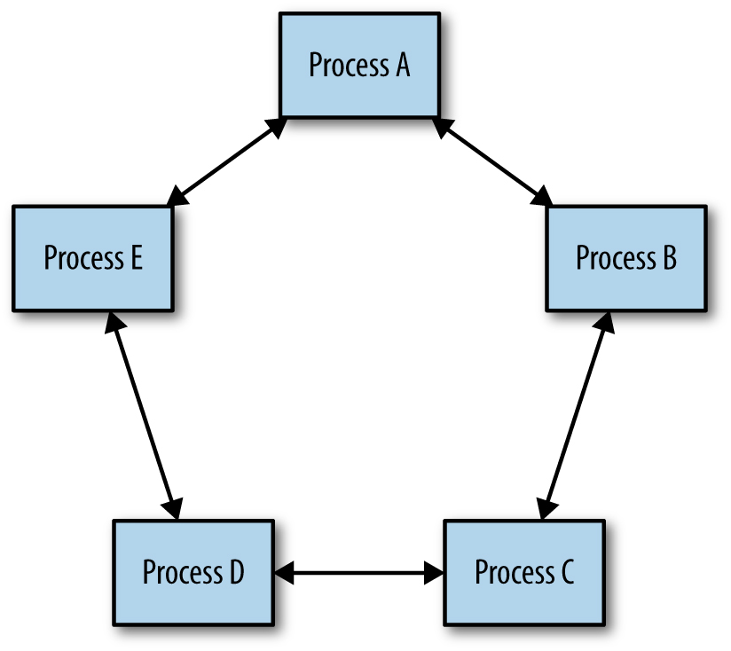

Hình 23-1. Distributed consensus: sự đồng thuận giữa một nhóm các tiến trình

Bất cứ khi nào bạn thấy leader election, trạng thái chia sẻ quan trọng, hay distributed locking, chúng tôi khuyên bạn nên dùng *các hệ thống distributed consensus đã được chứng minh chính thức và thử nghiệm kỹ lưỡng*. Những cách tiếp cận không chính thức để giải quyết bài toán này có thể dẫn đến các sự cố (outage), và, một cách tinh vi hơn, dẫn đến những vấn đề về tính nhất quán dữ liệu vi tế và khó sửa, có thể kéo dài sự cố trong hệ thống của bạn một cách không cần thiết.

## Định lý CAP (CAP Theorem)

Định lý CAP ([\[Fox99\]](https://sre.google/sre-book/bibliography#Fox99), [\[Bre12\]](https://sre.google/sre-book/bibliography#Bre12)) khẳng định rằng một hệ thống phân tán không thể đồng thời có cả ba tính chất sau:

- Các cái nhìn nhất quán về dữ liệu tại mỗi node (nút)
- Khả dụng của dữ liệu tại mỗi node
- Khả năng chịu được việc phân đoạn mạng (network partition) [\[Gil02\]](https://sre.google/sre-book/bibliography#Gil02)

Logic ở đây là trực quan: nếu hai node không thể giao tiếp được (vì mạng bị phân đoạn), thì toàn bộ hệ thống hoặc phải ngừng phục vụ một phần hay toàn bộ các request tại một số hay toàn bộ các node (từ đó làm giảm khả dụng), hoặc nó tiếp tục phục vụ các request như bình thường, điều này dẫn đến những cái nhìn không nhất quán về dữ liệu tại mỗi node.

Bởi vì các network partition là không thể tránh khỏi (cáp bị cắt, gói tin bị mất hoặc bị trễ do tắc nghẽn, phần cứng hỏng, các thành phần mạng bị cấu hình sai, v.v.), việc hiểu distributed consensus thực chất là hiểu cách mà tính nhất quán (consistency) và khả dụng (availability) hoạt động cho ứng dụng cụ thể của bạn. Áp lực thương mại thường đòi hỏi mức độ khả dụng cao, và nhiều ứng dụng đòi hỏi các cái nhìn nhất quán về dữ liệu của chúng.

Các kỹ sư hệ thống và phần mềm thường quen thuộc với ngữ nghĩa datastore truyền thống ACID (Atomicity, Consistency, Isolation, Durability), nhưng một số lượng ngày càng tăng của các công nghệ datastore phân tán cung cấp một bộ ngữ nghĩa khác gọi là BASE (Basically Available, Soft state, Eventual consistency). Các datastore hỗ trợ ngữ nghĩa BASE có những ứng dụng hữu ích cho một số kiểu dữ liệu nhất định và có thể xử lý các khối lượng dữ liệu và giao dịch lớn mà sẽ tốn kém hơn nhiều — và có thể là bất khả thi — với các datastore hỗ trợ ngữ nghĩa ACID.

Hầu hết các hệ thống này hỗ trợ ngữ nghĩa BASE đều dựa vào multimaster replication (nhân bản đa master), trong đó các phép ghi có thể được commit đồng thời đến các tiến trình khác nhau, và có một cơ chế để giải quyết các xung đột (thường đơn giản chỉ là "thời gian gần nhất thắng"). Cách tiếp cận này thường được gọi là *eventual consistency*. Tuy nhiên, eventual consistency có thể dẫn đến những kết quả gây bất ngờ [\[Lu15\]](https://sre.google/sre-book/bibliography#Lu15), đặc biệt là trong trường hợp *clock drift* (điều không thể tránh khỏi trong các hệ thống phân tán) hay network partition [\[Kin15\]](https://sre.google/sre-book/bibliography#Kin15).[1](#fn1)

Các nhà phát triển cũng gặp khó khăn trong việc thiết kế các hệ thống hoạt động tốt với các datastore chỉ hỗ trợ ngữ nghĩa BASE. Jeff Shute [\[Shu13\]](https://sre.google/sre-book/bibliography#Shu13), ví dụ, đã phát biểu: "chúng tôi thấy các nhà phát triển dành một phần đáng kể thời gian để xây dựng những cơ chế cực kỳ phức tạp và dễ sai khi phải đối phó với eventual consistency và xử lý dữ liệu có thể đã lỗi thời. Chúng tôi cho rằng đây là một gánh nặng không thể chấp nhận được đặt lên các nhà phát triển, và các vấn đề nhất quán nên được giải quyết ở tầng database."

Các nhà thiết kế hệ thống không thể hy sinh tính đúng đắn để đạt được độ tin cậy hoặc hiệu năng, đặc biệt là quanh các trạng thái quan trọng. Ví dụ, hãy xét một hệ thống xử lý các giao dịch tài chính: các yêu cầu về độ tin cậy hoặc hiệu năng không mang lại nhiều giá trị nếu dữ liệu tài chính không chính xác. Các hệ thống cần có khả năng đồng bộ hóa tin cậy trạng thái quan trọng qua nhiều tiến trình. Các thuật toán distributed consensus cung cấp chức năng này.

## Động Lực Sử Dụng Consensus: Thất Bại Phối Hợp Trong Hệ Thống Phân Tán (Motivating the Use of Consensus: Distributed Systems Coordination Failure)

Các hệ thống phân tán là phức tạp và vi tế để hiểu, giám sát, và gỡ lỗi. Các kỹ sư vận hành những hệ thống như vậy thường bất ngờ bởi hành vi của chúng trong sự hiện diện của các lỗi. Lỗi là những sự kiện tương đối hiếm, và việc kiểm thử hệ thống trong các điều kiện này không phải là thực hành thông thường. Rất khó để suy luận về hành vi hệ thống khi có lỗi xảy ra. Các network partition đặc biệt gây thách thức — một vấn đề tưởng như do một partition hoàn toàn gây ra thực ra có thể là kết quả của:

- Một mạng rất chậm
- Một số (nhưng không phải tất cả) các tin nhắn bị rơi
- Việc throttle xảy ra theo một hướng nhưng không theo hướng kia

Các phần sau cung cấp những ví dụ về các vấn đề đã xảy ra trong các hệ thống phân tán thực tế và thảo luận về cách mà leader election và các thuật toán distributed consensus có thể được dùng để ngăn chặn những vấn đề như vậy.

## Nghiên Cứu Trường Hợp 1: Vấn Đề Split-Brain (Case Study 1: The Split-Brain Problem)

Một dịch vụ là một kho lưu trữ nội dung cho phép cộng tác giữa nhiều người dùng. Nó sử dụng các bộ gồm hai file server được nhân bản nằm ở các rack khác nhau để đảm bảo độ tin cậy. Dịch vụ cần tránh ghi dữ liệu đồng thời vào cả hai file server trong một bộ, vì làm vậy có thể dẫn đến hư hỏng dữ liệu (và có thể là dữ liệu không thể khôi phục).

Mỗi cặp file server có một leader và một follower. Các server theo dõi nhau qua heartbeat. Nếu một file server không thể liên lạc được với đối tác của nó, nó sẽ phát lệnh STONITH (Shoot The Other Node in the Head — "bắn vào đầu node kia") đến node đối tác để tắt node đó, rồi sau đó tự nhận quyền mastership trên các tệp của nó. Đây là một phương pháp chuẩn trong ngành để giảm các vụ split-brain, mặc dù như chúng ta sẽ thấy, về mặt khái niệm nó không vững chắc.

Điều gì xảy ra nếu mạng trở nên chậm, hoặc bắt đầu làm rơi gói tin? Trong kịch bản này, các file server vượt quá timeout heartbeat của chúng và, theo thiết kế, gửi lệnh STONITH đến các node đối tác rồi tự nhận quyền mastership. Tuy nhiên, một số lệnh có thể không được chuyển đến do mạng đã bị suy giảm. Các cặp file server có thể rơi vào trạng thái mà cả hai node đều được kỳ vọng đang active cho cùng một tài nguyên, hoặc cả hai đều down vì cả hai đều đã phát và nhận lệnh STONITH. Điều này dẫn đến dữ liệu bị hư hỏng hoặc không khả dụng.

Vấn đề ở đây là hệ thống đang cố giải quyết một bài toán leader election bằng các timeout đơn giản. Leader election là một cách phát biểu lại của bài toán nhất trí phân tán bất đồng bộ (asynchronous consensus), và không thể giải đúng bằng cách dùng heartbeat.

## Nghiên Cứu Trường Hợp 2: Failover Yêu Cầu Can Thiệp Con Người (Case Study 2: Failover Requires Human Intervention)

Một hệ thống database được chia shard dày đặc có một primary cho mỗi shard, được nhân bản đồng bộ đến một secondary ở một datacenter khác. Một hệ thống bên ngoài kiểm tra mức độ lành mạnh của các primary, và, nếu chúng không còn lành mạnh, sẽ thăng secondary lên thành primary. Nếu primary không thể xác định được mức độ lành mạnh của secondary, nó sẽ tự làm mình không khả dụng và nâng sự việc lên cho một con người để tránh kịch bản split-brain đã thấy trong Nghiên cứu Trường Hợp 1.

Giải pháp này không gây nguy cơ mất dữ liệu, nhưng nó lại ảnh hưởng tiêu cực đến khả dụng của dữ liệu. Nó cũng làm tăng không cần thiết tải vận hành lên các kỹ sư vận hành hệ thống, và can thiệp của con người không mở rộng tốt. Kiểu sự kiện như vậy, trong đó một primary và secondary gặp vấn đề trong việc giao tiếp, rất có thể xảy ra khi có một vấn đề hạ tầng lớn hơn, lúc mà các kỹ sư ứng phó có thể đã bị quá tải bởi các tác vụ khác. Nếu mạng bị ảnh hưởng nặng đến mức một hệ thống distributed consensus không thể bầu được một master, thì một con người cũng khó mà ở vào vị trí tốt hơn để làm việc đó.

## Nghiên Cứu Trường Hợp 3: Thuật Toán Thành Viên Nhóm Hư Lỗi (Case Study 3: Faulty Group-Membership Algorithms)

Một hệ thống có một thành phần thực hiện các dịch vụ lập index và tìm kiếm. Khi khởi động, các node dùng một giao thức gossip để phát hiện lẫn nhau và gia nhập cluster. Cluster bầu một leader, người thực hiện việc phối hợp. Trong trường hợp một network partition chia đôi cluster, mỗi phía (sai lầm) bầu một master và chấp nhận các ghi và xóa, dẫn đến kịch bản split-brain và hư hỏng dữ liệu.

Vấn đề xác định một cái nhìn nhất quán về thành viên nhóm (group membership) xuyên qua một nhóm tiến trình là một trường hợp khác của bài toán distributed consensus.

Thực tế, nhiều vấn đề hệ thống phân tán hóa ra là những phiên bản khác nhau của distributed consensus, bao gồm bầu master, thành viên nhóm, đủ mọi loại khóa và thuê quyền phân tán (leasing), hàng đợi và nhắn tin phân tán tin cậy, và việc duy trì bất kỳ loại trạng thái chia sẻ quan trọng nào phải được nhìn một cách nhất quán xuyên qua một nhóm tiến trình. Tất cả những vấn đề này chỉ nên được giải bằng các thuật toán distributed consensus đã được chứng minh đúng đắn một cách chính thức, và các bản cài đặt của chúng đã được thử nghiệm rộng rãi. Các phương pháp tự phát (ad hoc) để giải các kiểu vấn đề này (như heartbeat và giao thức gossip) sẽ luôn có vấn đề về độ tin cậy trên thực tế.

## Cách Distributed Consensus Hoạt Động (How Distributed Consensus Works)

Bài toán consensus có nhiều biến thể. Khi làm việc với các hệ thống phần mềm phân tán, chúng ta quan tâm đến *asynchronous distributed consensus* (nhất trí phân tán bất đồng bộ), áp dụng cho các môi trường có độ trễ truyền tin nhắn có thể không bị giới hạn. (*Synchronous consensus* áp dụng cho các hệ thống thời gian thực, trong đó phần cứng chuyên dụng đảm bảo rằng các tin nhắn luôn được truyền đi với các cam kết về thời điểm cụ thể.)

Các thuật toán distributed consensus có thể là *crash-fail* (giả định rằng các node đã crash sẽ không bao giờ quay lại hệ thống) hoặc *crash-recover* (crash rồi phục hồi). Các thuật toán crash-recover hữu ích hơn nhiều, bởi vì hầu hết các vấn đề trong các hệ thống thực có tính chất nhất thời do mạng chậm, việc khởi động lại, v.v.

Các thuật toán có thể xử lý các lỗi Byzantine hoặc phi-Byzantine. *Byzantine failure* xảy ra khi một tiến trình truyền đi những tin nhắn sai do bug hoặc hoạt động ác ý; nó tương đối tốn kém để xử lý và ít gặp hơn.

Về mặt kỹ thuật, việc giải bài toán asynchronous distributed consensus trong thời gian có giới hạn là bất khả thi. Như đã được chứng minh bởi *kết quả bất khả thi FLP* đạt giải Dijkstra Prize [\[Fis85\]](https://sre.google/sre-book/bibliography#Fis85), không có thuật toán asynchronous distributed consensus nào có thể đảm bảo tiến triển trong sự hiện diện của một mạng không tin cậy.

Trong thực tế, chúng ta tiến gần đến bài toán distributed consensus trong thời gian có giới hạn bằng cách đảm bảo rằng hệ thống có đủ các bản sao (replica) lành mạnh và kết nối mạng để tiến triển một cách tin cậy trong phần lớn thời gian. Ngoài ra, hệ thống nên có các backoff với độ trễ ngẫu nhiên. Cách thiết lập này vừa ngăn các lần thử lại gây ra các hiệu ứng dây chuyền, vừa tránh được vấn đề dueling proposers (các proposer đấu nhau) được mô tả sau trong chương này. Các giao thức đảm bảo an toàn (safety), và độ dự phòng đủ trong hệ thống khuyến khích hoạt động sống (liveness).

Giải pháp ban đầu cho bài toán distributed consensus là giao thức Paxos của Lamport [\[Lam98\]](https://sre.google/sre-book/bibliography#Lam98), nhưng cũng có các giao thức khác giải quyết bài toán này, bao gồm Raft [\[Ong14\]](https://sre.google/sre-book/bibliography#Ong14), Zab [\[Jun11\]](https://sre.google/sre-book/bibliography#Jun11), và Mencius [\[Mao08\]](https://sre.google/sre-book/bibliography#Mao08). Chính Paxos cũng có nhiều biến thể nhằm tăng hiệu năng [\[Zoo14\]](https://sre.google/sre-book/bibliography#Zoo14). Những biến thể này thường chỉ khác nhau ở một chi tiết duy nhất, chẳng hạn như trao một vai trò leader đặc biệt cho một tiến trình để đơn giản hóa giao thức.

## Tổng Quan Về Paxos: Một Giao Thức Ví Dụ (Paxos Overview: An Example Protocol)

Paxos hoạt động như một chuỗi các proposal (đề xuất), có thể được hoặc không được chấp nhận bởi đa số các tiến trình trong hệ thống. Nếu một proposal không được chấp nhận, nó thất bại. Mỗi proposal có một sequence number, điều này áp đặt một thứ tự nghiêm ngặt lên tất cả các thao tác trong hệ thống.

Trong giai đoạn đầu tiên của giao thức, proposer gửi một sequence number đến các acceptor (người chấp nhận). Mỗi acceptor chỉ chấp nhận proposal nếu nó chưa thấy một proposal nào có sequence number cao hơn. Các proposer có thể thử lại với một sequence number cao hơn nếu cần. Các proposer phải dùng các sequence number duy nhất (lấy từ các tập rời nhau, hoặc ghép tên máy chủ vào sequence number, chẳng hạn).

Nếu một proposer nhận được sự đồng ý từ đa số các acceptor, nó có thể commit proposal bằng cách gửi một tin nhắn commit kèm theo một giá trị.

Việc định thứ tự nghiêm ngặt của các proposal giải quyết mọi vấn đề liên quan đến thứ tự của các tin nhắn trong hệ thống. Yêu cầu cần một đa số (quorum) để commit có nghĩa là không thể commit hai giá trị khác nhau cho cùng một proposal, bởi vì bất kỳ hai đa số nào cũng sẽ chồng lấn nhau trên ít nhất một node. Các acceptor phải ghi một journal vào bộ lưu trữ bền vững mỗi khi chúng chấp nhận một proposal, bởi vì các acceptor cần tuân thủ những cam kết này sau khi khởi động lại.

Paxos riêng lẻ thì không có ích gì mấy: nó chỉ cho phép bạn đồng thuận về một giá trị và một số proposal một lần. Bởi vì chỉ cần một quorum các node phải đồng ý về một giá trị, nên một node bất kỳ có thể không có một cái nhìn đầy đủ về tập các giá trị đã được đồng thuận. Sự giới hạn này đúng cho hầu hết các thuật toán distributed consensus.

## Các Mẫu Kiến Trúc Hệ Thống Cho Distributed Consensus (System Architecture Patterns for Distributed Consensus)

Các thuật toán distributed consensus là ở tầng thấp và nguyên thủy: chúng đơn giản cho phép một tập các node đồng ý về một giá trị, một lần. Chúng không ánh xạ tốt sang các tác vụ thiết kế thực tế. Điều làm cho distributed consensus hữu ích là việc bổ sung các thành phần hệ thống ở tầng cao hơn như datastore, kho cấu hình, hàng đợi, khóa, và các dịch vụ bầu leader, nhằm cung cấp các chức năng hệ thống thực tiễn mà các thuật toán distributed consensus không giải quyết. Việc dùng các thành phần ở tầng cao hơn làm giảm độ phức tạp cho các nhà thiết kế hệ thống. Nó cũng cho phép thay đổi các thuật toán distributed consensus bên dưới nếu cần, để đáp ứng các thay đổi trong môi trường mà hệ thống chạy hoặc các thay đổi về các yêu cầu phi chức năng.

Nhiều hệ thống sử dụng thành công các thuật toán consensus thực ra làm vậy với tư cách là client của một số dịch vụ nào đó cài đặt các thuật toán ấy, chẳng hạn như ZooKeeper, Consul, và etcd. ZooKeeper [\[Hun10\]](https://sre.google/sre-book/bibliography#Hun10) là hệ thống consensus mã nguồn mở đầu tiên được giới công nghiệp chấp nhận rộng rãi vì nó dễ sử dụng, ngay cả với các ứng dụng không được thiết kế để dùng distributed consensus. Dịch vụ Chubby lấp đầy một ngách tương tự tại Google. Các tác giả của nó chỉ ra [\[Bur06\]](https://sre.google/sre-book/bibliography#Bur06) rằng việc cung cấp các nguyên thủy consensus dưới dạng một dịch vụ, thay vì dưới dạng các thư viện mà các kỹ sư nhúng vào ứng dụng của họ, giải phóng các nhà duy trì ứng dụng khỏi việc phải triển khai hệ thống của họ theo cách tương thích với một dịch vụ consensus khả dụng cao (chạy đúng số lượng bản sao, xử lý thành viên nhóm, xử lý hiệu năng, v.v.).

## Các Máy Trạng Thái Nhân Bản Tin Cậy (Reliable Replicated State Machines)

Một *replicated state machine* (máy trạng thái nhân bản, RSM) là một hệ thống thực thi cùng một tập các thao tác, theo cùng một thứ tự, trên nhiều tiến trình. RSM là khối xây dựng nền tảng của các thành phần và dịch vụ hệ thống phân tán hữu ích như lưu trữ dữ liệu hoặc cấu hình, khóa, và bầu leader (được mô tả chi tiết hơn sau đây).

Các thao tác trên một RSM được định thứ tự toàn cầu thông qua một thuật toán consensus. Đây là một khái niệm mạnh mẽ: một số bài báo ([\[Agu10\]](https://sre.google/sre-book/bibliography#Agu10), [\[Kir08\]](https://sre.google/sre-book/bibliography#Kir08), [\[Sch90\]](https://sre.google/sre-book/bibliography#Sch90)) chỉ ra rằng bất kỳ chương trình nào tất định (deterministic) đều có thể được cài đặt như một dịch vụ nhân bản khả dụng cao.

Như được thể hiện trong [Hình 23-2](#hinh-23-2), các máy trạng thái nhân bản là một hệ thống được cài đặt ở một tầng logic phía trên thuật toán consensus. Thuật toán consensus lo việc đồng thuận về thứ tự các thao tác, và RSM thực thi các thao tác theo thứ tự đó. Bởi vì không phải mọi thành viên của nhóm consensus đều nhất thiết là thành viên của mỗi quorum consensus, nên các RSM có thể cần đồng bộ hóa trạng thái từ các tiến trình cùng cấp (peer). Như được mô tả bởi Kirsch và Amir [\[Kir08\]](https://sre.google/sre-book/bibliography#Kir08), bạn có thể dùng một *giao thức cửa sổ trượt* để đối chiếu trạng thái giữa các tiến trình cùng cấp trong một RSM.

        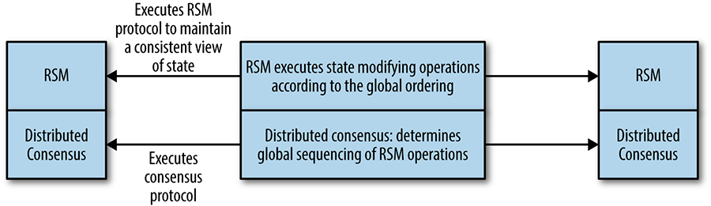

Hình 23-2. Mối quan hệ giữa các thuật toán consensus và các máy trạng thái nhân bản

## Các Kho Dữ Liệu Nhân Bản và Kho Cấu Hình Tin Cậy (Reliable Replicated Datastores and Configuration Stores)

Các datastore nhân bản tin cậy là một ứng dụng của các máy trạng thái nhân bản. Các datastore nhân bản dùng các thuật toán consensus trên đường dẫn quan trọng (critical path) của công việc của chúng. Vì vậy, hiệu năng, thông lượng (throughput), và khả năng mở rộng là rất quan trọng trong kiểu thiết kế này. Tương tự các datastore được xây bằng các công nghệ bên dưới khác, các datastore dựa trên consensus có thể cung cấp một loạt các ngữ nghĩa nhất quán cho các thao tác đọc, điều này tạo ra khác biệt rất lớn đối với cách datastore mở rộng. Những sự đánh đổi này được thảo luận trong [Hiệu Năng Distributed Consensus](#hieu-nang-distributed-consensus).

Các hệ thống khác (không dựa trên distributed consensus) thường đơn giản dựa vào các timestamp để cung cấp các cận về độ tuổi của dữ liệu được trả về. Timestamp gây vấn đề rất lớn trong các hệ thống phân tán vì không thể đảm bảo rằng các đồng hồ được đồng bộ xuyên qua nhiều máy. Spanner [\[Cor12\]](https://sre.google/sre-book/bibliography#Cor12) giải quyết vấn đề này bằng cách mô hình hóa sự không chắc chắn trong trường hợp xấu nhất và làm chậm việc xử lý ở những nơi cần thiết để giải quyết sự không chắc chắn đó.

## Xử Lý Khả Dụng Cao Dùng Việc Bầu Leader (Highly Available Processing Using Leader Election)

Leader election trong các hệ thống phân tán là một bài toán tương đương với distributed consensus. Các dịch vụ nhân bản dùng một leader duy nhất để thực hiện một kiểu công việc cụ thể trong hệ thống là rất phổ biến; cơ chế leader đơn là một cách để đảm bảo loại trừ lẫn nhau (mutual exclusion) ở cấp độ thô.

Kiểu thiết kế này phù hợp khi mà công việc của leader dịch vụ có thể được thực hiện bởi một tiến trình hoặc được chia shard. Các nhà thiết kế hệ thống có thể xây dựng một dịch vụ khả dụng cao bằng cách viết nó như thể nó là một chương trình đơn giản, nhân bản tiến trình đó và dùng leader election để đảm bảo rằng chỉ có một leader đang làm việc tại bất kỳ thời điểm nào (như được thể hiện trong [Hình 23-3](#hinh-23-3)). Thường thì công việc của leader là điều phối một số lượng worker trong hệ thống. Mẫu này được dùng trong GFS [\[Ghe03\]](https://sre.google/sre-book/bibliography#Ghe03) (đã được thay thế bởi Colossus) và kho key-value Bigtable [\[Cha06\]](https://sre.google/sre-book/bibliography#Cha06).

        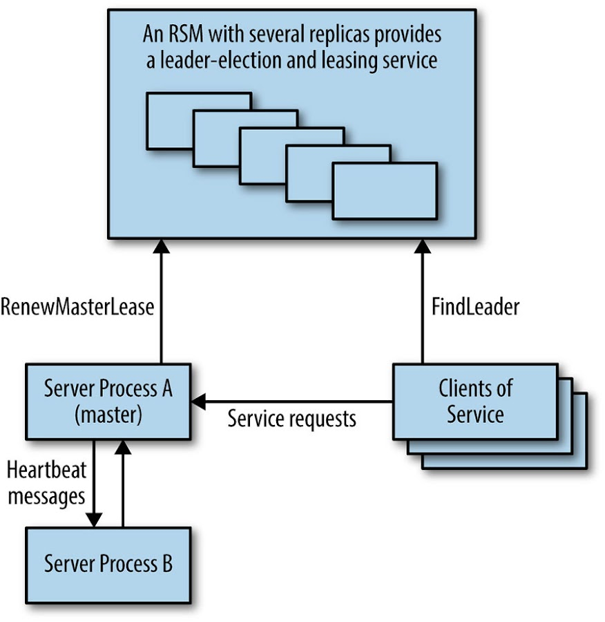

Hình 23-3. Hệ thống khả dụng cao dùng một dịch vụ nhân bản cho việc bầu master

Trong kiểu thành phần này, khác với datastore nhân bản, thuật toán consensus không nằm trên đường dẫn quan trọng của công việc chính mà hệ thống đang làm, nên thông lượng thường không phải là mối quan tâm lớn.

## Các Dịch Vụ Phối Hợp và Khóa Phân Tán (Distributed Coordination and Locking Services)

Một *barrier* (rào chắn) trong một phép tính phân tán là một nguyên thủy chặn một nhóm tiến trình không được tiếp tục cho đến khi một điều kiện nào đó được thỏa mãn (ví dụ, cho đến khi tất cả các phần của một giai đoạn trong một phép tính được hoàn thành). Việc dùng một barrier thực chất chia một phép tính phân tán thành các giai đoạn logic. Ví dụ, như được thể hiện trong [Hình 23-4](#hinh-23-4), một barrier có thể được dùng trong việc cài đặt mô hình MapReduce [\[Dea04\]](https://sre.google/sre-book/bibliography#Dea04) để đảm bảo rằng toàn bộ giai đoạn Map được hoàn thành trước khi phần Reduce của phép tính tiếp tục.

        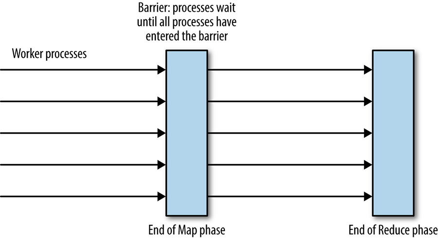

Hình 23-4. Các barrier để phối hợp tiến trình trong phép tính MapReduce

Barrier có thể được cài đặt bằng một tiến trình điều phối (coordinator) đơn, nhưng bản cài đặt này thêm một điểm lỗi đơn lẻ (single point of failure) thường không thể chấp nhận được. Barrier cũng có thể được cài đặt như một RSM. Dịch vụ consensus ZooKeeper có thể cài đặt mẫu barrier: xem [\[Hun10\]](https://sre.google/sre-book/bibliography#Hun10) và [\[Zoo14\]](https://sre.google/sre-book/bibliography#Zoo14).

*Lock* là một nguyên thủy phối hợp hữu ích khác có thể được cài đặt như một RSM. Hãy xét một hệ thống phân tán trong đó các tiến trình worker tiêu thụ một cách nguyên tử một số tệp đầu vào và ghi các kết quả. Các distributed lock có thể được dùng để ngăn nhiều worker xử lý cùng một tệp đầu vào. Trên thực tế, việc dùng các lease có thể làm mới kèm timeout thay vì các khóa vô hạn là điều thiết yếu, vì làm vậy ngăn các khóa bị giữ vô thời hạn bởi những tiến trình đã crash. Distributed locking nằm ngoài phạm vi của chương này, nhưng hãy lưu ý rằng distributed lock là một nguyên thủy hệ thống ở tầng thấp nên được dùng một cách cẩn thận. Hầu hết các ứng dụng nên dùng một hệ thống ở tầng cao hơn cung cấp các giao dịch phân tán.

## Hàng Đợi và Nhắn Tin Phân Tán Tin Cậy (Reliable Distributed Queuing and Messaging)

Hàng đợi (queue) là một cấu trúc dữ liệu phổ biến, thường được dùng như một cách để phân phối các tác vụ giữa một số tiến trình worker.

Các hệ thống dựa trên hàng đợi có thể chịu được việc thất bại và mất các node worker tương đối dễ dàng. Tuy nhiên, hệ thống phải đảm bảo rằng các tác vụ đã được nhận (claimed) được xử lý thành công. Vì mục đích đó, một *hệ thống lease* (được thảo luận trước đó liên quan đến khóa) được khuyến nghị thay vì việc xóa thẳng khỏi hàng đợi. Điểm bất lợi của các hệ thống dựa trên hàng đợi là việc mất hàng đợi khiến toàn bộ hệ thống không thể hoạt động. Việc cài đặt hàng đợi như một RSM có thể làm giảm thiểu rủi ro và làm toàn bộ hệ thống bền bỉ hơn nhiều.

*Atomic broadcast* là một nguyên thủy hệ thống phân tán trong đó các tin nhắn được nhận một cách tin cậy và theo cùng một thứ tự bởi tất cả các bên tham gia. Đây là một khái niệm hệ thống phân tán cực kỳ mạnh mẽ và rất hữu ích trong việc thiết kế các hệ thống thực tiễn. Có một số lượng lớn các cơ sở hạ tầng nhắn tin publish-subscribe cho các nhà thiết kế hệ thống sử dụng, mặc dù không phải tất cả đều cung cấp các bảo đảm nguyên tử. Chandra và Toueg [\[Cha96\]](https://sre.google/sre-book/bibliography#Cha96) chứng minh tính tương đương giữa atomic broadcast và consensus.

Mẫu *queuing-as-work-distribution* (hàng đợi như cơ chế phân phối công việc), dùng hàng đợi như một thiết bị cân bằng tải, như được thể hiện trong [Hình 23-5](#hinh-23-5), có thể được coi là nhắn tin điểm-đến-điểm. Các hệ thống nhắn tin thường cũng cài đặt một hàng đợi publish-subscribe, trong đó các tin nhắn có thể được tiêu thụ bởi nhiều client đã đăng ký một kênh hoặc chủ đề. Trong trường hợp một-đến-nhiều này, các tin nhắn trên hàng đợi được lưu trữ dưới dạng một danh sách có thứ tự bền vững. Các hệ thống publish-subscribe có thể được dùng cho nhiều loại ứng dụng đòi hỏi các client đăng ký để nhận thông báo về một kiểu sự kiện nào đó. Các hệ thống publish-subscribe cũng có thể được dùng để cài đặt các cache phân tán nhất quán.

        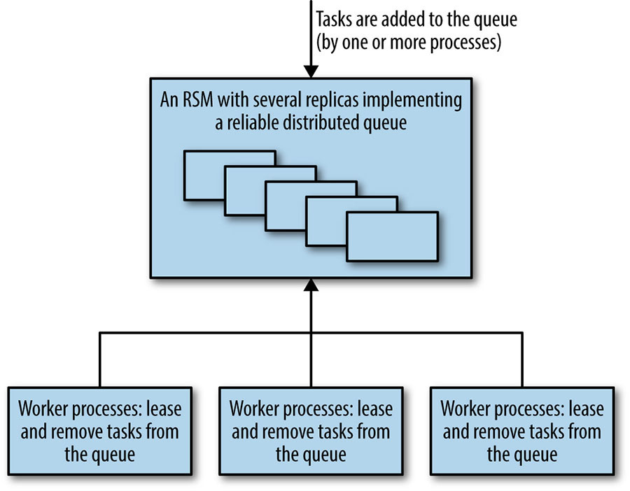

Hình 23-5. Hệ thống phân phối công việc hướng hàng đợi dùng một thành phần hàng đợi dựa trên consensus tin cậy

Các hệ thống hàng đợi và nhắn tin thường cần một thông lượng xuất sắc, nhưng không cần độ trễ (latency) cực thấp (do ít khi trực tiếp tiếp xúc người dùng). Tuy nhiên, các độ trễ rất cao trong một hệ thống như vừa mô tả, trong đó có nhiều worker nhận các tác vụ từ một hàng đợi, có thể trở thành vấn đề nếu thời gian xử lý cho mỗi tác vụ tăng đáng kể.

## Hiệu Năng Distributed Consensus (Distributed Consensus Performance)

Quan niệm thông thường cho rằng các thuật toán consensus là quá chậm và tốn kém để dùng cho nhiều hệ thống đòi hỏi thông lượng cao *và* độ trễ thấp [\[Bol11\]](https://sre.google/sre-book/bibliography#Bol11). Quan niệm này đơn giản là không đúng — trong khi các bản cài đặt có thể chậm, có một số thủ thuật có thể cải thiện hiệu năng. Các thuật toán distributed consensus nằm ở trung tâm của nhiều hệ thống quan trọng của Google, được mô tả trong [\[Ana13\]](https://sre.google/sre-book/bibliography#Ana13), [\[Bur06\]](https://sre.google/sre-book/bibliography#Bur06), [\[Cor12\]](https://sre.google/sre-book/bibliography#Cor12), và [\[Shu13\]](https://sre.google/sre-book/bibliography#Shu13), và chúng đã chứng tỏ cực kỳ hiệu quả trên thực tế. Quy mô của Google không phải là một lợi thế ở đây; thực tế, quy mô của chúng tôi là một bất lợi, vì nó kéo theo hai thách thức chính: các tập dữ liệu của chúng tôi thường lớn và các hệ thống của chúng tôi chạy trải rộng một khoảng cách địa lý lớn. Các tập dữ liệu lớn nhân lên bởi một vài bản sao đại diện cho chi phí tính toán đáng kể, và các khoảng cách địa lý lớn hơn làm tăng độ trễ giữa các bản sao, từ đó làm giảm hiệu năng.

Không có một thuật toán distributed consensus và nhân bản máy trạng thái "tốt nhất" duy nhất cho hiệu năng, vì hiệu năng phụ thuộc vào một số yếu tố liên quan đến khối lượng công việc (workload), các mục tiêu hiệu năng của hệ thống, và cách hệ thống được triển khai.[2](#fn2) Mặc dù một số phần sau trình bày các nghiên cứu nhằm tăng cường hiểu biết về những gì có thể đạt được với distributed consensus, nhưng nhiều hệ thống được mô tả hiện đã có sẵn và đang được sử dụng.

Các *workload* có thể biến đổi theo nhiều cách, và việc hiểu cách chúng có thể biến đổi là then chốt để thảo luận về hiệu năng. Trong trường hợp một hệ thống consensus, workload có thể biến đổi theo các khía cạnh:

- Thông lượng: số lượng các proposal được thực hiện mỗi đơn vị thời gian tại tải đỉnh (peak load)
- Kiểu các request: tỷ lệ các thao tác làm thay đổi trạng thái
- Ngữ nghĩa nhất quán được yêu cầu cho các thao tác đọc
- Kích thước các request, nếu kích thước payload dữ liệu có thể biến đổi

Các chiến lược triển khai cũng khác nhau. Ví dụ:

- Việc triển khai là mạng diện rộng (wide area) hay mạng cục bộ (local area)?
- Các kiểu quorum nào được dùng, và đa số các tiến trình nằm ở đâu?
- Hệ thống có dùng sharding, pipelining, và batching không?

Nhiều hệ thống consensus dùng một tiến trình leader đặc biệt và yêu cầu tất cả các request phải đi đến node đặc biệt này. Như được thể hiện trong [Hình 23-6](#hinh-23-6), hệ quả là hiệu năng của hệ thống như được cảm nhận bởi các client ở các vị trí địa lý khác nhau có thể khác nhau rất nhiều, đơn giản chỉ vì các node xa hơn có thời gian vòng đi-về (round-trip) dài hơn đến tiến trình leader.

        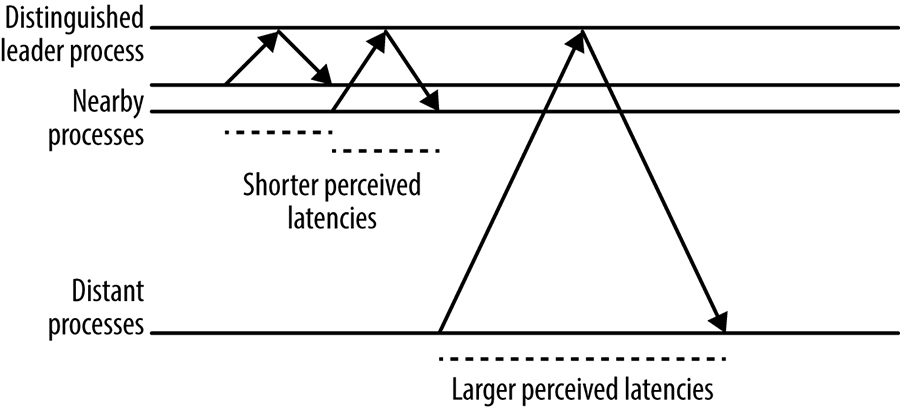

Hình 23-6. Tác động của khoảng cách tới một tiến trình server lên độ trễ cảm nhận tại client

## Multi-Paxos: Luồng Tin Nhắn Chi Tiết (Multi-Paxos: Detailed Message Flow)

Giao thức Multi-Paxos dùng một *strong leader process* (tiến trình leader mạnh): trừ khi một leader chưa được bầu hoặc một sự cố xảy ra, nó chỉ cần một vòng đi-về duy nhất từ proposer đến một quorum các acceptor để đạt được consensus. Việc dùng một tiến trình leader mạnh là tối ưu xét về số tin nhắn phải truyền, và là điển hình của nhiều giao thức consensus.

[Hình 23-7](#hinh-23-7) thể hiện một trạng thái ban đầu với một proposer mới đang thực thi giai đoạn đầu tiên `Prepare`/`Promise` của giao thức. Việc thực thi giai đoạn này thiết lập một view đánh số mới, hay một leader term (nhiệm kỳ leader). Trong các lần thực thi sau của giao thức, khi view vẫn giữ nguyên, giai đoạn đầu tiên là không cần thiết vì proposer đã thiết lập view có thể đơn giản gửi các tin nhắn `Accept`, và consensus được đạt đến khi nhận được một quorum các phản hồi (bao gồm cả chính proposer).

        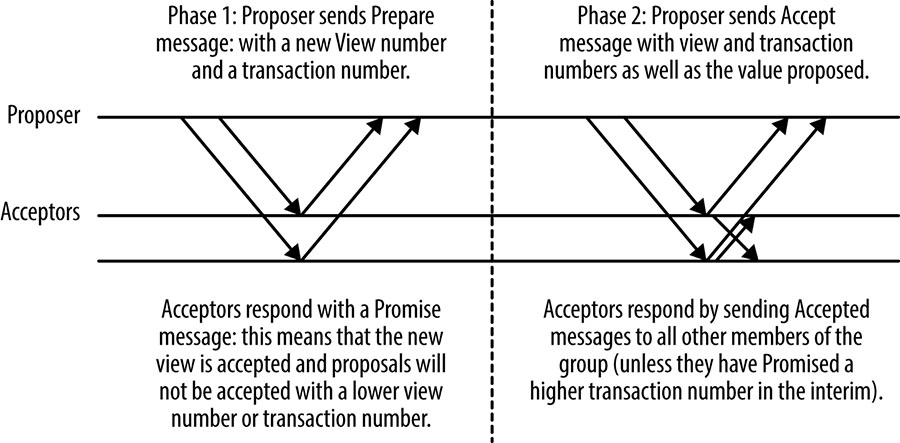

Hình 23-7. Luồng tin nhắn Multi-Paxos cơ bản

Một tiến trình khác trong nhóm có thể đảm nhận vai trò proposer để đề xuất các tin nhắn vào bất kỳ lúc nào, nhưng việc thay đổi proposer có một chi phí hiệu năng. Nó đòi hỏi một vòng đi-về thêm để thực thi Giai đoạn 1 của giao thức, nhưng quan trọng hơn, nó có thể gây ra tình huống *dueling proposers* (các proposer đấu nhau) trong đó các proposal liên tục ngắt nhau và không proposal nào được chấp nhận, như được thể hiện trong [Hình 23-8](#hinh-23-8). Bởi vì kịch bản này là một dạng của livelock, nó có thể tiếp tục vô thời hạn.

        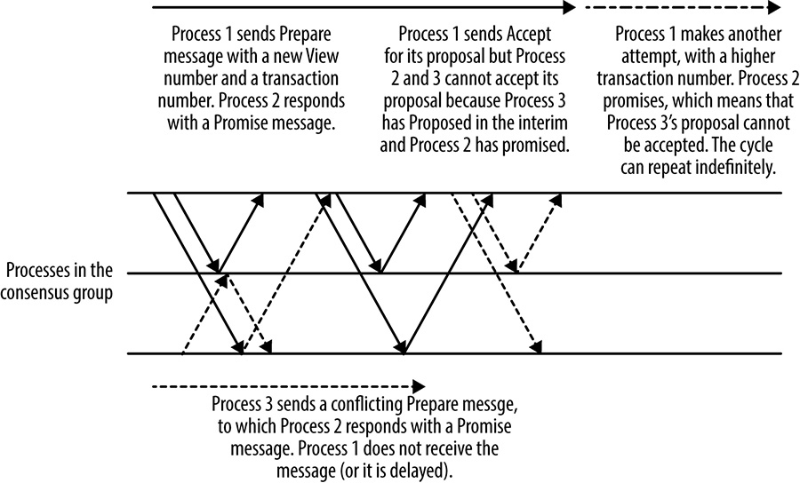

Hình 23-8. Dueling proposers trong Multi-Paxos

Tất cả các hệ thống consensus thực tiễn đều giải quyết vấn đề va chạm này, thường bằng cách bầu một tiến trình proposer thực hiện tất cả các proposal trong hệ thống, hoặc bằng cách dùng một proposer luân phiên (rotating) phân bổ cho mỗi tiến trình các khe (slots) nhất định cho các proposal của nó.

Đối với các hệ thống dùng một tiến trình leader, quá trình bầu leader phải được chỉnh chu cẩn thận để cân bằng giữa việc hệ thống không khả dụng xảy ra khi không có leader với rủi ro dueling proposers. Điều quan trọng là cài đặt các timeout và các chiến lược backoff đúng. Nếu nhiều tiến trình phát hiện ra rằng không có leader và tất cả đều cố trở thành leader cùng lúc, thì không tiến trình nào có khả năng thành công (lại một lần nữa, dueling proposers). Việc đưa vào yếu tố ngẫu nhiên là cách tiếp cận tốt nhất. Raft [\[Ong14\]](https://sre.google/sre-book/bibliography#Ong14), ví dụ, có một phương pháp được suy nghĩ kỹ lưỡng để tiếp cận quá trình bầu leader.

## Mở Rộng Các Workload Nặng Đọc (Scaling Read-Heavy Workloads)

Việc mở rộng workload đọc thường là then chốt vì nhiều workload nặng đọc. Các datastore nhân bản có lợi thế là dữ liệu khả dụng ở nhiều nơi, có nghĩa là nếu không yêu cầu tính nhất quán mạnh (strong consistency) cho tất cả các thao tác đọc, thì dữ liệu có thể được đọc từ *bất kỳ* bản sao nào. Kỹ thuật đọc từ các bản sao này hoạt động tốt cho một số ứng dụng, chẳng hạn như hệ thống Photon của Google [\[Ana13\]](https://sre.google/sre-book/bibliography#Ana13), dùng distributed consensus để phối hợp công việc của nhiều pipeline. Photon dùng một thao tác compare-and-set nguyên tử để sửa đổi trạng thái (lấy cảm hứng từ các bộ đăng ký nguyên tử), thao tác này phải nhất quán một cách tuyệt đối; nhưng các thao tác đọc có thể được phục vụ từ bất kỳ bản sao nào, vì dữ liệu lỗi thời dẫn đến việc thực hiện thêm công việc chứ không phải kết quả sai [\[Gup15\]](https://sre.google/sre-book/bibliography#Gup15). Sự đánh đổi này là đáng giá.

Để đảm bảo rằng dữ liệu đang được đọc là cập nhật và nhất quán với bất kỳ thay đổi nào được thực hiện trước khi thao tác đọc diễn ra, cần thực hiện một trong những điều sau:

- Thực hiện một thao tác consensus chỉ-đọc (read-only).
- Đọc dữ liệu từ một bản sao được đảm bảo là mới nhất. Trong một hệ thống dùng một tiến trình leader ổn định (như nhiều bản cài đặt distributed consensus làm), leader có thể cung cấp sự đảm bảo này.
- Dùng các quorum lease, trong đó một số bản sao được cấp một lease trên toàn bộ hoặc một phần dữ liệu trong hệ thống, cho phép các thao tác đọc cục bộ nhất quán mạnh với chi phí là một chút hiệu năng ghi. Kỹ thuật này được thảo luận chi tiết trong phần tiếp theo.

## Quorum Lease (Quorum Leases)

Quorum lease [\[Mor14\]](https://sre.google/sre-book/bibliography#Mor14) là một tối ưu hóa hiệu năng distributed consensus được phát triển gần đây nhằm giảm độ trễ và tăng thông lượng cho các thao tác đọc. Như đã đề cập trước đó, trong trường hợp của Paxos cổ điển và hầu hết các giao thức distributed consensus khác, việc thực hiện một thao tác đọc nhất quán mạnh (tức là thao tác được đảm bảo có cái nhìn mới nhất về trạng thái) đòi hỏi hoặc một thao tác distributed consensus đọc từ một quorum các bản sao, hoặc một bản sao leader ổn định được đảm bảo đã thấy tất cả các thao tác thay đổi trạng thái gần đây. Trong nhiều hệ thống, số lượng thao tác đọc vượt xa số thao tác ghi, nên sự phụ thuộc vào hoặc một thao tác phân tán hoặc một bản sao đơn làm hại độ trễ và thông lượng hệ thống.

Kỹ thuật quorum leasing đơn giản cấp một read lease (ủy quyền đọc) trên một tập con nào đó của trạng thái datastore nhân bản cho một quorum các bản sao. Lease này có hiệu lực trong một khoảng thời gian cụ thể (thường ngắn). Bất kỳ thao tác nào làm thay đổi trạng thái của dữ liệu đó phải được tất cả các bản sao trong quorum đọc xác nhận. Nếu bất kỳ bản sao nào trong số này trở nên không khả dụng, dữ liệu không thể được sửa đổi cho đến khi lease hết hạn.

Quorum lease đặc biệt hữu ích cho các workload nặng đọc, trong đó các thao tác đọc cho các tập con cụ thể của dữ liệu tập trung ở một khu vực địa lý duy nhất.

## Hiệu Năng Distributed Consensus và Độ Trễ Mạng (Distributed Consensus Performance and Network Latency)

Các hệ thống consensus đối mặt với hai ràng buộc vật lý lớn về hiệu năng khi commit các thay đổi trạng thái. Một là thời gian vòng đi-về mạng và cái kia là thời gian cần để ghi dữ liệu vào bộ lưu trữ bền vững, điều sẽ được xem xét sau.

Thời gian vòng đi-về mạng biến đổi rất lớn tùy thuộc vào vị trí nguồn và đích, vốn bị ảnh hưởng bởi cả khoảng cách vật lý giữa nguồn và đích, và bởi mức độ tắc nghẽn trên mạng. Trong một datacenter đơn, thời gian vòng đi-về giữa các máy nên ở mức cỡ một mili-giây. Một RTT (thời gian vòng đi-về) điển hình trong nước Mỹ là 45 mili-giây, và từ New York đến London là 70 mili-giây.

Hiệu năng của hệ thống consensus trên một mạng diện cục bộ có thể sánh được với một hệ thống nhân bản leader-follower bất đồng bộ [\[Bol11\]](https://sre.google/sre-book/bibliography#Bol11), kiểu mà nhiều database truyền thống dùng để nhân bản. Tuy nhiên, phần lớn các lợi ích khả dụng của các hệ thống distributed consensus đòi hỏi các bản sao phải "xa nhau" để ở trong các domain lỗi khác nhau.

Nhiều hệ thống consensus dùng TCP/IP làm giao thức truyền thông của chúng. TCP/IP có định hướng kết nối và cung cấp một số bảo đảm độ tin cậy mạnh về thứ tự FIFO của các tin nhắn. Tuy nhiên, việc thiết lập một kết nối TCP/IP mới đòi hỏi một vòng đi-về mạng để thực hiện bắt tay ba bước trước khi bất kỳ dữ liệu nào có thể được gửi hoặc nhận. TCP/IP slow start ban đầu giới hạn băng thông của kết nối cho đến khi các giới hạn của nó được thiết lập. Các kích thước cửa sổ TCP/IP ban đầu dao động từ 4 đến 15 KB.

TCP/IP slow start có lẽ không phải là vấn đề cho các tiến trình tạo thành một nhóm consensus: chúng sẽ thiết lập các kết nối với nhau và giữ các kết nối này mở để dùng lại vì chúng liên lạc thường xuyên. Tuy nhiên, đối với các hệ thống có số lượng client rất cao, có thể không thực tiễn để tất cả các client giữ một kết nối bền vững đến các cluster consensus mở, vì các kết nối TCP/IP mở cũng tiêu tốn một số tài nguyên, ví dụ như các file descriptor, bên cạnh việc tạo ra lưu lượng keepalive. Chi phí này có thể là một vấn đề quan trọng cho các ứng dụng dùng các datastore dựa trên consensus được chia shard rất cao chứa hàng nghìn bản sao và một số lượng client còn lớn hơn. Một giải pháp là dùng một pool các proxy theo khu vực, như được thể hiện trong [Hình 23-9](#hinh-23-9), giữ các kết nối TCP/IP bền vững đến nhóm consensus để tránh chi phí thiết lập trên các khoảng cách dài. Các proxy cũng có thể là một cách tốt để đóng gói các chiến lược sharding và cân bằng tải, cũng như việc khám phá các thành viên và leader của cluster.

        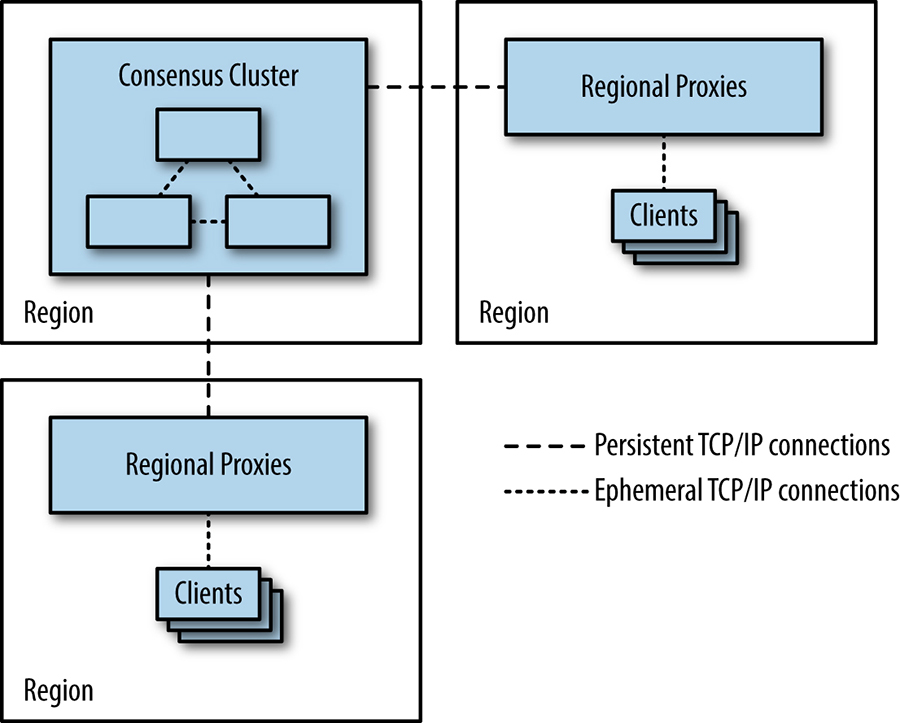

Hình 23-9. Dùng proxy để giảm nhu cầu các client mở kết nối TCP/IP xuyên qua các khu vực

## Suy Luận Về Hiệu Năng: Fast Paxos (Reasoning About Performance: Fast Paxos)

Fast Paxos [\[Lam06\]](https://sre.google/sre-book/bibliography#Lam06) là một phiên bản của thuật toán Paxos được thiết kế để cải thiện hiệu năng của nó trên các mạng diện rộng. Dùng Fast Paxos, mỗi client có thể gửi các tin nhắn `Propose` trực tiếp đến từng thành viên của một nhóm các acceptor, thay vì thông qua một leader, như trong Classic Paxos hoặc Multi-Paxos. Ý tưởng là thay thế một phép gửi tin nhắn song song duy nhất từ client đến tất cả các acceptor trong Fast Paxos cho hai phép gửi tin nhắn trong Classic Paxos:

- Một tin nhắn từ client đến một proposer đơn
- Một phép gửi tin nhắn song song từ proposer đến các bản sao khác

Trực quan, dường như Fast Paxos luôn phải nhanh hơn Classic Paxos. Tuy nhiên, điều đó không đúng: nếu client trong hệ thống Fast Paxos có một RTT cao đến các acceptor, và các acceptor có các kết nối nhanh với nhau, thì chúng ta đã thay thế *N* tin nhắn song song xuyên qua các liên kết mạng chậm hơn (trong Fast Paxos) bằng một tin nhắn xuyên qua liên kết chậm hơn cộng với *N* tin nhắn song song xuyên qua các liên kết nhanh hơn (Classic Paxos). Do hiệu ứng đuôi độ trễ, phần lớn thời gian, một vòng đi-về đơn xuyên qua một liên kết chậm với một phân bố độ trễ sẽ nhanh hơn một quorum (như được thể hiện trong [\[Jun07\]](https://sre.google/sre-book/bibliography#Jun07)), và vì vậy, Fast Paxos chậm hơn Classic Paxos trong trường hợp này.

Nhiều hệ thống gom nhóm (batch) nhiều thao tác vào một giao dịch duy nhất tại acceptor để tăng thông lượng. Việc để các client đóng vai trò proposer cũng khiến việc gom nhóm các proposal trở nên khó khăn hơn rất nhiều. Lý do là các proposal đến các acceptor một cách độc lập, nên bạn không thể gom nhóm chúng theo một cách nhất quán.

## Các Leader Ổn Định (Stable Leaders)

Chúng ta đã thấy cách Multi-Paxos bầu một leader ổn định để cải thiện hiệu năng. Zab [\[Jun11\]](https://sre.google/sre-book/bibliography#Jun11) và Raft [\[Ong14\]](https://sre.google/sre-book/bibliography#Ong14) cũng là những ví dụ về các giao thức bầu một leader ổn định vì lý do hiệu năng. Cách tiếp cận này có thể cho phép các tối ưu hóa đọc, vì leader có trạng thái mới nhất, nhưng cũng có một số vấn đề:

- Tất cả các thao tác thay đổi trạng thái phải được gửi qua leader, một yêu cầu thêm độ trễ mạng cho các client không nằm gần leader.
- Băng thông mạng phát ra của tiến trình leader là một nút thắt (bottleneck) của hệ thống [\[Mao08\]](https://sre.google/sre-book/bibliography#Mao08), vì tin nhắn `Accept` của leader chứa tất cả dữ liệu liên quan đến bất kỳ proposal nào, trong khi các tin nhắn khác chỉ chứa các xác nhận của một giao dịch đánh số mà không có payload dữ liệu.
- Nếu tình cờ leader nằm trên một máy có vấn đề về hiệu năng, thì thông lượng của toàn bộ hệ thống sẽ bị giảm.

Gần như tất cả các hệ thống distributed consensus được thiết kế với hiệu năng làm trung tâm đều dùng hoặc mẫu leader ổn định đơn, hoặc một hệ thống lãnh đạo luân phiên trong đó mỗi thuật toán distributed consensus đánh số được gán trước cho một bản sao (thường bằng một phép lấy dư đơn giản của ID giao dịch). Các thuật toán dùng cách tiếp cận này bao gồm Mencius [\[Mao08\]](https://sre.google/sre-book/bibliography#Mao08) và Egalitarian Paxos [\[Mor12a\]](https://sre.google/sre-book/bibliography#Mor12a).

Trên một mạng diện rộng với các client phân bố theo địa lý và các bản sao của nhóm consensus nằm tương đối gần các client, việc bầu leader như vậy dẫn đến độ trễ cảm nhận thấp hơn cho các client, vì RTT mạng của họ đến bản sao gần nhất sẽ, tính trung bình, nhỏ hơn so với đến một leader bất kỳ.

## Gom Nhóm (Batching)

Việc gom nhóm (batching), như được mô tả trong [Suy Luận Về Hiệu Năng: Fast Paxos](#suy-luan-ve-hieu-nang-fast-paxos), làm tăng thông lượng hệ thống, nhưng nó vẫn để các bản sao nằm chờ trong khi chúng đợi phản hồi cho các tin nhắn chúng đã gửi. Những điểm thiếu hiệu năng do các bản sao nằm chờ có thể được giải quyết bằng *pipelining*, cho phép nhiều proposal đang trong lúc bay (in-flight) cùng lúc. Tối ưu hóa này rất tương tự trường hợp TCP/IP, trong đó giao thức cố gắng "giữ ống đầy" bằng một cách tiếp cận cửa sổ trượt. Pipelining thường được dùng kết hợp với gom nhóm.

Các nhóm request trong đường ống vẫn được định thứ tự toàn cầu bằng một view number và một transaction number, nên phương pháp này không vi phạm các tính chất định thứ tự toàn cầu cần thiết để chạy một máy trạng thái nhân bản. Phương pháp tối ưu hóa này được thảo luận trong [\[Bol11\]](https://sre.google/sre-book/bibliography#Bol11) và [\[San11\]](https://sre.google/sre-book/bibliography#San11).

## Truy Cập Ổ Đĩa (Disk Access)

Việc ghi nhật ký vào bộ lưu trữ bền vững là bắt buộc để một node, sau khi crash và quay lại cluster, tuân thủ bất kỳ cam kết trước đó nào nó đã thực hiện liên quan đến các giao dịch consensus đang diễn ra. Trong giao thức Paxos, ví dụ, các acceptor không thể chấp nhận một proposal khi chúng đã chấp nhận một proposal có sequence number cao hơn. Nếu chi tiết của các proposal đã đồng ý và đã commit không được ghi nhật ký vào bộ lưu trữ bền vững, thì một acceptor có thể vi phạm giao thức nếu nó crash và được khởi động lại, dẫn đến trạng thái không nhất quán.

Thời gian cần để ghi một mục vào một log trên đĩa biến đổi rất lớn tùy thuộc vào phần cứng hoặc môi trường ảo hóa được dùng, nhưng có khả năng nằm giữa một và vài mili-giây.

Luồng tin nhắn cho Multi-Paxos đã được thảo luận trong [Multi-Paxos: Luồng Tin Nhắn Chi Tiết](#multi-paxos-luon-tin-nhan-chi-tiet), nhưng phần này không cho thấy nơi mà giao thức phải ghi các thay đổi trạng thái ra đĩa. Một phép ghi đĩa phải xảy ra bất cứ khi nào một tiến trình thực hiện một cam kết mà nó phải tuân thủ. Trong giai đoạn thứ hai quan trọng về hiệu năng của Multi-Paxos, các điểm này xảy ra trước khi một acceptor gửi một tin nhắn `Accepted` để phản hồi một proposal, và trước khi proposer gửi tin nhắn `Accept`, vì tin nhắn `Accept` này cũng là một tin nhắn `Accepted` ngầm (implicit) [\[Lam98\]](https://sre.google/sre-book/bibliography#Lam98).

Điều này có nghĩa là độ trễ cho một thao tác consensus đơn bao gồm những điều sau:

- Một phép ghi đĩa trên proposer
- Các tin nhắn song song đến các acceptor
- Các phép ghi đĩa song song tại các acceptor
- Các tin nhắn trả về

Có một phiên bản của [giao thức Multi-Paxos](https://sre.google/sre-book/distributed-periodic-scheduling/) hữu ích cho các trường hợp mà thời gian ghi đĩa chi phối: biến thể này không coi tin nhắn `Accept` của proposer là một tin nhắn `Accepted` ngầm. Thay vào đó, proposer ghi ra đĩa song song với các tiến trình khác và gửi một tin nhắn `Accept` tường minh. Độ trễ khi đó trở nên tỷ lệ với thời gian cần để gửi hai tin nhắn và để một quorum các tiến trình thực thi một phép ghi đồng bộ ra đĩa một cách song song.

Nếu độ trễ để thực hiện một phép ghi ngẫu nhiên nhỏ ra đĩa ở mức cỡ 10 mili-giây, thì tốc độ các thao tác consensus sẽ bị giới hạn ở khoảng 100 thao tác mỗi giây. Những con số thời gian này giả định rằng thời gian vòng đi-về mạng là không đáng kể và proposer thực hiện việc ghi nhật ký của nó song song với các acceptor.

Như chúng ta đã thấy, các thuật toán distributed consensus thường được dùng làm nền tảng để xây dựng một máy trạng thái nhân bản. Các RSM cũng cần giữ các log giao dịch cho mục đích phục hồi (vì cùng các lý do như bất kỳ datastore nào). Log của thuật toán consensus và log giao dịch của RSM có thể được gộp vào một log duy nhất. Việc gộp các log này tránh được nhu cầu liên tục chuyển đổi giữa việc ghi vào hai vị trí vật lý khác nhau trên đĩa [\[Bol11\]](https://sre.google/sre-book/bibliography#Bol11), làm giảm thời gian dành cho các thao tác seek. Các ổ đĩa có thể duy trì nhiều thao tác mỗi giây hơn và vì vậy, toàn bộ hệ thống có thể thực hiện nhiều giao dịch hơn.

Trong một datastore, các ổ đĩa có các mục đích ngoài việc duy trì log: trạng thái hệ thống thường được duy trì trên đĩa. Các phép ghi log phải được đẩy (flush) trực tiếp ra đĩa, nhưng các phép ghi cho các thay đổi trạng thái có thể được viết vào một cache bộ nhớ và được đẩy ra đĩa sau, được sắp xếp lại để dùng lịch trình hiệu quả nhất [\[Bol11\]](https://sre.google/sre-book/bibliography#Bol11).

Một tối ưu hóa khả dĩ khác là gom nhóm nhiều thao tác của client lại thành một thao tác duy nhất tại proposer ([\[Ana13\]](https://sre.google/sre-book/bibliography#Ana13), [\[Bol11\]](https://sre.google/sre-book/bibliography#Bol11), [\[Cha07\]](https://sre.google/sre-book/bibliography#Cha07), [\[Jun11\]](https://sre.google/sre-book/bibliography#Jun11), [\[Mao08\]](https://sre.google/sre-book/bibliography#Mao08), [\[Mor12a\]](https://sre.google/sre-book/bibliography#Mor12a)). Điều này trung bình hóa các chi phí cố định của việc ghi nhật ký đĩa và độ trễ mạng trên một số lượng thao tác lớn hơn, tăng thông lượng.

## Triển Khai Các Hệ Thống Dựa Trên Distributed Consensus (Deploying Distributed Consensus-Based Systems)

Những quyết định quan trọng nhất mà các nhà thiết kế hệ thống phải đưa ra khi triển khai một hệ thống dựa trên consensus liên quan đến số lượng replica cần triển khai và vị trí của các replica đó.

## Số Lượng Bản Sao (Number of Replicas)

Nói chung, các hệ thống dựa trên consensus vận hành bằng *majority quorums* (quorum đa số), tức là một nhóm 2f + 1 bản sao có thể chịu được f lỗi (nếu cần Byzantine fault tolerance, trong đó hệ thống có khả năng chống lại các bản sao trả về kết quả sai, thì 3f + 1 bản sao có thể chịu được f lỗi [\[Cas99\]](https://sre.google/sre-book/bibliography#Cas99)). Đối với các lỗi phi-Byzantine, số lượng bản sao tối thiểu có thể triển khai là ba — nếu chỉ triển khai hai, thì không có khả năng chịu lỗi của bất kỳ tiến trình nào. Ba bản sao có thể chịu được một lỗi. Phần lớn thời gian ngừng của hệ thống là kết quả của việc bảo trì có kế hoạch [\[Ken12\]](https://sre.google/sre-book/bibliography#Ken12): ba bản sao cho phép hệ thống hoạt động bình thường khi một bản sao down để bảo trì (giả định rằng hai bản sao còn lại có thể xử lý tải hệ thống ở một hiệu năng chấp nhận được).

Nếu một sự cố không theo kế hoạch xảy ra trong cửa sổ bảo trì, thì hệ thống consensus trở nên không khả dụng. Sự không khả dụng của hệ thống consensus thường không thể chấp nhận được, và vì vậy nên chạy năm bản sao, cho phép hệ thống vận hành với tối đa hai lỗi. Không nhất thiết phải can thiệp nếu bốn trên năm bản sao trong một hệ thống consensus còn lại, nhưng nếu chỉ còn ba, nên thêm một hoặc hai bản sao nữa.

Nếu một hệ thống consensus mất nhiều bản sao đến mức nó không thể tạo thành một quorum, thì hệ thống đó, về mặt lý thuyết, ở trong một trạng thái không thể khôi phục được, vì log bền vững của ít nhất một bản sao bị mất không thể được truy cập. Nếu không còn quorum nào, có khả năng một quyết định chỉ được nhìn thấy bởi các bản sao bị mất đã được đưa ra. Các quản trị viên có thể buộc thay đổi thành viên nhóm và thêm các bản sao mới bắt kịp từ một bản sao hiện có để tiếp tục, nhưng khả năng mất dữ liệu luôn còn đó — một tình huống nên tránh nếu có thể.

Trong một thảm họa, các quản trị viên phải quyết định liệu có thực hiện một cấu hình lại cưỡng bức như vậy hay không, hoặc chờ một khoảng thời gian nào đó để các máy có trạng thái hệ thống trở nên khả dụng. Khi các quyết định như vậy được đưa ra, việc xử lý log của hệ thống (bên cạnh giám sát) trở nên quan trọng. Các bài báo lý thuyết thường chỉ ra rằng consensus có thể được dùng để xây dựng một log nhân bản, nhưng lại không thảo luận cách xử lý các bản sao có thể bị lỗi và phục hồi (và do đó bỏ lỡ một chuỗi các quyết định consensus) hoặc bị chậm do sự chậm chạp. Để duy trì sự bền bỉ của hệ thống, điều quan trọng là các bản sao này phải bắt kịp.

*Replicated log* không phải lúc nào cũng là một công dân hạng nhất trong lý thuyết distributed consensus, nhưng nó là một khía cạnh rất quan trọng của các hệ thống sản xuất. Raft mô tả một phương pháp để quản lý tính nhất quán của các log nhân bản [\[Ong14\]](https://sre.google/sre-book/bibliography#Ong14) bằng cách xác định rõ ràng cách các khoảng trống trong log của một bản sao được lấp đầy. Nếu một hệ thống Raft năm instance mất tất cả các thành viên của nó trừ leader, leader vẫn được đảm bảo có đầy đủ kiến thức về tất cả các quyết định đã commit. Mặt khác, nếu đa số các thành viên bị thiếu bao gồm cả leader, không thể đưa ra các đảm bảo mạnh về mức độ cập nhật của các bản sao còn lại.

Có một mối quan hệ giữa hiệu năng và số lượng bản sao trong một hệ thống mà không cần phải là một phần của quorum: một thiểu số các bản sao chậm hơn có thể bị tụt lại, cho phép quorum của các bản sao hoạt động tốt hơn chạy nhanh hơn (miễn là leader hoạt động tốt). Nếu hiệu năng của các bản sao biến đổi đáng kể, thì mỗi sự lỗi có thể làm giảm hiệu năng của toàn bộ hệ thống, vì các ngoại lệ chậm sẽ được yêu cầu để tạo thành một quorum. Hệ thống càng có thể chịu được nhiều sự lỗi hoặc nhiều bản sao bị tụt lại thì hiệu năng tổng thể của hệ thống càng có khả năng tốt hơn.

Vấn đề chi phí cũng nên được xem xét khi quản lý các bản sao: mỗi bản sao dùng các tài nguyên tính toán đắt đỏ. Nếu hệ thống đang xét là một cluster đơn các tiến trình, chi phí chạy các bản sao có lẽ không phải là một yếu tố lớn. Tuy nhiên, chi phí của các bản sao có thể là một yếu tố nghiêm trọng cho các hệ thống như Photon [\[Ana13\]](https://sre.google/sre-book/bibliography#Ana13), dùng một cấu hình chia shard trong đó mỗi shard là một nhóm đầy đủ các tiến trình chạy một thuật toán consensus. Khi số lượng shard tăng lên, chi phí của mỗi bản sao bổ sung cũng tăng, vì một số lượng tiến trình bằng với số lượng shard phải được thêm vào hệ thống.

Vì vậy, quyết định về số lượng bản sao cho bất kỳ hệ thống nào là một sự đánh đổi giữa các yếu tố sau:

- Nhu cầu về độ tin cậy
- Tần suất của việc bảo trì có kế hoạch ảnh hưởng đến hệ thống
- Rủi ro
- Hiệu năng
- Chi phí

Phép tính này sẽ khác nhau cho mỗi hệ thống: các hệ thống có các service level objective (SLO) khác nhau về khả dụng; một số tổ chức thực hiện bảo trì thường xuyên hơn những tổ chức khác; và các tổ chức dùng phần cứng với chi phí, chất lượng, và độ tin cậy khác nhau.

## Vị Trí Của Các Bản Sao (Location of Replicas)

Các quyết định về nơi triển khai các tiến trình tạo thành một cluster consensus được đưa ra dựa trên hai yếu tố: một sự đánh đổi giữa các domain lỗi mà hệ thống nên xử lý, và các yêu cầu độ trễ cho hệ thống. Nhiều vấn đề phức tạp cùng nhau tác động trong việc quyết định đặt các bản sao ở đâu.

Một *failure domain* (domain lỗi) là tập các thành phần của một hệ thống có thể trở nên không khả dụng do kết quả của một sự lỗi đơn. Các ví dụ về domain lỗi bao gồm:

- Một máy vật lý
- Một rack trong datacenter được cấp điện bởi một nguồn cung cấp điện đơn
- Vài rack trong datacenter được cấp bởi một thành phần thiết bị mạng duy nhất
- Một datacenter có thể bị làm không khả dụng bởi một đường cắt cáp quang
- Một tập các datacenter trong một khu vực địa lý đơn có thể tất cả đều bị ảnh hưởng bởi một thảm họa tự nhiên đơn như một cơn bão

Nói chung, khi khoảng cách giữa các bản sao tăng lên, thời gian vòng đi-về giữa các bản sao cũng tăng, cũng như kích thước của sự lỗi mà hệ thống có thể chịu đựng. Đối với phần lớn các hệ thống consensus, việc tăng thời gian vòng đi-về giữa các bản sao cũng sẽ làm tăng độ trễ của các thao tác.

Mức độ mà độ trễ quan trọng, cũng như khả năng sống sót qua một sự lỗi trong một domain cụ thể, phụ thuộc rất nhiều vào hệ thống. Một số kiến trúc hệ thống consensus không đòi hỏi thông lượng đặc biệt cao hoặc độ trễ thấp: ví dụ, một hệ thống consensus tồn tại để cung cấp các dịch vụ thành viên nhóm và bầu leader cho một dịch vụ khả dụng cao có lẽ không bị tải nặng, và nếu thời gian giao dịch consensus chỉ là một phần nhỏ của thời gian lease leader, thì hiệu năng của nó không phải là then chốt. Các hệ thống hướng batch cũng ít bị ảnh hưởng bởi độ trễ hơn: kích thước các batch thao tác có thể được tăng lên để tăng thông lượng.

Không phải lúc nào cũng có ý nghĩa để liên tục tăng kích thước của domain lỗi mà sự mất mát của nó hệ thống có thể chịu đựng. Ví dụ, nếu tất cả các client đang dùng một hệ thống consensus đều chạy trong một domain lỗi cụ thể (nói, khu vực New York) và việc triển khai một hệ thống dựa trên distributed consensus trải rộng một khu vực địa lý lớn hơn sẽ cho phép nó tiếp tục phục vụ trong các sự cố ở domain lỗi đó (nói, Bão Sandy), thì liệu có đáng không? Có lẽ là không, vì các client của hệ thống cũng sẽ down nên hệ thống sẽ không thấy lưu lượng nào. Chi phí thêm về độ trễ, thông lượng, và tài nguyên tính toán sẽ không mang lại lợi ích nào.

Bạn nên tính đến việc phục hồi thảm họa (disaster recovery) khi quyết định đặt các bản sao của mình ở đâu: trong một hệ thống lưu trữ dữ liệu quan trọng, các bản sao consensus về cơ bản cũng là các bản sao online của dữ liệu hệ thống. Tuy nhiên, khi dữ liệu quan trọng bị đe dọa, việc sao lưu các snapshot định kỳ ở nơi khác là rất quan trọng, ngay cả trong trường hợp các hệ thống dựa trên consensus vững chắc được triển khai ở một vài domain lỗi đa dạng. Có hai domain lỗi mà bạn không bao giờ có thể thoát khỏi: chính phần mềm, và sai sót của con người từ phía các quản trị viên của hệ thống. Các bug trong phần mềm có thể xuất hiện trong những hoàn cảnh bất thường và gây mất dữ liệu, trong khi cấu hình sai hệ thống có thể có các tác động tương tự. Các vận hành viên con người cũng có thể sai sót, hoặc thực hiện phá hoại gây mất dữ liệu.

Khi đưa ra các quyết định về vị trí của các bản sao, hãy nhớ rằng thước đo hiệu năng quan trọng nhất là nhận thức của client: lý tưởng nhất, thời gian vòng đi-về mạng từ các client đến các bản sao của hệ thống consensus nên được tối thiểu hóa. Trên một mạng diện rộng, các giao thức không-leader như Mencius hoặc Egalitarian Paxos có thể có một lợi thế hiệu năng, đặc biệt nếu các ràng buộc nhất quán của ứng dụng cho phép thực hiện các thao tác chỉ-đọc trên bất kỳ bản sao nào của hệ thống mà không cần thực hiện một thao tác consensus.

## Dung Lượng và Cân Bằng Tải (Capacity and Load Balancing)

Khi thiết kế một bản triển khai, bạn phải đảm bảo có đủ dung lượng (capacity) để xử lý tải. Trong trường hợp *sharded deployments* (các bản triển khai chia shard), bạn có thể điều chỉnh dung lượng bằng cách điều chỉnh số lượng shard. Tuy nhiên, đối với các hệ thống có thể đọc từ các thành viên của nhóm consensus không phải là leader, bạn có thể tăng dung lượng đọc bằng cách thêm nhiều bản sao hơn. Việc thêm nhiều bản sao hơn có một chi phí: trong một thuật toán dùng một leader mạnh, thêm bản sao áp đặt nhiều tải hơn lên tiến trình leader, trong khi trong một giao thức peer-to-peer, thêm bản sao áp đặt nhiều tải hơn lên tất cả các tiến trình. Tuy nhiên, nếu có đủ dung lượng cho các thao tác ghi, nhưng một workload nặng đọc đang gây căng thẳng cho hệ thống, việc thêm bản sao có thể là cách tiếp cận tốt nhất.

Nên lưu ý rằng việc thêm một bản sao trong một hệ thống quorum đa số có thể làm giảm khả dụng của hệ thống đôi chút (như được thể hiện trong [Hình 23-10](#hinh-23-10)). Một bản triển khai điển hình cho ZooKeeper hoặc Chubby dùng năm bản sao, nên một quorum đa số đòi hỏi ba bản sao. Hệ thống vẫn sẽ tiến triển nếu hai bản sao, hay 40%, không khả dụng. Với sáu bản sao, một quorum đòi hỏi bốn bản sao: chỉ 33% các bản sao có thể không khả dụng nếu hệ thống muốn vẫn sống.

Các cân nhắc về domain lỗi do đó áp dụng càng mạnh hơn khi một bản sao thứ sáu được thêm: nếu một tổ chức có năm datacenter và thường chạy các nhóm consensus với năm tiến trình, một tiến trình trong mỗi datacenter, thì việc mất một datacenter vẫn còn lại một bản sao dự phòng trong mỗi nhóm. Nếu một bản sao thứ sáu được triển khai trong một trong năm datacenter, thì một sự cố ở datacenter đó sẽ loại bỏ cả hai bản sao dự phòng trong nhóm, từ đó làm giảm dung lượng đi 33%.

        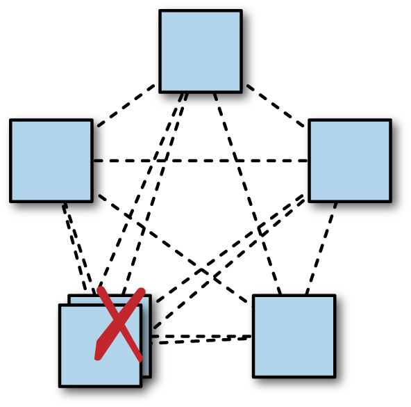

Hình 23-10. Thêm một bản sao phụ trong một khu vực có thể làm giảm khả dụng của hệ thống. Chụm nhiều bản sao trong một datacenter đơn có thể làm giảm khả dụng của hệ thống: ở đây, có một quorum mà không còn độ dự phòng nào.

Nếu các client dày đặc trong một khu vực địa lý cụ thể, tốt nhất là đặt các bản sao gần các client. Tuy nhiên, việc quyết định chính xác đặt các bản sao ở đâu có thể cần một chút suy nghĩ cẩn thận về cân bằng tải và cách một hệ thống xử lý quá tải. Như được thể hiện trong [Hình 23-11](#hinh-23-11), nếu một hệ thống đơn giản định tuyến các request đọc của client đến bản sao gần nhất, thì một cơn tăng vọt tải lớn tập trung trong một khu vực có thể làm choáng bản sao gần nhất, rồi đến bản sao gần thứ hai, và cứ thế — đây là *cascading failure* (xem [Đánh Lành Các Thất Bại Dây Chuyền](https://sre.google/sre-book/addressing-cascading-failures/)). Kiểu quá tải này thường có thể xảy ra do kết quả của việc các batch job bắt đầu, đặc biệt nếu một vài lô bắt đầu cùng lúc.

Chúng ta đã thấy lý do vì sao nhiều hệ thống distributed consensus dùng một tiến trình leader để cải thiện hiệu năng. Tuy nhiên, điều quan trọng là hiểu rằng các bản sao leader sẽ dùng nhiều tài nguyên tính toán hơn, đặc biệt là năng lực mạng phát ra. Điều này là vì leader gửi các tin nhắn proposal bao gồm dữ liệu được đề xuất, trong khi các bản sao gửi các tin nhắn nhỏ hơn, thường chỉ chứa sự đồng ý với một ID giao dịch consensus cụ thể. Các tổ chức chạy các hệ thống consensus được chia shard cao với một số lượng tiến trình rất lớn có thể thấy cần thiết phải đảm bảo rằng các tiến trình leader cho các shard khác nhau được cân bằng tương đối đều trên các datacenter khác nhau. Làm vậy ngăn toàn bộ hệ thống bị nút thắt về năng lực mạng phát ra chỉ cho một datacenter, và tạo ra một dung lượng hệ thống tổng thể lớn hơn.

        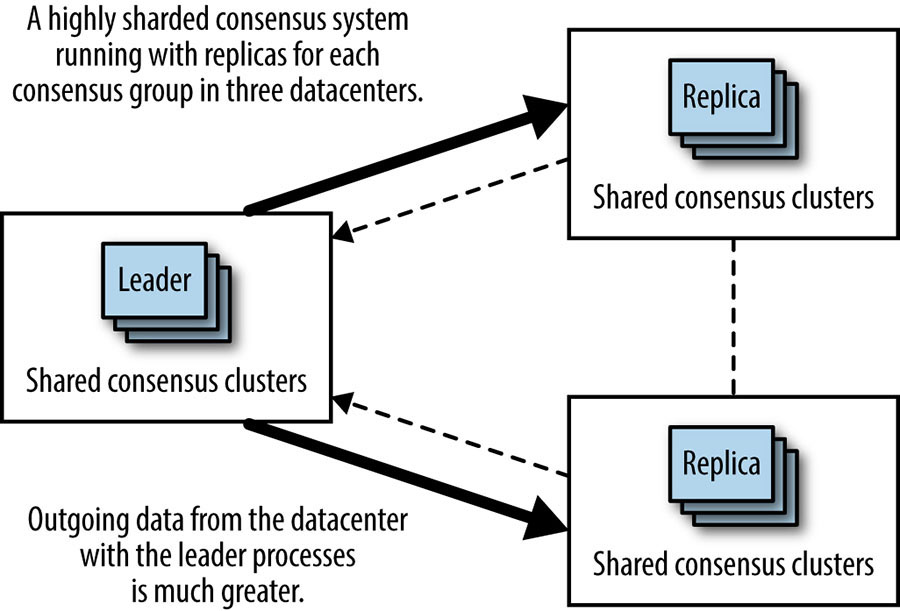

Hình 23-11. Chụm các tiến trình leader dẫn đến việc sử dụng băng thông không đều

Một bất lợi khác của việc triển khai các nhóm consensus trong nhiều datacenter (được thể hiện bằng [Hình 23-11](#hinh-23-11)) là sự thay đổi rất cực đoan của hệ thống có thể xảy ra nếu datacenter chứa các leader gặp một sự lỗi diện rộng (ví dụ sự lỗi điện, sự lỗi thiết bị mạng, hoặc đứt cáp quang). Như được thể hiện trong [Hình 23-12](#hinh-23-12), trong kịch bản sự lỗi này, tất cả các leader nên fail over một datacenter khác, hoặc chia đều hoặc cả đám vào một datacenter. Trong cả hai trường hợp, liên kết giữa hai datacenter còn lại sẽ đột nhiên nhận được nhiều lưu lượng mạng hơn rất nhiều từ hệ thống này. Đó sẽ là một thời điểm không may để phát hiện ra rằng dung lượng trên liên kết đó là không đủ.

        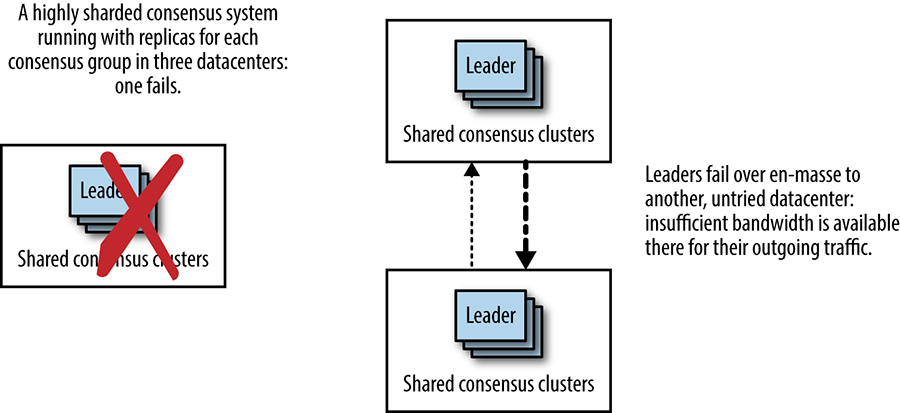

Hình 23-12. Khi các leader chụm fail over cả đám, các mẫu sử dụng mạng thay đổi kịch tính

Tuy nhiên, kiểu triển khai này có thể dễ dàng là một kết quả không chủ ý của các quá trình tự động trong hệ thống có ảnh hưởng đến cách các leader được chọn. Ví dụ:

- Các client sẽ có độ trễ tốt hơn cho bất kỳ thao tác nào được xử lý qua leader nếu leader nằm gần họ nhất. Một thuật toán cố gắng đặt các leader gần khối các client có thể tận dụng điểm nhìn này.
- Một thuật toán có thể cố gắng đặt các leader trên các máy có hiệu năng tốt nhất. Một cái bẫy của cách tiếp cận này là nếu một trong ba datacenter chứa các máy nhanh hơn, thì một tỷ lệ không cân xứng các lưu lượng sẽ được gửi đến datacenter đó, dẫn đến các thay đổi lưu lượng cực đoan nếu datacenter đó đi offline. Để tránh vấn đề này, thuật toán cũng phải tính đến sự cân bằng phân bố đối với khả năng máy khi chọn máy.
- Một thuật toán bầu leader có thể thiên vị các tiến trình đã chạy lâu hơn. Các tiến trình chạy lâu hơn có tương quan khá cao với vị trí nếu các bản phát hành phần mềm được thực hiện theo từng datacenter.

### Thành phần của Quorum (Quorum composition)

Khi xác định nơi đặt các bản sao trong một nhóm consensus, điều quan trọng là xem xét tác động của việc phân bố địa lý (hay, chính xác hơn, các độ trễ mạng giữa các bản sao) lên hiệu năng của nhóm.

Một cách tiếp cận là phân tán các bản sao càng đều càng tốt, với các RTT tương tự giữa tất cả các bản sao. Với tất cả các yếu tố khác bằng nhau (như workload, phần cứng, và hiệu năng mạng), cách sắp xếp này nên dẫn đến một hiệu năng khá nhất quán xuyên qua tất cả các khu vực, bất kể leader nhóm nằm ở đâu (hoặc đối với mỗi thành viên của nhóm consensus, nếu một giao thức không-leader được dùng).

Địa lý có thể làm phức tạp hóa rất nhiều cách tiếp cận này. Điều này đặc biệt đúng cho lưu lượng nội-châu lục so với lưu lượng xuyên Thái Bình Dương và xuyên Đại Tây Dương. Hãy xét một hệ thống trải rộng Bắc Mỹ và Châu Âu: không thể đặt các bản sao cách đều nhau, vì luôn sẽ có một độ trễ dài hơn cho lưu lượng xuyên Đại Tây Dương so với lưu lượng nội-châu lục. Dù bằng cách nào, các giao dịch từ một khu vực sẽ cần thực hiện một vòng đi-về xuyên Đại Tây Dương để đạt được consensus.

Tuy nhiên, như được thể hiện trong [Hình 23-13](#hinh-23-13), để cố gắng phân phối lưu lượng đều nhất có thể, các nhà thiết kế hệ thống có thể chọn đặt năm bản sao, với hai bản sao khoảng ở vị trí trung tâm tại Mỹ, một ở bờ đông, và hai ở Châu Âu. Một phân bố như vậy có nghĩa là trong trường hợp trung bình, consensus có thể đạt được ở Bắc Mỹ mà không cần đợi phản hồi từ Châu Âu, hoặc từ Châu Âu, consensus có thể đạt được bằng cách chỉ trao đổi tin nhắn với bản sao bờ đông. Bản sao bờ đông đóng vai trò như một mối liên kết (linchpin), nơi mà hai quorum có thể chồng lấn nhau.

        

Hình 23-13. Các quorum chồng lấn với một bản sao đóng vai trò liên kết

Như được thể hiện trong [Hình 23-14](#hinh-23-14), việc mất bản sao này có nghĩa là độ trễ của hệ thống có khả năng thay đổi đáng kể: thay vì chủ yếu bị ảnh hưởng bởi RTT từ trung tâm Mỹ đến bờ đông hoặc RTT từ EU đến bờ đông, độ trễ sẽ dựa trên RTT từ EU đến trung tâm, con số cao hơn khoảng 50% so với RTT từ EU đến bờ đông. Khoảng cách địa lý và RTT mạng giữa quorum gần nhất có thể tăng lên rất lớn.

        

Hình 23-14. Việc mất bản sao liên kết ngay lập tức dẫn đến một RTT dài hơn cho bất kỳ quorum nào

Kịch bản này là một điểm yếu chính của quorum đa số đơn giản khi được áp dụng cho các nhóm gồm các bản sao có các RTT rất khác nhau giữa các thành viên. Trong những trường hợp như vậy, một cách tiếp cận quorum phân cấp (hierarchical quorum) có thể hữu ích. Như được mô tả trong [Hình 23-15](#hinh-23-15), chín bản sao có thể được triển khai trong ba nhóm ba. Một quorum có thể được tạo thành bởi một đa số các nhóm, và một nhóm có thể được đưa vào quorum nếu một đa số các thành viên của nhóm đó khả dụng. Điều này có nghĩa là một bản sao có thể bị mất trong nhóm trung tâm mà không gây ra một tác động lớn lên hiệu năng hệ thống tổng thể, vì nhóm trung tâm vẫn có thể bỏ phiếu cho các giao dịch với hai trong ba bản sao của nó.

Tuy nhiên, có một chi phí tài nguyên liên quan đến việc chạy một số lượng bản sao cao hơn. Trong một hệ thống được chia shard cao với một workload nặng đọc chủ yếu có thể được đáp ứng bởi các bản sao, chúng ta có thể làm giảm chi phí này bằng cách dùng ít các nhóm consensus hơn. Chiến lược như vậy có nghĩa là số lượng tổng thể các tiến trình trong hệ thống có thể không thay đổi.

        

Hình 23-15. Các quorum phân cấp có thể được dùng để giảm sự phụ thuộc vào bản sao trung tâm

## Giám Sát Các Hệ Thống Distributed Consensus (Monitoring Distributed Consensus Systems)

Như chúng ta đã thấy, các thuật toán distributed consensus nằm ở trung tâm của nhiều hệ thống quan trọng của Google ([\[Ana13\]](https://sre.google/sre-book/bibliography#Ana13), [\[Bur06\]](https://sre.google/sre-book/bibliography#Bur06), [\[Cor12\]](https://sre.google/sre-book/bibliography#Cor12), [\[Shu13\]](https://sre.google/sre-book/bibliography#Shu13)). Tất cả các hệ thống sản xuất quan trọng đều cần giám sát, để phát hiện các sự cố hoặc vấn đề và để gỡ lỗi. Kinh nghiệm đã cho chúng tôi thấy rằng có một số khía cạnh cụ thể của các hệ thống distributed consensus đáng được chú ý đặc biệt. Đó là:

Số lượng các thành viên đang chạy trong mỗi nhóm consensus, và trạng thái của mỗi tiến trình (lành mạnh hay không lành mạnh)

Một tiến trình có thể đang chạy nhưng không thể tiến triển vì một lý do nào đó (ví dụ, liên quan đến phần cứng).

#### Các bản sao liên tục bị tụt lại (persistently lagging replicas)

Các thành viên lành mạnh của một nhóm consensus vẫn có khả năng ở trong nhiều trạng thái khác nhau. Một thành viên nhóm có thể đang phục hồi trạng thái từ các peer sau khi khởi động, hoặc đang tụt lại phía sau quorum trong nhóm, hoặc có thể đã cập nhật và tham gia đầy đủ, và có thể là leader.

Liệu có tồn tại một leader hay không

Một hệ thống dựa trên một thuật toán như Multi-Paxos dùng một vai trò leader phải được giám sát để đảm bảo rằng một leader tồn tại, vì nếu hệ thống không có leader, nó hoàn toàn không khả dụng.

Số lần thay đổi leader

Các thay đổi lãnh đạo nhanh làm suy yếu hiệu năng của các hệ thống consensus dùng một leader ổn định, nên số lần thay đổi leader nên được giám sát. Các thuật toán consensus thường đánh dấu một sự thay đổi lãnh đạo bằng một term (nhiệm kỳ) hoặc view number mới, nên con số này cung cấp một chỉ số hữu ích để giám sát. Một tốc độ tăng quá nhanh của các lần thay đổi leader là dấu hiệu cho thấy leader đang flapping, có lẽ do các vấn đề kết nối mạng. Một sự giảm của view number có thể báo hiệu một bug nghiêm trọng.

Số giao dịch consensus

Các nhà vận hành cần biết liệu hệ thống consensus có đang tiến triển hay không. Hầu hết các thuật toán consensus dùng một số giao dịch consensus tăng dần để chỉ báo sự tiến triển. Con số này nên được thấy đang tăng dần theo thời gian nếu một hệ thống lành mạnh.

Số proposal đã nhìn thấy; số proposal được đồng thuận

Những con số này chỉ báo liệu hệ thống có đang hoạt động đúng hay không.

Thông lượng và độ trễ

Mặc dù không đặc thù cho các hệ thống distributed consensus, những đặc tính này của hệ thống consensus nên được các quản trị viên giám sát và hiểu.

Để hiểu hiệu năng hệ thống và giúp gỡ lỗi các vấn đề hiệu năng, bạn cũng có thể giám sát những điều sau:

- Các phân bố độ trễ cho việc chấp nhận proposal
- Các phân bố của các độ trễ mạng quan sát được giữa các phần của hệ thống ở các vị trí khác nhau
- Thời lượng mà các acceptor dành cho việc ghi nhật ký bền vững
- Tổng số byte được chấp nhận mỗi giây trong hệ thống

## Kết Luận (Conclusion)

Chúng ta đã khám phá định nghĩa của bài toán distributed consensus, trình bày một số mẫu kiến trúc hệ thống cho các hệ thống dựa trên distributed consensus, cũng như xem xét các đặc tính hiệu năng và một số mối quan tâm vận hành quanh các hệ thống dựa trên distributed consensus.

Chúng tôi cố ý tránh một cuộc thảo luận chuyên sâu về các thuật toán, giao thức, hoặc bản cài đặt cụ thể trong chương này. Các hệ thống phối hợp phân tán và các công nghệ nền tảng của chúng đang tiến hóa nhanh chóng, và thông tin chi tiết sẽ nhanh chóng trở nên lỗi thời. Tuy nhiên, những nền tảng được thảo luận ở đây, cùng với các bài báo được tham chiếu xuyên suốt chương, sẽ cho phép bạn sử dụng các công cụ phối hợp phân tán khả dụng ngày nay, cũng như phần mềm trong tương lai.

Nếu bạn không nhớ được gì khác từ chương này, hãy lưu ý các kiểu vấn đề mà distributed consensus có thể được dùng để giải quyết, và các kiểu vấn đề có thể nảy sinh khi các phương pháp tự phát như heartbeat được dùng thay vì distributed consensus. Bất cứ khi nào bạn thấy leader election, trạng thái chia sẻ quan trọng, hoặc distributed locking, hãy nghĩ về distributed consensus: bất kỳ cách tiếp cận nào thấp kém hơn đều là một quả bom hẹn giờ đang chờ phát nổ trong các hệ thống của bạn.

[1](#fn1) Kyle Kingsbury đã viết một loạt bài báo rộng rãi về tính đúng đắn của các hệ thống phân tán, trong đó chứa nhiều ví dụ về hành vi bất ngờ và sai trong các kiểu datastore này. Xem [*https://aphyr.com/tags/jepsen*](https://aphyr.com/tags/jepsen).

[2](#fn2) Cụ thể, hiệu năng của thuật toán Paxos nguyên thủy là không tối ưu, nhưng đã được cải thiện rất nhiều qua nhiều năm.

---

Copyright © 2017 Google, Inc. Published by O'Reilly Media, Inc. Licensed under [CC BY-NC-ND 4.0](https://creativecommons.org/licenses/by-nc-nd/4.0/)
