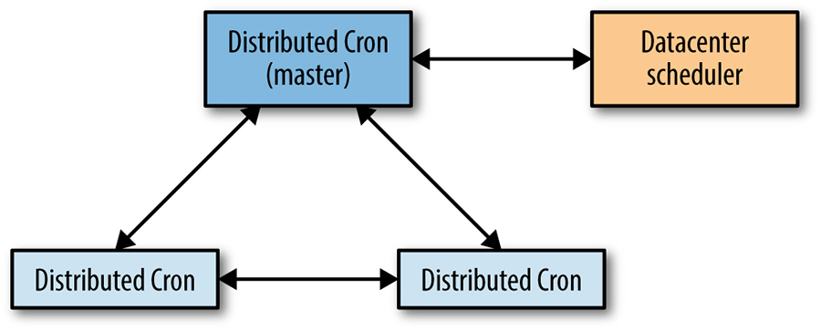
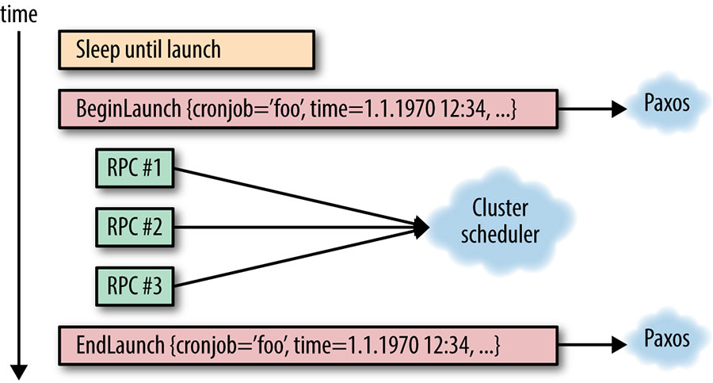
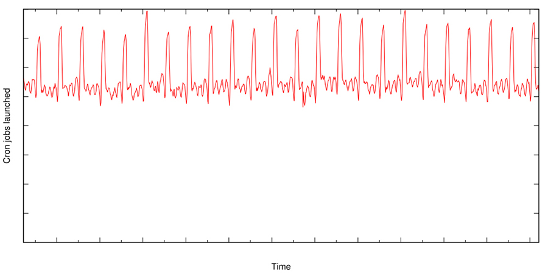

> **Nguyên bản:** [Chapter 24 - Distributed Periodic Scheduling with Cron](https://sre.google/sre-book/distributed-periodic-scheduling/)
> **Nguồn:** Google SRE Book (O'Reilly)
> **Bản dịch tiếng Việt** (Thực hiện bởi Đội ngũ R&D Softdreams)

---

## Chương 24. Lên lịch Định kỳ Phân tán bằng Cron (Distributed Periodic Scheduling with Cron)

*Tác giả:* Štěpán Davidovič[1](#fn1)
*Biên tập:* Kavita Guliani

Chương này mô tả cách Google triển khai một dịch vụ cron (trình lên lịch) phân tán, phục vụ phần lớn các nhóm nội bộ có nhu cầu lên lịch định kỳ cho các job tính toán. Trong suốt quá trình tồn tại của cron, chúng tôi đã học được nhiều bài học về cách thiết kế và triển khai một dịch vụ mà thoạt nhìn có vẻ rất cơ bản. Ở đây, chúng tôi thảo luận về những vấn đề mà cron phân tán phải đối mặt và phác thảo một số giải pháp khả thi.

Cron là một tiện ích Unix phổ biến được thiết kế để khởi chạy các job bất kỳ một cách định kỳ vào những thời điểm hoặc khoảng cách do người dùng định nghĩa. Chúng tôi đầu tiên phân tích các nguyên lý cơ bản của cron cùng các cách triển khai phổ biến nhất của nó, rồi xem xét một ứng dụng như cron có thể hoạt động thế nào trong một môi trường phân tán quy mô lớn để tăng cường độ tin cậy của hệ thống trước các sự thất bại của một máy riêng lẻ. Chúng tôi mô tả một hệ thống cron phân tán được triển khai trên một số lượng nhỏ các máy, nhưng có khả năng khởi chạy các job cron trên toàn bộ một datacenter cùng với một hệ thống lên lịch datacenter như Borg [[Ver15]](https://sre.google/sre-book/bibliography#Ver15).

## Cron

Trước khi đi sâu vào việc vận hành cron như một dịch vụ xuyên datacenter, hãy thảo luận về cách cron thường được sử dụng trong trường hợp đơn máy.

## Giới thiệu (Introduction)

Cron được thiết kế sao cho các quản trị viên hệ thống và người dùng phổ thông của hệ thống có thể chỉ định các lệnh cần chạy, cũng như thời điểm các lệnh này được chạy. Cron thực thi nhiều loại job khác nhau, bao gồm thu gom rác (garbage collection) và phân tích dữ liệu định kỳ. Định dạng chỉ định thời gian phổ biến nhất được gọi là "crontab". Định dạng này hỗ trợ các khoảng thời gian đơn giản (ví dụ, "một lần mỗi ngày vào 12 giờ trưa" hoặc "mỗi giờ đúng giờ"). Các khoảng thời gian phức tạp hơn, chẳng hạn "mỗi thứ Bảy, cũng là ngày 30 trong tháng", cũng có thể được cấu hình.

Cron thường được triển khai bằng một thành phần duy nhất, thường được gọi là `crond`. `crond` là một daemon nạp danh sách các job cron đã lên lịch. Các job được khởi chạy theo thời gian thực thi được chỉ định của chúng.

## Góc nhìn Độ tin cậy (Reliability Perspective)

Một số khía cạnh của dịch vụ cron đáng chú ý từ góc độ độ tin cậy:

-   Failure domain của cron về cơ bản chỉ là một máy. Nếu máy không hoạt động, thì cả bộ lên lịch cron lẫn các job mà nó khởi chạy đều không thể chạy.[2](#fn2) Hãy xem xét một trường hợp phân tán rất đơn giản với hai máy, trong đó bộ lên lịch cron của bạn khởi chạy job trên một máy worker khác (ví dụ, bằng SSH). Kịch bản này đặt ra hai failure domain khác nhau có thể ảnh hưởng đến khả năng khởi chạy job của chúng ta: máy lên lịch hoặc máy đích đều có thể thất bại.
-   Trạng thái (state) duy nhất cần được duy trì vượt qua các lần khởi động lại `crond` (bao gồm cả khởi động lại máy) chính là cấu hình crontab. Việc khởi chạy cron là kiểu "bắn rồi quên" (fire-and-forget), và `crond` không hề cố gắng theo dõi những lần khởi chạy này.
-   anacron là một ngoại lệ đáng chú ý. anacron cố gắng khởi chạy các job lẽ ra đã được khởi chạy trong khi hệ thống đang tắt. Các nỗ lực khởi chạy lại bị giới hạn ở các job chạy theo ngày hoặc ít thường xuyên hơn. Chức năng này rất hữu ích để chạy các job bảo trì trên các workstation và notebook, và được hỗ trợ bởi một file lưu giữ dấu thời gian của lần khởi chạy cuối cùng cho tất cả các job cron đã đăng ký.

## Các Job Cron và Tính Idempotent (Cron Jobs and Idempotency)

Các job cron được thiết kế để thực hiện công việc định kỳ, nhưng ngoài ra, khó có thể biết trước chức năng của chúng là gì. Sự đa dạng của các yêu cầu mà bộ job cron phong phú đặt ra rõ ràng ảnh hưởng đến các yêu cầu về độ tin cậy.

Một số job cron, chẳng hạn các quy trình thu gom rác, có tính idempotent (chạy nhiều lần cho cùng một kết quả). Trong trường hợp hệ thống gặp trục trặc, việc khởi chạy các job như vậy nhiều lần là an toàn. Các job cron khác, chẳng hạn quy trình gửi một bản tin email đến một danh sách người nhận lớn, không nên được khởi chạy hơn một lần.

Để mọi thứ phức tạp hơn, việc không khởi chạy được là có thể chấp nhận đối với một số job cron nhưng không phải với số khác. Ví dụ, một job cron thu gom rác được lên lịch chạy mỗi năm phút có thể bỏ qua một lần khởi chạy, nhưng một job cron tính lương được lên lịch chạy một lần mỗi tháng không được phép bỏ lỡ.

Sự đa dạng lớn của các job cron khiến việc suy luận về các chế độ thất bại trở nên khó khăn: trong một hệ thống như dịch vụ cron, không có một câu trả lời duy nhất phù hợp với mọi tình huống. Nhìn chung, chúng tôi nghiêng về việc bỏ qua các lần khởi chạy thay vì chấp nhận rủi ro khởi chạy trùng lặp, trong chừng mực hạ tầng cho phép. Lý do là việc phục hồi từ một lần khởi chạy bị bỏ qua có thể chấp nhận được hơn so với việc phục hồi từ một lần khởi chạy trùng lặp. Chủ sở hữu của các job cron có thể (và nên!) giám sát job cron của họ; ví dụ, một chủ sở hữu có thể để dịch vụ cron phơi bày trạng thái cho các job cron do nó quản lý, hoặc thiết lập giám sát độc lập về hiệu ứng của các job cron. Trong trường hợp một lần khởi chạy bị bỏ qua, chủ sở hữu job cron có thể thực hiện hành động phù hợp với bản chất của job cron đó. Tuy nhiên, việc hoàn tác một lần khởi chạy trùng lặp, như ví dụ bản tin email nêu trước đó, có thể khó khăn hoặc thậm chí hoàn toàn bất khả thi. Do đó, chúng tôi ưu tiên "thất bại đóng" (fail closed) để tránh tạo ra trạng thái xấu mang tính hệ thống.

## Cron ở Quy mô Lớn (Cron at Large Scale)

Việc chuyển từ các máy riêng lẻ sang triển khai quy mô lớn đòi hỏi phải suy nghĩ lại một cách cơ bản về cách đưa cron hoạt động tốt trong môi trường như vậy. Trước khi trình bày chi tiết giải pháp cron của Google, chúng tôi sẽ thảo luận về những khác biệt giữa triển khai quy mô nhỏ và quy mô lớn, và mô tả những thay đổi thiết kế mà triển khai quy mô lớn đòi hỏi.

## Hạ tầng Mở rộng (Extended Infrastructure)

Trong các cách triển khai "thông thường", cron bị giới hạn trong một máy. Việc triển khai hệ thống quy mô lớn mở rộng giải pháp cron của chúng tôi sang nhiều máy.

Lưu trữ dịch vụ cron của bạn trên một máy có thể là thảm họa về mặt độ tin cậy. Giả sử máy này nằm trong một datacenter với đúng 1.000 máy. Sự thất bại của chỉ 1/1000 số máy khả dụng của bạn có thể đánh sập toàn bộ dịch vụ cron. Vì những lý do rõ ràng, cách triển khai này không thể chấp nhận được.

Để tăng độ tin cậy của cron, chúng tôi tách rời các tiến trình khỏi các máy. Nếu bạn muốn chạy một dịch vụ, đơn giản là chỉ định các yêu cầu của dịch vụ và datacenter mà nó nên chạy. Hệ thống lên lịch datacenter (chính nó cũng nên có độ tin cậy) quyết định máy hoặc các máy để triển khai dịch vụ của bạn, bên cạnh việc xử lý sự chết máy. Việc khởi chạy một job trong datacenter lúc đó hiệu quả trở thành việc gửi một hoặc nhiều RPC (Remote Procedure Call — lời gọi thủ tục từ xa) đến bộ lên lịch datacenter.

Tuy nhiên, quá trình này không tức thời. Việc phát hiện một máy chết đòi hỏi các thời gian chờ kiểm tra sức khỏe, trong khi lên lịch lại dịch vụ của bạn sang một máy khác đòi hỏi thời gian để cài đặt phần mềm và khởi động tiến trình mới.

Bởi vì di chuyển một tiến trình sang một máy khác có thể đồng nghĩa với việc mất mọi trạng thái cục bộ được lưu trên máy cũ (trừ khi sử dụng live migration), và thời gian lên lịch lại có thể vượt quá khoảng lên lịch nhỏ nhất là một phút, chúng tôi cần có các thủ tục để giảm nhẹ cả việc mất dữ liệu lẫn yêu cầu thời gian quá mức. Để giữ trạng thái cục bộ của máy cũ, bạn có thể đơn giản là lưu trạng thái trên một distributed filesystem như GFS, và sử dụng hệ thống tệp này trong quá trình khởi động để xác định các job đã không khởi chạy được do việc lên lịch lại. Tuy nhiên, giải pháp này không đáp ứng được kỳ vọng về tính kịp thời: nếu bạn chạy một job cron mỗi năm phút, một sự chậm trễ từ một đến hai phút do tổng overhead của việc lên lịch lại hệ thống cron có thể là đáng kể đến mức không thể chấp nhận. Trong trường hợp này, các hot spare (bản sao dự phòng nóng) có thể nhanh chóng vào cuộc và tiếp tục vận hành, rút ngắn đáng kể khung thời gian này.

## Yêu cầu Mở rộng (Extended Requirements)

Các hệ thống đơn máy thường chỉ đặt chung tất cả các tiến trình đang chạy với mức cách ly hạn chế. Mặc dù container giờ đã trở nên phổ biến, việc sử dụng container để cách ly từng thành phần riêng lẻ của một dịch vụ được triển khai trên một máy không phải là điều cần thiết hay phổ biến. Do đó, nếu cron được triển khai trên một máy, `crond` và tất cả các job cron mà nó chạy có lẽ sẽ không được cách ly.

Triển khai ở quy mô datacenter thường đồng nghĩa với việc triển khai vào các container thực thi sự cách ly. Sự cách ly là cần thiết vì kỳ vọng cơ bản là các tiến trình độc lập chạy trong cùng một datacenter không nên ảnh hưởng xấu đến lẫn nhau. Để thực thi kỳ vọng đó, bạn cần biết lượng tài nguyên cần thu thập trước cho bất kỳ tiến trình nào bạn muốn chạy — cả cho hệ thống cron lẫn các job mà nó khởi chạy. Một job cron có thể bị trì hoãn nếu datacenter không có tài nguyên khả dụng để đáp ứng nhu cầu của job cron đó. Yêu cầu về tài nguyên, cùng với nhu cầu của người dùng về giám sát các lần khởi chạy job cron, có nghĩa là chúng tôi cần theo dõi toàn bộ trạng thái của các lần khởi chạy job cron, từ lúc lên lịch khởi chạy cho đến khi kết thúc.

Việc tách rời các lần khởi chạy tiến trình khỏi các máy cụ thể khiến hệ thống cron phơi bày trước sự thất bại khởi chạy một phần. Vì cấu hình job cron rất đa dạng, việc khởi chạy một job cron mới trong datacenter có thể cần nhiều RPC, sao cho đôi khi chúng tôi gặp kịch bản trong đó một số RPC thành công nhưng số khác không (ví dụ, vì tiến trình gửi các RPC đã chết giữa chừng khi thực hiện các tác vụ này). Thủ tục phục hồi của cron cũng phải tính đến kịch bản này.

Về chế độ thất bại, một datacenter là một hệ sinh thái phức tạp hơn đáng kể so với một máy riêng lẻ. Dịch vụ cron, vốn bắt đầu là một binary tương đối đơn giản trên một máy, giờ có nhiều phụ thuộc rõ ràng lẫn không rõ ràng khi được triển khai ở quy mô lớn hơn. Đối với một dịch vụ cơ bản như cron, chúng tôi muốn đảm bảo rằng ngay cả khi datacenter chịu một sự thất bại một phần (ví dụ, mất điện cục bộ hoặc các vấn đề với dịch vụ lưu trữ), dịch vụ vẫn có thể hoạt động. Bằng cách yêu cầu bộ lên lịch datacenter đặt các replica của cron ở các vị trí đa dạng trong datacenter, chúng tôi tránh được kịch bản trong đó sự thất bại của một đơn vị phân phối điện kéo sập tất cả các tiến trình của dịch vụ cron.

Có thể triển khai một dịch vụ cron duy nhất trên toàn cầu, nhưng việc triển khai cron trong một datacenter đơn lẻ có những lợi ích: dịch vụ hưởng độ trễ thấp và cùng số phận với bộ lên lịch datacenter, phụ thuộc cốt lõi của cron.

## Xây dựng Cron tại Google (Building Cron at Google)

Phần này giải quyết các vấn đề phải được giải quyết nhằm cung cấp một triển khai cron phân tán quy mô lớn một cách đáng tin cậy. Nó cũng nêu bật một số quyết định quan trọng được đưa ra liên quan đến cron phân tán tại Google.

## Theo dõi Trạng thái của Các Job Cron (Tracking the State of Cron Jobs)

Như đã thảo luận trong các phần trước, chúng tôi cần giữ một lượng trạng thái nào đó về các job cron, và phải có khả năng khôi phục thông tin đó một cách nhanh chóng trong trường hợp thất bại. Hơn nữa, tính nhất quán của trạng thái đó là tối quan trọng. Hãy nhớ rằng nhiều job cron, như một lần chạy tính lương hay gửi bản tin email, không có tính idempotent.

Chúng tôi có hai lựa chọn để theo dõi trạng thái của các job cron:

-   Lưu dữ liệu bên ngoài trong distributed storage nói chung khả dụng
-   Sử dụng một hệ thống lưu trữ một lượng trạng thái nhỏ như một phần của chính dịch vụ cron

Khi thiết kế cron phân tán, chúng tôi chọn phương án thứ hai. Chúng tôi đưa ra lựa chọn này vì một số lý do:

-   Các distributed filesystem như GFS hay HDFS thường nhắm đến trường hợp sử dụng với các file rất lớn (ví dụ, đầu ra của các chương trình web crawling), trong khi thông tin chúng tôi cần lưu về các job cron lại rất nhỏ. Các thao tác ghi nhỏ trên distributed filesystem rất đắt đỏ và đi kèm độ trễ cao, bởi vì hệ thống tệp không được tối ưu cho các kiểu ghi như vậy.
-   Các dịch vụ cơ bản mà sự cố của chúng gây tác động rộng (như cron) nên có rất ít phụ thuộc. Ngay cả khi một phần của datacenter biến mất, dịch vụ cron vẫn nên có thể hoạt động trong ít nhất một khoảng thời gian. Nhưng yêu cầu này không có nghĩa là bộ lưu trữ phải là một phần trực tiếp của tiến trình cron (việc lưu trữ được xử lý như thế nào về cơ bản là một chi tiết triển khai). Tuy nhiên, cron nên có thể hoạt động độc lập với các hệ thống phía sau phục vụ một số lượng lớn người dùng nội bộ.

## Việc Sử dụng Paxos (The Use of Paxos)

Chúng tôi triển khai nhiều replica của dịch vụ cron và sử dụng thuật toán nhất trí phân tán Paxos [[Ver15]](https://sre.google/sre-book/managing-critical-state/) (xem [Quản lý Trạng thái Quan trọng: Nhất trí Phân tán cho Độ tin cậy](https://sre.google/sre-book/managing-critical-state/)) để đảm bảo chúng có trạng thái nhất quán. Cho đến khi đa số các thành viên trong nhóm khả dụng, hệ thống phân tán xét về tổng thể có thể xử lý thành công các thay đổi trạng thái mới bất chấp sự thất bại của các tập con bị giới hạn của hạ tầng.

Như [Hình 24-1](#hinh-24-1) cho thấy, cron phân tán sử dụng một job leader duy nhất, là replica duy nhất có thể sửa đổi trạng thái chia sẻ, cũng là replica duy nhất có thể khởi chạy các job cron. Chúng tôi tận dụng thực tế rằng biến thể của Paxos mà chúng tôi sử dụng, Fast Paxos [[Lam06]](https://sre.google/sre-book/bibliography#Lam06), sử dụng một replica leader bên trong như một tối ưu — replica leader của Fast Paxos đồng thời đóng vai trò là leader của dịch vụ cron.

        

Hình 24-1. Tương tác giữa các replica của cron phân tán

Nếu replica leader chết, cơ chế kiểm tra sức khỏe của nhóm Paxos phát hiện sự kiện này một cách nhanh chóng (trong vòng vài giây). Vì một tiến trình cron khác đã được khởi động và khả dụng, chúng tôi có thể bầu ra một leader mới. Ngay khi leader mới được bầu, chúng tôi tuân theo một giao thức bầu leader riêng của dịch vụ cron, chịu trách nhiệm tiếp quản toàn bộ công việc còn dở dang mà leader trước để lại. Leader riêng của dịch vụ cron giống với leader Paxos, nhưng dịch vụ cron cần thực hiện thêm hành động khi được thăng chức. Thời gian phản hồi nhanh cho việc bầu lại leader cho phép chúng tôi duy trì trong ngưỡng failover một phút thường được chấp nhận.

Trạng thái quan trọng nhất chúng tôi giữ trong Paxos là thông tin về các job cron đã được khởi chạy. Chúng tôi thông báo đồng bộ một quorum (đa số) các replica về việc bắt đầu và kết thúc của mỗi lần khởi chạy đã lên lịch cho mỗi job cron.

## Vai trò của Leader và Follower (The Roles of the Leader and the Follower)

Như vừa mô tả, việc chúng tôi sử dụng Paxos và cách triển khai nó trong dịch vụ cron có hai vai trò được gán: leader và follower. Các phần sau mô tả từng vai trò.

### Leader (The leader)

Replica leader là replica duy nhất chủ động khởi chạy các job cron. Leader có một bộ lên lịch bên trong mà, giống như `crond` đơn giản được mô tả ở đầu chương này, duy trì danh sách các job cron được sắp xếp theo thời gian khởi chạy đã lên lịch. Replica leader chờ đến khi đến thời gian khởi chạy đã lên lịch của job đầu tiên.

Khi đến thời gian khởi chạy đã lên lịch, replica leader tuyên bố rằng nó sắp bắt đầu khởi chạy job cron cụ thể này, và tính toán thời gian khởi chạy đã lên lịch mới, giống như một triển khai `crond` thông thường. Tất nhiên, giống như `crond` thông thường, một chỉ định khởi chạy job cron có thể đã thay đổi kể từ lần thực thi trước, và chỉ định khởi chạy này cũng phải được đồng bộ với các follower. Chỉ đơn thuần nhận dạng job cron là chưa đủ: chúng tôi cũng nên nhận dạng duy nhất lần khởi chạy cụ thể bằng thời gian bắt đầu; nếu không, việc theo dõi khởi chạy job cron có thể bị nhầm lẫn. (Sự mơ hồ như vậy đặc biệt dễ xảy ra trong trường hợp các job cron tần suất cao, như những job chạy mỗi phút.) Như thấy trong [Hình 24-2](#hinh-24-2), giao tiếp này được thực hiện qua Paxos.

Quan trọng là việc giao tiếp Paxos phải duy trì tính đồng bộ, và rằng việc khởi chạy job cron thực tế không được tiến hành cho đến khi nhận được xác nhận rằng quorum Paxos đã nhận được thông báo khởi chạy. Dịch vụ cron cần hiểu liệu mỗi job cron có được khởi chạy hay không để quyết định hướng đi tiếp theo trong trường hợp failover của leader. Việc không thực hiện công việc này một cách đồng bộ có thể đồng nghĩa với việc toàn bộ lần khởi chạy job cron diễn ra trên leader mà không thông báo cho các replica follower. Trong trường hợp failover, các replica follower có thể cố gắng thực hiện cùng lần khởi chạy đó một lần nữa, vì chúng không hay biết rằng lần khởi chạy đã diễn ra.

        

Hình 24-2. Minh họa tiến trình của một lần khởi chạy job cron, từ góc nhìn của leader

Việc hoàn thành lần khởi chạy job cron được thông báo đồng bộ qua Paxos đến các replica khác. Lưu ý rằng việc khởi chạy thành công hay thất bại do các nguyên nhân bên ngoài không quan trọng (ví dụ, nếu bộ lên lịch datacenter không khả dụng). Ở đây, chúng tôi đơn giản là theo dõi thực tế rằng dịch vụ cron đã cố gắng khởi chạy tại thời điểm đã lên lịch. Chúng tôi cũng cần có khả năng giải quyết các sự thất bại của hệ thống cron giữa chừng của thao tác này, như thảo luận trong phần tiếp theo.

Một tính năng cực kỳ quan trọng khác của leader là rằng ngay khi nó mất vai trò leader vì bất kỳ lý do nào, nó phải lập tức dừng tương tác với bộ lên lịch datacenter. Việc giữ vai trò leader phải đảm bảo sự loại trừ tương hỗ khi truy cập bộ lên lịch datacenter. Nếu thiếu điều kiện loại trừ tương hỗ này, leader cũ và leader mới có thể thực hiện các hành động mâu thuẫn trên bộ lên lịch datacenter.

### Follower (The follower)

Các replica follower theo dõi trạng thái của thế giới, như được cung cấp bởi leader, để có thể tiếp quản ngay lập tức khi cần. Mọi thay đổi trạng thái được các replica follower theo dõi đều được truyền đạt qua Paxos, từ replica leader. Giống như leader, các follower cũng duy trì một danh sách tất cả các job cron trong hệ thống, và danh sách này phải được giữ nhất quán giữa các replica (bằng cách sử dụng Paxos).

Khi nhận được thông báo về một lần khởi chạy đã bắt đầu, replica follower cập nhật thời gian khởi chạy đã lên lịch tiếp theo cục bộ của nó cho job cron được cho. Thay đổi trạng thái cực kỳ quan trọng này (được thực hiện đồng bộ) đảm bảo rằng tất cả các lịch cron job trong hệ thống là nhất quán. Chúng tôi theo dõi tất cả các lần khởi chạy đang mở (các lần khởi chạy đã bắt đầu nhưng chưa hoàn thành).

Nếu một replica leader chết hoặc gặp trục trặc theo cách khác (ví dụ, bị tách rời khỏi các replica khác trên mạng), một follower nên được bầu làm leader mới. Cuộc bầu cử phải hội tụ nhanh hơn một phút, để tránh rủi ro bỏ lỡ hoặc trì hoãn không hợp lý một lần khởi chạy job cron. Một khi leader được bầu, tất cả các lần khởi chạy đang mở (tức là các sự thất bại một phần) phải được kết thúc. Quá trình này có thể khá phức tạp, đặt ra các yêu cầu bổ sung cho cả hệ thống cron lẫn hạ tầng datacenter. Phần tiếp theo thảo luận cách giải quyết các sự thất bại một phần kiểu này.

### Giải quyết Các sự Thất bại Một phần (Resolving partial failures)

Như đã đề cập, sự tương tác giữa replica leader và bộ lên lịch datacenter có thể thất bại giữa lúc gửi nhiều RPC mô tả một lần khởi chạy job cron logic duy nhất. Các hệ thống của chúng tôi nên có khả năng xử lý điều kiện này.

Hãy nhớ rằng mỗi lần khởi chạy job cron có hai điểm đồng bộ hóa:

-   Khi chúng tôi sắp thực hiện lần khởi chạy
-   Khi chúng tôi đã hoàn thành lần khởi chạy

Hai điểm này cho phép chúng tôi xác định giới hạn của lần khởi chạy. Ngay cả khi lần khởi chạy chỉ gồm một RPC duy nhất, làm thế nào chúng tôi biết liệu RPC đã thực sự được gửi hay chưa? Hãy xem xét trường hợp trong đó chúng tôi biết rằng lần khởi chạy đã lên lịch đã bắt đầu, nhưng chúng tôi không được thông báo về việc hoàn thành của nó trước khi replica leader chết.

Để xác định liệu RPC đã thực sự được gửi hay chưa, một trong các điều kiện sau phải được đáp ứng:

-   Tất cả các thao tác trên các hệ thống bên ngoài, mà chúng tôi có thể cần tiếp tục sau khi được bầu lại, phải có tính idempotent (tức là chúng tôi có thể an toàn thực hiện các thao tác đó lại)
-   Chúng tôi phải có thể tra cứu trạng thái của tất cả các thao tác trên các hệ thống bên ngoài để xác định một cách không mơ hồ liệu chúng đã hoàn thành hay chưa

Mỗi điều kiện trong số này đặt ra các ràng buộc đáng kể và có thể khó triển khai, nhưng khả năng đáp ứng được ít nhất một trong các điều kiện này là nền tảng cho việc hoạt động chính xác của một dịch vụ cron trong môi trường phân tán có thể chịu một hoặc nhiều sự thất bại một phần. Việc không xử lý điều này một cách thích hợp có thể dẫn đến các lần khởi chạy bị bỏ lỡ hoặc khởi chạy trùng lặp cùng một job cron.

Hầu hết hạ tầng khởi chạy các job logic trong datacenter (ví dụ, Mesos) cung cấp việc đặt tên cho các job datacenter đó, cho phép tra cứu trạng thái của các job, dừng các job, hoặc thực hiện các thao tác bảo trì khác. Một giải pháp hợp lý cho vấn đề idempotent là xây dựng các tên job trước (nhằm tránh gây ra bất kỳ thao tác thay đổi nào trên bộ lên lịch datacenter), rồi phân phối các tên này đến tất cả các replica của dịch vụ cron. Nếu leader của dịch vụ cron chết trong khi đang khởi chạy, leader mới đơn giản là tra cứu trạng thái của tất cả các tên đã tính trước và khởi chạy các tên bị thiếu.

Lưu ý rằng, tương tự như cách chúng tôi nhận dạng từng lần khởi chạy job cron riêng lẻ bằng tên và thời gian khởi chạy của nó, điều quan trọng là các tên job được xây dựng trên bộ lên lịch datacenter phải bao gồm thời gian khởi chạy đã lên lịch cụ thể đó (hoặc có thông tin này có thể truy hồi được theo cách khác). Trong hoạt động thông thường, dịch vụ cron nên failover nhanh trong trường hợp leader thất bại, nhưng một failover nhanh không luôn xảy ra.

Hãy nhớ rằng chúng tôi theo dõi thời gian khởi chạy đã lên lịch khi giữ trạng thái nội bộ giữa các replica. Tương tự, chúng tôi cần phân biệt tương tác của mình với bộ lên lịch datacenter, cũng bằng cách sử dụng thời gian khởi chạy đã lên lịch. Ví dụ, hãy xem xét một job cron sống ngắn nhưng chạy thường xuyên. Job cron khởi chạy, nhưng trước khi lần khởi chạy được truyền đạt đến tất cả các replica, leader crash và một failover bất thường dài — đủ dài để job cron hoàn thành thành công — diễn ra. Leader mới tra cứu trạng thái của job cron, quan sát thấy nó hoàn thành, và cố gắng khởi chạy job đó lại. Nếu thời gian khởi chạy đã được bao gồm, leader mới sẽ biết rằng job trên bộ lên lịch datacenter là kết quả của lần khởi chạy job cron cụ thể này, và lần khởi chạy trùng lặp này đã không xảy ra.

Việc triển khai thực tế có một hệ thống tra cứu trạng thái phức tạp hơn, được điều khiển bởi các chi tiết triển khai của hạ tầng nền tảng. Tuy nhiên, mô tả ở trên bao quát các yêu cầu độc lập với triển khai của bất kỳ hệ thống nào như vậy. Tùy thuộc vào hạ tầng khả dụng, bạn cũng có thể cần xem xét sự đánh đổi giữa việc chấp nhận rủi ro khởi chạy trùng lặp và rủi ro bỏ lỡ một lần khởi chạy.

## Lưu Trữ Trạng thái (Storing the State)

Việc sử dụng Paxos để đạt được đồng thuận chỉ là một phần của vấn đề cách xử lý trạng thái. Paxos về cơ bản là một log liên tục của các thay đổi trạng thái, được thêm vào đồng bộ khi các thay đổi trạng thái xảy ra. Đặc điểm này của Paxos có hai hệ quả:

-   Log cần được nén (compact), để ngăn nó tăng trưởng vô hạn
-   Chính log phải được lưu ở đâu đó

Để ngăn việc tăng trưởng vô hạn của log Paxos, chúng tôi đơn giản có thể chụp một snapshot của trạng thái hiện tại, có nghĩa là chúng tôi có thể tái tạo trạng thái mà không cần phải phát lại tất cả các mục log thay đổi trạng thái dẫn đến trạng thái hiện tại. Để đưa ra một ví dụ: nếu các thay đổi trạng thái được lưu trong log của chúng tôi là "Tăng một bộ đếm (counter) lên 1", thì sau một nghìn lần lặp lại, chúng tôi có một nghìn mục log mà có thể dễ dàng thay bằng một snapshot "Đặt bộ đếm thành 1.000".

Trong trường hợp mất log, chúng tôi chỉ mất trạng thái kể từ snapshot cuối cùng. Thực tế, các snapshot là trạng thái quan trọng nhất của chúng tôi — nếu chúng tôi mất các snapshot, về cơ bản chúng tôi phải bắt đầu lại từ số không vì chúng tôi đã mất trạng thái nội bộ. Việc mất log, ngược lại, chỉ gây ra một sự mất mát trạng thái bị giới hạn và đưa hệ thống cron quay ngược thời gian về thời điểm snapshot gần nhất được chụp.

Chúng tôi có hai lựa chọn chính để lưu trữ dữ liệu của mình:

-   Bên ngoài trong distributed storage nói chung khả dụng
-   Trong một hệ thống lưu trữ lượng trạng thái nhỏ như một phần của chính dịch vụ cron

Khi thiết kế hệ thống, chúng tôi kết hợp các yếu tố của cả hai lựa chọn.

Chúng tôi lưu các log Paxos trên ổ đĩa cục bộ của máy mà các replica dịch vụ cron được lên lịch. Việc có ba replica trong vận hành mặc định có nghĩa là chúng tôi có ba bản sao của các log. Chúng tôi cũng lưu các snapshot trên ổ đĩa cục bộ. Tuy nhiên, vì chúng rất quan trọng, chúng tôi cũng sao lưu chúng lên một distributed filesystem, do đó bảo vệ khỏi các sự thất bại ảnh hưởng đến cả ba máy.

Chúng tôi không lưu các log trên distributed filesystem của mình. Chúng tôi có chủ đích quyết định rằng việc mất các log, vốn đại diện cho một lượng nhỏ các thay đổi trạng thái gần nhất, là một rủi ro có thể chấp nhận được. Việc lưu log trên distributed filesystem có thể kéo theo một mức phạt hiệu năng đáng kể do các thao tác ghi nhỏ thường xuyên. Việc mất đồng thời cả ba máy là ít có khả năng, và nếu sự mất đồng thời thực sự xảy ra, chúng tôi tự động phục hồi từ snapshot. Bằng cách đó, chúng tôi chỉ mất một lượng nhỏ log: những cái được chụp kể từ snapshot cuối cùng, mà chúng tôi thực hiện theo các khoảng thời gian có thể cấu hình. Tất nhiên, các đánh đổi này có thể khác nhau tùy thuộc vào chi tiết của hạ tầng, cũng như các yêu cầu đặt ra cho hệ thống cron.

Ngoài các log và snapshot được lưu trên ổ đĩa cục bộ và các bản sao lưu snapshot trên distributed filesystem, một replica vừa khởi động có thể lấy snapshot trạng thái và tất cả các log từ một replica đã đang chạy qua mạng. Khả năng này khiến việc khởi động replica không phụ thuộc vào bất kỳ trạng thái nào trên máy cục bộ. Do đó, việc lên lịch lại một replica sang một máy khác khi khởi động lại (hoặc khi máy chết) về cơ bản là không phải vấn đề đối với độ tin cậy của dịch vụ.

## Vận hành Cron Lớn (Running Large Cron)

Có những hệ quả nhỏ hơn nhưng cũng thú vị không kém của việc vận hành một triển khai cron lớn. Một cron truyền thống là nhỏ: nhiều nhất có lẽ nó chứa ở thứ tự vài chục job cron. Tuy nhiên, nếu bạn chạy một dịch vụ cron cho hàng nghìn máy trong một datacenter, mức sử dụng của bạn sẽ tăng lên, và bạn có thể gặp phải các vấn đề.

Cảnh giác với vấn đề lớn và nổi tiếng của các hệ thống phân tán: hiệu ứng bầy đàn (thundering herd). Dựa trên cấu hình của người dùng, dịch vụ cron có thể gây ra các đỉnh sử dụng datacenter đáng kể. Khi mọi người nghĩ về một "job cron hàng ngày", họ thường cấu hình job này chạy lúc nửa đêm. Cách thiết lập này hoạt động tốt nếu job cron khởi chạy trên cùng một máy, nhưng điều gì xảy ra nếu job cron của bạn có thể sinh ra một MapReduce với hàng nghìn worker? Và điều gì nếu 30 nhóm khác nhau quyết định chạy một job cron hàng ngày như vậy, trong cùng một datacenter? Để giải quyết vấn đề này, chúng tôi đã giới thiệu một sự mở rộng của định dạng crontab.

Trong crontab thông thường, người dùng chỉ định phút, giờ, ngày trong tháng (hoặc tuần), và tháng mà job cron nên khởi chạy, hoặc dấu sao để chỉ định bất kỳ giá trị nào. Việc chạy lúc nửa đêm, hàng ngày, sẽ có chỉ định crontab là `"0 0 * * *"` (tức là phút số không, giờ số không, mọi ngày trong tuần, mọi tháng, và mọi ngày trong tuần). Chúng tôi cũng giới thiệu việc sử dụng dấu hỏi, có nghĩa là bất kỳ giá trị nào đều được chấp nhận, và hệ thống cron được tự do chọn giá trị đó. Người dùng chọn giá trị này bằng cách băm cấu hình job cron trên khoảng thời gian được cho (ví dụ, `0..23` cho giờ), do đó phân phối các lần khởi chạy đó đều hơn.

Bất chấp thay đổi này, tải gây ra bởi các job cron vẫn rất gập ghềnh. Đồ thị trong [Hình 24-3](#hinh-24-3) minh họa tổng số lần khởi chạy job cron trên toàn cầu tại Google. Đồ thị này nổi bật lên các đỉnh thường xuyên trong việc khởi chạy job cron, thường do các job cron cần được khởi chạy tại một thời điểm cụ thể — ví dụ, do sự phụ thuộc theo thời gian vào các sự kiện bên ngoài.

        

Hình 24-3. Số lượng job cron được khởi chạy trên toàn cầu

## Tóm tắt (Summary)

Một dịch vụ cron đã là một tính năng cơ bản trong các hệ thống UNIX trong nhiều thập kỷ. Xu hướng của ngành công nghiệp hướng tới các hệ thống phân tán lớn, trong đó một datacenter có thể là đơn vị phần cứng hiệu dụng nhỏ nhất, đòi hỏi những thay đổi ở các phần lớn của stack. Cron không phải là ngoại lệ cho xu hướng này. Một cái nhìn cẩn thận vào các thuộc tính cần thiết của một dịch vụ cron và các yêu cầu của các job cron dẫn dắt thiết kế mới của Google.

Chúng tôi đã thảo luận về các ràng buộc mới được đòi hỏi bởi môi trường hệ thống phân tán, và một thiết kế có thể có cho dịch vụ cron dựa trên giải pháp của Google. Giải pháp này đòi hỏi các cam kết đảm bảo nhất quán mạnh trong môi trường phân tán. Vì vậy, cốt lõi của việc triển khai cron phân tán là Paxos, một thuật toán phổ biến để đạt được đồng thuận trong một môi trường thiếu tin cậy. Việc sử dụng Paxos và việc phân tích chính xác các chế độ thất bại mới của các job cron trong một môi trường phân tán quy mô lớn đã cho phép chúng tôi xây dựng một dịch vụ cron mạnh mẽ được sử dụng rộng rãi tại Google.

[1](#fn1) Chương này trước đây đã được xuất bản một phần trong *ACM Queue* (tháng Ba 2015, vol. 13, số 3).

[2](#fn2) Sự thất bại của từng job riêng lẻ nằm ngoài phạm vi của phân tích này.

---

Copyright © 2017 Google, Inc. Published by O'Reilly Media, Inc. Licensed under [CC BY-NC-ND 4.0](https://creativecommons.org/licenses/by-nc-nd/4.0/)
