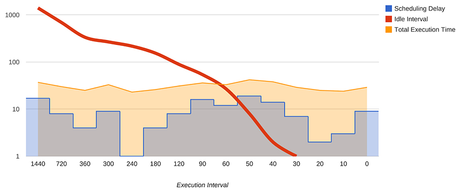
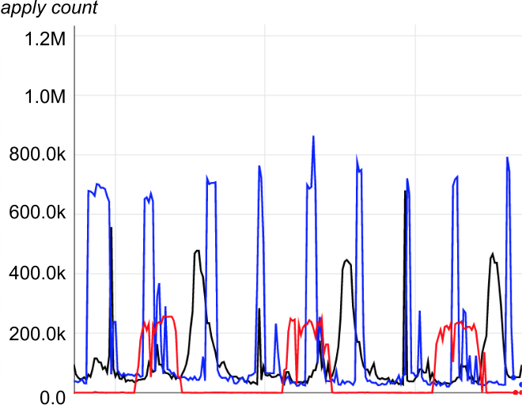
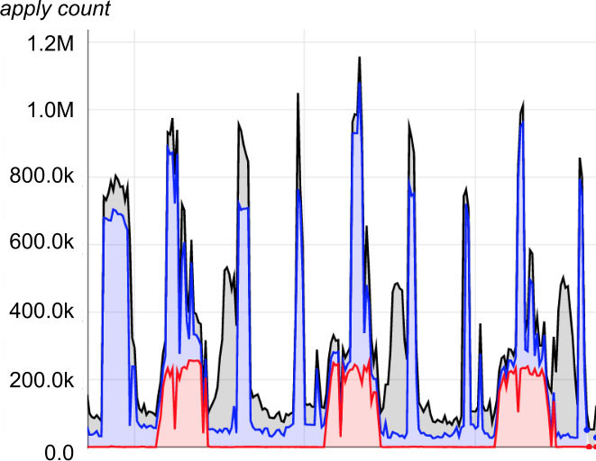
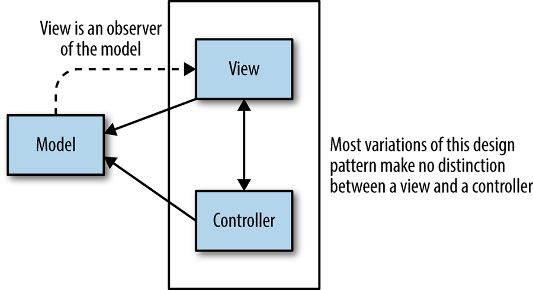
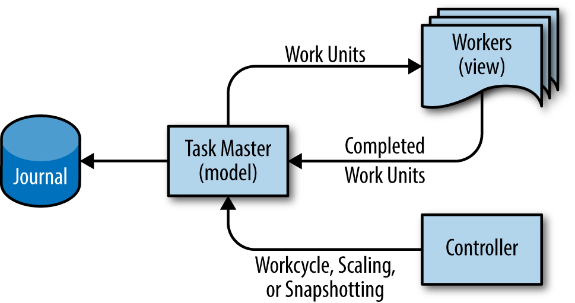
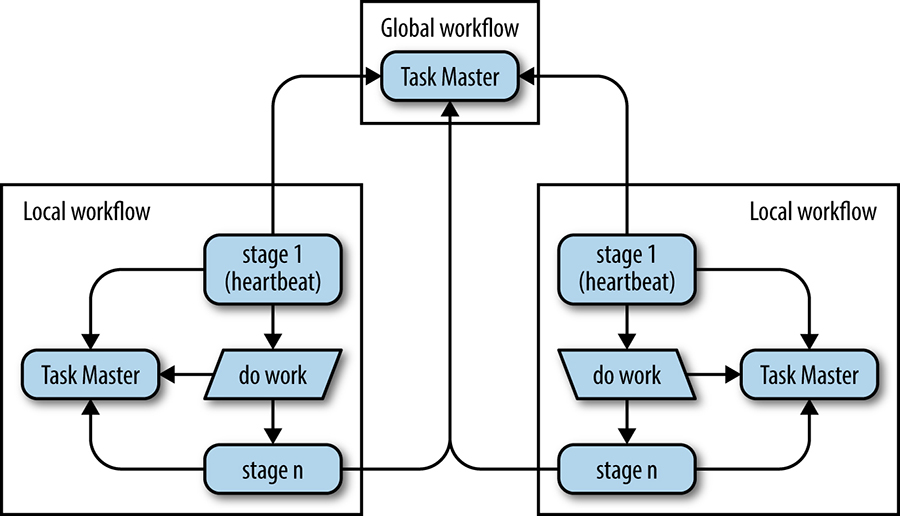

> **Nguyên bản:** [Chapter 25 - Data Processing Pipelines](https://sre.google/sre-book/data-processing-pipelines/)
> **Nguồn:** Google SRE Book (O'Reilly)
> **Bản dịch tiếng Việt** (Thực hiện bởi Đội ngũ R&D Softdreams)

---

## Chương 25. Các Pipeline Xử lý Dữ liệu (Data Processing Pipelines)

*Tác giả:* Dan Dennison
*Biên tập:* Tim Harvey

Chương này tập trung vào các thách thức thực tế trong việc quản lý các pipeline (đường ống) xử lý dữ liệu có chiều sâu và độ phức tạp. Nó xem xét phổ tần suất giữa các pipeline định kỳ chạy rất ít thường xuyên cho đến các pipeline liên tục không bao giờ ngừng chạy, và thảo luận về các bước nhảy (discontinuities) có thể gây ra các vấn đề vận hành nghiêm trọng. Một cách tiếp cận mới với mô hình leader-follower được trình bày như một giải pháp thay thế đáng tin cậy hơn và mở rộng tốt hơn so với pipeline định kỳ để xử lý Big Data.

## Nguồn gốc của Mẫu thiết kế Pipeline (Origin of the Pipeline Design Pattern)

Cách tiếp cận cổ điển cho việc xử lý dữ liệu là viết một chương trình đọc dữ liệu vào, biến đổi nó theo cách mong muốn, và xuất dữ liệu mới. Thông thường, chương trình được lên lịch chạy dưới sự điều khiển của một [chương trình lên lịch định kỳ](https://sre.google/sre-book/distributed-periodic-scheduling/) như cron. Mẫu thiết kế này được gọi là *data pipeline* (pipeline dữ liệu). Các data pipeline có lịch sử từ lâu như co-routines [[Con63]](https://sre.google/sre-book/bibliography/#Con63), các file truyền thông DTSS [[Bul80]](https://sre.google/sre-book/bibliography/#Bul80), pipe của UNIX [[McI86]](https://sre.google/sre-book/bibliography/#McI86), và sau đó, các pipeline ETL (extract, transform, load — trích xuất, biến đổi, tải),[1](#fn1) nhưng các pipeline như vậy đã nhận được sự chú ý nhiều hơn với sự trỗi dậy của "Big Data" (dữ liệu lớn), hay "các tập dữ liệu lớn và phức tạp đến mức các ứng dụng xử lý dữ liệu truyền thống không đủ khả năng xử lý".[2](#fn2)

## Tác động Ban đầu của Big Data lên Mẫu Pipeline Đơn giản (Initial Effect of Big Data on the Simple Pipeline Pattern)

Các chương trình thực hiện các phép biến đổi định kỳ hoặc liên tục trên Big Data thường được gọi là "pipeline đơn giản, một pha" (simple, one-phase pipelines).

Với quy mô và độ phức tạp xử lý vốn có của Big Data, các chương trình thường được tổ chức thành một chuỗi nối tiếp, trong đó đầu ra của một chương trình trở thành đầu vào của chương trình tiếp theo. Có thể có nhiều lý do khác nhau cho cách sắp xếp này, nhưng nó thường được thiết kế cho dễ suy luận về hệ thống và thường không hướng tới hiệu quả vận hành. Các chương trình được tổ chức theo cách này được gọi là *multiphase pipelines* (pipeline nhiều pha), bởi vì mỗi chương trình trong chuỗi đóng vai trò như một pha xử lý dữ liệu rời rạc.

Số lượng các chương trình được nối tiếp là một phép đo được biết đến như *chiều sâu* (depth) của một pipeline. Do đó, một pipeline nông có thể chỉ có một chương trình với chiều sâu pipeline tương ứng là một, trong khi một pipeline sâu có thể có chiều sâu pipeline ở hàng chục hoặc hàng trăm chương trình.

## Những Thách thức của Mẫu Pipeline Định kỳ (Challenges with the Periodic Pipeline Pattern)

Các pipeline định kỳ nhìn chung ổn định khi có đủ worker cho lượng dữ liệu và nhu cầu thực thi nằm trong khả năng tính toán. Ngoài ra, các bất ổn như nút thắt cổ chai (bottleneck) xử lý được tránh khi số lượng các job được nối tiếp và thông lượng tương đối giữa các job vẫn đồng đều.

Các pipeline định kỳ hữu ích và thực tiễn, và chúng tôi chạy chúng thường xuyên tại Google. Chúng được viết bằng các framework như MapReduce [[Dea04]](https://sre.google/sre-book/bibliography/#Dea04) và Flume [[Cha10]](https://sre.google/sre-book/bibliography/#Cha10), trong số nhiều khác.

Tuy nhiên, kinh nghiệm tổng hợp của các SRE (Site Reliability Engineer) là mô hình pipeline định kỳ dễ vỡ (fragile). Chúng tôi phát hiện rằng khi một pipeline định kỳ lần đầu được cài đặt với việc xác định kích thước worker, tính định kỳ, kỹ thuật chia chunk, và các tham số khác được tinh chỉnh cẩn thận, hiệu năng ban đầu là đáng tin cậy. Tuy nhiên, sự tăng trưởng và thay đổi hữu cơ không thể tránh khỏi bắt đầu gây áp lực lên hệ thống, và các vấn đề phát sinh. Các ví dụ về những vấn đề như vậy bao gồm các job vượt quá hạn chót chạy, cạn kiệt tài nguyên, và các chunk xử lý treo kéo theo tải vận hành tương ứng.

## Khó khăn Gây ra bởi Sự Phân phối Công việc Không đồng đều (Trouble Caused By Uneven Work Distribution)

Đột phá then chốt của Big Data là việc áp dụng rộng rãi các thuật toán "song song hoàn toàn (không phụ thuộc lẫn nhau)" (embarrassingly parallel) [[Mol86]](https://sre.google/sre-book/bibliography/#Mol86) để cắt một khối lượng công việc lớn thành các chunk nhỏ đủ để chứa trên các máy riêng lẻ. Đôi khi các chunk đòi hỏi một lượng tài nguyên không đồng đều so với nhau, và hiếm khi ban đầu thấy rõ tại sao các chunk cụ thể đòi hỏi các mức tài nguyên khác nhau. Ví dụ, trong một khối lượng công việc được phân vùng theo khách hàng, các chunk dữ liệu cho một số khách hàng có thể lớn hơn nhiều so với các chunk khác. Vì khách hàng là điểm không thể chia nhỏ hơn, thời gian chạy đầu-cuối do đó bị giới hạn ở thời gian chạy của khách hàng lớn nhất.

Vấn đề "chunk treo" (hanging chunk) có thể xảy ra khi tài nguyên được phân bổ do sự khác biệt giữa các máy trong một cluster (cụm máy) hoặc do phân bổ quá mức cho một job. Vấn đề này phát sinh do sự khó khăn của một số thao tác thời gian thực trên các stream như việc sắp xếp dữ liệu "đang nóng". Mẫu mã thông thường của người dùng là chờ cho đến khi toàn bộ phép tính hoàn thành trước khi tiến tới giai đoạn pipeline tiếp theo, thường là vì có thể liên quan đến sắp xếp, mà sắp xếp đòi hỏi toàn bộ dữ liệu phải đi qua. Điều đó có thể làm trì hoãn đáng kể thời gian hoàn thành pipeline, bởi vì việc hoàn thành bị chặn bởi hiệu năng trường hợp xấu nhất do phương pháp chia chunk đang sử dụng quy định.

Nếu vấn đề này được phát hiện bởi các kỹ sư hoặc hạ tầng giám sát cluster, phản ứng có thể làm mọi thứ tệ hơn. Ví dụ, phản ứng "hợp lý" hoặc "mặc định" đối với một chunk treo là lập tức giết job và sau đó cho phép job khởi động lại, bởi vì sự tắc nghẽn có thể chính là kết quả của các yếu tố không xác định. Tuy nhiên, vì các triển khai pipeline về thiết kế thường không bao gồm checkpointing, công việc trên tất cả các chunk được khởi động lại từ đầu, do đó lãng phí thời gian, chu kỳ CPU, và công sức con người đã đầu tư trong chu kỳ trước đó.

## Nhược điểm của Pipeline Định kỳ trong Môi trường Phân tán (Drawbacks of Periodic Pipelines in Distributed Environments)

Các pipeline định kỳ Big Data được sử dụng rộng rãi tại Google, và do đó giải pháp quản lý cluster của Google bao gồm một cơ chế lên lịch thay thế cho các pipeline như vậy. Cơ chế này là cần thiết bởi vì, không giống như các pipeline chạy liên tục, các pipeline định kỳ thường chạy như các job batch có độ ưu tiên thấp hơn. Việc chỉ định độ ưu tiên thấp hoạt động tốt trong trường hợp này bởi vì công việc batch không nhạy cảm với độ trễ theo cách mà các dịch vụ web hướng Internet vốn nhạy cảm. Ngoài ra, để kiểm soát chi phí bằng cách tối đa hóa tải công việc trên máy, Borg (hệ thống quản lý cluster của Google, [[Ver15]](https://sre.google/sre-book/bibliography/#Ver15)) phân bổ công việc batch cho các máy khả dụng. Độ ưu tiên này có thể dẫn đến độ trễ khởi động kéo dài hơn, do đó các job pipeline có thể gặp phải các sự trì hoãn khởi đầu không có giới hạn.

Các job được gọi thông qua cơ chế này có một số giới hạn tự nhiên, dẫn đến các hành vi khác biệt khác nhau. Ví dụ, các job được lên lịch trong các khoảng trống do các job dịch vụ web hướng người dùng để lại có thể bị ảnh hưởng về khả dụng của tài nguyên độ trễ thấp, giá cả, và sự ổn định của việc truy cập tài nguyên. Chi phí thực thi tỷ lệ nghịch với độ trễ khởi động được yêu cầu, và tỷ lệ thuận với tài nguyên được tiêu thụ. Mặc dù lên lịch batch có thể hoạt động suôn sẻ trên thực tế, việc sử dụng quá mức bộ lên lịch batch ([Lên lịch Định kỳ Phân tán bằng Cron](https://sre.google/sre-book/distributed-periodic-scheduling/)) đặt các job vào rủi ro bị thu hồi trước (xem mục 2.5 của [[Ver15]](https://sre.google/sre-book/bibliography/#Ver15)) khi tải cluster cao, bởi vì những người dùng khác bị cạn tài nguyên batch. Với góc nhìn các đánh đổi rủi ro, việc chạy thành công một pipeline định kỳ được tinh chỉnh tốt là một sự cân bằng tinh tế giữa chi phí tài nguyên cao và rủi ro bị thu hồi trước.

Các sự trì hoãn lên đến vài giờ có thể hoàn toàn chấp nhận được đối với các pipeline chạy hàng ngày. Tuy nhiên, khi tần suất thực thi đã lên lịch tăng lên, thời gian tối thiểu giữa các lần thực thi có thể nhanh chóng đạt tới điểm độ trễ trung bình tối thiểu, đặt ra một cận dưới cho độ trễ mà một pipeline định kỳ có thể kỳ vọng đạt được. Việc giảm khoảng thời gian thực thi job xuống dưới cận dưới hiệu dụng này đơn giản chỉ dẫn đến hành vi không mong muốn chứ không phải tiến bộ tăng thêm. Failure mode cụ thể phụ thuộc vào chính sách lên lịch batch đang được sử dụng. Ví dụ, mỗi lần chạy mới có thể chồng chất lên bộ lên lịch cluster vì lần chạy trước chưa hoàn thành. Tệ hơn, lần chạy đang thực thi và gần như hoàn thành có thể bị giết khi lần thực thi tiếp theo được lên lịch bắt đầu, kết quả là dù chạy nhiều lần hơn, tiến độ thực tế vẫn hoàn toàn đình trệ.

Hãy lưu ý nơi đường khoảng thời gian nhàn rỗi dốc xuống cắt ngang độ trễ lên lịch trong [Hình 25-1](#hinh-25-1). Trong kịch bản này, việc giảm khoảng thời gian thực thi xuống dưới 40 phút cho job ~20 phút này dẫn đến các lần thực thi có thể chồng lấp với các hệ quả không mong muốn.

        

Hình 25-1. Khoảng thời gian thực thi của pipeline định kỳ so với thời gian nhàn rỗi (thang log)

Giải pháp cho vấn đề này là đảm bảo đủ sức chứa server cho vận hành đúng cách. Tuy nhiên, việc thu thập tài nguyên trong một môi trường phân tán chia sẻ phải chịu sự cung và cầu. Như dự kiến, các đội phát triển có xu hướng miễn cưỡng đi qua các quy trình thu thập tài nguyên khi tài nguyên phải được đóng góp cho một pool chung và chia sẻ. Để giải quyết điều này, một sự phân biệt giữa tài nguyên lên lịch batch so với tài nguyên độ ưu tiên production phải được thực hiện để hợp lý hóa chi phí thu thập tài nguyên.

## Các Vấn đề Giám sát trong Pipeline Định kỳ (Monitoring Problems in Periodic Pipelines)

Đối với các pipeline có thời gian thực thi đủ dài, việc có thông tin thời gian thực về các chỉ số hiệu năng chạy có thể quan trọng, nếu không muốn nói là quan trọng hơn, so với việc biết các chỉ số tổng thể. Điều này là do dữ liệu thời gian thực quan trọng trong việc cung cấp hỗ trợ vận hành, bao gồm cả ứng phó khẩn cấp. Trên thực tế, mô hình giám sát chuẩn bao gồm việc thu thập các chỉ số trong quá trình thực thi job, và báo cáo các chỉ số chỉ khi hoàn thành. Nếu job thất bại trong quá trình thực thi, không có thống kê nào được cung cấp.

Các pipeline liên tục không chia sẻ các vấn đề này bởi vì các task của chúng liên tục chạy và telemetry của chúng được thiết kế thường xuyên sao cho các chỉ số thời gian thực khả dụng. Các pipeline định kỳ không nên có các vấn đề giám sát vốn có, nhưng chúng tôi đã quan sát thấy một mối liên hệ mạnh.

## Các Vấn đề "Hiệu ứng Bầy đàn" ("Thundering Herd" Problems)

Thêm vào các thách thức thực thi và giám sát là vấn đề "hiệu ứng bầy đàn" (thundering herd) phổ biến trong các hệ thống phân tán, cũng được thảo luận trong [Lên lịch Định kỳ Phân tán bằng Cron](https://sre.google/sre-book/distributed-periodic-scheduling/). Với một pipeline định kỳ đủ lớn, cho mỗi chu kỳ, có thể hàng nghìn worker lập tức bắt đầu làm việc. Nếu có quá nhiều worker, hoặc nếu các worker được cấu hình sai hoặc được gọi bởi logic thử lại lỗi, tình trạng quá tải sẽ xảy ra trên các server mà chúng chạy, trên các dịch vụ cluster chia sẻ nền tảng, và trên bất kỳ hạ tầng mạng nào đang được sử dụng.

Càng làm tình hình này tồi tệ hơn, nếu logic thử lại không được triển khai, các vấn đề tính đúng đắn có thể phát sinh khi công việc bị bỏ rơi khi thất bại, và job sẽ không được thử lại. Nếu logic thử lại có mặt nhưng nó ngây thơ hoặc được triển khai kém, việc thử lại khi thất bại có thể làm trầm trọng thêm vấn đề.

Sự can thiệp của con người cũng có thể đóng góp vào kịch bản này. Các kỹ sư có kinh nghiệm hạn chế trong việc quản lý pipeline có xu hướng khuếch đại vấn đề này bằng cách thêm nhiều worker hơn vào pipeline của họ khi job không hoàn thành trong một khoảng thời gian mong muốn.

Bất kể nguồn gốc của vấn đề "hiệu ứng bầy đàn" là gì, không có gì gây tổn hại cho hạ tầng cluster và các SRE chịu trách nhiệm cho các dịch vụ khác nhau của một cluster bằng một job pipeline 10.000 worker có lỗi.

## Mẫu tải Moiré (Moiré Load Pattern)

Đôi khi vấn đề hiệu ứng bầy đàn có thể không dễ nhận thấy nếu xem xét riêng lẻ. Một vấn đề liên quan mà chúng tôi gọi là "mẫu tải Moiré" (Moiré load pattern) xảy ra khi hai hoặc nhiều pipeline chạy đồng thời và các trình tự thực thi của chúng đôi khi chồng lấp, khiến chúng đồng thời tiêu thụ một tài nguyên chia sẻ chung. Vấn đề này có thể xảy ra ngay cả trong các pipeline liên tục, mặc dù nó ít phổ biến hơn khi tải đến đều hơn.

Các mẫu tải Moiré rõ ràng nhất trong các biểu đồ sử dụng tài nguyên chia sẻ của pipeline. Ví dụ, [Hình 25-2](#hinh-25-2) nhận dạng việc sử dụng tài nguyên của ba pipeline định kỳ. Trong [Hình 25-3](#hinh-25-3), là phiên bản chồng chất của dữ liệu từ đồ thị trước, tác động đỉnh gây đau đớn cho on-call xảy ra khi tải tổng hợp tiến gần tới 1,2M.

        

Hình 25-2. Mẫu tải Moiré trên hạ tầng riêng biệt

        

Hình 25-3. Mẫu tải Moiré trên hạ tầng chia sẻ

## Giới thiệu Google Workflow (Introduction to Google Workflow)

Khi một pipeline batch vốn chỉ chạy một lần bị áp đảo bởi các yêu cầu kinh doanh về kết quả được cập nhật liên tục, đội phát triển pipeline thường xem xét hoặc tái cấu trúc thiết kế ban đầu để đáp ứng các yêu cầu hiện tại, hoặc chuyển sang mô hình pipeline liên tục. Thật không may, các yêu cầu kinh doanh thường xuất hiện vào thời điểm không thuận tiện nhất để tái cấu trúc hệ thống pipeline thành một hệ thống xử lý liên tục online. Các khách hàng mới và lớn hơn, phải đối mặt với các vấn đề mở rộng bắt buộc, thường cũng muốn đưa vào các tính năng mới, và kỳ vọng rằng các yêu cầu này tuân theo các hạn chót bất di bất dịch. Khi dự đoán thách thức này, việc xác định một số chi tiết ở đầu việc thiết kế một hệ thống liên quan đến một pipeline dữ liệu được đề xuất là quan trọng. Đảm bảo xác định phạm vi quỹ đạo tăng trưởng được kỳ vọng,[3](#fn3) nhu cầu về các thay đổi thiết kế, tài nguyên bổ sung được kỳ vọng, và các yêu cầu độ trễ được kỳ vọng từ phía kinh doanh.

Đối mặt với các nhu cầu này, Google đã phát triển một hệ thống vào năm 2003 gọi là "Workflow" làm cho xử lý liên tục khả dụng ở quy mô lớn. Workflow sử dụng mẫu thiết kế hệ thống phân tán leader-follower (workers) [[Sha00]](https://sre.google/sre-book/bibliography/#Sha00) và mẫu thiết kế system prevalence.[4](#fn4) Sự kết hợp này cho phép các [data pipeline](https://sre.google/workbook/data-processing/) giao dịch quy mô rất lớn, đảm bảo tính đúng đắn với ngữ nghĩa chính xác một lần (exactly-once semantics).

## Workflow như Mẫu Model-View-Controller (Workflow as Model-View-Controller Pattern)

Do cách system prevalence hoạt động, có thể hữu ích khi xem Workflow như tương đương hệ thống phân tán của mẫu model-view-controller quen thuộc từ phát triển giao diện người dùng.[5](#fn5) Như [Hình 25-4](#hinh-25-4) cho thấy, mẫu thiết kế này chia một ứng dụng phần mềm được cho thành ba phần liên kết với nhau để tách các biểu diễn nội bộ của thông tin khỏi các cách mà thông tin được trình bày đến hoặc nhận từ người dùng.[6](#fn6)

        

Hình 25-4. Mẫu model-view-controller được sử dụng trong thiết kế giao diện người dùng

Sử dụng lại mẫu này cho Workflow, *model* được giữ trong một server gọi là "Task Master" (Master của Task). Task Master sử dụng mẫu system prevalence để giữ tất cả các trạng thái job trong bộ nhớ cho khả năng khả dụng nhanh, trong khi đồng thời ghi nhật ký đồng bộ các biến đổi (mutations) lên ổ đĩa bền vững. *View* là các worker liên tục cập nhật trạng thái hệ thống một cách giao dịch với master theo góc nhìn của chúng như một thành phần con của pipeline. Mặc dù tất cả dữ liệu pipeline có thể được lưu trong Task Master, hiệu năng tốt nhất thường đạt được khi chỉ các pointer đến công việc được lưu trong Task Master, và dữ liệu đầu vào và đầu ra thực tế được lưu trong một hệ thống tệp chung hoặc bộ lưu trữ khác. Hỗ trợ cho sự tương tự này, các worker hoàn toàn không có trạng thái và có thể bị loại bỏ bất kỳ lúc nào. Một *controller* có thể được thêm tùy chọn như một thành phần hệ thống thứ ba để hỗ trợ hiệu quả một số hoạt động hệ thống phụ trợ ảnh hưởng đến pipeline, như mở rộng theo thời gian chạy của pipeline, snapshotting, kiểm soát trạng thái workcycle, đưa trạng thái pipeline quay ngược, hoặc thậm chí thực hiện sự ngăn chặn toàn cục cho tính liên tục kinh doanh. [Hình 25-5](#hinh-25-5) minh họa mẫu thiết kế.

        

Hình 25-5. Mẫu thiết kế Model-View-Controller được sử dụng lại cho Google Workflow

## Các Giai đoạn Thực thi trong Workflow (Stages of Execution in Workflow)

Chúng tôi có thể tăng chiều sâu pipeline lên bất kỳ mức nào bên trong Workflow bằng cách chia nhỏ việc xử lý thành các nhóm task (task groups) được giữ trong Task Master. Mỗi nhóm task giữ công việc tương ứng với một giai đoạn pipeline có thể thực hiện các thao tác bất kỳ trên một phần dữ liệu. Tương đối đơn giản để thực hiện mapping, shuffling, sorting, splitting, merging, hoặc bất kỳ thao tác nào khác ở bất kỳ giai đoạn nào.

Một giai đoạn thường có một số loại worker gắn với nó. Có thể có nhiều instance đồng thời của một loại worker cho trước, và các worker có thể tự lên lịch theo nghĩa rằng chúng có thể tìm kiếm các loại công việc khác nhau và chọn loại nào để thực hiện.

Worker tiêu thụ các đơn vị công việc từ một giai đoạn trước và tạo ra các đơn vị đầu ra. Đầu ra có thể là một điểm cuối hoặc đầu vào cho một giai đoạn xử lý khác. Bên trong hệ thống, dễ dàng đảm bảo rằng tất cả công việc được thực thi, hoặc ít nhất được phản ánh trong trạng thái bền vững, chính xác một lần.

## Các Cam kết Đảm bảo Tính Đúng đắn của Workflow (Workflow Correctness Guarantees)

Không thực tế để lưu *mọi* chi tiết của trạng thái pipeline bên trong Task Master, bởi vì Task Master bị giới hạn bởi kích thước RAM. Tuy nhiên, một cam kết đảm bảo tính đúng đắn kép (double correctness guarantee) được duy trì bởi vì master giữ một tập hợp các pointer đến dữ liệu được đặt tên duy nhất, và mỗi đơn vị công việc có một lease duy nhất được giữ. Các worker thu thập công việc với một lease và chỉ có thể commit công việc từ các task mà chúng hiện tại nắm giữ một lease hợp lệ.

Để tránh tình huống trong đó một worker mồ côi (orphaned worker) có thể tiếp tục làm việc trên một đơn vị công việc, do đó phá hủy công việc của worker hiện tại, mỗi file đầu ra được mở bởi một worker có một tên duy nhất. Bằng cách này, ngay cả các worker mồ côi cũng có thể tiếp tục ghi độc lập với master cho đến khi chúng cố gắng commit. Khi cố gắng commit, chúng sẽ không thể thực hiện được, bởi vì một worker khác nắm giữ lease cho đơn vị công việc đó. Hơn nữa, các worker mồ côi không thể phá hủy công việc do một worker hợp lệ tạo ra, bởi vì quy ước đặt tên file duy nhất đảm bảo rằng mỗi worker đang ghi vào một file riêng biệt. Bằng cách này, cam kết đảm bảo tính đúng đắn kép được duy trì: các file đầu ra luôn duy nhất, và trạng thái pipeline luôn chính xác do các task có lease.

Như thể cam kết đảm bảo tính đúng đắn kép là chưa đủ, Workflow cũng đánh phiên bản (version) cho tất cả các task. Nếu task cập nhật hoặc lease task thay đổi, mỗi thao tác tạo ra một task duy nhất mới thay thế task trước đó, với một ID mới được gán cho task. Vì tất cả cấu hình pipeline trong Workflow được lưu bên trong Task Master dưới cùng một dạng như chính các đơn vị công việc, để commit công việc, một worker phải sở hữu một lease hoạt động *và* tham chiếu đến số ID task của cấu hình mà nó đã sử dụng để tạo ra kết quả của mình. Nếu cấu hình thay đổi trong khi đơn vị công việc đang bay (in flight), tất cả các worker của loại đó sẽ không thể commit bất chấp việc sở hữu các lease hiện hành. Do đó, tất cả công việc được thực hiện sau một thay đổi cấu hình là nhất quán với cấu hình mới, với cái giá là công việc bị vứt bỏ bởi những worker xui xẻo nắm giữ các lease cũ.

Các biện pháp này cung cấp một cam kết đảm bảo tính đúng đắn ba lớp: cấu hình, sở hữu lease, và sự duy nhất của tên file. Tuy nhiên, ngay cả điều này cũng không đủ cho mọi trường hợp.

Ví dụ, điều gì xảy ra nếu địa chỉ mạng của Task Master thay đổi, và một Task Master khác thay thế nó tại cùng địa chỉ đó? Điều gì xảy ra nếu một sự hỏng hóc bộ nhớ làm thay đổi địa chỉ IP hoặc số cổng, dẫn đến một Task Master khác ở đầu bên kia? Thậm chí phổ biến hơn, điều gì xảy ra nếu ai đó cấu hình (sai) thiết lập Task Master của họ bằng cách chèn một load balancer trước một tập hợp các Task Master độc lập?

Workflow nhúng một server token (định danh duy nhất cho Task Master cụ thể này) trong metadata của mỗi task để ngăn một Task Master giả mạo hoặc được cấu hình sai làm hỏng pipeline. Cả client và server kiểm tra token ở mỗi thao tác, tránh một sự cấu hình sai rất tinh vi trong đó tất cả các thao tác chạy suôn sẻ cho đến khi một sự va chạm định danh task xảy ra.

Tóm lại, bốn cam kết đảm bảo tính đúng đắn của Workflow là:

-   Đầu ra của worker thông qua các task cấu hình tạo ra các rào cản (barriers) làm căn cứ cho công việc tiếp theo.
-   Tất cả công việc được commit đòi hỏi một lease hiện hành hợp lệ được worker nắm giữ.
-   Các file đầu ra được đặt tên duy nhất bởi các worker.
-   Client và server xác thực chính Task Master bằng cách kiểm tra một server token ở mỗi thao tác.

Tại thời điểm này, bạn có thể nghĩ rằng sẽ đơn giản hơn nếu từ bỏ Task Master chuyên dụng và sử dụng Spanner [[Cor12]](https://sre.google/sre-book/bibliography/#Cor12) hoặc một cơ sở dữ liệu khác. Tuy nhiên, Workflow đặc biệt bởi vì mỗi task là duy nhất và bất biến. Hai thuộc tính song sinh này ngăn nhiều vấn đề tiềm tàng tinh vi với việc phân phối công việc quy mô rộng xảy ra.

Ví dụ, lease được worker thu thập là một phần của chính task, đòi hỏi một task mới hoàn toàn ngay cả cho các thay đổi lease. Nếu một database được sử dụng trực tiếp và các log giao dịch của nó hoạt động như một "nhật ký" (journal), mỗi và mọi thao tác đọc phải là một phần của một giao dịch chạy dài. Cấu hình này chắc chắn là có thể, nhưng vô cùng kém hiệu quả.

## Đảm bảo Tính liên tục Kinh doanh (Ensuring Business Continuity)

Các pipeline Big Data cần tiếp tục xử lý bất chấp các sự cố ở mọi loại, bao gồm các đứt cáp quang, các sự kiện thời tiết, và các sự cố lan truyền của lưới điện. Các loại sự cố này có thể vô hiệu hóa toàn bộ các datacenter. Ngoài ra, các pipeline không sử dụng system prevalence để có được các cam kết mạnh về việc hoàn thành job thường bị vô hiệu hóa và rơi vào một trạng thái không xác định. Lỗ hổng kiến trúc này tạo ra một chiến lược tính liên tục kinh doanh dễ vỡ, và kéo theo một sự nhân bản ồ ạt nỗ lực tốn kém để khôi phục các pipeline và dữ liệu.

Workflow giải quyết vấn đề này một cách triệt để cho các pipeline xử lý liên tục. Để đạt được tính nhất quán toàn cục, Task Master lưu các nhật ký trên Spanner, sử dụng nó như một hệ thống tệp toàn cục khả dụng, toàn cục nhất quán, nhưng thông lượng thấp. Để xác định Task Master nào có thể ghi, mỗi Task Master sử dụng dịch vụ khóa phân tán gọi là Chubby [[Bur06]](https://sre.google/sre-book/bibliography/#Bur06) để bầu người ghi, và kết quả được lưu trên Spanner. Cuối cùng, các client tra cứu Task Master hiện hành bằng cách sử dụng các dịch vụ đặt tên nội bộ.

Bởi vì Spanner không tạo nên một hệ thống tệp thông lượng cao, các Workflow phân tán toàn cục sử dụng hai hoặc nhiều Workflow cục bộ chạy trong các cluster riêng biệt, cùng với một khái niệm về các task tham chiếu được lưu trong Workflow toàn cục. Khi các đơn vị công việc được tiêu thụ qua pipeline, các task tham chiếu tương đương được chèn vào Workflow toàn cục bởi binary được gắn nhãn "stage 1" trong [Hình 25-6](#hinh-25-6). Khi các task hoàn thành, các task tham chiếu được gỡ bỏ một cách giao dịch từ Workflow toàn cục như được minh họa trong "stage n" của [Hình 25-6](#hinh-25-6). Nếu các task không thể được gỡ bỏ từ Workflow toàn cục, Workflow cục bộ sẽ bị chặn cho đến khi Workflow toàn cục trở nên khả dụng lại, đảm bảo tính đúng đắn giao dịch.

Để tự động hóa failover, một binary phụ trợ được gắn nhãn "stage 1" trong [Hình 25-6](#hinh-25-6) chạy bên trong mỗi Workflow cục bộ. Workflow cục bộ thì không thay đổi, như được mô tả bởi hộp "do work" trong sơ đồ. Binary phụ trợ này hoạt động như một "controller" theo nghĩa MVC, và chịu trách nhiệm tạo các task tham chiếu, cũng như cập nhật một task heartbeat đặc biệt bên trong Workflow toàn cục. Nếu task heartbeat không được cập nhật trong thời gian chờ, binary phụ trợ của Workflow từ xa chiếm lấy công việc đang tiến hành như được ghi nhận bởi các task tham chiếu và pipeline tiếp tục, không bị cản trở bởi bất cứ điều gì mà môi trường có thể làm với công việc.

        

Hình 25-6. Một ví dụ về luồng dữ liệu và quy trình phân tán sử dụng các pipeline Workflow

## Tóm tắt và Nhận xét Kết luận (Summary and Concluding Remarks)

Các pipeline định kỳ có giá trị. Tuy nhiên, nếu một vấn đề xử lý dữ liệu là liên tục hoặc sẽ tăng trưởng hữu cơ để trở nên liên tục, đừng sử dụng một pipeline định kỳ. Thay vào đó, hãy sử dụng một công nghệ có các đặc tính tương tự Workflow.

Chúng tôi đã phát hiện ra rằng việc xử lý dữ liệu liên tục với các cam kết mạnh, như được cung cấp bởi Workflow, chạy và mở rộng tốt trên hạ tầng cluster phân tán, thường xuyên tạo ra các kết quả mà người dùng có thể tin tưởng, và là một hệ thống ổn định và đáng tin cậy cho đội Site Reliability Engineering để quản lý và bảo trì.

[1](#fn1) Wikipedia: Extract, transform, load, [*https://en.wikipedia.org/wiki/Extract,_transform,_load*](https://en.wikipedia.org/wiki/Extract,_transform,_load)

[2](#fn2) Wikipedia: Big data, [*https://en.wikipedia.org/wiki/Big\_data*](https://en.wikipedia.org/wiki/Big_data)

[3](#fn3) Bài giảng của Jeff Dean về "Software Engineering Advice from Building Large-Scale Distributed Systems" là một tài nguyên tuyệt vời: [[Dea07]](https://sre.google/sre-book/bibliography/#Dea07).

[4](#fn4) Wikipedia: System Prevalence, [*https://en.wikipedia.org/wiki/System\_Prevalence*](https://en.wikipedia.org/wiki/System_Prevalence)

[5](#fn5) Mẫu "model-view-controller" là một phép tương tự cho các hệ thống phân tán được vay mượn rất nới lỏng từ Smalltalk, vốn ban đầu được dùng để mô tả cấu trúc thiết kế của các giao diện người dùng đồ họa [[Fow08]](https://sre.google/sre-book/bibliography/#Fow08).

[6](#fn6) Wikipedia: Model-view-controller, [*https://en.wikipedia.org/wiki/Model%E2%80%93view%E2%80%93controller*](https://en.wikipedia.org/wiki/Model%E2%80%93view%E2%80%93controller)

---

Copyright © 2017 Google, Inc. Published by O'Reilly Media, Inc. Licensed under [CC BY-NC-ND 4.0](https://creativecommons.org/licenses/by-nc-nd/4.0/)
