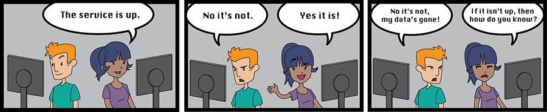
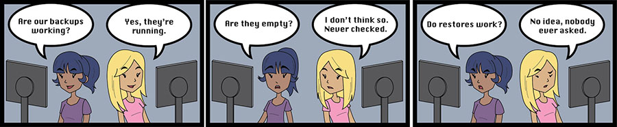
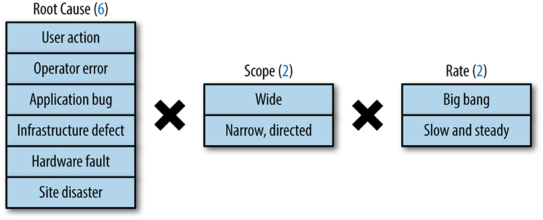
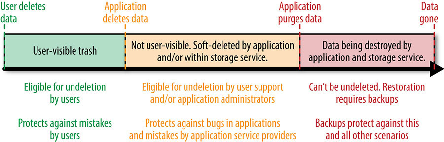

> **Nguyên bản:** [Chapter 26 - Data Integrity: What You Read Is What You Wrote](https://sre.google/sre-book/data-integrity/)
> **Nguồn:** Google SRE Book (O'Reilly)
> **Bản dịch tiếng Việt** (Thực hiện bởi Đội ngũ R&D Softdreams)

---

## Chương 26. Tính Toàn Vẹn Dữ Liệu: Điều Bạn Đọc Chính Là Điều Bạn Đã Ghi (Data Integrity: What You Read Is What You Wrote)

Tác giả: Raymond Blum và Rhandeev Singh  
Biên tập: Betsy Beyer

"Data integrity" (tính toàn vẹn dữ liệu) là gì? Khi đặt người dùng lên hàng đầu, data integrity chính là bất cứ điều gì người dùng cho rằng nó là.

Chúng ta có thể nói *data integrity là thước đo mức độ truy cập được và độ chính xác của các datastore cần thiết để cung cấp cho người dùng một mức độ dịch vụ thỏa đáng*. Nhưng định nghĩa này là chưa đủ.

Ví dụ, nếu một bug trong giao diện người dùng của Gmail khiến hộp thư hiển thị trống trong thời gian quá lâu, người dùng có thể tin rằng dữ liệu đã bị mất. Do đó, ngay cả khi không có dữ liệu nào *thực sự* bị mất, cả thế giới sẽ chất vấn khả năng của Google trong việc đóng vai trò là người quản trị dữ liệu có trách nhiệm, và tính khả thi của cloud computing sẽ bị đe dọa. Tương tự, nếu Gmail hiển thị một thông báo lỗi hoặc bảo trì trong thời gian quá lâu trong khi "chỉ một chút metadata" đang được sửa chữa, sự tin tưởng của người dùng Google cũng sẽ bị xói mòn.

Data không khả dụng trong bao lâu thì được coi là "quá lâu"? Như minh chứng từ một incident thực tế của Gmail năm 2011 [[Hic11]](https://sre.google/sre-book/bibliography#Hic11), bốn ngày là một khoảng thời gian dài — có lẽ là "quá lâu." Tiếp đó, chúng tôi cho rằng 24 giờ là một điểm khởi đầu tốt để thiết lập ngưỡng "quá lâu" cho Google Apps.

Lý luận tương tự cũng áp dụng cho các ứng dụng như Google Photos, Drive, Cloud Storage và Cloud Datastore, bởi người dùng không nhất thiết phân biệt giữa những sản phẩm rời rạc này (họ cho rằng “sản phẩm này vẫn là Google” hay “Google, Amazon, hay cái gì đi nữa; sản phẩm này vẫn là một phần của cloud”). Data loss, data corruption và không khả dụng kéo dài thường không thể phân biệt được đối với người dùng. Do đó, data integrity áp dụng cho mọi loại dữ liệu trên tất cả các dịch vụ. Khi xem xét data integrity, điều quan trọng là *các dịch vụ trên cloud vẫn khả dụng cho người dùng. Quyền truy cập dữ liệu của người dùng đặc biệt quan trọng*.

## Yêu Cầu Nghiêm Khắc của Data Integrity (Data Integrity's Strict Requirements)

Khi đánh giá yêu cầu về độ tin cậy của một hệ thống, uptime có vẻ khắt khe hơn data integrity. Chẳng hạn, người dùng có thể không chấp nhận được việc email bị gián đoạn một giờ, nhưng lại chịu đựng (dù có chút càu nhàu) khoảng thời gian bốn ngày để khôi phục hộp thư. Tuy nhiên, có một cách nhìn nhận phù hợp hơn về mối quan hệ giữa yêu cầu uptime và data integrity.

Một SLO (service level objective) uptime 99,99% chỉ cho phép khoảng một giờ downtime trong cả năm. Đây là một tiêu chuẩn khá cao, nhiều khả năng vượt quá kỳ vọng của phần lớn người dùng Internet và Enterprise.

Ngược lại, một SLO 99,99% byte tốt trong một artifact 2 GB sẽ làm hỏng tài liệu, file thực thi, và cơ sở dữ liệu (lên đến 200 KB bị hỏng). Mức độ corruption này là *thảm khốc* trong phần lớn các trường hợp — dẫn đến các file thực thi có opcode ngẫu nhiên và các cơ sở dữ liệu hoàn toàn không thể nạp được.

Từ góc nhìn của người dùng, mỗi dịch vụ đều có các yêu cầu riêng về uptime và data integrity, dù những yêu cầu này có thể chỉ là ngầm hiểu. Thời điểm tệ nhất để bất đồng với người dùng về các yêu cầu này là sau khi dữ liệu của họ đã bị mất!

Hình 26-1.

Để điều chỉnh lại định nghĩa về data integrity trước đó, chúng ta có thể hiểu rằng *data integrity nghĩa là các dịch vụ trên cloud vẫn khả dụng cho người dùng. Vì quyền truy cập dữ liệu của người dùng đặc biệt quan trọng, nên quyền truy cập này cần được duy trì ở trạng thái hoàn hảo*.

Giả sử một artifact bị corruption hoặc mất đi đúng một lần trong năm. Nếu sự mất mát này không thể khôi phục, uptime của artifact đó đã *bị mất* trong năm. Cách khả thi nhất để tránh những sự cố như vậy là phát hiện chủ động, kết hợp với việc sửa chữa nhanh chóng.

Giả sử trong một kịch bản khác, sự corruption được phát hiện ngay lập tức trước khi người dùng bị ảnh hưởng, và artifact đã được gỡ bỏ, sửa chữa, rồi đưa trở lại dịch vụ trong vòng nửa giờ. Bỏ qua bất kỳ downtime nào khác trong 30 phút đó, một object như vậy sẽ khả dụng 99,99% trong năm đó.

Đáng ngạc nhiên, ít nhất từ góc nhìn của người dùng, trong kịch bản này, data integrity vẫn đạt 100% (hoặc gần 100%) trong suốt vòng đời khả dụng của object. Ví dụ trên cho thấy *bí quyết để có data integrity vượt trội nằm ở việc phát hiện chủ động, sửa chữa và khôi phục nhanh chóng.*

## Lựa Chọn Chiến Lược cho Data Integrity Vượt Trội (Choosing a Strategy for Superior Data Integrity)

Có nhiều chiến lược khả thi để phát hiện, sửa chữa và khôi phục nhanh dữ liệu bị mất. Tất cả đều đánh đổi uptime lấy data integrity đối với những người dùng bị ảnh hưởng. Một số chiến lược hiệu quả hơn số khác, và một số đòi hỏi đầu tư kỹ thuật phức tạp hơn. Với nhiều tùy chọn sẵn có như vậy, bạn nên chọn chiến lược nào? Câu trả lời phụ thuộc vào hệ thống tính toán (paradigm) của bạn.

Phần lớn các ứng dụng cloud computing đều tối ưu hóa cho một tổ hợp nào đó của uptime, latency, scale, velocity và privacy. Để đưa ra định nghĩa vận hành cho từng thuật ngữ:

Uptime

Còn được gọi là *availability*, tỷ lệ thời gian mà một dịch vụ khả dụng cho người dùng của nó.

Latency

Mức độ một dịch vụ phản hồi nhanh như thế nào trong mắt người dùng của nó.

Scale

Số lượng người dùng của một dịch vụ và sự pha trộn các khối lượng công việc mà dịch vụ có thể xử lý trước khi latency bị ảnh hưởng hoặc dịch vụ sụp đổ.

Velocity

Một dịch vụ có thể đổi mới nhanh đến mức nào để cung cấp cho người dùng giá trị vượt trội với chi phí hợp lý.

Privacy

Khái niệm này đặt ra những yêu cầu phức tạp. Để đơn giản hóa, chương này chỉ tập trung vào khía cạnh xóa dữ liệu của privacy: dữ liệu phải bị phá hủy trong một khoảng thời gian hợp lý sau khi người dùng thực hiện thao tác xóa.

Nhiều ứng dụng cloud không ngừng tiến hóa trên nền một hỗn hợp của các API ACID[1](#fn1) và BASE[2](#fn2) để đáp ứng yêu cầu của năm thành phần này.[3](#fn3) BASE cho phép khả năng hoạt động cao hơn so với ACID, đổi lại là một bảo đảm nhất quán phân tán mềm hơn. Cụ thể, BASE chỉ bảo đảm rằng một khi một phần dữ liệu không còn được cập nhật nữa, giá trị của nó sẽ *cuối cùng* trở nên nhất quán trên các vị trí lưu trữ (có thể phân tán).

Kịch bản sau đây cung cấp một ví dụ về cách các đánh đổi giữa uptime, latency, scale, velocity, và privacy có thể diễn ra.

Khi velocity vượt trội hơn các yêu cầu khác, các ứng dụng kết quả sẽ dựa vào một tập hợp các API tùy ý mà những lập trình viên đang làm việc trên ứng dụng đó quen thuộc nhất.

Ví dụ, một ứng dụng có thể tận dụng hiệu quả một API lưu trữ BLOB (Binary Large Object)[4](#fn4), chẳng hạn như Blobstore. Hệ thống này chấp nhận đánh đổi sự nhất quán phân tán để đổi lấy khả năng mở rộng scale, phù hợp với các khối lượng công việc nặng đòi hỏi uptime cao, latency thấp và chi phí thấp. Để bù đắp:

-   Cùng ứng dụng đó có thể giao phó một lượng nhỏ metadata quan trọng (authoritative) liên quan đến các blob của nó cho một dịch vụ dựa trên Paxos có latency cao hơn, khả năng hoạt động thấp hơn, đắt đỏ hơn như Megastore [[Bak11]](https://sre.google/sre-book/bibliography#Bak11), [[Lam98]](https://sre.google/sre-book/bibliography#Lam98).
-   Một số client của ứng dụng có thể cache một số metadata đó cục bộ và truy cập các blob trực tiếp, giúp giảm thêm latency từ góc nhìn của người dùng.
-   Một ứng dụng khác có thể lưu metadata trong Bigtable, chấp nhận đánh đổi sự nhất quán phân tán mạnh vì các lập trình viên của ứng dụng đó tình cờ quen thuộc với Bigtable.

Những ứng dụng cloud như vậy đối mặt với nhiều thách thức data integrity lúc chạy, chẳng hạn như tính toàn vẹn tham chiếu (referential integrity) giữa các datastore (trong ví dụ trước, Blobstore, Megastore, và cache phía client). Sự biến đổi bất thường của velocity cao quy định rằng những thay đổi schema, các cuộc di chuyển dữ liệu, việc chất chồng tính năng mới lên trên tính năng cũ, các cuộc viết lại, và các điểm tích hợp đang phát triển với các ứng dụng khác đồng âm mưu tạo ra một môi trường tràn ngập những mối quan hệ phức tạp giữa các mảnh dữ liệu khác nhau mà không một lập trình viên nào hiểu trọn vẹn.

Để tránh dữ liệu của ứng dụng như vậy bị suy thoái trước mắt người dùng, cần một hệ thống kiểm tra và cân bằng ngoài vòng (out-of-band) bên trong và giữa các datastore. [Tầng thứ ba: Phát hiện sớm](#tang-thu-ba-phat-hien-som) sẽ thảo luận về một hệ thống như vậy.

Ngoài ra, nếu một ứng dụng như vậy dựa vào các bản sao lưu độc lập, không phối hợp của một vài datastore (trong ví dụ trước là Blobstore và Megastore), thì việc khai thác hiệu quả dữ liệu đã khôi phục trong quá trình khôi phục dữ liệu sẽ trở nên phức tạp do sự đa dạng của các mối quan hệ giữa dữ liệu đã khôi phục và dữ liệu trực tiếp. Ứng dụng ví dụ của chúng ta sẽ phải sàng lọc và phân biệt giữa các blob đã khôi phục với Megastore trực tiếp, Megastore đã khôi phục với các blob trực tiếp, các blob đã khôi phục với Megastore đã khôi phục, cũng như các tương tác với cache phía client.

Với sự xem xét đến những sự phụ thuộc và những điều phức tạp này, bao nhiêu nguồn lực nên được đầu tư vào các nỗ lực data integrity, và ở đâu?

## Backup Đối Chọi Với Lưu Trữ (Backups Versus Archives)

Theo truyền thống, các công ty "bảo vệ" dữ liệu khỏi việc mất mát bằng cách đầu tư vào các chiến lược backup. Tuy nhiên, trọng tâm thực sự của những nỗ lực backup như vậy nên là khôi phục dữ liệu, điều mà phân biệt các bản *backup thật* khỏi các kho lưu trữ (archive). Như đôi khi được quan sát: Không ai thực sự *muốn* tạo backup; điều mà mọi người *thực sự* muốn là *khôi phục* (restore).

"Backup" của bạn có thực sự là một kho lưu trữ, chứ không phải phù hợp để sử dụng trong khôi phục thảm họa?

Hình 26-2.

Điểm khác biệt then chốt giữa backup và kho lưu trữ nằm ở khả năng khôi phục: backup *có thể* được nạp lại vào ứng dụng, còn kho lưu trữ thì *không thể*. Vì vậy, hai hình thức này có các trường hợp sử dụng khác nhau khá rõ rệt.

*Kho lưu trữ* an toàn giữ dữ liệu trong thời gian dài để đáp ứng các nhu cầu kiểm toán, truy tìm, và tuân thủ. Khôi phục dữ liệu cho các mục đích như vậy thường không cần phải hoàn thành trong các yêu cầu uptime của một dịch vụ. Ví dụ, bạn có thể cần giữ lại dữ liệu giao dịch tài chính trong bảy năm. Để đạt được mục tiêu này, bạn có thể di chuyển các log kiểm toán tích lũy đến kho lưu trữ dài hạn tại một vị trí ngoài địa điểm (offsite) một lần một tháng. Việc truy xuất và khôi phục các log trong suốt một cuộc kiểm toán tài chính kéo dài một tháng có thể mất một tuần, và khung thời gian khôi phục một tuần này có thể chấp nhận được đối với một kho lưu trữ.

Mặt khác, khi thảm họa ập đến, dữ liệu phải được khôi phục từ *các bản backup thật* một cách nhanh chóng, tốt nhất là hoàn toàn nằm trong các nhu cầu uptime của một dịch vụ. Nếu không, những người dùng bị ảnh hưởng sẽ bị bỏ lại mà không có quyền truy cập hữu ích vào ứng dụng từ khi vấn đề data integrity bắt đầu cho đến khi nỗ lực khôi phục hoàn tất.

Cũng cần lưu ý rằng dữ liệu mới nhất có nguy cơ mất mát cho đến khi được sao lưu an toàn, nên việc lên lịch cho các bản backup thật (đối với kho lưu trữ) diễn ra hàng ngày, hàng giờ, hoặc thường xuyên hơn, sử dụng các cách tiếp cận full và incremental hoặc continuous (liên tục, dạng streaming), có thể là tối ưu.

Do đó, khi xây dựng chiến lược backup, hãy cân nhắc xem bạn cần khôi phục từ một sự cố nhanh đến mức nào, và có thể chấp nhận mất bao nhiêu dữ liệu gần đây.

## Yêu Cầu của Môi Trường Cloud Trong Bối Cảnh (Requirements of the Cloud Environment in Perspective)

Các môi trường cloud đưa đến một tổ hợp các thách thức kỹ thuật độc đáo:

-   Nếu môi trường kết hợp các giải pháp sao lưu và khôi phục có lẫn không có giao dịch, dữ liệu khôi phục ra không nhất thiết sẽ chính xác.
-   Nếu các dịch vụ phải tiến hóa mà không cần dừng hoạt động để bảo trì, nhiều phiên bản khác nhau của logic kinh doanh có thể chạy song song trên cùng một dữ liệu.
-   Nếu các dịch vụ tương tác được phân phiên bản độc lập, các phiên bản không tương thích của những dịch vụ khác nhau có thể tương tác trong khoảnh khắc, làm tăng thêm khả năng xảy ra data corruption hoặc data loss ngẫu nhiên.

Ngoài ra, để duy trì hiệu quả kinh tế theo quy mô, các nhà cung cấp dịch vụ chỉ có thể cung cấp một số lượng API giới hạn. Những API này phải đơn giản và dễ sử dụng cho phần lớn các ứng dụng, nếu không sẽ ít khách hàng sử dụng chúng. Đồng thời, các API phải đủ mạnh mẽ để hiểu được những điều sau:

-   Tính cục bộ của dữ liệu và caching
-   Phân phối dữ liệu cục bộ và toàn cục
-   Nhất quán mạnh và/hoặc nhất quán cuối cùng (eventual consistency)
-   Độ bền dữ liệu, backup, và khôi phục

Nếu không, những khách hàng phức tạp sẽ không thể đưa ứng dụng của họ lên cloud, còn các ứng dụng đơn giản nhưng đang trở nên phức tạp và lớn hơn sẽ phải viết lại hoàn toàn để dùng các API khác, phức tạp hơn.

Các vấn đề nảy sinh khi kết hợp một số tính năng API đã nêu ở trên. Nếu nhà cung cấp dịch vụ không xử lý những vấn đề này, ứng dụng gặp thách thức sẽ phải tự xác định và giải quyết chúng một cách độc lập.

## Mục Tiêu của Google SRE Trong Việc Duy Trì Data Integrity và Khả Năng Hoạt Động (Google SRE Objectives in Maintaining Data Integrity and Availability)

Mặc dù mục tiêu của SRE về “duy trì tính toàn vẹn của dữ liệu lưu trữ lâu dài” là một tầm nhìn tốt, chúng tôi phát triển mạnh dựa trên những mục tiêu cụ thể với các chỉ số có thể đo lường được. SRE xác định các metric chính để thiết lập kỳ vọng về khả năng của hệ thống và quy trình thông qua các bài kiểm thử, đồng thời theo dõi hiệu suất của chúng trong một sự kiện thực tế.

### Data Integrity Là Phương Tiện; Data Availability Là Mục Tiêu (Data Integrity Is the Means; Data Availability Is the Goal)

Data integrity đề cập đến độ chính xác và tính nhất quán của dữ liệu trong suốt vòng đời của nó. Người dùng cần biết rằng thông tin sẽ đúng và không thay đổi theo một cách bất ngờ nào đó từ thời điểm nó được ghi lại lần đầu tiên cho đến lần quan sát cuối cùng. Nhưng sự đảm bảo như vậy có đủ không?

Hãy xem xét trường hợp một nhà cung cấp email phải hứng chịu sự cố ngừng dịch vụ dữ liệu kéo dài một tuần [[Kinc09]](https://sre.google/sre-book/bibliography#Kinc09). Trong khoảng 10 ngày, người dùng buộc phải tìm các giải pháp tạm thời khác để duy trì công việc, với kỳ vọng sẽ sớm quay lại các tài khoản email, danh tính và lịch sử tích lũy đã thiết lập của mình.

Rồi, tin xấu nhất cũng đến: nhà cung cấp tuyên bố rằng, bất chấp những kỳ vọng trước đó, kho email và danh bạ trong quá khứ thực chất đã biến mất — bốc hơi và không bao giờ được nhìn thấy nữa. Có vẻ như một loạt những sơ suất trong việc quản lý tính toàn vẹn dữ liệu đã đồng âm mưu để lại cho nhà cung cấp dịch vụ không có bản backup nào có thể sử dụng. Những người dùng phẫn nộ hoặc bám víu vào danh tính tạm thời của họ hoặc thiết lập các danh tính mới, bỏ rơi nhà cung cấp email đầy rắc rối trước đó của họ.

Nhưng khoan đã! Vài ngày sau tuyên bố mất mát tuyệt đối, nhà cung cấp cho biết thông tin cá nhân của người dùng *có thể* được khôi phục. Không có mất dữ liệu; đây chỉ là một sự cố ngừng dịch vụ. Mọi thứ đều ổn!

Trừ phi, *mọi thứ không hề ổn*. Dữ liệu người dùng vẫn còn nguyên, nhưng những người cần dùng đã không thể truy cập trong một khoảng thời gian quá dài.

Bài học rút ra từ ví dụ này: Đối với người dùng, data integrity mà thiếu đi data availability như mong đợi và thường xuyên thì về cơ bản chẳng khác nào không có dữ liệu.

### Giao Một Hệ Thống Khôi Phục, Thay Vì Một Hệ Thống Backup (Delivering a Recovery System, Rather Than a Backup System)

Việc tạo backup là một nhiệm vụ bị bỏ bê kinh điển, được ủy thác, và bị trì hoãn trong quản trị hệ thống. Backup không phải là ưu tiên cao của bất kỳ ai — đó là một sự tiêu hao liên tục về thời gian và nguồn lực, và không mang lại lợi ích tức thì nào nhìn thấy được. Vì lý do này, việc thiếu tận tâm trong triển khai chiến lược backup thường chỉ nhận được một cái nhún vai thông cảm. Người ta có thể lập luận rằng, giống như hầu hết các biện pháp bảo vệ khỏi những nguy hiểm rủi ro thấp, thái độ như vậy là thực dụng. Vấn đề cơ bản với chiến lược cẩu thả này là những nguy hiểm mà nó kéo theo có thể là rủi ro thấp, nhưng chúng cũng có tác động cao. Khi dữ liệu của dịch vụ bạn không khả dụng, phản ứng của bạn có thể quyết định sự sống còn của dịch vụ, sản phẩm, và thậm chí công ty bạn.

Thay vì tập trung vào công việc ít được ghi nhận là tạo backup, cách hữu ích hơn — và cũng dễ thực hiện hơn — để tạo động lực cho việc này là hướng sự chú ý vào một nhiệm vụ có phần thưởng rõ ràng: *khôi phục* (restore)! *Backup giống như một loại thuế*, được đóng liên tục để đổi lấy dịch vụ cộng đồng là đảm bảo data availability. Thay vì nhấn mạnh vào khoản thuế, hãy làm nổi bật dịch vụ mà nó tài trợ: data availability. Chúng tôi không bắt các đội phải “luyện tập” backup, thay vào đó:

-   Các đội xác định các SLO cho data availability trong nhiều chế độ lỗi khác nhau.
-   Một đội luyện tập và chứng minh khả năng đáp ứng những SLO đó.

### Các Loại Lỗi Dẫn Đến Data Loss (Types of Failures That Lead to Data Loss)

Như [Hình 26-3](#hinh-26-3-cac-nhan-to-cua-cham-che-loi-data-integrity) minh họa, ở mức rất cao, 3 nhân tố có thể kết hợp theo mọi cách, tạo ra 24 loại lỗi riêng biệt. Khi thiết kế một chương trình data integrity, bạn cần xem xét từng lỗi tiềm năng này. Các nhân tố của các chế độ lỗi data integrity bao gồm:

Nguyên nhân gốc

Mất dữ liệu không thể khôi phục có thể bắt nguồn từ nhiều nguyên nhân: thao tác của người dùng, sai sót trong vận hành, bug ứng dụng, khiếm khuyết hạ tầng, lỗi phần cứng hoặc thảm họa tại địa điểm.

Phạm vi

Một số sự mất mát mang tính phổ biến, ảnh hưởng đến nhiều thực thể. Trong khi đó, một số trường hợp khác lại hẹp và có chủ đích, nhằm xóa hoặc làm hỏng dữ liệu đặc thù của một nhóm nhỏ người dùng.

Tốc độ

Một số trường hợp mất dữ liệu xảy ra đột ngột (ví dụ, 1 triệu dòng bị thay thế bằng chỉ 10 dòng trong một phút), trong khi một số trường hợp khác lại diễn ra từ từ (ví dụ, 10 dòng dữ liệu bị xóa mỗi phút trong suốt nhiều tuần).

        

Hình 26-3. Các nhân tố của các chế độ lỗi data integrity

Một kế hoạch khôi phục hiệu quả phải tính đến mọi tổ hợp có thể hình dung được của các chế độ lỗi này. Chiến lược phòng chống data loss do bug ứng dụng leo dần gây ra có thể hoàn toàn vô dụng khi trung tâm dữ liệu colocation của bạn bị cháy.

Một nghiên cứu về 19 nỗ lực khôi phục dữ liệu tại Google phát hiện rằng các kịch bản data loss nhìn thấy được bởi người dùng phổ biến nhất liên quan đến việc xóa dữ liệu hoặc mất tính toàn vẹn tham chiếu do bug phần mềm gây ra. Các biến thể thách thức nhất liên quan đến corruption hoặc xóa ở mức độ thấp được phát hiện từ vài tuần đến vài tháng sau khi các bug lần đầu tiên được phát hành vào môi trường production. Do đó, các biện pháp bảo vệ mà Google sử dụng nên phù hợp tốt để ngăn chặn hoặc khôi phục khỏi những loại mất mát này.

Để khôi phục từ những kịch bản như vậy, một ứng dụng lớn và thành công cần truy xuất dữ liệu cho có thể là hàng triệu người dùng trải dài trong nhiều ngày, tuần, hoặc tháng. Ứng dụng cũng có thể cần khôi phục mỗi artifact bị ảnh hưởng đến một thời điểm duy nhất. Kịch bản khôi phục dữ liệu này được gọi là "point-in-time recovery" bên ngoài Google, và "time-travel" bên trong Google.

Một giải pháp backup và khôi phục cung cấp point-in-time recovery cho một ứng dụng xuyên suốt các datastore ACID và BASE của nó trong khi đáp ứng các mục tiêu uptime, latency, khả năng mở rộng, velocity, và chi phí nghiêm ngặt là một loài huyền thoại (chimera) ngày nay!

Để giải quyết vấn đề này, bạn có thể nhờ chính đội ngũ lập trình viên của mình, nhưng điều đó đồng nghĩa với việc phải hy sinh velocity. Nhiều dự án chọn cách thỏa hiệp bằng cách áp dụng chiến lược backup theo tầng mà không có point-in-time recovery. Chẳng hạn, các API nằm dưới ứng dụng của bạn có thể hỗ trợ nhiều cơ chế khôi phục dữ liệu khác nhau. Các snapshot cục bộ tuy đắt đỏ nhưng vẫn cung cấp một mức độ bảo vệ nhất định khỏi các bug ứng dụng và cho phép khôi phục nhanh, nên bạn có thể giữ lại vài ngày snapshot như vậy, chụp cách nhau vài giờ. Trong khi đó, các bản sao full và incremental hiệu quả về chi phí, thực hiện mỗi hai ngày, có thể được lưu trữ lâu hơn. Point-in-time recovery là một tính năng rất đáng có nếu một hoặc nhiều chiến lược trong số này hỗ trợ nó.

Hãy xem xét các tùy chọn khôi phục dữ liệu do API cloud mà bạn định dùng cung cấp. Nếu cần, hãy đánh đổi giữa point-in-time recovery và chiến lược theo tầng, nhưng tuyệt đối không nên bỏ qua cả hai. Nếu có thể tận dụng cả hai tính năng, hãy dùng cả. Mỗi tính năng (hoặc cả hai) đều sẽ phát huy giá trị vào một thời điểm nào đó.

### Thách Thức Trong Việc Duy Trì Data Integrity Sâu và Rộng (Challenges of Maintaining Data Integrity Deep and Wide)

Khi thiết kế chương trình data integrity, cần nhận rõ rằng *replication và redundancy không phải là recoverability (khả năng khôi phục)*.

#### Vấn đề mở rộng: Full, incremental, và các lực lượng cạnh tranh giữa backup và restore (Scaling issues: Fulls, incrementals, and the competing forces of backups and restores)

Một phản hồi kinh điển nhưng thiếu sót cho câu hỏi "Bạn có backup không?" là "Chúng tôi có thứ thậm chí còn tốt hơn backup — replication!" Replication mang lại nhiều lợi ích, bao gồm tính cục bộ của dữ liệu và bảo vệ khỏi một thảm họa riêng biệt tại địa điểm, nhưng nó không thể bảo vệ bạn khỏi nhiều nguồn data loss. Các datastore tự động đồng bộ hóa nhiều bản replica đảm bảo rằng một hàng cơ sở dữ liệu bị hỏng hoặc một lệnh xóa nhầm sẽ được đẩy đến tất cả các bản sao của bạn, có khả năng trước khi bạn có thể cô lập vấn đề.

Để giải quyết mối lo ngại này, bạn có thể tạo các bản sao không phục vụ dữ liệu của mình ở một định dạng khác, chẳng hạn như xuất cơ sở dữ liệu thường xuyên ra một file bản địa. Biện pháp bổ sung này giúp bảo vệ khỏi các loại lỗi mà replication không che phủ — lỗi người dùng và bug ở tầng ứng dụng — nhưng không làm gì để phòng chống những mất mát xảy ra ở một tầng thấp hơn. Biện pháp này cũng tiềm ẩn nguy cơ phát sinh bug trong quá trình chuyển đổi dữ liệu (theo cả hai chiều) và trong quá trình lưu trữ file bản địa, ngoài khả năng không khớp về ngữ nghĩa giữa hai định dạng. Hãy tưởng tượng một cuộc tấn công zero-day[5](#fn5) ở một mức thấp trong stack của bạn, chẳng hạn như filesystem hoặc device driver. Bất kỳ bản sao nào dựa vào thành phần phần mềm bị xâm phạm, bao gồm các bản xuất cơ sở dữ liệu được ghi ra cùng filesystem làm nền cho cơ sở dữ liệu của bạn, đều dễ bị tổn thương.

Như vậy, chúng ta thấy rằng sự đa dạng chính là chìa khóa: để bảo vệ khỏi sự cố ở tầng X, cần lưu trữ dữ liệu trên các thành phần đa dạng thuộc tầng đó. Sự cô lập phương tiện truyền thông giúp ngăn chặn các khiếm khuyết của chính phương tiện: một bug hoặc cuộc tấn công trong device driver ổ đĩa khó có thể ảnh hưởng đến các ổ băng. Nếu có thể, chúng tôi sẽ tạo các bản backup dữ liệu có giá trị của mình trên các phiến đất nung.[6](#fn6)

Nhu cầu về độ mới của dữ liệu và tốc độ khôi phục thường mâu thuẫn với yêu cầu bảo vệ toàn diện. Càng đẩy snapshot của dữ liệu xuống sâu trong stack, quá trình tạo bản sao càng mất nhiều thời gian, kéo theo tần suất sao chép giảm đi. Ở mức cơ sở dữ liệu, một giao dịch có thể mất vài giây để nhân bản. Xuất snapshot cơ sở dữ liệu ra filesystem bên dưới có thể mất 40 phút. Trong khi đó, một bản backup full của filesystem bên dưới có thể mất hàng giờ.

Trong kịch bản này, khôi phục snapshot mới nhất có thể khiến bạn mất đến 40 phút dữ liệu gần nhất. Khôi phục từ backup filesystem có thể dẫn đến việc thiếu hàng giờ giao dịch. Hơn nữa, quá trình khôi phục có thể tốn thời gian tương đương với việc backup, nên việc nạp dữ liệu thực sự có thể mất hàng giờ. Rõ ràng, bạn muốn có lại dữ liệu mới nhất càng nhanh càng tốt, nhưng tùy thuộc vào loại lỗi, bản sao mới nhất và khả dụng ngay lập tức đó có thể không phải là lựa chọn khả thi.

#### Thời gian giữ (Retention)

Thời gian giữ — bạn giữ các bản sao dữ liệu của mình trong bao lâu — là một nhân tố khác cần cân nhắc trong kế hoạch khôi phục dữ liệu của bạn.

Trong khi có khả năng là bạn hoặc khách hàng của bạn sẽ nhanh chóng nhận thấy việc một cơ sở dữ liệu bị đổ trống đột ngột, một sự mất mát dữ liệu dần dần hơn có thể mất vài ngày để thu hút sự chú ý của người phù hợp. Khôi phục dữ liệu bị mất trong kịch bản sau đòi hỏi các snapshot được chụp từ xa hơn trong quá khứ. Khi đạt đến xa như vậy, bạn có thể muốn gộp dữ liệu đã khôi phục với trạng thái hiện tại. Việc làm như vậy làm phức tạp đáng kể quá trình khôi phục.

## Cách Google SRE Đối Mặt Với Các Thách Thức của Data Integrity (How Google SRE Faces the Challenges of Data Integrity)

Tương tự như giả định rằng các hệ thống nền tảng của Google dễ xảy ra lỗi, chúng tôi cũng cho rằng bất kỳ cơ chế bảo vệ nào của mình đều chịu tác động tương tự, có thể hỏng theo những cách giống nhau và vào những thời điểm bất tiện nhất. Việc duy trì bảo đảm về data integrity ở quy mô lớn, vốn đã phức tạp thêm do tốc độ thay đổi cao của các hệ thống phần mềm liên quan, đòi hỏi một số thực hành bổ sung nhưng độc lập, mỗi thực hành được chọn để đơn lẻ mang lại một mức độ bảo vệ cao.

### 24 Tổ Hợp của Các Chế Độ Lỗi Data Integrity (The 24 Combinations of Data Integrity Failure Modes)

Vì dữ liệu có thể bị mất theo nhiều cách (như đã mô tả trước đó), không tồn tại giải pháp vạn năng nào chống lại mọi tổ hợp chế độ lỗi. Thay vào đó, bạn cần áp dụng phòng thủ nhiều lớp (defense in depth). Phương pháp này bao gồm nhiều tầng, trong đó mỗi tầng tiếp theo bảo vệ khỏi các kịch bản data loss ngày càng hiếm gặp hơn. [Hình 26-4](#hinh-26-4-hanh-trinh-cua-mot-object-tu-xoa-mem-den-huy-hoai) minh họa hành trình của một object từ xóa mềm đến hủy hoại; các chiến lược khôi phục dữ liệu cần được triển khai dọc theo hành trình này để đảm bảo phòng thủ nhiều lớp.

Tầng đầu tiên là *xóa mềm* (hay "lazy deletion" nếu cung cấp API cho lập trình viên), đã chứng minh là biện pháp phòng thủ hiệu quả trước các trường hợp xóa dữ liệu vô tình. Phòng tuyến thứ hai là *backup và các phương pháp khôi phục liên quan*. Tầng thứ ba, cũng là cuối cùng, là *kiểm tra dữ liệu định kỳ*, được đề cập trong [Tầng thứ ba: Phát hiện sớm](#tang-thu-ba-phat-hien-som). Xuyên suốt các tầng này, *replication* đôi khi hỗ trợ khôi phục dữ liệu trong một số kịch bản cụ thể (dù kế hoạch khôi phục không nên dựa vào replication).

        

Hình 26-4. Hành trình của một object từ xóa mềm đến hủy hoại

### Tầng Thứ Nhất: Xóa Mềm (First Layer: Soft Deletion)

Khi velocity cao và privacy quan trọng, các bug trong ứng dụng chiếm phần lớn sự cố data loss và corruption. Thật vậy, các bug xóa dữ liệu có thể trở nên phổ biến đến mức khả năng khôi phục dữ liệu đã xóa (undelete) trong một khoảng thời gian hạn chế trở thành phòng tuyến chính chống lại phần lớn data loss vô tình, nếu không sẽ là vĩnh viễn.

Mọi sản phẩm tôn trọng quyền riêng tư đều phải cho phép người dùng xóa một phần hoặc toàn bộ dữ liệu của họ. Điều này kéo theo gánh nặng hỗ trợ do các trường hợp xóa nhầm. Cho phép khôi phục dữ liệu (ví dụ, qua thư mục rác) giúp giảm nhưng không thể loại bỏ hoàn toàn gánh nặng này, nhất là khi dịch vụ của bạn còn hỗ trợ các tiện ích bổ sung bên thứ ba cũng có khả năng xóa dữ liệu.

Xóa mềm có thể giảm đáng kể hoặc thậm chí hoàn toàn loại bỏ gánh nặng hỗ trợ này. Xóa mềm có nghĩa là dữ liệu đã xóa ngay lập tức được đánh dấu như vậy, làm cho nó không thể sử dụng được bởi tất cả các đường dẫn mã quản trị của ứng dụng. Các đường dẫn mã quản trị có thể bao gồm truy tìm pháp lý, khôi phục tài khoản bị đánh cắp, quản trị doanh nghiệp, hỗ trợ người dùng, và gỡ rối vấn đề cùng các tính năng liên quan. Thực hiện xóa mềm khi một người dùng làm trống thùng rác của họ, và cung cấp một công cụ hỗ trợ người dùng cho phép các quản trị viên được ủy quyền khôi phục bất kỳ mục nào bị người dùng xóa nhầm. Google áp dụng chiến lược này cho các ứng dụng năng suất phổ biến nhất của chúng tôi; nếu không, gánh nặng kỹ thuật hỗ trợ người dùng sẽ không thể chấp nhận được.

Bạn có thể mở rộng chiến lược xóa mềm bằng cách cho phép người dùng khôi phục dữ liệu đã xóa. Ví dụ, thùng rác của Gmail cho phép truy cập các tin nhắn bị xóa trong vòng 30 ngày.

Một nguồn phổ biến khác dẫn đến việc xóa dữ liệu không mong muốn là do tài khoản bị đánh cắp. Trong các kịch bản này, kẻ tấn công thường xóa dữ liệu của người dùng gốc trước khi sử dụng tài khoản để gửi spam và thực hiện các mục đích bất hợp pháp khác. Khi kết hợp sự phổ biến của việc người dùng xóa nhầm với nguy cơ dữ liệu bị xóa bởi những kẻ đánh cắp, lập luận cho một giao diện xóa mềm và khôi phục đã xóa theo chương trình bên trong và/hoặc bên dưới ứng dụng của bạn trở nên rõ ràng.

Xóa mềm ngụ ý rằng dữ liệu sau khi được đánh dấu sẽ bị phá hủy sau một khoảng thời gian hợp lý. Độ dài của khoảng thời gian này phụ thuộc vào chính sách và luật áp dụng của tổ chức, nguồn lực và chi phí lưu trữ khả dụng, cũng như giá cả sản phẩm và định vị trên thị trường, đặc biệt trong các trường hợp liên quan đến nhiều dữ liệu có vòng đời ngắn. Các lựa chọn phổ biến cho độ trễ xóa mềm là 15, 30, 45, hoặc 60 ngày. Theo kinh nghiệm của Google, phần lớn các vấn đề tài khoản bị đánh cắp và data integrity được báo cáo hoặc phát hiện trong vòng 60 ngày. Do đó, lập luận cho việc xóa mềm dữ liệu lâu hơn 60 ngày có thể không mạnh.

Google cũng nhận thấy rằng những sự cố xóa dữ liệu cấp tính gây hậu quả nặng nề nhất thường do các nhà phát triển không quen thuộc với mã hiện có nhưng lại đang làm việc trên phần mã liên quan đến xóa, đặc biệt là các pipeline xử lý batch (ví dụ, một pipeline MapReduce hoặc Hadoop offline). Việc thiết kế giao diện sao cho ngăn các nhà phát triển không rành về mã của bạn tránh qua các tính năng xóa mềm bằng mã mới là rất có lợi. Một cách hiệu quả để đạt được điều này là triển khai các dịch vụ cloud computing có sẵn các API xóa mềm và khôi phục đã xóa, đồng thời đảm bảo *bật tính năng đó*.[7](#fn7) Ngay cả bộ giáp tốt nhất cũng vô dụng nếu bạn không mặc nó lên.

Các chiến lược xóa mềm bao phủ tính năng xóa dữ liệu trong các sản phẩm tiêu dùng như Gmail hoặc Google Drive, nhưng điều gì xảy ra nếu bạn hỗ trợ một dịch vụ cung cấp cloud computing? Giả sử dịch vụ cloud computing của bạn đã hỗ trợ tính năng xóa mềm và khôi phục đã xóa theo chương trình với các giá trị mặc định hợp lý, các kịch bản xóa dữ liệu nhầm còn lại sẽ bắt nguồn từ những sai lầm do chính các nhà phát triển nội bộ hoặc các khách hàng lập trình viên của bạn gây ra.

Trong những trường hợp như vậy, có thể hữu ích khi bổ sung một tầng xóa mềm, mà chúng tôi gọi là "lazy deletion". Bạn có thể hình dung lazy deletion là quá trình làm sạch (purge) diễn ra ở hậu trường, do hệ thống lưu trữ điều khiển (trong khi xóa mềm do ứng dụng hoặc dịch vụ client điều khiển và thể hiện ra bên ngoài). Trong kịch bản lazy deletion, dữ liệu bị một ứng dụng cloud xóa sẽ ngay lập tức không thể truy cập bởi ứng dụng đó, nhưng nhà cung cấp dịch vụ cloud vẫn giữ lại trong tối đa vài tuần trước khi phá hủy. Lazy deletion không được khuyến nghị trong mọi chiến lược phòng thủ nhiều lớp: khoảng thời gian lazy deletion dài gây tốn kém cho các hệ thống có nhiều dữ liệu vòng đời ngắn, và không thực tế với các hệ thống phải đảm bảo phá hủy dữ liệu đã xóa trong một khung thời gian hợp lý (tức là những hệ thống cung cấp các bảo đảm về privacy).

Để tóm tắt tầng đầu tiên của phòng thủ nhiều lớp:

-   Một thư mục rác cho phép người dùng khôi phục dữ liệu đã xóa là phòng thủ chính chống lại lỗi người dùng.
-   Xóa mềm là phòng thủ chính chống lại lỗi nhà phát triển và là phòng thủ thứ cấp chống lại lỗi người dùng.
-   Trong các dịch vụ dành cho lập trình viên, lazy deletion là biện pháp phòng thủ chính chống lại lỗi do nhà phát triển nội bộ gây ra, đồng thời là biện pháp phòng thủ thứ cấp chống lại lỗi từ nhà phát triển bên ngoài.

Vậy còn *revision history*? Một số sản phẩm cho phép hoàn tác các mục về trạng thái trước đó. Khi tính năng này được mở cho người dùng, nó đóng vai trò như một thùng rác. Còn khi dành cho nhà phát triển, nó có thể thay thế hoặc không thay thế cho xóa mềm, tùy thuộc vào cách triển khai.

Tại Google, revision history đã chứng minh là hữu ích trong việc khôi phục khỏi một số kịch bản data corruption, nhưng không phải trong việc khôi phục khỏi hầu hết các kịch bản data loss liên quan đến việc xóa nhầm, dù theo chương trình hay không. Đây là vì một số triển khai revision history xử lý việc xóa như một trường hợp đặc biệt trong đó các trạng thái trước đó phải bị xóa bỏ, thay vì biến đổi một mục mà lịch sử của nó có thể được giữ lại trong một khoảng thời gian nhất định. Để cung cấp sự bảo vệ đầy đủ chống lại việc xóa không mong muốn, hãy áp dụng các nguyên lý lazy và/hoặc xóa mềm cho revision history cũng vậy.

### Tầng Thứ Hai: Backup và Các Phương Pháp Khôi Phục Liên Quan (Second Layer: Backups and Their Related Recovery Methods)

Backup và khôi phục dữ liệu là phòng tuyến thứ hai sau xóa mềm. Nguyên tắc quan trọng nhất ở tầng này là bản thân việc backup không quan trọng; điều quan trọng là khôi phục. Các yếu tố hỗ trợ khôi phục thành công mới nên định hướng các quyết định backup của bạn, chứ không phải ngược lại.

Nói cách khác, các kịch bản trong đó bạn muốn backup của mình giúp bạn khôi phục nên quy định những điều sau:

-   Các phương pháp backup và khôi phục nào để sử dụng
-   Tần suất bạn thiết lập các điểm khôi phục bằng cách tạo backup full hoặc incremental dữ liệu của bạn
-   Bạn lưu trữ backup ở đâu
-   Bạn giữ backup trong bao lâu

Bạn có thể chấp nhận mất bao nhiêu dữ liệu gần đây trong một nỗ lực khôi phục? Càng ít dữ liệu bạn có thể chấp nhận mất, bạn càng nên nghiêm túc về một chiến lược backup incremental. Trong một trong những trường hợp cực đoan nhất của Google, chúng tôi đã sử dụng một chiến lược backup streaming gần thời gian thực cho một phiên bản cũ hơn của Gmail.

Ngay cả khi tiền không phải là vấn đề, việc chạy backup full thường xuyên vẫn tốn kém theo những cách khác. Đáng chú ý nhất, chúng gây áp lực tính toán lên các datastore trực tiếp của dịch vụ trong lúc đang phục vụ người dùng, khiến dịch vụ tiến gần hơn đến giới hạn về khả năng mở rộng và hiệu suất. Để giảm bớt gánh nặng này, bạn có thể chạy backup full vào những giờ ít bận rộn, sau đó thực hiện một chuỗi backup incremental khi dịch vụ trở nên bận rộn hơn.

Bạn cần khôi phục nhanh đến mức nào? Người dùng của bạn càng cần được giải cứu sớm, backup của bạn càng nên đặt ở gần (local). Google thường giữ các snapshot[8](#fn8) đắt đỏ nhưng nhanh để khôi phục trong một khoảng thời gian rất ngắn ngay trong nội bộ instance lưu trữ, và lưu trữ các bản backup ít gần đây hơn trên lưu trữ phân tán truy cập ngẫu nhiên trong cùng một (hoặc gần) datacenter trong một khoảng thời gian hơi lâu hơn. Một chiến lược như vậy đơn lẻ sẽ không bảo vệ khỏi các sự cố ở mức địa điểm, nên những backup đó thường được chuyển đến các vị trí nearline hoặc offline trong một khoảng thời gian dài hơn trước khi chúng hết hạn để nhường chỗ cho các backup mới hơn.

Bạn nên khôi phục dữ liệu backup ngược về trước bao xa? Chiến lược backup sẽ càng tốn kém khi bạn muốn khôi phục về thời điểm càng xa, trong khi số kịch bản có thể khôi phục được cũng tăng lên (dù mức tăng này bị giới hạn bởi hiệu quả giảm dần).

Theo kinh nghiệm của Google, các bug gây biến đổi hoặc xóa dữ liệu ở mức độ thấp trong mã ứng dụng đòi hỏi khả năng đạt ngược về trước xa nhất, vì một số bug trong số đó chỉ được phát hiện nhiều tháng sau khi data loss bắt đầu. Những trường hợp như vậy cho thấy bạn cần khả năng đạt ngược về trước xa nhất có thể.

Mặt khác, trong môi trường phát triển velocity cao, những thay đổi về mã và schema có thể khiến các bản backup cũ trở nên đắt đỏ hoặc không thể sử dụng. Hơn nữa, việc khôi phục các tập dữ liệu khác nhau đến các điểm khôi phục khác nhau là một thách thức, vì thao tác này đòi hỏi phải dùng đến nhiều bản backup. Tuy nhiên, đó chính xác là loại nỗ lực khôi phục cần thiết cho các kịch bản data corruption hoặc xóa ở mức độ thấp.

Các chiến lược được mô tả trong [Tầng thứ ba: Phát hiện sớm](#tang-thu-ba-phat-hien-som) được nhằm vào việc tăng tốc phát hiện các bug biến đổi hoặc xóa dữ liệu ở mức độ thấp trong mã ứng dụng, ít nhất một phần chống lại nhu cầu cho loại nỗ lực khôi phục phức tạp này. Dù vậy, làm sao bạn có thể mang lại sự bảo vệ hợp lý trước khi bạn biết những loại vấn đề nào cần phát hiện? Google đã chọn vạch ranh giới giữa 30 và 90 ngày backup cho nhiều dịch vụ. Vị trí của một dịch vụ nằm trong khoảng này phụ thuộc vào mức độ chấp nhận data loss của nó và đầu tư tương đối của nó vào phát hiện sớm.

Tóm lại, để phòng chống 24 tổ hợp chế độ lỗi data integrity, chúng tôi khuyên bạn nên áp dụng chiến lược backup theo tầng, nhằm xử lý một phạm vi rộng các kịch bản với chi phí hợp lý. Tầng đầu tiên bao gồm các bản backup thường xuyên, hỗ trợ khôi phục nhanh và được lưu trữ gần nhất với các datastore trực tiếp, có thể dùng cùng hoặc tương tự công nghệ lưu trữ của nguồn dữ liệu. Cách làm này giúp bảo vệ khỏi phần lớn các kịch bản liên quan đến bug phần mềm và lỗi nhà phát triển. Do chi phí tương đối, các bản backup ở tầng này chỉ được giữ lại từ vài giờ đến vài ngày, và quá trình khôi phục có thể mất vài phút.

Tầng thứ hai bao gồm ít bản backup hơn, được lưu giữ trong khoảng một đến vài chục ngày trên các filesystem phân tán truy cập ngẫu nhiên ở local với địa điểm. Việc khôi phục những backup này có thể mất hàng giờ. Chúng mang lại sự bảo vệ bổ sung khỏi những sự cố ảnh hưởng đến các công nghệ lưu trữ nhất định trong stack phục vụ của bạn, nhưng không phải các công nghệ được sử dụng để chứa các bản backup. Tầng này cũng bảo vệ khỏi các bug trong ứng dụng của bạn được phát hiện quá muộn để dựa vào tầng đầu tiên của chiến lược backup của bạn. Nếu bạn đang giới thiệu các phiên bản mới của mã của mình vào production hai lần một tuần, có thể hợp lý khi giữ những bản backup này trong ít nhất một hoặc hai tuần trước khi xóa chúng.

Các tầng tiếp theo tận dụng lưu trữ nearline, chẳng hạn như các thư viện băng chuyên dụng và lưu trữ offsite cho phương tiện backup (ví dụ, băng hoặc ổ đĩa). Các bản backup ở những tầng này giúp bảo vệ khỏi các sự cố ở cấp độ địa điểm, chẳng hạn như mất điện datacenter hoặc filesystem phân tán bị hỏng do một bug.

Việc di chuyển một lượng lớn dữ liệu đến và đi giữa các tầng là tốn kém. Mặt khác, dung lượng lưu trữ ở các tầng sau không cạnh tranh với sự tăng trưởng của các instance lưu trữ production trực tiếp của dịch vụ bạn. Kết quả là, các bản backup trong các tầng này có xu hướng được tạo ít thường xuyên hơn nhưng được giữ lâu hơn.

### Tầng Bao Quát: Replication (Overarching Layer: Replication)

Trong một thế giới lý tưởng, mọi instance lưu trữ, bao gồm cả các instance chứa backup của bạn, đều được nhân bản. Trong một nỗ lực khôi phục dữ liệu, điều cuối cùng bạn muốn là phát hiện ra rằng chính bản backup của bạn đã mất dữ liệu cần thiết hoặc rằng datacenter chứa bản backup hữu ích nhất đang được bảo trì.

Khi lượng dữ liệu tăng, việc nhân bản mọi instance lưu trữ không phải lúc nào cũng khả thi. Trong những trường hợp như vậy, hợp lý khi dàn xếp các bản backup liên tiếp qua các địa điểm khác nhau, mỗi địa điểm có thể bị hỏng độc lập, và ghi backup của bạn bằng một phương pháp dự phòng như RAID, mã xóa Reed-Solomon, hoặc replication kiểu GFS.[9](#fn9)

Khi chọn hệ thống dự phòng, đừng dựa vào một scheme ít người dùng mà bằng chứng duy nhất cho thấy nó hiệu quả là những lần bạn tự khôi phục dữ liệu, vốn cũng không thường xuyên. Thay vào đó, hãy chọn một scheme phổ biến, được nhiều người dùng sử dụng thường xuyên và liên tục.

### 1T Đối Chọi 1E: Không "Chỉ" Là Một Bản Backup Lớn Hơn (1T Versus 1E: Not "Just" a Bigger Backup)

Các quy trình và thực hành áp dụng cho dữ liệu tính bằng T (terabyte) thường không mở rộng scale tốt sang dữ liệu tính bằng E (exabyte). Việc xác thực, sao chép và chạy các bài kiểm tra vòng tròn trên vài gigabyte dữ liệu có cấu trúc là một vấn đề thú vị. Tuy nhiên, nếu bạn đã nắm rõ schema và mô hình giao dịch của mình, bài tập này không đặt ra thách thức đặc biệt nào. Bạn thường chỉ cần đủ tài nguyên máy để lặp qua dữ liệu, thực hiện một số logic xác thực và phân bổ đủ lưu trữ để giữ vài bản sao dữ liệu.

Bây giờ hãy nâng mức cược lên: thay vì vài gigabyte, hãy thử bảo mật và xác thực 700 petabyte dữ liệu có cấu trúc. Giả sử hiệu suất SATA 2.0 lý tưởng là 300 MB/s, một tác vụ duy nhất lặp qua tất cả dữ liệu của bạn và thực hiện ngay cả các kiểm tra xác thực cơ bản nhất sẽ mất 8 thập kỷ. Tạo một vài bản backup full, giả sử bạn có phương tiện, sẽ mất ít nhất bằng bấy lâu. Thời gian khôi phục, với một số xử lý hậu, sẽ mất lâu hơn. Chúng ta đang hướng đến gần như một thế kỷ để khôi phục một bản backup có tuổi lên đến 80 năm khi bạn bắt đầu khôi phục. Rõ ràng, một chiến lược như vậy cần phải được suy nghĩ lại.

Kỹ thuật phổ biến nhất và phần lớn hiệu quả để backup một lượng dữ liệu khổng lồ là thiết lập các “điểm tin cậy” trong dữ liệu của bạn — những phần dữ liệu đã lưu trữ được xác thực sau khi trở nên bất biến, thường là qua sự trôi qua của thời gian. Khi biết chắc một hồ sơ người dùng hoặc giao dịch nhất định đã được cố định và sẽ không bị thay đổi thêm, chúng ta có thể xác thực trạng thái bên trong của nó và tạo các bản sao phù hợp cho mục đích khôi phục. Sau đó, bạn chỉ cần tạo các bản backup incremental bao gồm dữ liệu đã được sửa đổi hoặc thêm vào kể từ lần backup cuối. Kỹ thuật này đưa thời gian backup của bạn vào cùng hàng với thời gian xử lý “mainline”, có nghĩa là các bản backup incremental thường xuyên có thể cứu bạn khỏi công việc xác thực và sao chép đơn thể 80 năm.

Tuy nhiên, cần nhớ rằng mục tiêu của chúng ta là *restores* (khôi phục), chứ không phải backup. Giả sử ba năm trước chúng ta đã tạo một bản backup full, và từ đó đến nay thực hiện backup incremental hàng ngày. Khi khôi phục toàn bộ dữ liệu, hệ thống sẽ phải xử lý tuần tự một chuỗi gồm hơn 1.000 bản backup có mức độ phụ thuộc lẫn nhau rất cao. Mỗi bản backup độc lập đều làm tăng rủi ro gặp lỗi, chưa kể đến gánh nặng logistics trong việc lên lịch và chi phí thời gian chạy cho các tác vụ đó.

Một cách khác để giảm thời gian thực của các công việc sao chép và xác thực là phân phối tải. Nếu shard dữ liệu tốt, ta có thể chạy *N* tác vụ song song, mỗi tác vụ chịu trách nhiệm sao chép và xác thực 1/*N* dữ liệu. Cách làm này đòi hỏi phải suy nghĩ trước và lập kế hoạch trong thiết kế schema cũng như triển khai vật lý dữ liệu để:

-   Cân bằng dữ liệu đúng cách
-   Đảm bảo tính độc lập của mỗi shard
-   Tránh tranh chấp giữa các tác vụ anh em song song

Kết hợp phân phối tải theo chiều ngang với việc giới hạn công việc vào các lát dọc dữ liệu được phân tách theo thời gian, chúng ta có thể rút ngắn tám thập kỷ thời gian thực đó đi vài bậc độ lớn, giúp quá trình khôi phục trở nên khả thi.

### Tầng Thứ Ba: Phát Hiện Sớm (Third Layer: Early Detection)

Dữ liệu “xấu” không nằm yên, mà lan truyền. Các tham chiếu đến dữ liệu bị thiếu hoặc hỏng được sao chép, các liên kết tỏa ra, và với mỗi lần cập nhật, chất lượng tổng thể của datastore giảm xuống. Các giao dịch phụ thuộc sau đó cùng những thay đổi định dạng dữ liệu tiềm năng khiến việc khôi phục từ một backup nhất định trở nên khó khăn hơn theo thời gian. Bạn càng phát hiện sớm data loss, việc khôi phục càng dễ dàng và hoàn chỉnh hơn.

#### Những thách thức mà các nhà phát triển cloud phải đối mặt

Trong các môi trường velocity cao, các dịch vụ ứng dụng và hạ tầng cloud đối mặt với nhiều thách thức data integrity khi chạy, chẳng hạn như:

-   Tính toàn vẹn tham chiếu giữa các datastore
-   Thay đổi schema
-   Mã già cỗi
-   Data migration không dừng
-   Các điểm tích hợp đang phát triển với các dịch vụ khác

Nếu không có nỗ lực kỹ thuật có chủ đích để theo dõi các mối quan hệ đang hình thành trong dữ liệu, chất lượng dữ liệu của một dịch vụ thành công và đang tăng trưởng sẽ suy giảm theo thời gian.

Thường thì, các nhà phát triển cloud non trẻ chọn một API lưu trữ nhất quán phân tán (như Megastore) và giao việc đảm bảo tính toàn vẹn dữ liệu ứng dụng cho thuật toán nhất quán phân tán chạy bên dưới API đó (như Paxos; xem [Quản Lý Trạng Thái Quan Trọng: Sự Đồng Ý Phân Tán Cho Độ Tin Cậy](https://sre.google/sre-book/managing-critical-state/)). Họ lập luận rằng chỉ riêng API được chọn cũng đủ để giữ dữ liệu ứng dụng ở trạng thái tốt. Kết quả là, họ gom toàn bộ dữ liệu ứng dụng vào một giải pháp lưu trữ duy nhất có đảm bảo nhất quán phân tán, chấp nhận đánh đổi hiệu suất và/hoặc khả năng scale để tránh các vấn đề về toàn vẹn tham chiếu.

Mặc dù các thuật toán như vậy là không thể sai trong lý thuyết, nhưng các triển khai thực tế của chúng thường tràn ngập các mánh khóe (hacks), tối ưu hóa, bug và những phỏng đoán có căn cứ. Ví dụ, về mặt lý thuyết, Paxos sẽ bỏ qua các nút tính toán bị hỏng và tiếp tục tiến lên chừng nào vẫn duy trì được quorum (đa số) các nút đang hoạt động. Tuy nhiên, trong thực tế, việc bỏ qua một nút bị hỏng có thể tương ứng với timeout, retry và các cách tiếp cận xử lý lỗi khác bên dưới một triển khai Paxos cụ thể [[Cha07]](https://sre.google/sre-book/bibliography#Cha07). Paxos nên cố gắng liên lạc với một nút không phản hồi trong bao lâu trước khi timeout nó? Khi một máy nhất định bị hỏng (có thể ngắt quãng) theo một cách nhất định, tại một thời điểm nhất định và trong một datacenter nhất định, một hành vi không thể dự đoán sẽ xảy ra. Ứng dụng càng lớn thì càng thường xuyên bị ảnh hưởng, mà không hay biết, bởi những sự bất nhất như vậy. Nếu logic này đúng ngay cả khi áp dụng cho các triển khai Paxos (như đã đúng với Google), thì nó phải càng đúng hơn cho các triển khai nhất quán cuối cùng như Bigtable (điều này cũng đã được chứng minh là đúng). Các ứng dụng bị ảnh hưởng không có cách nào để biết rằng 100% dữ liệu của chúng là tốt cho đến khi chúng kiểm tra: hãy tin tưởng các hệ thống lưu trữ, nhưng hãy xác minh!

Vấn đề càng phức tạp hơn khi phải khôi phục từ các kịch bản data corruption hoặc xóa ở mức thấp: chúng ta cần khôi phục các tập dữ liệu khác nhau đến các điểm khôi phục khác nhau bằng các bản backup khác nhau, trong khi những thay đổi về mã và schema có thể khiến các bản backup cũ không còn hiệu quả trong môi trường velocity cao.

#### Xác thực dữ liệu ngoài vòng (Out-of-band data validation)

Để ngăn chất lượng dữ liệu suy giảm trước mắt người dùng, đồng thời phát hiện sớm các kịch bản data corruption hoặc data loss ở mức độ thấp trước khi chúng trở nên không thể khôi phục, hệ thống cần có cơ chế kiểm tra và cân bằng ngoài vòng, áp dụng cả bên trong lẫn giữa các datastore của ứng dụng.

Phần lớn, các [pipeline xác thực dữ liệu](https://sre.google/workbook/data-processing/) này được triển khai dưới dạng các tập hợp map-reduction hoặc Hadoop jobs. Thông thường, các pipeline như vậy chỉ được bổ sung như một ý nghĩ muộn cho những dịch vụ đã phổ biến và thành công. Đôi khi, chúng chỉ được thử lần đầu khi các dịch vụ chạm đến giới hạn khả năng mở rộng và phải xây dựng lại từ đầu. Google đã phát triển các bộ xác thực (validators) để ứng phó với từng tình huống này.

Việc điều một số nhà phát triển sang làm việc trên pipeline xác thực dữ liệu có thể khiến velocity kỹ thuật chậm lại trong ngắn hạn. Tuy nhiên, việc dành nguồn lực kỹ thuật cho xác thực dữ liệu lại giúp các nhà phát triển khác tự tin di chuyển nhanh hơn trong dài hạn, bởi các kỹ sư biết rằng các bug data corruption ít có khả năng lẻn vào production mà không bị phát hiện. Tương tự như lợi ích khi unit test được đưa vào sớm trong vòng đời dự án, một pipeline xác thực dữ liệu sẽ thúc đẩy tốc độ tổng thể của các dự án phát triển phần mềm.

Lấy ví dụ cụ thể, Gmail sở hữu một số bộ xác thực dữ liệu, mỗi bộ đã phát hiện các vấn đề toàn vẹn dữ liệu thực tế trong production. Các nhà phát triển Gmail cảm thấy yên tâm khi biết rằng các lỗi dẫn đến bất nhất dữ liệu trong production sẽ được phát hiện trong vòng 24 giờ, và họ rùng mình trước ý tưởng chạy các bộ xác thực này ít thường xuyên hơn hàng ngày. Những bộ xác thực này, cùng với văn hóa unit test, regression test và các thực hành tốt nhất khác, đã mang lại cho các nhà phát triển Gmail lòng can đảm để đẩy các thay đổi mã lên triển khai lưu trữ production của Gmail thường xuyên hơn một lần một tuần.

Việc triển khai xác thực dữ liệu ngoài vòng (out-of-band) đòi hỏi sự tinh tế. Nếu quá chặt chẽ, ngay cả những thay đổi đơn giản và hợp lệ cũng có thể khiến xác thực thất bại, dẫn đến việc các kỹ sư bỏ hẳn bước xác thực này. Ngược lại, nếu không đủ chặt, lỗi hỏng dữ liệu (data corruption) ảnh hưởng đến trải nghiệm người dùng có thể lọt qua mà không bị phát hiện. Để đạt được sự cân bằng, hãy chỉ xác thực các bất biến (invariants) có khả năng gây ra hậu quả nghiêm trọng cho người dùng.

Ví dụ, Google Drive định kỳ kiểm tra xem nội dung file có khớp với danh sách trong các thư mục Drive không. Nếu hai yếu tố này lệch nhau, một số file sẽ mất dữ liệu — một kết quả thảm khốc. Nhóm phát triển hạ tầng Drive đã đi sâu vào vấn đề toàn vẹn dữ liệu đến mức họ còn nâng cấp các bộ xác thực của mình để tự động sửa các bất nhất như vậy. Biện pháp bảo vệ này đã biến một tình trạng mất dữ liệu khẩn cấp tiềm năng kiểu “tất cả mọi người vào việc — ôi trời — file đang biến mất!” năm 2013 thành một tình trạng hoạt động bình thường, “hãy về nhà và sửa nguyên nhân gốc vào thứ Hai.” Bằng cách biến các tình trạng khẩn cấp thành hoạt động bình thường, các bộ xác thực cải thiện tinh thần kỹ thuật, chất lượng cuộc sống và tính dự đoán được.

Các bộ xác thực ngoài vòng có thể tốn kém khi triển khai ở quy mô lớn. Một phần đáng kể tài nguyên tính toán của Gmail được dùng để chạy một tập hợp các bộ xác thực hàng ngày. Chưa kể, các bộ xác thực này còn làm giảm tỷ lệ cache hit phía server, khiến độ phản hồi mà người dùng trải nghiệm bị suy giảm. Để giảm nhẹ tác động này, Gmail cung cấp một loạt các núm chỉnh nhằm giới hạn tỷ lệ các bộ xác thực, đồng thời định kỳ refactor lại chúng để giảm tranh chấp ổ đĩa. Trong một lần refactor như vậy, chúng tôi đã cắt giảm 60% tranh chấp cho các đầu đĩa mà không làm thu hẹp đáng kể phạm vi các bất biến được bao phủ. Trong khi phần lớn các bộ xác thực của Gmail chạy hàng ngày, khối lượng công việc của bộ xác thực lớn nhất được chia thành 10–14 shard, với một shard được xác thực mỗi ngày vì lý do quy mô.

Google Compute Storage là một ví dụ khác về những thách thức mà quy mô đặt ra cho việc xác thực dữ liệu. Khi các bộ xác thực out-of-band không còn kịp hoàn thành trong vòng một ngày, các kỹ sư Compute Storage đã phải tìm cách hiệu quả hơn để xác minh metadata, thay vì chỉ dùng brute force. Tương tự như trong khôi phục dữ liệu, một chiến lược theo tầng cũng có thể hữu ích cho xác thực out-of-band. Khi dịch vụ mở rộng, hãy chấp nhận giảm độ chặt chẽ của các bộ xác thực hàng ngày. Đảm bảo rằng chúng vẫn bắt được các kịch bản thảm hại nhất trong vòng 24 giờ, nhưng thực hiện xác thực chặt chẽ hơn với tần suất thấp hơn để kiểm soát chi phí và latency.

Việc gỡ rối các lỗi xác thực có thể tốn khá nhiều công sức. Nguyên nhân gây ra một lỗi xác thực ngắt quãng có thể tự biến mất chỉ sau vài phút, vài giờ, hoặc vài ngày. Vì vậy, khả năng nhanh chóng đào sâu vào các log kiểm toán xác thực là điều thiết yếu. Các dịch vụ Google trưởng thành đều cung cấp cho kỹ sư on-call tài liệu và công cụ toàn diện để gỡ rối. Ví dụ, kỹ sư on-call của Gmail được trang bị:

-   Một bộ mục playbook mô tả cách phản ứng với một cảnh báo xác thực thất bại
-   Một công cụ điều tra kiểu BigQuery
-   Một dashboard xác thực dữ liệu

Xác thực dữ liệu ngoài vòng hiệu quả đòi hỏi tất cả những điều sau:

-   Quản lý tác vụ xác thực
-   Giám sát, cảnh báo, và dashboard
-   Các tính năng rate-limiting
-   Công cụ gỡ rối
-   Playbook production
-   Các API xác thực dữ liệu làm cho việc thêm và refactor bộ xác thực dễ dàng

Phần lớn các nhóm kỹ thuật nhỏ có velocity cao không đủ nguồn lực để thiết kế, xây dựng và duy trì tất cả những hệ thống này. Nếu buộc phải làm, kết quả thường là những giải pháp làm một lần, mong manh, hạn chế và nhanh chóng xuống cấp. Do đó, hãy cấu trúc các nhóm kỹ thuật sao cho một nhóm hạ tầng trung tâm cung cấp framework xác thực dữ liệu cho nhiều nhóm kỹ thuật sản phẩm. Nhóm hạ tầng trung tâm duy trì framework xác thực dữ liệu out-of-band, trong khi các nhóm kỹ thuật sản phẩm duy trì logic kinh doanh tùy chỉnh ở trung tâm bộ xác thực để theo kịp các sản phẩm đang phát triển của họ.

### Biết Rằng Khôi Phục Dữ Liệu Sẽ Hoạt Động (Knowing That Data Recovery Will Work)

Bóng đèn vỡ khi nào? Khi gạt công tắc mà đèn không sáng? Không phải lúc nào cũng vậy—thường thì bóng đèn đã hỏng từ trước, và bạn chỉ nhận ra sự cố vào lần gạt công tắc không có phản hồi. Lúc đó, căn phòng đã tối om và bạn đã đau chân.

Tương tự, các phụ thuộc khôi phục của bạn (chủ yếu, nhưng không chỉ, backup) có thể đang ở trạng thái hỏng tiềm ẩn, mà bạn không hay biết cho đến khi cố gắng khôi phục dữ liệu.

Nếu phát hiện quy trình khôi phục đang gặp sự cố trước khi thực sự cần đến, bạn có thể xử lý các lỗ hổng trước khi chúng gây ra hậu quả: tạo thêm bản backup, bổ sung tài nguyên hoặc điều chỉnh SLO. Tuy nhiên, để chủ động thực hiện những việc này, trước tiên bạn phải nhận ra chúng là cần thiết. Để phát hiện các lỗ hổng này:

-   Liên tục kiểm tra quy trình khôi phục như một phần của các hoạt động bình thường của bạn
-   Thiết lập các cảnh báo được kích hoạt khi một quy trình khôi phục không cung cấp một chỉ báo heartbeat (nhịp tim) về sự thành công của nó

Quy trình khôi phục của bạn có thể gặp vấn đề gì? Câu trả lời là bất kỳ thứ gì, mọi thứ — đó chính là lý do khiến bài kiểm tra duy nhất giúp bạn yên tâm là một bài kiểm tra end-to-end (từ đầu đến cuối) đầy đủ. Hãy để bằng chứng nằm trong chính sự vật. Ngay cả khi bạn vừa thực hiện một cuộc khôi phục thành công, các phần của quy trình khôi phục vẫn có thể bị hỏng. Nếu chỉ nhớ một bài học từ chương này, hãy nhớ rằng *bạn chỉ biết mình có thể khôi phục trạng thái gần đây nếu bạn thực sự làm điều đó*.

Nếu các bài kiểm tra khôi phục chỉ là sự kiện thủ công, được dàn dựng, việc kiểm thử sẽ trở thành một chút công việc nhàm chán, không được chào đón, và không được thực hiện đủ sâu hoặc đủ thường xuyên để xứng đáng với sự tin tưởng của bạn. Do đó, hãy tự động hóa những bài kiểm tra này bất cứ khi nào có thể và sau đó chạy chúng liên tục.

Các khía cạnh của kế hoạch khôi phục của bạn mà bạn nên xác nhận là vô vàn:

-   Các bản backup của bạn có hợp lệ và đầy đủ, hay chúng rỗng?
-   Bạn có đủ tài nguyên máy để chạy tất cả các tác vụ thiết lập, khôi phục, và xử lý hậu cấu thành nên việc khôi phục của bạn?
-   Quy trình khôi phục có hoàn thành trong thời gian thực hợp lý?
-   Bạn có khả năng giám sát trạng thái của quy trình khôi phục của bạn khi nó tiến triển?
-   Bạn đã loại bỏ được các sự phụ thuộc quan trọng vào những tài nguyên nằm ngoài tầm kiểm soát của mình, chẳng hạn như quyền truy cập vào kho lưu trữ phương tiện offsite không khả dụng 24/7 chưa?

Các bài kiểm thử của chúng tôi đã phát hiện ra những sự cố được nêu ở trên, cũng như lỗi của nhiều thành phần khác trong quá trình khôi phục dữ liệu thành công. Nếu chúng tôi không phát hiện ra những lỗi này trong các bài kiểm thử thường xuyên—tức là, nếu chúng tôi chỉ gặp phải các sự cố khi cần khôi phục dữ liệu người dùng trong các tình huống khẩn cấp thực sự—hoàn toàn có khả năng là một số sản phẩm thành công nhất của Google ngày nay có thể đã không trụ vững được qua thời gian.

Các sự hỏng hóc là không thể tránh khỏi. Nếu bạn chờ đến khi phát hiện ra chúng khi bạn đang bị dồn ép, đối mặt với một data loss thực sự, bạn đang đùa với lửa. Nếu kiểm thử buộc các sự hỏng hóc xảy ra trước khi thảm họa thực sự ập đến, bạn có thể sửa các vấn đề trước khi bất kỳ tổn hại nào trổ quả.

## Các Nghiên Cứu Thực Tế (Case Studies)

Đời thực mô phỏng nghệ thuật (hay trong trường hợp này, khoa học), và đúng như dự đoán, nó đã mang đến cho chúng tôi những cơ hội đáng tiếc nhưng không thể tránh được để kiểm tra các hệ thống và quy trình khôi phục dữ liệu dưới áp lực thực tế. Hai trong số những cơ hội nổi bật và thú vị hơn được đề cập ở đây.

### Gmail—Tháng 2 năm 2011: Khôi Phục từ GTape (Gmail—February, 2011: Restore from GTape)

Trường hợp nghiên cứu khôi phục đầu tiên mà chúng ta sẽ xem xét mang tính độc đáo ở một vài khía cạnh: số lượng sự hỏng hóc trùng hợp dẫn đến mất dữ liệu, và thực tế rằng đây là lần sử dụng lớn nhất hệ thống backup offline GTape, phòng tuyến cuối cùng của chúng tôi.

### Chủ nhật, ngày 27 tháng 2 năm 2011, muộn trong buổi tối

Pager của hệ thống backup Gmail reo lên, hiển thị số điện thoại để tham gia cuộc gọi hội nghị. Sự cố mà chúng tôi lo lắng từ lâu—thực ra, chính là lý do tồn tại của hệ thống backup—đã xảy ra: Gmail mất một lượng đáng kể dữ liệu người dùng. Dù đã có nhiều biện pháp bảo vệ, kiểm tra nội bộ và dự phòng, dữ liệu vẫn biến mất khỏi Gmail.

Đây là lần đầu tiên GTape, hệ thống sao lưu toàn cầu cho Gmail, được dùng ở quy mô lớn để khôi phục dữ liệu khách hàng trực tiếp. May mắn thay, đây không phải lần đầu tiên thực hiện khôi phục như vậy, vì các tình huống tương tự đã được mô phỏng nhiều lần trước đó. Do đó, chúng tôi có thể:

-   Đưa ra một ước tính về thời gian sẽ mất để khôi phục phần lớn các tài khoản người dùng bị ảnh hưởng
-   Khôi phục tất cả các tài khoản trong vòng vài giờ của ước tính ban đầu của chúng tôi
-   Khôi phục 99%+ dữ liệu trước thời điểm hoàn thành ước tính

Việc đưa ra được một ước tính như vậy có phải do may mắn không? Không—thành công của chúng tôi là kết quả của kế hoạch bài bản, việc tuân thủ các thực hành tốt nhất, sự chăm chỉ và tinh thần hợp tác. Chúng tôi rất vui khi thấy khoản đầu tư vào từng thành phần này đều được đền đáp xứng đáng. Google đã kịp thời khôi phục dữ liệu bị mất nhờ thực hiện một kế hoạch được thiết kế dựa trên các thực hành tốt nhất về *Phòng thủ nhiều lớp* và *Chuẩn Bị Khẩn Cấp*.

Khi Google công bố việc khôi phục dữ liệu này từ hệ thống backup băng chưa từng được tiết lộ trước đó [[Slo11]](https://sre.google/sre-book/bibliography#Slo11), công chúng phản ứng với sự pha trộn giữa ngạc nhiên và thích thú. Băng? Google không có đủ ổ đĩa và mạng tốc độ cao để nhân bản dữ liệu quan trọng như vậy sao? Tất nhiên Google có những tài nguyên đó, nhưng nguyên tắc Phòng thủ nhiều lớp đòi hỏi phải có nhiều tầng bảo vệ để phòng khi một cơ chế bảo vệ đơn lẻ nào đó suy sụp hoặc bị xâm phạm. Việc backup các hệ thống online như Gmail cung cấp phòng thủ nhiều lớp ở hai tầng:

-   Một sự hỏng hóc của các hệ thống phụ dự phòng và backup nội bộ của Gmail
-   Một sự hỏng hóc phổ biến hoặc lỗ hổng zero-day trong một device driver hoặc filesystem ảnh hưởng đến phương tiện lưu trữ nền tảng (ổ đĩa)

Sự cố cụ thể này bắt nguồn từ kịch bản đầu tiên: dù Gmail có các công cụ nội bộ để khôi phục dữ liệu bị mất, nhưng mức độ mất mát đã vượt quá khả năng xử lý của những công cụ đó.

Một trong những khía cạnh được ca ngợi nhất bên trong của việc khôi phục dữ liệu Gmail là mức độ hợp tác và phối hợp suôn sẻ cấu thành nên việc khôi phục. Nhiều nhóm, một số hoàn toàn không liên quan đến Gmail hoặc khôi phục dữ liệu, đã góp sức giúp đỡ. Việc khôi phục đã không thể thành công suôn sẻ như vậy mà không có một kế hoạch trung tâm để dàn dựng một nỗ lực khổng lồ phân phối rộng rãi như vậy; kế hoạch này là sản phẩm của các buổi diễn tập và chạy thử (dry runs) định kỳ. Sự tận tâm của Google đối với việc chuẩn bị khẩn cấp khiến chúng tôi xem những sự hỏng hóc như vậy là không thể tránh được. Chấp nhận sự không thể tránh được này, chúng tôi không hy vọng hoặc cá cược để tránh những thảm họa như vậy, mà dự kiến rằng chúng sẽ xảy ra. Do đó, chúng tôi cần một kế hoạch để đối phó không chỉ với các sự hỏng hóc có thể lường trước, mà còn với một mức độ hư hỏng ngẫu nhiên không phân biệt, nữa.

Nói ngắn gọn, chúng tôi luôn *biết* rằng việc tuân thủ các thực hành tốt nhất là quan trọng, và thật tốt khi thấy châm ngôn đó được chứng minh là đúng.

### Google Music—Tháng 3 năm 2012: Phát Hiện Xóa Tràn Lan (Google Music—March 2012: Runaway Deletion Detection)

Sự cố thứ hai mà chúng ta sẽ xem xét đặt ra thách thức logistics duy nhất do quy mô của datastore được khôi phục: làm sao lưu trữ hơn 5.000 băng, và làm sao đọc lượng dữ liệu lớn như vậy từ phương tiện offline (một cách hiệu quả, hoặc thậm chí khả thi) trong khoảng thời gian hợp lý?

### Thứ Ba, ngày 6 tháng 3 năm 2012, giữa buổi chiều

### Phát hiện vấn đề

Một người dùng Google Music báo cáo rằng các track nhạc trước đó không có vấn đề đang bị bỏ qua. Nhóm chịu trách nhiệm tiếp xúc với người dùng của Google Music thông báo cho các kỹ sư Google Music. Vấn đề được điều tra như một vấn đề streaming phương tiện tiềm năng.

Ngày 7 tháng 3, kỹ sư điều tra nhận thấy metadata của track không thể phát do thiếu một tham chiếu lẽ ra phải trỏ đến dữ liệu âm thanh thực. Anh ta khá ngạc nhiên. Cách sửa hiển nhiên là tìm ra dữ liệu âm thanh và tái lập tham chiếu. Tuy nhiên, Google tự hào về văn hóa giải quyết vấn đề tận gốc, nên anh đào sâu hơn.

Khi tìm ra nguyên nhân khiến tính toàn vẹn dữ liệu suy giảm, anh suýt nữa thì lên cơn đau tim: tham chiếu âm thanh đã bị một pipeline xóa dữ liệu bảo vệ quyền riêng tư xóa đi. Phần này của Google Music được thiết kế để xóa một lượng rất lớn các track âm thanh trong thời gian kỷ lục.

### Đánh giá thiệt hại

Chính sách quyền riêng tư của Google cam kết bảo vệ dữ liệu cá nhân của người dùng. Với Google Music, điều này đồng nghĩa các file nhạc cùng metadata liên quan sẽ bị xóa trong một khoảng thời gian hợp lý sau khi người dùng thực hiện thao tác xóa. Khi độ phổ biến của Google Music tăng vọt, lượng dữ liệu tăng nhanh, nên hệ thống triển khai xóa ban đầu phải được thiết kế lại vào năm 2012 để hiệu quả hơn. Ngày 6 tháng 2, pipeline xóa dữ liệu cập nhật đã có lần chạy đầu tiên, nhằm xóa metadata liên quan. Vì lúc đó dường như không có gì sai, giai đoạn thứ hai của pipeline được cho phép xóa cả dữ liệu âm thanh liên quan.

Liệu cơn ác mộng tồi tệ nhất của kỹ sư đã thành hiện thực? Anh lập tức kéo còi báo động, nâng mức độ ưu tiên của sự cố lên phân loại khẩn cấp nhất của Google và báo cáo vấn đề cho ban quản lý kỹ thuật cùng nhóm Site Reliability Engineering. Một nhóm nhỏ gồm các nhà phát triển Google Music và SRE tập trung xử lý, đồng thời pipeline gây lỗi bị tạm thời vô hiệu hóa để ngăn dòng tổn thất người dùng bên ngoài.

Kiểm tra thủ công metadata của hàng triệu đến hàng tỷ file phân tán trên nhiều datacenter là điều không tưởng. Vì vậy, nhóm đã vội vã viết một MapReduce job để đánh giá thiệt hại và tuyệt vọng chờ job hoàn thành. Họ đông cứng khi kết quả đến vào ngày 8 tháng 3: pipeline xóa dữ liệu đã refactor xóa bỏ khoảng 600.000 tham chiếu âm thanh lẽ ra không nên bị xóa, ảnh hưởng đến các file âm thanh của 21.000 người dùng. Vì pipeline chẩn đoán vội vã đã làm một số đơn giản hóa, phạm vi thiệt hại thực có thể tồi tệ hơn.

Hơn một tháng đã trôi qua kể từ lần đầu tiên pipeline xóa dữ liệu chứa lỗi được chạy, và chính lần chạy đó đã xóa hàng trăm nghìn track âm thanh lẽ ra không nên bị xóa. Liệu còn hy vọng nào để lấy lại dữ liệu không? Nếu các track không được khôi phục, hoặc không được khôi phục đủ nhanh, Google sẽ phải đối mặt với sự phẫn nộ từ người dùng. Làm sao chúng tôi có thể không chú ý đến sự trục trặc này?

### Giải quyết vấn đề

### Nỗ lực song song xác định bug và khôi phục

Bước đầu tiên để giải quyết vấn đề là tìm ra lỗi thực sự, đồng thời xác định cách thức và nguyên nhân khiến lỗi xảy ra. Nếu không xác định và khắc phục được nguyên nhân gốc rễ, mọi nỗ lực khôi phục đều vô ích. Chúng tôi chịu áp lực phải kích hoạt lại pipeline để đáp ứng yêu cầu của những người dùng đã xóa các track âm thanh, nhưng làm vậy sẽ gây hại cho những người dùng vô can, khiến họ tiếp tục mất nhạc mua từ cửa hàng, hoặc tệ hơn, các file âm thanh do chính họ ghi công phu. Cách duy nhất để thoát khỏi tình thế Catch-22 (dở khóc dở cười)[10](#fn10) là sửa vấn đề ở gốc, và phải sửa thật nhanh.

Tuy nhiên, không có thời gian để lãng phí trước khi triển khai nỗ lực khôi phục. Chính các track âm thanh đã được backup ra băng, nhưng không giống như trường hợp nghiên cứu Gmail của chúng tôi, các bản backup băng mã hóa cho Google Music được chở bằng xe tải đến các vị trí lưu trữ offsite, vì tùy chọn đó cung cấp nhiều không gian hơn cho các bản backup cồng kềnh dữ liệu âm thanh của người dùng. Để khôi phục nhanh trải nghiệm của những người dùng bị ảnh hưởng, nhóm đã quyết định gỡ rối nguyên nhân gốc trong khi lấy các bản backup băng offsite (một tùy chọn khôi phục khá tốn thời gian) song song.

Các kỹ sư chia thành hai nhóm. Các SRE giàu kinh nghiệm nhất làm việc cho nỗ lực khôi phục, trong khi các nhà phát triển phân tích mã xóa dữ liệu và cố gắng sửa bug data loss ở gốc của nó. Do kiến thức không đầy đủ về vấn đề gốc, việc khôi phục sẽ phải được dàn dựng qua nhiều lượt. Lốc đầu tiên gồm gần một nửa triệu track âm thanh được xác định, và nhóm duy trì hệ thống backup băng được thông báo về nỗ lực khôi phục khẩn cấp lúc 4:34 chiều (giờ Thái Bình Dương) ngày 8 tháng 3.

Nhóm khôi phục có một lợi thế: nỗ lực này diễn ra chỉ vài tuần sau bài tập kiểm tra disaster recovery thường niên của công ty (xem [[Kri12]](https://sre.google/sre-book/bibliography#Kri12)). Nhóm backup băng đã nắm rõ năng lực và giới hạn của các hệ thống phụ, vốn là đối tượng của các bài kiểm tra DiRT (Disaster Recovery Testing), và bắt đầu làm sạch một công cụ mới mà họ đã thử nghiệm trong một bài tập DiRT. Dùng công cụ mới, nhóm khôi phục bắt đầu công việc tỉ mỉ ánh xạ hàng trăm nghìn file âm thanh đến các bản backup được đăng ký trong hệ thống backup băng, rồi ánh xạ các file từ các bản backup đến các băng thực tế.

Theo cách này, nhóm xác định rằng bước khôi phục ban đầu sẽ phải gọi về hơn 5.000 băng backup bằng xe tải. Tiếp đó, các kỹ thuật viên datacenter phải dọn không gian tại các thư viện băng để chứa số băng này. Sau đó là một quá trình dài và phức tạp để đăng ký các băng và trích xuất dữ liệu, đòi hỏi phải dùng các biện pháp vòng qua (workarounds) và giảm thiểu rủi ro khi gặp băng hỏng, ổ hỏng hoặc các tương tác hệ thống bất ngờ.

Không may, trong số khoảng 600.000 track âm thanh bị mất, chỉ 436.223 track được tìm thấy trên các bản backup băng. Điều này có nghĩa là khoảng 161.000 track khác đã bị "ăn" trước khi kịp backup. Nhóm khôi phục quyết định tìm cách khôi phục 161.000 track thiếu còn lại sau khi họ khởi động quy trình khôi phục cho các track có backup băng.

Trong khi đó, nhóm nguyên nhân gốc đã theo đuổi rồi từ bỏ một mồi nhử (red herring): ban đầu họ cho rằng một dịch vụ lưu trữ mà Google Music phụ thuộc đã cung cấp dữ liệu có lỗi, gây nhầm lẫn cho các pipeline xóa dữ liệu để xóa nhầm dữ liệu âm thanh. Sau khi điều tra kỹ hơn, giả thuyết đó bị chứng minh là sai. Nhóm nguyên nhân gốc gãi đầu và tiếp tục cuộc tìm kiếm cho lỗi lẩn tránh.

### Lốc khôi phục đầu tiên

Sau khi nhóm khôi phục xác định được các băng backup, đợt khôi phục đầu tiên bắt đầu vào ngày 8 tháng 3. Việc yêu cầu 1,5 petabyte dữ liệu phân tán trên hàng nghìn băng từ lưu trữ offsite đã là một chuyện, nhưng trích xuất dữ liệu từ các băng lại là một vấn đề hoàn toàn khác. Stack phần mềm backup băng tự chế không được thiết kế để xử lý một thao tác khôi phục đơn lẻ có kích thước lớn như vậy, nên lần khôi phục ban đầu được chia thành 5.475 tác vụ khôi phục. Nếu một người vận hành gõ lệnh khôi phục mỗi phút, họ sẽ mất hơn ba ngày để yêu cầu đủ số lần khôi phục đó, và bất kỳ ai cũng chắc chắn sẽ mắc nhiều sai lầm. Chỉ riêng việc yêu cầu khôi phục từ hệ thống backup băng đã đòi hỏi SRE phải phát triển một giải pháp theo chương trình.[11](#fn11)

Đến nửa đêm ngày 9 tháng 3, Music SRE hoàn tất việc yêu cầu cả 5.475 lần khôi phục. Hệ thống backup băng bắt đầu thực hiện phép thuật của nó. Bốn giờ sau, nó phun ra một danh sách 5.337 băng backup cần gọi về từ các vị trí offsite. Trong tám giờ nữa, các băng đến một datacenter trong một loạt các lần giao bằng xe tải.

Trong lúc xe tải đang trên đường, các kỹ thuật viên datacenter đã hạ một số thư viện băng xuống để bảo trì và loại bỏ hàng nghìn băng nhằm nhường chỗ cho chiến dịch khôi phục dữ liệu khổng lồ. Sau đó, khi hàng nghìn băng được chuyển đến vào những giờ sáng sớm, các kỹ thuật viên bắt đầu tỉ mỉ nạp băng bằng tay. Trong các bài tập DiRT trước đây, quá trình thủ công này đã chứng minh là nhanh hơn hàng trăm lần so với các phương pháp dựa trên robot do các nhà cung cấp thư viện băng cung cấp cho các lần khôi phục khổng lồ. Chỉ trong vòng ba giờ, các thư viện đã hoạt động trở lại, quét băng và thực hiện hàng nghìn tác vụ khôi phục lên lưu trữ tính toán phân tán.

Dù đã có kinh nghiệm với DiRT, nhóm vẫn mất hơn hai ngày để khôi phục 1,5 petabyte dữ liệu, vượt quá thời gian ước tính. Đến sáng 10/3, mới chỉ 74% trong số 436.223 file âm thanh được chuyển thành công từ 3.475 băng backup đã gọi về đến lưu trữ filesystem phân tán tại một cụm tính toán gần đó. 1.862 băng backup khác bị nhà cung cấp loại khỏi quy trình gọi băng. Bên cạnh đó, 17 băng hỏng khiến quá trình khôi phục bị đình trệ. Để phòng ngừa rủi ro do băng hỏng, hệ thống đã dùng mã hóa dự phòng (redundant encoding) khi ghi các file backup. Các chuyến xe tải bổ sung được điều động để gọi về các băng dự phòng, cùng với 1.862 băng đã bị loại bỏ trong lần gọi offsite đầu tiên.

Đến sáng ngày 11 tháng 3, hơn 99,95% thao tác khôi phục đã hoàn thành, và việc gọi về các băng dự phòng bổ sung cho các file còn lại đang diễn ra. Mặc dù dữ liệu đã an toàn trên các filesystem phân tán, các bước khôi phục dữ liệu bổ sung vẫn cần thiết để người dùng có thể truy cập. Nhóm Google Music bắt đầu thực hành các bước cuối cùng này của quy trình khôi phục dữ liệu song song trên một mẫu nhỏ các file âm thanh đã khôi phục để đảm bảo quy trình vẫn hoạt động như mong đợi.

Vào khoảnh khắc đó, các máy gọi trực của hệ thống production Google Music reo lên do một sự cố production ảnh hưởng người dùng nghiêm trọng nhưng không liên quan—một sự cố đã kéo toàn bộ nhóm Google Music vào trong hai ngày. Nỗ lực khôi phục dữ liệu được tiếp tục vào ngày 13 tháng 3, khi tất cả 436.223 track âm thanh một lần nữa có thể truy cập được bởi người dùng của chúng. Chỉ trong chưa đầy 7 ngày, 1,5 petabyte dữ liệu âm thanh đã được tái lập cho người dùng với sự giúp đỡ của các bản backup băng offsite; 5 trong số 7 ngày cấu thành nên nỗ lực khôi phục dữ liệu thực.

### Lốc khôi phục thứ hai

Khi đợt khôi phục đầu tiên đã xong, nhóm chuyển sang xử lý 161.000 file âm thanh còn thiếu, vốn bị lỗi xóa trước khi kịp backup. Phần lớn trong số đó là các track mua từ cửa hàng và quảng bá, nên bản gốc ở cửa hàng không bị ảnh hưởng. Những track này được tái lập nhanh chóng để người dùng bị ảnh hưởng có thể nghe lại nhạc của mình.

Tuy nhiên, một phần nhỏ trong số 161.000 file âm thanh do chính người dùng tải lên. Nhóm Google Music đã yêu cầu server của họ gửi lệnh cho các client Google Music của những người dùng bị ảnh hưởng tải lại các file có ngày từ 14 tháng 3 trở đi. Quá trình này kéo dài hơn một tuần, đánh dấu sự kết thúc của nỗ lực khôi phục hoàn chỉnh cho sự cố.

### Giải quyết nguyên nhân gốc

Cuối cùng, nhóm Google Music đã tìm ra lỗ hổng trong pipeline xóa dữ liệu mà họ vừa refactor. Để hiểu rõ lỗ hổng này, trước tiên bạn cần nắm bối cảnh về cách các [hệ thống xử lý dữ liệu](https://sre.google/sre-book/data-processing-pipelines/) offline tiến hóa khi vận hành ở quy mô lớn.

Với một dịch vụ lớn, phức tạp, bao gồm nhiều hệ thống phụ và dịch vụ lưu trữ, ngay cả thao tác đơn giản như xóa dữ liệu đã bị xóa cũng phải thực hiện qua nhiều giai đoạn, mỗi giai đoạn tương tác với các datastore khác nhau.

Để xử lý dữ liệu nhanh chóng, hệ thống được song song hóa để chạy trên hàng chục nghìn máy, gây ra tải lớn lên các hệ thống phụ khác nhau. Sự phân phối này có thể làm chậm dịch vụ cho người dùng, hoặc khiến dịch vụ sụp đổ dưới tải nặng.

Để tránh những kịch bản không mong muốn này, các kỹ sư cloud computing thường tạo một bản sao ngắn hạn của dữ liệu trên lưu trữ thứ cấp, nơi việc xử lý dữ liệu sau đó được thực hiện. Nếu tuổi tương đối của các bản sao thứ cấp không được phối hợp cẩn thận, thực hành này sẽ dẫn đến các điều kiện đua (race conditions).

Ví dụ, hai giai đoạn của một pipeline có thể được thiết kế để chạy theo đúng thứ tự, cách nhau ba giờ, nhằm giúp giai đoạn thứ hai đưa ra một giả định đơn giản hóa về tính đúng đắn của đầu vào. Nếu thiếu giả định đơn giản hóa này, logic của giai đoạn thứ hai có thể khó song song hóa. Tuy nhiên, khi lượng dữ liệu tăng lên, các giai đoạn có thể mất nhiều thời gian hơn để hoàn thành. Cuối cùng, các giả định thiết kế ban đầu có thể không còn đúng với một số dữ liệu nhất định cần thiết cho giai đoạn thứ hai.

Ban đầu, điều kiện đua này có thể chỉ ảnh hưởng đến một phần nhỏ dữ liệu. Tuy nhiên, khi lượng dữ liệu tăng lên, phần dữ liệu có nguy cơ kích hoạt điều kiện đua cũng ngày càng lớn. Đây là một kịch bản mang tính xác suất: pipeline hoạt động đúng cho phần lớn dữ liệu và phần lớn thời gian. Khi các điều kiện đua như vậy xảy ra trong pipeline xóa dữ liệu, dữ liệu sai có thể bị xóa một cách phi tất định (nondeterministic).

Pipeline xóa dữ liệu của Google Music được thiết kế với sự phối hợp và các biên độ lỗi lớn được đặt sẵn. Nhưng khi các giai đoạn phía trước của pipeline bắt đầu yêu cầu thời gian tăng lên khi dịch vụ phát triển, các tối ưu hóa hiệu suất được đặt vào để Google Music có thể tiếp tục đáp ứng các yêu cầu về quyền riêng tư. Kết quả là, xác suất của một điều kiện đua xóa dữ liệu vô tình trong pipeline này bắt đầu tăng lên. Khi pipeline được refactor, xác suất này một lần nữa tăng đáng kể, đến một mức mà các điều kiện đua xảy ra thường xuyên hơn.

Trong hậu quả của nỗ lực khôi phục, Google Music đã thiết kế lại pipeline xóa dữ liệu của mình để loại bỏ loại điều kiện đua này. Ngoài ra, chúng tôi nâng cao các hệ thống giám sát và cảnh báo production để phát hiện các bug xóa tràn lan quy mô lớn tương tự với mục tiêu phát hiện và sửa các vấn đề như vậy trước khi người dùng chú ý đến bất kỳ vấn đề nào.[12](#fn12)

## Các Nguyên Tắc Chung của SRE Được Áp Dụng cho Data Integrity (General Principles of SRE as Applied to Data Integrity)

Các nguyên tắc chung của SRE có thể được áp dụng cho các chi tiết của data integrity và cloud computing như được mô tả trong phần này.

### Tâm Trí Mới (Beginner's Mind)

Các dịch vụ phức tạp quy mô lớn luôn tồn tại những bug vốn có mà ta không thể nắm bắt trọn vẹn. Đừng bao giờ cho rằng mình đã hiểu đủ một hệ thống phức tạp để khẳng định nó sẽ không hỏng theo một cách nhất định. Hãy tin tưởng nhưng cần xác minh, đồng thời áp dụng phòng thủ nhiều lớp. (Lưu ý: "Tâm trí mới" *không* có nghĩa là giao cho một nhân viên mới chịu trách nhiệm cho pipeline xóa dữ liệu đó!)

### Tin Tưởng Nhưng Hãy Xác Minh (Trust but Verify)

Không có API nào mà bạn phụ thuộc hoạt động hoàn hảo *tất cả* thời gian. Dù chất lượng kỹ thuật có cao đến đâu hay quy trình kiểm thử có nghiêm ngặt ra sao, API vẫn sẽ tồn tại các khiếm khuyết. Hãy kiểm tra tính đúng đắn của những yếu tố dữ liệu quan trọng nhất bằng các bộ xác thực dữ liệu ngoài vòng, ngay cả khi ngữ nghĩa API cho thấy bạn không cần làm vậy. Thuật toán có thể hoàn hảo, nhưng triển khai của nó chưa chắc đã vậy.

### Hy Vọng Không Phải Là Một Chiến Lược (Hope Is Not a Strategy)

Các thành phần hệ thống không được liên tục sử dụng sẽ hỏng khi bạn cần chúng nhất. Hãy chứng minh rằng khôi phục dữ liệu hoạt động bằng việc tập luyện thường xuyên, nếu không khôi phục dữ liệu sẽ không hoạt động. Con người thiếu kỷ luật để liên tục sử dụng các thành phần hệ thống, nên tự động hóa là bạn của bạn. Tuy nhiên, khi bạn bố trí các nỗ lực tự động hóa này với các kỹ sư có các ưu tiên cạnh tranh, bạn có thể kết thúc với những biện pháp tạm thời.

### Phòng Thủ Nhiều Lớp (Defense in Depth)

Ngay cả hệ thống chống đạn nhất cũng dễ bị tổn thương trước các bug và lỗi vận hành. Để các vấn đề data integrity có thể sửa chữa được, các dịch vụ phải phát hiện chúng một cách nhanh chóng. Mọi chiến lược cuối cùng đều thất bại trong các môi trường thay đổi. Các chiến lược data integrity tốt nhất là đa tầng—nhiều chiến lược dựa dẫm vào lẫn nhau và cùng nhau giải quyết một dải rộng các kịch bản với chi phí hợp lý.

### Xem Xét Lại và Kiểm Tra Lại (Revisit and Reexamine)

Việc dữ liệu của bạn “đã an toàn hôm qua” chẳng giúp ích gì cho ngày mai, hay thậm chí là hôm nay. Hệ thống và hạ tầng luôn biến đổi, nên bạn phải chứng minh rằng các giả định và quy trình của mình vẫn còn phù hợp trước những thay đổi đó. Hãy cân nhắc điều sau.

Dịch vụ Shakespeare đã nhận được khá nhiều phản hồi tích cực từ báo chí, và lượng người dùng của nó đang tăng đều. Khi xây dựng dịch vụ, không ai thực sự chú ý đến tính toàn vẹn dữ liệu. Tất nhiên, chúng ta không muốn phục vụ các bit *xấu*, nhưng nếu chỉ mục Bigtable bị mất, chúng ta có thể dễ dàng tạo lại nó từ các văn bản Shakespeare gốc và một MapReduce. Việc làm đó sẽ mất rất ít thời gian, nên chúng ta chưa bao giờ tạo backup của chỉ mục.

Giờ đây, một tính năng mới cho phép người dùng tạo chú thích văn bản. Điều này khiến bộ dữ liệu không còn dễ dàng tái tạo như trước, trong khi dữ liệu người dùng ngày càng quan trọng hơn với họ. Vì vậy, chúng ta cần xem xét lại các tùy chọn nhân bản: không chỉ để giảm độ trễ và băng thông, mà còn để đảm bảo tính toàn vẹn dữ liệu. Do đó, cần xây dựng và kiểm tra quy trình sao lưu và khôi phục. Quy trình này sẽ được kiểm tra định kỳ qua bài tập DiRT, nhằm xác nhận khả năng khôi phục chú thích người dùng từ bản sao lưu trong khoảng thời gian quy định bởi SLO.

## Kết Luận (Conclusion)

Data availability phải là mối quan tâm hàng đầu của bất kỳ hệ thống nào lấy dữ liệu làm trung tâm. Thay vì tập trung vào phương tiện dẫn đến mục đích, Google SRE thấy hữu ích khi học một trang từ phát triển hướng kiểm thử (test-driven development) bằng cách chứng minh rằng các hệ thống của chúng tôi có thể duy trì data availability với một thời gian ngừng tối đa được dự đoán. Các phương tiện và cơ chế mà chúng tôi sử dụng để đạt được mục tiêu cuối cùng này là những điều ác cần thiết. Bằng cách giữ đôi mắt trên mục tiêu, chúng tôi tránh rơi vào cái bẫy mà "Ca phẫu thuật thành công, nhưng hệ thống đã chết."

Nhận ra rằng không chỉ *bất cứ thứ gì* có thể sai, mà là *mọi thứ* sẽ sai, là một bước tiến đáng kể trong việc chuẩn bị cho bất kỳ tình trạng khẩn cấp thực sự nào. Một ma trận liệt kê tất cả các tổ hợp thảm họa có thể xảy ra, kèm theo kế hoạch xử lý cho từng trường hợp, sẽ giúp bạn ngủ ngon ít nhất một đêm; còn việc giữ các kế hoạch khôi phục luôn được cập nhật và diễn tập thường xuyên sẽ giúp bạn ngủ ngon 364 đêm còn lại trong năm.

Khi bạn trở nên giỏi hơn trong việc khôi phục từ bất kỳ hư hỏng nào trong một khoảng thời gian hợp lý *N*, hãy tìm cách mài nhỏ thời gian đó thông qua phát hiện mất mát nhanh hơn và chi tiết hơn, với mục tiêu tiếp cận N = 0. Sau đó bạn có thể chuyển từ việc lập kế hoạch khôi phục sang lập kế hoạch phòng ngừa, với mục tiêu đạt được chiếc cốc thánh (holy grail) của *tất cả dữ liệu, mọi lúc*. Đạt được mục tiêu này, và bạn có thể ngủ trên bãi biển trong kỳ nghỉ đáng mong đợi đó.

[1](#fn1) Atomicity (tính nguyên tử), Consistency (tính nhất quán), Isolation (tính cô lập), Durability (tính bền vững); xem [*https://en.wikipedia.org/wiki/ACID*](https://en.wikipedia.org/wiki/ACID). Các cơ sở dữ liệu SQL như MySQL và PostgreSQL hướng tới việc đạt được các tính chất này.
[2](#fn2) Basically Available (khả dụng cơ bản), Soft state (trạng thái mềm), Eventual consistency (nhất quán cuối cùng); xem [*https://en.wikipedia.org/wiki/Eventual_consistency*](https://en.wikipedia.org/wiki/Eventual_consistency). Các hệ thống BASE, như Bigtable và Megastore, thường cũng được mô tả là "NoSQL."
[3](#fn3) Để đọc thêm về các API ACID và BASE, xem [[Gol14]](https://sre.google/sre-book/bibliography#Gol14) và [[Bai13]](https://sre.google/sre-book/bibliography#Bai13).
[4](#fn4) Binary Large Object (đối tượng nhị phân lớn); xem [*https://en.wikipedia.org/wiki/Binary_large_object*](https://en.wikipedia.org/wiki/Binary_large_object).
[5](#fn5) Xem [*https://en.wikipedia.org/wiki/Zero-day_(computing)*](https://en.wikipedia.org/wiki/Zero-day_(computing)).
[6](#fn6) Các phiến đất nung là những ví dụ viết lách cổ nhất được biết đến. Đối với một thảo luận rộng hơn về việc bảo quản dữ liệu trong dài hạn, xem [[Con96]](https://sre.google/sre-book/bibliography#Con96).
[7](#fn7) Khi đọc lời khuyên này, một người có thể hỏi: vì bạn phải cung cấp một API trên datastore để triển khai xóa mềm, tại sao chỉ dừng ở xóa mềm, trong khi bạn có thể cung cấp nhiều tính năng khác bảo vệ chống lại việc xóa nhầm dữ liệu bởi người dùng? Để dẫn ra một ví dụ cụ thể từ kinh nghiệm của Google, hãy xem xét Blobstore: thay vì cho phép khách hàng xóa dữ liệu và metadata Blob trực tiếp, các API Blob triển khai nhiều tính năng an toàn, bao gồm các chính sách backup mặc định (các bản replica offline), các checksum (bảng băm kiểm tra) end-to-end, và thời hạn tồn tại mặc định của các tombstone (bia mộ) (xóa mềm). Hóa ra là vào nhiều dịp, xóa mềm đã cứu các client của Blobstore khỏi data loss có thể đã tồi tệ hơn rất, rất nhiều. Chắc chắn có nhiều tính năng bảo vệ chống xóa đáng gọi tên, nhưng đối với các công ty có các hạn chót xóa dữ liệu bắt buộc, xóa mềm là sự bảo vệ liên quan nhất chống lại các bug và việc xóa nhầm trong trường hợp các client của Blobstore.
[8](#fn8) "Snapshot" ở đây đề cập đến một góc nhìn chỉ đọc, tĩnh của một instance lưu trữ, như các snapshot của các cơ sở dữ liệu SQL. Các snapshot thường được triển khai sử dụng ngữ nghĩa copy-on-write (chép-để-viết) cho hiệu quả lưu trữ. Chúng có thể đắt đỏ vì hai lý do: thứ nhất, chúng cạnh tranh cùng dung lượng lưu trữ với các datastore trực tiếp, và thứ hai, dữ liệu của bạn càng biến đổi nhanh, hiệu quả càng ít được đạt được từ việc copy-on-write.
[9](#fn9) Để biết thêm thông tin về replication kiểu GFS, xem [[Ghe03]](https://sre.google/sre-book/bibliography#Ghe03). Để biết thêm thông tin về mã xóa Reed-Solomon, xem [*https://en.wikipedia.org/wiki/Reed–Solomon_error_correction*](https://en.wikipedia.org/wiki/Reed–Solomon_error_correction).
[10](#fn10) Xem [*https://en.wikipedia.org/wiki/Catch-22_(logic)*](https://en.wikipedia.org/wiki/Catch-22_(logic)).
[11](#fn11) Trên thực tế, việc tìm ra một giải pháp theo chương trình không phải là một trở ngại vì phần lớn các SRE là những kỹ sư phần mềm giàu kinh nghiệm, như trong trường hợp này. Kỳ vọng về kinh nghiệm như vậy làm cho các SRE trở nên nổi tiếng là khó tìm và thuê, và từ trường hợp nghiên cứu này và các điểm dữ liệu khác, bạn có thể bắt đầu đánh giá tại sao SRE thuê các kỹ sư phần mềm đang hành nghề; xem [[Jon15]](https://sre.google/sre-book/bibliography#Jon15).
[12](#fn12) Theo kinh nghiệm của chúng tôi, các kỹ sư cloud computing thường e dè trong việc thiết lập các cảnh báo production cho các tỷ lệ xóa dữ liệu do sự biến đổi tự nhiên của tỷ lệ xóa dữ liệu theo người dùng theo thời gian. Tuy nhiên, vì ý định của một cảnh báo như vậy là phát hiện các bất thường tỷ lệ xóa toàn cục chứ không phải cục bộ, sẽ hữu ích hơn để cảnh báo khi tỷ lệ xóa dữ liệu toàn cục, được tổng hợp trên tất cả người dùng, vượt qua một ngưỡng cực đoan (như 10 lần bách phân vị thứ 95 được quan sát), so với các cảnh báo tỷ lệ xóa theo người dùng ít hữu ích hơn.

---

Copyright © 2017 Google, Inc. Published by O'Reilly Media, Inc. Licensed under [CC BY-NC-ND 4.0](https://creativecommons.org/licenses/by-nc-nd/4.0/)
