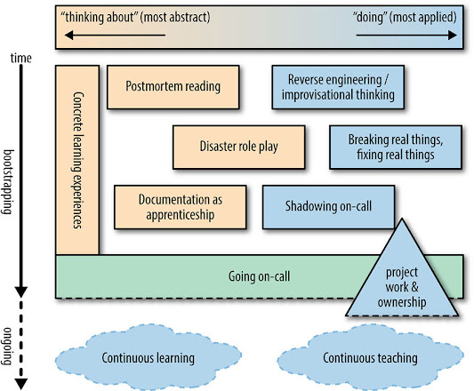

# Chương 28. Tăng tốc SRE đến On-Call và Hơn thế nữa (Accelerating SREs to On-Call and Beyond)

> **Nguyên bản:** [Chapter 28 - Accelerating SREs to On-Call and Beyond](https://sre.google/sre-book/accelerating-sre-on-call/)
> **Nguồn:** Google SRE Book (O'Reilly)
> **Bản dịch tiếng Việt** (Đội biên tập Softdreams RnD)

---

**Làm thế nào tôi có thể gắn một chiếc jetpack (bộ siêu tăng tốc) cho những người mới của mình trong khi vẫn giúp các SRE cấp cao theo kịp?**

*Tác giả:* Andrew Widdowson
*Biên tập:* Shylaja Nukala

## Bạn Đã Thuê SRE Tiếp Theo, Vậy Tiếp Theo Là Gì? (You've Hired Your Next SRE(s), Now What?)

Bạn đã thuê các nhân viên mới, và họ bắt đầu với vai trò Site Reliability Engineer (SRE). Giờ đây bạn phải đào tạo họ ngay tại chỗ. Đầu tư ngay từ đầu vào giáo dục và định hướng kỹ thuật cho các SRE mới sẽ định hình họ thành những kỹ sư giỏi hơn. Loại đào tạo này giúp họ đạt thành thạo nhanh hơn, đồng thời làm cho bộ kỹ năng của họ vững vàng và cân bằng hơn.

Các đội SRE thành công được xây dựng trên niềm tin — để duy trì một dịch vụ nhất quán ở quy mô toàn cầu, bạn cần tin rằng đồng sự on-call của bạn biết hệ thống hoạt động ra sao,[1](#fn1) có thể chẩn đoán các hành vi bất thường, thoải mái khi nhờ sự giúp đỡ, và có thể phản ứng dưới áp lực để cứu nguy. Vì vậy, việc nghĩ về giáo dục SRE qua lăng kính "một người mới cần học gì để đi on-call?" là thiết yếu nhưng chưa đủ. Với yêu cầu về niềm tin, bạn cũng cần đặt ra những câu hỏi như:

-   Các on-caller hiện có của tôi có thể đánh giá mức độ sẵn sàng đi on-call của người mới như thế nào?
-   Chúng tôi có thể tận dụng sự nhiệt huyết và tò mò trong các nhân viên mới của mình để đảm bảo rằng các SRE hiện có được hưởng lợi từ điều đó như thế nào?
-   Những hoạt động nào mà tôi có thể cam kết đội của chúng tôi, hoạt động mang lại lợi ích cho việc giáo dục của mọi người, nhưng mọi người sẽ thích?

Các học viên có phạm vi sở thích học tập rất rộng. Vì bạn sẽ thuê những người mang sự pha trộn của các sở thích này, chỉ đáp ứng một phong cách mà hy sinh các phong cách khác là một cách nhìn ngắn hạn. Do đó, không có phong cách giáo dục nào tối ưu nhất để đào tạo SRE mới, và chắc chắn không có công thức bí truyền duy nhất cho tất cả các đội SRE. [Bảng 28-1](#bang-28-1) liệt kê các [thực hành đào tạo](https://sre.google/resources/practices-and-processes/training-site-reliability-engineers/) (và các anti-pattern tương ứng) phổ biến trong SRE tại Google. Các thực hành này là một phạm vi rộng các lựa chọn giúp đội của bạn được trang bị tốt về các khái niệm SRE, cả ở hiện tại lẫn liên tục.

**Bảng 28-1. Các thực hành giáo dục SRE**

| **Mơ-típ được đề xuất** | **Anti-patterns** |
|---|---|
| Thiết kế các trải nghiệm học tập cụ thể, tuần tự để học viên theo dõi | Trút cho học viên nhiều công việc vặt (ví dụ, triage alert/ticket) để đào tạo họ; "thử thách bằng lửa" |
| Khuyến khích reverse engineering, tư duy thống kê và làm việc từ các nguyên lý cơ bản | Đào tạo thuần túy qua các quy trình vận hành, checklist và playbook |
| Tôn vinh việc phân tích thất bại bằng cách đề xuất các postmortem cho học viên đọc | Xử lý các outage như những bí mật phải chôn vùi để tránh đổ lỗi |
| Tạo ra các sự hỏng hóc bị chứa gọn nhưng thực tế để học viên sửa chữa bằng các công cụ monitoring thật | Để cơ hội đầu tiên để sửa thứ gì đó chỉ xảy ra sau khi học viên đã on-call |
| Đóng vai các thảm họa lý thuyết như một nhóm, để đan xen các cách tiếp cận giải quyết vấn đề của một đội | Tạo ra các chuyên gia trong đội mà kỹ thuật và kiến thức của họ bị chia ngăn cách |
| Cho phép học viên shadow vòng on-call sớm, so sánh ghi chú với on-caller | Đẩy học viên vào làm on-call chính trước khi họ đạt được sự hiểu biết toàn diện về dịch vụ của mình |
| Ghép học viên với các SRE chuyên gia để xem lại các mục có tính mục tiêu của kế hoạch đào tạo on-call | Xử lý các kế hoạch đào tạo on-call như tĩnh và bất khả xâm phạm, ngoại trừ do các chuyên gia chuyên ngành |
| Dành ra công việc dự án không tầm thường để học viên thực hiện, cho phép họ đạt được sự sở hữu một phần trong stack | Gán tất cả công việc dự án mới cho các SRE cấp cao nhất, để các SRE cấp thấp nhặt lại phần còn thừa |

Phần còn lại của chương này trình bày các chủ đề lớn mà chúng tôi thấy hiệu quả trong việc tăng tốc SRE đến on-call và hơn thế. Các khái niệm này có thể hình dung trong một bản thiết kế (blueprint) để khởi tạo (bootstrap) các SRE ([Hình 28-1](#hinh-28-1)).

        

**Hình 28-1.** Một bản thiết kế để khởi tạo một SRE đến on-call và hơn thế nữa

Hình minh họa này nắm bắt các thực hành tốt nhất mà các đội SRE có thể chọn để giúp khởi tạo các thành viên mới, trong khi giữ cho nhân tài cấp cao luôn tươi mới. Từ nhiều công cụ ở đây, bạn có thể chọn lọc các hoạt động phù hợp nhất với đội của bạn.

Hình minh họa có hai trục:

-   Trục x đại diện cho *quang phổ giữa các loại công việc khác nhau*, trải dài từ các hoạt động trừu tượng đến các hoạt động áp dụng.
-   Trục y đại diện cho *thời gian*. Đọc từ trên xuống, các SRE mới có rất ít kiến thức về các hệ thống và dịch vụ mà họ sẽ chịu trách nhiệm, nên các postmortem mô tả chi tiết cách các hệ thống này đã thất bại trong quá khứ là một điểm khởi đầu tốt. Các SRE mới cũng có thể cố gắng reverse engineer các hệ thống từ các nguyên lý cơ bản, vì họ bắt đầu từ số không. Một khi họ hiểu nhiều hơn về các hệ thống của mình và đã làm một số công việc thực hành, các SRE sẵn sàng để shadow on-call và bắt đầu vá lại các tài liệu chưa hoàn chỉnh hoặc lỗi thời.

Mẹo để diễn giải hình minh họa này:

-   *Đi on-call* là một mốc trong sự nghiệp của một SRE mới, sau đó điểm này việc học trở nên mơ hồ, không xác định và tự định hướng hơn rất nhiều — do đó là các đường đứt đứt bao quanh các hoạt động xảy ra tại hoặc sau khi SRE đi on-call.
-   Hình dạng tam giác của *công việc dự án & sở hữu* cho thấy rằng công việc dự án bắt đầu nhỏ và xây dựng theo thời gian, trở nên phức tạp hơn và nhiều khả năng tiếp tục rất lâu sau khi đi on-call.
-   Một số hoạt động và thực hành này rất trừu tượng/bị động, và một số rất áp dụng/chủ động. Một vài hoạt động là sự pha trộn của cả hai. Tốt là có một sự đa dạng các phương thức học tập để phù hợp với các phong cách học tập khác nhau.
-   Để đạt hiệu quả tối đa, các hoạt động và thực hành đào tạo nên được nhịp độ phù hợp: một số phù hợp để thực hiện ngay, một số nên xảy ra ngay trước khi một SRE chính thức đi on-call, và một số nên liên tục và kéo dài ngay cả với các SRE kỳ cựu. *Các trải nghiệm học tập cụ thể* nên diễn ra trong toàn bộ thời gian dẫn đến [SRE đi on-call](https://sre.google/sre-book/being-on-call/).

## Những Trải nghiệm Học Tập Ban Đầu: Lập luận cho Cấu trúc hơn là Hỗn loạn (Initial Learning Experiences: The Case for Structure Over Chaos)

Như đã thảo luận ở nơi khác trong cuốn sách này, các đội SRE thực hiện một sự pha trộn tự nhiên của công việc chủ động (proactive)[2](#fn2) và phản ứng (reactive)[3](#fn3). Mục tiêu mạnh mẽ của mỗi đội SRE là kiểm soát và giảm công việc phản ứng thông qua sự chủ động, và cách bạn onboarding người mới cũng không ngoại lệ. Hãy xem xét quy trình onboarding quá phổ biến nhưng đáng buồn là kém tối ưu sau đây:

> John là thành viên mới nhất của đội SRE FooServer. Các SRE cấp cao trong đội này được giao rất nhiều công việc chân tay, như phản hồi các ticket (yêu cầu), đối phó với các alert (cảnh báo), và thực hiện các lần rollout (phát hành) binary tẻ nhạt. Vào ngày làm việc đầu tiên của John, anh ấy được gán tất cả các ticket đến mới. Anh ấy được nói rằng anh ấy có thể hỏi bất kỳ thành viên nào của đội SRE giúp anh ấy thu thập nền tảng cần thiết để giải mã một ticket. "Chắc chắn sẽ có rất nhiều việc học ban đầu mà bạn sẽ phải làm," quản lý của John nói. "Nhưng cuối cùng bạn sẽ nhanh hơn nhiều với những ticket này. Một ngày nào đó, nó sẽ *click* và bạn sẽ biết rất nhiều về tất cả các công cụ chúng tôi sử dụng, các quy trình chúng tôi tuân theo, và các hệ thống chúng tôi duy trì." Một thành viên cấp cao của đội bình luận, "Chúng tôi đang ném bạn vào đầu sâu của bể bơi đây."

Phương pháp "thử thách bằng lửa" này để định hướng người mới thường sinh ra từ môi trường hiện tại của đội; các đội SRE do ops điều hành, phản ứng, "đào tạo" thành viên mới bằng cách bắt họ…chà, phản ứng! Lặp đi lặp lại. Nếu may mắn, những kỹ sư đã giỏi điều hướng sự mơ hồ sẽ bò ra khỏi cái hố bạn đã đặt họ vào. Nhưng nhiều khả năng, chiến lược này đã xa cách hóa một số kỹ sư có năng lực. Cách tiếp cận như vậy có thể cuối cùng tạo ra các nhân viên vận hành giỏi, nhưng kết quả sẽ không đạt chuẩn. Phương pháp thử thách bằng lửa cũng giả định rằng nhiều hoặc phần lớn khía cạnh của một đội có thể dạy thuần túy bằng việc làm, chứ không phải bằng suy luận. Nếu tập hợp công việc trong một hàng đợi ticket đã đủ đào tạo cho công việc đó, thì đây không phải là vị trí SRE.

Các học viên SRE sẽ có những câu hỏi như:

-   Tôi đang làm việc về cái gì?
-   Tôi đã đạt được bao nhiêu tiến bộ?
-   Khi nào những hoạt động này tích lũy đủ kinh nghiệm để tôi đi on-call?

Việc nhảy từ một công ty hoặc trường đại học trước đó, trong khi đổi vai trò (từ kỹ sư phần mềm hoặc quản trị viên hệ thống truyền thống) sang vai trò *Site Reliability Engineer* mơ hồ này, thường đủ để đánh gục sự tự tin của học viên. Đối với những người tính cách nội tâm hơn (đặc biệt về câu hỏi #2 và #3), sự bất định do các câu trả lời mơ hồ gây ra có thể dẫn đến phát triển chậm hơn hoặc các vấn đề về giữ chân. Thay vào đó, hãy xem xét các cách tiếp cận được phác thảo trong các mục tiếp theo. Những gợi ý này cụ thể như bất kỳ ticket hoặc alert nào, nhưng cũng tuần tự, và do đó phần thưởng hơn nhiều.

## Các Lối đi Học Tập Tích lũy và Có Trật tự (Learning Paths That Are Cumulative and Orderly)

Đưa một mức độ trật tự học tập nhất định vào hệ thống của bạn để các SRE mới nhìn thấy một con đường trước mặt. Bất kỳ loại đào tạo nào cũng tốt hơn các ticket và interrupt ngẫu nhiên, nhưng hãy có ý thức kết hợp đúng sự pha trộn giữa lý thuyết và ứng dụng: các khái niệm trừu tượng sẽ lặp lại nhiều lần trong hành trình của người mới nên được đưa lên trước, trong khi học viên cũng nên được thực hành càng sớm càng tốt.

Việc tìm hiểu về stack và subsystem (hệ thống con) của bạn đòi hỏi một điểm khởi đầu. Hãy xem xét liệu có hợp lý hơn để nhóm các đào tạo lại với nhau theo sự tương tự về mục đích, hay theo thứ tự thực thi trong trường hợp bình thường. Ví dụ, nếu đội của bạn chịu trách nhiệm cho một stack phục vụ thời gian thực, hướng đến người dùng, hãy xem xét một thứ tự chương trình học như sau:

1) Cách một query (truy vấn) đi vào hệ thống

Cơ sở hạ tầng mạng và datacenter (trung tâm dữ liệu), load balancing (cân bằng tải) frontend (mặt trước), proxies (bộ định tuyến trung gian), v.v.

2) Phục vụ frontend

Các frontend ứng dụng, query logging (ghi log truy vấn), SLO (mục tiêu mức dịch vụ) của trải nghiệm người dùng, v.v.

#### 3) Dịch vụ mid-tier (tầng trung gian)

Caches (bộ nhớ đệm), load balancing backend (phía sau)

4) Hạ tầng

Backends (hệ thống phía sau), hạ tầng, và các tài nguyên tính toán

5) Kết nối tất cả

Kỹ thuật debug (xử lý lỗi), quy trình leo thang (escalation), và các kịch bản khẩn cấp

Cách bạn chọn trình bày các cơ hội học tập (trò chuyện bảng trắng không chính thức, bài giảng chính thức, hay bài tập khám phá thực hành) là do bạn và các SRE giúp bạn cấu trúc, thiết kế và triển khai đào tạo quyết định. Đội SRE Google Search cấu trúc việc học này qua một tài liệu gọi là "on-call learning checklist" (danh sách kiểm tra học tập on-call). Một phần được đơn giản hóa của một on-call learning checklist có thể trông như sau:

**The Results Mixing Server ("Mixer")**

**Frontended by**: Frontend server

**Backends called**: Results Retrieval Server, Geolocation Server, Personalization Database

**SRE experts**: Sally W, Dave K, Jen P

**Developer contacts**: Jim T, *results-team@*

**Know before moving on** (Cần biết trước khi tiếp tục):

-   Các cluster (cụm) nào có Mixer được triển khai
-   Cách rollback (hoàn tác) một release của Mixer
-   Các backends của Mixer nào được coi là "critical path" (đường lối quan trọng) và tại sao

**Read and understand the following docs** (Đọc và hiểu các tài liệu sau):

-   Results Mixing Overview: section "Query execution"
-   Results Mixing Overview: section "Production"
-   Playbook: How to Roll Out a New Results Mixing Server
-   A Performance Analysis of Mixer

**Comprehension questions** (Câu hỏi kiểm tra mức độ hiểu):

-   H: Lịch trình release thay đổi như thế nào nếu một ngày lễ của công ty xảy ra vào ngày build release bình thường?
-   H: Bạn có thể sửa một lần push (phát hành) xấu của dataset (bộ dữ liệu) geolocation (định vị địa lý) như thế nào?

Hãy lưu ý rằng phần trên không trực tiếp mã hóa các quy trình, các bước chẩn đoán, hay playbook; thay vào đó, đây là một bản viết tương đối bất tử, tập trung nghiêm ngặt vào việc liệt kê các liên hệ chuyên gia, nổi bật các nguồn tài liệu hữu ích nhất, thiết lập kiến thức cơ bản bạn phải thu thập và nội hóa, và đặt ra các câu hỏi sâu sắc chỉ có thể trả lời khi kiến thức cơ bản đó đã được hấp thụ. Nó cũng nêu các kết quả cụ thể, để học viên biết họ sẽ đạt được loại kiến thức và kỹ năng nào từ việc hoàn thành phần này.

Điều hay là tất cả các bên liên quan đều có được cảm nhận về lượng thông tin người học đang giữ lại. Cơ chế phản hồi này có lẽ không cần chính thức như một bài kiểm tra, nhưng đó là thực hành tốt khi có các phần bài tập hoàn chỉnh đặt ra các câu hỏi về cách dịch vụ của bạn hoạt động. Những câu trả lời thỏa đáng, được kiểm tra bởi mentor (người cố vấn) của học viên, là dấu hiệu rằng việc học nên tiếp tục sang giai đoạn tiếp theo. Các câu hỏi về cơ chế bên trong của dịch vụ của bạn có thể trông giống như:

-   Các backends nào của server này được coi là "trong critical path," và tại sao?
-   Những khía cạnh nào của server này có thể được đơn giản hóa hoặc tự động hóa?
-   Bạn nghĩ nút thắt cổ chai (bottleneck) đầu tiên trong kiến trúc này ở đâu? Nếu nút thắt cổ chai đó bị bão hòa, bạn có thể thực hiện những bước nào để giảm nhẹ nó?

Tùy thuộc vào cách quyền truy cập được cấu hình cho dịch vụ, bạn có thể xem xét triển khai một mô hình truy cập phân tầng. Tầng đầu tiên cho phép học viên truy cập chỉ-đọc vào cơ chế bên trong của các thành phần, và một tầng sau đó cho phép họ thay đổi trạng thái production. Hoàn thành các phần của on-call learning checklist một cách thỏa đáng sẽ giúp học viên đạt truy cập ngày càng sâu hơn vào hệ thống. Đội Search SRE gọi các cấp độ đạt được này là "powerups"[4](#fn4) trên con đường đến on-call, vì học viên cuối cùng được thêm vào cấp truy cập hệ thống cao nhất.

## Công việc Dự án Có Tính Mục tiêu, Không phải Công việc Vặt (Targeted Project Work, Not Menial Work)

SRE là những người giải quyết vấn đề, nên hãy cho họ một vấn đề đàng hoàng để giải quyết! Khi mới bắt đầu, ngay cả một cảm giác sở hữu nhỏ đối với dịch vụ của đội cũng có thể làm những điều kỳ diệu cho việc học. Sự sở hữu như vậy còn tạo bước đột phá lớn cho việc xây dựng niềm tin giữa các đồng nghiệp cấp cao, vì họ sẽ tìm đến đồng nghiệp cấp thấp hơn để hiểu về các thành phần hoặc quy trình mới. Các cơ hội sở hữu ban đầu là tiêu chuẩn trên toàn Google: mọi kỹ sư đều được giao một dự án khởi đầu cung cấp một tour tham quan hạ tầng đủ để họ sớm đưa ra một đóng góp nhỏ nhưng hữu ích. Việc để SRE mới chia thời gian giữa việc học *và* công việc dự án cũng cho họ cảm giác mục đích và năng suất, điều sẽ không có nếu họ chỉ học *hoặc* chỉ làm dự án. Một số mô hình dự án khởi đầu có vẻ hiệu quả bao gồm:

-   Thực hiện một thay đổi tính năng hiển thị cho người dùng tầm thường trong một stack phục vụ, rồi đưa tính năng đó release qua đến production. Hiểu cả toolchain phát triển và quy trình release binary khuyến khích sự đồng cảm với các nhà phát triển.
-   Thêm monitoring vào dịch vụ ở những nơi hiện đang là điểm mù. Người mới sẽ phải suy luận với logic monitoring, trong khi đối chiếu hiểu biết của họ về hệ thống với cách nó thực sự (sai) hoạt động.
-   Tự động hóa một điểm đau chưa đủ đau để đã được tự động hóa, cho SRE mới thấy được giá trị mà các SRE đặt vào việc loại bỏ toil (việc chân tay) khỏi các hoạt động hàng ngày.

## Tạo ra các Lập trình viên Phân tích Ngược và Nhà tư duy Tạm ứng Xuất sắc (Creating Stellar Reverse Engineers and Improvisational Thinkers)

Chúng tôi có thể đề xuất một bộ hướng dẫn về *cách* đào tạo SRE mới, nhưng *nên đào tạo họ về cái gì*? [Tài liệu đào tạo](https://sre.google/resources/practices-and-processes/training-site-reliability-engineers/) sẽ phụ thuộc vào công nghệ được sử dụng trong công việc, nhưng câu hỏi quan trọng hơn là: chúng ta đang muốn tạo ra những kỹ sư như thế nào? Ở quy mô và độ phức tạp mà SRE vận hành, họ không thể đơn thuần chỉ tập trung vào vận hành như những quản trị viên hệ thống truyền thống. Ngoài tâm thế kỹ thuật ở quy mô lớn, SRE nên thể hiện các đặc điểm sau:

-   Trong suốt công việc của họ, họ sẽ gặp các hệ thống mà họ chưa bao giờ thấy trước, nên họ cần phải có *kỹ năng reverse engineering mạnh mẽ*.
-   Ở quy mô lớn, sẽ có các bất thường khó phát hiện, nên họ sẽ cần khả năng *suy nghĩ thống kê*, chứ không phải thủ tục, để lột mặt các vấn đề.
-   Khi các quy trình vận hành tiêu chuẩn bị phá vỡ, họ sẽ cần phải có thể *tạm ứng hoàn toàn*.

Hãy xem xét các thuộc tính này kỹ hơn, để chúng ta có thể hiểu cách trang bị cho các SRE của chúng tôi những kỹ năng và hành vi này.

## Người Phân tích Ngược: Tìm ra Cách Các Thứ Hoạt Động (Reverse Engineers: Figuring Out How Things Work)

Các kỹ sư tò mò về cách các hệ thống mà họ chưa từng thấy hoạt động — hoặc, có khả năng hơn, cách các phiên bản hiện tại của những hệ thống họ từng biết khá kỹ đang hoạt động. Với một sự hiểu biết cơ sở về cách các hệ thống vận hành trong công ty, cộng với ý chí đào sâu vào các công cụ debug, các ranh giới RPC và các log của các binary, các SRE sẽ trở nên hiệu quả hơn khi truy tìm các vấn đề bất ngờ trong các kiến trúc hệ thống bất ngờ. Hãy dạy các SRE của bạn về các bề mặt chẩn đoán và debug của ứng dụng, và để họ thực hành rút ra các suy luận từ thông tin mà các bề mặt này tiết lộ, để hành vi đó thành phản xạ khi đối phó với các outage sau này.

## Người tư duy Thống kê và So sánh: Những Người Quản gia của Phương pháp Khoa học dưới Áp lực (Statistical and Comparative Thinkers: Stewards of the Scientific Method Under Pressure)

Bạn có thể nghĩ cách tiếp cận của SRE đối với phản ứng incident cho các hệ thống quy mô lớn như việc điều hướng qua một cây quyết định khổng lồ đang mở ra trước mặt. Trong cửa sổ thời gian hạn chế do yêu cầu của phản ứng incident đặt ra, SRE có thể thực hiện một vài hành động trong số hàng trăm, với mục đích giảm nhẹ outage cả ngắn hạn lẫn dài hạn. Vì thời gian thường là quan trọng bậc nhất, SRE phải cắt tỉa cây quyết định này một cách hiệu quả. Khả năng đó một phần đến từ kinh nghiệm, thứ chỉ có được theo thời gian qua việc tiếp xúc với nhiều hệ thống production. Kinh nghiệm này phải được ghép với việc xây dựng cẩn thận các giả thuyết mà, khi được chứng minh hoặc bác bỏ, sẽ thu hẹp hơn nữa không gian quyết định. Nói cách khác, truy tìm các sự hỏng hóc thường giống một trò chơi "trong số những thứ này, thứ nào không giống?" trong đó "những thứ" có thể là phiên bản kernel, kiến trúc CPU, phiên bản binary trong stack, sự pha trộn traffic theo vùng, hoặc hàng trăm yếu tố khác. Về mặt kiến trúc, trách nhiệm của đội là đảm bảo các yếu tố này có thể được kiểm soát và so sánh từng cái một. Nhưng chúng ta cũng nên đào tạo các SRE mới nhất trở thành những nhà phân tích, người so sánh giỏi từ những khoảnh khắc đầu tiên.

## Nghệ sĩ Tạm ứng: Khi Điều Bất Ngờ Xảy Ra (Improv Artists: When the Unexpected Happens)

Bạn thử một sửa chữa cho sự hỏng hóc, nhưng nó không hoạt động. Các nhà phát triển đằng sau hệ thống đang thất bại ở đâu đó không thể thấy được. Bây giờ bạn làm gì? Bạn tạm ứng! Việc học nhiều công cụ có thể giải quyết các phần của vấn đề của bạn cho phép bạn thực hành phòng thủ nhiều lớp trong các hành vi giải quyết vấn đề của chính bạn. Việc quá thủ tục trước một outage, do đó quên đi các kỹ năng phân tích của bạn, có thể là sự khác biệt giữa việc bị mắc kẹt và việc tìm ra nguyên nhân gốc rễ. Một trường hợp troubleshooting bị lầy lội có thể bị thêm vào khi một SRE mang quá nhiều giả định chưa được kiểm tra về nguyên nhân của một outage vào quyết định của họ. Việc chứng minh rằng có nhiều bẫy phân tích mà các SRE có thể rơi vào, đòi hỏi "zoom out" (co nhỏ) và tiếp cận theo một cách khác đối với giải pháp, là một bài học có giá trị để các SRE học sớm.

Với ba thuộc tính tham vọng này của các SRE hiệu suất cao, những khóa học và trải nghiệm nào chúng ta có thể cung cấp cho các SRE mới để đưa họ đi theo một con đường đúng hướng? Bạn cần phải tự nghĩ ra nội dung khóa học của mình thể hiện những thuộc tính này, ngoài các thuộc tính khác cụ thể cho văn hóa SRE của bạn. Hãy xem xét một lớp mà chúng tôi tin rằng chạm đến tất cả các điểm nói trên.

## Kết nối Tất cả lại: Reverse Engineering một Dịch vụ Production (Tying This Together: Reverse Engineering a Production Service)

> Khi đến lúc phải học [một phần của stack Google Maps], [một SRE mới] hỏi rằng, thay vì thụ động để ai đó giải thích dịch vụ, cô ấy có thể tự làm điều này không — học mọi thứ thông qua các kỹ thuật lớp reverse engineering, và để phần còn lại của chúng tôi sửa cô ấy/điền vào những khoảng trống cho bất kỳ thứ gì cô ấy bỏ lỡ hoặc sai. Kết quả? Có lẽ nó chính xác và hữu ích hơn so với nếu *tôi* đã tự thuyết trình, và tôi đã on-call cho hệ thống này hơn 5 năm rồi!
> 
> Paul Cowan, Google Site Reliability Engineer

Một lớp phổ biến chúng tôi cung cấp tại Google mang tên "Reverse Engineering a Production Service (without help from its owners)". Kịch bản vấn đề trình bày có vẻ đơn giản ban đầu. Toàn bộ Đội Google News — SRE, Kỹ sư Phần mềm, Quản lý Sản phẩm, v.v. — đã đi một chuyến công ty: một chuyến du thuyền quanh Tam giác Bermuda. Chúng tôi mất tin đội trong 30 ngày, nên các học viên của chúng tôi là Đội SRE Google News vừa được bổ nhiệm. Họ cần tìm ra cách stack phục vụ hoạt động từ đầu đến cuối để nắm quyền điều hành và giữ cho nó chạy.

Sau khi nhận kịch bản, học viên được dẫn qua các bài tập tương tác, có mục đích, trong đó họ theo dõi đường đi của query từ trình duyệt web của họ xuyên qua hạ tầng Google. Ở mỗi giai đoạn, chúng tôi nhấn mạnh việc quan trọng là phải học nhiều cách khám phá tính kết nối giữa các server production, để không bỏ sót kết nối nào. Giữa lớp, chúng tôi thách thức học viên tìm một endpoint khác cho traffic đến, chứng minh rằng giả định ban đầu của chúng tôi có phạm vi quá hẹp. Rồi chúng tôi thách thức học viên tìm các lối vào stack khác. Chúng tôi khai thác bản chất được đo lường cao của các binary production, những thứ tự báo cáo tính kết nối RPC, cũng như giám sát hộp trắng và hộp đen (black-box monitoring) có sẵn, để xác định query của người dùng đi theo đường nào.[5](#fn5) Trên đường đi, chúng tôi xây dựng sơ đồ hệ thống và thảo luận về các thành phần hạ tầng dùng chung mà học viên có khả năng sẽ gặp lại.

Vào cuối lớp, học viên được giao một nhiệm vụ. Mỗi học viên trở về đội của mình và nhờ một SRE cấp cao giúp chọn một stack, hoặc một lát cắt của stack, mà họ sẽ on-call. Dùng kỹ năng học được trong lớp, học viên tự vẽ sơ đồ stack đó và trình bày phát hiện của họ cho SRE cấp cao. Không nghi ngờ gì, học viên sẽ bỏ sót một vài chi tiết tinh tế, điều sẽ tạo thành một cuộc thảo luận hay. Cũng có thể SRE cấp cao học được điều gì đó từ bài tập, phơi bày sự lệch lạc trong hiểu biết trước đó của họ về hệ thống luôn thay đổi. Vì các hệ thống production thay đổi nhanh, quan trọng là đội của bạn chào đón mọi cơ hội làm quen lại với một hệ thống, kể cả học từ những thành viên mới nhất chứ không phải cũ nhất.

## Năm Thực hành cho những Người Muốn On-Call (Five Practices for Aspiring On-Callers)

On-call không phải là mục đích quan trọng duy nhất của bất kỳ SRE nào, nhưng trách nhiệm kỹ thuật production thường liên quan đến một dạng phủ thông báo khẩn cấp nào đó. Người có khả năng nhận on-call là người hiểu hệ thống họ làm việc ở một chiều sâu và phạm vi hợp lý. Vì vậy, chúng tôi dùng "có khả năng nhận on-call" như một biến thay hữu ích cho "biết đủ và có thể tìm ra phần còn lại".

## Một Sự Đói khát Thất bại: Đọc và Chia sẻ các Postmortem (A Hunger for Failure: Reading and Sharing Postmortems)

> Những ai không thể nhớ quá khứ bị kết án phải lặp lại nó.
> 
> George Santayana, triết gia và nhà văn tiểu luận

Postmortem (xem [Văn hóa Postmortem: Học hỏi từ Thất bại](https://sre.google/sre-book/postmortem-culture/)) là một phần quan trọng của cải tiến liên tục. Chúng là cách không đổ lỗi để đi đến nhiều nguyên nhân gốc rễ của một outage đáng kể hoặc có thể nhìn thấy. Khi viết postmortem, hãy nhớ rằng khán giả trân trọng nó nhất có thể là một kỹ sư chưa được thuê. Không cần chỉnh sửa triệt để; những thay đổi tinh tế có thể biến các postmortem tốt nhất của chúng tôi thành các postmortem "có thể dạy được".

Ngay cả các postmortem tốt nhất cũng không hữu ích nếu chúng nằm bẹp ở đáy một tủ hồ sơ ảo. Suy ra, đội của bạn nên thu thập và tuyển chọn các postmortem có giá trị làm [nguồn tài liệu giáo dục](https://sre.google/resources/) cho những người mới sau này. Một số postmortem mang tính lặp lại, nhưng các "postmortem có thể dạy được", cung cấp hiểu biết sâu sắc vào các sự thất bại cấu trúc hoặc mới mẻ của hệ thống quy mô lớn, là quý như vàng cho học viên.

Sự sở hữu các postmortem không chỉ giới hạn ở việc viết. Với nhiều đội, được sống sót và ghi tài liệu về các outage lớn nhất là một điểm tự hào. Hãy thu thập các postmortem tốt nhất của bạn và đặt chúng ở nơi dễ thấy để những người mới — cùng các bên liên quan từ các đội liên quan và/hoặc tích hợp — có thể đọc. Yêu cầu các đội liên quan xuất bản các postmortem tốt nhất của họ ở nơi bạn có thể truy cập.

Một số đội SRE tại Google vận hành "câu lạc bộ đọc postmortem", nơi các postmortem thú vị và sâu sắc được lưu hành, đọc trước, rồi thảo luận. Tác giả gốc của postmortem có thể là khách mời danh dự tại cuộc họp. Các đội khác tổ chức các buổi "tales of fail" (lời kể về thất bại), nơi tác giả postmortem trình bày bán chính thức, kể lại outage và tự mình điều khiển cuộc thảo luận.

Việc đọc hoặc trình bày định kỳ về các outage, bao gồm điều kiện kích hoạt và các bước giảm nhẹ, làm những điều kỳ diệu cho việc xây dựng bản đồ tâm trí và sự hiểu biết về production và phản ứng on-call của SRE mới. Các postmortem cũng là nhiên liệu tuyệt vời cho các kịch bản thảm họa trừu tượng sau này.

## Đóng vai Thảm họa (Disaster Role Playing)

> Mỗi tuần một lần chúng tôi có một cuộc họp trong đó một nạn nhân được chọn để bị đặt vào tình thế khó xử trước nhóm, và một kịch bản — thường là một kịch bản thật được lấy từ các biên niên sử của lịch sử Google — được ném vào anh hoặc cô ấy. Nạn nhân, người mà tôi nghĩ như một người chơi show trò chơi, nói với người dẫn chương trình show trò chơi rằng họ sẽ làm gì hoặc truy vấn gì để hiểu hoặc giải quyết vấn đề, và người dẫn chương trình nói cho nạn nhân điều gì xảy ra với mỗi hành động hoặc quan sát. Nó giống như *SRE Zork*. Bạn trong một mê cung của các console giám sát ngoằn ngoèo, tất cả giống hệt nhau. Bạn phải cứu các người dùng vô tội khỏi việc trượt vào Hẻm vực Độ trễ Truy vấn Quá mức, cứu các datacenter khỏi Sự Cháy nổ Gần như Chắc chắn, và tha cho tất cả chúng ta sự xấu hổ của Việc Hiển thị Doodle Google Sai lầm.
> 
> Robert Kennedy, cựu Site Reliability Engineer cho Google Search và healthcare.gov[6](#fn6)

Khi có một nhóm SRE với mức độ kinh nghiệm khác nhau rất rộng, bạn làm gì để đưa tất cả họ lại với nhau và cho phép họ học từ nhau? Bạn truyền đạt văn hóa SRE và bản chất giải quyết vấn đề của đội cho một người mới như thế nào, trong khi vẫn giữ cho các kỳ cựu được cập nhật về các thay đổi và tính năng mới trong stack? Các đội SRE Google đối phó với những thách thức này qua một truyền thống được tôn vinh: đóng vai thảm họa thường xuyên. Ngoài nhiều tên gọi khác, bài tập này thường được gọi là "Wheel of Misfortune" hoặc "Walk the Plank". Cảm giác nguy hiểm hài hước mà những tên gọi như vậy mang lại làm bài tập đỡ đáng sợ hơn với các SRE mới tuyển.

Ở mức tốt nhất, những bài tập này thành một nghi lễ hàng tuần mà mọi thành viên nhóm học được điều gì đó. Công thức trực tiếp và có nét tương đồng với một tabletop RPG (trò chơi nhập vai): "game master" (GM) chọn hai thành viên đội làm on-call chính và thứ cấp; hai SRE này cùng GM đứng ở phía trước phòng. Một page được thông báo, và đội on-call phản ứng với những gì họ sẽ làm để giảm nhẹ và điều tra outage.

GM đã chuẩn bị cẩn thận một kịch bản sắp được mở ra. Kịch bản này có thể dựa trên một outage trước đó mà các thành viên đội mới hơn không có mặt hoặc mà các thành viên đội cũ hơn đã quên. Hoặc có lẽ kịch bản là một cuộc thám hiểm vào một sự hỏng hóc giả định của một tính năng mới hoặc sắp ra mắt trong stack, làm cho tất cả các thành viên trong phòng đều ở trạng thái chưa chuẩn bị đồng đều để đối phó với tình huống. Tốt hơn nữa, một đồng nghiệp có thể tìm thấy một sự hỏng hóc mới và mới mẻ trong production, và kịch bản hôm nay mở rộng từ mối đe dọa mới này.

Trong 30–60 phút tiếp theo, on-caller chính và thứ cấp cố tìm nguyên nhân gốc rễ của vấn đề. GM sẵn lòng cung cấp thêm ngữ cảnh khi vấn đề mở ra, có thể cho on-caller (và khán giả) biết các biểu đồ trên dashboard giám sát có thể trông như thế nào trong suốt outage. Nếu incident đòi leo thang ra ngoài đội chủ, GM giả làm một thành viên của đội kia vì mục đích kịch bản. Không kịch bản ảo nào là hoàn hảo, nên đôi khi GM phải đưa người tham gia về đúng đường bằng cách chuyển on-caller ra khỏi các mồi nhử (red herring), tạo thêm sự khẩn cấp và rõ ràng bằng các kích thích khác,[7](#fn7) hoặc đặt các câu hỏi khẩn cấp và thấu đáo.[8](#fn8)

Khi RPG thảm họa của bạn thành công, mọi người sẽ học được điều gì đó: có lẽ một công cụ hoặc mẹo mới, một góc nhìn khác về cách giải quyết một vấn đề, hoặc (đặc biệt làm hài lòng các thành viên đội mới) một sự xác nhận rằng bạn đã có thể giải quyết vấn đề của tuần này nếu bạn được chọn. Với một chút may mắn, bài tập này sẽ truyền cảm hứng cho các đồng đội háo hức mong đợi cuộc phiêu lưu của tuần tới hoặc để yêu cầu trở thành game master cho một tuần sắp tới.

## Phá Vỡ Các Thứ Thật, Sửa Các Thứ Thật (Break Real Things, Fix Real Things)

Một người mới có thể học nhiều về SRE bằng cách đọc tài liệu, postmortem và tham gia các đào tạo. Đóng vai thảm họa giúp đưa tâm trí người mới vào cuộc chơi. Tuy nhiên, kinh nghiệm từ việc thực sự phá vỡ và/hoặc sửa chữa các hệ thống production *thật* còn tốt hơn. Sẽ có đủ thời gian cho kinh nghiệm thực hành khi người mới đã đi on-call, nhưng việc học như vậy nên xảy ra *trước* khi SRE mới đến điểm đó. Vì vậy, hãy cung cấp những trải nghiệm thực hành này sớm hơn nhiều, để phát triển phản xạ phản ứng của học viên khi dùng các công cụ và monitoring của công ty để tiếp cận một outage đang phát triển.

Tính chân thực là tối thượng trong những tương tác này. Lý tưởng nhất, đội bạn có một stack được multihomed và provision theo cách mà bạn có ít nhất một instance có thể chuyển hướng khỏi traffic trực và cho vay tạm thời cho một bài tập học tập. Ngược lại, bạn có thể có một instance staging hoặc QA nhỏ hơn nhưng vẫn đầy đủ tính năng của stack, có thể mượn trong một thời gian ngắn. Nếu có thể, chủ động đưa stack chạy dưới tải tổng hợp (synthetic load) xấp xỉ traffic người dùng/client thực, cùng với mức tiêu thụ tài nguồn.

Cơ hội học hỏi từ một hệ thống production thực dưới tải tổng hợp là dồi dào. Các SRE cấp cao đã trải qua đủ loại rắc rối: cấu hình sai, rò rỉ bộ nhớ, suy giảm hiệu năng, truy vấn sập, nút thắt cổ chai lưu trữ, và nhiều hơn. Trong môi trường thực tế nhưng tương đối không rủi ro này, người giám sát (proctor) có thể thao tác tập hợp job theo cách thay đổi hành vi của stack, buộc SRE mới tìm ra các khác biệt, xác định các yếu tố đóng góp, và cuối cùng sửa chữa hệ thống để khôi phục hành vi phù hợp.

Như một lựa chọn thay thế cho sự phức tạp của việc yêu cầu một SRE cấp cao cẩn thận lên kế hoạch một loại sự hỏng hóc cụ thể mà các SRE mới phải sửa chữa, bạn cũng có thể làm việc theo hướng ngược lại với một bài tập có thể cũng làm tăng sự tham gia từ toàn bộ đội: làm việc từ một cấu hình đã biết tốt và từ từ làm suy yếu stack tại các nút thắt cổ chai được chọn, quan sát các nỗ lực phía trước và phía sau thông qua monitoring của bạn. Bài tập này được đánh giá cao bởi đội Google Search SRE, phiên bản của bài tập này được gọi là "Let's burn a search cluster to the ground!" (Hãy đốt cháy một cụm tìm kiếm đến đống tro!). Bài tập được thực hiện như sau:

1.  Như một nhóm, chúng tôi thảo luận về những đặc tính hiệu năng quan sát được nào có thể thay đổi khi chúng tôi làm tê liệt stack.
2.  Trước khi gây ra hư hại đã lên kế hoạch, chúng tôi thăm dò các người tham gia về những phỏng đoán và suy luận của họ về các dự đoán của họ về cách hệ thống sẽ phản ứng.
3.  Chúng tôi xác thực các giả định và biện minh cho suy luận đằng sau các hành vi mà chúng tôi thấy.

Bài tập này, mà chúng tôi thực hiện hàng quý, loại bỏ các bug mới mà chúng tôi nhiệt tình sửa chữa, vì các hệ thống của chúng tôi không phải lúc nào cũng suy giảm một cách êm ả như chúng tôi mong đợi.

## Tài liệu như Sự Học việc (Documentation as Apprenticeship)

Nhiều đội SRE duy trì một "on-call learning checklist", là danh sách đọc và hiểu được tổ chức của các công nghệ và khái niệm liên quan đến các hệ thống họ duy trì. Học viên phải nội hóa danh sách này trước khi đủ điều kiện làm on-caller shadow. Hãy dành một lát xem lại ví dụ về on-call learning checklist ở [Bảng 28-2](#bang-28-2). Danh sách kiểm tra học tập phục vụ các mục đích khác nhau cho những người khác nhau:

-   **Đối với học viên**:
    
    -   Tài liệu này giúp thiết lập các ranh giới của hệ thống mà đội của họ hỗ trợ.
    -   Bằng cách nghiên cứu danh sách này, học viên đạt được một cảm giác về hệ thống nào quan trọng nhất và tại sao. Khi họ hiểu thông tin ở đó, họ có thể chuyển sang các chủ đề khác mà họ cần học, thay vì sa vào việc học các chi tiết bí ẩn có thể học được theo thời gian.
-   **Đối với các người cố vấn và quản lý**: Tiến độ của học viên qua danh sách kiểm tra học tập có thể được quan sát. Danh sách kiểm tra trả lời các câu hỏi như:
    
    -   Bạn đang làm việc trên phần nào hôm nay?
    -   Những phần nào gây bối rối nhất?
-   **Đối với tất cả các thành viên đội**: Tài liệu trở thành một hợp đồng xã hội mà theo đó (khi thành thạo) học viên tham gia hàng ngũ on-call. Danh sách kiểm tra học tập thiết lập tiêu chuẩn mà tất cả các thành viên đội nên hướng đến và duy trì.
    

Trong môi trường thay đổi nhanh, tài liệu có thể lỗi thời nhanh chóng. Tài liệu lỗi thời ít là vấn đề với các SRE cấp cao đã theo kịp, vì họ giữ trạng thái thế giới và các thay đổi của nó trong đầu. SRE mới cần tài liệu cập nhật hơn nhiều, nhưng có thể không cảm thấy được trao quyền hoặc đủ kiến thức để thay đổi. Khi được thiết kế với đúng lượng cấu trúc, tài liệu on-call có thể thành một khối lượng công việc thích ứng, tận dụng sự nhiệt huyết của người mới và kiến thức của người cấp cao để giữ cho tất cả mọi người luôn tươi mới.

Trong Search SRE, chúng tôi chuẩn bị đón các thành viên đội mới bằng cách xem lại on-call learning checklist và sắp xếp các phần theo mức độ cập nhật. Khi thành viên mới đến, chúng tôi chỉ họ đến danh sách kiểm tra học tập tổng thể, nhưng cũng giao cho họ nhiệm vụ đại tu một hoặc hai phần lỗi thời nhất. Như trong [Bảng 28-2](#bang-28-2), chúng tôi dán nhãn liên hệ SRE cấp cao và nhà phát triển cho mỗi công nghệ. Chúng tôi khuyến khích học viên thiết lập kết nối sớm với những chuyên gia đó để họ có thể học trực tiếp cơ chế bên trong của công nghệ đã chọn. Sau đó, khi quen hơn với phạm vi và giọng điệu của danh sách kiểm tra, họ được kỳ vọng đóng góp một phần danh sách đã sửa đổi, phải được peer-review bởi một hoặc nhiều SRE cấp cao được liệt kê làm chuyên gia.

## Shadow On-Call Sớm và Thường xuyên (Shadow On-Call Early and Often)

Cuối cùng, không có lượng bài tập thảm họa giả định hay cơ chế đào tạo nào khác có thể chuẩn bị hoàn toàn cho một SRE đi on-call. Vào cuối ngày, đối phó với các outage thật luôn có lợi hơn về mặt học tập so với việc tham gia vào các giả định. Nhưng không công bằng khi bắt người mới đợi đến khi có page thật đầu tiên mới có cơ hội học và giữ kiến thức.

Sau khi học viên đã làm quen với các nền tảng hệ thống (bằng cách hoàn thành, ví dụ, một on-call learning checklist), hãy cân nhắc cấu hình hệ thống cảnh báo để sao chép các page đến cho người mới, ban đầu chỉ trong giờ làm việc. Hãy dựa vào sự tò mò của họ để dẫn đường. Những ca on-call "shadow" này là cách tuyệt vời để người cố vấn thấy được tiến độ của học viên, và để học viên thấy được các trách nhiệm của on-call. Bằng cách sắp xếp cho người mới shadow nhiều thành viên đội, đội sẽ ngày càng thoải mái với ý nghĩ người này sẽ vào [vòng on-call.](https://sre.google/sre-book/being-on-call/) Việc gieo niềm tin theo cách này là một phương pháp hiệu quả xây dựng tin tưởng, cho phép các thành viên cấp cao hơn tách ra khi không on-call, do đó giúp tránh sự kiệt sức của đội.

Khi một page đến, SRE mới không phải on-caller được chỉ định, một điều kiện loại bỏ mọi áp lực thời gian với học viên. Giờ họ có vị trí hàng ghế đầu để xem outage khi nó mở ra, thay vì sau khi vấn đề được giải quyết. Có thể học viên và on-caller chính chia sẻ một phiên terminal, hoặc ngồi gần nhau để dễ so sánh ghi chú. Vào một thời điểm tiện lợi cho cả hai sau khi outage kết thúc, on-caller có thể xem lại các suy luận và quy trình đã được tuân theo vì lợi ích của học viên. Bài tập này làm tăng mức độ giữ lại của on-caller shadow về những gì thực sự đã xảy ra.

### Mẹo (Tip)

Nếu một outage xảy ra mà việc viết một postmortem là có lợi, on-caller nên bao gồm người mới như một đồng tác giả. *Đừng trút toàn bộ bài viết lên học viên, vì điều đó có thể bị học sai rằng postmortem là một loại công việc chân tay cần được chuyển cho những người trẻ nhất. Sẽ là một sai lầm nếu tạo ra ấn tượng như vậy.*

Một số đội cũng có thêm một bước cuối: để on-caller có kinh nghiệm "reverse shadow" học viên. Người mới trở thành on-call chính và nhận tất cả các leo thang đến, nhưng on-caller có kinh nghiệm ẩn trong bóng tối, độc lập chẩn đoán tình huống mà không thay đổi bất kỳ trạng thái nào. SRE có kinh nghiệm luôn sẵn sàng để hỗ trợ chủ động, giúp đỡ, xác thực và gợi ý khi cần.

## On-Call và Hơn thế: Nghi lễ Qua cửa ải, và Thực hành Giáo dục Liên tục (On-Call and Beyond: Rites of Passage, and Practicing Continuing Education)

Khi sự hiểu biết tăng lên, học viên sẽ đến một điểm trong sự nghiệp mà họ có thể suy luận qua phần lớn stack một cách thoải mái, và tạm ứng qua phần còn lại. Vào thời điểm này, họ nên đi on-call cho dịch vụ của họ. Một số đội tạo ra một kỳ thi cuối cùng để kiểm tra học viên lần cuối trước khi trao cho họ quyền và trách nhiệm on-call. Các SRE mới khác sẽ nộp on-call learning checklist đã hoàn thành như bằng chứng rằng họ đã sẵn sàng. Bất kể bạn kiểm soát mốc này thế nào, việc đi on-call là một nghi lễ qua cửa ải và nên được ăn mừng như một đội.

Việc học có dừng lại khi một học viên gia nhập hàng ngũ on-call? Tất nhiên là không! Để vẫn cảnh giác như các SRE, đội bạn luôn cần chủ động và nhận thức về các thay đổi sắp tới. Trong khi sự chú ý của bạn ở nơi khác, các phần stack của bạn có thể được tái kiến trúc và mở rộng, để lại kiến thức vận hành của đội bạn ở mức tốt nhất là lịch sử.

Thiết lập một chuỗi học tập định kỳ cho toàn bộ đội của bạn, trong đó các tổng quan về các thay đổi mới và sắp tới của stack được đưa ra như các bài trình bày bởi các SRE đang đưa các thay đổi, những người có thể đồng trình bày với các nhà phát triển khi cần. Nếu bạn có thể, hãy thu âm các bài trình bày để bạn có thể xây dựng một thư viện đào tạo cho các học viên trong tương lai.

Với một chút thực hành, bạn sẽ có được nhiều sự tham gia kịp thời từ cả các SRE trong đội và các nhà phát triển làm việc chặt chẽ với đội, tất cả trong khi giữ cho tâm trí mọi người luôn tươi mới về tương lai. Có những nơi khác cho việc tham gia giáo dục: hãy cân nhắc để các SRE nói chuyện cho đồng nghiệp phát triển của bạn. Đồng nghiệp phát triển càng hiểu công việc của bạn và các thách thức mà đội bạn đối mặt, thì việc đạt được các quyết định được thông tin đầy đủ cho các dự án sau này càng dễ dàng.

## Những Suy nghĩ Kết thúc (Closing Thoughts)

Khoản đầu tư ban đầu vào đào tạo SRE chắc chắn đáng giá, cả với học viên háo hức nắm bắt môi trường production lẫn với các đội vui mừng được chào đón học viên vào hàng ngũ on-call. Thông qua việc dùng các thực hành khả thi được phác thảo trong chương này, bạn sẽ tạo ra các SRE toàn diện nhanh hơn, trong khi mài nhọn kỹ năng của đội liên tục. Cách bạn áp dụng các thực hành này là do bạn, nhưng mệnh lệnh là rõ ràng: với tư cách SRE, bạn phải scale con người nhanh hơn scale máy móc. Chúc may mắn cho bạn và các đội trong việc tạo ra một văn hóa học và dạy!

[1](#fn1) Và không hoạt động!

[2](#fn2) Các ví dụ về công việc SRE chủ động bao gồm tự động hóa phần mềm, tham vấn thiết kế, và phối hợp ra mắt.

[3](#fn3) Các ví dụ về công việc SRE phản ứng bao gồm debug, troubleshooting (xử lý lỗi), và xử lý các leo thang on-call.

[4](#fn4) Một lời chào đến các trò chơi điện tử của thời xa xưa.

[5](#fn5) Cách tiếp cận "theo dõi RPC" này cũng hoạt động tốt cho các hệ thống batch/pipeline (luồng); bắt đầu với thao tác khởi động hệ thống. Đối với các hệ thống batch, thao tác này có thể là dữ liệu đến cần được xử lý, một giao dịch cần được xác thực, hoặc nhiều sự kiện khác.

[6](#fn6) Xem ["Life in the Trenches of healthcare.gov"](https://www.thedotpost.com/2014/05/robert-kennedy-life-in-the-trenches-of-healthcare-gov) (Sự sống trong Trenches của healthcare.gov).

[7](#fn7) Ví dụ: "Bạn đang bị page bởi một đội khác mang đến cho bạn nhiều thông tin hơn. Đây là điều họ nói…"

[8](#fn8) Ví dụ: "Chúng tôi đang mất tiền nhanh! Làm thế nào bạn có thể chặn sự chảy máu trong ngắn hạn?"

---

Copyright © 2017 Google, Inc. Published by O'Reilly Media, Inc. Licensed under [CC BY-NC-ND 4.0](https://creativecommons.org/licenses/by-nc-nd/4.0/)
