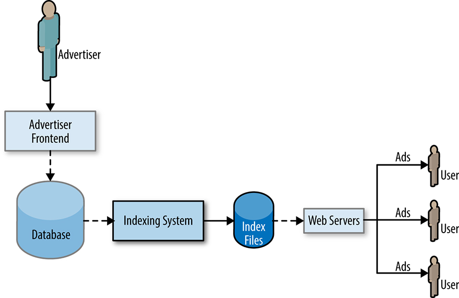

# Chương 31. Giao tiếp và Hợp tác trong SRE (Communication and Collaboration in SRE)

> **Nguyên bản:** [Chapter 31 - Communication and Collaboration in SRE](https://sre.google/sre-book/communication-and-collaboration/)
> **Nguồn:** Google SRE Book (O'Reilly)
> **Bản dịch tiếng Việt** (Thực hiện bởi Đội ngũ R&D Softdreams)

---

*Tác giả:* Niall Murphy cùng Alex Rodriguez, Carl Crous, Dario Freni, Dylan Curley, Lorenzo Blanco, và Todd Underwood
*Biên tập:* Betsy Beyer

Vị thế tổ chức của SRE trong Google thú vị, và có các tác động đến cách chúng tôi giao tiếp và hợp tác.

Trước hết, phạm vi công việc và cách thức làm việc của SRE rất đa dạng. Chúng tôi có các đội hạ tầng, đội dịch vụ và đội sản phẩm ngang (horizontal). Mối quan hệ với các đội phát triển sản phẩm cũng rất khác nhau: có những đội lớn gấp nhiều lần so với chúng tôi, có những đội có quy mô tương đương, và cũng có trường hợp chúng tôi *chính là* đội phát triển sản phẩm. Thành viên các đội SRE thường có kỹ năng về hệ thống hoặc kiến trúc (xem [[Hix15b]](https://sre.google/sre-book/bibliography#Hix15b)), kỹ năng phát triển phần mềm, kỹ năng quản lý dự án, tố chất lãnh đạo, xuất thân từ nhiều ngành nghề khác nhau (xem [Bài học Rút ra từ Các ngành khác](https://sre.google/sre-book/lessons-learned/)), v.v. Chúng tôi không áp dụng duy nhất một mô hình nào, mà đã tìm thấy nhiều cấu hình hoạt động hiệu quả; sự linh hoạt này rất phù hợp với bản chất thực dụng của SRE.

Đúng là SRE không phải một tổ chức kiểu ra lệnh và kiểm soát (command-and-control). Nhìn chung, chúng tôi phải trung thành với ít nhất hai "ông chủ": đối với các [đội SRE](https://sre.google/sre-book/part-II-principles/) dịch vụ hoặc hạ tầng, chúng tôi phối hợp chặt chẽ với các đội phát triển sản phẩm tương ứng đang phụ trách các dịch vụ hoặc hạ tầng đó; đồng thời, chúng tôi cũng hoạt động trong bối cảnh của SRE nói chung. Mối quan hệ với dịch vụ rất gắn bó, bởi chúng tôi chịu trách nhiệm về hiệu năng của các hệ thống đó, nhưng bất chấp điều này, tuyến báo cáo thực tế của chúng tôi vẫn đi qua SRE nói chung. Hiện tại, chúng tôi dành nhiều thời gian hơn cho việc hỗ trợ các dịch vụ riêng lẻ thay vì công việc production chéo, nhưng văn hóa và các giá trị chung đã tạo nên cách tiếp cận rất đồng nhất đối với các vấn đề. Đây là điều được thiết kế từ đầu.[1](#fn1)

Hai thực tế trước đó đã định hình cách tổ chức SRE vận hành trên hai khía cạnh then chốt: giao tiếp và hợp tác. Luồng dữ liệu là một ẩn dụ tính toán rất phù hợp để mô tả cách chúng tôi giao tiếp: giống như dữ liệu phải luân chuyển quanh production, thông tin cũng phải chảy liên tục trong đội SRE — bao gồm dữ liệu về các dự án, trạng thái dịch vụ, production và tình trạng của từng cá nhân. Để đội hoạt động hiệu quả tối đa, luồng dữ liệu này phải chạy ổn định giữa các bên liên quan. Có thể hình dung điều này qua giao diện mà đội SRE phải thể hiện với các đội khác, chẳng hạn như một API. Tương tự API, thiết kế tốt là yếu tố sống còn cho hiệu suất; nếu API bị sai, việc sửa chữa sau đó có thể gây ra hậu quả rất nặng nề.

Ẩn dụ API-như-hợp đồng cũng gắn liền với sự hợp tác, cả giữa các đội SRE lẫn giữa SRE và các đội phát triển sản phẩm — tất cả đều phải đạt được tiến bộ trong một môi trường thay đổi không ngừng. Ở mức độ đó, sự hợp tác của chúng tôi trông khá giống với sự hợp tác trong bất kỳ công ty phát triển nhanh nào khác. Điểm khác biệt nằm ở sự pha trộn các kỹ năng kỹ thuật phần mềm, chuyên môn kỹ thuật hệ thống và sự khôn ngoan từ kinh nghiệm production mà SRE mang vào quá trình hợp tác. Các thiết kế và triển khai tốt nhất ra đời khi những mối quan tâm chung về production và sản phẩm gặp nhau trong bầu không khí tôn trọng lẫn nhau. Đây là lời hứa của SRE: một tổ chức được giao trách nhiệm độ tin cậy, với cùng kỹ năng như các đội phát triển sản phẩm, sẽ cải thiện các chỉ số đo được. Kinh nghiệm của chúng tôi cho thấy đơn thuần có ai đó phụ trách độ tin cậy, mà không có cả bộ kỹ năng đầy đủ, là không đủ.

## Giao tiếp: Các Cuộc họp Production (Communications: Production Meetings)

Tài liệu về cách điều hành cuộc họp hiệu quả thì nhiều [[Kra08]](https://sre.google/sre-book/bibliography#Kra08), nhưng hiếm ai may mắn đến mức *chỉ* tham gia những cuộc họp hữu ích, hiệu quả. SRE cũng không ngoại lệ.

Tuy nhiên, có một loại cuộc họp mà chúng tôi thấy hữu ích hơn mức trung bình, được gọi là *cuộc họp production*. Đây là loại cuộc họp đặc biệt, trong đó một đội SRE cẩn thận trình bày cho chính mình — và cho những khách mời — trạng thái của các dịch vụ mà họ đang giám hộ, nhằm tăng nhận thức chung giữa tất cả những người quan tâm và cải thiện hoạt động của các dịch vụ. Nhìn chung, những cuộc họp này mang tính *hướng dịch vụ*; chúng không trực tiếp về các cập nhật trạng thái của các cá nhân. Mục tiêu là để mọi người rời cuộc họp với cùng một ý tưởng về điều gì đang xảy ra. Mục tiêu lớn khác là cải thiện các dịch vụ của chúng tôi bằng cách áp dụng sự khôn ngoan của production. Điều đó có nghĩa là chúng tôi nói chi tiết về hiệu năng vận hành của dịch vụ, liên kết hiệu năng vận hành đó với thiết kế, cấu hình hoặc triển khai, và đưa ra các khuyến nghị về cách sửa các vấn đề. Việc liên kết hiệu năng của dịch vụ với các quyết định thiết kế trong một cuộc họp định kỳ là một vòng lặp phản hồi (feedback loop) vô cùng mạnh mẽ.

Các cuộc họp production của chúng tôi thường diễn ra hàng tuần. Với sự ghét bỏ các cuộc họp vô ích của SRE, tần suất này có vẻ vừa phải đúng: đủ thời gian để tích lũy tài liệu liên quan, khiến cuộc họp đáng giá, mà không thường xuyên đến mức mọi người tìm lý do để không tham dự. Chúng thường kéo dài khoảng 30 đến 60 phút. Ít hơn, có lẽ bạn đang cắt ngắn điều gì đó không cần thiết, hoặc có lẽ nên mở rộng danh mục dịch vụ của mình. Nhiều hơn, có lẽ bạn đang lún sâu vào chi tiết, hoặc có quá nhiều điều để nói và nên chia shard (chẻ nhỏ) đội hoặc tập hợp dịch vụ.

Giống như bất kỳ cuộc họp nào khác, cuộc họp production cần có một chủ tọa. Nhiều đội SRE luân phiên giao việc này cho các thành viên, giúp mọi người cảm thấy mình có vai trò trong dịch vụ và mang lại một phần cảm giác sở hữu đối với các vấn đề. Dù không phải ai cũng có kỹ năng chủ tọa tương đương, nhưng giá trị của tinh thần sở hữu nhóm đủ lớn để bù đắp cho sự kém tối ưu tạm thời. Hơn nữa, đây là cơ hội tốt để rèn luyện kỹ năng chủ tọa, vốn rất hữu ích trong các tình huống phối hợp xử lý incident mà SRE thường gặp.

Khi hai đội SRE họp qua video và quy mô chênh lệch đáng kể, chúng tôi nhận thấy một động lực thú vị. Theo khuyến nghị, chủ tọa nên thuộc về phía *nhỏ hơn* của cuộc gọi. Phía lớn hơn thường có xu hướng im lặng, và việc này giúp giảm bớt một số tác động tiêu cực do sự mất cân bằng về kích thước đội (vốn đã bị làm trầm trọng thêm bởi độ trễ cố hữu của hội nghị video).[2](#fn2) Chúng tôi không rõ kỹ thuật này có cơ sở khoa học hay không, nhưng thực tế nó thường hiệu quả.

## Lịch trình (Agenda)

Có nhiều cách để điều hành một cuộc họp production, phản ánh sự đa dạng trong phạm vi SRE phụ trách cũng như cách chúng tôi triển khai. Ở mức độ này, không nên quy định cứng cách điều hành cho từng cuộc họp. Tuy nhiên, một lịch trình mặc định (xem [Phút ghi Hội họp Production Ví dụ](https://sre.google/sre-book/production-meeting/) để tham khảo) có thể như sau:

Các thay đổi production sắp tới

Các cuộc họp theo dõi thay đổi đã trở nên phổ biến trong toàn ngành, và thực tế, các cuộc họp này thường được tổ chức nhằm mục đích tạm dừng thay đổi. Tuy nhiên, trong môi trường production của chúng tôi, mặc định là cho phép thay đổi, điều này đòi hỏi phải theo dõi một tập hợp các thuộc tính hữu ích của thay đổi đó: thời gian bắt đầu, thời lượng, hiệu ứng được kỳ vọng, và vân vân. Đây là khả năng nhìn thấy ở chân trời gần.

#### Metrics (Các chỉ số)

Một trong những cách chính để tiến hành thảo luận theo hướng dịch vụ là xem xét các metrics cốt lõi của hệ thống đang bàn; xem [Service Level Objectives](https://sre.google/sre-book/service-level-objectives/). Ngay cả khi hệ thống không gặp sự cố đáng kể trong tuần đó, việc nhận thấy tải (load) tăng dần (hoặc đột ngột!) trong suốt năm là điều rất phổ biến. Theo dõi sự thay đổi theo thời gian của các chỉ số độ trễ (latency), mức sử dụng CPU, v.v. có giá trị vô cùng lớn trong việc hình thành cảm nhận về giới hạn hiệu năng (performance envelope) của hệ thống.

Một số đội theo dõi mức sử dụng và hiệu quả tài nguyên, đây cũng là một chỉ báo hữu ích cho các thay đổi hệ thống chậm hơn, có lẽ gian ác hơn.

#### Các Outage (Mất dịch vụ)

Mục này giải quyết các vấn đề có kích thước xấp xỉ postmortem, và là một cơ hội không thể thiếu để học hỏi. Một phân tích postmortem tốt, như được thảo luận trong [Văn hóa Postmortem: Học hỏi từ Thất bại](https://sre.google/sre-book/postmortem-culture/), nên luôn luôn làm cho máu nóng chảy.

#### Các sự kiện gọi trực (page)

Đây là các lần gọi trực từ hệ thống giám sát (monitoring) của bạn, liên quan đến những vấn đề *có thể* đáng postmortem, nhưng thường thì không. Trong mọi trường hợp, nếu phần Outages tập trung vào bức tranh tổng thể của một outage, thì mục này lại đi vào góc nhìn chiến thuật: liệt kê các lần gọi trực, ai bị gọi, diễn biến sau đó, v.v. Mục này xoay quanh hai câu hỏi ngầm: cảnh báo đó có nên gọi trực theo cách nó đã làm không, và liệu nó có đáng để gọi trực không? Nếu câu trả lời cho câu hỏi thứ hai là không, hãy loại bỏ các lần gọi trực không thể hành động.

#### Các sự kiện không gọi trực (nonpaging events)

Thùng chứa này chứa ba mục:

-   *Một vấn đề mà lẽ ra đã nên gọi trực, nhưng không*. Trong những trường hợp này, bạn có lẽ nên điều chỉnh hệ thống giám sát để các sự kiện tương tự thực sự kích hoạt một cuộc gọi trực. Thường thì bạn gặp phải vấn đề khi đang cố sửa một thứ khác, hoặc nó liên quan đến một metric mà bạn đang theo dõi nhưng chưa có cảnh báo.
-   *Một vấn đề không đủ mức để gọi trực nhưng cần được chú ý*, chẳng hạn như hỏng dữ liệu (data corruption) có tác động thấp hoặc sự chậm chạp ở một chiều không hướng người dùng của hệ thống. Việc theo dõi công việc vận hành phản ứng cũng phù hợp trong trường hợp này.
-   *Một vấn đề không đáng để gọi trực hay đòi hỏi sự chú ý*. Nên loại bỏ những cảnh báo này, vì chúng tạo thêm tiếng ồn, khiến các kỹ sư xao nhãng khỏi những vấn đề thực sự cần được quan tâm.

Các action item (mục công việc) trước đó

Các cuộc thảo luận chi tiết trước đó thường dẫn đến những việc SRE cần làm — sửa cái này, giám sát cái kia, phát triển một hệ thống con để xử lý vấn đề khác. Theo dõi các cải tiến này cũng giống như trong bất kỳ cuộc họp nào khác: gán action item cho từng người và theo dõi tiến độ. Ít nhất, nên có một mục lịch trình rõ ràng đóng vai trò là nơi tổng hợp mọi việc còn lại. Việc giao việc nhất quán cũng là yếu tố xây dựng uy tín và niềm tin tuyệt vời. Không quan trọng việc giao được thực hiện như thế nào, chỉ cần nó *được* thực hiện.

## Sự Tham dự (Attendance)

Tất cả thành viên đội SRE liên quan đều phải tham dự. Điều này càng quan trọng nếu đội trải dài trên nhiều quốc gia và/hoặc múi giờ, vì đây là cơ hội chính để cả nhóm tương tác với nhau.

Các bên liên quan chính cũng nên tham dự cuộc họp này. Bất kỳ đội phát triển sản phẩm đối tác nào mà bạn có cũng nên tham dự. Một số đội SRE chia shard (chẻ nhỏ) cuộc họp của họ để các vấn đề chỉ-SRE được giữ trong nửa đầu; thực hành đó là ổn, miễn là mọi người, như đã nói trước đó, rời đi với cùng một ý tưởng về điều gì đang xảy ra. Đôi khi các đại diện từ các đội SRE khác có thể xuất hiện, đặc biệt nếu có một vấn đề chéo-đội lớn hơn để thảo luận, nhưng nói chung, đội SRE được thảo luận cùng các đội khác lớn nên tham dự. Nếu mối quan hệ của bạn như vậy mà bạn không thể mời các đối tác phát triển sản phẩm của bạn, bạn cần sửa mối quan hệ đó: có lẽ bước đầu tiên là mời một đại diện từ đội đó, hoặc tìm một trung gian tin cậy để ủy quyền truyền thông hoặc mô hình các tương tác lành mạnh. Có nhiều lý do tại sao các đội không hợp nhau, và một khối lượng lớn tài liệu viết về cách giải quyết vấn đề đó: thông tin này cũng áp dụng cho các đội SRE, nhưng quan trọng là mục tiêu cuối cùng của việc có một vòng lặp phản hồi từ vận hành được đáp ứng, hoặc một phần lớn giá trị của việc có một đội SRE bị mất.

Đôi khi, bạn sẽ có quá nhiều đội hoặc những người tham dự bận rộn nhưng cực kỳ quan trọng để mời. Có một số kỹ thuật bạn có thể sử dụng để xử lý những tình huống đó:

-   Các dịch vụ ít hoạt động hơn có thể chỉ cần một đại diện từ đội phát triển sản phẩm tham dự, hoặc đội này chỉ cam kết đọc và bình luận về biên bản ghi nhớ lịch trình.
-   Nếu đội phát triển production khá lớn, hãy đề cử một tập hợp con các đại diện.
-   Những người tham dự bận rộn nhưng vô cùng quan trọng có thể cung cấp phản hồi và/hoặc định hướng trước cho các cá nhân, hoặc sử dụng kỹ thuật lịch trình được điền trước (được mô tả tiếp theo).

Phần lớn các chiến lược họp mà chúng tôi đã thảo luận đều là lẽ thường, chỉ khác ở góc độ hướng dịch vụ. Điểm độc đáo giúp các cuộc họp vừa hiệu quả hơn, vừa cởi mở hơn chính là tận dụng tính năng hợp tác thời gian thực của Google Docs. Nhiều đội SRE duy trì một tài liệu (doc) như vậy, với địa chỉ được biết đến rộng rãi để bất kỳ ai trong bộ phận kỹ thuật cũng có thể truy cập. Việc có một tài liệu như vậy cho phép áp dụng hai thực hành tuyệt vời:

-   Điền trước lịch trình với các ý tưởng, bình luận, và thông tin "từ dưới lên."
-   Chuẩn bị lịch trình song song *và* trước là thực sự hiệu quả.

Hãy tận dụng tối đa các tính năng hợp tác nhiều người mà sản phẩm hỗ trợ. Không gì tuyệt hơn cảnh một chủ tọa cuộc họp gõ một câu, rồi ai đó chèn liên kết đến tài liệu nguồn trong ngoặc ngay sau khi họ gõ xong, và một người khác lại chỉnh sửa chính tả, ngữ pháp cho câu gốc. Cách làm việc này giúp mọi thứ hoàn thành nhanh hơn, đồng thời tạo cảm giác mỗi người đều có phần đóng góp vào kết quả chung của đội.

## Hợp tác trong SRE (Collaboration within SRE)

Rõ ràng, Google là một tổ chức đa quốc gia. Vì thành phần phản ứng khẩn cấp và vòng trực máy gọi trực (pager) của vai trò chúng tôi, chúng tôi có các lý do kinh doanh rất tốt để là một tổ chức phân tán, được tách ra bởi ít nhất một vài múi giờ. Tác động thực tế của sự phân tán này là chúng tôi có các định nghĩa rất lưu động cho "đội" so với, ví dụ, đội phát triển sản phẩm trung bình. Chúng tôi có các đội cục bộ, đội trên site, đội chéo châu lục, các đội ảo với đủ kích thước và sự nhất quán, và tất cả mọi thứ ở giữa. Điều này tạo ra một sự pha trộn hỗn loạn vui vẻ của các trách nhiệm, kỹ năng và cơ hội. Phần lớn các động lực tương tự có thể được kỳ vọng áp dụng cho bất kỳ công ty đủ lớn nào (mặc dù chúng có thể đặc biệt gay gắt cho các công ty công nghệ). Vì phần lớn sự hợp tác cục bộ không gặp trở ngại nào đặc biệt, trường hợp thú vị về mặt hợp tác là chéo-đội, chéo-site, xuyên một đội ảo, và tương tự.

Mô hình phân tán này cũng định hình cách các đội SRE thường được tổ chức. Vì *sứ mệnh tồn tại* (raison d'être) của chúng tôi là mang lại giá trị thông qua sự làm chủ kỹ thuật, và sự làm chủ kỹ thuật thường khó khăn, nên chúng tôi cố gắng tìm cách làm chủ một tập hợp con các hệ thống hoặc hạ tầng liên quan, nhằm giảm tải nhận thức. Chuyên môn hóa là một cách để đạt được mục tiêu này; tức là, đội X chỉ làm việc trên sản phẩm Y. Chuyên môn hóa có lợi, vì nó tạo cơ hội cao hơn cho sự làm chủ kỹ thuật được cải thiện, nhưng cũng có hại, vì nó dẫn đến sự ngăn cách (siloization) và thiếu hiểu biết về bức tranh tổng thể. Chúng tôi cố gắng xây dựng một hiến chương đội rõ ràng để định nghĩa điều gì mà một đội sẽ — và quan trọng hơn, sẽ *không* — hỗ trợ, nhưng không phải lúc nào cũng thành công.

## Thành phần Đội (Team Composition)

Đội ngũ SRE của chúng tôi sở hữu nhiều kỹ năng đa dạng, trải dài từ kỹ thuật hệ thống, kỹ thuật phần mềm cho đến tổ chức và quản lý. Về hợp tác, có thể khẳng định rằng cơ hội thành công — và thực ra gần như mọi khía cạnh khác — sẽ được cải thiện khi đội ngũ có sự đa dạng cao hơn. Nhiều bằng chứng cho thấy các đội đa dạng đơn thuần là các đội tốt hơn [[Nel14]](https://sre.google/sre-book/bibliography#Nel14). Tuy nhiên, việc điều hành một đội đa dạng đòi hỏi sự chú ý đặc biệt đến giao tiếp, các thiên kiến nhận thức (cognitive biases), v.v., những nội dung mà chúng tôi không thể đi sâu chi tiết ở đây.

Theo quy định chính thức, các đội SRE có ba vai trò: "tech lead" (TL), "manager" (quản lý, SRM) và "project manager" (quản lý dự án, còn gọi là PM, TPM, PgM). Một số người làm việc hiệu quả nhất khi các vai trò này có phạm vi trách nhiệm được định nghĩa rõ ràng; lợi ích chính là họ có thể đưa ra quyết định trong phạm vi của mình một cách nhanh chóng và an toàn. Ngược lại, những người khác lại phát huy tốt nhất trong môi trường linh hoạt hơn, nơi trách nhiệm thay đổi dựa trên quá trình thương lượng động. Nhìn chung, đội càng linh hoạt thì năng lực cá nhân càng được phát triển và khả năng thích ứng với tình huống mới càng cao — nhưng đổi lại, tần suất giao tiếp phải tăng lên do ít có thể mặc định chung về bối cảnh.

Dù các vai trò này được định nghĩa rõ ràng đến đâu, về cơ bản, tech lead vẫn chịu trách nhiệm cho hướng kỹ thuật của đội và có thể dẫn dắt theo nhiều cách khác nhau — từ việc cẩn thận bình luận code của mọi người, đến tổ chức các buổi trình bày định hướng hàng quý, cho đến xây dựng sự đồng thuận trong đội. Tại Google, các TL có thể đảm nhận gần như toàn bộ công việc của một quản lý, bởi các quản lý ở đây rất kỹ thuật; tuy nhiên, quản lý có hai trách nhiệm đặc thù mà TL không có: chức năng quản lý hiệu năng và vai trò đầu mối tổng hợp cho những vấn đề không ai khác xử lý. Các TL, SRM và TPM xuất sắc đều sở hữu bộ kỹ năng đầy đủ, sẵn sàng bắt tay vào tổ chức dự án, bình luận về doc thiết kế hoặc viết code khi cần.

## Các Kỹ thuật để Làm việc Hiệu quả (Techniques for Working Effectively)

Có một số cách để làm công việc kỹ thuật một cách hiệu quả trong SRE.

Nói chung, dự án do một người làm (singleton) thường thất bại, trừ khi người đó đặc biệt có tài hoặc vấn đề quá đơn giản. Muốn đạt được bất kỳ thành tựu đáng kể nào, bạn gần như bắt buộc phải có nhiều người. Vì vậy, kỹ năng hợp tác tốt cũng là điều cần thiết. Một lần nữa, đã có nhiều tài liệu viết về chủ đề này, và phần lớn trong số đó áp dụng được cho SRE.

Nói chung, SRE làm tốt đòi hỏi kỹ năng giao tiếp xuất sắc, nhất là khi bạn phải làm việc vượt ra ngoài phạm vi của đội cục bộ. Với các hợp tác ở xa, việc phối hợp hiệu quả xuyên múi giờ đòi hỏi hoặc là kỹ năng viết tuyệt vời, hoặc là phải đi lại nhiều để tạo ra những trải nghiệm trực tiếp — thứ có thể trì hoãn nhưng rốt cuộc vẫn cần thiết cho một mối quan hệ chất lượng cao. Ngay cả khi bạn viết rất tốt, theo thời gian bạn sẽ bị xem như chỉ là một địa chỉ email cho đến khi xuất hiện trực tiếp một lần nữa.

## Nghiên cứu Tình huống về Hợp tác trong SRE: Viceroy (Case Study of Collaboration in SRE: Viceroy)

Một ví dụ về hợp tác chéo-SRE thành công là dự án Viceroy, một framework và dịch vụ dashboard giám sát. Cách tổ chức hiện tại của SRE có thể khiến các nhóm tạo ra nhiều bản sao hơi khác nhau của cùng một phần công việc; vì nhiều lý do, các framework dashboard giám sát là mảnh đất màu mỡ đặc biệt cho sự sao chép công việc.[3](#fn3)

Nguyên nhân dẫn đến tình trạng rác thải nghiêm trọng — nhiều framework giám sát bị bỏ hoang nằm rải rác như những xác tàu đang cháy âm ỉ — khá đơn giản: mỗi đội được thưởng khi phát triển giải pháp riêng, việc làm việc ngoài ranh giới đội gặp nhiều khó khăn, và hạ tầng thường được cung cấp trên toàn SRE thường gần với một bộ công cụ (toolkit) hơn là một sản phẩm. Môi trường này khuyến khích các kỹ sư cá nhân dùng bộ công cụ để tạo ra một đống cháy khác thay vì sửa vấn đề cho số lượng người lớn nhất có thể (một nỗ lực do đó sẽ mất nhiều thời gian hơn).

## Sự Đến của Viceroy (The Coming of the Viceroy)

Viceroy thì khác. Dự án này khởi động năm 2012, khi một số nhóm bắt đầu xem xét cách chuyển sang Monarch, hệ thống giám sát mới của Google. SRE vốn cực kỳ bảo thủ với các hệ thống giám sát, nên Monarch hơi trớ trêu khi mất nhiều thời gian hơn để tạo được đà trong các nhóm SRE so với các nhóm không thuộc SRE. Tuy nhiên, không ai có thể phủ nhận rằng hệ thống giám sát kế thừa của chúng tôi, Borgmon (xem [Cảnh báo Thực tiễn từ Dữ liệu Chuỗi thời gian](https://sre.google/sre-book/practical-alerting/)), còn nhiều điểm cần cải thiện. Chẳng hạn, các bảng điều khiển của chúng tôi cồng kềnh do sử dụng một hệ thống mẫu HTML tùy chỉnh được xử lý đặc biệt, đầy rẫy các trường hợp biên kỳ lạ và khó kiểm thử. Vào thời điểm đó, Monarch đã đủ trưởng thành để được chấp nhận về nguyên tắc như giải pháp thay thế cho hệ thống kế thừa và đang được ngày càng nhiều nhóm trên Google áp dụng, nhưng hóa ra chúng tôi vẫn gặp vấn đề với các bảng điều khiển.

Những ai sớm thử dùng Monarch cho dịch vụ của mình đều nhận ra ngay rằng công cụ này thiếu hỗ trợ console, chủ yếu vì hai lý do:

-   Các console dễ thiết lập cho một dịch vụ nhỏ, nhưng không mở rộng tốt đến các dịch vụ với các console phức tạp.
-   Chúng cũng không hỗ trợ hệ thống giám sát kế thừa, làm cho việc chuyển sang Monarch rất khó khăn.

Vì thời điểm đó không có phương án khả thi nào khác để triển khai Monarch theo cách này, một số dự án riêng cho từng nhóm đã được khởi động. Khi ấy, các giải pháp phát triển thiếu sự phối hợp, thậm chí không có cơ chế theo dõi chéo giữa các nhóm (một vấn đề đã được khắc phục sau này), nên chúng tôi rốt cuộc lại làm trùng lặp. Trong suốt 12–18 tháng, nhiều nhóm từ Spanner, Ads Frontend (Mặt trước Quảng cáo) và hàng loạt dịch vụ khác đã khởi động nỗ lực của riêng mình (một ví dụ đáng chú ý là Consoles++). Cuối cùng, sự hợp lý đã lên ngôi khi các kỹ sư từ tất cả những nhóm đó nhận ra nỗ lực tương ứng của nhau. Họ quyết định làm điều hợp lý và hợp lực để tạo ra một giải pháp chung cho tất cả SRE. Như vậy, dự án Viceroy được sinh ra vào giữa năm 2012.

Đầu năm 2013, Viceroy bắt đầu thu hút sự chú ý của các nhóm vẫn đang dùng hệ thống kế thừa nhưng muốn thử nghiệm trước. Rõ ràng, các nhóm có dự án giám sát hiện tại quy mô lớn thì ít động lực chuyển sang hệ thống mới hơn: khó để những nhóm này biện minh cho việc từ bỏ chi phí bảo trì thấp của giải pháp đang dùng — vốn về cơ bản hoạt động ổn — để đổi lấy một thứ tương đối mới, chưa được chứng minh và đòi hỏi nhiều nỗ lực. Sự đa dạng đơn thuần của các yêu cầu đã khiến những nhóm này thêm do dự, ngay cả khi tất cả các dự án console giám sát đều chia sẻ hai yêu cầu chính:

-   Hỗ trợ các dashboard đã được tuyển chọn phức tạp
-   Hỗ trợ cả Monarch và hệ thống giám sát kế thừa

Mỗi dự án *cũng* có một tập hợp các yêu cầu kỹ thuật của riêng nó, phụ thuộc vào sở thích hoặc kinh nghiệm của tác giả. Ví dụ:

-   Nhiều nguồn dữ liệu bên ngoài các hệ thống giám sát cốt lõi
-   Định nghĩa các console bằng cấu hình (configuration) so với layout (bố cục) HTML rõ ràng
-   Không JavaScript so với sự áp dụng đầy đủ JavaScript với AJAX
-   Sử dụng đơn thuần nội dung tĩnh, để các console có thể được cache (lưu bộ nhớ đệm) trong trình duyệt

Dù một số yêu cầu này dai dẳng hơn những cái khác, nhìn chung chúng khiến việc gộp các nỗ lực trở nên khó khăn. Quả thực, dù nhóm Consoles++ quan tâm đến việc so sánh dự án của mình với Viceroy, cuộc xem xét ban đầu vào nửa đầu năm 2013 đã chỉ ra rằng những khác biệt cốt lõi giữa hai dự án đủ lớn để ngăn cản việc tích hợp. Khó khăn lớn nhất nằm ở chỗ Viceroy theo thiết kế không dùng nhiều JavaScript, trong khi Consoles++ gần như được viết hoàn toàn bằng JavaScript. Tuy nhiên, vẫn có một tia hy vọng khi hai hệ thống thực sự chia sẻ một số điểm tương đồng cơ bản:

-   Chúng sử dụng các cú pháp tương tự cho việc render (hiển thị) template HTML.
-   Cả hai đội đều chia sẻ một số mục tiêu dài hạn mà chưa bên nào bắt tay vào giải quyết. Chẳng hạn, cả hai hệ thống đều muốn cache dữ liệu giám sát và hỗ trợ một pipeline (luồng) ngoại tuyến để định kỳ tạo ra dữ liệu mà console có thể sử dụng, thay vì tạo theo yêu cầu vì cách đó quá tốn tính toán.

Cuối cùng, chúng tôi tạm gác cuộc thảo luận về console thống nhất. Tuy nhiên, đến cuối năm 2013, cả Consoles++ và Viceroy đều đã phát triển đáng kể. Khoảng cách kỹ thuật giữa hai hệ thống thu hẹp lại, bởi Viceroy bắt đầu dùng JavaScript để render các biểu đồ giám sát. Hai nhóm ngồi lại và nhận ra rằng việc tích hợp giờ đây dễ dàng hơn nhiều, chỉ còn là vấn đề phục vụ dữ liệu Consoles++ từ server Viceroy. Các nguyên mẫu tích hợp đầu tiên hoàn thành vào đầu năm 2014, chứng minh rằng hai hệ thống có thể vận hành tốt cùng nhau. Lúc này, cả hai nhóm đều sẵn sàng cam kết cho một nỗ lực chung. Vì Viceroy đã xây dựng được thương hiệu như một giải pháp giám sát chung, dự án kết hợp giữ nguyên tên Viceroy. Quá trình phát triển đầy đủ chức năng kéo dài vài quý, và đến cuối năm 2014, hệ thống kết hợp đã hoàn thành.

Việc hợp lực đã gặt hái những lợi ích to lớn:

-   Viceroy nhận được một loạt các nguồn dữ liệu và các client JavaScript để truy cập chúng.
-   Cơ chế biên dịch (compilation) JavaScript đã được viết lại để hỗ trợ các module (mô-đun) riêng biệt có thể chọn bao gồm. Điều này là thiết yếu để mở rộng hệ thống cho bất kỳ số lượng đội nào, mỗi đội có code JavaScript của riêng mình.
-   Consoles++ hưởng lợi từ nhiều cải tiến đang được tích cực triển khai cho Viceroy, chẳng hạn như việc thêm cache và pipeline dữ liệu nền của nó.
-   Tổng thể, tốc độ phát triển trên *một* giải pháp lớn hơn nhiều so với tổng của tất cả tốc độ phát triển của các dự án sao chép.

Cuối cùng, tầm nhìn tương lai chung chính là yếu tố then chốt giúp kết nối các dự án. Cả hai nhóm đều nhận thấy giá trị của việc mở rộng đội ngũ phát triển và cùng có lợi từ những đóng góp của nhau. Động lực tăng đến mức, vào cuối năm 2014, Viceroy được chính thức công bố là giải pháp giám sát chung cho tất cả SRE. Có lẽ rất đặc trưng cho Google, tuyên bố này không bắt buộc các nhóm phải áp dụng Viceroy; thay vào đó, nó khuyến nghị các nhóm nên dùng Viceroy thay vì tự viết một console giám sát khác.

## Các Thách thức (Challenges)

Mặc dù cuối cùng là thành công, Viceroy không phải không có khó khăn, và nhiều trong số đó nảy sinh do bản chất chéo-site của dự án.

Một khi đội Viceroy mở rộng được thiết lập, sự phối hợp ban đầu giữa các thành viên đội từ xa chứng tỏ là khó khăn. Khi gặp mọi người lần đầu tiên, các tín hiệu tinh tế trong viết và nói có thể bị hiểu sai, vì các phong cách truyền thông thay đổi đáng kể từ người này sang người khác. Vào đầu dự án, các thành viên đội không có mặt ở Mountain View cũng bỏ lỡ các cuộc thảo luận bàn nước đột xuất thường xảy ra ngay trước và sau các cuộc họp (mặc dù truyền thông kể từ đó đã cải thiện đáng kể).

Trong khi đội Viceroy cốt lõi vẫn khá ổn định, đội mở rộng của những người đóng góp khá biến động. Những người đóng góp có các trách nhiệm khác thay đổi theo thời gian, và do đó nhiều người có thể dành từ một đến ba tháng cho dự án. Như vậy, hồ người đóng góp nhà phát triển, vốn tự nhiên lớn hơn đội Viceroy cốt lõi, được đặc trưng bởi một lượng churn (chuyển đổi) đáng kể.

Mỗi khi có người mới tham gia dự án, họ đều phải được đào tạo về thiết kế tổng thể và cấu trúc hệ thống, điều này tốn một ít thời gian. Tuy nhiên, khi một SRE đóng góp cho chức năng cốt lõi của Viceroy rồi quay về nhóm của mình, họ trở thành chuyên gia cục bộ về hệ thống. Việc các chuyên gia Viceroy cục bộ này phân tán khắp nơi một cách không lường trước đã thúc đẩy việc sử dụng và áp dụng hệ thống nhiều hơn.

Khi nhân sự trong nhóm thay đổi, chúng tôi nhận thấy các đóng góp tự phát vừa hữu ích vừa gây tốn kém. Chi phí lớn nhất nằm ở việc làm loãng trách nhiệm sở hữu: sau khi một tính năng được giao và người phụ trách rời đi, tính năng đó dần không còn được hỗ trợ và thường bị bỏ rơi.

Hơn nữa, phạm vi của dự án Viceroy mở rộng theo thời gian. Nó có các mục tiêu tham vọng khi khởi động nhưng phạm vi ban đầu bị hạn chế. Tuy nhiên, khi phạm vi mở rộng, chúng tôi vật lộn để giao các tính năng cốt lõi đúng hạn, và phải cải thiện quản lý dự án, đặt ra một hướng rõ ràng hơn để đảm bảo dự án vẫn trên đường ray.

Cuối cùng, nhóm Viceroy nhận ra rằng việc hoàn toàn làm chủ một thành phần có những đóng góp đáng kể (quyết định) từ các site phân tán là điều rất khó. Ngay cả khi mọi người có thiện chí tốt nhất, họ vẫn thường chọn con đường ít trở ngại nhất: thảo luận vấn đề hoặc đưa ra quyết định cục bộ mà không liên hệ với các chủ sở hữu ở xa, điều này có thể dẫn đến xung đột.

## Các Khuyến nghị (Recommendations)

Bạn chỉ nên phát triển các dự án chéo-site khi bắt buộc, nhưng thường có những lý do tốt để làm vậy. Chi phí làm việc xuyên site là độ trễ cao hơn cho các hành động và đòi hỏi nhiều truyền thông hơn; lợi ích là — nếu bạn làm đúng các cơ chế — thông lượng (throughput) cao hơn nhiều. Dự án đơn-site cũng có thể mắc phải tình trạng không ai bên ngoài site đó biết bạn đang làm gì, nên có chi phí cho cả hai cách tiếp cận.

Đóng góp có động lực là điều đáng giá, nhưng không phải đóng góp nào cũng ngang nhau. Hãy đảm bảo người đóng góp thực sự cam kết, chứ không chỉ tham gia với mục tiêu tự hiện thực hóa mơ hồ (muốn gắn tên mình vào một dự án bóng bẩy; muốn code trên một dự án mới thú vị mà không cam kết bảo trì). Người đóng góp có mục tiêu cụ thể thường có động lực tốt hơn và sẽ bảo trì các đóng góp của họ tốt hơn.

Khi dự án phát triển, quy mô thường mở rộng và không phải lúc nào bạn cũng may mắn có được sự đóng góp từ những người trong đội cục bộ. Vì vậy, hãy cân nhắc kỹ lưỡng về cấu trúc dự án. Vai trò của các lãnh đạo dự án rất quan trọng: họ cung cấp tầm nhìn dài hạn, đảm bảo mọi công việc đều phù hợp với tầm nhìn đó và được ưu tiên đúng cách. Bạn cũng cần một cơ chế ra quyết định được thống nhất, và nên tối ưu hóa để đưa ra nhiều quyết định cục bộ hơn nếu mức độ đồng thuận và tin tưởng trong nhóm cao.

Với các dự án chéo-site, hãy áp dụng chiến lược "chia để trị" chuẩn mực: cắt nhỏ dự án thành các thành phần có kích thước hợp lý nhất có thể để giảm thiểu chi phí truyền thông, đồng thời đảm bảo mỗi thành phần có thể giao cho một nhóm nhỏ, tốt nhất là nằm trong cùng một site. Phân bổ các thành phần này cho các nhóm con của dự án và xác định rõ ràng các sản phẩm bàn giao cùng hạn chót. (Lưu ý đừng để định luật Conway làm biến dạng cấu trúc tự nhiên của phần mềm quá nhiều.)[4](#fn4)

Mục tiêu của một đội dự án sẽ hiệu quả nhất khi nó tập trung vào việc cung cấp một số chức năng hoặc giải quyết một số vấn đề. Cách tiếp cận này giúp các cá nhân làm việc trên một thành phần hiểu rõ kỳ vọng dành cho họ, đồng thời đảm bảo công việc chỉ được coi là hoàn tất khi thành phần đó đã được tích hợp hoàn toàn và đưa vào sử dụng trong dự án chính.

Rõ ràng, các thực hành kỹ thuật tốt nhất thông thường áp dụng cho các dự án hợp tác: mỗi thành phần cần có tài liệu thiết kế và được review với đội. Nhờ đó, mọi người trong đội có cơ hội cập nhật về các thay đổi, đồng thời có thể tác động và cải thiện thiết kế. Viết ra là một trong những kỹ thuật chính giúp bạn bù đắp khoảng cách vật lý và/hoặc logic — hãy tận dụng nó.

Các tiêu chuẩn rất quan trọng. Hướng dẫn phong cách code là một khởi đầu tốt, nhưng chúng thường mang tính chiến thuật nên chỉ là điểm xuất phát để thiết lập chuẩn mực cho đội. Mỗi khi có tranh luận về việc chọn phương án nào cho một vấn đề, hãy thảo luận kỹ với đội nhưng trong giới hạn thời gian nghiêm ngặt. Sau đó, chọn một giải pháp, tài liệu hóa nó và chuyển sang việc khác. Nếu không thể đạt được đồng thuận, cần chọn một trọng tài mà mọi người tôn trọng, rồi đơn thuần tiến về phía trước. Theo thời gian, bạn sẽ xây dựng được một tập hợp các thực hành tốt nhất, giúp người mới dễ dàng bắt kịp.

Cuối cùng, không gì thay thế được tương tác trực tiếp, dù một phần tương tác mặt-đối-mặt có thể được trì hoãn nhờ sử dụng tốt VC (hội nghị video) và giao tiếp viết hiệu quả. Nếu có thể, hãy để các lãnh đạo dự án gặp trực tiếp phần còn lại của đội. Khi thời gian và ngân sách cho phép, hãy tổ chức một hội nghị đỉnh (summit) để tất cả thành viên trong đội có cơ hội tương tác trực tiếp. Summit cũng là dịp lý tưởng để thảo luận về thiết kế và mục tiêu. Trong những trường hợp tính trung lập là yếu tố quan trọng, việc tổ chức summit tại một địa điểm trung lập sẽ giúp tránh để bất kỳ site nào có “lợi thế sân nhà.”

Cuối cùng, hãy chọn phong cách quản lý dự án phù hợp với trạng thái hiện tại của dự án. Ngay cả những dự án có mục tiêu tham vọng cũng thường khởi đầu nhỏ, nên chi phí phát sinh ban đầu sẽ tương đối thấp. Khi dự án mở rộng, việc điều chỉnh và thay đổi cách quản lý là điều hợp lý. Đến khi quy mô đủ lớn, bạn sẽ cần áp dụng quy trình quản lý dự án hoàn chỉnh.

## Hợp tác Bên ngoài SRE (Collaboration Outside SRE)

Như chúng tôi đã đề cập và [Mô hình Tham gia SRE đang Tiến hóa](https://sre.google/sre-book/evolving-sre-engagement-model/) thảo luận, sự hợp tác giữa tổ chức phát triển sản phẩm và SRE đạt hiệu quả cao nhất khi diễn ra sớm trong giai đoạn thiết kế, lý tưởng nhất là trước khi bất kỳ dòng code nào được commit. SRE có vị thế thuận lợi nhất để đưa ra các khuyến nghị về kiến trúc và hành vi phần mềm, những yếu tố mà việc bổ sung sau này thường rất khó khăn (nếu không muốn nói là bất khả thi). Việc có tiếng nói của SRE hiện diện trong phòng khi thiết kế hệ thống mới là điều tốt cho tất cả mọi người. Nhìn chung, chúng tôi sử dụng quy trình Objectives & Key Results (OKR) [[Kla12]](https://sre.google/sre-book/bibliography#Kla12) để theo dõi các công việc như vậy. Đối với một số đội dịch vụ, sự hợp tác này là trụ cột của công việc họ làm — theo dõi các thiết kế mới, đưa ra khuyến nghị, hỗ trợ triển khai và đưa chúng đến production.

## Nghiên cứu Tình huống: Chuyển DFP sang F1 (Case Study: Migrating DFP to F1)

Việc chuyển đổi các dịch vụ hiện có sang nền tảng mới là chuyện thường thấy tại Google. Các dự án này thường bao gồm việc di chuyển các thành phần dịch vụ sang công nghệ mới hoặc cập nhật chúng để hỗ trợ định dạng dữ liệu mới. Gần đây, với sự ra đời của các hệ quản trị cơ sở dữ liệu có khả năng mở rộng toàn cầu như Spanner [[Cor12]](https://sre.google/sre-book/bibliography#Cor12) và F1 [[Shu13]](https://sre.google/sre-book/bibliography#Shu13), Google đã triển khai một số dự án chuyển đổi quy mô lớn liên quan đến cơ sở dữ liệu. Một ví dụ tiêu biểu là việc chuyển cơ sở dữ liệu chính của DoubleClick for Publishers (DFP)[5](#fn5) từ MySQL sang F1. Cụ thể, một số tác giả của chương này phụ trách một phần của hệ thống phục vụ (xem [Hình 31-1](#hinh-31-1)). Hệ thống này liên tục trích xuất và xử lý dữ liệu từ cơ sở dữ liệu để tạo ra các file index (chỉ mục), sau đó nạp và phân phối chúng trên toàn thế giới. Hệ thống được triển khai trên nhiều datacenter (trung tâm dữ liệu), sử dụng khoảng 1.000 CPU và 8 TB RAM để index 100 TB dữ liệu mỗi ngày.

        

**Hình 31-1.** Một hệ thống phục vụ quảng cáo chung

Việc chuyển đổi này không hề đơn giản. Ngoài việc áp dụng công nghệ mới, nhóm còn refactor và đơn giản hóa đáng kể schema cơ sở dữ liệu, tận dụng khả năng của F1 trong việc lưu trữ và lập index dữ liệu protocol buffer ngay trong các cột bảng. Mục tiêu là hệ thống xử lý mới phải tạo ra đầu ra hoàn toàn giống hệt với hệ thống hiện tại. Nhờ đó, chúng tôi có thể giữ nguyên hệ thống phục vụ và, từ góc nhìn của người dùng, quá trình chuyển đổi diễn ra liền mạch. Một ràng buộc bổ sung là sản phẩm yêu cầu phải thực hiện chuyển đổi trực tiếp (live) mà không gây gián đoạn dịch vụ cho người dùng vào bất kỳ thời điểm nào. Để đáp ứng yêu cầu này, đội phát triển sản phẩm và đội SRE đã phối hợp chặt chẽ ngay từ đầu để xây dựng dịch vụ index mới.

Là các nhà phát triển chính, các đội phát triển sản phẩm thường am hiểu sâu hơn về Logic Kinh doanh (Business Logic — BL) của phần mềm, đồng thời cũng gần gũi hơn với các Product Manager (Quản lý Sản phẩm) và phần "nhu cầu kinh doanh" thực tế của sản phẩm. Ngược lại, các đội SRE thường có chuyên môn sâu hơn về các thành phần hạ tầng của phần mềm (ví dụ, các thư viện để giao tiếp với các hệ thống lưu trữ phân tán hoặc cơ sở dữ liệu), bởi vì SRE thường tái sử dụng cùng các khối xây dựng xuyên suốt các dịch vụ khác nhau, qua đó tích lũy được nhiều lưu ý và sắc thái giúp phần mềm chạy có khả năng mở rộng và đáng tin cậy theo thời gian.

Ngay từ đầu dự án chuyển đổi, nhóm phát triển sản phẩm và SRE đã nhận thức rõ cần phải phối hợp chặt chẽ hơn, nên họ tổ chức các cuộc họp hàng tuần để đồng bộ tiến độ. Trong trường hợp này, một phần các thay đổi BL phụ thuộc vào việc thay đổi hạ tầng. Vì vậy, dự án bắt đầu bằng thiết kế hạ tầng mới; các SRE, với kiến thức sâu rộng về trích xuất và xử lý dữ liệu ở quy mô lớn, đã dẫn dắt quá trình thiết kế này. Công việc bao gồm thiết kế cách trích xuất các bảng khác nhau từ F1, cách lọc và join (kết nối) dữ liệu, cách chỉ trích xuất dữ liệu đã thay đổi (thay vì toàn bộ cơ sở dữ liệu), cách duy trì hoạt động khi mất một số machine (máy) mà không ảnh hưởng đến dịch vụ, cách đảm bảo mức sử dụng tài nguyên tăng tuyến tính với lượng dữ liệu trích xuất, lập kế hoạch năng lực, cùng nhiều khía cạnh tương tự khác. Hạ tầng mới được đề xuất tương tự các dịch vụ khác vốn đã đang trích xuất và xử lý dữ liệu từ F1. Nhờ đó, chúng tôi có thể yên tâm về tính vững chắc của giải pháp và tái sử dụng các phần của hệ thống giám sát cũng như công cụ.

Trước khi tiếp tục phát triển hạ tầng mới này, hai SRE đã soạn một tài liệu thiết kế chi tiết. Sau đó, cả nhóm phát triển sản phẩm và SRE cùng xem xét kỹ tài liệu, điều chỉnh giải pháp để xử lý một số trường hợp biên, rồi thống nhất kế hoạch thiết kế. Kế hoạch này xác định rõ loại thay đổi mà hạ tầng mới sẽ mang lại cho BL. Chẳng hạn, chúng tôi thiết kế hạ tầng mới để chỉ trích xuất dữ liệu đã thay đổi, thay vì lặp lại việc trích xuất toàn bộ cơ sở dữ liệu; BL phải tính đến cách tiếp cận mới này. Sớm, chúng tôi định nghĩa các giao diện mới giữa hạ tầng và BL, nhờ đó nhóm phát triển sản phẩm có thể làm việc độc lập trên các thay đổi BL. Tương tự, nhóm phát triển sản phẩm cũng cập nhật cho SRE biết về các thay đổi BL. Tại những điểm tương tác (ví dụ, các thay đổi BL phụ thuộc vào hạ tầng), cấu trúc phối hợp này giúp chúng tôi nắm bắt các thay đổi đang diễn ra, từ đó xử lý nhanh chóng và chính xác.

Ở các giai đoạn sau của dự án, các SRE bắt đầu triển khai dịch vụ mới trong một môi trường kiểm thử mô phỏng chính xác môi trường production hoàn chỉnh. Bước này là thiết yếu để đo lường hành vi được kỳ vọng của dịch vụ — đặc biệt là hiệu năng và mức sử dụng tài nguyên — trong khi việc phát triển BL vẫn đang diễn ra. Nhóm phát triển sản phẩm sử dụng môi trường kiểm thử này để xác thực dịch vụ mới: index của các quảng cáo do dịch vụ cũ (chạy trong production) tạo ra phải khớp hoàn hảo với index do dịch vụ mới (chạy trong môi trường kiểm thử) tạo ra. Đúng như dự đoán, quy trình xác thực đã làm nổi bật các khác biệt giữa dịch vụ cũ và mới (do một số trường hợp biên trong định dạng dữ liệu mới), và nhóm phát triển sản phẩm đã giải quyết theo vòng lặp: cho mỗi quảng cáo, họ debug nguyên nhân của sự khác biệt và sửa BL tạo ra đầu ra sai. Trong khi đó, nhóm SRE bắt đầu chuẩn bị môi trường production: phân bổ các tài nguyên cần thiết trong một datacenter khác, thiết lập các quy trình và rule giám sát, và đào tạo các kỹ sư được chỉ định để on-call cho dịch vụ. Nhóm SRE cũng thiết lập một quy trình release cơ bản bao gồm xác thực, một task thường được hoàn thành bởi nhóm phát triển sản phẩm hoặc bởi các Release Engineer (Kỹ sư Phát hành) nhưng trong trường hợp cụ thể này được hoàn thành bởi các SRE để tăng tốc chuyển đổi.

Khi dịch vụ đã sẵn sàng, các SRE phối hợp với nhóm phát triển sản phẩm để lập kế hoạch triển khai và khởi động dịch vụ mới. Quá trình khởi động diễn ra suôn sẻ, không gây ra bất kỳ tác động nào mà người dùng có thể nhận thấy.

## Kết luận (Conclusion)

Do các đội SRE có tính phân tán toàn cầu, giao tiếp hiệu quả luôn là ưu tiên hàng đầu. Chương này đã đề cập đến các công cụ và kỹ thuật mà các đội SRE sử dụng để duy trì mối quan hệ hiệu quả với đội của mình cũng như với các đội đối tác khác.

Sự hợp tác giữa các đội SRE tuy có thách thức nhưng tiềm năng mang lại phần thưởng to lớn, chẳng hạn như cách tiếp cận chung cho các nền tảng để giải quyết vấn đề, giúp chúng tôi tập trung vào những vấn đề khó khăn hơn.

[1](#fn1) Và, như tất cả chúng ta đều biết, văn hóa đánh bại chiến lược mỗi lần: [[Mer11]](https://sre.google/sre-book/bibliography#Mer11).

[2](#fn2) Đội lớn hơn thường có xu hướng vô tình nói đè lên đội nhỏ hơn, khó kiểm soát hơn các cuộc trò chuyện bên gây xao nhãng, v.v.

[3](#fn3) Trong trường hợp cụ thể này, con đường đến địa ngục thực sự được lát bằng JavaScript.

[4](#fn4) Tức là, phần mềm có cùng cấu trúc như cấu trúc truyền thông của tổ chức tạo ra phần mềm — xem [*https://en.wikipedia.org/wiki/Conway's_law*](https://en.wikipedia.org/wiki/Conway%27s_law).

[5](#fn5) DoubleClick for Publishers là một công cụ để các nhà xuất bản quản lý các quảng cáo được phục vụ trên các website và trong các ứng dụng của họ.

---

Copyright © 2017 Google, Inc. Published by O'Reilly Media, Inc. Licensed under [CC BY-NC-ND 4.0](https://creativecommons.org/licenses/by-nc-nd/4.0/)
