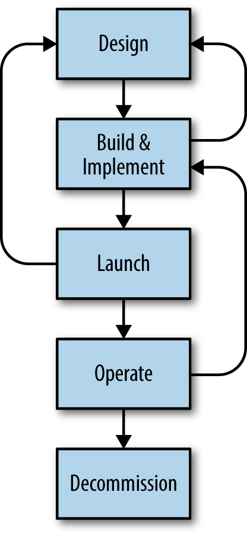

# Chương 32. Mô hình Tham gia SRE đang Tiến hóa (The Evolving SRE Engagement Model)

> **Nguyên bản:** [Chapter 32 - The Evolving SRE Engagement Model](https://sre.google/sre-book/evolving-sre-engagement-model/)
> **Nguồn:** Google SRE Book (O'Reilly)
> **Bản dịch tiếng Việt** (Thực hiện bởi Đội ngũ R&D Softdreams)

---

*Tác giả:* Acacio Cruz và Ashish Bhambhani
*Biên tập:* Betsy Beyer và Tim Harvey

## Tham gia SRE: Cái gì, Như thế nào, và Tại sao (SRE Engagement: What, How, and Why)

Chúng tôi đã thảo luận trong phần lớn cuốn sách này điều gì xảy ra khi SRE *đã* phụ trách một dịch vụ. Ít dịch vụ nào bắt đầu vòng đời của chúng mà được tận hưởng hỗ trợ SRE, nên cần một quy trình để đánh giá một dịch vụ, đảm bảo rằng nó xứng đáng với hỗ trợ SRE, thương lượng cách cải thiện bất kỳ khiếm khuyết nào ngăn cản hỗ trợ SRE, và thực sự thiết lập hỗ trợ SRE. Chúng tôi gọi quy trình này là *onboarding* (đưa vào). Nếu bạn ở trong một môi trường bị bao quanh bởi nhiều dịch vụ hiện có ở các trạng thái hoàn hảo khác nhau, đội SRE của bạn có lẽ sẽ chạy qua một hàng đợi onboarding được ưu tiên hóa trong một thời gian khá dài, cho đến khi đội hoàn thành việc tiếp nhận các mục tiêu giá trị cao nhất.

Mặc dù điều này rất phổ biến, và là một cách xử lý hoàn toàn hợp lý với một môi trường *đã thành sự thực* (fait accompli), nhưng thực ra có ít nhất hai cách tốt hơn để mang sự khôn ngoan của production, và hỗ trợ SRE, đến các dịch vụ cũ và mới như nhau.

Trong trường hợp đầu tiên, giống như trong kỹ thuật phần mềm — nơi càng sớm phát hiện bug thì càng rẻ để sửa — càng sớm một cuộc tham vấn của đội SRE xảy ra thì dịch vụ sẽ càng tốt và càng nhanh cảm nhận được lợi ích. Khi SRE tham gia trong các giai đoạn sớm nhất của *thiết kế*, thời gian để onboarding được giảm và dịch vụ đáng tin cậy hơn "ngay từ cửa xuất phát", thường là vì chúng tôi không phải dành thời gian tháo gỡ một thiết kế hoặc triển khai kém tối ưu.

Một cách khác, có lẽ tốt nhất, là ngắn mạch quy trình mà theo đó các hệ thống được tạo ra đặc biệt với nhiều biến thể cá nhân cuối cùng "đến" trước cửa SRE. Hãy cung cấp cho phát triển sản phẩm một *nền tảng* (platform) hạ tầng được SRE xác thực, mà trên đó họ có thể xây dựng các hệ thống của mình. Nền tảng này có lợi ích kép là vừa đáng tin cậy vừa có khả năng mở rộng (scalable). Điều này tránh hoàn toàn một số lớp các vấn đề tải nhận thức, và bằng cách giải quyết các thực hành hạ tầng chung, cho phép các đội phát triển sản phẩm tập trung vào đổi mới ở tầng ứng dụng, nơi mà nó chủ yếu thuộc về.

Trong các mục tiếp theo, chúng tôi sẽ dành một ít thời gian xem xét từng mô hình trong số này lần lượt, bắt đầu với cái "kinh điển," mô hình do PRR (Production Readiness Review — Đánh giá Sẵn sàng Production) dẫn dắt.

## Mô hình PRR (The PRR Model)

Bước khởi đầu điển hình nhất của [sự tham gia SRE](https://sre.google/sre-book/communication-and-collaboration/) là Production Readiness Review (PRR — Đánh giá Sẵn sàng Production), một quy trình xác định các nhu cầu độ tin cậy của một dịch vụ dựa trên các chi tiết cụ thể của nó. Thông qua một PRR, các SRE tìm cách áp dụng những gì họ đã học và trải nghiệm để đảm bảo độ tin cậy của một dịch vụ vận hành trong production. Một PRR được coi là tiên quyết cho một đội SRE chấp nhận trách nhiệm về [việc quản lý các khía cạnh production của một dịch vụ.](https://sre.google/sre-book/service-best-practices/)

[Hình 32-1](#hinh-32-1) minh họa vòng đời của một dịch vụ điển hình. Production Readiness Review có thể được bắt đầu ở bất kỳ điểm nào của vòng đời dịch vụ, nhưng các giai đoạn mà sự tham gia SRE được áp dụng đã mở rộng theo thời gian. Chương này mô tả Mô hình PRR Đơn giản, sau đó thảo luận làm thế nào việc biến đổi nó thành Mô hình Tham gia Mở rộng và cấu trúc Frameworks và Nền tảng SRE cho phép SRE mở rộng quy trình tham gia và tác động của họ.

        

**Hình 32-1.** Một vòng đời dịch vụ điển hình

## Mô hình Tham gia SRE (The SRE Engagement Model)

SRE tìm kiếm trách nhiệm production cho các dịch vụ quan trọng mà nó có thể đưa ra các đóng góp cụ thể cho độ tin cậy. SRE quan tâm đến một số khía cạnh của một dịch vụ, được gọi tập thể là *production*. Những khía cạnh này bao gồm:

-   Kiến trúc hệ thống và các phụ thuộc giữa các dịch vụ
-   Đo lường (instrumentation), metrics (chỉ số), và giám sát (monitoring)
-   Phản ứng khẩn cấp
-   Lập kế hoạch năng lực (capacity planning)
-   Quản lý thay đổi (change management)
-   Hiệu năng: khả dụng (availability), độ trễ (latency), và hiệu quả (efficiency)

Khi các SRE tham gia với một dịch vụ, chúng tôi nhắm đến việc cải thiện nó dọc theo tất cả các trục này, điều làm cho [việc quản lý production cho dịch vụ](https://sre.google/sre-book/production-environment/) dễ dàng hơn.

## Hỗ trợ Thay thế (Alternative Support)

Không phải tất cả các dịch vụ Google nhận được sự tham gia SRE chặt chẽ. Một số yếu tố đang diễn ra ở đây:

-   Nhiều dịch vụ không cần độ tin cậy và khả dụng cao, nên hỗ trợ có thể được cung cấp bằng các phương tiện khác.
-   Theo thiết kế, số lượng các đội phát triển yêu cầu hỗ trợ SRE vượt quá băng thông có sẵn của các đội SRE (xem [Giới thiệu](https://sre.google/sre-book/introduction/)).

Khi SRE không thể cung cấp hỗ trợ đầy đủ, nó cung cấp các lựa chọn khác để cải thiện production, chẳng hạn như tài liệu và tham vấn.

### Tài liệu (Documentation)

Các hướng dẫn phát triển có sẵn cho các công nghệ nội bộ và các client (khách hàng) của các hệ thống được sử dụng rộng rãi. Production Guide (Hướng dẫn Production) của Google tài liệu hóa [các thực hành tốt nhất production cho các dịch vụ](https://sre.google/sre-book/service-best-practices/), như được xác định bởi kinh nghiệm của cả các đội SRE và phát triển. Các nhà phát triển có thể triển khai các giải pháp và khuyến nghị trong các tài liệu như vậy để cải thiện các dịch vụ của họ.

### Tham vấn (Consultation)

Các nhà phát triển cũng có thể tìm kiếm tham vấn SRE để thảo luận về các dịch vụ hoặc lĩnh vực vấn đề cụ thể. Đội Launch Coordination Engineering (LCE — Kỹ thuật Phối hợp Ra mắt) (xem [Các Ra mắt Sản phẩm Đáng tin cậy ở Quy mô](https://sre.google/sre-book/reliable-product-launches/)) dành phần lớn thời gian của mình để tham vấn với các đội phát triển. Các đội SRE không đặc biệt dành riêng cho tham vấn ra mắt cũng tham gia tham vấn với các đội phát triển.

Khi một dịch vụ mới hoặc một tính năng mới đã được triển khai, các nhà phát triển thường tham vấn với SRE để xin lời khuyên về việc chuẩn bị cho giai đoạn Launch (Ra mắt). Tham vấn ra mắt thường bao gồm một hoặc hai SRE dành vài giờ nghiên cứu thiết kế và triển khai ở cấp cao. Các nhà tham vấn SRE sau đó gặp đội phát triển để cung cấp lời khuyên về các lĩnh vực rủi ro cần chú ý và để thảo luận các mẫu hoặc giải pháp được biết đến rộng rãi có thể được tích hợp để cải thiện dịch vụ trong production. Một số lời khuyên này có thể đến từ Production Guide được đề cập trước đó.

Các phiên tham vấn bắt buộc phải rộng về phạm vi vì không thể đạt được sự hiểu biết sâu sắc về một hệ thống nhất định trong thời gian hạn chế có sẵn. Đối với một số đội phát triển, tham vấn là không đủ:

-   Các dịch vụ đã tăng lên hàng bậc đại số kể từ khi chúng ra mắt, giờ đòi hỏi nhiều thời gian hơn để hiểu hơn là khả thi thông qua tài liệu và tham vấn.
-   Các dịch vụ mà nhiều dịch vụ khác sau đó đã dựa vào, giờ phục vụ đáng kể nhiều traffic (lưu lượng) hơn từ nhiều client khác nhau.

Những loại dịch vụ này có thể đã tăng đến mức bắt đầu gặp các khó khăn đáng kể trong production trong khi đồng thời trở nên quan trọng đối với người dùng. Trong những trường hợp như vậy, sự tham gia SRE dài hạn trở nên cần thiết để đảm bảo rằng chúng được duy trì đúng đắn trong production khi chúng tăng.

## Production Readiness Reviews: Mô hình PRR Đơn giản (Production Readiness Reviews: Simple PRR Model)

Khi một đội phát triển yêu cầu SRE tiếp nhận quản lý production của một dịch vụ, SRE đo lường cả tầm quan trọng của dịch vụ lẫn sự khả dụng của các đội SRE. Nếu dịch vụ xứng đáng với hỗ trợ SRE, và đội SRE cùng tổ chức phát triển đồng ý về mức độ nhân sự để tạo điều kiện cho hỗ trợ này, SRE khởi động một Production Readiness Review với đội phát triển.

Các mục tiêu của Production Readiness Review như sau:

-   Xác minh rằng một dịch vụ đáp ứng các tiêu chuẩn chấp nhận được về thiết lập production và sẵn sàng vận hành, và rằng các chủ sở hữu dịch vụ sẵn sàng làm việc với SRE và tận dụng chuyên môn SRE.
-   Cải thiện độ tin cậy của dịch vụ trong production, và giảm thiểu số lượng và mức độ nghiêm trọng của các incident (sự cố) mà có thể được kỳ vọng. Một PRR nhắm đến tất cả các khía cạnh production mà SRE quan tâm.

Sau khi đủ các cải tiến được thực hiện và dịch vụ được coi là sẵn sàng cho hỗ trợ SRE, một đội SRE tiếp nhận các trách nhiệm production của nó.

Điều này đưa chúng tôi đến chính quy trình Production Readiness Review. Có ba mô hình tham gia khác nhau nhưng liên quan (Mô hình PRR Đơn giản, Mô hình Tham gia Sớm, và Frameworks và Nền tảng SRE), mà sẽ được thảo luận lần lượt.

Chúng tôi trước tiên sẽ mô tả Mô hình PRR Đơn giản, thường nhắm đến một dịch vụ đã được ra mắt và sẽ được tiếp nhận bởi một đội SRE. Một PRR đi qua một số giai đoạn, khá giống như một vòng đời phát triển, mặc dù nó có thể tiến hành độc lập song song với vòng đời phát triển.

## Tham gia (Engagement)

Lãnh đạo SRE trước tiên quyết định đội SRE nào là một sự khớp tốt để tiếp nhận dịch vụ. Thường thì một đến ba SRE được chọn hoặc tự đề cử để tiến hành quy trình PRR. Nhóm nhỏ này sau đó khởi động thảo luận với đội phát triển. Cuộc thảo luận bao gồm các vấn đề như:

-   Thiết lập một SLO/SLA (mục tiêu/thỏa thuận mức dịch vụ) cho dịch vụ
-   Lập kế hoạch cho các thay đổi thiết kế có thể gây gián đoạn được yêu cầu để cải thiện độ tin cậy
-   Các lịch trình lập kế hoạch và đào tạo

Mục tiêu là đạt được một sự đồng ý chung về quy trình, các mục tiêu cuối cùng, và các kết quả cần thiết để đội SRE tham gia với đội phát triển và dịch vụ của họ.

## Phân tích (Analysis)

Phân tích là phân đoạn công việc lớn đầu tiên. Trong giai đoạn này, các người review SRE tìm hiểu về dịch vụ và bắt đầu phân tích nó để tìm các khiếm khuyết production. Họ nhắm đến việc đo lường sự trưởng thành của dịch vụ dọc theo các trục quan tâm khác nhau đối với SRE. Họ cũng xem xét thiết kế và triển khai của dịch vụ để kiểm tra xem nó có tuân theo các thực hành tốt nhất production hay không. Thường thì, đội SRE thiết lập và duy trì một checklist PRR rõ ràng riêng cho giai đoạn Phân tích. Checklist cụ thể cho dịch vụ và thường dựa trên chuyên môn lĩnh vực, kinh nghiệm với các hệ thống liên quan hoặc tương tự, và các thực hành tốt nhất từ Production Guide. Đội SRE cũng có thể tham vấn các đội khác có nhiều kinh nghiệm hơn với một số thành phần hoặc phụ thuộc nhất định của dịch vụ.

Một vài ví dụ về các mục checklist bao gồm:

-   Các cập nhật cho dịch vụ có ảnh hưởng đến một tỷ lệ phần trăm lớn một cách không hợp lý của hệ thống cùng một lúc không?
-   Dịch vụ có kết nối đến instance (bản chạy) phục vụ phù hợp của các phụ thuộc của nó không? Ví dụ, các yêu cầu của người dùng cuối đến một dịch vụ không nên phụ thuộc vào một hệ thống được thiết kế cho một use case (trường hợp sử dụng) xử lý batch (hàng loạt).
-   Dịch vụ có yêu cầu một chất lượng dịch vụ mạng đủ cao khi nói chuyện với một dịch vụ từ xa quan trọng không?
-   Dịch vụ có báo cáo các lỗi đến các hệ thống log (nhật ký) tập trung để phân tích không? Nó có báo cáo tất cả các điều kiện ngoại lệ dẫn đến các phản hồi suy giảm hoặc thất bại cho người dùng cuối không?
-   Tất cả các thất bại yêu cầu nhìn thấy được bởi người dùng có được đo lường và giám sát tốt, với các cảnh báo được cấu hình phù hợp không?

Checklist cũng có thể bao gồm các tiêu chuẩn và thực hành tốt nhất vận hành được tuân theo bởi một đội SRE cụ thể. Ví dụ, một cấu hình dịch vụ hoạt động hoàn hảo nhưng không tuân theo "tiêu chuẩn vàng" (gold standard) của một đội SRE có thể được refactor để hoạt động tốt hơn với các công cụ SRE, cho phép quản lý các cấu hình có khả năng mở rộng. Các SRE cũng xem xét các incident và postmortem gần đây cho dịch vụ, cũng như các task theo dõi cho các incident. Đánh giá này đo lường các đòi hỏi của phản ứng khẩn cấp cho dịch vụ và sự khả dụng của các biện pháp kiểm soát vận hành được thiết lập tốt.

## Cải tiến và Refactoring (Improvements and Refactoring)

Giai đoạn Phân tích dẫn đến việc xác định các cải tiến được khuyến nghị cho dịch vụ. Giai đoạn tiếp theo được tiến hành như sau:

1.  Các cải tiến được ưu tiên hóa dựa trên tầm quan trọng đối với độ tin cậy dịch vụ.
2.  Các ưu tiên được thảo luận và thương lượng với đội phát triển, và một kế hoạch thực thi được đồng ý.
3.  Cả hai đội SRE và phát triển sản phẩm đều tham gia và hỗ trợ nhau trong việc refactor các phần của dịch vụ hoặc triển khai các tính năng bổ sung.

Giai đoạn này thường thay đổi nhất về thời lượng và lượng nỗ lực. Bao nhiêu thời gian và nỗ lực mà giai đoạn này sẽ liên quan phụ thuộc vào sự khả dụng của thời gian kỹ thuật để refactor, sự trưởng thành và độ phức tạp của dịch vụ ở thời điểm bắt đầu review, và vô số các yếu tố khác.

## Đào tạo (Training)

Trách nhiệm quản lý một dịch vụ trong production thường được tiếp nhận bởi toàn bộ một đội SRE. Để đảm bảo rằng đội đã sẵn sàng, các người review SRE đã dẫn dắt PRR tiếp nhận trách nhiệm đào tạo đội, bao gồm tài liệu cần thiết để hỗ trợ dịch vụ. Thường thì với sự giúp đỡ và tham gia của đội phát triển, các kỹ sư này tổ chức một loạt các phiên và bài tập đào tạo. Hướng dẫn có thể bao gồm:

-   Các tổng quan thiết kế
-   Các đào sâu vào các luồng yêu cầu khác nhau trong hệ thống
-   Một mô tả về thiết lập production
-   Các bài tập thực hành cho các khía cạnh khác nhau của vận hành hệ thống

Khi đào tạo kết thúc, đội SRE nên đã sẵn sàng để quản lý dịch vụ.

## Onboarding (Đưa vào)

Giai đoạn Đào tạo mở khóa việc onboarding dịch vụ bởi đội SRE. Nó bao gồm một sự chuyển giao trách nhiệm và sở hữu tiến bộ của các khía cạnh production khác nhau của dịch vụ, bao gồm các phần của vận hành, quy trình quản lý thay đổi, các quyền truy cập, và vân vân. Đội SRE tiếp tục tập trung vào các khu vực production khác nhau được đề cập trước đó. Để hoàn tất sự chuyển đổi, đội phát triển phải có sẵn để dự phòng và cố vấn cho đội SRE trong một khoảng thời gian khi nó ổn định trong việc quản lý production cho dịch vụ. Mối quan hệ này trở thành nền tảng cho công việc liên tục giữa các đội.

## Cải tiến Liên tục (Continuous Improvement)

Các dịch vụ hoạt động thay đổi liên tục để đáp ứng các đòi hỏi và điều kiện mới, bao gồm các yêu cầu của người dùng về các tính năng mới, các phụ thuộc hệ thống tiến hóa, và các nâng cấp công nghệ, ngoài các yếu tố khác. Đội SRE phải duy trì các tiêu chuẩn độ tin cậy dịch vụ trước các thay đổi này bằng cách thúc đẩy cải tiến liên tục. Đội SRE chịu trách nhiệm tự nhiên học thêm về dịch vụ trong quá trình vận hành dịch vụ, xem xét các thay đổi mới, phản ứng với các incident, và đặc biệt là khi tiến hành các postmortem/phân tích nguyên nhân gốc rễ. Chuyên môn này được chia sẻ với đội phát triển như các đề xuất và đề nghị cho các thay đổi đối với dịch vụ bất cứ khi nào các tính năng, thành phần, và phụ thuộc mới có thể được thêm vào dịch vụ. Các bài học từ việc quản lý dịch vụ cũng được đóng góp vào các thực hành tốt nhất, được tài liệu hóa trong Production Guide và các nơi khác.

### Tham gia với Shakespeare (Engaging with Shakespeare)

Ban đầu, các nhà phát triển của dịch vụ Shakespeare chịu trách nhiệm cho sản phẩm, bao gồm việc mang pager cho phản ứng khẩn cấp. Tuy nhiên, với việc sử dụng dịch vụ tăng lên và sự tăng trưởng của doanh thu đến từ dịch vụ, hỗ trợ SRE trở nên mong muốn. Sản phẩm đã được ra mắt, nên SRE đã tiến hành một Production Readiness Review. Một trong những điều họ phát hiện là các dashboard không hoàn toàn bao phủ một số metrics được định nghĩa trong SLO, nên điều đó cần phải được sửa. Sau khi tất cả các vấn đề đã được khai báo được sửa, SRE tiếp nhận pager cho dịch vụ, mặc dù hai nhà phát triển cũng trong vòng on-call. Các nhà phát triển đang tham gia vào cuộc họp on-call hàng tuần thảo luận các vấn đề của tuần trước và cách xử lý các hoạt động bảo trì quy mô lớn hoặc turndown (giảm cấu hình) cluster sắp tới. Ngoài ra, các kế hoạch tương lai cho dịch vụ giờ được thảo luận với các SRE để đảm bảo rằng các ra mắt mới sẽ diễn ra hoàn hảo (mặc dù định luật Murphy luôn luôn tìm kiếm các cơ hội để phá hỏng điều đó).

## Tiến hóa Mô hình PRR Đơn giản: Tham gia Sớm (Evolving the Simple PRR Model: Early Engagement)

Cho đến nay, chúng tôi đã thảo luận Production Readiness Review theo cách nó được sử dụng trong Mô hình PRR Đơn giản, bị giới hạn ở các dịch vụ đã vào giai đoạn Launch (Ra mắt). Có một số giới hạn và chi phí liên quan đến mô hình này. Ví dụ:

-   Giao tiếp bổ sung giữa các đội có thể làm tăng một số chi phí phát sinh quy trình cho đội phát triển, và gánh nặng nhận thức cho các người review SRE.
-   Các người review SRE đúng phải có sẵn, và có khả năng quản lý thời gian và ưu tiên của họ đối với các sự tham gia hiện có của họ.
-   Công việc do các SRE thực hiện phải có tầm nhìn cao và được review đủ bởi đội phát triển để đảm bảo chia sẻ kiến thức hiệu quả. Các SRE về cơ bản nên làm việc như một phần của đội phát triển, chứ không phải một đơn vị bên ngoài.

Tuy nhiên, các giới hạn chính của Mô hình PRR bắt nguồn từ việc dịch vụ đã được ra mắt và đang phục vụ ở quy mô, và sự tham gia SRE bắt đầu rất muộn trong vòng đời phát triển. Nếu PRR xảy ra sớm hơn trong vòng đời dịch vụ, cơ hội của SRE để khắc phục các vấn đề tiềm năng trong dịch vụ sẽ tăng lên đáng kể. Kết quả là, thành công của sự tham gia SRE và thành công tương lai của chính dịch vụ có lẽ sẽ cải thiện. Các tác động kéo theo có thể đặt ra một thách thức đáng kể đối với thành công của sự tham gia SRE và thành công tương lai của chính dịch vụ.

## Các Ứng viên cho Tham gia Sớm (Candidates for Early Engagement)

Mô hình Tham gia Sớm giới thiệu SRE sớm hơn trong vòng đời phát triển để đạt được các lợi thế bổ sung đáng kể. Việc áp dụng Mô hình Tham gia Sớm đòi hỏi xác định tầm quan trọng và/hoặc giá trị kinh doanh của một dịch vụ sớm trong vòng đời phát triển, và xác định xem dịch vụ có đủ quy mô hoặc độ phức tạp để được hưởng lợi từ chuyên môn SRE hay không. Các dịch vụ áp dụng thường có các đặc điểm sau:

-   Dịch vụ triển khai các chức năng mới đáng kể và sẽ là một phần của một hệ thống hiện có đã được SRE quản lý.
-   Dịch vụ là một bản viết lại hoặc lựa chọn thay thế đáng kể cho một hệ thống hiện có, nhắm đến cùng các trường hợp sử dụng.
-   Đội phát triển đã tìm kiếm lời khuyên SRE hoặc tiếp cận SRE để tiếp nhận khi ra mắt.

Mô hình Tham gia Sớm về cơ bản đắm các SRE vào quy trình phát triển. Sự tập trung của SRE vẫn giữ như cũ, mặc dù các phương tiện để đạt được một dịch vụ production tốt hơn là khác nhau. SRE tham gia trong Thiết kế và các giai đoạn sau, cuối cùng tiếp nhận dịch vụ bất kỳ lúc nào trong hoặc sau giai đoạn Build (Xây dựng). Mô hình này dựa trên sự hợp tác chủ động giữa các đội phát triển và SRE.

## Các Lợi ích của Mô hình Tham gia Sớm (Benefits of the Early Engagement Model)

Trong khi Mô hình Tham gia Sớm liên quan đến một số rủi ro và thách thức đã được thảo luận trước đó, chuyên môn SRE và sự hợp tác bổ sung trong suốt vòng đời của sản phẩm tạo ra các lợi ích đáng kể so với một sự tham gia được khởi động muộn hơn trong vòng đời dịch vụ.

### Giai đoạn Thiết kế (Design phase)

Sự hợp tác SRE trong giai đoạn Thiết kế có thể ngăn chặn một loạt các vấn đề hoặc incident xảy ra sau này trong production. Trong khi các quyết định thiết kế có thể bị đảo ngược hoặc sửa chữa sau này trong vòng đời phát triển, những thay đổi như vậy đến với một chi phí cao về mặt nỗ lực và độ phức tạp. Các incident production tốt nhất là những cái không bao giờ xảy ra!

Đôi khi, các đánh đổi (trade-off) khó khăn dẫn đến việc chọn một thiết kế kém lý tưởng. Việc tham gia vào giai đoạn Thiết kế có nghĩa là các SRE nhận thức được các đánh đổi ngay từ đầu và là một phần của quyết định chọn một lựa chọn kém lý tưởng. Sự tham gia SRE sớm nhắm đến việc giảm thiểu các tranh chấp trong tương lai về các lựa chọn thiết kế một khi dịch vụ ở trong production.

### Xây dựng và triển khai (Build and implementation)

Giai đoạn Build giải quyết các khía cạnh production như đo lường (instrumentation) và metrics, các biện pháp kiểm soát vận hành và khẩn cấp, mức sử dụng tài nguyên, và hiệu quả. Trong giai đoạn này, SRE có thể ảnh hưởng và cải thiện triển khai bằng cách khuyến nghị các thư viện và thành phần hiện có cụ thể, hoặc giúp xây dựng một số biện pháp kiểm soát vào hệ thống. Sự tham gia của SRE ở giai đoạn này giúp tạo điều kiện cho sự dễ vận hành trong tương lai và cho phép SRE đạt được kinh nghiệm vận hành trước khi ra mắt.

### Ra mắt (Launch)

SRE cũng có thể giúp triển khai các mẫu và biện pháp kiểm soát ra mắt được sử dụng rộng rãi. Ví dụ, SRE có thể giúp triển khai một thiết lập "dark launch" (ra mắt tối), trong đó một phần traffic từ các người dùng hiện có được gửi đến dịch vụ mới, bên cạnh việc được gửi đến dịch vụ production trực. Các phản hồi từ dịch vụ mới là "tối" vì chúng bị vứt bỏ và không thực sự hiển thị cho người dùng. Các thực hành như ra mắt tối cho phép đội đạt được hiểu biết vận hành, giải quyết các vấn đề mà không ảnh hưởng đến các người dùng hiện có, và giảm rủi ro gặp các vấn đề sau ra mắt. Một ra mắt suôn sẻ vô cùng hữu ích trong việc giữ gánh nặng vận hành thấp và duy trì động lực phát triển sau ra mắt. Các gián đoạn xung quanh ra mắt dễ dàng dẫn đến các thay đổi khẩn cấp đối với code nguồn và production, và làm gián đoạn công việc của đội phát triển trên các tính năng tương lai.

### Sau ra mắt (Post-launch)

Việc có một hệ thống ổn định ở thời điểm ra mắt thường dẫn đến ít các ưu tiên xung đột hơn cho đội phát triển trong việc chọn giữa việc cải thiện độ tin cậy dịch vụ so với việc thêm các tính năng mới. Trong các giai đoạn sau của dịch vụ, các bài học từ các giai đoạn trước có thể thông tin tốt hơn cho việc refactor hoặc thiết kế lại.

Với sự tham gia mở rộng, đội SRE có thể sẵn sàng tiếp nhận dịch vụ mới sớm hơn nhiều so với cái mà có thể với Mô hình PRR Đơn giản. Sự tham gia dài hơn và chặt chẽ hơn giữa các đội SRE và phát triển cũng tạo ra một mối quan hệ hợp tác có thể được duy trì dài hạn. Một mối quan hệ chéo-đội tích cực nuôi dưỡng một cảm giác đoàn kết lẫn nhau, và giúp SRE thiết lập sự sở hữu của trách nhiệm production.

### Rút khỏi một dịch vụ (Disengaging from a service)

Đôi khi một dịch vụ không xứng đáng với quản lý đầy đủ của một đội SRE — sự xác định này có thể được thực hiện sau ra mắt, hoặc SRE có thể tham gia với một dịch vụ nhưng không bao giờ chính thức tiếp nhận nó. Đây là một kết quả tích cực, vì dịch vụ đã được kỹ thuật để đáng tin cậy và bảo trì thấp, và do đó có thể tiếp tục ở lại với đội phát triển.

Cũng có thể SRE tham gia sớm với một dịch vụ mà thất bại đạt đến các mức sử dụng được dự báo. Trong những trường hợp như vậy, nỗ lực SRE được dành ra đơn thuần là một phần của rủi ro kinh doanh tổng thể đi cùng với các dự án mới, và một chi phí nhỏ so với thành công của các dự án đạt đến quy mô được kỳ vọng. Đội SRE có thể được phân công lại, và các bài học học được có thể được tích hợp vào quy trình tham gia.

## Tiến hóa Phát triển Dịch vụ: Frameworks và Nền tảng SRE (Evolving Services Development: Frameworks and SRE Platform)

Mô hình Tham gia Sớm đã đạt được bước tiến trong việc tiến hóa sự tham gia SRE vượt ra ngoài Mô hình PRR Đơn giản, cái mà chỉ áp dụng cho các dịch vụ đã được ra mắt. Tuy nhiên, vẫn còn tiến bộ phải được thực hiện trong việc mở rộng sự tham gia SRE lên cấp độ tiếp theo bằng cách thiết kế cho độ tin cậy.

## Các Bài học Học được (Lessons Learned)

Theo thời gian, mô hình tham gia SRE được mô tả cho đến nay đã tạo ra một số mẫu riêng biệt:

-   Việc onboarding mỗi dịch vụ đòi hỏi hai hoặc ba SRE và thường kéo dài hai hoặc ba quý. Thời gian dẫn trước cho một PRR tương đối cao (vài quý). Mức nỗ lực yêu cầu tỷ lệ với số lượng dịch vụ được review, và bị ràng buộc bởi số lượng SRE không đủ có sẵn để tiến hành các PRR. Những điều kiện này dẫn đến việc tuần tự hóa việc tiếp nhận các dịch vụ và ưu tiên hóa dịch vụ nghiêm ngặt.
-   Do các thực hành phần mềm khác nhau giữa các dịch vụ, mỗi tính năng production được triển khai khác nhau. Để đáp ứng các tiêu chuẩn do PRR dẫn dắt, các tính năng thường phải được triển khai lại cụ thể cho mỗi dịch vụ hoặc, tốt nhất, một lần cho mỗi tập hợp con nhỏ các dịch vụ chia sẻ code. Những triển khai lại này là sự lãng phí nỗ lực kỹ thuật. Một ví dụ điển hình là việc triển khai các framework logging có chức năng tương tự lặp đi lặp lại bằng cùng một ngôn ngữ, vì các dịch vụ khác nhau không triển khai cùng cấu trúc code.
-   Một review các vấn đề và outage dịch vụ chung đã tiết lộ một số mẫu, nhưng không có cách nào dễ dàng nhân bản các sửa chữa và cải tiến xuyên qua các dịch vụ. Các ví dụ điển hình bao gồm các tình huống quá tải dịch vụ và việc hotspot (điểm nóng) dữ liệu.
-   Các đóng góp kỹ thuật phần mềm SRE thường là cục bộ cho dịch vụ. Do đó, việc xây dựng các giải pháp tổng quát để tái sử dụng là khó khăn. Hệ quả là, không có cách nào dễ dàng để triển khai các bài học mới mà từng đội SRE học được và các thực hành tốt nhất xuyên qua các dịch vụ đã được onboarding.

## Các Yếu tố Bên ngoài Ảnh hưởng đến SRE (External Factors Affecting SRE)

Các yếu tố bên ngoài truyền thống đã tạo áp lực lên tổ chức SRE và các tài nguyên của nó theo một số cách.

Google ngày càng theo xu hướng ngành chuyển sang microservices (vi dịch vụ).[1](#fn1) Kết quả là, cả số lượng các yêu cầu hỗ trợ SRE lẫn tính đa dạng (cardinality) của các dịch vụ cần hỗ trợ đều tăng. Vì mỗi dịch vụ có một chi phí vận hành cố định cơ bản, ngay cả các dịch vụ đơn giản cũng đòi hỏi nhiều nhân sự hơn. Các microservices cũng ngụ ý một kỳ vọng về thời gian dẫn trước triển khai thấp hơn, điều mà không thể với mô hình PRR trước đó (đã có thời gian dẫn trước là nhiều tháng).

Việc thuê các SRE có kinh nghiệm, đủ điều kiện là khó khăn và tốn kém. Bất chấp nỗ lực to lớn từ tổ chức tuyển dụng, không bao giờ có đủ SRE để hỗ trợ tất cả các dịch vụ cần chuyên môn của họ. Một khi các SRE được thuê, việc đào tạo của họ cũng là một quy trình dài hơn so với mức điển hình cho các kỹ sư phát triển.

Cuối cùng, tổ chức SRE chịu trách nhiệm phục vụ các nhu cầu của số lượng lớn các đội phát triển ngày càng tăng mà chưa được tận hưởng hỗ trợ SRE trực tiếp. Mệnh lệnh này đòi hỏi việc mở rộng mô hình hỗ trợ SRE vượt xa khái niệm và mô hình tham gia ban đầu.

## Hướng đến một Giải pháp Cấu trúc: Frameworks (Toward a Structural Solution: Frameworks)

Để phản ứng hiệu quả với những điều kiện này, đã cần thiết phải phát triển một mô hình cho phép các nguyên tắc sau:

Thực hành tốt nhất được mã hóa

Khả năng cam kết những gì hoạt động tốt trong production vào code, để các dịch vụ đơn thuần có thể sử dụng code này và trở nên "sẵn sàng production" theo thiết kế.

Các giải pháp có thể tái sử dụng

Các triển khai chung và dễ chia sẻ của các kỹ thuật được sử dụng để giảm nhẹ các vấn đề khả năng mở rộng và độ tin cậy.

Một nền tảng production chung với một bề mặt điều khiển chung

Các tập hợp các giao diện nhất quán đến các cơ sở production, các tập hợp các biện pháp kiểm soát vận hành nhất quán, và giám sát, logging, và cấu hình nhất quán cho tất cả các dịch vụ.

Tự động hóa dễ dàng hơn và các hệ thống thông minh hơn

Một bề mặt điều khiển chung cho phép tự động hóa và các hệ thống thông minh ở một cấp độ mà trước đây không thể. Ví dụ, các SRE có thể dễ dàng nhận được một góc nhìn duy nhất về thông tin liên quan cho một outage, thay vì thu thập và phân tích thủ công chủ yếu dữ liệu thô từ các nguồn khác nhau (log, dữ liệu giám sát, và vân vân).

Dựa trên các nguyên tắc này, một tập hợp các framework nền tảng và dịch vụ được SRE hỗ trợ đã được tạo ra, một cái cho mỗi môi trường mà chúng tôi hỗ trợ (Java, C++, Go). Các dịch vụ được xây dựng sử dụng các framework này chia sẻ các triển khai được thiết kế để hoạt động với nền tảng được SRE hỗ trợ, và được duy trì bởi cả các đội SRE và phát triển. Sự chuyển dịch chính được mang lại bởi các framework là cho phép các đội phát triển sản phẩm thiết kế các ứng dụng sử dụng giải pháp framework được xây dựng và được SRE chấp thuận, thay vì hoặc lắp ráp ứng dụng theo các quy định SRE sau này, hoặc lắp ráp nhiều SRE hơn để hỗ trợ một dịch vụ khác biệt đáng kể so với các dịch vụ Google khác.

Một ứng dụng thường bao gồm một số logic kinh doanh, mà đến lượt nó phụ thuộc vào các thành phần hạ tầng khác nhau. Các mối quan tâm production SRE chủ yếu tập trung vào các phần liên quan hạ tầng của một dịch vụ. Các framework dịch vụ triển khai code hạ tầng theo cách chuẩn hóa và giải quyết các mối quan tâm production khác nhau. Mỗi mối quan tâm được đóng gói trong một hoặc nhiều module framework, mỗi cái cung cấp một giải pháp nhất quán cho một lĩnh vực vấn đề hoặc phụ thuộc hạ tầng. Các module framework giải quyết các mối quan tâm SRE khác nhau được liệt kê trước đó, chẳng hạn như:

-   Đo lường (Instrumentation) và metrics
-   Request logging (ghi log yêu cầu)
-   Các hệ thống điều khiển liên quan đến quản lý traffic và tải

SRE xây dựng các module framework để triển khai các giải pháp chuẩn cho khu vực production được quan tâm. Kết quả là, các đội phát triển có thể tập trung vào logic kinh doanh, vì framework đã lo lắng về việc sử dụng hạ tầng đúng đắn.

Một framework về cơ bản là một triển khai quy định cho việc sử dụng một tập hợp các thành phần phần mềm và một cách chuẩn để kết hợp những thành phần này. Framework cũng có thể phơi bày các tính năng kiểm soát các thành phần khác nhau theo cách nhất quán. Ví dụ, một framework có thể cung cấp:

-   Logic kinh doanh được tổ chức như các thành phần ngữ nghĩa được định nghĩa rõ ràng có thể được tham chiếu bằng các thuật ngữ chuẩn
-   Các chiều chuẩn cho đo lường giám sát
-   Một định dạng chuẩn cho log debug yêu cầu
-   Một định dạng cấu hình chuẩn để quản lý việc loại bỏ tải (load shedding)
-   Năng lực của một server đơn lẻ và xác định "quá tải" mà cả hai đều có thể sử dụng một phép đo ngữ nghĩa nhất quán cho phản hồi đến các hệ thống điều khiển khác nhau

Các framework cung cấp nhiều lợi ích trước mắt về sự nhất quán và hiệu quả. Chúng giải phóng các nhà phát triển khỏi việc phải dán ghép và cấu hình các thành phần riêng lẻ theo cách cụ thể cho dịch vụ tùy hứng, theo những cách không tương thích dù chỉ một chút, mà sau đó phải được các SRE review thủ công. Chúng thúc đẩy một giải pháp tái sử dụng duy nhất cho các mối quan tâm production xuyên qua các dịch vụ, có nghĩa là người dùng framework kết thúc với cùng triển khai chung và các khác biệt cấu hình tối thiểu.

Google hỗ trợ một số ngôn ngữ chính cho phát triển ứng dụng, và các framework được triển khai xuyên qua tất cả những ngôn ngữ này. Trong khi các triển khai khác nhau của framework (chẳng hạn trong C++ so với Java) không thể chia sẻ code, mục tiêu là phơi bày cùng API (giao diện lập trình ứng dụng), hành vi, cấu hình, và các biện pháp điều khiển cho chức năng giống hệt nhau. Do đó, các đội phát triển có thể chọn nền tảng ngôn ngữ phù hợp với nhu cầu và kinh nghiệm của họ, trong khi các SRE vẫn có thể kỳ vọng cùng hành vi quen thuộc trong production và các công cụ chuẩn để quản lý dịch vụ.

## Các Lợi ích Dịch vụ Mới và Quản lý (New Service and Management Benefits)

Cách tiếp cận cấu trúc, được xây dựng trên các framework dịch vụ và một nền tảng production và bề mặt điều khiển chung, đã cung cấp một loạt các lợi ích mới.

### Chi phí phát sinh vận hành thấp hơn đáng kể (Significantly lower operational overhead)

Một nền tảng production được xây dựng trên các framework với các quy ước mạnh hơn đã giảm đáng kể chi phí phát sinh vận hành, vì các lý do sau:

-   Nó hỗ trợ các kiểm thử tuân thủ mạnh cho cấu trúc code, các phụ thuộc, các test, các hướng dẫn phong cách code, và vân vân. Tính năng này cũng cải thiện quyền riêng tư dữ liệu người dùng, kiểm thử, và tuân thủ bảo mật.
-   Nó có tính năng triển khai, giám sát, và tự động hóa dịch vụ tích hợp sẵn cho tất cả các dịch vụ.
-   Nó tạo điều kiện quản lý dễ dàng hơn cho một số lượng lớn các dịch vụ, đặc biệt là các micro-service, đang tăng về số lượng.
-   Nó cho phép triển khai nhanh hơn nhiều: một ý tưởng có thể trưởng thành đến chất lượng production cấp SRE được triển khai hoàn toàn trong một vài ngày!

### Hỗ trợ phổ quát theo thiết kế (Universal support by design)

Sự tăng trưởng liên tục về số lượng dịch vụ tại Google có nghĩa là phần lớn các dịch vụ này không thể xứng đáng với sự tham gia SRE cũng như không thể được SRE duy trì. Dù vậy, các dịch vụ không nhận được hỗ trợ SRE đầy đủ vẫn có thể được xây dựng để sử dụng các tính năng production được phát triển và duy trì bởi các SRE. Thực hành này hiệu quả phá vỡ rào cản nhân sự SRE. Việc cho phép các tiêu chuẩn và công cụ production được SRE hỗ trợ cho tất cả các đội cải thiện chất lượng dịch vụ tổng thể trên toàn Google. Hơn nữa, tất cả các dịch vụ được triển khai với các framework tự động được hưởng lợi từ các cải tiến được thực hiện theo thời gian cho các module framework.

### Các sự tham gia nhanh hơn, chi phí phát sinh thấp hơn (Faster, lower overhead engagements)

Cách tiếp cận framework kết quả trong việc thực hiện PRR nhanh hơn vì chúng tôi có thể dựa vào:

-   Các tính năng dịch vụ tích hợp sẵn như một phần của triển khai framework
-   Onboarding dịch vụ nhanh hơn (thường được hoàn thành bởi một SRE duy nhất trong một quý)
-   Gánh nặng nhận thức ít hơn cho các đội SRE quản lý các dịch vụ được xây dựng sử dụng các framework

Những thuộc tính này cho phép các đội SRE giảm nỗ lực đánh giá và xác nhận cho việc onboarding dịch vụ, trong khi duy trì một tiêu chuẩn cao về chất lượng production dịch vụ.

### Một mô hình tham gia mới dựa trên trách nhiệm chia sẻ (A new engagement model based on shared responsibility)

Mô hình tham gia SRE ban đầu chỉ trình bày hai lựa chọn: hoặc hỗ trợ SRE đầy đủ, hoặc xấp xỉ không có sự tham gia SRE.[2](#fn2)

Một nền tảng production với một cấu trúc dịch vụ, các quy ước, và hạ tầng phần mềm chung đã làm cho một đội SRE có thể cung cấp hỗ trợ cho hạ tầng "nền tảng", trong khi các đội phát triển cung cấp hỗ trợ on-call cho các vấn đề chức năng với dịch vụ — tức là, cho các bug trong code ứng dụng. Dưới mô hình này, các SRE tiếp nhận trách nhiệm cho việc phát triển và duy trì các phần lớn của hạ tầng phần mềm dịch vụ, đặc biệt là các hệ thống điều khiển như load shedding (loại bỏ tải), quá tải (overload), tự động hóa, quản lý traffic, logging, và giám sát.

Mô hình này đại diện cho một sự tách biệt đáng kể khỏi cách quản lý dịch vụ ban đầu được hình dung theo hai cách chính: nó liên quan đến một mô hình quan hệ mới cho sự tương tác giữa SRE và các đội phát triển, và một mô hình nhân sự mới cho quản lý dịch vụ được SRE hỗ trợ.[3](#fn3)

## Kết luận (Conclusion)

Độ tin cậy dịch vụ có thể được cải thiện thông qua sự tham gia SRE, trong một quy trình bao gồm việc review và cải thiện có hệ thống các khía cạnh production của nó. Cách tiếp cận có hệ thống đầu tiên như vậy của Google SRE, Simple Production Readiness Review (Đánh giá Sẵn sàng Production Đơn giản), đã đạt được bước tiến trong việc chuẩn hóa mô hình tham gia SRE, nhưng chỉ áp dụng được cho các dịch vụ đã vào giai đoạn Launch.

Theo thời gian, SRE đã mở rộng và cải thiện mô hình này. Mô hình Tham gia Sớm liên quan SRE sớm hơn trong vòng đời phát triển để "thiết kế cho độ tin cậy." Khi nhu cầu về chuyên môn SRE tiếp tục tăng, nhu cầu cho một mô hình tham gia có thể mở rộng hơn trở nên ngày càng rõ ràng. Các framework cho các dịch vụ production đã được phát triển để đáp ứng nhu cầu này: các mẫu code dựa trên các thực hành tốt nhất production đã được chuẩn hóa và đóng gói trong các framework, để việc sử dụng các framework trở thành một cách được khuyến nghị, nhất quán, và tương đối đơn giản để xây dựng các dịch vụ sẵn sàng production.

Cả ba mô hình tham gia được mô tả đều vẫn được thực hành trong Google. Tuy nhiên, việc áp dụng các framework đang trở thành một ảnh hưởng nổi bật trong việc xây dựng các dịch vụ sẵn sàng production tại Google cũng như mở rộng sâu sắc đóng góp SRE, giảm chi phí phát sinh quản lý dịch vụ, và cải thiện chất lượng dịch vụ cơ bản xuyên suốt tổ chức.

[1](#fn1) Xem trang Wikipedia về microservices tại [*https://en.wikipedia.org/wiki/Microservices*](https://en.wikipedia.org/wiki/Microservices).

[2](#fn2) Đôi khi, có các sự tham gia tham vấn bởi các đội SRE với một số dịch vụ chưa được onboarding, nhưng các tham vấn là một cách tiếp cận cố gắng hết sức và bị giới hạn về số lượng và phạm vi.

[3](#fn3) Mô hình mới của quản lý dịch vụ thay đổi mô hình nhân sự SRE theo hai cách: (1) vì nhiều công nghệ dịch vụ là chung, nó giảm số lượng SRE yêu cầu cho mỗi dịch vụ; (2) nó cho phép việc tạo ra các nền tảng production với sự tách biệt mối quan tâm giữa hỗ trợ nền tảng production (do các SRE thực hiện) và hỗ trợ logic kinh doanh cụ thể cho dịch vụ, cái mà tiếp tục ở lại với đội phát triển. Những nền tảng này được nhân sự dựa trên nhu cầu duy trì nền tảng chứ không phải trên số lượng dịch vụ, và có thể được chia sẻ xuyên qua các sản phẩm.

---

Copyright © 2017 Google, Inc. Published by O'Reilly Media, Inc. Licensed under [CC BY-NC-ND 4.0](https://creativecommons.org/licenses/by-nc-nd/4.0/)
